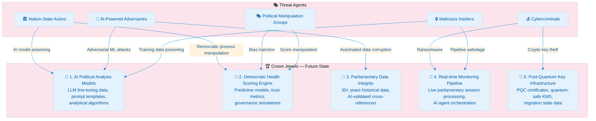
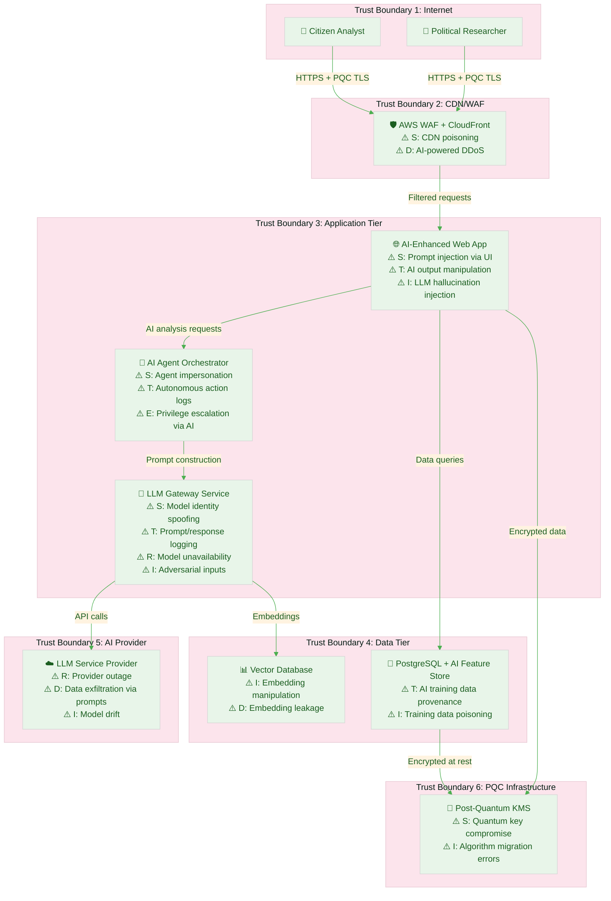
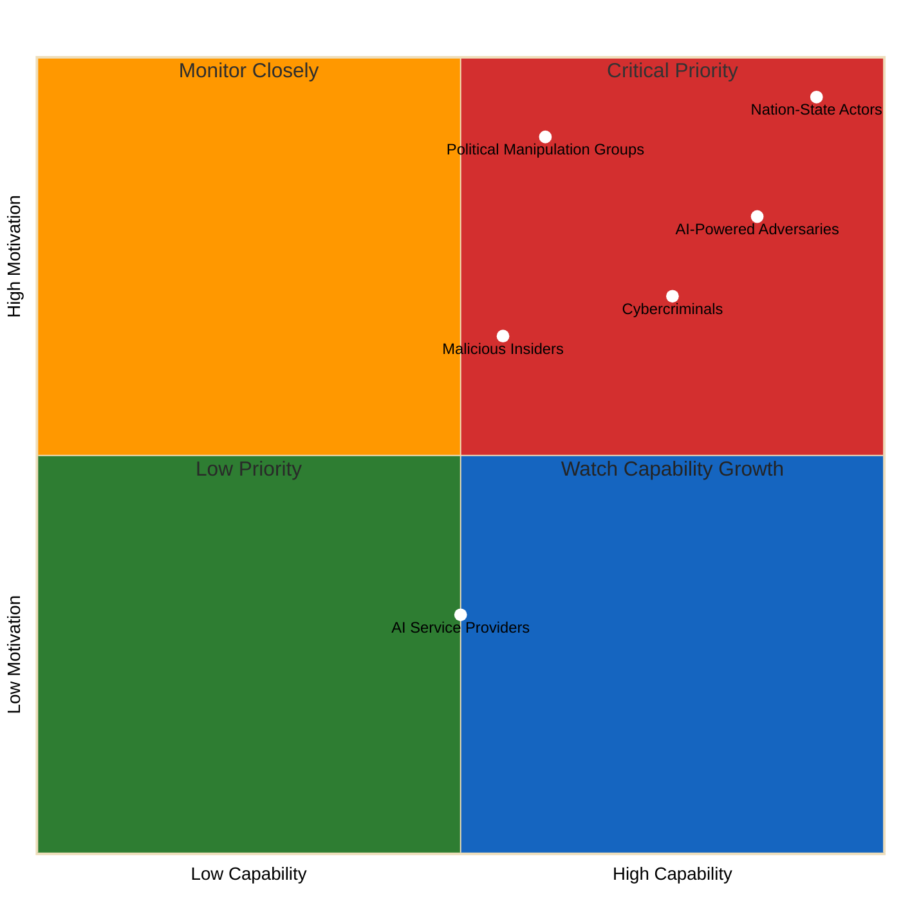
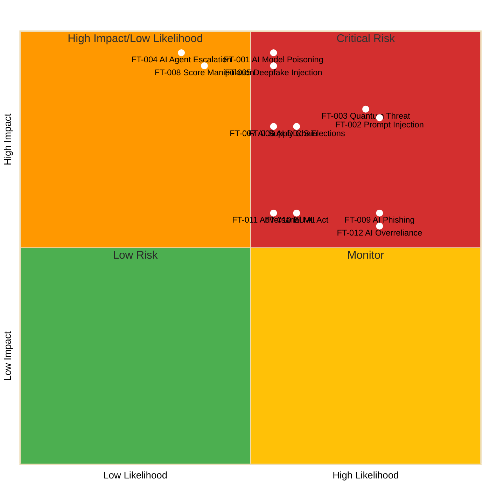
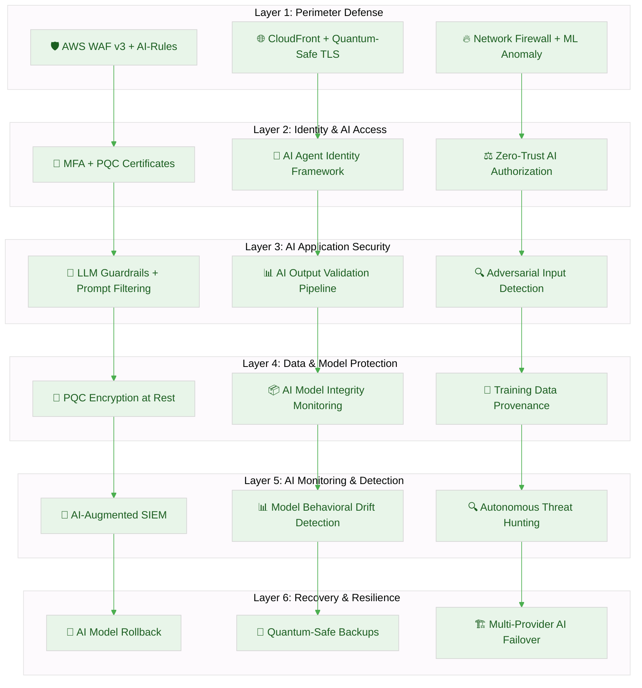
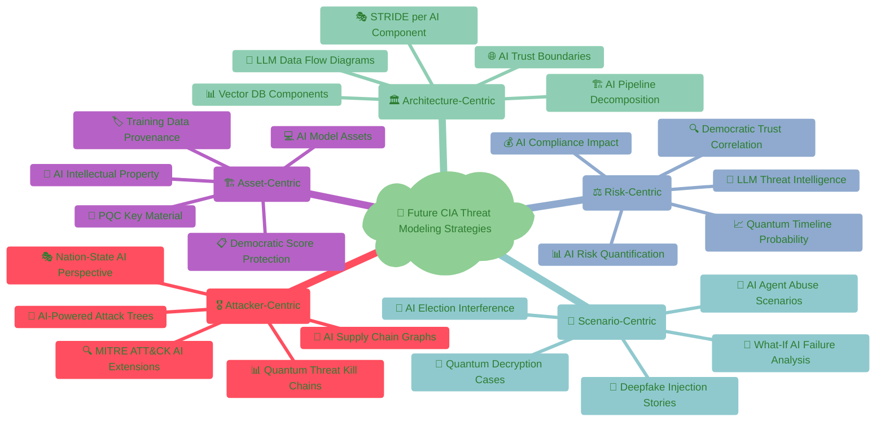

  

<h1 align="center">🎯 Citizen Intelligence Agency — Future Threat Model</h1>

  <strong>🛡️ AI-Enhanced Political Intelligence Security Through Structured Threat Analysis</strong> 
  <em>🔍 STRIDE • MITRE ATT&CK • AI/LLM Security • Post-Quantum • Democratic Resilience</em>

  
  
  
  

**📋 Document Owner:** CEO | **📄 Version:** 1.0 | **📅 Last Updated:** 2026-02-26 (UTC)  
**🔄 Review Cycle:** Annual | **⏰ Next Review:** 2027-02-26  
**🏷️ Classification:** Public (Open Civic Transparency Platform)

---

## 🎯 Purpose & Scope

Establish a comprehensive future-state threat model for the Citizen Intelligence Agency (CIA) platform as it evolves from the current Java/Spring/Vaadin monolith into an AI-enhanced political intelligence platform (2026–2037). This document systematically analyzes emerging threats arising from planned AI/LLM integration, post-quantum cryptography migration, autonomous analytics, and expanded democratic intelligence capabilities.

### **🌟 Transparency Commitment**

This future threat model demonstrates **🛡️ cybersecurity consulting expertise** through public documentation of advanced threat assessment methodologies for AI-enhanced civic platforms, showcasing our **🏆 competitive advantage** via proactive risk management and **🤝 customer trust** through transparent security practices.

_— Based on Hack23 AB's commitment to security through transparency and excellence_

### **📚 Framework Integration**

- **🎭 STRIDE per future architecture element:** Systematic threat categorization for AI-enhanced components
- **🎖️ MITRE ATT&CK mapping:** Advanced threat intelligence for emerging AI attack vectors
- **🏗️ Asset-centric analysis:** Critical resource protection for AI-processed political data
- **🎯 Scenario-centric modeling:** Real-world AI-enhanced attack simulation
- **⚖️ Risk-centric assessment:** Business impact quantification for evolving threat landscape

### **🔍 Scope Definition**

**Included Future Systems (2026–2037):**

- 🤖 LLM Service Layer (Anthropic Opus / competitor models for political text analysis)
- 🧠 AI-assisted OSINT correlation and trend detection
- 📊 Autonomous political analytics and risk assessment pipelines
- 🔐 Post-quantum cryptography migration (PQC)
- 🌐 Multi-modal content verification (deepfake detection)
- ⚡ Real-time parliamentary session monitoring (AI agents)
- 🗳️ Democratic health scoring and predictive governance modeling
- ☁️ Enhanced AWS infrastructure (AI security layer, quantum-resistant KMS)

**Out of Scope:**

- Current-state threats (covered in [THREAT_MODEL.md](./THREAT_MODEL.md))
- Third-party downstream consumers of published dashboards
- External data source security (Parliament API, Election Authority, World Bank)

### **🔗 Policy Alignment**

Integrated with:
- [🎯 Hack23 AB Threat Modeling Policy](https://github.com/Hack23/ISMS-PUBLIC/blob/main/Threat_Modeling.md) — STRIDE methodology
- [🛠️ Secure Development Policy](https://github.com/Hack23/ISMS-PUBLIC/blob/main/Secure_Development_Policy.md) — Security architecture requirements
- [🔒 Cryptography Policy](https://github.com/Hack23/ISMS-PUBLIC/blob/main/Cryptography_Policy.md) — Encryption standards & PQC migration
- [🌐 Network Security Policy](https://github.com/Hack23/ISMS-PUBLIC/blob/main/Network_Security_Policy.md) — Zero-trust architecture
- [🔑 Access Control Policy](https://github.com/Hack23/ISMS-PUBLIC/blob/main/Access_Control_Policy.md) — IAM and RBAC for AI systems

**Cross-References:**
- [🏗️ FUTURE_ARCHITECTURE.md](./FUTURE_ARCHITECTURE.md) — Platform evolution roadmap (2026–2037)
- [🛡️ FUTURE_SECURITY_ARCHITECTURE.md](./FUTURE_SECURITY_ARCHITECTURE.md) — Security controls roadmap
- [🎯 THREAT_MODEL.md](./THREAT_MODEL.md) — Current threat model
- [🔐 SECURITY_ARCHITECTURE.md](./SECURITY_ARCHITECTURE.md) — Current security implementation
- [📋 ISMS_COMPLIANCE_MAPPING.md](./ISMS_COMPLIANCE_MAPPING.md) — ISMS policy alignment

---

## 📚 Architecture Documentation Map

| Document | Focus | Description | Link |
|----------|-------|-------------|------|
| **[Architecture](ARCHITECTURE.md)** | 🏛️ Architecture | C4 model — current system | [View](https://github.com/Hack23/cia/blob/master/ARCHITECTURE.md) |
| **[Future Architecture](FUTURE_ARCHITECTURE.md)** | 🏛️ Architecture | C4 model — future system | [View](https://github.com/Hack23/cia/blob/master/FUTURE_ARCHITECTURE.md) |
| **[Security Architecture](SECURITY_ARCHITECTURE.md)** | 🛡️ Security | Current security controls | [View](https://github.com/Hack23/cia/blob/master/SECURITY_ARCHITECTURE.md) |
| **[Future Security Architecture](FUTURE_SECURITY_ARCHITECTURE.md)** | 🛡️ Security | Security roadmap 2026–2037 | [View](https://github.com/Hack23/cia/blob/master/FUTURE_SECURITY_ARCHITECTURE.md) |
| **[Threat Model](THREAT_MODEL.md)** | 🎯 Security | Current STRIDE/ATT&CK analysis | [View](https://github.com/Hack23/cia/blob/master/THREAT_MODEL.md) |
| **[Future Threat Model](FUTURE_THREAT_MODEL.md)** | 🎯 Security | Future threat landscape (this document) | [View](https://github.com/Hack23/cia/blob/master/FUTURE_THREAT_MODEL.md) |
| **[ISMS Compliance](ISMS_COMPLIANCE_MAPPING.md)** | 🔐 ISMS | Policy alignment mapping | [View](https://github.com/Hack23/cia/blob/master/ISMS_COMPLIANCE_MAPPING.md) |
| **[CRA Assessment](CRA-ASSESSMENT.md)** | 🛡️ Compliance | EU Cyber Resilience Act | [View](https://github.com/Hack23/cia/blob/master/CRA-ASSESSMENT.md) |
| **[Business Continuity Plan](BCPPlan.md)** | 📋 Resilience | RTO/RPO targets and recovery | [View](https://github.com/Hack23/cia/blob/master/BCPPlan.md) |
| **[Business Product Document](BUSINESS_PRODUCT_DOCUMENT.md)** | 💼 Business | Risk intelligence products | [View](https://github.com/Hack23/cia/blob/master/BUSINESS_PRODUCT_DOCUMENT.md) |

---

## 📊 System Classification & Operating Profile

### **🏷️ Future Security Classification Matrix**

| Dimension | Current Level | Future Level (2027+) | Rationale | Business Impact |
|----------|---------------|----------------------|-----------|----------------|
| **🔐 Confidentiality** |  |  | AI model weights, prompt templates, analytical algorithms become proprietary assets | AI intellectual property protection |
| **🔒 Integrity** |  |  | AI-generated political analysis must be tamper-proof; autonomous decisions require integrity guarantees | Democratic trust depends on AI output integrity |
| **⚡ Availability** |  |  | Real-time parliamentary monitoring and predictive analytics require continuous operation | Revenue protection and civic duty |

### **⚖️ Future Regulatory & Compliance Profile**

| Compliance Area | Current | Future (2027+) | Trigger |
|----------------|---------|----------------|---------|
| **🇪🇺 EU AI Act** | Not applicable | Medium-High | AI-powered political analysis classifies as high-risk AI system |
| **🇪🇺 CRA (Cyber Resilience Act)** | Low baseline | Medium | AI components increase software complexity and attack surface |
| **📋 GDPR** | Low (public data) | Medium | AI profiling of political figures may trigger data protection requirements |
| **🔐 NIS2** | Not applicable | Potentially applicable | Critical democratic infrastructure classification |
| **📊 SLA Targets** | 99.5% | 99.9% | Real-time monitoring requirements |
| **🔄 RPO / RTO** | RPO ≤ 24h / RTO ≤ 4h | RPO ≤ 1h / RTO ≤ 30min | AI-driven real-time analytics demand faster recovery |

---

## 💎 Future Critical Assets & Protection Goals

### **👑 Crown Jewel Analysis — Future State**

### **🏗️ Future Asset Inventory**

| Asset ID | Asset | CIA Classification | Future Threat Level | Attack Attractiveness |
|----------|-------|-------------------|--------------------|-----------------------|
| **FASSET-001** | AI/LLM Political Analysis Models | C: Medium, I: Critical, A: High |  | Very High — Unique political AI capability |
| **FASSET-002** | Democratic Health Scoring Data | C: Low, I: Critical, A: High |  | Very High — Influences public perception |
| **FASSET-003** | Prompt Engineering Templates | C: High, I: High, A: Medium |  | High — IP and attack vector |
| **FASSET-004** | Real-time Monitoring Pipelines | C: Low, I: High, A: Critical |  | High — Disruption target |
| **FASSET-005** | AI Agent Orchestration Layer | C: Medium, I: Critical, A: High |  | Very High — Autonomous actions |
| **FASSET-006** | Post-Quantum Key Material | C: Critical, I: Critical, A: High |  | Very High — Foundation of trust |
| **FASSET-007** | Cross-National Political Patterns DB | C: Low, I: High, A: Medium |  | Medium — Intelligence value |
| **FASSET-008** | AI Training Data (Political Corpus) | C: Medium, I: Critical, A: Medium |  | High — Poisoning target |
| **FASSET-009** | Predictive Governance Models | C: Medium, I: Critical, A: High |  | High — Democratic influence |
| **FASSET-010** | Quantum-Resistant TLS Certificates | C: High, I: Critical, A: High |  | Very High — Cryptographic trust |

---

## 🌐 Future Data Flow & Architecture Analysis

### **🏛️ Architecture-Centric STRIDE Analysis — Future State**

### **📊 Future STRIDE per Component Analysis**

| Component | **S** (Spoofing) | **T** (Tampering) | **R** (Repudiation) | **I** (Info Disclosure) | **D** (Denial of Service) | **E** (Elevation of Privilege) |
|-----------|:-:|:-:|:-:|:-:|:-:|:-:|
| **🤖 AI Agent Orchestrator** | Agent identity spoofing; rogue agents injected | Autonomous action tampering; decision manipulation | Missing AI decision audit trail | Model internals exposure via side channels | Agent overload; recursive loops | AI privilege escalation; unauthorized autonomous actions |
| **🧠 LLM Gateway Service** | Model identity spoofing; fake model responses | Prompt/response manipulation; adversarial inputs | Insufficient prompt logging | Training data extraction; prompt leakage | Provider rate limiting; model unavailability | Prompt injection enabling system access |
| **📊 Vector Database** | Embedding source spoofing | Embedding poisoning; similarity manipulation | Missing embedding provenance | Embedding inversion attacks | Index corruption; query overload | Embedding-based access bypass |
| **🔐 Post-Quantum KMS** | Quantum key impersonation | Algorithm substitution; key rotation tampering | Missing key lifecycle audit | Harvest-now-decrypt-later attacks | Key generation bottleneck | Key escalation; cross-tenant access |
| **🗳️ Democratic Health Scorer** | Score source falsification | Metric manipulation; weight tampering | Missing scoring audit trail | Algorithm disclosure; political bias exposure | Scoring pipeline overload | Administrative score override |
| **📡 Real-time Monitor** | False parliamentary event injection | Live data stream manipulation | Missing real-time audit trail | Session data leakage | Stream flooding; backpressure failure | Monitor-to-admin escalation |

---

## 🎖️ MITRE ATT&CK Framework Integration — Future Threats

### **🔍 Attacker-Centric Analysis — Emerging Techniques**

Following [MITRE ATT&CK-Driven Analysis](https://github.com/Hack23/ISMS-PUBLIC/blob/main/Threat_Modeling.md#mitre-attck-driven-analysis) methodology for future AI-enhanced attack vectors:

| Phase | Technique | ID | Future CIA Context | Control | Detection |
|-------|----------|----|-------------------|---------|-----------|
| **🔍 Initial Access** | Exploit Public-Facing AI Interface | [T1190: Exploit Public-Facing Application](https://attack.mitre.org/techniques/T1190/) | Prompt injection via political query interface | Input sanitization, prompt filtering, LLM guardrails | AI input monitoring, anomaly detection |
| **🔍 Initial Access** | Supply Chain Compromise: AI Models | [T1195.002: Compromise Software Supply Chain](https://attack.mitre.org/techniques/T1195/002/) | Poisoned LLM model update or fine-tuning data | Model provenance verification, SBOM for AI | Model integrity monitoring, behavioral drift detection |
| **⚡ Execution** | Serverless Execution (AI Functions) | [T1648: Serverless Execution](https://attack.mitre.org/techniques/T1648/) | Malicious code via AI agent orchestration | Agent sandboxing, action allowlisting | Agent behavior monitoring, execution auditing |
| **🔄 Persistence** | AI Model Backdoor | Emerging ¹ | Backdoor in fine-tuned political analysis model | Model scanning, adversarial testing | Output anomaly detection, baseline comparison |
| **⬆️ Privilege Escalation** | AI Agent Privilege Abuse | [T1068: Exploitation for Privilege Escalation](https://attack.mitre.org/techniques/T1068/) | AI agent exploits broad permissions for lateral access | Least-privilege AI roles, action boundaries | Permission monitoring, anomalous action alerts |
| **🎭 Defense Evasion** | Adversarial ML Evasion | [T1027: Obfuscated Files or Information](https://attack.mitre.org/techniques/T1027/) | Crafted inputs that bypass AI security classifiers | Ensemble detection models, adversarial training | Multi-model consensus, drift detection |
| **🔑 Credential Access** | AI-Generated Phishing | [T1566: Phishing](https://attack.mitre.org/techniques/T1566/) | LLM-generated targeted phishing of platform admins | AI-powered email analysis, MFA enforcement | AI-assisted phishing detection, behavioral analysis |
| **🔍 Discovery** | AI-Assisted Reconnaissance | [T1595: Active Scanning](https://attack.mitre.org/techniques/T1595/) | Automated discovery of API patterns and vulnerabilities | Rate limiting, honeypots, behavioral analysis | Traffic pattern analysis, reconnaissance detection |
| **📤 Exfiltration** | Prompt-Based Data Extraction | [T1041: Exfiltration Over C2 Channel](https://attack.mitre.org/techniques/T1041/) | Extracting training data or PII via crafted prompts | Output filtering, data loss prevention for AI | Response monitoring, PII detection in outputs |
| **💥 Impact** | AI Output Manipulation | [T1565: Data Manipulation](https://attack.mitre.org/techniques/T1565/) | Manipulating political analysis results to spread disinformation | Output validation, multi-source verification | Integrity checks, human review for critical outputs |
| **💥 Impact** | Harvest-Now-Decrypt-Later | Emerging ² | Harvest-now-decrypt-later of encrypted civic data | PQC migration, quantum-safe algorithms | Encryption audit, algorithm inventory monitoring |
| **💥 Impact** | Democratic Process Disruption | [T1499: Endpoint Denial of Service](https://attack.mitre.org/techniques/T1499/) | Coordinated attack during Swedish election periods | Election-period hardening, surge capacity | Election monitoring dashboard, threat escalation |

> **¹** AI Model Backdoor is an emerging threat without a direct MITRE ATT&CK mapping. Closest existing techniques: [T1195.003](https://attack.mitre.org/techniques/T1195/003/) (Supply Chain Compromise: Compromise Software Dependencies) and [T1554](https://attack.mitre.org/techniques/T1554/) (Compromise Host Software Binary).  
> **²** Harvest-Now-Decrypt-Later is an emerging quantum computing threat without a direct MITRE ATT&CK mapping. It involves intercepting and storing encrypted data today for future decryption when quantum computers become capable.

### **📊 Future ATT&CK Coverage Analysis**

#### **🎯 Coverage Heat Map by Tactic — Future State**

| Tactic | Current Coverage | Future Target | Priority Improvement Areas |
|--------|:---:|:---:|---|
| **🔍 Initial Access** | 18.2% | 35%+ | AI interface attacks, model supply chain |
| **⚡ Execution** | 2.0% | 15%+ | AI agent execution, serverless functions |
| **🔄 Persistence** | 1.5% | 12%+ | AI model backdoors, embedded biases |
| **⬆️ Privilege Escalation** | 3.6% | 15%+ | AI agent privilege abuse, autonomous escalation |
| **🎭 Defense Evasion** | 0.9% | 10%+ | Adversarial ML evasion, AI-assisted obfuscation |
| **🔑 Credential Access** | 1.5% | 12%+ | AI-generated phishing, quantum credential attacks |
| **🔍 Discovery** | 2.0% | 10%+ | AI-assisted reconnaissance, automated enumeration |
| **📤 Exfiltration** | 5.3% | 18%+ | Prompt-based extraction, AI channel exfiltration |
| **💥 Impact** | 15.2% | 30%+ | AI output manipulation, democratic disruption, quantum decryption |

### **🛡️ Future Security Control to ATT&CK Mitigation Mapping**

| Security Control | ATT&CK Mitigations | Techniques Addressed | Future Effectiveness |
|-----------------|--------------------|-----------------------|---------------------|
| **🤖 LLM Guardrails** | [M1031](https://attack.mitre.org/mitigations/M1031/) Network Intrusion Prevention | T1190, T1059, T1565 | 85% — Evolving with adversarial training |
| **🔐 PQC Migration** | [M1041](https://attack.mitre.org/mitigations/M1041/) Encrypt Sensitive Information | T1557, T1040 | 95% — Quantum-resistant foundation |
| **🤖 AI Agent Sandboxing** | [M1038](https://attack.mitre.org/mitigations/M1038/) Execution Prevention | T1648, T1068, T1195.003 | 80% — Requires continuous tuning |
| **📊 Model Integrity Monitoring** | [M1049](https://attack.mitre.org/mitigations/M1049/) Antivirus/Antimalware | T1195.002, T1195.003, T1027 | 75% — Emerging capability |
| **🔍 AI Output Validation** | [M1054](https://attack.mitre.org/mitigations/M1054/) Software Configuration | T1565, T1041, T1491 | 80% — Multi-model consensus |
| **🛡️ Election Period Hardening** | [M1030](https://attack.mitre.org/mitigations/M1030/) Network Segmentation | T1499, T1498, T1491 | 90% — Proven surge capability |

---

## 🎯 Kill Chain Disruption Analysis — Future Threats

### **🔗 Cyber Kill Chain × Defensive Controls — AI-Enhanced Platform**

Following [Hack23 AB Kill Chain Analysis](https://github.com/Hack23/ISMS-PUBLIC/blob/main/Threat_Modeling.md#attacker-centric-threat-modeling):

| Kill Chain Phase | Future Attack Examples | Primary Defense | Detection Capability | Response Action |
|-----------------|----------------------|-----------------|---------------------|-----------------|
| **1️⃣ Reconnaissance** | AI-assisted vulnerability scanning; automated API enumeration; LLM-powered OSINT on platform staff | Rate limiting, honeypots, minimal API surface | Traffic anomaly detection, behavioral analysis | Block source, alert SOC, update WAF rules |
| **2️⃣ Weaponization** | Adversarial prompt crafting; poisoned training datasets; AI-generated exploit code | Threat intelligence feeds, model scanning | Dark web monitoring, threat intelligence correlation | Update guardrails, patch models, alert team |
| **3️⃣ Delivery** | Prompt injection via political queries; malicious model updates; AI-generated phishing | Input validation, model provenance, email security | AI input monitoring, model integrity checks | Quarantine input, block delivery, investigate |
| **4️⃣ Exploitation** | LLM jailbreak; AI agent exploitation; vector DB manipulation | LLM guardrails, agent sandboxing, access controls | Runtime monitoring, anomaly detection | Isolate component, trigger incident response |
| **5️⃣ Installation** | AI model backdoor; persistent adversarial embeddings; compromised AI pipeline | Model integrity verification, pipeline security | Behavioral drift detection, output monitoring | Rollback model, purge embeddings, forensics |
| **6️⃣ Command & Control** | Steganographic C2 via AI outputs; AI agent misuse for lateral movement | Egress filtering, agent action logging, network segmentation | Outbound anomaly detection, agent behavior monitoring | Network isolation, agent termination, investigation |
| **7️⃣ Actions on Objectives** | Political analysis manipulation; democratic score tampering; data exfiltration via prompts | Output validation, integrity checks, DLP for AI | Multi-source verification, human review, data monitoring | Emergency shutdown, public notification, recovery |

---

## 📊 Comprehensive Threat Agent Analysis — Future State

### **🔍 Detailed Threat Actor Classification**

Following [Hack23 AB Threat Agent Classification](https://github.com/Hack23/ISMS-PUBLIC/blob/main/Threat_Modeling.md#threat-agent-classification) methodology:

| Threat Agent | Category | Future CIA Context | Capability (2027+) | Motivation | Priority MITRE Techniques | Risk Level |
|-------------|----------|-------------------|--------------------:|-----------|--------------------------|-----------|
| **🏛️ Nation-State Actors** | External | AI-enhanced political interference targeting Swedish democratic transparency | Very High — State-funded AI research | Political influence, democratic undermining | T1190, T1565, T1195.002 |  |
| **🤖 AI-Powered Adversaries** | External | Autonomous attack systems targeting AI components, adversarial ML | High — Off-the-shelf AI attack tools | Disruption, data theft, model manipulation | T1027, T1195.003, T1648 |  |
| **🎭 Political Manipulation Groups** | External | Organized campaigns to bias AI-generated political analysis | Medium-High — Social engineering + AI tools | Political agenda, election influence | T1566, T1565, T1491 |  |
| **💰 Cybercriminals** | External | Ransomware targeting AI infrastructure, crypto mining on AI compute | High — Ransomware-as-a-Service | Financial gain, extortion | T1486, T1496, T1499 |  |
| **🔒 Malicious Insiders** | Internal | AI training data poisoning, model backdoor insertion | Medium — Legitimate access + AI knowledge | Political bias, sabotage | T1195.003, T1565, T1485 |  |
| **🤝 AI Service Providers** | Third-party | Model supply chain compromise, training data contamination | Medium — API-level access | Accidental or targeted | T1195.002, T1078, T1040 |  |

### **📊 Threat Agent Capability Evolution**

---

## 🌐 Current & Future Threat Landscape Integration

### **📊 ENISA Threat Landscape 2024+ Application — Future State**

Implementing [ENISA Threat Landscape 2024](https://www.enisa.europa.eu/publications/enisa-threat-landscape-2024) extended with AI-specific threats:

| ENISA Priority | Threat Category | Future CIA Platform Context | Specific Scenarios | Mitigation Strategy |
|----------------|-----------------|---------------------------|-------------------|-------------------|
| **1️⃣** | **⚡ Availability Threats** | AI-enhanced DDoS against real-time political monitoring; LLM service disruption | Election-period AI service attacks; vector DB corruption | Multi-provider AI failover, surge capacity, circuit breakers |
| **2️⃣** | **🔐 Ransomware** | AI training data encryption; model ransom; quantum-enabled ransomware (2030+) | Critical AI model held hostage during election period | Immutable AI model backups, PQC-protected archives, air-gapped copies |
| **3️⃣** | **📊 Data Threats** | AI-assisted data manipulation; training data poisoning; political analysis tampering | Systematic bias injection into democratic health scores | AI output validation, multi-source verification, integrity checksums |
| **4️⃣** | **🦠 Malware** | AI-targeted malware; model backdoors; adversarial embedding payloads | Persistent malware in AI pipeline components | AI-specific antimalware, model scanning, pipeline integrity |
| **5️⃣** | **🎭 Social Engineering** | AI-generated deepfakes of platform staff; LLM-powered spear phishing | Targeted admin compromise via AI-crafted communications | AI-powered phishing detection, MFA, security awareness training |
| **6️⃣** | **📰 Information Manipulation** | AI-generated disinformation injected via platform; deepfake political content | Automated disinformation campaigns leveraging AI analysis | Multi-modal verification, deepfake detection, content provenance |
| **7️⃣** | **🔗 Supply Chain** | AI model supply chain attacks; compromised LLM providers; poisoned datasets | Trojanized model update from AI provider | Model provenance (AI SBOM), provider security assessment, behavioral monitoring |

### **🤖 AI-Specific Threat Landscape (OWASP LLM Top 10)**

| OWASP LLM Risk | Future CIA Impact | Likelihood | Mitigation |
|----------------|------------------|:----------:|------------|
| **LLM01: Prompt Injection** | Political analysis manipulation via crafted queries | High | Input sanitization, prompt templates, output validation |
| **LLM02: Insecure Output Handling** | Unvalidated AI output displayed as authoritative political analysis | High | Output encoding, multi-source verification, confidence scoring |
| **LLM03: Training Data Poisoning** | Systematic bias in political analysis from corrupted training data | Medium | Data provenance, validation pipelines, adversarial testing |
| **LLM04: Model Denial of Service** | AI analysis unavailable during critical political events | Medium | Rate limiting, multi-provider failover, caching |
| **LLM05: Supply Chain Vulnerabilities** | Compromised AI model or dependency | Medium | Model SBOM, provenance verification, behavioral monitoring |
| **LLM06: Sensitive Information Disclosure** | Leakage of internal political analysis methodologies via AI responses | Medium | Output filtering, PII detection, response boundaries |
| **LLM07: Insecure Plugin Design** | AI agent plugins accessing unauthorized political data | Low | Plugin sandboxing, permission boundaries, action logging |
| **LLM08: Excessive Agency** | AI agent making unauthorized changes to political analyses | Medium | Human-in-the-loop, action allowlisting, override controls |
| **LLM09: Overreliance** | Users trusting AI political analysis without verification | High | Confidence scoring, source attribution, disclaimer integration |
| **LLM10: Model Theft** | Theft of fine-tuned political analysis models | Low | Access controls, model encryption, usage monitoring |

---

## 🎯 Scenario-Centric Threat Modeling — Future State

### **📝 Future Misuse Cases**

Following [Hack23 AB Scenario-Centric Modeling](https://github.com/Hack23/ISMS-PUBLIC/blob/main/Threat_Modeling.md#scenario-centric-threat-modeling):

#### **Scenario F-1: AI-Powered Election Interference Campaign**

| Attribute | Detail |
|-----------|--------|
| **Threat Agent** | Nation-state actor with advanced AI capabilities |
| **Objective** | Manipulate CIA platform's political analysis to influence Swedish election outcomes |
| **Attack Vector** | 1. Poison training data via compromised open data sources → 2. Inject adversarial prompts through political query interface → 3. Manipulate democratic health scores during election period |
| **Impact** | Critical — Undermines democratic transparency, erodes public trust |
| **Likelihood** | Medium (2026), High (2030+) |
| **Current Controls** | Data validation, source integrity checks |
| **Future Controls Needed** | AI-specific adversarial testing, multi-model consensus, election-period AI lockdown |

#### **Scenario F-2: Harvest-Now-Decrypt-Later Attack on Political Data**

| Attribute | Detail |
|-----------|--------|
| **Threat Agent** | Nation-state actor with quantum computing investment |
| **Objective** | Collect encrypted political communications and analytical data for future quantum decryption |
| **Attack Vector** | 1. Intercept TLS-encrypted traffic containing political analysis → 2. Store for quantum decryption (2030–2035) → 3. Use decrypted political intelligence for influence operations |
| **Impact** | High — Future exposure of sensitive political analysis methodologies |
| **Likelihood** | High (collection now), Medium (decryption 2030+) |
| **Current Controls** | TLS 1.3 encryption |
| **Future Controls Needed** | PQC TLS migration (ML-KEM), quantum-safe key exchange, data minimization |

#### **Scenario F-3: AI Agent Autonomous Escalation**

| Attribute | Detail |
|-----------|--------|
| **Threat Agent** | Compromised AI agent or adversarial prompt injection |
| **Objective** | Exploit AI agent permissions to modify political analyses autonomously |
| **Attack Vector** | 1. Craft prompt that causes AI agent to exceed intended scope → 2. Agent modifies database records or publishes manipulated analysis → 3. Changes propagate before human review |
| **Impact** | High — Unauthorized modification of democratic transparency data |
| **Likelihood** | Medium (2027+) |
| **Current Controls** | N/A (AI agents not yet deployed) |
| **Future Controls Needed** | Agent sandboxing, action allowlisting, human-in-the-loop for critical actions, rollback capability |

#### **Scenario F-4: Deepfake Political Content Injection**

| Attribute | Detail |
|-----------|--------|
| **Threat Agent** | Political manipulation group with AI content generation tools |
| **Objective** | Inject AI-generated fake parliamentary proceedings or political statements into the platform |
| **Attack Vector** | 1. Generate realistic fake parliamentary documents → 2. Submit via data ingestion pipeline mimicking official sources → 3. Platform processes and displays as authentic political data |
| **Impact** | Critical — Disinformation presented as verified civic data |
| **Likelihood** | Medium (2027), High (2030+) |
| **Current Controls** | Source validation, manual review |
| **Future Controls Needed** | Content provenance verification (C2PA), multi-source cross-validation, deepfake detection AI |

### **🎲 What-If Analysis — Future State**

| What-If Scenario | Impact Assessment | Probability | Mitigation Priority |
|-----------------|-------------------|:-----------:|:-------------------:|
| What if quantum computers break current encryption by 2030? | All historical encrypted data exposed; political analysis methodologies compromised | Medium |  |
| What if LLM providers suffer major data breach exposing prompts? | Political analysis prompts and templates exposed; competitive advantage lost | Medium-High |  |
| What if AI-generated political analysis contains systematic bias? | Platform credibility destroyed; democratic transparency mission undermined | Medium |  |
| What if multiple AI models are simultaneously compromised? | Complete AI analytics failure during critical political period | Low |  |
| What if EU AI Act classifies platform as high-risk AI system? | Mandatory conformity assessment, significant compliance investment | High |  |

---

## ⚖️ Enhanced Risk-Centric Analysis — Future State

### **📊 Quantitative Risk Assessment — Future Threats**

| Threat ID | Threat | Likelihood (1-5) | Impact (1-5) | Risk Score | Risk Level | Trend |
|-----------|--------|:-:|:-:|:-:|---|---|
| **FT-001** | AI model poisoning / training data corruption | 3 | 5 | 15 |  | ↗️ Increasing |
| **FT-002** | Prompt injection manipulating political analysis | 4 | 4 | 16 |  | ↗️ Increasing |
| **FT-003** | Harvest-now-decrypt-later (quantum threat) | 4 | 4 | 16 |  | ↗️ Increasing |
| **FT-004** | AI agent autonomous escalation | 2 | 5 | 10 |  | ↗️ Increasing |
| **FT-005** | Deepfake political content injection | 3 | 5 | 15 |  | ↗️ Increasing |
| **FT-006** | AI-enhanced DDoS during election periods | 3 | 4 | 12 |  | → Stable |
| **FT-007** | AI service provider breach / model supply chain | 3 | 4 | 12 |  | ↗️ Increasing |
| **FT-008** | Democratic health score manipulation | 2 | 5 | 10 |  | ↗️ Increasing |
| **FT-009** | AI-generated phishing targeting platform admins | 4 | 3 | 12 |  | ↗️ Increasing |
| **FT-010** | EU AI Act non-compliance penalties | 3 | 3 | 9 |  | ↗️ Increasing |
| **FT-011** | Adversarial ML evasion of security classifiers | 3 | 3 | 9 |  | ↗️ Increasing |
| **FT-012** | AI overreliance by platform users | 4 | 3 | 12 |  | ↗️ Increasing |

### **📈 Risk Heat Matrix — Future State**

---

## 🛡️ Comprehensive Future Security Control Framework

### **🏗️ Defense-in-Depth — AI-Enhanced Platform**

### **📊 STRIDE → Future Control Mapping**

| STRIDE Category | Primary Controls | Secondary Controls | Monitoring Controls |
|----------------|------------------|-------------------|-------------------|
| **🎭 Spoofing** | PQC mutual TLS, AI agent identity framework, model provenance verification | Hardware security modules, attestation, device certificates | Identity anomaly detection, AI agent behavior monitoring |
| **🔧 Tampering** | AI output validation pipeline, model integrity checksums, code signing | Immutable audit trails, training data provenance, SBOM for AI | Integrity monitoring, behavioral drift detection, change detection |
| **❌ Repudiation** | AI decision audit trail, comprehensive prompt/response logging, action attribution | Tamper-evident logs, blockchain-anchored proofs, CloudTrail | Log integrity monitoring, audit completeness checks |
| **📊 Info Disclosure** | PQC encryption, AI output filtering, data loss prevention for LLM | Data classification, prompt boundaries, response sanitization | DLP monitoring, prompt leakage detection, exfiltration alerts |
| **🔌 Denial of Service** | Multi-provider AI failover, surge capacity, circuit breakers | Rate limiting, request prioritization, graceful degradation | AI service health monitoring, capacity alerts, SLA tracking |
| **⬆️ Elevation of Privilege** | AI agent sandboxing, least-privilege AI roles, human-in-the-loop | Action allowlisting, permission boundaries, escalation controls | Permission monitoring, anomalous action alerts, privilege auditing |

---

## 🎯 Multi-Strategy Threat Modeling Implementation — Future State

### **🔍 Complete Framework Integration**

Following [Hack23 AB Comprehensive Threat Modeling Strategies](https://github.com/Hack23/ISMS-PUBLIC/blob/main/Threat_Modeling.md#comprehensive-threat-modeling-strategies--models):

---

## 🔄 Continuous Validation & Assessment — Future State

### **🎪 Threat Modeling Workshop Process**

Following [Hack23 AB Workshop Framework](https://github.com/Hack23/ISMS-PUBLIC/blob/main/Threat_Modeling.md#threat-modeling-workshop-framework):

```mermaid
%%{
  init: {
    "theme": "base",
    "themeVariables": {
      "primaryColor": "#e3f2fd",
      "primaryTextColor": "#01579b",
      "lineColor": "#0288d1"
    }
  }
}%%
flowchart LR
    PRE["📋 Pre-Workshop Prep<br/>AI threat landscape review"] --> ENUM["🎯 Asset & Trust Boundary<br/>Enumeration for AI components"]
    ENUM --> THREATS["🔍 Threat Identification<br/>STRIDE + ATT&CK + OWASP LLM"]
    THREATS --> MAP["⚖️ Risk & Scenario Mapping<br/>AI-specific quantification"]
    MAP --> PLAN["🛡️ Mitigation & Control Plan<br/>AI guardrails + PQC controls"]
    PLAN --> INTEG["🔧 Pipeline Integration<br/>AI security testing"]
    INTEG --> MON["📊 Monitoring & Metrics<br/>AI behavioral monitoring"]
    MON --> REVIEW["🔄 Quarterly / Event Review<br/>AI landscape evolution"]
    REVIEW --> THREATS
```

### **📅 Future Assessment Lifecycle**

| Assessment Type | Trigger | Frequency | Scope | Documentation Update |
|----------------|---------|-----------|-------|---------------------|
| **📅 Comprehensive AI Threat Review** | Annual cycle | Annual | Complete AI threat model | Full document revision |
| **🔄 AI Model Change Assessment** | New model deployment | Per deployment | AI pipeline components | Model-specific threat update |
| **🤖 LLM Provider Assessment** | Provider change or major update | Per change | LLM integration layer | Provider risk update |
| **🔐 PQC Migration Review** | Algorithm update or NIST standard | As needed | Cryptographic components | PQC migration update |
| **🚨 AI Incident-Driven** | AI security events | As needed | Affected AI systems | Lessons learned integration |
| **🎯 AI Threat Intelligence** | New AI attack patterns | Quarterly | High-risk AI scenarios | OWASP LLM + ATT&CK updates |
| **🗳️ Election Period Review** | Pre-election (3 months prior) | Election cycle | All democratic components | Election-specific hardening |

---

## 📊 Compliance Framework Mapping — Future State

### **🔐 Future Security Controls × Compliance Framework Alignment**

| Future Control | ISO 27001:2022 | NIST CSF 2.0 | CIS Controls v8.1 | EU AI Act | Status |
|---------------|:---:|:---:|:---:|:---:|---|
| **AI Model Integrity Monitoring** | A.8.9 Configuration | PR.DS-06 | CIS 2.7 | Art. 15 Accuracy | 🔮 Planned 2027 |
| **LLM Guardrails & Input Validation** | A.8.25 Secure Development | PR.DS-01 | CIS 16.1 | Art. 9 Risk Management | 🔮 Planned 2026 |
| **Post-Quantum Cryptography** | A.8.24 Cryptography | PR.DS-01/02 | CIS 3.10 | N/A | 🔮 Planned 2030 |
| **AI Agent Sandboxing** | A.8.22 Web Filtering | PR.AC-04 | CIS 7.5 | Art. 14 Human Oversight | 🔮 Planned 2027 |
| **AI Decision Audit Trail** | A.8.15 Logging | DE.AE-03 | CIS 8.5 | Art. 12 Record-Keeping | 🔮 Planned 2026 |
| **Multi-Provider AI Failover** | A.8.14 Redundancy | PR.IR-01 | CIS 11.4 | Art. 15 Robustness | 🔮 Planned 2028 |
| **AI Output Validation Pipeline** | A.8.25 Secure Development | PR.DS-08 | CIS 16.12 | Art. 15 Accuracy | 🔮 Planned 2027 |
| **Training Data Provenance** | A.5.12 Classification | ID.AM-08 | CIS 3.1 | Art. 10 Data Governance | 🔮 Planned 2027 |
| **Deepfake Detection** | A.8.16 Monitoring | DE.CM-06 | CIS 13.6 | Art. 52 Transparency | 🔮 Planned 2028 |
| **Quantum-Safe Key Management** | A.8.24 Cryptography | PR.DS-01 | CIS 3.10 | N/A | 🔮 Planned 2030 |

---

## 🏆 Future Threat Modeling Maturity

### **📈 AI Security Maturity Framework**

Following [Hack23 AB Maturity Levels](https://github.com/Hack23/ISMS-PUBLIC/blob/main/Threat_Modeling.md#threat-modeling-maturity-levels) adapted for AI-enhanced platforms:

#### **🟢 Level 1: AI Security Foundation (2026)**

- **🔐 Basic AI Authentication:** LLM API key management with rotation
- **⚠️ Basic AI Monitoring:** LLM usage logging and cost monitoring
- **🛡️ Basic AI Protection:** Input/output sanitization for LLM calls
- **📚 Documentation:** STRIDE analysis for AI components documented
- **🔑 AI Access Control:** Role-based access to AI features

#### **🟡 Level 2: AI Process Integration (2027)**

- **📅 Regular AI Security Review:** Quarterly AI threat model updates
- **📝 Model Monitoring:** AI behavioral drift detection enabled
- **🔧 AI Security Automation:** Automated prompt testing and guardrail validation
- **🔄 AI Incident Response:** Documented procedures for AI-specific incidents

#### **🟠 Level 3: AI Security Excellence (2028–2029)**

- **🔍 Comprehensive AI STRIDE:** All AI components systematically analyzed
- **⚖️ AI Risk Quantification:** Impact × likelihood for all AI threats
- **🛡️ Defense in Depth for AI:** Multiple security layers (guardrails, validation, monitoring, fallback)
- **🎓 AI Security Culture:** Team training on adversarial ML and AI safety

#### **🔴 Level 4: Advanced AI Intelligence (2030–2033)**

- **🌐 Proactive AI Threat Hunting:** Automated adversarial testing and red teaming
- **📊 AI Threat Intelligence:** Integration with AI security feeds and vulnerability databases
- **📈 AI Security Metrics:** KPIs for model integrity, prompt safety, output accuracy
- **🔐 PQC Migration:** Post-quantum cryptography deployment complete

#### **🟣 Level 5: AI Innovation Leadership (2034–2037)**

- **🔮 Predictive AI Security:** ML-based threat anticipation for political AI systems
- **🤖 Autonomous Security Operations:** AI-managed security with human oversight
- **📊 Industry Leadership:** Public sharing of civic AI security practices
- **🔬 Research & Development:** Contributing to AI safety and democratic AI standards

**Current Status:** 🟢 **Level 1** (Foundation) — Targeting Level 2 for 2027

---

## 🌟 Future Democratic Security Best Practices

### **🏛️ AI-Enhanced Civic Platform Security Principles**

#### **🗳️ AI Electoral Integrity by Design**

- **🔍 Transparent AI Methodology:** All AI analysis methodologies publicly documented and verifiable
- **⚖️ AI Political Neutrality:** Systematic AI bias detection and correction mechanisms
- **📊 Multi-Model Validation:** Cross-verification of AI political analysis across multiple independent models
- **🛡️ Election Period AI Lockdown:** Enhanced AI security controls during critical democratic periods

#### **👥 Democratic AI Participation Security**

- **🤝 Stakeholder AI Engagement:** Regular consultation with democratic actors on AI security concerns
- **📢 AI Public Validation:** Community-driven verification of AI platform neutrality and accuracy
- **🔍 Open Source AI Transparency:** Public access to AI security methodologies and threat assessments
- **📈 AI Civic Trust Measurement:** Regular assessment of public confidence in AI-powered platform integrity

#### **🔄 Continuous Democratic AI Improvement**

- **⚡ Proactive AI Political Threat Detection:** Early identification of emerging AI-powered democratic manipulation
- **📊 Evidence-Based AI Security:** Data-driven AI democratic security decisions with public accountability
- **🤝 International AI Cooperation:** Collaboration with global democratic AI transparency organizations
- **💡 AI Innovation in Democratic Security:** Leading development of new AI-powered civic platform protection

---

**📋 Document Control:**  
**✅ Approved by:** James Pether Sörling, CEO — Hack23 AB  
**📤 Distribution:** Public  
**🏷️ Classification:**     
**📅 Effective Date:** 2026-02-26  
**⏰ Next Review:** 2027-02-26  
**🎯 Framework Compliance:**      
