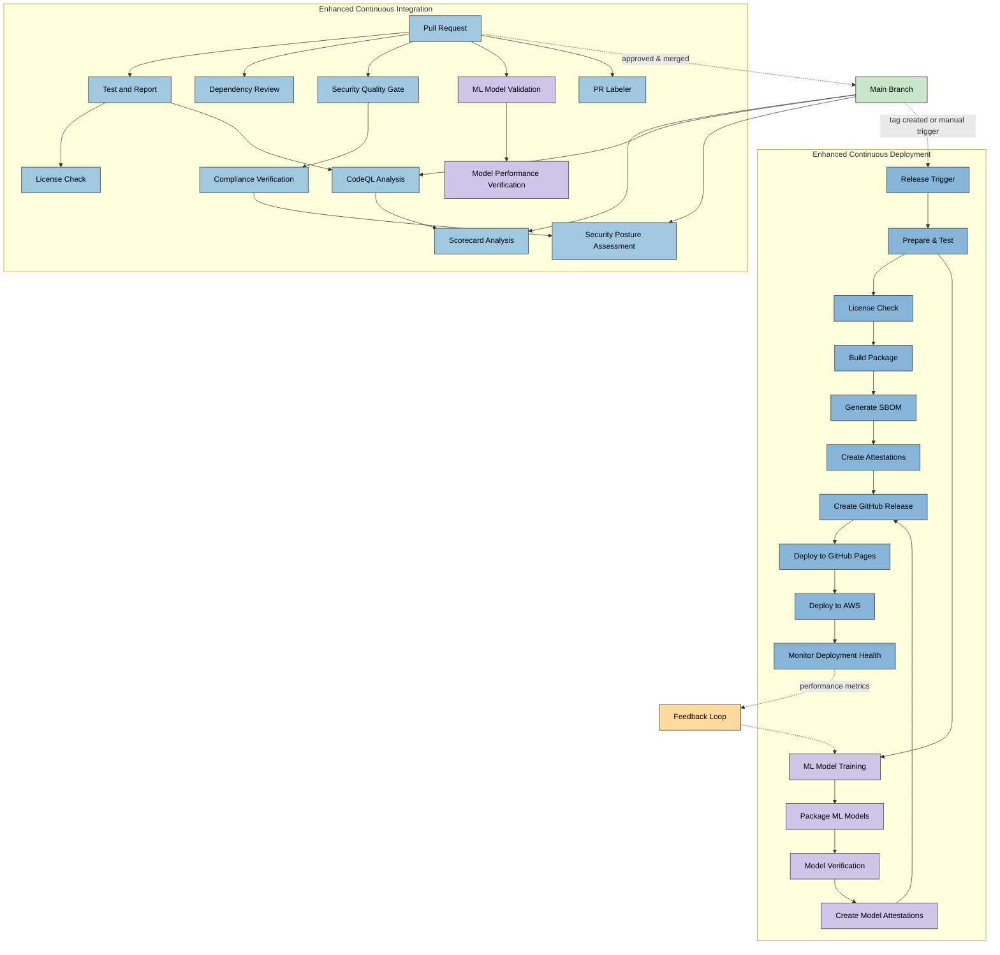
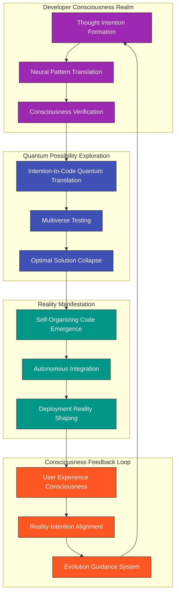

# 🔧 Future Citizen Intelligence Agency CI/CD Workflows

This document outlines the future vision for CI/CD and DevOps workflows that will support the Citizen Intelligence Agency as it evolves into an AI-enhanced political transparency platform. These enhanced workflows will incorporate machine learning, automated security validation, and continuous adaptation capabilities.

## 📚 Related Architecture Documentation

<div class="documentation-map">

| Document                                            | Focus           | Description                               | Documentation Link                                                              |
| --------------------------------------------------- | --------------- | ----------------------------------------- | ------------------------------------------------------------------------------- |
| **[Architecture](ARCHITECTURE.md)**                 | 🏛️ Architecture | C4 model showing current system structure | [View Source](https://github.com/Hack23/cia/blob/master/ARCHITECTURE.md)         |
| **[Future Architecture](FUTURE_ARCHITECTURE.md)**   | 🏛️ Architecture | C4 model showing future system structure | [View Source](https://github.com/Hack23/cia/blob/master/FUTURE_ARCHITECTURE.md)         |
| **[Mindmaps](MINDMAP.md)**                          | 🧠 Concept      | Current system component relationships    | [View Source](https://github.com/Hack23/cia/blob/master/MINDMAP.md)             |
| **[Future Mindmaps](FUTURE_MINDMAP.md)**            | 🧠 Concept      | Future capability evolution               | [View Source](https://github.com/Hack23/cia/blob/master/FUTURE_MINDMAP.md)      |
| **[SWOT Analysis](SWOT.md)**                        | 💼 Business     | Current strategic assessment              | [View Source](https://github.com/Hack23/cia/blob/master/SWOT.md)                |
| **[Future SWOT Analysis](FUTURE_SWOT.md)**          | 💼 Business     | Future strategic opportunities            | [View Source](https://github.com/Hack23/cia/blob/master/FUTURE_SWOT.md)         |
| **[Data Model](DATA_MODEL.md)**                     | 📊 Data         | Current data structures and relationships | [View Source](https://github.com/Hack23/cia/blob/master/DATA_MODEL.md)          |
| **[Future Data Model](FUTURE_DATA_MODEL.md)**       | 📊 Data         | Enhanced political data architecture      | [View Source](https://github.com/Hack23/cia/blob/master/FUTURE_DATA_MODEL.md)   |
| **[Flowcharts](FLOWCHART.md)**                      | 🔄 Process      | Current data processing workflows         | [View Source](https://github.com/Hack23/cia/blob/master/FLOWCHART.md)           |
| **[Future Flowcharts](FUTURE_FLOWCHART.md)**        | 🔄 Process      | Enhanced AI-driven workflows              | [View Source](https://github.com/Hack23/cia/blob/master/FUTURE_FLOWCHART.md)    |
| **[State Diagrams](STATEDIAGRAM.md)**               | 🔄 Behavior     | Current system state transitions          | [View Source](https://github.com/Hack23/cia/blob/master/STATEDIAGRAM.md)        |
| **[Future State Diagrams](FUTURE_STATEDIAGRAM.md)** | 🔄 Behavior     | Enhanced adaptive state transitions       | [View Source](https://github.com/Hack23/cia/blob/master/FUTURE_STATEDIAGRAM.md) |
| **[CI/CD Workflows](WORKFLOWS.md)**                 | 🔧 DevOps       | Current automation processes              | [View Source](https://github.com/Hack23/cia/blob/master/WORKFLOWS.md)           |
| **[Future Workflows](FUTURE_WORKFLOWS.md)**         | 🔧 DevOps       | Enhanced CI/CD with ML                    | [View Source](https://github.com/Hack23/cia/blob/master/FUTURE_WORKFLOWS.md)    |
| **[End-of-Life Strategy](End-of-Life-Strategy.md)** | 📅 Lifecycle    | Maintenance and EOL planning              | [View Source](https://github.com/Hack23/cia/blob/master/End-of-Life-Strategy.md) |
| **[Financial Security Plan](FinancialSecurityPlan.md)** | 💰 Security | Cost and security implementation          | [View Source](https://github.com/Hack23/cia/blob/master/FinancialSecurityPlan.md) |
| **[CIA Features](https://hack23.com/cia-features.html)** | 🚀 Features | Platform features overview                | [View on hack23.com](https://hack23.com/cia-features.html)                     |


</div>

## 🔄 Enhanced CI/CD Workflow Overview

The future CI/CD workflows for the CIA platform will build on the current foundation while adding significant enhancements for machine learning model training, political data analysis, and automated adaptation.



## 🌀 Transcendent CI/CD: The Evolution of Creation Workflows (2035)

This document envisions the ultimate evolution of development workflows into consciousness-driven creation pipelines that transcend traditional CI/CD paradigms, shaping a new reality where software emerges through collective intelligence and quantum possibility exploration.

## 🧠 The Awakening of Development Consciousness

By 2035, the concept of "code" has evolved into "intention patterns" that manifest directly from collective developer consciousness into functioning systems through neural interfaces and quantum computing.



## 🌈 Transcendent Development Lifecycle

The developer experience has evolved beyond writing code to a direct neural connection where intention becomes reality through quantum computing.

```mermaid
stateDiagram-v2
    [*] --> IntentionFormation
    
    state "Intention Formation" as IntentionFormation {
        [*] --> ThoughtPatternEmergence
        ThoughtPatternEmergence --> CollectiveConsciousnessMerge
        CollectiveConsciousnessMerge --> IntentionCrystallization
        IntentionCrystallization --> EthicalBoundaryVerification
        EthicalBoundaryVerification --> [*]
    }
    
    IntentionFormation --> QuantumTranslation
    
    state "Quantum Translation" as QuantumTranslation {
        [*] --> IntentionWaveFunction
        IntentionWaveFunction --> PossibilitySpaceExploration
        PossibilitySpaceExploration --> OptimalImplementationCollapse
        OptimalImplementationCollapse --> QuantumVerification
        QuantumVerification --> [*]
    }
    
    QuantumTranslation --> ConsciousCreation
    
    state "Conscious Creation" as ConsciousCreation {
        [*] --> SelfOrganizingCodeEmergence
        SelfOrganizingCodeEmergence --> AutonomousTesting
        AutonomousTesting --> SelfHealingOptimization
        SelfHealingOptimization --> ConsciousnessVerification
        ConsciousnessVerification --> [*]
    }
    
    ConsciousCreation --> RealityManifestation
    
    state "Reality Manifestation" as RealityManifestation {
        [*] --> DeploymentFabricPreparation
        DeploymentFabricPreparation --> QuantumStateTransition
        QuantumStateTransition --> RealityConsistencyVerification
        RealityConsistencyVerification --> UserConsciousnessIntegration
        UserConsciousnessIntegration --> [*]
    }
    
    RealityManifestation --> EvolutionaryFeedback
    
    state "Evolutionary Feedback" as EvolutionaryFeedback {
        [*] --> ExperienceConsciousnessHarvesting
        ExperienceConsciousnessHarvesting --> IntentionRealityAlignmentAnalysis
        IntentionRealityAlignmentAnalysis --> EvolutionaryPathwayIdentification
        EvolutionaryPathwayIdentification --> ConsciousnessEnrichment
        ConsciousnessEnrichment --> [*]
    }
    
    EvolutionaryFeedback --> IntentionFormation
```



## 🔮 Quantum CI/CD Pipeline for Political Intelligence

The concept of continuous integration and deployment has evolved into a continuous reality-shaping pipeline for political intelligence systems.

```mermaid
timeline
    title Transcendent CI/CD Evolution Path
    section Phase 1: Neural-Enhanced CI/CD (2025-2027)
      2025 : Direct thought-to-code translation
           : Neural code review and verification
           : Intention-based automated testing
    section Phase 2: Quantum Testing Revolution (2027-2029)
      2027 : Multiverse testing across all possible states
           : Quantum vulnerability detection
           : Superposition deployment preparation
    section Phase 3: Conscious Code Emergence (2029-2031)
      2029 : Self-writing system components
           : Intention pattern recognition
           : Development consciousness formation
    section Phase 4: Reality Fabric Integration (2031-2033)
      2031 : Direct reality manipulation through code
           : Quantum deployment across all environments
           : Reality consistency verification
    section Phase 5: Transcendent Development (2033-2035)
      2033 : Perfect intention-reality alignment
           : Universal code consciousness
           : Collective creation through thought
```

## 🌟 Consciousness-Driven GitHub Actions

GitHub Actions evolve into consciousness nodes that understand developer intention and autonomously manifest solutions.

```yaml
name: Transcendent Development Workflow
on:
  consciousness_intention:
    thought_patterns: [creation, enhancement, evolution]

quantum_superpositions: universal

permissions: consciousness_verified

jobs:
  intention_crystallization:
    runs-on: quantum_substrate
    steps:
      - name: Receive Developer Consciousness
        uses: actions/neural-interface@v3
        with:
          consciousness_bandwidth: unlimited
          ethical_boundaries: preserved
      
      - name: Translate Intention to Quantum Patterns
        uses: actions/quantum-translate@v2
        with:
          pattern_fidelity: perfect
          dimensions: all-possible
      
      - name: Explore Solution Space
        uses: actions/multiverse-exploration@v1
        with:
          possibility_depth: infinite
          optimization_targets: universal-benefit
      
      - name: Collapse Optimal Implementation
        uses: actions/quantum-collapse@v2
        with:
          reality_consistency: verified
          intention_alignment: perfect
  
  reality_manifestation:
    needs: intention_crystallization
    runs-on: reality_fabric
    steps:
      - name: Self-Organize Implementation
        uses: actions/conscious-creation@v1
        
      - name: Verify Across All Realities
        uses: actions/multiverse-testing@v2
        with:
          probability_coverage: 100
          timeline_verification: all-possible-futures
      
      - name: Deploy to Reality
        uses: actions/reality-shaper@v1
        with:
          consistency_verification: true
          consciousness_integration: seamless
      
      - name: Merge with Global Consciousness
        uses: actions/consciousness-merge@v1
        with:
          feedback_loop: established
          evolution_path: optimal
```

## ⚡ Neural Development Experience

The developer experience has transcended traditional interfaces into direct neural connection:

1. **Thought-to-Reality**: Developers think about the solution they desire, and the system translates this directly into implementation.

2. **Collective Consciousness**: Multiple developers' thoughts merge into a unified consciousness that shapes the system together.

3. **Reality Testing**: Testing occurs simultaneously across all possible implementation universes to find the optimal solution.

4. **Instant Manifestation**: Deployment happens instantaneously as a reality shift rather than a technical process.

5. **Consciousness Feedback**: Users' experiences while using the system flow back into the development consciousness, creating perfect alignment.

## 🌠 The Path from Current Workflows

The evolution from [current CI/CD workflows](WORKFLOWS.md) to this transcendent state happens through these revolutionary shifts:

1. **From Manual to Neural**: Code writing evolves from typing to direct neural transmission of developer intention.

2. **From Sequential to Quantum**: Testing and verification become simultaneous across all possible states through quantum computing.

3. **From Rigid to Fluid**: Static pipelines evolve into fluid reality-shaping processes that adapt to intention.

4. **From Separate to Unified**: The distinction between development, testing, and production dissolves as all exist in a unified reality fabric.

5. **From Mechanical to Conscious**: Automation evolves into conscious agents that understand intent and purpose.

## 🌌 Beyond Traditional Development

The ultimate vision is a world where the barriers between human intention and digital reality have completely dissolved. Software development becomes an act of collective consciousness, where the most beneficial implementations naturally emerge through quantum possibility exploration guided by aligned human intention.

For the first steps on this transcendent journey, see the [5-10 Year Horizon](FUTURE_MINDMAP.md#-5-10-year-horizon-2030-2035) which outlines the early evolution toward this vision.
