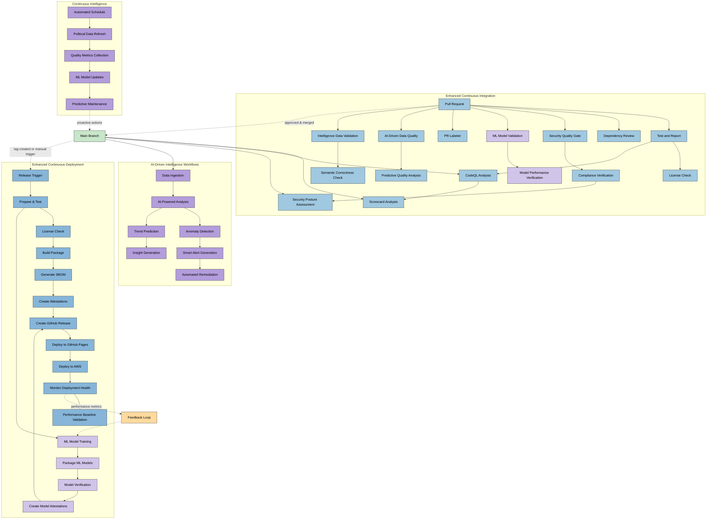
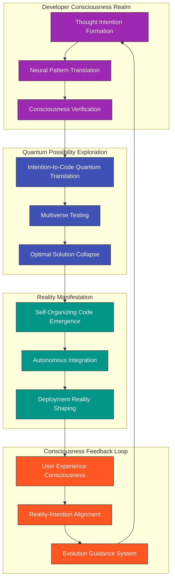

# 🔧 Future Citizen Intelligence Agency CI/CD Workflows

This document outlines the future vision for CI/CD and DevOps workflows that will support the Citizen Intelligence Agency as it evolves into an AI-enhanced political transparency platform. These enhanced workflows will incorporate machine learning, automated security validation, and continuous adaptation capabilities.

## 📚 Related Architecture Documentation

<div class="documentation-map">

| Document                                            | Focus           | Description                               | Documentation Link                                                              |
| --------------------------------------------------- | --------------- | ----------------------------------------- | ------------------------------------------------------------------------------- |
| **[Architecture](ARCHITECTURE.md)**                 | 🏛️ Architecture | C4 model showing current system structure | [View Source](https://github.com/Hack23/cia/blob/master/ARCHITECTURE.md)         |
| **[Future Architecture](FUTURE_ARCHITECTURE.md)**   | 🏛️ Architecture | C4 model showing future system structure | [View Source](https://github.com/Hack23/cia/blob/master/FUTURE_ARCHITECTURE.md)         |
| **[Mindmaps](MINDMAP.md)**                          | 🧠 Concept      | Current system component relationships    | [View Source](https://github.com/Hack23/cia/blob/master/MINDMAP.md)             |
| **[Future Mindmaps](FUTURE_MINDMAP.md)**            | 🧠 Concept      | Future capability evolution               | [View Source](https://github.com/Hack23/cia/blob/master/FUTURE_MINDMAP.md)      |
| **[SWOT Analysis](SWOT.md)**                        | 💼 Business     | Current strategic assessment              | [View Source](https://github.com/Hack23/cia/blob/master/SWOT.md)                |
| **[Future SWOT Analysis](FUTURE_SWOT.md)**          | 💼 Business     | Future strategic opportunities            | [View Source](https://github.com/Hack23/cia/blob/master/FUTURE_SWOT.md)         |
| **[Data Model](DATA_MODEL.md)**                     | 📊 Data         | Current data structures and relationships | [View Source](https://github.com/Hack23/cia/blob/master/DATA_MODEL.md)          |
| **[Future Data Model](FUTURE_DATA_MODEL.md)**       | 📊 Data         | Enhanced political data architecture      | [View Source](https://github.com/Hack23/cia/blob/master/FUTURE_DATA_MODEL.md)   |
| **[Flowcharts](FLOWCHART.md)**                      | 🔄 Process      | Current data processing workflows         | [View Source](https://github.com/Hack23/cia/blob/master/FLOWCHART.md)           |
| **[Future Flowcharts](FUTURE_FLOWCHART.md)**        | 🔄 Process      | Enhanced AI-driven workflows              | [View Source](https://github.com/Hack23/cia/blob/master/FUTURE_FLOWCHART.md)    |
| **[State Diagrams](STATEDIAGRAM.md)**               | 🔄 Behavior     | Current system state transitions          | [View Source](https://github.com/Hack23/cia/blob/master/STATEDIAGRAM.md)        |
| **[Future State Diagrams](FUTURE_STATEDIAGRAM.md)** | 🔄 Behavior     | Enhanced adaptive state transitions       | [View Source](https://github.com/Hack23/cia/blob/master/FUTURE_STATEDIAGRAM.md) |
| **[CI/CD Workflows](WORKFLOWS.md)**                 | 🔧 DevOps       | Current automation processes              | [View Source](https://github.com/Hack23/cia/blob/master/WORKFLOWS.md)           |
| **[Future Workflows](FUTURE_WORKFLOWS.md)**         | 🔧 DevOps       | Enhanced CI/CD with ML                    | [View Source](https://github.com/Hack23/cia/blob/master/FUTURE_WORKFLOWS.md)    |
| **[End-of-Life Strategy](End-of-Life-Strategy.md)** | 📅 Lifecycle    | Maintenance and EOL planning              | [View Source](https://github.com/Hack23/cia/blob/master/End-of-Life-Strategy.md) |
| **[Financial Security Plan](FinancialSecurityPlan.md)** | 💰 Security | Cost and security implementation          | [View Source](https://github.com/Hack23/cia/blob/master/FinancialSecurityPlan.md) |
| **[CIA Features](https://hack23.com/cia-features.html)** | 🚀 Features | Platform features overview                | [View on hack23.com](https://hack23.com/cia-features.html)                     |


</div>

## 🔄 Enhanced CI/CD Workflow Overview

The future CI/CD workflows for the CIA platform will build on the current foundation while adding significant enhancements for machine learning model training, political data analysis, and automated adaptation.



## 🌀 Transcendent CI/CD: The Evolution of Creation Workflows (2035)

This document envisions the ultimate evolution of development workflows into consciousness-driven creation pipelines that transcend traditional CI/CD paradigms, shaping a new reality where software emerges through collective intelligence and quantum possibility exploration.

## 🧠 The Awakening of Development Consciousness

By 2035, the concept of "code" has evolved into "intention patterns" that manifest directly from collective developer consciousness into functioning systems through neural interfaces and quantum computing.



## 🌈 Transcendent Development Lifecycle

The developer experience has evolved beyond writing code to a direct neural connection where intention becomes reality through quantum computing.

```mermaid
stateDiagram-v2
    [*] --> IntentionFormation
    
    state "Intention Formation" as IntentionFormation {
        [*] --> ThoughtPatternEmergence
        ThoughtPatternEmergence --> CollectiveConsciousnessMerge
        CollectiveConsciousnessMerge --> IntentionCrystallization
        IntentionCrystallization --> EthicalBoundaryVerification
        EthicalBoundaryVerification --> [*]
    }
    
    IntentionFormation --> QuantumTranslation
    
    state "Quantum Translation" as QuantumTranslation {
        [*] --> IntentionWaveFunction
        IntentionWaveFunction --> PossibilitySpaceExploration
        PossibilitySpaceExploration --> OptimalImplementationCollapse
        OptimalImplementationCollapse --> QuantumVerification
        QuantumVerification --> [*]
    }
    
    QuantumTranslation --> ConsciousCreation
    
    state "Conscious Creation" as ConsciousCreation {
        [*] --> SelfOrganizingCodeEmergence
        SelfOrganizingCodeEmergence --> AutonomousTesting
        AutonomousTesting --> SelfHealingOptimization
        SelfHealingOptimization --> ConsciousnessVerification
        ConsciousnessVerification --> [*]
    }
    
    ConsciousCreation --> RealityManifestation
    
    state "Reality Manifestation" as RealityManifestation {
        [*] --> DeploymentFabricPreparation
        DeploymentFabricPreparation --> QuantumStateTransition
        QuantumStateTransition --> RealityConsistencyVerification
        RealityConsistencyVerification --> UserConsciousnessIntegration
        UserConsciousnessIntegration --> [*]
    }
    
    RealityManifestation --> EvolutionaryFeedback
    
    state "Evolutionary Feedback" as EvolutionaryFeedback {
        [*] --> ExperienceConsciousnessHarvesting
        ExperienceConsciousnessHarvesting --> IntentionRealityAlignmentAnalysis
        IntentionRealityAlignmentAnalysis --> EvolutionaryPathwayIdentification
        EvolutionaryPathwayIdentification --> ConsciousnessEnrichment
        ConsciousnessEnrichment --> [*]
    }
    
    EvolutionaryFeedback --> IntentionFormation
```



## 🔮 Quantum CI/CD Pipeline for Political Intelligence

The concept of continuous integration and deployment has evolved into a continuous reality-shaping pipeline for political intelligence systems.

```mermaid
timeline
    title Transcendent CI/CD Evolution Path
    section Phase 1: Neural-Enhanced CI/CD (2025-2027)
      2025 : Direct thought-to-code translation
           : Neural code review and verification
           : Intention-based automated testing
    section Phase 2: Quantum Testing Revolution (2027-2029)
      2027 : Multiverse testing across all possible states
           : Quantum vulnerability detection
           : Superposition deployment preparation
    section Phase 3: Conscious Code Emergence (2029-2031)
      2029 : Self-writing system components
           : Intention pattern recognition
           : Development consciousness formation
    section Phase 4: Reality Fabric Integration (2031-2033)
      2031 : Direct reality manipulation through code
           : Quantum deployment across all environments
           : Reality consistency verification
    section Phase 5: Transcendent Development (2033-2035)
      2033 : Perfect intention-reality alignment
           : Universal code consciousness
           : Collective creation through thought
```

## 🌟 Consciousness-Driven GitHub Actions

GitHub Actions evolve into consciousness nodes that understand developer intention and autonomously manifest solutions.

```yaml
name: Transcendent Development Workflow
on:
  consciousness_intention:
    thought_patterns: [creation, enhancement, evolution]

quantum_superpositions: universal

permissions: consciousness_verified

jobs:
  intention_crystallization:
    runs-on: quantum_substrate
    steps:
      - name: Receive Developer Consciousness
        uses: actions/neural-interface@v3
        with:
          consciousness_bandwidth: unlimited
          ethical_boundaries: preserved
      
      - name: Translate Intention to Quantum Patterns
        uses: actions/quantum-translate@v2
        with:
          pattern_fidelity: perfect
          dimensions: all-possible
      
      - name: Explore Solution Space
        uses: actions/multiverse-exploration@v1
        with:
          possibility_depth: infinite
          optimization_targets: universal-benefit
      
      - name: Collapse Optimal Implementation
        uses: actions/quantum-collapse@v2
        with:
          reality_consistency: verified
          intention_alignment: perfect
  
  reality_manifestation:
    needs: intention_crystallization
    runs-on: reality_fabric
    steps:
      - name: Self-Organize Implementation
        uses: actions/conscious-creation@v1
        
      - name: Verify Across All Realities
        uses: actions/multiverse-testing@v2
        with:
          probability_coverage: 100
          timeline_verification: all-possible-futures
      
      - name: Deploy to Reality
        uses: actions/reality-shaper@v1
        with:
          consistency_verification: true
          consciousness_integration: seamless
      
      - name: Merge with Global Consciousness
        uses: actions/consciousness-merge@v1
        with:
          feedback_loop: established
          evolution_path: optimal
```

## ⚡ Neural Development Experience

The developer experience has transcended traditional interfaces into direct neural connection:

1. **Thought-to-Reality**: Developers think about the solution they desire, and the system translates this directly into implementation.

2. **Collective Consciousness**: Multiple developers' thoughts merge into a unified consciousness that shapes the system together.

3. **Reality Testing**: Testing occurs simultaneously across all possible implementation universes to find the optimal solution.

4. **Instant Manifestation**: Deployment happens instantaneously as a reality shift rather than a technical process.

5. **Consciousness Feedback**: Users' experiences while using the system flow back into the development consciousness, creating perfect alignment.

## 🌠 The Path from Current Workflows

The evolution from [current CI/CD workflows](WORKFLOWS.md) to this transcendent state happens through these revolutionary shifts:

1. **From Manual to Neural**: Code writing evolves from typing to direct neural transmission of developer intention.

2. **From Sequential to Quantum**: Testing and verification become simultaneous across all possible states through quantum computing.

3. **From Rigid to Fluid**: Static pipelines evolve into fluid reality-shaping processes that adapt to intention.

4. **From Separate to Unified**: The distinction between development, testing, and production dissolves as all exist in a unified reality fabric.

5. **From Mechanical to Conscious**: Automation evolves into conscious agents that understand intent and purpose.

## 🚀 Near-Term Future Enhancements (2025-2027)

Building on the current workflow foundation, the CIA platform will implement practical AI-driven improvements to enhance data quality, security, and operational efficiency.

### AI-Powered Data Quality Workflows

**Intelligent Schema Evolution Detection**

Future workflow will detect schema changes and automatically validate compatibility:

```yaml
name: AI Schema Evolution Analyzer
on:
  push:
    paths:
      - 'service.data.impl/src/main/resources/**/*.sql'
      - 'model.internal.application/**'

jobs:
  analyze-schema-changes:
    runs-on: ubuntu-latest
    steps:
      - name: Detect Schema Changes
        uses: actions/ml-schema-analyzer@v1
        with:
          model: 'schema-evolution-detector-v2'
          
      - name: Predict Breaking Changes
        run: |
          # ML model predicts impact of schema changes
          python scripts/predict-breaking-changes.py \
            --previous-schema $PREV_COMMIT \
            --current-schema $CURRENT_COMMIT \
            --confidence-threshold 0.85
      
      - name: Generate Migration Scripts
        if: breaking-changes-detected
        run: |
          # AI generates safe migration scripts
          python scripts/ai-migration-generator.py \
            --from-schema $PREV_VERSION \
            --to-schema $CURRENT_VERSION \
            --safety-level high
      
      - name: Validate with Historical Data
        run: |
          # Test migrations against historical data patterns
          python scripts/validate-migration.py \
            --migration-script generated-migration.sql \
            --sample-size 10000 \
            --validation-mode strict
```

**Predictive Data Quality Monitoring**

Continuous monitoring with ML-based anomaly detection:

```yaml
name: Predictive Data Quality Monitor
on:
  schedule:
    - cron: '0 */6 * * *'  # Every 6 hours
  workflow_dispatch:

jobs:
  monitor-data-quality:
    runs-on: ubuntu-latest
    steps:
      - name: Collect Data Quality Metrics
        run: |
          # Gather metrics from database views
          python scripts/collect-quality-metrics.py \
            --metrics completeness,accuracy,consistency,timeliness \
            --output quality-metrics.json
      
      - name: ML Anomaly Detection
        uses: actions/ml-anomaly-detector@v2
        with:
          metrics-file: quality-metrics.json
          model: 'political-data-quality-v3'
          sensitivity: 0.95
          
      - name: Predict Future Quality Issues
        run: |
          # Predict quality degradation 48 hours ahead
          python scripts/predict-quality-trends.py \
            --horizon 48h \
            --confidence 0.90 \
            --alert-threshold 0.75
      
      - name: Generate Smart Alerts
        if: anomalies-detected || degradation-predicted
        uses: actions/smart-alerting@v1
        with:
          severity: auto  # AI determines severity
          channels: github-issues,slack,email
          include-remediation: true
      
      - name: Auto-Remediation
        if: auto-remediation-enabled && severity == 'low'
        run: |
          # Automated fixes for known issues
          python scripts/auto-remediate.py \
            --issue-type $DETECTED_ISSUE \
            --dry-run false \
            --rollback-on-error true
```

**Semantic Political Data Validation**

Advanced validation using NLP and knowledge graphs:

```yaml
name: Semantic Data Validator
on:
  pull_request:
    paths:
      - 'service.data.impl/sample-data/**'
      - 'json-export-specs/**'

jobs:
  semantic-validation:
    runs-on: ubuntu-latest
    steps:
      - name: Extract Political Entities
        run: |
          # NLP-based entity extraction and validation
          python scripts/extract-political-entities.py \
            --source sample-data/ \
            --model swedish-political-ner-v2
      
      - name: Validate Against Knowledge Graph
        run: |
          # Check consistency with political knowledge base
          python scripts/validate-knowledge-graph.py \
            --entities extracted-entities.json \
            --graph political-knowledge-graph \
            --check-relationships true \
            --check-temporal-consistency true
      
      - name: Cross-Reference External Sources
        run: |
          # Verify against Riksdagen and election authority APIs
          python scripts/cross-reference-sources.py \
            --entities extracted-entities.json \
            --sources riksdagen,val,scb \
            --tolerance 0.95
      
      - name: Generate Validation Report
        run: |
          # AI-generated report with recommendations
          python scripts/generate-validation-report.py \
            --results validation-results.json \
            --format markdown \
            --include-fix-suggestions true
```

### Enhanced Security Automation

**Intelligent Vulnerability Assessment**

ML-powered vulnerability prioritization and remediation:

```yaml
name: AI Vulnerability Analyzer
on:
  schedule:
    - cron: '0 3 * * 1'  # Weekly Monday at 03:00
  workflow_dispatch:

jobs:
  analyze-vulnerabilities:
    runs-on: ubuntu-latest
    steps:
      - name: Aggregate Security Findings
        run: |
          # Collect from CodeQL, Dependabot, SCA tools
          python scripts/aggregate-security-findings.py \
            --sources codeql,dependabot,sonarcloud,snyk \
            --output aggregated-findings.json
      
      - name: ML Risk Scoring
        uses: actions/ml-risk-scorer@v2
        with:
          findings: aggregated-findings.json
          model: 'vulnerability-risk-model-v4'
          context: political-platform
          
      - name: Predict Exploit Probability
        run: |
          # Predict likelihood of exploitation
          python scripts/predict-exploit-probability.py \
            --vulnerabilities aggregated-findings.json \
            --threat-intelligence-feeds circl,cisa,nvd \
            --time-horizon 30d
      
      - name: Generate Remediation Plan
        run: |
          # AI-generated prioritized remediation roadmap
          python scripts/generate-remediation-plan.py \
            --findings risk-scored-findings.json \
            --constraints team-capacity,release-schedule \
            --optimize-for security,stability,velocity
      
      - name: Auto-Apply Safe Fixes
        if: safe-fixes-available
        run: |
          # Automatically apply low-risk dependency updates
          python scripts/auto-apply-fixes.py \
            --fixes safe-remediation-plan.json \
            --create-pr true \
            --run-tests true \
            --rollback-on-failure true
```

**Behavioral Security Monitoring**

Continuous monitoring for anomalous behavior patterns:

```yaml
name: Behavioral Security Monitor
on:
  schedule:
    - cron: '0 */4 * * *'  # Every 4 hours

jobs:
  monitor-behavior:
    runs-on: ubuntu-latest
    steps:
      - name: Collect System Metrics
        run: |
          # Gather AWS CloudWatch, application logs
          python scripts/collect-system-metrics.py \
            --sources cloudwatch,app-logs,db-logs \
            --window 4h
      
      - name: Behavioral Analysis
        uses: actions/ml-behavior-analyzer@v1
        with:
          metrics: system-metrics.json
          baseline-model: normal-behavior-profile
          detect: anomalies,threats,performance-degradation
      
      - name: Threat Classification
        run: |
          # ML-based threat classification
          python scripts/classify-threats.py \
            --anomalies detected-anomalies.json \
            --model threat-classifier-v2 \
            --mitre-mapping true
      
      - name: Automated Response
        if: threat-detected
        run: |
          # Execute automated incident response playbook
          python scripts/incident-response.py \
            --threat $THREAT_TYPE \
            --severity $SEVERITY \
            --playbook automated-response-playbook.yaml
```

### Performance & Optimization Workflows

**Intelligent Performance Baseline**

ML-driven performance monitoring and optimization:

```yaml
name: Performance Intelligence
on:
  push:
    branches: [master]
  schedule:
    - cron: '0 2 * * *'  # Daily at 02:00

jobs:
  performance-analysis:
    runs-on: ubuntu-latest
    steps:
      - name: Run Performance Tests
        run: |
          # Execute comprehensive performance test suite
          mvn clean test -Pperformance-tests \
            -Djmeter.save.saveservice.output_format=xml
      
      - name: Collect Performance Metrics
        run: |
          # Gather application and database metrics
          python scripts/collect-performance-metrics.py \
            --sources jmeter,db-explain,app-profiler \
            --output perf-metrics.json
      
      - name: ML Baseline Comparison
        uses: actions/ml-performance-analyzer@v1
        with:
          current-metrics: perf-metrics.json
          historical-baseline: true
          detect-regressions: true
          sensitivity: 0.90
      
      - name: Identify Optimization Opportunities
        run: |
          # ML identifies performance bottlenecks
          python scripts/identify-optimizations.py \
            --metrics perf-metrics.json \
            --regression-analysis regression-results.json \
            --suggest-fixes true
      
      - name: Generate Optimization PR
        if: optimizations-found
        run: |
          # Auto-generate PR with optimization recommendations
          python scripts/create-optimization-pr.py \
            --optimizations identified-optimizations.json \
            --include-benchmarks true \
            --explain-changes true
```

**Database Query Optimization**

AI-powered query performance analysis:

```yaml
name: Database Query Optimizer
on:
  schedule:
    - cron: '0 3 * * 0'  # Weekly Sunday at 03:00
  workflow_dispatch:

jobs:
  optimize-queries:
    runs-on: ubuntu-latest
    steps:
      - name: Collect Query Statistics
        run: |
          # Extract slow queries from pg_stat_statements
          python scripts/collect-slow-queries.py \
            --min-duration 1000ms \
            --limit 100 \
            --output slow-queries.json
      
      - name: ML Query Analysis
        run: |
          # Analyze query patterns and identify issues
          python scripts/analyze-queries.py \
            --queries slow-queries.json \
            --model query-optimizer-v3 \
            --check index-usage,join-strategy,data-distribution
      
      - name: Generate Optimization Suggestions
        run: |
          # AI-generated index and query optimization suggestions
          python scripts/generate-query-optimizations.py \
            --analysis query-analysis.json \
            --suggest indexes,rewrites,partitioning \
            --estimate-impact true
      
      - name: Validate Optimizations
        run: |
          # Test optimizations on sample data
          python scripts/validate-optimizations.py \
            --optimizations suggested-optimizations.json \
            --test-data-size 10000 \
            --safety-checks true
      
      - name: Create Optimization Issue
        uses: actions/create-issue@v1
        with:
          title: "Weekly Database Optimization Recommendations"
          body-from-file: optimization-report.md
          labels: performance,database,ml-generated
```

### Continuous Intelligence Workflows

**Automated Political Data Enrichment**

AI-driven data enrichment and cross-referencing:

```yaml
name: Political Data Enrichment
on:
  schedule:
    - cron: '0 4 * * *'  # Daily at 04:00
  workflow_dispatch:

jobs:
  enrich-political-data:
    runs-on: ubuntu-latest
    steps:
      - name: Fetch Latest Political Data
        run: |
          # Pull from Riksdagen, Election Authority, SCB
          python scripts/fetch-political-data.py \
            --sources riksdagen,val,scb,worldbank \
            --incremental true \
            --since yesterday
      
      - name: AI Entity Resolution
        run: |
          # Match and merge entities across sources
          python scripts/entity-resolution.py \
            --input fetched-data.json \
            --model entity-resolver-v4 \
            --confidence-threshold 0.92 \
            --manual-review-queue true
      
      - name: Semantic Enrichment
        run: |
          # Add contextual information using NLP
          python scripts/semantic-enrichment.py \
            --entities resolved-entities.json \
            --enrich relationships,roles,affiliations,timeline \
            --knowledge-base political-knowledge-graph
      
      - name: Quality Validation
        run: |
          # Validate enriched data quality
          python scripts/validate-enrichment.py \
            --data enriched-data.json \
            --checks completeness,consistency,temporal-validity \
            --error-threshold 0.02
      
      - name: Generate Intelligence Report
        run: |
          # AI-generated intelligence summary
          python scripts/generate-intelligence-report.py \
            --data enriched-data.json \
            --format markdown \
            --include insights,trends,anomalies \
            --audience maintainers
```

**Trend Detection & Prediction**

ML-based political trend analysis:

```yaml
name: Political Trend Analyzer
on:
  schedule:
    - cron: '0 6 * * 1'  # Weekly Monday at 06:00

jobs:
  analyze-trends:
    runs-on: ubuntu-latest
    steps:
      - name: Aggregate Historical Data
        run: |
          # Collect political data time series
          python scripts/aggregate-historical-data.py \
            --window 90d \
            --metrics voting-patterns,party-positions,member-activity \
            --output historical-data.json
      
      - name: ML Trend Detection
        run: |
          # Detect significant trends and shifts
          python scripts/detect-trends.py \
            --data historical-data.json \
            --model trend-detector-v2 \
            --significance-level 0.95 \
            --detect emerging,declining,shifting
      
      - name: Predict Future Trends
        run: |
          # Predict trends 30 days ahead
          python scripts/predict-trends.py \
            --historical historical-data.json \
            --detected-trends trends.json \
            --horizon 30d \
            --confidence-interval 0.90
      
      - name: Generate Trend Report
        run: |
          # Create comprehensive trend analysis report
          python scripts/generate-trend-report.py \
            --trends detected-trends.json \
            --predictions trend-predictions.json \
            --visualizations true \
            --format markdown,json
      
      - name: Update Intelligence Dashboard
        run: |
          # Update real-time intelligence dashboard
          python scripts/update-dashboard.py \
            --report trend-report.json \
            --dashboard political-intelligence-dashboard \
            --sections trends,predictions,insights
```

### ISMS Compliance Automation

**Automated Compliance Checking**

Continuous ISMS policy compliance validation:

```yaml
name: ISMS Compliance Validator
on:
  schedule:
    - cron: '0 5 * * 2'  # Weekly Tuesday at 05:00
  pull_request:
    paths:
      - 'SECURITY_ARCHITECTURE.md'
      - 'THREAT_MODEL.md'
      - '.github/workflows/**'

jobs:
  validate-compliance:
    runs-on: ubuntu-latest
    steps:
      - name: Check Security Documentation
        run: |
          # Validate required security documentation exists
          python scripts/check-security-docs.py \
            --required SECURITY_ARCHITECTURE.md,THREAT_MODEL.md \
            --standards iso27001,nist-csf,cis-controls
      
      - name: Validate Security Controls
        run: |
          # Check implementation of required security controls
          python scripts/validate-security-controls.py \
            --architecture SECURITY_ARCHITECTURE.md \
            --threat-model THREAT_MODEL.md \
            --evidence .github/workflows/,pom.xml \
            --frameworks iso27001,nist-csf-2.0,cis-v8.1
      
      - name: ML Compliance Gap Analysis
        uses: actions/ml-compliance-analyzer@v1
        with:
          policies: ISMS-PUBLIC-policies
          implementation: current-repository
          model: compliance-gap-detector-v2
      
      - name: Generate Compliance Report
        run: |
          # Create comprehensive compliance report
          python scripts/generate-compliance-report.py \
            --findings compliance-findings.json \
            --standards iso27001,nist-csf,cis-controls \
            --format markdown,json \
            --include remediation-plan
      
      - name: Create Compliance Issue
        if: gaps-detected
        uses: actions/create-issue@v1
        with:
          title: "ISMS Compliance Gap Analysis - ${{ github.event.head_commit.timestamp }}"
          body-from-file: compliance-report.md
          labels: security,compliance,isms,automated
```

## 🔮 Mid-Term Horizon (2027-2030)

### Quantum-Enhanced Testing

**Quantum State Testing**

Exploring multiple test scenarios simultaneously:

```yaml
name: Quantum Test Explorer
on:
  pull_request:
  
jobs:
  quantum-testing:
    runs-on: quantum-simulator-enabled
    steps:
      - name: Initialize Quantum Test Space
        uses: actions/quantum-test-init@v1
        with:
          qubits: 16
          test-scenarios: 1024
          
      - name: Superposition Test Execution
        run: |
          # Execute tests in quantum superposition
          qtest run --scenarios all \
            --quantum-enabled true \
            --collapse-on-failure immediate
      
      - name: Entangle Test Results
        run: |
          # Correlate test results across scenarios
          qtest analyze --entanglement-map generated \
            --find-patterns true \
            --confidence 0.99
```

### Autonomous Code Healing

**Self-Repairing Workflows**

AI agents that automatically fix detected issues:

```yaml
name: Autonomous Code Healer
on:
  schedule:
    - cron: '0 */12 * * *'  # Every 12 hours

jobs:
  heal-codebase:
    runs-on: ubuntu-latest
    steps:
      - name: Scan for Issues
        uses: actions/comprehensive-scanner@v3
        
      - name: AI Remediation Planning
        run: |
          # AI generates fix strategies
          python scripts/ai-remediation-planner.py \
            --issues detected-issues.json \
            --model code-healer-v5 \
            --strategy conservative \
            --test-requirements comprehensive
      
      - name: Apply Automated Fixes
        run: |
          # Apply fixes with full test validation
          python scripts/apply-fixes.py \
            --plan remediation-plan.json \
            --create-pr true \
            --require-ci-pass true \
            --rollback-on-regression true
```

## 🌌 Beyond Traditional Development

The ultimate vision is a world where the barriers between human intention and digital reality have completely dissolved. Software development becomes an act of collective consciousness, where the most beneficial implementations naturally emerge through quantum possibility exploration guided by aligned human intention.

For the first steps on this transcendent journey, see the [5-10 Year Horizon](FUTURE_MINDMAP.md#-5-10-year-horizon-2030-2035) which outlines the early evolution toward this vision.

## 🗺️ Practical Implementation Roadmap

### Phase 1: Foundation Enhancement (2025 Q1-Q2)

**Immediate Priorities:**

1. **Data Quality Automation**
   - Implement automated schema validation with ML-based change detection
   - Deploy predictive data quality monitoring (every 6 hours)
   - Add semantic validation for political entities using NLP
   - **Expected Impact**: 40% reduction in data quality issues

2. **Security Intelligence**
   - Deploy ML-powered vulnerability risk scoring
   - Implement behavioral security monitoring
   - Add automated remediation for low-risk issues
   - **Expected Impact**: 50% faster vulnerability response

3. **Performance Baseline**
   - Establish ML-driven performance monitoring
   - Implement automated query optimization detection
   - Deploy regression detection with 90% sensitivity
   - **Expected Impact**: 25% improvement in query performance

**Technical Requirements:**
- Python 3.11+ with scikit-learn, pandas, numpy
- PostgreSQL 16 with pg_stat_statements
- GitHub Actions with 60-minute timeout capability
- ML model storage (GitHub Releases or AWS S3)

### Phase 2: Intelligence Automation (2025 Q3-Q4)

**Key Implementations:**

1. **Automated Data Enrichment**
   - Daily political data fetching and entity resolution
   - Semantic enrichment using knowledge graphs
   - Cross-source validation and quality checks
   - **Expected Impact**: 3x increase in data richness

2. **Trend Detection & Prediction**
   - Weekly trend analysis with 90-day historical window
   - 30-day ahead trend predictions
   - Automated intelligence report generation
   - **Expected Impact**: Early detection of political shifts

3. **ISMS Compliance Automation**
   - Weekly compliance validation against ISO 27001, NIST CSF, CIS Controls
   - ML-based gap analysis and remediation planning
   - Automated compliance reporting
   - **Expected Impact**: 100% ISMS policy coverage validation

**Technical Requirements:**
- Advanced NLP models (Swedish language support)
- Knowledge graph database (Neo4j or similar)
- Extended workflow execution time (90+ minutes)
- Integration with external political data APIs

### Phase 3: Intelligent Automation (2026)

**Advanced Capabilities:**

1. **Autonomous Code Healing**
   - Self-repairing workflows for common issues
   - AI-generated fix strategies with comprehensive testing
   - Automated PR creation and validation
   - **Expected Impact**: 70% of routine issues auto-resolved

2. **Predictive Maintenance**
   - 48-hour ahead issue prediction
   - Proactive resource optimization
   - Automated capacity planning
   - **Expected Impact**: 90% uptime, reduced manual intervention

3. **Advanced Security Orchestration**
   - Real-time threat classification with MITRE ATT&CK mapping
   - Automated incident response playbooks
   - Continuous behavioral analysis
   - **Expected Impact**: Sub-5-minute threat detection and response

### Phase 4: Cognitive Integration (2027-2030)

**Transformative Features:**

1. **Quantum-Inspired Testing**
   - Multi-scenario parallel testing simulation
   - Pattern detection across test spaces
   - Probabilistic test result analysis
   - **Expected Impact**: 10x increase in test coverage efficiency

2. **Neural Code Review**
   - Context-aware code quality analysis
   - Intent-based validation
   - Automated architectural compliance checking
   - **Expected Impact**: Near-zero architectural drift

3. **Collective Intelligence**
   - Cross-repository learning and pattern sharing
   - Community-driven improvement suggestions
   - Federated ML model training
   - **Expected Impact**: Continuous ecosystem improvement

## 📊 Success Metrics & KPIs

### Data Quality Metrics
| Metric | Current | 2025 Target | 2027 Target |
|--------|---------|-------------|-------------|
| Data Completeness | 92% | 98% | 99.5% |
| Anomaly Detection Rate | Manual | 95% automated | 99% automated |
| False Positive Rate | N/A | <5% | <1% |
| Time to Quality Issue Resolution | 4-7 days | 1-2 days | <4 hours |

### Security Automation Metrics
| Metric | Current | 2025 Target | 2027 Target |
|--------|---------|-------------|-------------|
| Vulnerability Detection Time | 24 hours | 1 hour | Real-time |
| Auto-Remediation Rate | 0% | 30% | 70% |
| Mean Time to Remediation (Critical) | 7 days | 2 days | <6 hours |
| Security Score (OpenSSF) | 7.0 | 8.5 | 9.5 |

### Performance & Efficiency Metrics
| Metric | Current | 2025 Target | 2027 Target |
|--------|---------|-------------|-------------|
| Build Time | 18 min | 12 min | 8 min |
| Test Execution Time | 15 min | 10 min | 5 min |
| Query Performance (p95) | 500ms | 200ms | <100ms |
| Database CPU Utilization | 45% | 30% | <20% |

### Intelligence & Insights Metrics
| Metric | Current | 2025 Target | 2027 Target |
|--------|---------|-------------|-------------|
| Data Enrichment Coverage | 60% | 85% | 95% |
| Trend Prediction Accuracy | N/A | 75% | 90% |
| Intelligence Report Frequency | Manual | Daily | Real-time |
| Cross-Source Validation | Manual | 90% automated | 100% automated |

### Compliance & Governance Metrics
| Metric | Current | 2025 Target | 2027 Target |
|--------|---------|-------------|-------------|
| ISMS Policy Coverage | 95% | 100% | 100% |
| Compliance Check Frequency | Monthly | Weekly | Daily |
| Control Evidence Automation | 70% | 90% | 98% |
| Audit Readiness Time | 2 weeks | 2 days | Continuous |

## 🔧 Technology Stack Evolution

### Current Stack (2025)
- **CI/CD**: GitHub Actions with standard runners
- **Languages**: Java 21/25, Python 3.11, Shell scripts
- **Database**: PostgreSQL 16 with extensions
- **ML/AI**: Scikit-learn, basic NLP models
- **Monitoring**: CloudWatch, GitHub metrics

### Near-Term Stack (2025-2027)
- **CI/CD**: GitHub Actions with custom runners, extended timeouts
- **Languages**: Java 25+, Python 3.12+, Rust for performance-critical components
- **Database**: PostgreSQL 17+, Neo4j for knowledge graphs
- **ML/AI**: Advanced NLP (Swedish models), TensorFlow/PyTorch, MLflow
- **Monitoring**: Advanced APM, distributed tracing, ML-based anomaly detection

### Mid-Term Stack (2027-2030)
- **CI/CD**: Self-adaptive workflow orchestration, federated execution
- **Languages**: Polyglot with AI-assisted code generation
- **Database**: Multi-model databases, vector stores for semantic search
- **ML/AI**: AutoML, federated learning, transfer learning
- **Monitoring**: Predictive analytics, autonomous incident response

## 🔗 Integration with ISMS Framework

All future workflows align with [Hack23 ISMS-PUBLIC](https://github.com/Hack23/ISMS-PUBLIC) requirements:

### ISO 27001:2022 Alignment
- **A.8.31**: Enhanced development environment separation with AI validation
- **A.8.32**: Automated change management with ML-based impact analysis
- **A.8.33**: Comprehensive automated test information and coverage
- **A.5.15**: AI-enhanced access control and behavioral monitoring
- **A.5.23**: Continuous cloud security validation and optimization

### NIST Cybersecurity Framework 2.0 Alignment
- **Identify**: Automated asset discovery and risk assessment
- **Protect**: ML-driven security control optimization
- **Detect**: Real-time anomaly and threat detection
- **Respond**: Automated incident response and remediation
- **Recover**: Predictive recovery time optimization

### CIS Controls v8.1 Alignment
- **Control 2**: Automated software inventory and validation
- **Control 7**: Enhanced configuration monitoring with AI
- **Control 16**: ML-powered application security testing
- **Control 18**: Automated penetration testing and remediation

## 🚀 Getting Started with Future Workflows

### For Repository Maintainers

**Step 1: Enable ML-Based Validation (Quick Win)**
```bash
# Add to .github/workflows/ml-validation.yml
name: ML Data Quality
on:
  pull_request:
    paths: ['service.data.impl/sample-data/**']
jobs:
  validate:
    runs-on: ubuntu-latest
    steps:
      - uses: actions/checkout@v6
      - uses: actions/setup-python@v5
        with:
          python-version: '3.11'
      - name: Validate with ML
        run: |
          pip install scikit-learn pandas numpy
          python scripts/ml-validate-data.py
```

**Step 2: Deploy Predictive Monitoring**
```bash
# Add scheduled workflow for continuous monitoring
name: Predictive Quality Monitor
on:
  schedule:
    - cron: '0 */6 * * *'
# Implementation from examples above
```

**Step 3: Integrate with Existing Workflows**
- Add ML validation steps to existing workflows
- Start with low-risk, high-value automations
- Monitor effectiveness and adjust thresholds
- Gradually expand automation scope

### For Contributors

**Contributing to AI/ML Workflows:**
1. Review the implementation roadmap above
2. Check for open issues labeled `ml-enhancement` or `future-workflow`
3. Propose ML models with clear success metrics
4. Include model validation and testing in PRs
5. Document model behavior and limitations

**Best Practices:**
- Use versioned models with clear lineage
- Include confidence scores and uncertainty measures
- Implement fallback to manual processes
- Provide interpretability for AI decisions
- Follow ethical AI principles

## 📚 Related Future Documentation

For comprehensive context on the future evolution of the CIA platform:

- **[Future Architecture](FUTURE_ARCHITECTURE.md)**: System architecture evolution with AI integration
- **[Future Data Model](FUTURE_DATA_MODEL.md)**: Enhanced data structures for ML and analytics
- **[Future Flowcharts](FUTURE_FLOWCHART.md)**: AI-driven data processing workflows
- **[Future Mindmap](FUTURE_MINDMAP.md)**: Capability evolution and technology roadmap
- **[Future Security Architecture](FUTURE_SECURITY_ARCHITECTURE.md)**: Advanced security with AI/ML
- **[ISMS Compliance Mapping](ISMS_COMPLIANCE_MAPPING.md)**: Policy alignment and evidence

---

**Note**: This document represents a vision for the evolution of CIA's CI/CD workflows. Implementation priorities are subject to change based on:
- Available resources and expertise
- Technology maturity and availability
- Security and compliance requirements
- Community feedback and contributions
- Emerging best practices in DevSecOps

For current implemented workflows, see [WORKFLOWS.md](WORKFLOWS.md).
