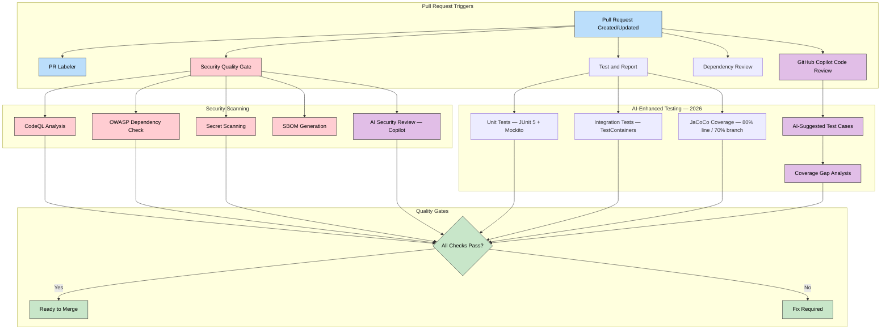
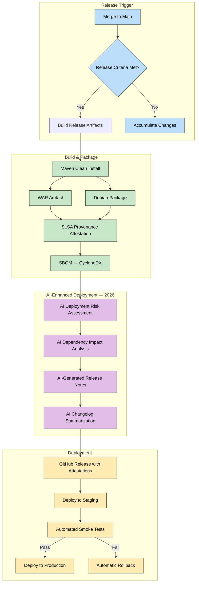
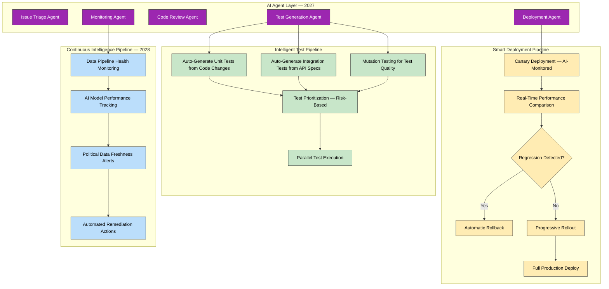
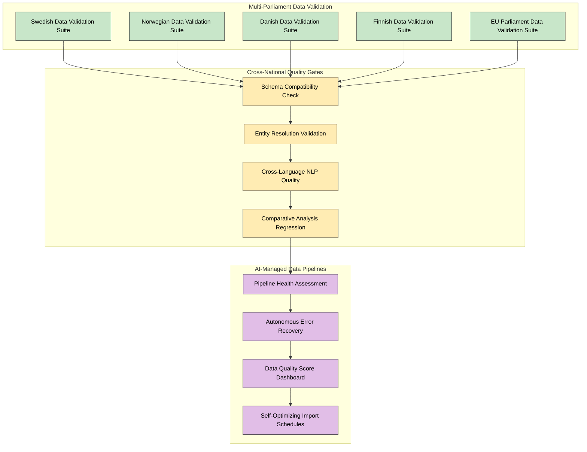
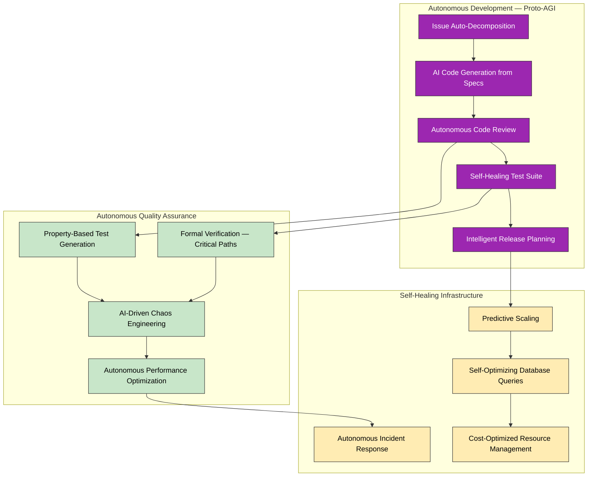
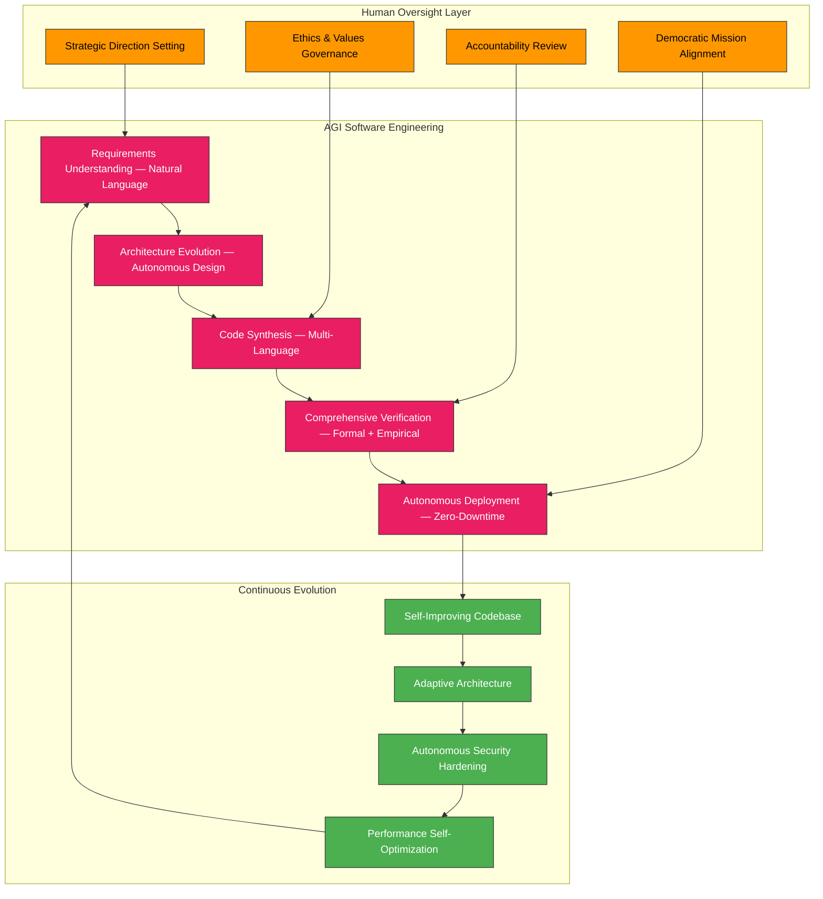
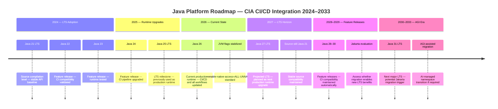

# 🔧 Future CI/CD Workflows Vision: 2026–2037 Roadmap

This document outlines the future evolution of CI/CD and DevOps workflows for the Citizen Intelligence Agency platform. The roadmap progresses from practical 2026 AI-enhanced automation through visionary 2037 autonomous development operations, accounting for Anthropic Opus 4.6 with minor updates every ~2.3 months, annual major LLM upgrades, competitor models, and the trajectory toward AGI.

## 📚 Related Architecture Documentation

<div class="documentation-map">

| Document                                            | Focus           | Description                               | Documentation Link                                                              |
| --------------------------------------------------- | --------------- | ----------------------------------------- | ------------------------------------------------------------------------------- |
| **[Architecture](ARCHITECTURE.md)**                 | 🏛️ Architecture | C4 model showing current system structure | [View Source](https://github.com/Hack23/cia/blob/master/ARCHITECTURE.md)         |
| **[Future Architecture](FUTURE_ARCHITECTURE.md)**   | 🏛️ Architecture | C4 model showing future system structure | [View Source](https://github.com/Hack23/cia/blob/master/FUTURE_ARCHITECTURE.md)         |
| **[CI/CD Workflows](WORKFLOWS.md)**                 | 🔧 DevOps       | Current automation processes              | [View Source](https://github.com/Hack23/cia/blob/master/WORKFLOWS.md)           |
| **[Future Workflows](FUTURE_WORKFLOWS.md)**         | 🔧 DevOps       | Enhanced CI/CD with ML                    | [View Source](https://github.com/Hack23/cia/blob/master/FUTURE_WORKFLOWS.md)    |
| **[State Diagrams](STATEDIAGRAM.md)**               | 🔄 Behavior     | Current system state transitions          | [View Source](https://github.com/Hack23/cia/blob/master/STATEDIAGRAM.md)        |
| **[Security Architecture](SECURITY_ARCHITECTURE.md)** | 🛡️ Security | Complete security overview                | [View Source](https://github.com/Hack23/cia/blob/master/SECURITY_ARCHITECTURE.md) |
| **[End-of-Life Strategy](End-of-Life-Strategy.md)** | 📅 Lifecycle    | Maintenance and EOL planning              | [View Source](https://github.com/Hack23/cia/blob/master/End-of-Life-Strategy.md) |
| **[CIA Features](https://hack23.com/cia-features.html)** | 🚀 Features | Platform features overview                | [View on hack23.com](https://hack23.com/cia-features.html)                     |

</div>

## 🤖 AI/LLM Impact on CI/CD Workflows

| Year | AI Capability | CI/CD Impact |
|------|--------------|--------------|
| **2026** | Anthropic Opus 4.6; GitHub Copilot agents; code generation | AI-assisted code review, test generation, documentation; Copilot agent-managed issues and PRs |
| **2027** | Multi-modal LLMs; extended context windows | AI-generated integration tests from requirements; visual regression testing with AI |
| **2028** | Specialized models; reasoning chains | Intelligent test prioritization; AI-driven deployment risk assessment |
| **2029** | Autonomous AI agents | Self-healing CI pipelines; autonomous dependency management |
| **2030–2033** | Proto-AGI capabilities | Autonomous development workflows; AI-managed release planning |
| **2034–2037** | AGI / near-AGI | Self-evolving CI/CD; autonomous software engineering lifecycle |

## 🎯 2026 Vision: AI-Enhanced CI/CD

### Enhanced Continuous Integration Pipeline


```mermaid
flowchart TB
    subgraph "Pull Request Triggers"
        PR[Pull Request Created/Updated]
        PR --> Labeler[PR Labeler]
        PR --> SecurityGate[Security Quality Gate]
        PR --> TestReport[Test and Report]
        PR --> DependencyReview[Dependency Review]
        PR --> CopilotReview[GitHub Copilot Code Review]
    end

    subgraph "AI-Enhanced Testing — 2026"
        TestReport --> UnitTests[Unit Tests — JUnit 5 + Mockito]
        TestReport --> IntegrationTests[Integration Tests — TestContainers]
        TestReport --> CoverageCheck[JaCoCo Coverage — 80% line / 70% branch]
        CopilotReview --> AITestSuggestions[AI-Suggested Test Cases]
        AITestSuggestions --> TestGapAnalysis[Coverage Gap Analysis]
    end

    subgraph "Security Scanning"
        SecurityGate --> CodeQL[CodeQL Analysis]
        SecurityGate --> DependencyCheck[OWASP Dependency Check]
        SecurityGate --> SecretScan[Secret Scanning]
        SecurityGate --> SBOM[SBOM Generation]
        SecurityGate --> AISecurityReview[AI Security Review — Copilot]
    end

    subgraph "Quality Gates"
        UnitTests & IntegrationTests & CoverageCheck --> QualityDecision{All Checks Pass?}
        CodeQL & DependencyCheck & SecretScan --> QualityDecision
        AISecurityReview & TestGapAnalysis --> QualityDecision
        QualityDecision -->|Yes| MergeReady[Ready to Merge]
        QualityDecision -->|No| FixRequired[Fix Required]
    end

    classDef trigger fill:#bbdefb,stroke:#333,stroke-width:1px,color:black
    classDef ai fill:#e1bee7,stroke:#333,stroke-width:1px,color:black
    classDef security fill:#ffcdd2,stroke:#333,stroke-width:1px,color:black
    classDef quality fill:#c8e6c9,stroke:#333,stroke-width:1px,color:black

    class PR,Labeler trigger
    class CopilotReview,AITestSuggestions,TestGapAnalysis,AISecurityReview ai
    class SecurityGate,CodeQL,DependencyCheck,SecretScan,SBOM security
    class QualityDecision,MergeReady,FixRequired quality
```

### Enhanced Continuous Deployment Pipeline


```mermaid
flowchart TB
    subgraph "Release Trigger"
        Merge[Merge to Main] --> ReleaseDecision{Release Criteria Met?}
        ReleaseDecision -->|Yes| BuildRelease[Build Release Artifacts]
        ReleaseDecision -->|No| WaitForMore[Accumulate Changes]
    end

    subgraph "Build & Package"
        BuildRelease --> MavenBuild[Maven Clean Install]
        MavenBuild --> WARPackage[WAR Artifact]
        MavenBuild --> DEBPackage[Debian Package]
        WARPackage & DEBPackage --> SLSAAttestation[SLSA Provenance Attestation]
        SLSAAttestation --> SBOMGeneration[SBOM — CycloneDX]
    end

    subgraph "AI-Enhanced Deployment — 2026"
        SBOMGeneration --> AIDeployRiskAssessment[AI Deployment Risk Assessment]
        AIDeployRiskAssessment --> AIDependencyImpact[AI Dependency Impact Analysis]
        AIDependencyImpact --> AIReleaseNotes[AI-Generated Release Notes]
        AIReleaseNotes --> AIChangelogUpdate[AI Changelog Summarization]
    end

    subgraph "Deployment"
        AIChangelogUpdate --> GitHubRelease[GitHub Release with Attestations]
        GitHubRelease --> DeployStaging[Deploy to Staging]
        DeployStaging --> SmokeTests[Automated Smoke Tests]
        SmokeTests -->|Pass| DeployProd[Deploy to Production]
        SmokeTests -->|Fail| Rollback[Automatic Rollback]
    end

    classDef trigger fill:#bbdefb,stroke:#333,stroke-width:1px,color:black
    classDef build fill:#c8e6c9,stroke:#333,stroke-width:1px,color:black
    classDef ai fill:#e1bee7,stroke:#333,stroke-width:1px,color:black
    classDef deploy fill:#ffecb3,stroke:#333,stroke-width:1px,color:black

    class Merge,ReleaseDecision,WaitForMore trigger
    class MavenBuild,WARPackage,DEBPackage,SLSAAttestation,SBOMGeneration build
    class AIDeployRiskAssessment,AIDependencyImpact,AIReleaseNotes,AIChangelogUpdate ai
    class GitHubRelease,DeployStaging,SmokeTests,DeployProd,Rollback deploy
```

### 2026 Workflow Enhancements

| Enhancement | Description | Technology |
|------------|-------------|------------|
| **GitHub Copilot Code Review** | AI-assisted pull request review for code quality, security, and best practices | GitHub Copilot Agents |
| **AI Test Case Suggestions** | Automated identification of missing test coverage and suggested test cases | Copilot + JaCoCo analysis |
| **AI Security Review** | LLM-powered security vulnerability detection beyond static analysis | Copilot + CodeQL |
| **AI Release Notes** | Automated generation of human-readable release notes from commit history | LLM summarization |
| **AI Deployment Risk Assessment** | Pre-deployment risk scoring based on change scope, dependency updates, and historical failures | LLM + historical data |
| **SLSA Level 3 Compliance** | Build provenance attestation and SBOM generation for supply chain security | GitHub Actions attestation |

## 🔮 2027–2029 Vision: Intelligent DevOps

### AI Agent-Managed CI/CD (2027–2028)


```mermaid
flowchart TB
    subgraph "AI Agent Layer — 2027"
        A1[Issue Triage Agent]
        A2[Test Generation Agent]
        A3[Code Review Agent]
        A4[Deployment Agent]
        A5[Monitoring Agent]
    end

    subgraph "Intelligent Test Pipeline"
        A2 --> TG1[Auto-Generate Unit Tests from Code Changes]
        A2 --> TG2[Auto-Generate Integration Tests from API Specs]
        A2 --> TG3[Mutation Testing for Test Quality]
        TG1 & TG2 & TG3 --> TP[Test Prioritization — Risk-Based]
        TP --> TR[Parallel Test Execution]
    end

    subgraph "Smart Deployment Pipeline"
        A4 --> SD1[Canary Deployment — AI-Monitored]
        SD1 --> SD2[Real-Time Performance Comparison]
        SD2 --> SD3{Regression Detected?}
        SD3 -->|Yes| SD4[Automatic Rollback]
        SD3 -->|No| SD5[Progressive Rollout]
        SD5 --> SD6[Full Production Deploy]
    end

    subgraph "Continuous Intelligence Pipeline — 2028"
        A5 --> CI1[Data Pipeline Health Monitoring]
        CI1 --> CI2[AI Model Performance Tracking]
        CI2 --> CI3[Political Data Freshness Alerts]
        CI3 --> CI4[Automated Remediation Actions]
    end

    classDef agent fill:#9C27B0,stroke:#333,stroke-width:1px,color:white
    classDef test fill:#c8e6c9,stroke:#333,stroke-width:1px,color:black
    classDef deploy fill:#ffecb3,stroke:#333,stroke-width:1px,color:black
    classDef intel fill:#bbdefb,stroke:#333,stroke-width:1px,color:black

    class A1,A2,A3,A4,A5 agent
    class TG1,TG2,TG3,TP,TR test
    class SD1,SD2,SD3,SD4,SD5,SD6 deploy
    class CI1,CI2,CI3,CI4 intel
```

### Cross-National CI/CD Extension (2029)


```mermaid
flowchart TB
    subgraph "Multi-Parliament Data Validation"
        MV1[Swedish Data Validation Suite]
        MV2[Norwegian Data Validation Suite]
        MV3[Danish Data Validation Suite]
        MV4[Finnish Data Validation Suite]
        MV5[EU Parliament Data Validation Suite]
    end

    subgraph "Cross-National Quality Gates"
        MV1 & MV2 & MV3 & MV4 & MV5 --> CQ1[Schema Compatibility Check]
        CQ1 --> CQ2[Entity Resolution Validation]
        CQ2 --> CQ3[Cross-Language NLP Quality]
        CQ3 --> CQ4[Comparative Analysis Regression]
    end

    subgraph "AI-Managed Data Pipelines"
        CQ4 --> AI1[Pipeline Health Assessment]
        AI1 --> AI2[Autonomous Error Recovery]
        AI2 --> AI3[Data Quality Score Dashboard]
        AI3 --> AI4[Self-Optimizing Import Schedules]
    end

    classDef validate fill:#c8e6c9,stroke:#333,stroke-width:1px,color:black
    classDef quality fill:#ffecb3,stroke:#333,stroke-width:1px,color:black
    classDef ai fill:#e1bee7,stroke:#333,stroke-width:1px,color:black

    class MV1,MV2,MV3,MV4,MV5 validate
    class CQ1,CQ2,CQ3,CQ4 quality
    class AI1,AI2,AI3,AI4 ai
```

## 🌍 2030–2033 Vision: Autonomous Development Operations

### Self-Managing Development Pipeline (2030+)


```mermaid
flowchart TB
    subgraph "Autonomous Development — Proto-AGI"
        AD1[Issue Auto-Decomposition]
        AD2[AI Code Generation from Specs]
        AD3[Autonomous Code Review]
        AD4[Self-Healing Test Suite]
        AD5[Intelligent Release Planning]
    end

    subgraph "Autonomous Quality Assurance"
        AQ1[Property-Based Test Generation]
        AQ2[Formal Verification — Critical Paths]
        AQ3[AI-Driven Chaos Engineering]
        AQ4[Autonomous Performance Optimization]
    end

    subgraph "Self-Healing Infrastructure"
        SI1[Predictive Scaling]
        SI2[Autonomous Incident Response]
        SI3[Self-Optimizing Database Queries]
        SI4[Cost-Optimized Resource Management]
    end

    AD1 --> AD2 --> AD3 --> AD4 --> AD5
    AD3 --> AQ1
    AD4 --> AQ2
    AQ1 & AQ2 --> AQ3 --> AQ4
    AD5 --> SI1
    AQ4 --> SI2
    SI1 --> SI3 --> SI4

    classDef dev fill:#9C27B0,stroke:#333,stroke-width:1px,color:white
    classDef qa fill:#c8e6c9,stroke:#333,stroke-width:1px,color:black
    classDef infra fill:#ffecb3,stroke:#333,stroke-width:1px,color:black

    class AD1,AD2,AD3,AD4,AD5 dev
    class AQ1,AQ2,AQ3,AQ4 qa
    class SI1,SI2,SI3,SI4 infra
```

## 🚀 2034–2037 Visionary Horizon: AGI-Managed Software Lifecycle

### AGI-Era Development Workflow (2034–2037)


```mermaid
flowchart TB
    subgraph "AGI Software Engineering"
        AGI1[Requirements Understanding — Natural Language]
        AGI2[Architecture Evolution — Autonomous Design]
        AGI3[Code Synthesis — Multi-Language]
        AGI4[Comprehensive Verification — Formal + Empirical]
        AGI5[Autonomous Deployment — Zero-Downtime]
    end

    subgraph "Human Oversight Layer"
        HO1[Strategic Direction Setting]
        HO2[Ethics & Values Governance]
        HO3[Accountability Review]
        HO4[Democratic Mission Alignment]
    end

    subgraph "Continuous Evolution"
        CE1[Self-Improving Codebase]
        CE2[Adaptive Architecture]
        CE3[Autonomous Security Hardening]
        CE4[Performance Self-Optimization]
    end

    HO1 --> AGI1
    HO2 --> AGI3
    AGI1 --> AGI2 --> AGI3 --> AGI4 --> AGI5
    HO3 --> AGI4
    HO4 --> AGI5
    AGI5 --> CE1 --> CE2 --> CE3 --> CE4
    CE4 --> AGI1

    classDef agi fill:#E91E63,stroke:#333,stroke-width:1px,color:white
    classDef human fill:#FF9800,stroke:#333,stroke-width:1px,color:black
    classDef evolve fill:#4CAF50,stroke:#333,stroke-width:1px,color:white

    class AGI1,AGI2,AGI3,AGI4,AGI5 agi
    class HO1,HO2,HO3,HO4 human
    class CE1,CE2,CE3,CE4 evolve
```

## 📊 Workflow Evolution Timeline


```mermaid
timeline
    title CIA CI/CD Workflow Evolution: 2026–2037

    section 2026 — AI-Enhanced Automation
      GitHub Copilot code review integration : AI-assisted PR review
      AI test case suggestion pipeline : Coverage gap identification
      AI deployment risk assessment : Pre-deploy risk scoring
      SLSA Level 3 attestation : Supply chain security

    section 2027–2028 — Intelligent DevOps
      AI agent-managed CI/CD : Autonomous test generation and deployment
      Risk-based test prioritization : Smart test execution ordering
      Canary deployment with AI monitoring : Automated regression detection
      Continuous intelligence pipeline : Data pipeline health monitoring

    section 2029–2030 — Autonomous Pipelines
      Cross-national data validation suites : Multi-parliament quality gates
      Self-healing CI pipelines : Autonomous error recovery
      AI-managed data import optimization : Self-optimizing schedules
      Autonomous dependency management : Security-aware version updates

    section 2031–2033 — Proto-AGI DevOps
      AI code generation from specs : Autonomous development
      Formal verification for critical paths : Mathematical correctness proofs
      AI-driven chaos engineering : Autonomous resilience testing
      Self-healing infrastructure : Predictive scaling and incident response

    section 2034–2037 — AGI Software Lifecycle
      AGI-managed software engineering : Requirements to deployment
      Self-improving codebase : Continuous autonomous optimization
      Autonomous security hardening : Real-time threat adaptation
      Human oversight governance layer : Strategic and ethical control
```

## 🔄 GitHub Actions Evolution Plan

| Current (2026) | Enhanced (2028) | Autonomous (2031) | AGI-Era (2035) |
|---------------|-----------------|-------------------|----------------|
| `verify-and-release.yml` with Maven build | AI-enhanced build with smart test selection | Autonomous build optimization and parallelization | AGI-managed build system evolution |
| `codeql-analysis.yml` for security scanning | Multi-tool security scanning with AI triage | Autonomous vulnerability remediation | Real-time security posture management |
| `dependency-review.yml` for supply chain | AI-driven dependency upgrade with compatibility testing | Autonomous dependency lifecycle management | Self-evolving dependency strategy |
| `release-drafter.yml` for release notes | AI-generated comprehensive release documentation | Autonomous release planning and execution | AGI-managed continuous delivery |
| `labeler.yml` for PR categorization | AI intent-based PR classification and routing | Autonomous issue-to-deployment pipeline | Self-organizing development workflow |

## ☕ Java Platform Roadmap & CI/CD Integration

The CIA platform runs on Java (Temurin distribution) and tracks the OpenJDK release cadence to ensure secure, performant, and up-to-date CI/CD pipelines.

### Java Release Timeline & CI/CD Impact


```mermaid
timeline
    title Java Platform Roadmap — CIA CI/CD Integration 2024–2033

    section 2024 — LTS Adoption
      Java 21 LTS : Source compilation level — stable API baseline
      Java 22 : Feature release — CI compatibility validated
      Java 23 : Feature release — runtime tested

    section 2025 — Runtime Upgrades
      Java 24 : Feature release — CI pipeline upgraded
      Java 25 LTS : LTS milestone — previously used as production runtime

    section 2026 — Current State
      Java 26 : Current production runtime — CI/CD and all workflows updated
      JVM flags stabilized : --enable-native-access=ALL-UNNAMED standard

    section 2027 — LTS Horizon
      Java 27 LTS : Projected LTS — planned as next production runtime upgrade
      Source still Java 21 : Stable source compatibility maintained

    section 2028–2029 — Feature Releases
      Java 28–30 : Feature releases — CI compatibility maintained automatically
      Jakarta evaluation : Assess whether migration enables new LTS benefits

    section 2030–2033 — AGI Era
      Java 31 LTS : Next major LTS — potential Jakarta migration trigger
      AGI-assisted migration : AI-managed namespace transition if required
```

### Java Upgrade Strategy for CI/CD Workflows

| Java Version | Type | CI/CD Action | Timeline |
|---|---|---|---|
| **Java 21** | LTS | Source compilation level — no change | Maintained indefinitely |
| **Java 25** | LTS | Previously runtime — now fallback compatible | Maintained in POM profile |
| **Java 26** | Feature | **Current runtime** — all workflows updated | Active (2026) |
| **Java 27** | LTS | Priority upgrade — CI/CD pipeline update within 1 month of GA | Projected 2027 |
| **Java 28** | Feature | CI compatibility test within 3 months of GA | Projected March 2028 |
| **Java 29** | Feature | CI compatibility test within 3 months of GA | Projected September 2028 |
| **Java 30** | Feature | CI compatibility test within 3 months of GA | Projected March 2029 |
| **Java 31** | LTS | Major upgrade — evaluate Jakarta migration | Projected September 2029 |

### Maven Profile Strategy per Java Version

The `parent-pom/pom.xml` maintains version-specific profiles for JVM flags and toolchain compatibility:

```xml
<!-- Active profiles for multi-version CI compatibility -->
<profile>
  <id>java21</id>   <!-- Source-level validation -->
  <activation><jdk>21</jdk></activation>
</profile>
<profile>
  <id>java25</id>   <!-- LTS fallback compatibility -->
  <activation><jdk>25</jdk></activation>
</profile>
<profile>
  <id>java26</id>   <!-- Current production runtime -->
  <activation><jdk>26</jdk></activation>
</profile>
<!-- Future profiles added as new Java versions are adopted -->
```

**Profile Conventions:**
- All profiles with Java ≥ 22 set `<forbiddenapis.skip>true</forbiddenapis.skip>` (unavailable signatures)
- All profiles use `--enable-native-access=ALL-UNNAMED` for modern JVM compatibility
- Source and target remain at Java 21 across all profiles for library compatibility

### GitHub Actions Setup-Java Configuration

```yaml
# Current configuration — Java 26
- name: Set up JDK 26
  uses: actions/setup-java@v5
  with:
    distribution: 'temurin'
    java-version: '26'
    java-package: 'jdk'
    check-latest: true
    architecture: 'x64'

# Future configuration template — Java 27 LTS (projected 2027)
- name: Set up JDK 27
  uses: actions/setup-java@v5
  with:
    distribution: 'temurin'
    java-version: '27'
    java-package: 'jdk'
    check-latest: true
    architecture: 'x64'
```

## AI Provider Considerations for CI/CD

| Design Principle | Rationale |
|-----------------|-----------|
| **Version-Pinned AI Actions** | Pin GitHub Copilot and AI action versions; test compatibility with each ~2.3-month LLM update |
| **AI Fallback Paths** | All AI-enhanced CI steps have non-AI fallbacks ensuring builds succeed without AI services |
| **Cost Monitoring** | Track AI API costs per CI run; implement budget limits and smart caching |
| **Multi-Provider Testing** | Benchmark CI/CD AI features across Anthropic, OpenAI, and open-source models annually |
| **Reproducible Builds** | Record AI model versions used in each build for audit and reproducibility |
| **AGI-Ready Architecture** | CI/CD pipeline structure allows AGI services as drop-in replacements for narrow AI tools |

## Related Documentation

- [Current CI/CD Workflows](WORKFLOWS.md) — Review current automation processes
- [Current Architecture](ARCHITECTURE.md) — System architecture context
- [Future Architecture](FUTURE_ARCHITECTURE.md) — Platform evolution roadmap
- [Security Architecture](SECURITY_ARCHITECTURE.md) — Security controls and compliance
- [End-of-Life Strategy](End-of-Life-Strategy.md) — Technology maintenance planning
- [CIA Features](https://hack23.com/cia-features.html) — Current feature showcase
