# 🔧 Future Citizen Intelligence Agency CI/CD Workflows

This document outlines the future vision for CI/CD and DevOps workflows that will support the Citizen Intelligence Agency as it evolves into an AI-enhanced political transparency platform. These enhanced workflows will incorporate machine learning, automated security validation, and continuous adaptation capabilities.

## 📚 Related Architecture Documentation

<div class="documentation-map">

| Document                                            | Focus           | Description                               | Documentation Link                                                              |
| --------------------------------------------------- | --------------- | ----------------------------------------- | ------------------------------------------------------------------------------- |
| **[Architecture](ARCHITECTURE.md)**                 | 🏛️ Architecture | C4 model showing current system structure | [View Source](https://github.com/Hack23/cia/blob/master/ARCHITECTURE.md)         |
| **[Future Architecture](FUTURE_ARCHITECTURE.md)**   | 🏛️ Architecture | C4 model showing future system structure | [View Source](https://github.com/Hack23/cia/blob/master/FUTURE_ARCHITECTURE.md)         |
| **[Mindmaps](MINDMAP.md)**                          | 🧠 Concept      | Current system component relationships    | [View Source](https://github.com/Hack23/cia/blob/master/MINDMAP.md)             |
| **[Future Mindmaps](FUTURE_MINDMAP.md)**            | 🧠 Concept      | Future capability evolution               | [View Source](https://github.com/Hack23/cia/blob/master/FUTURE_MINDMAP.md)      |
| **[SWOT Analysis](SWOT.md)**                        | 💼 Business     | Current strategic assessment              | [View Source](https://github.com/Hack23/cia/blob/master/SWOT.md)                |
| **[Future SWOT Analysis](FUTURE_SWOT.md)**          | 💼 Business     | Future strategic opportunities            | [View Source](https://github.com/Hack23/cia/blob/master/FUTURE_SWOT.md)         |
| **[Data Model](DATA_MODEL.md)**                     | 📊 Data         | Current data structures and relationships | [View Source](https://github.com/Hack23/cia/blob/master/DATA_MODEL.md)          |
| **[Future Data Model](FUTURE_DATA_MODEL.md)**       | 📊 Data         | Enhanced political data architecture      | [View Source](https://github.com/Hack23/cia/blob/master/FUTURE_DATA_MODEL.md)   |
| **[Flowcharts](FLOWCHART.md)**                      | 🔄 Process      | Current data processing workflows         | [View Source](https://github.com/Hack23/cia/blob/master/FLOWCHART.md)           |
| **[Future Flowcharts](FUTURE_FLOWCHART.md)**        | 🔄 Process      | Enhanced AI-driven workflows              | [View Source](https://github.com/Hack23/cia/blob/master/FUTURE_FLOWCHART.md)    |
| **[State Diagrams](STATEDIAGRAM.md)**               | 🔄 Behavior     | Current system state transitions          | [View Source](https://github.com/Hack23/cia/blob/master/STATEDIAGRAM.md)        |
| **[Future State Diagrams](FUTURE_STATEDIAGRAM.md)** | 🔄 Behavior     | Enhanced adaptive state transitions       | [View Source](https://github.com/Hack23/cia/blob/master/FUTURE_STATEDIAGRAM.md) |
| **[CI/CD Workflows](WORKFLOWS.md)**                 | 🔧 DevOps       | Current automation processes              | [View Source](https://github.com/Hack23/cia/blob/master/WORKFLOWS.md)           |
| **[Future Workflows](FUTURE_WORKFLOWS.md)**         | 🔧 DevOps       | Enhanced CI/CD with ML                    | [View Source](https://github.com/Hack23/cia/blob/master/FUTURE_WORKFLOWS.md)    |
| **[End-of-Life Strategy](End-of-Life-Strategy.md)** | 📅 Lifecycle    | Maintenance and EOL planning              | [View Source](https://github.com/Hack23/cia/blob/master/End-of-Life-Strategy.md) |
| **[Financial Security Plan](FinancialSecurityPlan.md)** | 💰 Security | Cost and security implementation          | [View Source](https://github.com/Hack23/cia/blob/master/FinancialSecurityPlan.md) |
| **[CIA Features](https://hack23.com/cia-features.html)** | 🚀 Features | Platform features overview                | [View on hack23.com](https://hack23.com/cia-features.html)                     |


</div>

## 🔄 Enhanced CI/CD Workflow Overview

The future CI/CD workflows for the CIA platform will build on the current foundation while adding significant enhancements for machine learning model training, political data analysis, and automated adaptation.


## 🧠 Machine Learning Pipeline Integration

The future CI/CD system will incorporate machine learning model training, validation, and deployment as a core aspect of political data analysis workflows.


| ML Pipeline Stage      | Description                                         | Integration Point                 | Metrics & Validation                         |
|------------------------|-----------------------------------------------------|----------------------------------|--------------------------------------------|
| 🧪 Data Preparation    | Process political data from multiple sources        | Data pipelines in CI/CD workflow | Data completeness, balance, consistency    |
| 🔍 Model Training      | Train predictive political analysis models          | Pre-release workflow             | Accuracy, precision, recall, F1-score      |
| 📊 Performance Testing | Validate models against historical data             | Quality gates                    | Prediction accuracy, confidence scores      |
| 📦 Model Packaging     | Package models for deployment                       | Release packaging                | Size, format, version compatibility        |
| 🔏 Model Attestation   | Create cryptographic attestations for models        | Security workflow                | Signature verification, provenance         |
| 🚀 Model Deployment    | Deploy models to production environment             | Deployment pipeline              | Loading time, inference performance        |
| 📈 Performance Monitoring | Track political prediction accuracy              | Post-deployment                  | Prediction accuracy, drift detection       |
| 🔄 Feedback Loop       | Collect feedback for retraining                     | Continuous improvement           | User feedback, corrective actions          |

## AI-Enhanced Political Analysis Models

The following machine learning models will be incorporated into the CI/CD pipeline to enhance political data analysis:


## 🔒 Enhanced Security & Compliance Automation

Future CI/CD pipelines will incorporate advanced security automation that continuously validates and improves the security posture of the CIA platform.


## 🚀 Continuous Deployment Evolution

The future deployment pipeline will evolve to support more sophisticated release strategies, including canary releases, blue-green deployments, and automated rollbacks.


## 🔍 Political Data Integration Pipeline

The enhanced CI/CD system will include specialized workflows for political data integration, ensuring data quality, consistency, and timeliness.

```mermaid
sequenceDiagram
    participant DS as 🏛️ Data Sources
    participant DI as 🔄 Data Integration
    participant QC as 🔍 Quality Control
    participant ML as 🧠 ML Pipeline
    participant ST as 📊 Storage
    participant AN as 📈 Analytics
    participant UI as 🖥️ UI Components
    
    DS->>DI: Raw Political Data
    
    par Parallel Processing
        DI->>QC: Parliament Data
        DI->>QC: Election Data
        DI->>QC: Government Body Data
        DI->>QC: International Data
    end
    
    QC->>QC: Validate Data Quality
    QC->>QC: Standardize Formats
    QC->>QC: Cross-Reference Check
    
    QC->>ST: Store Validated Data
    QC->>ML: Provide Training Data
    
    ML->>ML: Train/Update Models
    ML->>ST: Store Model Artifacts
    
    ST->>AN: Provide Data for Analysis
    ST->>AN: Provide Models for Inference
    
    AN->>AN: Generate Political Insights
    AN->>UI: Deliver Visualizations
    
    note over ML,AN: Continuous Feedback Loop
    AN-->>ML: Model Performance Metrics
    
    UI->>UI: Render Political Intelligence
```



## 🧠 Adaptive CI/CD Systems

Future CI/CD systems will incorporate adaptive capabilities that automatically optimize workflows based on project patterns and performance metrics.


## 🔄 Advanced Code Quality Verification

Future CI/CD workflows will incorporate sophisticated code quality verification that includes intelligent code review assistance, automated refactoring suggestions, and semantic code analysis.


## 📈 Implementation Roadmap

This section outlines the phased implementation approach for the future CI/CD workflows, ensuring a gradual transition from current capabilities to the enhanced ML-driven system.

```mermaid
gantt
    title Future CI/CD Workflow Implementation Roadmap
    dateFormat  YYYY-Q1
    axisFormat  %Y-%q
    
    section Foundation Building
    Data Pipeline Modernization           :a1, 2024-Q3, 6m
    ML Infrastructure Setup               :a2, after a1, 6m
    Security Automation Enhancement       :a3, 2024-Q4, 6m
    
    section ML Model Integration
    Political Data Preparation Pipeline   :b1, after a2, 4m
    Initial Model Training Workflow       :b2, after b1, 3m
    Model Validation Integration          :b3, after b2, 3m
    Model Deployment Pipeline             :b4, after b3, 4m
    
    section Advanced Deployment
    Canary Release Implementation         :c1, after a3, 6m
    Blue-Green Deployment Setup           :c2, after c1, 4m
    Automated Rollback Capability         :c3, after c2, 3m
    
    section Continuous Optimization
    Workflow Monitoring Framework         :d1, 2025-Q3, 6m
    Adaptive Optimization Engine          :d2, after d1, 6m
    Self-Improvement System               :d3, after d2, 6m
    
    section Integration & Finalization
    Documentation & Training              :e1, 2026-Q2, 3m
    Full System Integration               :e2, after e1, 3m
    Production Transition                 :e3, after e2, 3m
```

## Conclusion

The future CI/CD workflows for the Citizen Intelligence Agency will evolve from simple automation to sophisticated, AI-enhanced systems that continuously improve themselves while delivering high-quality political data analysis tools. By integrating machine learning throughout the development lifecycle, the platform will achieve:

1. **Enhanced Political Data Analysis**: Automated insight generation and prediction capabilities
2. **Continuous Security Improvement**: Self-optimizing security validation that adapts to emerging threats
3. **Efficient Release Management**: Sophisticated deployment strategies that minimize risk and maximize uptime
4. **Quality Assurance Automation**: Intelligent code review and automated improvement suggestions
5. **Operational Excellence**: Workflows that learn from their own performance and continuously optimize

This future vision aligns with the broader [Future Architecture](FUTURE_ARCHITECTURE.md) and [Future Mindmaps](FUTURE_MINDMAP.md) to create a comprehensive, AI-driven political transparency platform.
