# Intelligence Data Flow Map
## Complete Cross-Reference System for CIA Platform Intelligence Operations

**Version:** 1.0  
**Date:** 2025-11-22  
**Status:** Active  
**Purpose:** Central navigation hub connecting data sources, database views, analytical frameworks, and intelligence products

---

## 🎯 How to Use This Document

This document serves as the **central navigation hub** for the CIA platform's intelligence documentation. It provides comprehensive mappings between:

- **OSINT Data Sources** → Database Views → Analysis Frameworks → Intelligence Products
- **Analysis Frameworks** ↔ **Database Views** (bidirectional mapping)
- **Risk Rules** → **Database Views** (data source mapping)
- **Database Views** → **Analysis Frameworks** (usage patterns)

**Navigation Strategies:**
- **Top-Down Approach**: Start with [Complete Data Flow Diagram](#complete-data-flow-diagram) to understand the entire pipeline
- **Bottom-Up Approach**: Start with [View → Analysis Framework Mapping](#view--analysis-framework-mapping) to see how specific views are used
- **Framework-Centric**: Use [Analysis Framework → View Mapping](#analysis-framework--view-mapping) to find views for your analysis type
- **Risk-Centric**: Use [Risk Rule → View Mapping](#risk-rule--view-mapping) to understand risk detection data sources

---

## 📚 Related Documentation

<table>
<tr>
<td width="50%">

### 📊 Core Documentation

| Document | Focus | Link |
|----------|-------|------|
| **[Data Analysis Frameworks](DATA_ANALYSIS_INTOP_OSINT.md)** | 🎯 Analysis | 6 analytical frameworks with methodologies |
| **[Database View Catalog](DATABASE_VIEW_INTELLIGENCE_CATALOG.md)** | 🗄️ Views | 84 database views with complete documentation |
| **[Risk Rules](RISK_RULES_INTOP_OSINT.md)** | 🔴 Rules | 50 behavioral detection rules |
| **[Schema Maintenance](service.data.impl/README-SCHEMA-MAINTENANCE.md)** | 🔧 Maintenance | Database maintenance and optimization |

</td>
<td width="50%">

### 📜 Supporting Documentation

| Document | Focus | Link |
|----------|-------|------|
| **[Intelligence Changelog](CHANGELOG_INTELLIGENCE.md)** | 📜 History | Unified capability tracking |
| **[Liquibase Analysis](LIQUIBASE_CHANGELOG_INTELLIGENCE_ANALYSIS.md)** | 🗄️ Schema | Schema evolution analysis |
| **[Data Model](DATA_MODEL.md)** | 📊 Structure | Database schema relationships |
| **[Business Product Doc](BUSINESS_PRODUCT_DOCUMENT.md)** | 💼 Strategy | Product strategy and features |

</td>
</tr>
</table>

---

## 📋 Quick Navigation

| I Want To...                          | Navigate To                                                                                      | Description                                  |
|---------------------------------------|--------------------------------------------------------------------------------------------------|----------------------------------------------|
| **See the complete data pipeline**    | [Complete Data Flow Diagram](#complete-data-flow-diagram)                                        | Visual overview of entire intelligence pipeline |
| **Find views for an analysis type**  | [Analysis Framework → View Mapping](#analysis-framework--view-mapping)                           | Framework-to-view relationships              |
| **Find analysis types for a view**   | [View → Analysis Framework Mapping](#view--analysis-framework-mapping)                           | View-to-framework relationships              |
| **Understand risk rule data sources** | [Risk Rule → View Mapping](#risk-rule--view-mapping)                                             | Rules and their data dependencies            |
| **Explore intelligence products**     | [Intelligence Products](#intelligence-products)                                                  | How products are generated from views        |
| **Learn about analytical frameworks** | [DATA_ANALYSIS_INTOP_OSINT.md](DATA_ANALYSIS_INTOP_OSINT.md)                                    | Deep dive into 6 analysis methodologies      |
| **Browse all database views**         | [DATABASE_VIEW_INTELLIGENCE_CATALOG.md](DATABASE_VIEW_INTELLIGENCE_CATALOG.md)                   | Complete view catalog with examples          |
| **Review risk detection rules**       | [RISK_RULES_INTOP_OSINT.md](RISK_RULES_INTOP_OSINT.md)                                          | All 50 behavioral detection rules            |
| **Maintain database schema**          | [README-SCHEMA-MAINTENANCE.md](service.data.impl/README-SCHEMA-MAINTENANCE.md)                   | Schema maintenance procedures                |

---

## Complete Data Flow Diagram

This diagram shows the complete intelligence pipeline from OSINT collection through database views to analytical frameworks and intelligence products.

```mermaid
%%{init: {'theme':'base', 'themeVariables': { 'fontSize':'12px'}}}%%
flowchart TB
    subgraph COLLECTION["🔍 OSINT Collection Layer"]
        API1[📡 Riksdagen API<br/>Parliamentary Data]
        API2[📊 Election Authority<br/>Electoral Data]
        API3[💰 World Bank<br/>Economic Data]
        API4[🏛️ Financial Authority<br/>Government Finance]
    end
    
    subgraph DATABASE["🗄️ Database Views - 82 Total"]
        direction LR
        V1["<b>Politician Views</b><br/>8 views<br/>Performance tracking"]
        V2["<b>Party Views</b><br/>12 views<br/>Party analytics"]
        V3["<b>Committee Views</b><br/>12 views<br/>Legislative work"]
        V4["<b>Ministry Views</b><br/>7 views<br/>Government oversight"]
        V5["<b>Vote Data Views</b><br/>20 views<br/>Voting patterns"]
        V6["<b>Document Views</b><br/>7 views<br/>Legislative output"]
        V7["<b>Intelligence Views</b><br/>6 views<br/>Risk & anomaly"]
        V8["<b>Application Views</b><br/>10 views<br/>Platform usage"]
    end
    
    subgraph ANALYSIS["📊 Analytical Frameworks - 5 Types"]
        F1["<b>Temporal Analysis</b><br/>Trend detection<br/>Time series"]
        F2["<b>Comparative Analysis</b><br/>Benchmarking<br/>Peer comparison"]
        F3["<b>Pattern Recognition</b><br/>Anomaly detection<br/>Clustering"]
        F4["<b>Predictive Intelligence</b><br/>Forecasting<br/>Risk modeling"]
        F5["<b>Network Analysis</b><br/>Influence mapping<br/>Coalition dynamics"]
    end
    
    subgraph RULES["⚙️ Risk Detection - 45 Rules"]
        R1["<b>Politician Rules</b><br/>24 rules<br/>Individual behavior"]
        R2["<b>Party Rules</b><br/>10 rules<br/>Organizational health"]
        R3["<b>Committee Rules</b><br/>4 rules<br/>Legislative effectiveness"]
        R4["<b>Ministry Rules</b><br/>4 rules<br/>Government performance"]
        R5["<b>Other Rules</b><br/>3 rules<br/>Application monitoring"]
    end
    
    subgraph PRODUCTS["📑 Intelligence Products"]
        P1["<b>Political Scorecards</b><br/>Performance rankings"]
        P2["<b>Risk Assessments</b><br/>Threat analysis"]
        P3["<b>Coalition Analysis</b><br/>Alliance dynamics"]
        P4["<b>Trend Reports</b><br/>Pattern insights"]
        P5["<b>Compliance Dashboards</b><br/>Accountability tracking"]
    end
    
    API1 & API2 & API3 & API4 --> DATABASE
    DATABASE --> ANALYSIS
    DATABASE --> RULES
    ANALYSIS --> PRODUCTS
    RULES --> PRODUCTS
    
    style COLLECTION fill:#e1f5ff,stroke:#333,stroke-width:2px
    style DATABASE fill:#d1c4e9,stroke:#333,stroke-width:2px
    style ANALYSIS fill:#ffeb99,stroke:#333,stroke-width:2px
    style RULES fill:#ffcccc,stroke:#333,stroke-width:2px
    style PRODUCTS fill:#ccffcc,stroke:#333,stroke-width:2px
```

---

## Analysis Framework → View Mapping

This table maps each analytical framework to the database views it uses most frequently.

### Temporal Analysis Framework

**Purpose:** Detect trends, patterns, and changes over time  
**Documentation:** [DATA_ANALYSIS_INTOP_OSINT.md - Temporal Analysis](DATA_ANALYSIS_INTOP_OSINT.md#1-temporal-analysis-framework)

| View Name | Purpose | Temporal Granularity | Link |
|-----------|---------|---------------------|------|
| **view_riksdagen_politician_summary** | Politician performance over time | Daily/Annual | [View Docs](DATABASE_VIEW_INTELLIGENCE_CATALOG.md#view_riksdagen_politician_summary) |
| **view_riksdagen_vote_data_ballot_politician_summary_daily** | Daily voting activity | Daily | [View Docs](DATABASE_VIEW_INTELLIGENCE_CATALOG.md#view_riksdagen_vote_data_ballot_politician_summary_daily) |
| **view_riksdagen_vote_data_ballot_politician_summary_weekly** | Weekly voting trends | Weekly | [View Docs](DATABASE_VIEW_INTELLIGENCE_CATALOG.md#vote-data-views) |
| **view_riksdagen_vote_data_ballot_politician_summary_monthly** | Monthly engagement patterns | Monthly | [View Docs](DATABASE_VIEW_INTELLIGENCE_CATALOG.md#vote-data-views) |
| **view_riksdagen_vote_data_ballot_politician_summary_annual** | Annual performance assessment | Annual | [View Docs](DATABASE_VIEW_INTELLIGENCE_CATALOG.md#vote-data-views) |
| **view_riksdagen_party_ballot_support_annual_summary** | Party voting patterns by year | Annual | [View Docs](DATABASE_VIEW_INTELLIGENCE_CATALOG.md#party-views) |
| **view_riksdagen_committee_decision_summary** | Committee productivity trends | Ongoing | [View Docs](DATABASE_VIEW_INTELLIGENCE_CATALOG.md#committee-views) |
| **view_riksdagen_politician_document_daily_summary** | Document production trends | Daily | [View Docs](DATABASE_VIEW_INTELLIGENCE_CATALOG.md#document-views) |

**Related Risk Rules:** [#1 PoliticianLazy](RISK_RULES_INTOP_OSINT.md#1--politicianlazydrl---absenteeism-detection), [#4 PoliticianDecliningEngagement](RISK_RULES_INTOP_OSINT.md#4--politiciandecliningengagementdrl---trend-analysis)

---

### Comparative Analysis Framework

**Purpose:** Benchmark performance against peers and standards  
**Documentation:** [DATA_ANALYSIS_INTOP_OSINT.md - Comparative Analysis](DATA_ANALYSIS_INTOP_OSINT.md#2-comparative-analysis-framework)

| View Name | Purpose | Comparison Type | Link |
|-----------|---------|----------------|------|
| **view_riksdagen_politician_summary** | Individual vs. party benchmarks | Peer comparison | [View Docs](DATABASE_VIEW_INTELLIGENCE_CATALOG.md#view_riksdagen_politician_summary) |
| **view_riksdagen_party_summary** | Inter-party comparison | Party comparison | [View Docs](DATABASE_VIEW_INTELLIGENCE_CATALOG.md#party-views) |
| **view_riksdagen_party_ballot_support_annual_summary** | Party voting effectiveness | Historical comparison | [View Docs](DATABASE_VIEW_INTELLIGENCE_CATALOG.md#party-views) |
| **view_riksdagen_committee_ballot_decision_summary** | Committee effectiveness comparison | Committee benchmarking | [View Docs](DATABASE_VIEW_INTELLIGENCE_CATALOG.md#committee-views) |
| **view_riksdagen_politician_document_daily_summary** | Document productivity comparison | Output benchmarking | [View Docs](DATABASE_VIEW_INTELLIGENCE_CATALOG.md#document-views) |
| **view_riksdagen_vote_data_ballot_politician_summary_annual** | Annual performance ranking | Percentile analysis | [View Docs](DATABASE_VIEW_INTELLIGENCE_CATALOG.md#vote-data-views) |

**Related Risk Rules:** [#2 PoliticianIneffectiveVoting](RISK_RULES_INTOP_OSINT.md#2--politicianineffectivevotingdrl---effectiveness-tracking), [#8 PoliticianLowDocumentActivity](RISK_RULES_INTOP_OSINT.md#8--politicianlowdocumentactivitydrl---legislative-productivity)

---

### Pattern Recognition Framework

**Purpose:** Identify anomalies, clusters, and behavioral patterns  
**Documentation:** [DATA_ANALYSIS_INTOP_OSINT.md - Pattern Recognition](DATA_ANALYSIS_INTOP_OSINT.md#3-pattern-recognition-framework)

| View Name | Purpose | Pattern Type | Link |
|-----------|---------|-------------|------|
| **view_risk_rule_violation** | Historical risk patterns | Anomaly detection | [View Docs](DATABASE_VIEW_INTELLIGENCE_CATALOG.md#intelligence--risk-views) |
| **view_riksdagen_vote_data_ballot_politician_summary** | Voting behavior patterns | Behavioral clustering | [View Docs](DATABASE_VIEW_INTELLIGENCE_CATALOG.md#vote-data-views) |
| **view_riksdagen_politician_ballot_support_annual_summary** | Support pattern analysis | Coalition patterns | [View Docs](DATABASE_VIEW_INTELLIGENCE_CATALOG.md#politician-views) |
| **view_riksdagen_politician_summary** | Multi-dimensional behavior | Feature clustering | [View Docs](DATABASE_VIEW_INTELLIGENCE_CATALOG.md#view_riksdagen_politician_summary) |
| **view_riksdagen_party_ballot_support_annual_summary** | Party alignment patterns | Voting bloc detection | [View Docs](DATABASE_VIEW_INTELLIGENCE_CATALOG.md#party-views) |

**Related Risk Rules:** [#5 PoliticianCombinedRisk](RISK_RULES_INTOP_OSINT.md#5--politiciancombinedriskdrl---multi-factor-assessment), [#6 PoliticianAbstentionPattern](RISK_RULES_INTOP_OSINT.md#6--politicianabstentionpatterndrl---strategic-behavior-analysis)

---

### Predictive Intelligence Framework

**Purpose:** Forecast future outcomes and trends  
**Documentation:** [DATA_ANALYSIS_INTOP_OSINT.md - Predictive Intelligence](DATA_ANALYSIS_INTOP_OSINT.md#4-predictive-intelligence-framework)

| View Name | Purpose | Prediction Target | Link |
|-----------|---------|------------------|------|
| **view_riksdagen_vote_data_ballot_politician_summary_annual** | Historical voting patterns | Future voting behavior | [View Docs](DATABASE_VIEW_INTELLIGENCE_CATALOG.md#vote-data-views) |
| **view_riksdagen_party_ballot_support_annual_summary** | Party trend trajectories | Coalition stability | [View Docs](DATABASE_VIEW_INTELLIGENCE_CATALOG.md#party-views) |
| **view_riksdagen_politician_summary** | Performance trajectories | Re-election likelihood | [View Docs](DATABASE_VIEW_INTELLIGENCE_CATALOG.md#view_riksdagen_politician_summary) |
| **view_risk_rule_violation** | Historical risk events | Future risk probability | [View Docs](DATABASE_VIEW_INTELLIGENCE_CATALOG.md#intelligence--risk-views) |
| **view_riksdagen_committee_decision_summary** | Committee productivity | Legislative output forecast | [View Docs](DATABASE_VIEW_INTELLIGENCE_CATALOG.md#committee-views) |

**Related Risk Rules:** [#4 PoliticianDecliningEngagement](RISK_RULES_INTOP_OSINT.md#4--politiciandecliningengagementdrl---trend-analysis), [Party Declining Support Rules](RISK_RULES_INTOP_OSINT.md#-party-risk-rules-10-rules)

---

### Network Analysis Framework

**Purpose:** Map relationships, influence, and coalition structures  
**Documentation:** [DATA_ANALYSIS_INTOP_OSINT.md - Network Analysis](DATA_ANALYSIS_INTOP_OSINT.md#5-network-analysis-framework)

| View Name | Purpose | Network Type | Link |
|-----------|---------|-------------|------|
| **view_riksdagen_committee_role_member** | Committee memberships | Formal networks | [View Docs](DATABASE_VIEW_INTELLIGENCE_CATALOG.md#committee-views) |
| **view_riksdagen_politician_document_daily_summary** | Co-authorship patterns | Collaboration networks | [View Docs](DATABASE_VIEW_INTELLIGENCE_CATALOG.md#document-views) |
| **view_riksdagen_party_summary** | Party relationships | Coalition networks | [View Docs](DATABASE_VIEW_INTELLIGENCE_CATALOG.md#party-views) |
| **view_riksdagen_vote_data_ballot_politician_summary** | Voting alignment | Voting bloc networks | [View Docs](DATABASE_VIEW_INTELLIGENCE_CATALOG.md#vote-data-views) |
| **view_riksdagen_party_ballot_support_annual_summary** | Inter-party coordination | Alliance networks | [View Docs](DATABASE_VIEW_INTELLIGENCE_CATALOG.md#party-views) |

**Related Risk Rules:** [#9 PoliticianIsolatedBehavior](RISK_RULES_INTOP_OSINT.md#9--politicianisolatedbehaviordrl---collaboration-analysis), [Committee Rules](RISK_RULES_INTOP_OSINT.md#-committee-risk-rules-4-rules)

---

## View → Analysis Framework Mapping

This reverse mapping shows which analytical frameworks can utilize each major view category.

### Politician Views

| View Name | Temporal Analysis | Comparative Analysis | Pattern Recognition | Predictive Intelligence | Network Analysis | Documentation |
|-----------|------------------|---------------------|--------------------|-----------------------|------------------|---------------|
| **view_riksdagen_politician** | ✅ | ✅ | ✅ | ✅ | ✅ | [View Docs](DATABASE_VIEW_INTELLIGENCE_CATALOG.md#view_riksdagen_politician) |
| **view_riksdagen_politician_summary** | ✅ | ✅ | ✅ | ✅ | ⭕ | [View Docs](DATABASE_VIEW_INTELLIGENCE_CATALOG.md#view_riksdagen_politician_summary) |
| **view_riksdagen_politician_experience_summary** | ✅ | ✅ | ✅ | ✅ | ⭕ | [View Docs](DATABASE_VIEW_INTELLIGENCE_CATALOG.md#view_riksdagen_politician_experience_summary) |
| **view_riksdagen_politician_ballot_support_annual_summary** | ✅ | ✅ | ✅ | ✅ | ✅ | [View Docs](DATABASE_VIEW_INTELLIGENCE_CATALOG.md#politician-views) |

### Party Views

| View Name | Temporal Analysis | Comparative Analysis | Pattern Recognition | Predictive Intelligence | Network Analysis | Documentation |
|-----------|------------------|---------------------|--------------------|-----------------------|------------------|---------------|
| **view_riksdagen_party_summary** | ✅ | ✅ | ✅ | ✅ | ✅ | [View Docs](DATABASE_VIEW_INTELLIGENCE_CATALOG.md#party-views) |
| **view_riksdagen_party_ballot_support_annual_summary** | ✅ | ✅ | ✅ | ✅ | ✅ | [View Docs](DATABASE_VIEW_INTELLIGENCE_CATALOG.md#party-views) |
| **view_riksdagen_party_document_daily_summary** | ✅ | ✅ | ⭕ | ✅ | ⭕ | [View Docs](DATABASE_VIEW_INTELLIGENCE_CATALOG.md#party-views) |

### Vote Data Views (20 views)

| View Category | Temporal Analysis | Comparative Analysis | Pattern Recognition | Predictive Intelligence | Network Analysis | Documentation |
|---------------|------------------|---------------------|--------------------|-----------------------|------------------|---------------|
| **Daily Summaries** | ✅ | ✅ | ✅ | ⭕ | ✅ | [View Docs](DATABASE_VIEW_INTELLIGENCE_CATALOG.md#vote-data-views) |
| **Weekly Summaries** | ✅ | ✅ | ✅ | ⭕ | ⭕ | [View Docs](DATABASE_VIEW_INTELLIGENCE_CATALOG.md#vote-data-views) |
| **Monthly Summaries** | ✅ | ✅ | ✅ | ✅ | ⭕ | [View Docs](DATABASE_VIEW_INTELLIGENCE_CATALOG.md#vote-data-views) |
| **Annual Summaries** | ✅ | ✅ | ✅ | ✅ | ✅ | [View Docs](DATABASE_VIEW_INTELLIGENCE_CATALOG.md#vote-data-views) |
| **All-Time Summaries** | ⭕ | ✅ | ⭕ | ⭕ | ⭕ | [View Docs](DATABASE_VIEW_INTELLIGENCE_CATALOG.md#vote-data-views) |

### Committee Views

| View Name | Temporal Analysis | Comparative Analysis | Pattern Recognition | Predictive Intelligence | Network Analysis | Documentation |
|-----------|------------------|---------------------|--------------------|-----------------------|------------------|---------------|
| **view_riksdagen_committee_decision_summary** | ✅ | ✅ | ⭕ | ✅ | ⭕ | [View Docs](DATABASE_VIEW_INTELLIGENCE_CATALOG.md#committee-views) |
| **view_riksdagen_committee_ballot_decision_summary** | ✅ | ✅ | ⭕ | ⭕ | ⭕ | [View Docs](DATABASE_VIEW_INTELLIGENCE_CATALOG.md#committee-views) |
| **view_riksdagen_committee_role_member** | ⭕ | ⭕ | ⭕ | ⭕ | ✅ | [View Docs](DATABASE_VIEW_INTELLIGENCE_CATALOG.md#committee-views) |

### Intelligence Views

| View Name | Temporal Analysis | Comparative Analysis | Pattern Recognition | Predictive Intelligence | Network Analysis | Documentation |
|-----------|------------------|---------------------|--------------------|-----------------------|------------------|---------------|
| **view_risk_rule_violation** | ✅ | ✅ | ✅ | ✅ | ⭕ | [View Docs](DATABASE_VIEW_INTELLIGENCE_CATALOG.md#intelligence--risk-views) |

**Legend:**  
✅ = Primary use case  
⭕ = Secondary/Limited use case

---

## Risk Rule → View Mapping

This table shows which database views are used by each category of risk detection rules.

### Politician Risk Rules (24 rules)

| Risk Rule Category | Primary Views | Risk Level Detection | Documentation |
|-------------------|---------------|---------------------|---------------|
| **Absenteeism Detection** | `view_riksdagen_vote_data_ballot_politician_summary_daily` `view_riksdagen_vote_data_ballot_politician_summary_monthly` `view_riksdagen_vote_data_ballot_politician_summary_annual` | 🟡 MINOR → 🔴 CRITICAL | [Rule #1](RISK_RULES_INTOP_OSINT.md#1--politicianlazydrl---absenteeism-detection) |
| **Effectiveness Tracking** | `view_riksdagen_vote_data_ballot_politician_summary_annual` `view_riksdagen_politician_summary` | 🟡 MINOR → 🔴 CRITICAL | [Rule #2](RISK_RULES_INTOP_OSINT.md#2--politicianineffectivevotingdrl---effectiveness-tracking) |
| **Party Discipline** | `view_riksdagen_vote_data_ballot_politician_summary_annual` `view_riksdagen_politician_ballot_support_annual_summary` | 🟡 MINOR → 🔴 CRITICAL | [Rule #3](RISK_RULES_INTOP_OSINT.md#3--politicianhighrebelratedrl---party-discipline-analysis) |
| **Trend Analysis** | `view_riksdagen_vote_data_ballot_politician_summary_monthly` `view_riksdagen_vote_data_ballot_politician_summary_annual` | 🟠 MAJOR → 🔴 CRITICAL | [Rule #4](RISK_RULES_INTOP_OSINT.md#4--politiciandecliningengagementdrl---trend-analysis) |
| **Multi-Factor Assessment** | `view_riksdagen_politician_summary` `view_riksdagen_vote_data_ballot_politician_summary_annual` | 🟠 MAJOR → 🔴 CRITICAL | [Rule #5](RISK_RULES_INTOP_OSINT.md#5--politiciancombinedriskdrl---multi-factor-assessment) |
| **Strategic Behavior** | `view_riksdagen_vote_data_ballot_politician_summary_annual` | 🟡 MINOR → 🔴 CRITICAL | [Rule #6](RISK_RULES_INTOP_OSINT.md#6--politicianabstentionpatterndrl---strategic-behavior-analysis) |
| **Participation Monitoring** | `view_riksdagen_vote_data_ballot_politician_summary_annual` `view_riksdagen_politician_document_daily_summary` | 🟠 MAJOR → 🔴 CRITICAL | [Rule #7](RISK_RULES_INTOP_OSINT.md#7--politicianlowengagementdrl---participation-monitoring) |
| **Legislative Productivity** | `view_riksdagen_politician_document_daily_summary` | 🟡 MINOR → 🔴 CRITICAL | [Rule #8](RISK_RULES_INTOP_OSINT.md#8--politicianlowdocumentactivitydrl---legislative-productivity) |
| **Collaboration Analysis** | `view_riksdagen_politician_document_daily_summary` `view_riksdagen_committee_role_member` | 🟠 MAJOR → 🔴 CRITICAL | [Rule #9](RISK_RULES_INTOP_OSINT.md#9--politicianisolatedbehaviordrl---collaboration-analysis) |
| **Voting Participation** | `view_riksdagen_vote_data_ballot_politician_summary_annual` | 🟠 MAJOR → 🔴 CRITICAL | [Rule #10](RISK_RULES_INTOP_OSINT.md#10--politicianlowvotingparticipationdrl---comprehensive-participation) |

### Party Risk Rules (10 rules)

| Risk Rule Category | Primary Views | Risk Level Detection | Documentation |
|-------------------|---------------|---------------------|---------------|
| **Government Support** | `view_riksdagen_party_ballot_support_annual_summary` | 🟡 MINOR → 🔴 CRITICAL | [Party Rules](RISK_RULES_INTOP_OSINT.md#-party-risk-rules-10-rules) |
| **Party Cohesion** | `view_riksdagen_party_ballot_support_annual_summary` `view_riksdagen_party_summary` | 🟡 MINOR → 🔴 CRITICAL | [Party Rules](RISK_RULES_INTOP_OSINT.md#-party-risk-rules-10-rules) |
| **Document Productivity** | `view_riksdagen_party_document_daily_summary` | 🟡 MINOR → 🔴 CRITICAL | [Party Rules](RISK_RULES_INTOP_OSINT.md#-party-risk-rules-10-rules) |

### Committee Risk Rules (4 rules)

| Risk Rule Category | Primary Views | Risk Level Detection | Documentation |
|-------------------|---------------|---------------------|---------------|
| **Committee Productivity** | `view_riksdagen_committee_decision_summary` `view_riksdagen_committee_ballot_decision_summary` | 🟡 MINOR → 🔴 CRITICAL | [Committee Rules](RISK_RULES_INTOP_OSINT.md#-committee-risk-rules-4-rules) |

### Ministry Risk Rules (4 rules)

| Risk Rule Category | Primary Views | Risk Level Detection | Documentation |
|-------------------|---------------|---------------------|---------------|
| **Government Performance** | `view_riksdagen_government_member_summary` `view_riksdagen_ministry_member_summary` | 🟡 MINOR → 🔴 CRITICAL | [Ministry Rules](RISK_RULES_INTOP_OSINT.md#-ministry-risk-rules-4-rules) |

---

## Intelligence Product Generation

This section maps intelligence products back to their data sources and analytical methods.

### Political Scorecards

**Data Sources:**
- `view_riksdagen_politician_summary` - Overall performance metrics
- `view_riksdagen_vote_data_ballot_politician_summary_annual` - Voting records
- `view_riksdagen_politician_document_daily_summary` - Legislative productivity

**Analytical Methods:**
- Comparative Analysis (peer benchmarking)
- Temporal Analysis (trend assessment)

**Documentation:** [DATA_ANALYSIS_INTOP_OSINT.md](DATA_ANALYSIS_INTOP_OSINT.md)

### Risk Assessments

**Data Sources:**
- `view_risk_rule_violation` - Historical violations
- All politician, party, committee, ministry views

**Analytical Methods:**
- Pattern Recognition (anomaly detection)
- Risk Rules (45 detection rules)
- Predictive Intelligence (risk forecasting)

**Documentation:** [RISK_RULES_INTOP_OSINT.md](RISK_RULES_INTOP_OSINT.md)

### Coalition Analysis

**Data Sources:**
- `view_riksdagen_party_ballot_support_annual_summary` - Voting alignment
- `view_riksdagen_party_summary` - Party metrics

**Analytical Methods:**
- Network Analysis (alliance mapping)
- Comparative Analysis (inter-party comparison)
- Pattern Recognition (voting bloc detection)

**Documentation:** [DATA_ANALYSIS_INTOP_OSINT.md](DATA_ANALYSIS_INTOP_OSINT.md)

### Trend Reports

**Data Sources:**
- All temporal views (daily, weekly, monthly, annual summaries)

**Analytical Methods:**
- Temporal Analysis (trend detection)
- Pattern Recognition (emerging patterns)

**Documentation:** [DATA_ANALYSIS_INTOP_OSINT.md](DATA_ANALYSIS_INTOP_OSINT.md)

---

## View Categories and Their Primary Analysis Applications

### Summary Table

| View Category | View Count | Primary Analysis Types | Intelligence Value | Documentation |
|---------------|------------|----------------------|-------------------|---------------|
| **Politician Views** | 8 | Temporal, Comparative, Pattern, Predictive | ⭐⭐⭐⭐⭐ VERY HIGH | [View Docs](DATABASE_VIEW_INTELLIGENCE_CATALOG.md#politician-views) |
| **Party Views** | 12 | Comparative, Network, Temporal | ⭐⭐⭐⭐ HIGH | [View Docs](DATABASE_VIEW_INTELLIGENCE_CATALOG.md#party-views) |
| **Committee Views** | 12 | Temporal, Comparative, Network | ⭐⭐⭐ MEDIUM | [View Docs](DATABASE_VIEW_INTELLIGENCE_CATALOG.md#committee-views) |
| **Ministry Views** | 7 | Temporal, Comparative | ⭐⭐⭐ MEDIUM | [View Docs](DATABASE_VIEW_INTELLIGENCE_CATALOG.md#ministrygovernment-views) |
| **Vote Data Views** | 20 | Temporal, Pattern, Comparative | ⭐⭐⭐⭐⭐ VERY HIGH | [View Docs](DATABASE_VIEW_INTELLIGENCE_CATALOG.md#vote-data-views) |
| **Document Views** | 7 | Temporal, Comparative | ⭐⭐⭐⭐ HIGH | [View Docs](DATABASE_VIEW_INTELLIGENCE_CATALOG.md#document-views) |
| **Intelligence Views** | 6 | Pattern, Predictive, All | ⭐⭐⭐⭐⭐ VERY HIGH | [View Docs](DATABASE_VIEW_INTELLIGENCE_CATALOG.md#intelligence--risk-views) |
| **Application Views** | 10 | Temporal, Pattern | ⭐⭐ LOW | [View Docs](DATABASE_VIEW_INTELLIGENCE_CATALOG.md#application--audit-views) |

---

## Related Documentation

| Document | Purpose | Link |
|----------|---------|------|
| **DATA_ANALYSIS_INTOP_OSINT.md** | Detailed analytical framework documentation | [View](DATA_ANALYSIS_INTOP_OSINT.md) |
| **DATABASE_VIEW_INTELLIGENCE_CATALOG.md** | Complete view catalog with examples | [View](DATABASE_VIEW_INTELLIGENCE_CATALOG.md) |
| **RISK_RULES_INTOP_OSINT.md** | Risk detection rules documentation | [View](RISK_RULES_INTOP_OSINT.md) |
| **DATA_MODEL.md** | Database schema and relationships | [View](DATA_MODEL.md) |
| **LIQUIBASE_CHANGELOG_INTELLIGENCE_ANALYSIS.md** | Schema evolution analysis | [View](LIQUIBASE_CHANGELOG_INTELLIGENCE_ANALYSIS.md) |

---

## Maintenance Notes

**Last Updated:** 2025-11-22  
**Maintained By:** CIA Intelligence Operations Team  

**Update Frequency:**
- Review quarterly or when new views/rules added
- Validate all links when documentation structure changes
- Update mappings when analytical frameworks evolve

**Validation Checklist:**
- [ ] All view names match current database schema
- [ ] All internal links resolve correctly
- [ ] All risk rule references are accurate
- [ ] Analysis framework descriptions are current
- [ ] Intelligence product mappings are complete

---

*This document serves as the central navigation hub for understanding data flow through the Citizen Intelligence Agency platform. For detailed documentation on specific components, follow the links to the respective specialized documents.*
