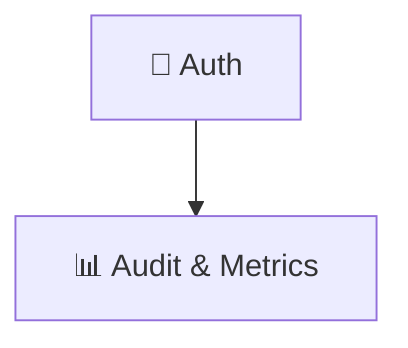

<!-- SPDX-FileCopyrightText: 2008-2026 Hack23 AB -->
<!-- SPDX-License-Identifier: Apache-2.0 -->

# Mermaid Diagram Style Guide

This guide defines the conventions every Mermaid diagram in the
Citizen Intelligence Agency repository **must** follow. It exists so that
diagrams render reliably in every consumer (GitHub web UI, Maven Site,
DeepWiki, exported SVG/PDF) and present a consistent visual identity across
all our architecture, security, and intelligence documentation.

> Automated tooling enforces the structural rules. Authors are expected to
> follow the palette rules manually and run the validator before merging.

---

## 1. Tooling

Three scripts live under [`scripts/`](./scripts/):

| Script | Purpose |
|---|---|
| `scripts/validate-mermaid.mjs` | Renders every ```` ```mermaid ```` block in every `*.md` file via `@mermaid-js/mermaid-cli`. Fails CI on any unrenderable diagram. |
| `scripts/deep-check-mermaid.mjs` | Inventories palette/theme usage and reports node labels with risky characters that should be quoted. Advisory — does not fail CI. |
| `scripts/fix-mermaid-quotes.mjs` | Idempotently rewrites node labels that contain emoji, `&`, parentheses, `:`, `;`, `,` or `fa:fa-` icons to be wrapped in `"…"`. Safe to re-run. |

### Local usage

```bash
# One-time: install mermaid-cli into a scratch directory
mkdir -p /tmp/mmd && (cd /tmp/mmd && npm init -y >/dev/null && npm install @mermaid-js/mermaid-cli)
export MMDC=/tmp/mmd/node_modules/.bin/mmdc

# Validate (renders every diagram)
node scripts/validate-mermaid.mjs

# Inventory (palette + advisory issues)
node scripts/deep-check-mermaid.mjs

# Auto-fix unquoted node labels (idempotent)
node scripts/fix-mermaid-quotes.mjs --dry-run   # preview
node scripts/fix-mermaid-quotes.mjs             # apply
```

The validator is also wired into CI via
[`.github/workflows/validate-mermaid.yml`](./.github/workflows/validate-mermaid.yml).
The workflow blocks any PR that introduces a Mermaid block which fails to
render.

---

## 2. Mandatory rules (enforced by tooling)

### 2.1 Node labels containing icons MUST be quoted

Any node-shape label that contains an emoji, a `fa:fa-…` Font Awesome icon,
or any of `& ( ) : ; ,` **must** be enclosed in double quotes.




Why: unquoted emojis are accepted by current Mermaid versions but are
fragile — a future Mermaid release can break them, and several HTML
consumers (Maven Site, some Markdown previews) already mis-render them.
Quoting also lets us safely use `&`, `(`, `)`, `:` and `;` inside labels.
`scripts/fix-mermaid-quotes.mjs` rewrites all of these automatically and
should be re-run whenever new diagrams are added.

### 2.2 Every diagram must render

`scripts/validate-mermaid.mjs` renders every block via the official
`@mermaid-js/mermaid-cli`. A failing render is a CI failure. There are
**zero** broken diagrams in the repository today — keep it that way.

### 2.3 Bracket nesting

If a label contains `[` `]` `(` `)` `{` `}`, use the entity-style escapes
that Mermaid documents:

| Char | Escape |
|---|---|
| `"` | `#quot;` |
| `(` | `#40;` |
| `)` | `#41;` |
| `[` | `#91;` |
| `]` | `#93;` |
| `{` | `#123;` |
| `}` | `#125;` |

Prefer rephrasing the label so escapes are unnecessary.

---

## 3. Canonical color palette

The repository historically used 150+ ad-hoc colors. New and updated
diagrams **should** draw only from the palette below. Existing diagrams may
be migrated opportunistically; do not change a diagram’s colors as part of
an unrelated change unless the change is in scope.

### 3.1 Semantic palette (preferred)

These map to **meaning**, not aesthetics. Use them wherever a diagram needs
to communicate severity, status, or domain.

| Token | Hex | Use for |
|---|---|---|
| `--critical`   | `#c0392b` | Critical risk, RESTRICTED data, blocking issues, attacker, threat actor |
| `--high`       | `#e74c3c` | High risk, CONFIDENTIAL data, security incidents |
| `--warning`    | `#f39c12` | Warning, medium risk, INTERNAL data, attention-needed states |
| `--success`    | `#27ae60` | Success, healthy, completed, mitigated, PUBLIC data |
| `--accent`     | `#2980b9` | Primary process / control / actor of interest |
| `--info`       | `#3498db` | Informational, secondary processes, supporting services |
| `--neutral`    | `#7f8c8d` | Out-of-scope, deprecated, archived |
| `--data`       | `#8e44ad` | Persistence, databases, data stores |
| `--external`   | `#16a085` | External system, third-party API, OSINT source |

Text on these colors should be `#ffffff` (white) for `critical/high/data/external`
and `#222222` (dark) for `warning/success/info/neutral`.

### 3.2 Background palette (for `subgraph`, `classDef` fills)

Lighter tints of the semantic palette for use as backgrounds and group
fills:

| Token | Hex | Pairs with |
|---|---|---|
| `--critical-bg` | `#ffcccc` | `--critical` |
| `--warning-bg`  | `#ffeb99` | `--warning` |
| `--success-bg`  | `#c8e6c9` | `--success` |
| `--accent-bg`   | `#bbdefb` | `--accent` |
| `--info-bg`     | `#e1f5ff` | `--info` |
| `--data-bg`     | `#d1c4e9` | `--data` |
| `--external-bg` | `#b2dfdb` | `--external` |

### 3.3 Theme block (recommended for every diagram)

When you need consistent typography and curved edges, prepend:

```mermaid
%%{init: {'theme':'base', 'themeVariables': {
  'primaryColor':'#bbdefb',
  'primaryTextColor':'#222222',
  'primaryBorderColor':'#2980b9',
  'lineColor':'#333333',
  'fontFamily':'Inter, Segoe UI, sans-serif'
}}}%%
```

For diagrams where you only need the palette without overriding text/edge
defaults, omit the `themeVariables` and rely on `style`/`classDef` lines
using the hex codes above.

---

## 4. Authoring conventions

1. **Identifier names** – use `SCREAMING_SNAKE_CASE` for nodes that
   represent systems/services/components, and `lowerCamelCase` for nodes
   that represent processes/actions. Be consistent within a single diagram.
2. **Direction** – prefer `TD` (top-down) for hierarchical/architecture
   diagrams and `LR` (left-right) for sequences and pipelines.
3. **Subgraphs** – always give a subgraph a quoted display label:
   `subgraph TRUST_BOUNDARY_1["🔒 Edge Trust Boundary"]`.
4. **Trust boundaries** – when modelling security, use the prefix
   `TRUST_BOUNDARY_n` and the lock emoji `🔒` so they are easy to grep.
5. **Comments** – `%% comment` is fine; do not nest it inside labels.
6. **No external assets** – diagrams must be fully self-contained Mermaid
   source; do not reference external `style.css` or images.

---

## 5. Failure modes the validator catches

| Failure | Example |
|---|---|
| Unbalanced brackets | `A[label` (missing `]`) |
| Reserved keyword as node id | `end[...]` (use `END_NODE[...]`) |
| Mis-typed diagram header | `graphTD` (should be `graph TD`) |
| Unsupported diagram type for the current Mermaid version | `architecture-beta` on Mermaid <10.6 |
| Direct `<` `>` in unquoted labels | `A[5 > 4]` (use `A["5 > 4"]` or `&gt;`) |

`scripts/validate-mermaid.mjs` prints the file path, line number, and the
exact `mmdc` stderr for every failure, making them trivial to find.

---

## 6. References

- Mermaid syntax: <https://mermaid.js.org/intro/syntax-reference.html>
- Flowchart shapes: <https://mermaid.js.org/syntax/flowchart.html#node-shapes>
- Themes and styling: <https://mermaid.js.org/config/theming.html>
- Hack23 ISMS — Secure Development Policy (documentation quality requirements):
  see `Hack23/ISMS` repository.
