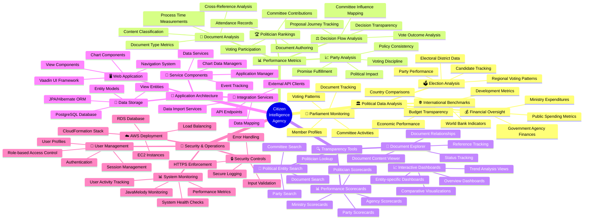
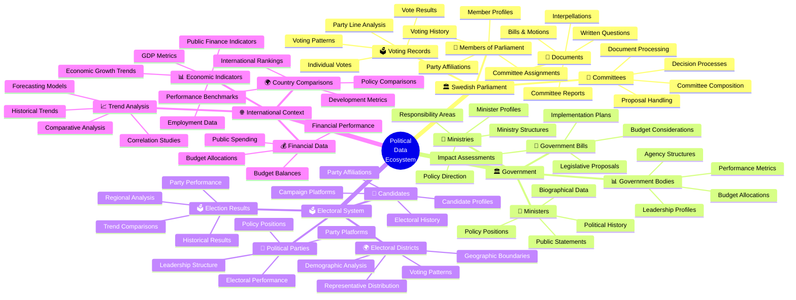
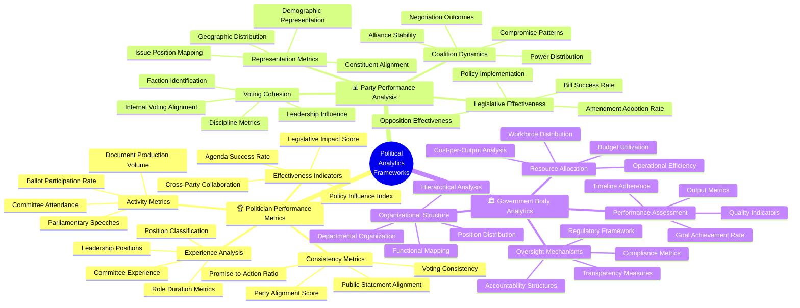
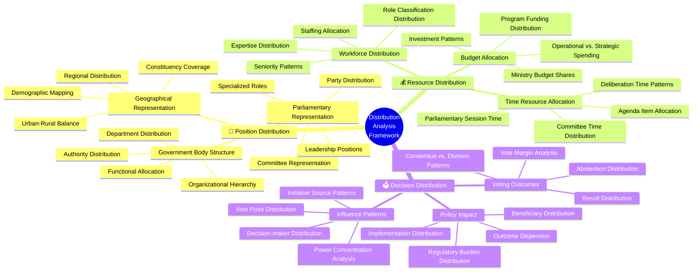
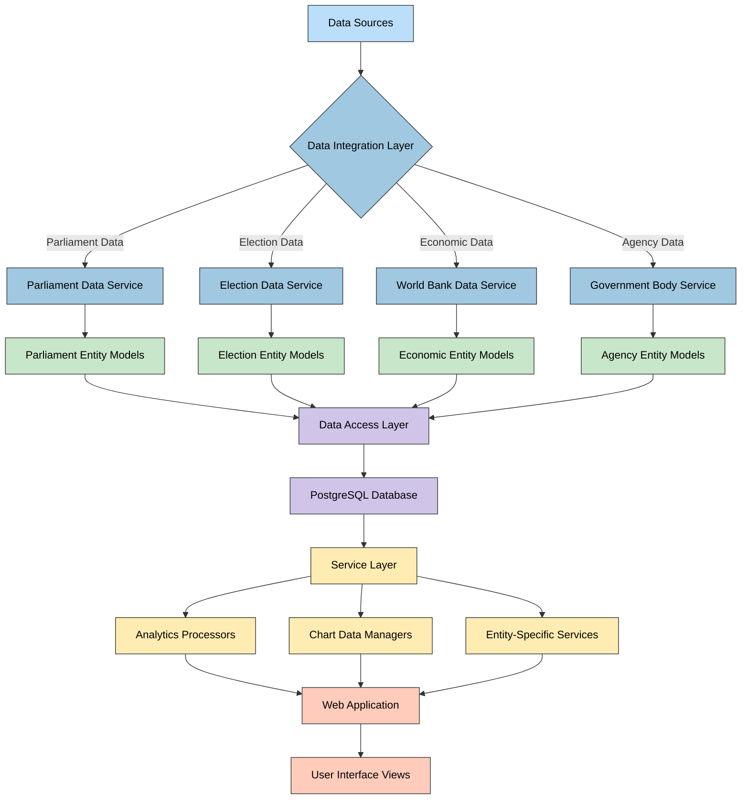

  

<h1 align="center">🧠 Citizen Intelligence Agency — Mindmap</h1>

  <strong>🔗 Conceptual Component Relationships and System Overview</strong> 
  <em>🎯 Visual Mapping of Features, Modules, and Analytical Dimensions</em>

  
  
  
  

**📋 Document Owner:** CEO | **📄 Version:** 1.0 | **📅 Last Updated:** 2025-09-18 (UTC)  
**🔄 Review Cycle:** Annual | **⏰ Next Review:** 2026-09-18

---

## 🎯 Purpose

This document provides a conceptual overview of the Citizen Intelligence Agency system, showing the relationships between different components, features, and concepts using mindmap visualizations.

## 📚 Related Architecture Documentation

| Document                                            | Focus           | Description                               | Documentation Link                                                              |
| --------------------------------------------------- | --------------- | ----------------------------------------- | ------------------------------------------------------------------------------- |
| **[Architecture](ARCHITECTURE.md)**                 | 🏛️ Architecture | C4 model showing current system structure | [View Source](https://github.com/Hack23/cia/blob/master/ARCHITECTURE.md)         |
| **[Future Architecture](FUTURE_ARCHITECTURE.md)**   | 🏛️ Architecture | C4 model showing future system structure | [View Source](https://github.com/Hack23/cia/blob/master/FUTURE_ARCHITECTURE.md)         |
| **[Mindmaps](MINDMAP.md)**                          | 🧠 Concept      | Current system component relationships    | [View Source](https://github.com/Hack23/cia/blob/master/MINDMAP.md)             |
| **[Future Mindmaps](FUTURE_MINDMAP.md)**            | 🧠 Concept      | Future capability evolution               | [View Source](https://github.com/Hack23/cia/blob/master/FUTURE_MINDMAP.md)      |
| **[SWOT Analysis](SWOT.md)**                        | 💼 Business     | Current strategic assessment              | [View Source](https://github.com/Hack23/cia/blob/master/SWOT.md)                |
| **[Future SWOT Analysis](FUTURE_SWOT.md)**          | 💼 Business     | Future strategic opportunities            | [View Source](https://github.com/Hack23/cia/blob/master/FUTURE_SWOT.md)         |
| **[Data Model](DATA_MODEL.md)**                     | 📊 Data         | Current data structures and relationships | [View Source](https://github.com/Hack23/cia/blob/master/DATA_MODEL.md)          |
| **[Future Data Model](FUTURE_DATA_MODEL.md)**       | 📊 Data         | Enhanced political data architecture      | [View Source](https://github.com/Hack23/cia/blob/master/FUTURE_DATA_MODEL.md)   |
| **[Flowcharts](FLOWCHART.md)**                      | 🔄 Process      | Current data processing workflows         | [View Source](https://github.com/Hack23/cia/blob/master/FLOWCHART.md)           |
| **[Future Flowcharts](FUTURE_FLOWCHART.md)**        | 🔄 Process      | Enhanced AI-driven workflows              | [View Source](https://github.com/Hack23/cia/blob/master/FUTURE_FLOWCHART.md)    |
| **[State Diagrams](STATEDIAGRAM.md)**               | 🔄 Behavior     | Current system state transitions          | [View Source](https://github.com/Hack23/cia/blob/master/STATEDIAGRAM.md)        |
| **[Future State Diagrams](FUTURE_STATEDIAGRAM.md)** | 🔄 Behavior     | Enhanced adaptive state transitions       | [View Source](https://github.com/Hack23/cia/blob/master/FUTURE_STATEDIAGRAM.md) |
| **[CI/CD Workflows](WORKFLOWS.md)**                 | 🔧 DevOps       | Current automation processes              | [View Source](https://github.com/Hack23/cia/blob/master/WORKFLOWS.md)           |
| **[Future Workflows](FUTURE_WORKFLOWS.md)**         | 🔧 DevOps       | Enhanced CI/CD with ML                    | [View Source](https://github.com/Hack23/cia/blob/master/FUTURE_WORKFLOWS.md)    |
| **[End-of-Life Strategy](End-of-Life-Strategy.md)** | 📅 Lifecycle    | Maintenance and EOL planning              | [View Source](https://github.com/Hack23/cia/blob/master/End-of-Life-Strategy.md) |
| **[Financial Security Plan](FinancialSecurityPlan.md)** | 💰 Security | Cost and security implementation          | [View Source](https://github.com/Hack23/cia/blob/master/FinancialSecurityPlan.md) |
| **[CIA Features](https://hack23.com/cia-features.html)** | 🚀 Features | Platform features overview                | [View on hack23.com](https://hack23.com/cia-features.html)                     |
| **[Security Architecture](SECURITY_ARCHITECTURE.md)** | 🛡️ Security | Defense-in-depth security overview        | [View Source](https://github.com/Hack23/cia/blob/master/SECURITY_ARCHITECTURE.md) |
| **[Threat Model](THREAT_MODEL.md)**                 | 🛡️ Security     | STRIDE/MITRE threat analysis              | [View Source](https://github.com/Hack23/cia/blob/master/THREAT_MODEL.md)        |
| **[CRA Assessment](CRA-ASSESSMENT.md)**             | 🛡️ Compliance   | EU Cyber Resilience Act conformity        | [View Source](https://github.com/Hack23/cia/blob/master/CRA-ASSESSMENT.md)      |
| **[Business Continuity Plan](BCPPlan.md)**           | 📋 Resilience   | RTO/RPO targets and recovery procedures   | [View Source](https://github.com/Hack23/cia/blob/master/BCPPlan.md)             |
| **[Business Product Document](BUSINESS_PRODUCT_DOCUMENT.md)** | 💼 Business | Data analytics and risk intelligence products | [View Source](https://github.com/Hack23/cia/blob/master/BUSINESS_PRODUCT_DOCUMENT.md) |

## 🧩 System Overview Mindmap

**🏛️ Architecture Focus:** Provides a hierarchical view of the Citizen Intelligence Agency's components, showing their organization and relationships. See the [full architecture documentation](ARCHITECTURE.md) for a detailed C4 model.

**💼 Business Focus:** Maps the political intelligence capabilities to the technical components that implement them. Explore [CIA features](https://hack23.com/cia-features.html) for detailed screenshots.

```mermaid
mindmap
  root((Citizen<br/>Intelligence<br/>Agency))
    🏛️ Political Data Analysis
      🏢 Parliament Monitoring
        Member Profiles
        Voting Patterns
        Committee Activities
        Document Tracking
      🗳️ Election Analysis
        Party Performance
        Regional Voting Patterns
        Electoral District Data
        Candidate Tracking
      💰 Financial Oversight
        Budget Transparency
        Ministry Expenditures
        Government Agency Finances
        Public Spending Metrics
      🌐 International Benchmarks
        World Bank Indicators
        Country Comparisons
        Economic Performance
        Development Metrics
    📊 Performance Metrics
      🏆 Politician Rankings
        Attendance Records
        Document Authoring
        Voting Participation
        Committee Contributions
      📈 Party Analysis
        Policy Consistency
        Voting Discipline
        Promise Fulfillment
        Political Impact
      ⚖️ Decision Flow Analysis
        Proposal Journey Tracking
        Committee Influence Mapping
        Vote Outcome Analysis
        Decision Transparency
      📝 Document Analysis
        Document Type Metrics
        Content Classification
        Process Time Measurements
        Cross-Reference Analysis
    🔍 Transparency Tools
      🔎 Political Entity Search
        Politician Lookup
        Party Search
        Committee Search
        Document Search
      📈 Interactive Dashboards
        Overview Dashboards
        Entity-specific Dashboards
        Comparative Visualizations
        Trend Analysis Views
      📊 Performance Scorecards
        Politician Scorecards
        Party Scorecards
        Ministry Scorecards
        Agency Scorecards
      📑 Document Explorer
        Document Content Viewer
        Reference Tracking
        Document Relationships
        Status Tracking
    🧩 Application Architecture
      🖥️ Web Application
        Vaadin UI Framework
        View Components
        Chart Components
        Navigation System
      🔧 Service Components
        Application Manager
        Data Services
        Chart Data Managers
        Event Tracking
      💾 Data Storage
        PostgreSQL Database
        Entity Models
        View Entities
        JPA/Hibernate ORM
      🔄 Integration Services
        Data Import Services
        External API Clients
        API Endpoints
        Data Mapping
    🔐 Security & Operations
      👤 User Management
        Authentication
        Role-based Access Control
        User Profiles
        Session Management
      📊 System Monitoring
        JavaMelody Monitoring
        Performance Metrics
        User Activity Tracking
        System Health Checks
      🔒 Security Controls
        Input Validation
        HTTPS Enforcement
        Error Handling
        Secure Logging
      ☁️ AWS Deployment
        CloudFormation Stack
        EC2 Instances
        RDS Database
        Load Balancing
```

## 📊 Political Data Ecosystem

**🏛️ Political Focus:** Shows the relationships between different political entities tracked in the system. See the [Entity Model](https://hack23.github.io/cia/service.data.impl/hbm2doc/entities/index.html) for database implementation details.

**🔗 Integration Focus:** Illustrates how data flows from various sources into the CIA platform. See [README.md - Data Sources](README.md#data-sources) for more details on the integration strategies.

```mermaid
mindmap
  root((Political<br/>Data<br/>Ecosystem))
    🏛️ Swedish Parliament
      👥 Members of Parliament
        Member Profiles
        Party Affiliations
        Committee Assignments
        Voting History
      🏢 Committees
        Committee Composition
        Decision Processes
        Proposal Handling
        Document Processing
      📝 Documents
        Bills & Motions
        Committee Reports
        Interpellations
        Written Questions
      🗳️ Voting Records
        Vote Results
        Voting Patterns
        Individual Votes
        Party Line Analysis
    🏛️ Government
      🏢 Ministries
        Ministry Structures
        Minister Profiles
        Responsibility Areas
        Policy Direction
      👥 Ministers
        Biographical Data
        Political History
        Public Statements
        Policy Positions
      📊 Government Bodies
        Agency Structures
        Leadership Profiles
        Budget Allocations
        Performance Metrics
      📑 Government Bills
        Legislative Proposals
        Implementation Plans
        Impact Assessments
        Budget Considerations
    🗳️ Electoral System
      🏢 Political Parties
        Party Platforms
        Leadership Structure
        Electoral Performance
        Policy Positions
      🌍 Electoral Districts
        Geographic Boundaries
        Demographic Analysis
        Voting Patterns
        Representative Distribution
      🗳️ Election Results
        Historical Results
        Party Performance
        Regional Analysis
        Trend Comparisons
      👥 Candidates
        Candidate Profiles
        Electoral History
        Party Affiliations
        Campaign Platforms
    🌐 International Context
      📊 Economic Indicators
        GDP Metrics
        Employment Data
        Public Finance Indicators
        Economic Growth Trends
      🌍 Country Comparisons
        Policy Comparisons
        Performance Benchmarks
        International Rankings
        Development Metrics
      💰 Financial Data
        Budget Allocations
        Public Spending
        Financial Performance
        Budget Balances
      📈 Trend Analysis
        Historical Trends
        Forecasting Models
        Comparative Analysis
        Correlation Studies
```

## 📋 Political Analytics Frameworks

**🧮 Analysis Focus:** Shows the analytical frameworks used for evaluating political entities. This structure is derived from the constant patterns in the system.

```mermaid
mindmap
  root((Political<br/>Analytics<br/>Frameworks))
    🏆 Politician Performance Metrics
      Experience Analysis
        Role Duration Metrics
        Position Classification
        Committee Experience
        Leadership Positions
      Activity Metrics
        Ballot Participation Rate
        Document Production Volume
        Committee Attendance
        Parliamentary Speeches
      Effectiveness Indicators
        Legislative Impact Score
        Policy Influence Index
        Agenda Success Rate
        Cross-Party Collaboration
      Consistency Metrics
        Party Alignment Score
        Promise-to-Action Ratio
        Voting Consistency
        Public Statement Alignment
    📊 Party Performance Analysis
      Voting Cohesion
        Internal Voting Alignment
        Discipline Metrics
        Faction Identification
        Leadership Influence
      Legislative Effectiveness
        Bill Success Rate
        Amendment Adoption Rate
        Policy Implementation
        Opposition Effectiveness
      Representation Metrics
        Demographic Representation
        Geographic Distribution
        Constituent Alignment
        Issue Position Mapping
      Coalition Dynamics
        Alliance Stability
        Negotiation Outcomes
        Power Distribution
        Compromise Patterns
    🏛️ Government Body Analytics
      Organizational Structure
        Hierarchical Analysis
        Position Distribution
        Departmental Organization
        Functional Mapping
      Resource Allocation
        Budget Utilization
        Workforce Distribution
        Operational Efficiency
        Cost-per-Output Analysis
      Performance Assessment
        Output Metrics
        Goal Achievement Rate
        Timeline Adherence
        Quality Indicators
      Oversight Mechanisms
        Accountability Structures
        Transparency Measures
        Compliance Metrics
        Regulatory Framework
```

## 📊 Distribution Analysis Framework

**📈 Distribution Focus:** Illustrates how distribution analysis is applied across political entities to understand patterns and allocations.

```mermaid
mindmap
  root((Distribution<br/>Analysis<br/>Framework))
    🏢 Position Distribution
      Parliamentary Representation
        Party Distribution
        Committee Representation
        Leadership Positions
        Specialized Roles
      Government Body Structure
        Organizational Hierarchy
        Department Distribution
        Functional Allocation
        Authority Distribution
      Geographical Representation
        Regional Distribution
        Constituency Coverage
        Urban-Rural Balance
        Demographic Mapping
    💰 Resource Distribution
      Budget Allocation
        Ministry Budget Shares
        Program Funding Distribution
        Investment Patterns
        Operational vs. Strategic Spending
      Workforce Distribution
        Staffing Allocation
        Expertise Distribution
        Seniority Patterns
        Role Classification Distribution
      Time Resource Allocation
        Parliamentary Session Time
        Committee Time Distribution
        Agenda Item Allocation
        Deliberation Time Patterns
    🗳️ Decision Distribution
      Voting Outcomes
        Result Distribution
        Vote Margin Analysis
        Consensus vs. Division Patterns
        Abstention Distribution
      Policy Impact
        Beneficiary Distribution
        Regulatory Burden Distribution
        Implementation Distribution
        Outcome Dispersion
      Influence Patterns
        Decision-maker Distribution
        Power Concentration Analysis
        Veto Point Distribution
        Initiative Source Patterns
```

## 🧩 Analytical Dimensions Framework

**🔍 Dimensions Focus:** Shows the multidimensional nature of political analysis within the system.

```mermaid
flowchart TD
    A[Political Data] --> B[Analytical Dimensions]
    
    B --> C1[Temporal Analysis]
    B --> C2[Comparative Analysis]
    B --> C3[Distribution Analysis]
    B --> C4[Performance Analysis]
    B --> C5[Relationship Analysis]
    
    C1 --> D1[Historical Trends]
    C1 --> D2[Time Series Comparison]
    C1 --> D3[Period Performance]
    C1 --> D4[Longitudinal Studies]
    
    C2 --> D5[Cross-Entity Comparison]
    C2 --> D6[Benchmark Analysis]
    C2 --> D7[Peer Group Evaluation]
    C2 --> D8[International Comparison]
    
    C3 --> D9[Position Distribution]
    C3 --> D10[Resource Allocation]
    C3 --> D11[Vote Distribution]
    C3 --> D12[Geographic Distribution]
    
    C4 --> D13[Effectiveness Metrics]
    C4 --> D14[Efficiency Indicators]
    C4 --> D15[Impact Assessment]
    C4 --> D16[Output Evaluation]
    
    C5 --> D17[Network Analysis]
    C5 --> D18[Collaboration Patterns]
    C5 --> D19[Influence Mapping]
    C5 --> D20[Dependency Analysis]
    
    classDef dimension fill:#bbdefb,stroke:#333,stroke-width:1px,color:black
    classDef category fill:#a0c8e0,stroke:#333,stroke-width:1px,color:black
    classDef metric fill:#c8e6c9,stroke:#333,stroke-width:1px,color:black
    
    class A,B dimension
    class C1,C2,C3,C4,C5 category
    class D1,D2,D3,D4,D5,D6,D7,D8,D9,D10,D11,D12,D13,D14,D15,D16,D17,D18,D19,D20 metric
```

## 🖥️ CIA Technical Component Map

This flowchart visualizes the relationship between components in the system architecture. For a more formal C4 architecture model, see the [Architecture documentation](ARCHITECTURE.md).

```mermaid
flowchart TD
    A[User] --> B[Web Application Layer]
    
    B --> C1[View Components]
    B --> C2[UI Framework - Vaadin]
    B --> C3[Chart Components]
    
    C1 --> D1[Parliament Views]
    C1 --> D2[Politician Views]
    C1 --> D3[Party Views]
    C1 --> D4[Committee Views]
    C1 --> D5[Document Views]
    C1 --> D6[Ministry Views]
    C1 --> D7[Agency Views]
    
    C3 --> D8[Score Charts]
    C3 --> D9[Trend Charts]
    C3 --> D10[Comparison Charts]
    C3 --> D11[Decision Flow Charts]
    
    B --> E[Service Layer]
    
    E --> F1[Parliament Data Service]
    E --> F2[Politician Data Service]
    E --> F3[Party Data Service]
    E --> F4[Committee Data Service]
    E --> F5[Document Data Service]
    E --> F6[Ministry Data Service]
    E --> F7[Agency Data Service]
    E --> F8[Chart Data Manager]
    E --> F9[Application Event Service]
    
    E --> G[Data Access Layer]
    
    G --> H[Database - PostgreSQL]
    
    G --> I1[Entity Models]
    G --> I2[View Entities]
    G --> I3[Data Containers]
    
    E --> J[Data Integration]
    
    J --> K1[Parliament API Client]
    J --> K2[Election Authority API Client]
    J --> K3[World Bank API Client]
    J --> K4[Government Bodies API Client]
    
    K1 --> L1[Swedish Parliament API]
    K2 --> L2[Swedish Election Authority]
    K3 --> L3[World Bank Open Data]
    K4 --> L4[Swedish Government Bodies]
    
    classDef user fill:#bbdefb,stroke:#333,stroke-width:1px,color:black
    classDef container fill:#a0c8e0,stroke:#333,stroke-width:1px,color:black
    classDef component fill:#c8e6c9,stroke:#333,stroke-width:1px,color:black
    classDef service fill:#ffecb3,stroke:#333,stroke-width:1px,color:black
    classDef data fill:#d1c4e9,stroke:#333,stroke-width:1px,color:black
    classDef external fill:#ffccbc,stroke:#333,stroke-width:1px,color:black
    
    class A user
    class B,E,G,J container
    class C1,C2,C3,D1,D2,D3,D4,D5,D6,D7,D8,D9,D10,D11 component
    class F1,F2,F3,F4,F5,F6,F7,F8,F9 service
    class H,I1,I2,I3 data
    class K1,K2,K3,K4,L1,L2,L3,L4 external
```

## 🔍 Key Political Analysis Features

These features align with the [CIA platform features](https://hack23.com/cia-features.html) that provide comprehensive political intelligence. See the [project documentation](https://hack23.github.io/cia/) for API details.

| Feature                      | Data Sources                        | Purpose                                  | Implementation                                 |
|------------------------------|-------------------------------------|------------------------------------------|-----------------------------------------------|
| 🏆 Politician Ranking        | Parliament API, Voting Records, Document Records | Evaluate politician performance             | Weighted scoring algorithm with visualization  |
| 📈 Party Analysis            | Parliament API, Voting Records, Election Data    | Analyze party consistency and discipline    | Pattern analysis and trend visualization       |
| 💰 Financial Oversight       | Government Body Data, Budget Records           | Track financial transparency                | Data aggregation and comparative display      |
| 🗳️ Voting Patterns           | Parliament API, Voting Records                 | Visualize voting behavior                   | Pattern detection and correlation analysis    |
| 📑 Document Processing       | Parliament API, Document Records               | Track document flow and handling            | Process flow visualization and metrics        |
| 🏢 Committee Activity        | Parliament API, Committee Records              | Monitor committee productivity              | Activity metrics and timeline visualization    |
| 👥 Political Relationships   | Parliament API, Committee Assignments, Voting Records | Map political networks                  | Network graph visualization and correlation   |
| 🔍 Search & Discovery        | All Data Sources                                | Enable research and exploration             | Advanced search with entity relationship display |
| 📊 Distribution Analysis     | Parliament API, Government Body Data           | Analyze position and resource distribution  | Statistical distribution visualization         |
| 📋 Performance Metrics       | All Data Sources                                | Evaluate effectiveness and efficiency       | Multi-dimensional scoring and benchmarking    |

## 🔄 Data Integration Flow

For technical details on implementation, see the [API Documentation](https://hack23.github.io/cia/apidocs/index.html) and [Module Dependencies](https://hack23.github.io/cia/project-info.html).

```mermaid
graph TD
    A[Data Sources] --> B{Data Integration Layer}
    B -->|Parliament Data| C1[Parliament Data Service]
    B -->|Election Data| C2[Election Data Service]
    B -->|Economic Data| C3[World Bank Data Service]
    B -->|Agency Data| C4[Government Body Service]

    C1 --> D1[Parliament Entity Models]
    C2 --> D2[Election Entity Models]
    C3 --> D3[Economic Entity Models]
    C4 --> D4[Agency Entity Models]

    D1 & D2 & D3 & D4 --> E[Data Access Layer]
    E --> F[PostgreSQL Database]

    F --> G[Service Layer]
    G --> H[Analytics Processors]
    G --> I[Chart Data Managers]
    G --> J[Entity-Specific Services]

    H & I & J --> K[Web Application]
    K --> L[User Interface Views]

    classDef sources fill:#bbdefb,stroke:#333,stroke-width:1px,color:black
    classDef integration fill:#a0c8e0,stroke:#333,stroke-width:1px,color:black
    classDef models fill:#c8e6c9,stroke:#333,stroke-width:1px,color:black
    classDef data fill:#d1c4e9,stroke:#333,stroke-width:1px,color:black
    classDef services fill:#ffecb3,stroke:#333,stroke-width:1px,color:black
    classDef ui fill:#ffccbc,stroke:#333,stroke-width:1px,color:black

    class A sources
    class B,C1,C2,C3,C4 integration
    class D1,D2,D3,D4 models
    class E,F data
    class G,H,I,J services
    class K,L ui
```

These mindmaps provide a conceptual overview of the Citizen Intelligence Agency system, showing how different components relate to each other and contribute to the overall functionality. The maps help stakeholders understand the scope and organization of the system, focusing on the political data analysis, transparency tools, and technical implementation.

For practical demonstrations, visit the [CIA Features page](https://hack23.com/cia-features.html) which provides screenshots and detailed explanations of the platform's capabilities.

The color schemes across diagrams help to identify similar types of information:
- 🔵 Blues represent core system components and architecture elements
- 🟢 Greens represent political entities and data sources
- 🟣 Purples represent analytical capabilities and data processing
- 🟠 Oranges/yellows represent user-facing features and visualizations

## Color Legend

The color scheme used in these mindmaps follows these conventions:

| Element Type           | Color                  | Description                             |
| ---------------------- | ---------------------- | --------------------------------------- |
| Core Components        | #a0c8e0 (Medium Blue)  | Primary system components               |
| Political Entities     | #bbdefb (Light Blue)   | Political bodies and actors             |
| Data & Analytics       | #c8e6c9 (Light Green)  | Data processing and analysis            |
| External Systems       | #d1c4e9 (Light Purple) | External data sources and APIs          |
| Services               | #ffecb3 (Light Yellow) | Business services and processing        |
| User Interface         | #ffccbc (Light Orange) | User-facing components and features     |
| Analytical Dimensions  | #e1bee7 (Light Purple) | Analytical frameworks and methodologies |

This color scheme provides visual consistency across the architecture documentation while making it easy to distinguish between different types of components in the system.

## Related Documentation

- [Future Architecture Vision](FUTURE_MINDMAP.md) - Explore the roadmap for AI-enhanced capabilities
- [Project README](README.md) - Get started with the Citizen Intelligence Agency project
- [End-of-Life Strategy](End-of-Life-Strategy.md) - Understand the maintenance plan for current technologies
- [Financial Security Plan](FinancialSecurityPlan.md) - Review cost breakdowns and AWS security implementations
- [Project Documentation](https://hack23.github.io/cia/) - Comprehensive developer documentation
- [CIA Features](https://hack23.com/cia-features.html) - Detailed feature showcase with screenshots

---

**📋 Document Control:**  
**✅ Approved by:** James Pether Sörling, CEO - Hack23 AB  
**📤 Distribution:** Public  
**🏷️ Classification:**     
**📅 Effective Date:** 2025-09-18  
**⏰ Next Review:** 2026-09-18  
**🎯 Framework Compliance:**   
