# 🧠 Citizen Intelligence Agency Mindmap

This document provides a conceptual overview of the Citizen Intelligence Agency system, showing the relationships between different components, features, and concepts using mindmap visualizations.

## 📚 Related Architecture Documentation

<div class="documentation-map">

| Document                                  | Type    | Focus           | Description                                                          | Documentation Link                                                                 |
| ----------------------------------------- | ------- | --------------- | -------------------------------------------------------------------- | ---------------------------------------------------------------------------------- |
| **[Current Architecture](ARCHITECTURE.md)**  | Core    | 🏛️ Architecture | C4 model showing current system containers, components, and dynamics | [View in Portal](https://hack23.github.io/cia/architecture.html)                   |
| **[Entity Model](ENTITY_MODEL.md)**         | Current | 📊 Data         | Detailed look at system entities and their relationships             | [View in Portal](https://hack23.github.io/cia/service.data.impl/hbm2doc/entities/index.html) |
| **[API Documentation](API_DOCS.md)**        | Current | 🔌 API          | Comprehensive API documentation for system integration               | [View in Portal](https://hack23.github.io/cia/apidocs/index.html)                  |
| **[AWS Infrastructure](AWS_INFRASTRUCTURE.md)** | Current | ☁️ Cloud   | CloudFormation stack diagram and AWS service configurations          | [View in Portal](https://hack23.github.io/cia/cia-dist-cloudformation/src/main/resources/cia-dist-cloudformation.json) |
| **[Module Dependencies](MODULE_DEPS.md)**   | Current | 📦 Dependencies | Overview of project modules and their dependencies                   | [View in Portal](https://hack23.github.io/cia/project-info.html)                 |
| **[Security Architecture](SECURITY_ARCHITECTURE.md)** | Current | 🔒 Security | Security model, authentication and authorization                 | [View in Portal](https://hack23.github.io/cia/security-architecture.html)          |
| **[UI Component Framework](UI_COMPONENTS.md)** | Current | 🖼️ UI      | UI component structure and visualization patterns                    | [View in Portal](https://hack23.github.io/cia/ui-components.html)                 |
| **[Data Integration](DATA_INTEGRATION.md)** | Current | 🔄 Integration | External data sources and integration strategies                     | [View in Portal](https://hack23.github.io/cia/data-integration.html)              |
| **[Future Mindmaps](FUTURE_MINDMAP.md)**    | Future  | 🧠 Concept     | Future capability evolution                                          | [View in Portal](https://hack23.github.io/cia/future-mindmap.html)               |
| **[End-of-Life Strategy](End-of-Life-Strategy.md)** | Current | 📅 Lifecycle | Maintenance and EOL planning for current technology stack         | [View in Portal](https://hack23.github.io/cia/end-of-life-strategy.html)          |
| **[Financial Security Plan](FinancialSecurityPlan.md)** | Current | 💰 Security | Cost breakdown and AWS security implementation                  | [View in Portal](https://hack23.github.io/cia/financial-security-plan.html)       |
| **[README](README.md)**                     | Core    | 📘 Overview    | Project introduction, features, and quick links                     | [View in Portal](https://hack23.github.io/cia/)                                   |
| **[CIA Features](https://hack23.com/cia-features.html)** | External | 🚀 Features | Comprehensive overview of all CIA platform features           | [View on hack23.com](https://hack23.com/cia-features.html)                       |

</div>

## 🧩 System Overview Mindmap

**🏛️ Architecture Focus:** Provides a hierarchical view of the Citizen Intelligence Agency's components, showing their organization and relationships. See the [full architecture documentation](ARCHITECTURE.md) for a detailed C4 model.

**💼 Business Focus:** Maps the political intelligence capabilities to the technical components that implement them. Explore [CIA features](https://hack23.com/cia-features.html) for detailed screenshots.

```mermaid
mindmap
  root((Citizen<br/>Intelligence<br/>Agency))
    🏛️ Political Data Analysis
      🏢 Parliament Monitoring
        Member Profiles
        Voting Patterns
        Committee Activities
        Document Tracking
      🗳️ Election Analysis
        Party Performance
        Regional Voting Patterns
        Electoral District Data
        Candidate Tracking
      💰 Financial Oversight
        Budget Transparency
        Ministry Expenditures
        Government Agency Finances
        Public Spending Metrics
      🌐 International Benchmarks
        World Bank Indicators
        Country Comparisons
        Economic Performance
        Development Metrics
    📊 Performance Metrics
      🏆 Politician Rankings
        Attendance Records
        Document Authoring
        Voting Participation
        Committee Contributions
      📈 Party Analysis
        Policy Consistency
        Voting Discipline
        Promise Fulfillment
        Political Impact
      ⚖️ Decision Flow Analysis
        Proposal Journey Tracking
        Committee Influence Mapping
        Vote Outcome Analysis
        Decision Transparency
      📝 Document Analysis
        Document Type Metrics
        Content Classification
        Process Time Measurements
        Cross-Reference Analysis
    🔍 Transparency Tools
      🔎 Political Entity Search
        Politician Lookup
        Party Search
        Committee Search
        Document Search
      📈 Interactive Dashboards
        Overview Dashboards
        Entity-specific Dashboards
        Comparative Visualizations
        Trend Analysis Views
      📊 Performance Scorecards
        Politician Scorecards
        Party Scorecards
        Ministry Scorecards
        Agency Scorecards
      📑 Document Explorer
        Document Content Viewer
        Reference Tracking
        Document Relationships
        Status Tracking
    🧩 Application Architecture
      🖥️ Web Application
        Vaadin UI Framework
        View Components
        Chart Components
        Navigation System
      🔧 Service Components
        Application Manager
        Data Services
        Chart Data Managers
        Event Tracking
      💾 Data Storage
        PostgreSQL Database
        Entity Models
        View Entities
        JPA/Hibernate ORM
      🔄 Integration Services
        Data Import Services
        External API Clients
        API Endpoints
        Data Mapping
    🔐 Security & Operations
      👤 User Management
        Authentication
        Role-based Access Control
        User Profiles
        Session Management
      📊 System Monitoring
        JavaMelody Monitoring
        Performance Metrics
        User Activity Tracking
        System Health Checks
      🔒 Security Controls
        Input Validation
        HTTPS Enforcement
        Error Handling
        Secure Logging
      ☁️ AWS Deployment
        CloudFormation Stack
        EC2 Instances
        RDS Database
        Load Balancing
```



## 📊 Political Data Ecosystem

**🏛️ Political Focus:** Shows the relationships between different political entities tracked in the system. See the [Entity Model](https://hack23.github.io/cia/service.data.impl/hbm2doc/entities/index.html) for database implementation details.

**🔗 Integration Focus:** Illustrates how data flows from various sources into the CIA platform. See [Data Integration](DATA_INTEGRATION.md) for more details on the integration strategies.

```mermaid
mindmap
  root((Political<br/>Data<br/>Ecosystem))
    🏛️ Swedish Parliament
      👥 Members of Parliament
        Member Profiles
        Party Affiliations
        Committee Assignments
        Voting History
      🏢 Committees
        Committee Composition
        Decision Processes
        Proposal Handling
        Document Processing
      📝 Documents
        Bills & Motions
        Committee Reports
        Interpellations
        Written Questions
      🗳️ Voting Records
        Vote Results
        Voting Patterns
        Individual Votes
        Party Line Analysis
    🏛️ Government
      🏢 Ministries
        Ministry Structures
        Minister Profiles
        Responsibility Areas
        Policy Direction
      👥 Ministers
        Biographical Data
        Political History
        Public Statements
        Policy Positions
      📊 Government Bodies
        Agency Structures
        Leadership Profiles
        Budget Allocations
        Performance Metrics
      📑 Government Bills
        Legislative Proposals
        Implementation Plans
        Impact Assessments
        Budget Considerations
    🗳️ Electoral System
      🏢 Political Parties
        Party Platforms
        Leadership Structure
        Electoral Performance
        Policy Positions
      🌍 Electoral Districts
        Geographic Boundaries
        Demographic Analysis
        Voting Patterns
        Representative Distribution
      🗳️ Election Results
        Historical Results
        Party Performance
        Regional Analysis
        Trend Comparisons
      👥 Candidates
        Candidate Profiles
        Electoral History
        Party Affiliations
        Campaign Platforms
    🌐 International Context
      📊 Economic Indicators
        GDP Metrics
        Employment Data
        Public Finance Indicators
        Economic Growth Trends
      🌍 Country Comparisons
        Policy Comparisons
        Performance Benchmarks
        International Rankings
        Development Metrics
      💰 Financial Data
        Budget Allocations
        Public Spending
        Financial Performance
        Budget Balances
      📈 Trend Analysis
        Historical Trends
        Forecasting Models
        Comparative Analysis
        Correlation Studies
```

## 🖥️ CIA Technical Component Map

This flowchart visualizes the relationship between components in the system architecture. For a more formal C4 architecture model, see the [Architecture documentation](ARCHITECTURE.md).


## 🔍 Key Political Analysis Features

These features align with the [CIA platform features](https://hack23.com/cia-features.html) that provide comprehensive political intelligence. See the [project documentation](https://hack23.github.io/cia/) for API details.

| Feature                      | Data Sources                        | Purpose                                  | Implementation                                 |
|------------------------------|-------------------------------------|------------------------------------------|-----------------------------------------------|
| 🏆 Politician Ranking        | Parliament API, Voting Records, Document Records | Evaluate politician performance             | Weighted scoring algorithm with visualization  |
| 📈 Party Analysis            | Parliament API, Voting Records, Election Data    | Analyze party consistency and discipline    | Pattern analysis and trend visualization       |
| 💰 Financial Oversight       | Government Body Data, Budget Records           | Track financial transparency                | Data aggregation and comparative display      |
| 🗳️ Voting Patterns           | Parliament API, Voting Records                 | Visualize voting behavior                   | Pattern detection and correlation analysis    |
| 📑 Document Processing       | Parliament API, Document Records               | Track document flow and handling            | Process flow visualization and metrics        |
| 🏢 Committee Activity        | Parliament API, Committee Records              | Monitor committee productivity              | Activity metrics and timeline visualization    |
| 👥 Political Relationships   | Parliament API, Committee Assignments, Voting Records | Map political networks                  | Network graph visualization and correlation   |
| 🔍 Search & Discovery        | All Data Sources                                | Enable research and exploration             | Advanced search with entity relationship display |

## 🔄 Data Integration Flow

For technical details on implementation, see the [API Documentation](https://hack23.github.io/cia/apidocs/index.html) and [Module Dependencies](https://hack23.github.io/cia/project-info.html).


<div class="visualization-legend">
These mindmaps provide a conceptual overview of the Citizen Intelligence Agency system, showing how different components relate to each other and contribute to the overall functionality. The maps help stakeholders understand the scope and organization of the system, focusing on the political data analysis, transparency tools, and technical implementation.

For practical demonstrations, visit the [CIA Features page](https://hack23.com/cia-features.html) which provides screenshots and detailed explanations of the platform's capabilities.

The color schemes across diagrams help to identify similar types of information:
- 🔵 Blues represent core system components and architecture elements
- 🟢 Greens represent political entities and data sources
- 🟣 Purples represent analytical capabilities and data processing
- 🟠 Oranges/yellows represent user-facing features and visualizations
</div>

## Color Legend

The color scheme used in these mindmaps follows these conventions:

| Element Type           | Color                  | Description                             |
| ---------------------- | ---------------------- | --------------------------------------- |
| Core Components        | #a0c8e0 (Medium Blue)  | Primary system components               |
| Political Entities     | #bbdefb (Light Blue)   | Political bodies and actors             |
| Data & Analytics       | #c8e6c9 (Light Green)  | Data processing and analysis            |
| External Systems       | #d1c4e9 (Light Purple) | External data sources and APIs          |
| Services               | #ffecb3 (Light Yellow) | Business services and processing        |
| User Interface         | #ffccbc (Light Orange) | User-facing components and features     |

This color scheme provides visual consistency across the architecture documentation while making it easy to distinguish between different types of components in the system.

## Related Documentation

- [Future Architecture Vision](FUTURE_MINDMAP.md) - Explore the roadmap for AI-enhanced capabilities
- [Project README](README.md) - Get started with the Citizen Intelligence Agency project
- [End-of-Life Strategy](End-of-Life-Strategy.md) - Understand the maintenance plan for current technologies
- [Financial Security Plan](FinancialSecurityPlan.md) - Review cost breakdowns and AWS security implementations
- [Project Documentation](https://hack23.github.io/cia/) - Comprehensive developer documentation
- [CIA Features](https://hack23.com/cia-features.html) - Detailed feature showcase with screenshots
