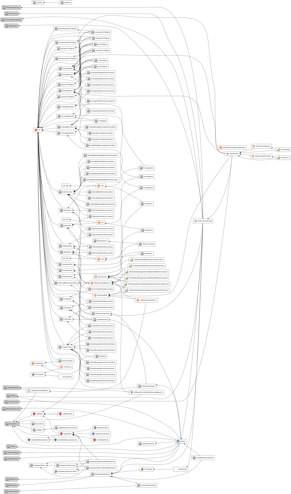

# Citizen Intelligence Agency

The Citizen Intelligence Agency is a volunteer-driven, open-source intelligence (OSINT) project focusing on political activity in Sweden. By monitoring key political figures and institutions, the platform provides valuable insights into financial performance, risk metrics, and political trends. The dashboard features a ranking system, enabling users to objectively compare politicians based on performance. The initiative is independent and non-partisan, seeking to encourage informed decision-making, enhance transparency in governance, and cultivate an engaged and well-informed citizenry.

## About Hack23

- Website: [www.hack23.com](https://www.hack23.com/)
- LinkedIn: [in/jamessorling](https://www.linkedin.com/in/jamessorling)

## Data Sources

The project relies on open data from various sources, including:

- [Swedish Parliament Open Data](http://data.riksdagen.se/): Offers a wide range of data related to the Swedish Parliament, including members, committees, and documents.
- [Swedish Election Authority](http://www.val.se/): Provides information on election processes, results, and political parties in Sweden.
- [World Bank Open Data](http://data.worldbank.org/): Contains global development data, including economic indicators and demographic information.
- [Swedish National Financial Management Authority (ESV) Public Sector Information (PSI) Data](https://www.esv.se/): Offers data on government finances, economic trends, and public sector operations in Sweden.

## Badges

[](https://raw.githubusercontent.com/Hack23/cia/master/citizen-intelligence-agency/LICENSE.txt)
[](https://app.fossa.io/projects/git%2Bgithub.com%2FHack23%2Fcia?ref=badge_shield)
[](https://cla-assistant.io/Hack23/cia)
[](http://mvnrepository.com/artifact/com.hack23.cia/cia-dist-deb)
[](https://bestpractices.coreinfrastructure.org/projects/770)
[](https://api.securityscorecards.dev/projects/github.com/Hack23/cia)
[](https://www.codefactor.io/repository/github/hack23/cia)
[](https://codeclimate.com/github/Hack23/cia/maintainability)
[](https://codebeat.co/projects/github-com-hack23-cia-master)
[](https://depshield.github.io)
[](http://isitmaintained.com/project/Hack23/cia "Average time to resolve an issue")
[](http://isitmaintained.com/project/Hack23/cia "Percentage of issues still open")


## Runtime

[]
[]
[]
[]
[]

## Resources

- [Project Documentation](http://hack23.github.io/cia/) 
- [Project Architecture](http://hack23.github.io/cia/architecture.html) - Delve into the architecture of the Citizen Intelligence Agency. This overview provides a look at the enterprise context, system context, system containers, web application components, deployment strategy, and AWS account structure of the project.
- [Entity Model](https://hack23.github.io/cia/service.data.impl/hbm2doc/entities/index.html) - Explore our Entity Model which provides a detailed look at the entities in our system and their relationships. This page is particularly useful for understanding the data structure of our project.
- [Api docs](https://hack23.github.io/cia/apidocs/index.html) - Access the API documentation for the Citizen Intelligence Agency project. This documentation provides a detailed view of the various packages within the system, helping developers understand and work with the project's API.

## Reporting Security Issues

Please follow the instructions in our [SECURITY.md](https://github.com/Hack23/cia/blob/master/SECURITY.md) file for reporting security issues.

Here's an updated `README.md` section with a link to the CloudFormation stack file and instructions on how to launch it in AWS:

## Deploying to AWS using CloudFormation

The Citizen Intelligence Agency (CIA) project can be deployed on AWS using the provided CloudFormation stack file. This file is located in the `cia-dist-cloudformation/src/main/resources/cia-dist-cloudformation.json` folder.

You can find the CloudFormation stack file [here](cia-dist-cloudformation/src/main/resources/cia-dist-cloudformation.json).

### Launching the CloudFormation Stack

To launch the CloudFormation stack, follow these steps:

1. Log in to your AWS Management Console.

2. Navigate to the CloudFormation service.

3. Click on **Create stack**.

4. In the **Select Template** section, choose **Upload a template file** and upload the `cia-dist-cloudformation.json` file.

5. Click **Next**.

6. Fill out the **Stack name** and any required parameters. The parameters are described in the CloudFormation stack file. Adjust them according to your requirements.

7. Click **Next** to configure stack options. You can add tags or configure advanced options as needed.

8. Click **Next** to review your stack settings. Make sure everything is set up as desired.

9. In the **Capabilities** section, check the boxes for the following options:
   - I acknowledge that AWS CloudFormation might create IAM resources.
   - I acknowledge that AWS CloudFormation might create IAM resources with custom names.

10. Click **Create stack** to start the stack creation process. AWS CloudFormation will create the required resources and deploy the CIA project.

11. Once the stack creation process is complete, you can access the application by navigating to the output URL provided in the CloudFormation stack Outputs tab.

# Installing Debian/Ubuntu package

This guide will walk you through installing the CIA project on Debian and Ubuntu 22.4+ systems.

## Prerequisites

1. Install OpenJDK and PostgreSQL:

```bash
$ sudo apt-get install openjdk-17-jdk postgresql-15 pgadmin3
```

2. Install PostgreSQL on Ubuntu:

```bash
$ sudo apt-get install postgresql-15 postgresql-contrib postgresql-15-pgaudit
```

## Database Setup

3. Create an empty database:

Below instructions set the default username/password and database name used for development. We recommend using custom credentials and updating the configuration at `/opt/cia/webapps/cia/WEB-INF/database.properties` to define your own username/password and database name.

```bash
$ sudo su - postgres
$ psql
postgres=# CREATE USER eris WITH password 'discord';
postgres=# CREATE DATABASE cia_dev;
postgres=# GRANT ALL PRIVILEGES ON DATABASE cia_dev to eris;
```

## PostgreSQL Configuration

4. Enable prepared transactions and required extensions:

Edit `/etc/postgresql/15/main/postgresql.conf` and set:

```ini
max_prepared_transactions = 100
```

```ini
shared_preload_libraries = 'pg_stat_statements, pgaudit, pgcrypto'
pgaudit.log = ddl
pg_stat_statements.track = all
pg_stat_statements.max = 10000
```

5. Modify PostgreSQL settings:

Edit `/etc/postgresql/15/main/pg_hba.conf` and add the following line:

```ini
host all all ::1/128 md5
```

6. Restart PostgreSQL:

```bash
$ service postgresql restart
```

## Install CIA Debian Package

7. Download the CIA Debian package:

```bash
$ wget https://oss.sonatype.org/content/repositories/releases/com/hack23/cia/cia-dist-deb/2022.12.26/cia-dist-deb-2022.12.26.deb
```

8. Install the Debian package:

```bash
$ sudo dpkg -i cia-dist-deb-2022.12.26.deb
```

## Access the Server

9. Access the server at [https://localhost:28443/cia/](https://localhost:28443/cia/).

## Diagrams

- 
- 
