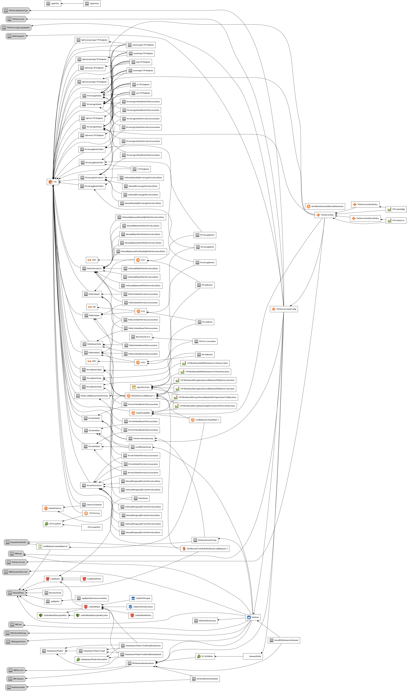

# 🔍 Citizen Intelligence Agency

> An independent, volunteer-driven OSINT platform monitoring Swedish political activity

## 🎯 Mission
The Citizen Intelligence Agency is a volunteer-driven, open-source intelligence (OSINT) project that provides comprehensive analysis of political activities in Sweden. Through advanced monitoring of key political figures and institutions, we deliver:

- 📊 Financial performance metrics
- ⚠️ Risk assessment analytics
- 📈 Political trend analysis
- 🏆 Politician ranking system
- 📉 Performance comparisons
- 🔍 Transparency insights

Our initiative remains strictly independent and non-partisan, focused on fostering informed decision-making and enhancing democratic engagement.

## 📊 Quality Metrics

[](https://hack23.github.io/cia/jacoco/)
[](https://sonarcloud.io/summary/new_code?id=Hack23_cia)
[](https://sonarcloud.io/summary/new_code?id=Hack23_cia)
[](https://sonarcloud.io/summary/new_code?id=Hack23_cia)
[](https://sonarcloud.io/summary/new_code?id=Hack23_cia)
[](https://deepwiki.com/Hack23/cia)


**Coverage Policy:** Per [Secure Development Policy](https://github.com/Hack23/ISMS-PUBLIC/blob/main/Secure_Development_Policy.md), we maintain minimum 80% line coverage and 70% branch coverage across all modules.

## ✨ Features
Explore our [comprehensive feature set](https://hack23.com/cia-features.html) including:
- 📊 Interactive dashboards
- 🏆 Political scoreboard systems
- 📈 Critical analytics tools
- 🔍 Transparency metrics
- ⚖️ Accountability measures
- 📱 Data-driven insights

For a conceptual view of our system architecture and components, see our [Architecture Documentation](ARCHITECTURE.md) and [System Mindmaps](MINDMAP.md).

## 📝 Blog Posts & Technical Analysis

Explore in-depth technical analysis and architectural insights about this project through our team's blog posts:

### 🤖 GitHub Copilot Custom Agents

<div align="left">

We maintain a collection of [custom GitHub Copilot agents](.github/agents/) specialized for different aspects of the project:
- 📋 **[Task Agent](.github/agents/task-agent.md)** - Product quality, GitHub issue management, ISMS compliance
- 🛠️ **[Stack Specialist](.github/agents/stack-specialist.md)** - Java, Spring, Vaadin, PostgreSQL expertise
- 🎨 **[UI Enhancement Specialist](.github/agents/ui-enhancement-specialist.md)** - Vaadin, accessibility, data visualization
- 🔍 **[Intelligence Operative](.github/agents/intelligence-operative.md)** - Political analysis, OSINT methodologies
- 💰 **[Business Development Specialist](.github/agents/business-development-specialist.md)** - Strategic planning, partnerships
- 📢 **[Marketing Specialist](.github/agents/marketing-specialist.md)** - Digital marketing, content strategy

See the [agents README](.github/agents/README.md) for detailed information on using these specialized profiles.

</div>

### 📚 GitHub Copilot Skills Library

<div align="left">

We maintain a comprehensive [skills library](.github/skills/) with **51 strategic skills** following security-by-design principles, organized into 13 categories:

#### 🔒 Security-by-Design Skills (5 skills)
- 🛡️ **[Secure Code Review](.github/skills/secure-code-review/)** - OWASP Top 10, SAST/DAST patterns
- 🎯 **[Threat Modeling](.github/skills/threat-modeling/)** - STRIDE framework, attack trees
- 🔐 **[Secrets Management](.github/skills/secrets-management/)** - Never commit secrets, vault usage
- ✅ **[Input Validation](.github/skills/input-validation/)** - Sanitization, XSS, SQL injection prevention
- 🔑 **[Crypto Best Practices](.github/skills/crypto-best-practices/)** - Encryption, hashing, key management

#### ✅ ISMS Compliance Skills (5 skills)
- 📋 **[ISO 27001 Controls](.github/skills/iso-27001-controls/)** - Control implementation verification
- 🎯 **[NIST CSF Mapping](.github/skills/nist-csf-mapping/)** - Framework alignment
- 🔧 **[CIS Controls](.github/skills/cis-controls/)** - Benchmark compliance
- 🔒 **[GDPR Compliance](.github/skills/gdpr-compliance/)** - Data protection requirements
- 📝 **[Security Documentation](.github/skills/security-documentation/)** - Required architecture docs

#### 🧪 Testing & Quality Skills (4 skills)
- ✅ **[Unit Testing Patterns](.github/skills/unit-testing-patterns/)** - JUnit 5, Mockito, 80% coverage
- 🔗 **[Integration Testing](.github/skills/integration-testing/)** - Spring test context, database testing
- 🌐 **[E2E Testing](.github/skills/e2e-testing/)** - Selenium, Playwright patterns
- 📊 **[Code Quality Checks](.github/skills/code-quality-checks/)** - SonarCloud, CodeQL integration

#### 🏗️ Architecture & Design Skills (4 skills)
- 🍃 **[Spring Framework Patterns](.github/skills/spring-framework-patterns/)** - DI, transaction management, AOP
- 🗄️ **[JPA/Hibernate Optimization](.github/skills/jpa-hibernate-optimization/)** - Entity design, N+1 prevention
- 🎨 **[Vaadin Component Design](.github/skills/vaadin-component-design/)** - UI patterns, lifecycle management
- 📐 **[C4 Architecture Documentation](.github/skills/c4-architecture-documentation/)** - Required architecture docs

#### ⚙️ CI/CD & DevOps Skills (4 skills)
- 🚀 **[GitHub Actions Workflows](.github/skills/github-actions-workflows/)** - CI/CD pipeline patterns
- 🤖 **[GitHub Agentic Workflows](.github/skills/github-agentic-workflows/)** - AI-driven automation with MCP, orchestration, OWASP Agentic security
- 📦 **[Maven Build Management](.github/skills/maven-build-management/)** - Multi-module builds
- 🗄️ **[PostgreSQL Operations](.github/skills/postgresql-operations/)** - Database management

#### 🤝 Open Source & Community Skills (3 skills)
- 👥 **[Contribution Guidelines](.github/skills/contribution-guidelines/)** - PR process, code review
- 📄 **[Documentation Standards](.github/skills/documentation-standards/)** - Markdown, diagrams, clarity
- 🏷️ **[Issue Triage Workflow](.github/skills/issue-triage-workflow/)** - Labeling, assignment, prioritization

#### 🔍 Intelligence & OSINT Skills (10 skills)
- 🎓 **[Political Science Analysis](.github/skills/political-science-analysis/)** - Comparative politics, policy analysis
- 🕵️ **[OSINT Methodologies](.github/skills/osint-methodologies/)** - Source evaluation, data integration
- 🧠 **[Intelligence Analysis Techniques](.github/skills/intelligence-analysis-techniques/)** - ACH, SWOT, Red Team
- 🇸🇪 **[Swedish Political System](.github/skills/swedish-political-system/)** - Riksdag, party system, coalitions
- 📊 **[Data Science for Intelligence](.github/skills/data-science-for-intelligence/)** - ML, NLP, network analysis
- 🗳️ **[Electoral Analysis](.github/skills/electoral-analysis/)** - Election forecasting, voter behavior
- 🧩 **[Behavioral Analysis](.github/skills/behavioral-analysis/)** - Political psychology, cognitive biases
- 💬 **[Strategic Communication Analysis](.github/skills/strategic-communication-analysis/)** - Narrative, media analysis
- 📜 **[Legislative Monitoring](.github/skills/legislative-monitoring/)** - Voting patterns, bill tracking
- ⚠️ **[Risk Assessment Frameworks](.github/skills/risk-assessment-frameworks/)** - Political risk, early warnings

#### 📊 Product Management & Agile (1 skill)
- 📋 **[Product Management Patterns](.github/skills/product-management-patterns/)** - User stories, backlog, sprint planning

#### ☁️ Cloud Operations (1 skill)
- 📡 **[AWS CloudWatch Monitoring](.github/skills/aws-cloudwatch-monitoring/)** - Metrics, alarms, dashboards, log insights

#### 🎨 UI/UX Excellence (2 skills)
- ♿ **[Accessibility WCAG Patterns](.github/skills/accessibility-wcag-patterns/)** - WCAG 2.1 AA, ARIA, keyboard navigation
- 📊 **[Data Visualization Principles](.github/skills/data-visualization-principles/)** - Chart selection, color theory, dashboards

#### 🧪 Testing & Quality Assurance (1 skill)
- 🎭 **[Playwright UI Testing](.github/skills/playwright-ui-testing/)** - Browser automation, visual regression, E2E

#### 💼 Business Strategy (1 skill)
- 💡 **[Business Model Canvas](.github/skills/business-model-canvas/)** - Value proposition, revenue streams, sustainability

#### 📢 Marketing & Growth (1 skill)
- 🔍 **[SEO Best Practices](.github/skills/seo-best-practices/)** - On-page SEO, technical SEO, keyword research

**Skills Integration**: All 6 agents reference relevant skills for their domains. See the [skills README](.github/skills/README.md) for complete catalog and [agent-skill mappings](.github/agents/README.md#agent-skills-matrix).

</div>

### ⭐ Simon Moon's Architecture Chronicles

<div align="left">

System Architect [Simon Moon](https://github.com/Hack23/homepage/blob/master/.github/agents/simon-moon.md) provides deep architectural analysis of the CIA platform through the lens of sacred geometry and pattern recognition:

#### 🏛️ CIA Platform Architecture & Security
- **[CIA Architecture: The Five Pentacles](https://hack23.com/blog-cia-architecture.html)** - Five container types crystallized from the parliamentary domain. Architecture that mirrors political reality—power flows documented in code.
- **[CIA Security: Defense Through Transparency](https://hack23.com/blog-cia-security.html)** - Security through mathematical proof, not mystical obscurity. Five defensive layers. OpenSSF Scorecard 7.2/10. Zero critical vulnerabilities across 5 years.
- **[CIA Future Security: The Pentagon of Tomorrow](https://hack23.com/blog-cia-future-security.html)** - Post-quantum cryptography before quantum computers threaten. AI-augmented detection before AI attacks dominate.
- **[CIA Financial Strategy: $24.70/Day Democracy](https://hack23.com/blog-cia-financial-strategy.html)** - Democracy costs $24.70/day when architecture channels cosmic financial patterns through AWS optimization.
- **[CIA Workflows: Five-Stage CI/CD & State Machines](https://hack23.com/blog-cia-workflows.html)** - Five GitHub Actions workflows orchestrating DevSecOps automation. Data processing through five state transitions.
- **[CIA Mindmaps: Conceptual Sacred Geometry](https://hack23.com/blog-cia-mindmaps.html)** - Hierarchical thinking revealing natural organizational patterns: 4 current domains expanding into 5 future dimensions.

</div>

### 💻 George Dorn's Code Analysis

<div align="left">

Developer [George Dorn](https://github.com/Hack23/homepage/blob/master/.github/agents/george-dorn.md) provides hands-on code analysis based on actual repository inspection:

#### 🔍 Repository Deep-Dives
- **[CIA Code Analysis](https://hack23.com/blog-george-dorn-cia-code.html)** - Repository deep-dive examining Maven POMs, 49 modules, 1,372 Java files, verified OpenSSF Scorecard 7.2/10. Based on actual repository inspection.

*For the complete collection of 50+ blog posts covering cybersecurity, ISMS policies, and architectural patterns, visit the [Hack23 Security Blog](https://hack23.com/blog.html).*

</div>

## 🏢 About Hack23
- 🌐 **Website**: [www.hack23.com](https://www.hack23.com)
- 💼 **LinkedIn**: [James Sörling](https://www.linkedin.com/in/jamessorling)

## 🔐 Commitment to Transparency and Security

At Hack23 AB, we believe that true security comes through transparency and demonstrable practices. Our Information Security Management System (ISMS) is publicly available, showcasing our commitment to security excellence and organizational transparency.

<table>
  <tr>
    <td width="50%">
      <div align="center">
        <h3>📋 Public ISMS Repository</h3>
        <p>Complete Information Security Management System documentation</p>
        <a href="https://github.com/Hack23/ISMS-PUBLIC">
          
        </a>
      </div>
    </td>
    <td width="50%">
      <div align="center">
        <h3>🔒 Information Security Policy</h3>
        <p>Enterprise-grade security framework and governance</p>
        <a href="https://github.com/Hack23/ISMS-PUBLIC/blob/main/Information_Security_Policy.md">
          
        </a>
      </div>
    </td>
  </tr>
</table>

### 🏆 Security Through Transparency

Our approach to cybersecurity consulting is built on a foundation of transparent practices:

- **🔍 Open Documentation**: Complete ISMS framework available for review
- **📋 Policy Transparency**: Detailed security policies and procedures publicly accessible  
- **🎯 Demonstrable Expertise**: Our own security implementation serves as a live demonstration
- **🔄 Continuous Improvement**: Public documentation enables community feedback and enhancement

<div align="center">
  <p><em>"Our commitment to transparency extends to our security practices - demonstrating that true security comes from robust processes, continuous improvement, and a culture where security considerations are integrated into every business decision."</em></p>
  <p><strong>— James Pether Sörling, CEO/Founder</strong></p>
</div>

#### 📊 ISMS Compliance Mapping

For a comprehensive view of how ISMS-PUBLIC policies map to CIA platform security controls:

<div align="center">
  <a href="ISMS_COMPLIANCE_MAPPING.md">
    
  </a>
</div>

**Coverage:** 32 ISMS policies • 100+ security controls • ISO 27001 • NIST CSF 2.0 • CIS Controls v8.1

---

## 🛡️ Security & Compliance Evidence

Our commitment to security transparency is demonstrated through publicly verifiable evidence:

### 🔒 Supply Chain Security
[](https://scorecard.dev/viewer/?uri=github.com/Hack23/cia)
[](https://github.com/Hack23/cia/attestations)
[](https://bestpractices.coreinfrastructure.org/projects/770)

**Evidence:**
- **OpenSSF Scorecard**: [Full Supply Chain Analysis](https://scorecard.dev/viewer/?uri=github.com/Hack23/cia)
- **SLSA Attestations**: [Build Provenance & SBOM](https://github.com/Hack23/cia/attestations)
- **CII Best Practices**: [Open Source Security Maturity](https://bestpractices.coreinfrastructure.org/projects/770)

### 🔍 Security Scanning
[](https://github.com/Hack23/cia/security/code-scanning)
[](https://sonarcloud.io/summary/new_code?id=Hack23_cia)
[](https://sonarcloud.io/summary/new_code?id=Hack23_cia)

**Evidence:**
- **CodeQL Scanning**: [Security Code Analysis Results](https://github.com/Hack23/cia/security/code-scanning)
- **SonarCloud Security**: [Vulnerability Dashboard](https://sonarcloud.io/project/security_hotspots?id=Hack23_cia)
- **Dependabot**: [Dependency Vulnerability Alerts](https://github.com/Hack23/cia/security/dependabot)

### ✅ Quality Gates
[](https://sonarcloud.io/summary/new_code?id=Hack23_cia)
[](https://sonarcloud.io/summary/new_code?id=Hack23_cia)
[](https://sonarcloud.io/summary/new_code?id=Hack23_cia)

**Evidence:**
- **Quality Gate**: [SonarCloud Quality Dashboard](https://sonarcloud.io/summary/new_code?id=Hack23_cia)
- **Code Metrics**: [Technical Debt & Maintainability](https://sonarcloud.io/component_measures?id=Hack23_cia&metric=sqale_index)

### 📋 License Compliance
[](https://app.fossa.io/projects/git%2Bgithub.com%2FHack23%2Fcia?ref=badge_shield)
[](https://github.com/Hack23/cia/blob/master/LICENSE.txt)

**Evidence:**
- **FOSSA Analysis**: [License Compliance Report](https://app.fossa.io/projects/git%2Bgithub.com%2FHack23%2Fcia)
- **License**: [Apache License 2.0](https://github.com/Hack23/cia/blob/master/LICENSE.txt)

### 🎯 Security Architecture Documentation
[](https://github.com/Hack23/cia/blob/master/THREAT_MODEL.md)
[](https://github.com/Hack23/cia/blob/master/SECURITY_ARCHITECTURE.md)
[](https://github.com/Hack23/cia/blob/master/CRA-ASSESSMENT.md)

**Evidence:**
- **Threat Model**: [STRIDE Analysis & Attack Trees](https://github.com/Hack23/cia/blob/master/THREAT_MODEL.md)
- **Security Architecture**: [Defense-in-Depth Design](https://github.com/Hack23/cia/blob/master/SECURITY_ARCHITECTURE.md)
- **CRA Assessment**: [EU Cyber Resilience Act Compliance](https://github.com/Hack23/cia/blob/master/CRA-ASSESSMENT.md)

---

**🔍 Transparency Commitment**: All security evidence is publicly accessible for stakeholder verification. We believe security through transparency builds trust and demonstrates our commitment to cybersecurity excellence.

---


## 📚 Data Sources

Our analysis is powered by authoritative Swedish government and international data sources:

| Source | Description |
|--------|-------------|
| 🏛️ [Swedish Parliament Open Data](http://data.riksdagen.se/) | Parliamentary members, committees, and official documents |
| 🗳️ [Swedish Election Authority](http://www.val.se/) | Election data, political parties, and voting results |
| 🌍 [World Bank Open Data](http://data.worldbank.org/) | Global economic indicators and demographic data |
| 💹 [Swedish Financial Management Authority](https://www.esv.se/) | Government finances and economic trends |

## 🏆 Project Status

<div align="center">

[](https://github.com/Hack23/cia/releases)
[](https://deepwiki.com/Hack23/cia)

[](https://github.com/Hack23/cia/actions/workflows/release.yml)
[](https://github.com/Hack23/cia/actions/workflows/codeql-analysis.yml)
[](https://sonarcloud.io/summary/new_code?id=Hack23_cia)

[](https://isitmaintained.com/project/Hack23/cia "Average time to resolve an issue")
[](https://isitmaintained.com/project/Hack23/cia "Percentage of issues still open")
[](https://cla-assistant.io/Hack23/cia)

**For comprehensive security and compliance evidence, see [Security & Compliance Evidence](#security--compliance-evidence) section above.**

</div>

## 🚀 Runtime Environment

<div align="center">

| JDK Version | Status | Release Info |
|-------------|--------|--------------|
|  | Source Level | LTS - Source Compatibility |
|  | Compatible | Feature Release |
|  | Compatible | Feature Release |
|  | Compatible | Feature Release |
|  | Compatible (LTS) | LTS Release — Previous Production Runtime |
|  | **Current Runtime** | Feature Release — Active Production Runtime |

**Build Configuration:** Source Java 21, Target Java 21, Runtime Java 26

</div>

For details on our technology lifecycle management, see the [End-of-Life Strategy](End-of-Life-Strategy.md).

## 🛠️ Development Environment Requirements

<div align="center">

| Component | Version | Purpose | Reference |
|-----------|---------|---------|-----------|
| **Java JDK** | 26 (Temurin) | Runtime environment | [Setup Java](https://adoptium.net/) |
| **Java Source** | 21 | Source compatibility | Maven compiler configuration |
| **Maven** | 3.9.9+ | Build automation | [Maven Install](https://maven.apache.org/install.html) |
| **Node.js** | 24+ | Copilot MCP servers, Playwright testing | [Node.js](https://nodejs.org/) |
| **PostgreSQL** | 16+ | Database (optional for full integration testing) | [PostgreSQL](https://www.postgresql.org/) |

</div>

**Quick Start:**
```bash
# Build the project (skipping tests)
mvn clean install -DskipTests

# Build with tests
mvn clean install

# Run specific module
cd citizen-intelligence-agency
mvn spring-boot:run
```

For detailed setup instructions, see [copilot-setup-steps.yml](.github/workflows/copilot-setup-steps.yml).


## 📚 Architecture Documentation Map

<div class="documentation-map">

| Document                                            | Focus           | Description                               | Documentation Link                                                              |
| --------------------------------------------------- | --------------- | ----------------------------------------- | ------------------------------------------------------------------------------- |
| **[Architecture](ARCHITECTURE.md)**                 | 🏛️ Architecture | C4 model showing current system structure | [View Source](https://github.com/Hack23/cia/blob/master/ARCHITECTURE.md)         |
| **[Future Architecture](FUTURE_ARCHITECTURE.md)**   | 🏛️ Architecture | C4 model showing future system structure | [View Source](https://github.com/Hack23/cia/blob/master/FUTURE_ARCHITECTURE.md)         |
| **[Security Architecture](SECURITY_ARCHITECTURE.md)** | 🔐 Security     | Security architecture                     | [View Source](https://github.com/Hack23/cia/blob/master/SECURITY_ARCHITECTURE.md)         |
| **[Future Security Architecture](FUTURE_SECURITY_ARCHITECTURE.md)** | 🔐 Security     | Future Security architecture  | [View Source](https://github.com/Hack23/cia/blob/master/FUTURE_SECURITY_ARCHITECTURE.md)         |
| **[Mindmaps](MINDMAP.md)**                          | 🧠 Concept      | Current system component relationships    | [View Source](https://github.com/Hack23/cia/blob/master/MINDMAP.md)             |
| **[Future Mindmaps](FUTURE_MINDMAP.md)**            | 🧠 Concept      | Future capability evolution               | [View Source](https://github.com/Hack23/cia/blob/master/FUTURE_MINDMAP.md)      |
| **[SWOT Analysis](SWOT.md)**                        | 💼 Business     | Current strategic assessment              | [View Source](https://github.com/Hack23/cia/blob/master/SWOT.md)                |
| **[Future SWOT Analysis](FUTURE_SWOT.md)**          | 💼 Business     | Future strategic opportunities            | [View Source](https://github.com/Hack23/cia/blob/master/FUTURE_SWOT.md)         |
| **[Data Model](DATA_MODEL.md)**                     | 📊 Data         | Current data structures and relationships | [View Source](https://github.com/Hack23/cia/blob/master/DATA_MODEL.md)          |
| **[Future Data Model](FUTURE_DATA_MODEL.md)**       | 📊 Data         | Enhanced political data architecture      | [View Source](https://github.com/Hack23/cia/blob/master/FUTURE_DATA_MODEL.md)   |
| **[Flowcharts](FLOWCHART.md)**                      | 🔄 Process      | Current data processing workflows         | [View Source](https://github.com/Hack23/cia/blob/master/FLOWCHART.md)           |
| **[Future Flowcharts](FUTURE_FLOWCHART.md)**        | 🔄 Process      | Enhanced AI-driven workflows              | [View Source](https://github.com/Hack23/cia/blob/master/FUTURE_FLOWCHART.md)    |
| **[State Diagrams](STATEDIAGRAM.md)**               | 🔄 Behavior     | Current system state transitions          | [View Source](https://github.com/Hack23/cia/blob/master/STATEDIAGRAM.md)        |
| **[Future State Diagrams](FUTURE_STATEDIAGRAM.md)** | 🔄 Behavior     | Enhanced adaptive state transitions       | [View Source](https://github.com/Hack23/cia/blob/master/FUTURE_STATEDIAGRAM.md) |
| **[CI/CD Workflows](WORKFLOWS.md)**                 | 🔧 DevOps       | Current automation processes              | [View Source](https://github.com/Hack23/cia/blob/master/WORKFLOWS.md)           |
| **[Future Workflows](FUTURE_WORKFLOWS.md)**         | 🔧 DevOps       | Enhanced CI/CD with ML                    | [View Source](https://github.com/Hack23/cia/blob/master/FUTURE_WORKFLOWS.md)    |
| **[End-of-Life Strategy](End-of-Life-Strategy.md)** | 📅 Lifecycle    | Maintenance and EOL planning              | [View Source](https://github.com/Hack23/cia/blob/master/End-of-Life-Strategy.md) |
| **[Financial Security Plan](FinancialSecurityPlan.md)** | 💰 Security | Cost and security implementation          | [View Source](https://github.com/Hack23/cia/blob/master/FinancialSecurityPlan.md) |
| **[CIA Features](https://hack23.com/cia-features.html)** | 🚀 Features | Platform features overview                | [View on hack23.com](https://hack23.com/cia-features.html)                     |
| **[Threat Model](THREAT_MODEL.md)**                 | 🛡️ Security     | STRIDE / MITRE risk analysis              | [View Source](https://github.com/Hack23/cia/blob/master/THREAT_MODEL.md)        |
| **[Unit Test Plan](UnitTestPlan.md)**               | 🧪 Testing      | Comprehensive testing strategy & coverage | [View Source](https://github.com/Hack23/cia/blob/master/UnitTestPlan.md)        |
| **[Documentation Naming Convention](DOCUMENTATION_NAMING_CONVENTION.md)** | 📝 Standards | Naming standards for new documentation | [View Source](https://github.com/Hack23/cia/blob/master/DOCUMENTATION_NAMING_CONVENTION.md) |

</div>

## 🔍 Intelligence & Analytics Documentation

<div class="intelligence-documentation">

The CIA platform provides comprehensive intelligence operations (INTOP) and open-source intelligence (OSINT) capabilities. Our intelligence documentation tracks the evolution of analytical frameworks, risk assessment rules, and database views that power political intelligence products.

### 📋 Intelligence Changelog

Unified tracking of intelligence evolution across all capabilities:

| Document | Focus | Description | Documentation Link |
|----------|-------|-------------|-------------------|
| **[Intelligence Evolution Changelog](CHANGELOG_INTELLIGENCE.md)** | 🎯 Unified | Comprehensive tracking of intelligence capabilities, database views, risk rules, and analytical frameworks | [View Source](https://github.com/Hack23/cia/blob/master/CHANGELOG_INTELLIGENCE.md) |

**Historical Changelogs** (Archived): [Intelligence Analysis](docs/archive/CHANGELOG_INTELLIGENCE_ANALYSIS.md), [Database Views](docs/archive/CHANGELOG_DATABASE_VIEWS.md), [Risk Rules](docs/archive/CHANGELOG_RISK_RULES.md)

### 📚 Core Intelligence Documentation

Comprehensive documentation of analytical capabilities and methodologies:

| Document | Focus | Description | Documentation Link |
|----------|-------|-------------|-------------------|
| **[Data Analysis - INTOP OSINT](DATA_ANALYSIS_INTOP_OSINT.md)** | 🎯 Frameworks | 6 analysis frameworks (Temporal, Comparative, Pattern Recognition, Predictive, Network, Decision) | [View Source](https://github.com/Hack23/cia/blob/master/DATA_ANALYSIS_INTOP_OSINT.md) |
| **[Risk Rules Documentation](RISK_RULES_INTOP_OSINT.md)** | 🔴 Risk Rules | 50 behavioral detection rules (24 politician, 10 party, 4 committee, 4 ministry, 5 decision, 3 other) | [View Source](https://github.com/Hack23/cia/blob/master/RISK_RULES_INTOP_OSINT.md) |
| **[Database View Intelligence Catalog](DATABASE_VIEW_INTELLIGENCE_CATALOG.md)** | 🗄️ Views | Complete catalog of 85 database views (57 regular + 28 materialized) | [View Source](https://github.com/Hack23/cia/blob/master/DATABASE_VIEW_INTELLIGENCE_CATALOG.md) |
| **[Data Quality Monitoring Dashboard](DATA_QUALITY_MONITORING_DASHBOARD.md)** | 📊 Quality | Unified data quality monitoring with OSINT, database health, and view validation metrics | [View Source](https://github.com/Hack23/cia/blob/master/DATA_QUALITY_MONITORING_DASHBOARD.md) |
| **[Intelligence Data Flow Map](INTELLIGENCE_DATA_FLOW.md)** | 🗺️ Pipeline | Data pipeline mappings and framework-to-view relationships | [View Source](https://github.com/Hack23/cia/blob/master/INTELLIGENCE_DATA_FLOW.md) |
| **[Liquibase Intelligence Analysis](LIQUIBASE_CHANGELOG_INTELLIGENCE_ANALYSIS.md)** | 🗄️ Schema | Database schema evolution from intelligence perspective | [View Source](https://github.com/Hack23/cia/blob/master/LIQUIBASE_CHANGELOG_INTELLIGENCE_ANALYSIS.md) |

### 🛠️ Intelligence Automation

| Tool | Purpose | Location |
|------|---------|----------|
| **Intelligence Changelog Generator** | Automated detection of view changes, risk rule updates, and framework enhancements | [Script](.github/scripts/generate-intelligence-changelog.sh) |
| **GitHub Actions Workflow** | Automated changelog generation on demand | [Workflow](.github/workflows/generate-intelligence-changelog.yml) |

**Usage:**
```bash
# Generate intelligence changelog from recent changes
.github/scripts/generate-intelligence-changelog.sh

# Compare specific commits
.github/scripts/generate-intelligence-changelog.sh <prev_commit> <current_commit>
```

### 📊 Intelligence Metrics (v1.36.0)

| Category | Count | Description |
|----------|-------|-------------|
| **Analysis Frameworks** | 6 | Temporal, Comparative, Pattern Recognition, Predictive, Network, Decision Intelligence |
| **Risk Rules** | 50 | 24 politician + 10 party + 4 committee + 4 ministry + 5 decision + 3 other |
| **Database Views** | 85 | 57 regular views + 28 materialized views |
| **OSINT Data Sources** | 4 | Riksdagen API, Election Authority, World Bank, Financial Authority |
| **Intelligence Products** | 10+ | Scorecards, Coalition Analysis, Risk Assessments, Trend Reports, Decision Tracking |

### 📖 Documentation Navigation Guide

Navigate intelligence documentation efficiently based on your role:

<table>
<tr>
<td width="50%">

#### 📊 For Data Analysts
**Goal:** Find views and analytical capabilities

1. **Start**: [Data Analysis Frameworks](DATA_ANALYSIS_INTOP_OSINT.md) - Explore 6 analytical frameworks
2. **Then**: [Database View Intelligence Catalog](DATABASE_VIEW_INTELLIGENCE_CATALOG.md) - Discover 84 database views
3. **Reference**: [Intelligence Data Flow Map](INTELLIGENCE_DATA_FLOW.md) - Understand data pipelines

**Key Use Cases:**
- Finding views for specific analysis types (temporal, comparative, pattern recognition)
- Understanding view relationships and dependencies
- Accessing sample queries and usage patterns

</td>
<td width="50%">

#### 🕵️ For Intelligence Operatives
**Goal:** Understand complete intelligence pipeline

1. **Start**: [Intelligence Data Flow Map](INTELLIGENCE_DATA_FLOW.md) - Complete data pipeline overview
2. **Then**: [Data Analysis Frameworks](DATA_ANALYSIS_INTOP_OSINT.md) - OSINT methodologies and frameworks
3. **Deep Dive**: [Risk Rules Documentation](RISK_RULES_INTOP_OSINT.md) - 50 behavioral detection rules

**Key Use Cases:**
- Understanding OSINT collection methods
- Analyzing behavioral patterns and anomalies
- Generating intelligence products and assessments

</td>
</tr>
<tr>
<td width="50%">

#### 🗄️ For Database Administrators
**Goal:** Maintain schema and optimize performance

1. **Start**: [Schema Maintenance Guide](service.data.impl/README-SCHEMA-MAINTENANCE.md) - Database maintenance procedures
2. **Then**: [Data Quality Monitoring Dashboard](DATA_QUALITY_MONITORING_DASHBOARD.md) - Monitor database health and quality metrics
3. **Reference**: [Database View Intelligence Catalog](DATABASE_VIEW_INTELLIGENCE_CATALOG.md) - View documentation and optimization
4. **Track Changes**: [Intelligence Evolution Changelog](CHANGELOG_INTELLIGENCE.md) - Schema evolution history

**Key Use Cases:**
- Monitoring database health and data quality metrics
- Refreshing materialized views
- Running health checks and validation
- Understanding view dependencies and usage patterns
- Performance tuning and index optimization

</td>
<td width="50%">

#### 📈 For Product Managers
**Goal:** Understand capabilities and product features

1. **Start**: [Business Product Document](BUSINESS_PRODUCT_DOCUMENT.md) - Product strategy and market positioning
2. **Then**: [Data Analysis Frameworks](DATA_ANALYSIS_INTOP_OSINT.md) - Analytical capabilities overview
3. **Explore**: [Database View Intelligence Catalog](DATABASE_VIEW_INTELLIGENCE_CATALOG.md) - Data products inventory

> _Note: See [Related Documentation in Intelligence Data Flow](INTELLIGENCE_DATA_FLOW.md#-related-documentation) for complete document cross-references._

**Key Use Cases:**
- Understanding product capabilities and intelligence products
- Identifying feature gaps and opportunities
- Planning roadmap and prioritizing enhancements

</td>
</tr>
</table>

**Quick Links:**
- 🗺️ [Intelligence Data Flow Map](INTELLIGENCE_DATA_FLOW.md) - Central navigation hub
- 📜 [Intelligence Evolution Changelog](CHANGELOG_INTELLIGENCE.md) - Capability tracking over time
- 🔍 [OSINT Data Sources](#-data-sources) - External API integrations
- 📊 [Intelligence Metrics](#-intelligence-metrics-v1360) - Current capability counts

</div>

## 🔒 Reporting Security Issues

Please follow the instructions in our [SECURITY.md](https://github.com/Hack23/cia/blob/master/SECURITY.md) file for reporting security issues.

## 🔧 Project Technology Stack

<div align="center">

### 📚 Core Technology Stack

This document provides a high-level overview of the key technologies used within the **Citizen Intelligence Agency (CIA)** project. Each technology plays a vital role in supporting CIA’s goals for data analysis, security, and scalability within the political intelligence domain.

| **Category**              | **Technologies**                                                                                                                                                   |
|---------------------------|--------------------------------------------------------------------------------------------------------------------------------------------------------------------|
| **Core Framework**        | [Spring Framework](https://spring.io/projects/spring-framework)                                                                                                   |
| **Security**              | [Spring Security](https://spring.io/projects/spring-security), [Bouncy Castle](https://www.bouncycastle.org/)                                                     |
| **Data Access**           | [Hibernate](https://hibernate.org/orm/), [JPA](https://jakarta.ee/specifications/persistence/), [PostgreSQL](https://www.postgresql.org/), [JDBC](https://docs.oracle.com/javase/tutorial/jdbc/overview/index.html) |
| **Transaction Management**| [Narayana](https://narayana.io/) (Integrated with Spring `JpaTransactionManager`)                                           |
| **Data Auditing**         | [Javers](https://javers.org/)                                                                                                                                     |
| **Business Rules Engine** | [Drools](https://www.drools.org/)                                                                                                                                 |
| **Messaging**             | [ActiveMQ Artemis](https://activemq.apache.org/components/artemis/), [Spring JMS](https://spring.io/projects/spring-framework)                                    |
| **Web/UI Layer**          | [Vaadin](https://vaadin.com/), [Vaadin Sass Compiler](http://vaadin.com/), [Vaadin Themes](https://vaadin.com/)                                                  |
| **Monitoring**            | [JavaMelody](https://github.com/javamelody/javamelody), [AWS SDK for CloudWatch](https://aws.amazon.com/cloudwatch/)                                              |
| **Testing**               | [JUnit](https://junit.org/), [Mockito](https://site.mockito.org/), [Spring Test](https://docs.spring.io/spring-framework/docs/current/reference/html/testing.html), [Selenium WebDriver](https://www.selenium.dev/documentation/en/webdriver/) |
| **Utilities**             | [Apache Commons](https://commons.apache.org/), [Google Guava](https://guava.dev/), [SLF4J](http://www.slf4j.org/), [Logback](https://logback.qos.ch/), [Jackson](https://github.com/FasterXML/jackson) |
| **Build & Dependency Management** | [Maven](https://maven.apache.org/)                                                                                                                           |

## Stack Summary

This stack comprises:

- **Core Framework**: The project uses **Spring Framework** to provide a foundation for dependency injection, component management, and service configuration across modules.
- **Security**: **Spring Security** manages authentication and authorization, complemented by **Bouncy Castle** for cryptographic operations.
- **Data Access**: A combination of **Hibernate**, **JPA**, and **PostgreSQL** supports robust ORM-based data persistence, with **JDBC** facilitating additional database connectivity needs.
- **Transaction Management**: The project uses **Narayana** as the transaction manager implementation, integrated with **Spring’s JpaTransactionManager** for distributed transaction support and ensuring transactional integrity.
- **Data Auditing**: **Javers** provides auditing and historical versioning, allowing for tracking and comparing changes to data over time.
- **Business Rules Engine** : **Drools** is integrated into the CIA project to enable a robust business rules engine.
- **Messaging**: **ActiveMQ Artemis** and **Spring JMS** enable asynchronous communication between application components, supporting distributed and event-driven designs.
- **Web/UI Layer**: **Vaadin** powers the UI with a server-driven architecture, providing components like **Vaadin Themes** and **Sass Compiler** for a rich, interactive frontend experience directly in Java.
- **Monitoring**: **JavaMelody** and **AWS SDK for CloudWatch** provide real-time application monitoring and logging capabilities, supporting both local and cloud environments.
- **Testing**: **JUnit**, **Mockito**, **Spring Test** and **Selenium WebDriver** are used extensively for unit, integration, system, browser and mock testing to ensure application reliability and robustness.
- **Utilities**: **Apache Commons**, **Google Guava**, **SLF4J**, and **Logback** offer utility functions and structured logging, enhancing application maintainability and monitoring.
- **Build & Dependency Management**: **Maven** handles project builds, dependency management, and plugin configurations, enabling smooth project management and modular builds.

</div>

## ☁️ AWS Services Stack

<div align="center">

### AWS Infrastructure Components

This document provides a comprehensive summary of the AWS services utilized in the **Citizen Intelligence Agency (CIA)** project infrastructure, as defined by its CloudFormation template. These services work together to ensure a secure, resilient, and scalable deployment environment.

| **Category**                  | **AWS Services**                                                                                                                                                                                                                       | **NIST CSF Function, Category & Subcategory**                                                                                                                                                                                                                                     | **ISO 27001:2022 Control & Link**                                                                                                                                                                                                                                                                                            |
|-------------------------------|------------------------------------------------------------------------------------------------------------------------------------------------------------------------------------------------------------------------------------------|--------------------------------------------------------------------------------------------------------------------------------------------------------------------------------------------------------------------------------------------------------------------------------------------------------------------------|--------------------------------------------------------------------------------------------------------------------------------------------------------------------------------------------------------------------------------------------------------------------------------------------------------------------------------------------------------------------|
| **Networking and Security**   | - [Amazon VPC](https://aws.amazon.com/vpc/): Configures a custom network environment with public/private subnets, route tables, NAT Gateway, Network ACLs (NACLs) for traffic control, and VPC Flow Logs.<br> - [VPC Endpoints](https://docs.aws.amazon.com/vpc/latest/privatelink/): Enables private access to AWS services (e.g., S3, EC2, SSM, CloudWatch Logs).<br> - [AWS WAF](https://aws.amazon.com/waf/): Protects against web attacks at the ALB layer.<br> - [AWS IAM](https://aws.amazon.com/iam/): Manages role-based access control.<br> - [AWS KMS](https://aws.amazon.com/kms/): Manages encryption for data at rest. | **[Identify (ID)](https://csf.tools/reference/nist-cybersecurity-framework/v2-0/id/)**:<br> - [Asset Management (ID.AM-2)](https://csf.tools/reference/nist-cybersecurity-framework/v2-0/id/am/2/)<br> **[Protect (PR)](https://csf.tools/reference/nist-cybersecurity-framework/v2-0/pr/)**:<br> - [Access Control (PR.AC-1, PR.AC-3, PR.AC-5)](https://csf.tools/reference/nist-cybersecurity-framework/v2-0/pr/ac/)<br> - [Data Security (PR.DS-1, PR.DS-2)](https://csf.tools/reference/nist-cybersecurity-framework/v2-0/pr/ds/)<br> - [Protective Technology (PR.PT-3)](https://csf.tools/reference/nist-cybersecurity-framework/v2-0/pr/pt/3/)<br> **[Detect (DE)](https://csf.tools/reference/nist-cybersecurity-framework/v2-0/de/)**:<br> - [Security Continuous Monitoring (DE.CM-3)](https://csf.tools/reference/nist-cybersecurity-framework/v2-0/de/cm/3/) | - **A.8.1**: Asset management<br> - **A.9.4.1**: Access control policy<br> - **A.13.1.1**: Network controls<br> - **A.13.1.3**: Segregation in networks<br> - **A.18.1.5**: Regulation and compliance (see [ISO 27001](https://www.iso.org/standard/82875.html)) |
| **Domain and SSL Management** | - [Amazon Route 53](https://aws.amazon.com/route53/): Manages domain registration and DNS routing.<br> - [AWS Certificate Manager (ACM)](https://aws.amazon.com/certificate-manager/): Issues and manages SSL/TLS certificates.                    | **[Protect (PR)](https://csf.tools/reference/nist-cybersecurity-framework/v2-0/pr/)**:<br> - [Data Security (PR.DS-5)](https://csf.tools/reference/nist-cybersecurity-framework/v2-0/pr/ds/5/)<br> **[Detect (DE)](https://csf.tools/reference/nist-cybersecurity-framework/v2-0/de/)**:<br> - [Anomalies and Events (DE.AE-3)](https://csf.tools/reference/nist-cybersecurity-framework/v2-0/de/ae/3/) | - **A.10.1.1**: Cryptographic controls for data protection<br> - **A.12.4.3**: Security of network services |
| **Compute**                   | - [Amazon EC2](https://aws.amazon.com/ec2/): Provides scalable compute instances.                                                                                                                                                      | **[Protect (PR)](https://csf.tools/reference/nist-cybersecurity-framework/v2-0/pr/)**:<br> - [Protective Technology (PR.PT-1)](https://csf.tools/reference/nist-cybersecurity-framework/v2-0/pr/pt/1/)<br> **[Respond (RS)](https://csf.tools/reference/nist-cybersecurity-framework/v2-0/rs/)**:<br> - [Analysis (RS.AN-1)](https://csf.tools/reference/nist-cybersecurity-framework/v2-0/rs/an/1/), [Mitigation (RS.MI-2)](https://csf.tools/reference/nist-cybersecurity-framework/v2-0/rs/mi/2/) | - **A.12.1.3**: Capacity management for IT infrastructure and services |
| **Load Balancing**            | - [Application Load Balancer (ALB)](https://aws.amazon.com/elasticloadbalancing/application-load-balancer/): Distributes HTTP/HTTPS traffic across EC2 instances.                                                                      | **[Protect (PR)](https://csf.tools/reference/nist-cybersecurity-framework/v2-0/pr/)**:<br> - [Protective Technology (PR.PT-3)](https://csf.tools/reference/nist-cybersecurity-framework/v2-0/pr/pt/3/)<br> **[Respond (RS)](https://csf.tools/reference/nist-cybersecurity-framework/v2-0/rs/)**:<br> - [Communications (RS.CO-2)](https://csf.tools/reference/nist-cybersecurity-framework/v2-0/rs/co/2/) | - **A.13.1.1**: Network controls<br> - **A.13.2.1**: Information transfer policies |
| **Data Storage**              | - [Amazon S3](https://aws.amazon.com/s3/): Stores application artifacts and logs with encryption, access control, and lifecycle policies.<br> - [Amazon RDS](https://aws.amazon.com/rds/): PostgreSQL database with multi-AZ deployment. | **[Protect (PR)](https://csf.tools/reference/nist-cybersecurity-framework/v2-0/pr/)**:<br> - [Data Security (PR.DS-1, PR.DS-5)](https://csf.tools/reference/nist-cybersecurity-framework/v2-0/pr/ds/)<br> - [Information Protection Processes and Procedures (PR.IP-3, PR.IP-4)](https://csf.tools/reference/nist-cybersecurity-framework/v2-0/pr/ip/)<br> - [Maintenance (PR.MA-1)](https://csf.tools/reference/nist-cybersecurity-framework/v2-0/pr/ma/1/)<br> **[Recover (RC)](https://csf.tools/reference/nist-cybersecurity-framework/v2-0/rc/)**:<br> - [Recovery Planning (RC.RP-1)](https://csf.tools/reference/nist-cybersecurity-framework/v2-0/rc/rp/1/), [Communications (RC.CO-2)](https://csf.tools/reference/nist-cybersecurity-framework/v2-0/rc/co/2/) | - **A.8.2.3**: Information backup<br> - **A.10.1.1**: Use of cryptographic controls |
| **Secrets Management**        | - [AWS Secrets Manager](https://aws.amazon.com/secrets-manager/): Securely stores and rotates sensitive credentials with Lambda rotation support.                                                | **[Protect (PR)](https://csf.tools/reference/nist-cybersecurity-framework/v2-0/pr/)**:<br> - [Access Control (PR.AC-1, PR.AC-4)](https://csf.tools/reference/nist-cybersecurity-framework/v2-0/pr/ac/)<br> - [Data Security (PR.DS-6)](https://csf.tools/reference/nist-cybersecurity-framework/v2-0/pr/ds/6/)<br> - [Identity Management and Access Control (PR.AC-7)](https://csf.tools/reference/nist-cybersecurity-framework/v2-0/pr/ac/7/) | - **A.9.2.2**: User access provisioning<br> - **A.10.1.1**: Management of encryption keys and secret information |
| **Monitoring and Alarms**     | - [Amazon CloudWatch](https://aws.amazon.com/cloudwatch/): Provides real-time metrics, logs, and alarms to monitor performance and health.                                                                | **[Detect (DE)](https://csf.tools/reference/nist-cybersecurity-framework/v2-0/de/)**:<br> - [Security Continuous Monitoring (DE.CM-3)](https://csf.tools/reference/nist-cybersecurity-framework/v2-0/de/cm/3/) | - **A.12.4.1**: Monitoring activities |
| **Resilience and Disaster Recovery** | - [AWS Resilience Hub](https://aws.amazon.com/resilience-hub/): Assesses and improves the architecture’s resilience, recommending strategies for fault tolerance and disaster recovery. | **[Recover (RC)](https://csf.tools/reference/nist-cybersecurity-framework/v2-0/rc/)**:<br> - [Recovery Planning (RC.RP-1)](https://csf.tools/reference/nist-cybersecurity-framework/v2-0/rc/rp/1/)<br> - [Improvements (RC.IM-1)](https://csf.tools/reference/nist-cybersecurity-framework/v2-0/rc/im/1/) | - **A.17.1.2**: Implementing continuity controls<br> - **A.17.2.1**: Availability of information processing facilities |
| **Automation and Maintenance** | - [AWS Systems Manager (SSM)](https://aws.amazon.com/systems-manager/): Automates inventory, patching, and maintenance tasks, with **SSM Maintenance Windows** and **SSM Patch Baselines** for streamlined operations. | **[Protect (PR)](https://csf.tools/reference/nist-cybersecurity-framework/v2-0/pr/)**:<br> - [Maintenance (PR.MA-1, PR.MA-2)](https://csf.tools/reference/nist-cybersecurity-framework/v2-0/pr/ma/)<br> - [Protective Technology (PR.PT-1)](https://csf.tools/reference/nist-cybersecurity-framework/v2-0/pr/pt/1) | - **A.12.6.1**: Control of technical vulnerabilities<br> - **A.12.7.1**: Information systems audit considerations |

## AWS Stack Summary

- **Networking and Security**: [Amazon VPC](https://aws.amazon.com/vpc/) creates an isolated network environment with NAT Gateway, NACLs, and VPC Flow Logs. [VPC Endpoints](https://docs.aws.amazon.com/vpc/latest/privatelink/) provide private access to AWS services (e.g., S3, EC2, SSM), [AWS WAF](https://aws.amazon.com/waf/) protects against web attacks, [AWS IAM](https://aws.amazon.com/iam/) secures access control, and [AWS KMS](https://aws.amazon.com/kms/) encrypts data at rest.

- **Domain and SSL Management**: [Amazon Route 53](https://aws.amazon.com/route53/) handles DNS and domain registration, while [AWS Certificate Manager (ACM)](https://aws.amazon.com/certificate-manager/) provides SSL/TLS certificates for HTTPS security.

- **Compute Layer**: [Amazon EC2](https://aws.amazon.com/ec2/) instances host the application, providing flexible and scalable compute resources.

- **Load Balancing**: The [Application Load Balancer (ALB)](https://aws.amazon.com/elasticloadbalancing/application-load-balancer/) distributes HTTP/HTTPS traffic across EC2 instances, optimizing for high availability and resilience.

- **Data Storage**: [Amazon RDS](https://aws.amazon.com/rds/) offers a resilient PostgreSQL setup with multi-AZ deployment and custom parameter groups. [Amazon S3](https://aws.amazon.com/s3/) securely stores artifacts and logs, with lifecycle policies and KMS-managed encryption keys for compliance.

- **Secrets Management**: [AWS Secrets Manager](https://aws.amazon.com/secrets-manager/) securely stores and rotates credentials, such as database passwords, with automated Lambda support for rotation.

- **Monitoring and Alarms**: [Amazon CloudWatch](https://aws.amazon.com/cloudwatch/) monitors infrastructure health through metrics, logs, and alarms, enabling proactive management.

- **Resilience and Disaster Recovery**: [AWS Resilience Hub](https://aws.amazon.com/resilience-hub/) assesses and recommends enhancements to improve the system's resilience, providing disaster recovery and fault-tolerant strategies.

- **Automation and Maintenance**: [AWS Systems Manager (SSM)](https://aws.amazon.com/systems-manager/) automates inventory, patching, and other maintenance tasks, increasing operational efficiency.

</div>

For detailed security implementation, see the [Financial Security Plan](FinancialSecurityPlan.md).

## 🚀 Deployment Options

### AWS CloudFormation Deployment

The Citizen Intelligence Agency can be deployed on AWS using our provided CloudFormation template:

1. Download the [CloudFormation stack file](cia-dist-cloudformation/src/main/resources/cia-dist-cloudformation.json)
2. Create a new stack in the AWS CloudFormation console
3. Upload the template file and configure parameters
4. Acknowledge IAM resource creation and launch the stack
5. Access the application via the URL in the stack outputs

#### CloudFormation Stack Diagram


### Debian/Ubuntu Installation

For local or self-hosted deployment on Debian/Ubuntu 24.04+:

1. Add the PostgreSQL PGDG repository (required for PostgreSQL 18 on Ubuntu 24.04):
   ```bash
   sudo install -d /usr/share/postgresql-common/pgdg
   sudo curl -o /usr/share/postgresql-common/pgdg/apt.postgresql.org.asc --fail https://www.postgresql.org/media/keys/ACCC4CF8.asc
   echo "deb [signed-by=/usr/share/postgresql-common/pgdg/apt.postgresql.org.asc] https://apt.postgresql.org/pub/repos/apt $(lsb_release -cs)-pgdg main" | sudo tee /etc/apt/sources.list.d/pgdg.list
   sudo apt-get update
   ```

2. Install prerequisites:
   ```bash
   sudo apt-get install openjdk-21-jdk postgresql-18 postgresql-contrib postgresql-18-pgaudit postgresql-18-pgvector
   ```

3. Configure PostgreSQL as detailed below.

## PostgreSQL 18 Configuration Guide

A step-by-step guide to configure PostgreSQL 18 with SSL, prepared transactions, and required extensions.

### 1. Enable Prepared Transactions and Required Extensions

1. **Edit** `/etc/postgresql/18/main/postgresql.conf` and add or update the following lines:
   ```ini
   max_prepared_transactions = 100
   shared_preload_libraries = 'pg_stat_statements, pgaudit, pgcrypto'
   pgaudit.log = ddl
   pg_stat_statements.track = all
   pg_stat_statements.max = 10000
   ```
2. **Save and close** the file.

### 2. Update `pg_hba.conf` for IPv6 Loopback Access

1. **Edit** `/etc/postgresql/18/main/pg_hba.conf` and add the following line:
   ```ini
   host all all ::1/128 md5
   ```
2. **Save and close** the file.

### 3. Generate SSL Certificates and Keys

1. Generate a secure random passphrase:
   ```bash
   openssl rand -base64 48 > passphrase.txt
   ```

2. Create a passphrase-protected private key:
   ```bash
   openssl genrsa -des3 -passout file:passphrase.txt -out server.pass.key 2048
   ```

3. Remove the passphrase protection from the private key:
   ```bash
   openssl rsa -passin file:passphrase.txt -in server.pass.key -out server.key
   rm server.pass.key
   ```

4. Create a Certificate Signing Request (CSR):
   ```bash
   openssl req -new -key server.key -out server.csr \
       -subj "/C=UK/ST=Postgresqll/L=Docker/O=Hack23/OU=demo/CN=127.0.0.1"
   ```

5. Self-sign the certificate (valid for 10 years / 3650 days):
   ```bash
   openssl x509 -req -days 3650 -in server.csr -signkey server.key -out server.crt
   ```

6. Clean up temporary files:
   ```bash
   rm passphrase.txt
   rm server.csr
   ```

### 4. Deploy the SSL Certificate and Key for PostgreSQL

1. Copy the new certificate and key into the PostgreSQL data directory:
   ```bash
   cp server.crt /var/lib/postgresql/18/main/server.crt
   cp server.key /var/lib/postgresql/18/main/server.key
   rm server.key
   ```

2. Secure the certificate and key:
   ```bash
   chmod 700 /var/lib/postgresql/18/main/server.key
   chmod 700 /var/lib/postgresql/18/main/server.crt
   chown -R postgres:postgres /var/lib/postgresql/18/main/
   ```

3. Enable SSL in PostgreSQL by adding the following lines to
   `/etc/postgresql/18/main/postgresql.conf`:
   ```bash
   echo "ssl_cert_file = '/var/lib/postgresql/18/main/server.crt'" \
       >> /etc/postgresql/18/main/postgresql.conf
   echo "ssl_key_file = '/var/lib/postgresql/18/main/server.key'" \
       >> /etc/postgresql/18/main/postgresql.conf
   ```

### 5. Provide SSL Certificate to the `cia` User

1. Create a `.postgresql` directory for the `cia` user:
   ```bash
   mkdir -p /opt/cia/.postgresql
   ```

2. Copy the server certificate into this directory:
   ```bash
   cp server.crt /opt/cia/.postgresql/root.crt
   chmod 700 /opt/cia/.postgresql/root.crt
   chown -R cia:cia /opt/cia/.postgresql/root.crt
   ```

3. Remove the server certificate from the current directory (if desired):
   ```bash
   rm server.crt
   ```

### 6. Performance Tuning (Recommended)

For optimal performance with the CIA platform's 85+ views and 93 tables, add the following settings to `/etc/postgresql/18/main/postgresql.conf`. Values should be adjusted based on your server's available RAM.

#### Memory Settings

Configure memory settings proportionally to your system RAM:

| Setting                  | 4GB RAM | 8GB RAM | 16GB+ RAM (Production) |
|--------------------------|---------|---------|------------------------|
| `shared_buffers`         | 1GB     | 2GB     | 4GB                    |
| `effective_cache_size`   | 3GB     | 6GB     | 12GB                   |
| `maintenance_work_mem`   | 256MB   | 512MB   | 1GB                    |
| `work_mem`               | 16MB    | 32MB    | 50MB                   |

Apply settings using SQL commands (use values from the table above for your RAM configuration):

```sql
-- Example for 8GB RAM server - adjust values from the table above for your configuration
-- shared_buffers: ~25% of RAM
-- effective_cache_size: ~75% of RAM
-- maintenance_work_mem: For VACUUM, CREATE INDEX operations
-- work_mem: Per-operation memory for sorts, joins

ALTER SYSTEM SET shared_buffers = '2GB';
ALTER SYSTEM SET effective_cache_size = '6GB';
ALTER SYSTEM SET maintenance_work_mem = '512MB';
ALTER SYSTEM SET work_mem = '32MB';
```

#### Checkpoint Settings

Configure checkpoint settings for optimal write performance:

```sql
ALTER SYSTEM SET checkpoint_completion_target = 0.9;
ALTER SYSTEM SET wal_buffers = '16MB';
ALTER SYSTEM SET max_wal_size = '4GB';
ALTER SYSTEM SET min_wal_size = '1GB';
```

#### Query Planning Optimizations

For SSD storage (recommended), optimize query planning:

```sql
ALTER SYSTEM SET random_page_cost = 1.1;        -- For SSD storage
ALTER SYSTEM SET effective_io_concurrency = 200; -- For SSD storage
```

#### Connection Settings

Configure connection limits:

```sql
ALTER SYSTEM SET max_connections = 200;
```

#### Apply Settings

After making changes, apply them:

```bash
# Reload configuration (for settings that don't require restart)
sudo -u postgres psql -c "SELECT pg_reload_conf();"

# For settings requiring restart (shared_buffers, max_connections):
sudo systemctl restart postgresql
```

#### Verify Settings

Confirm settings are applied:

```sql
-- Check current settings
SHOW shared_buffers;
SHOW effective_cache_size;
SHOW work_mem;
SHOW maintenance_work_mem;
SHOW checkpoint_completion_target;
SHOW random_page_cost;
SHOW max_connections;
```

> **📚 Note:** For detailed performance tuning guidelines, database health monitoring, and advanced configuration options, see [service.data.impl/README-SCHEMA-MAINTENANCE.md](service.data.impl/README-SCHEMA-MAINTENANCE.md).

### Final Steps

1. **Restart PostgreSQL** to apply all changes:
   ```bash
   systemctl restart postgresql
   ```

2. Verify that PostgreSQL is running with SSL by checking the logs or using an SSL-enabled client.

3. Confirm that prepared transactions and required extensions are enabled:
   ```sql
   SHOW max_prepared_transactions;
   \dx
   ```

4. Confirm the new IPv6 entry in `pg_hba.conf` is functioning as expected by connecting via `psql` over `::1`.

## Database Setup

Create an empty database:

Below instructions set the default username/password and database name used for development. We recommend using custom credentials and updating the configuration at `/opt/cia/webapps/cia/WEB-INF/database.properties` to define your own username/password and database name.

```bash
$ sudo su - postgres
$ psql
postgres=# CREATE USER eris WITH password 'discord';
postgres=# CREATE DATABASE cia_dev;
postgres=# GRANT ALL PRIVILEGES ON DATABASE cia_dev to eris;
```

## Install CIA Debian Package

1. Download the CIA Debian package:
   ```bash
   wget https://github.com/Hack23/cia/releases/download/2025.1.2/cia-dist-deb-2025.1.2.all.deb
   ```

2. Install the Debian package:
   ```bash
   sudo dpkg -i cia-dist-deb-2025.1.2.all.deb
   ```

3. Access the server at [https://localhost:28443/cia/](https://localhost:28443/cia/).

## 📊 Political Dashboards

- **English**: Our [dashboard](https://github.com/Hack23/cia/blob/master/dashboard.md) provides comprehensive analytics on Swedish political figures and institutions.

- **Swedish**: Vår [dashboard](https://github.com/Hack23/cia/blob/master/dashboard_sv.md) erbjuder en detaljerad översikt över politiska figurer och olika departement i Sverige.

## 🤖 AI and Data Visualization

This project is powered by advanced AI technologies for data processing and analysis. We integrate data from various open sources and visualize findings through modern data visualization tools.

For our future vision incorporating more advanced AI capabilities, see our [Future Architecture Vision](FUTURE_MINDMAP.md).

## 🏛️ Citizen Intelligence Agency Project Classification

### 🎯 Project Classification
[](https://github.com/Hack23/ISMS-PUBLIC/blob/main/CLASSIFICATION.md#project-type-classifications)
[](https://github.com/Hack23/ISMS-PUBLIC/blob/main/CLASSIFICATION.md#project-type-classifications)

### 🔒 Security Classification
[](https://github.com/Hack23/ISMS-PUBLIC/blob/main/CLASSIFICATION.md#confidentiality-levels)
[](https://github.com/Hack23/ISMS-PUBLIC/blob/main/CLASSIFICATION.md#integrity-levels)
[](https://github.com/Hack23/ISMS-PUBLIC/blob/main/CLASSIFICATION.md#availability-levels)

### ⏱️ Business Continuity
[-yellow?style=for-the-badge&logo=clock&logoColor=white)](https://github.com/Hack23/ISMS-PUBLIC/blob/main/CLASSIFICATION.md#rto-classifications)
[-lightgreen?style=for-the-badge&logo=database&logoColor=white)](https://github.com/Hack23/ISMS-PUBLIC/blob/main/CLASSIFICATION.md#rpo-classifications)

### 💰 Business Impact Analysis Matrix

| Impact Category | Financial | Operational | Reputational | Regulatory |
|-----------------|-----------|-------------|--------------|------------|
| **🔒 Confidentiality** | [](https://github.com/Hack23/ISMS-PUBLIC/blob/main/CLASSIFICATION.md#financial-impact-levels) | [](https://github.com/Hack23/ISMS-PUBLIC/blob/main/CLASSIFICATION.md#operational-impact-levels) | [](https://github.com/Hack23/ISMS-PUBLIC/blob/main/CLASSIFICATION.md#reputational-impact-levels) | [](https://github.com/Hack23/ISMS-PUBLIC/blob/main/CLASSIFICATION.md#regulatory-impact-levels) |
| **✅ Integrity** | [](https://github.com/Hack23/ISMS-PUBLIC/blob/main/CLASSIFICATION.md#financial-impact-levels) | [](https://github.com/Hack23/ISMS-PUBLIC/blob/main/CLASSIFICATION.md#operational-impact-levels) | [](https://github.com/Hack23/ISMS-PUBLIC/blob/main/CLASSIFICATION.md#reputational-impact-levels) | [](https://github.com/Hack23/ISMS-PUBLIC/blob/main/CLASSIFICATION.md#regulatory-impact-levels) |
| **⏱️ Availability** | [](https://github.com/Hack23/ISMS-PUBLIC/blob/main/CLASSIFICATION.md#financial-impact-levels) | [](https://github.com/Hack23/ISMS-PUBLIC/blob/main/CLASSIFICATION.md#operational-impact-levels) | [](https://github.com/Hack23/ISMS-PUBLIC/blob/main/CLASSIFICATION.md#reputational-impact-levels) | [](https://github.com/Hack23/ISMS-PUBLIC/blob/main/CLASSIFICATION.md#regulatory-impact-levels) |

### 🛡️ Security Investment Returns
[](https://github.com/Hack23/ISMS-PUBLIC/blob/main/CLASSIFICATION.md#security-investment-returns)
[](https://github.com/Hack23/ISMS-PUBLIC/blob/main/CLASSIFICATION.md#security-investment-returns)
[](https://github.com/Hack23/ISMS-PUBLIC/blob/main/CLASSIFICATION.md#security-investment-returns)

### 🎯 Competitive Differentiation
[](https://github.com/Hack23/ISMS-PUBLIC/blob/main/CLASSIFICATION.md#competitive-differentiation)
[](https://github.com/Hack23/ISMS-PUBLIC/blob/main/CLASSIFICATION.md#competitive-differentiation)
[](https://github.com/Hack23/ISMS-PUBLIC/blob/main/CLASSIFICATION.md#competitive-differentiation)

### 📈 Porter's Five Forces Strategic Impact
[](https://github.com/Hack23/ISMS-PUBLIC/blob/main/CLASSIFICATION.md#porters-five-forces)
[](https://github.com/Hack23/ISMS-PUBLIC/blob/main/CLASSIFICATION.md#porters-five-forces)
[](https://github.com/Hack23/ISMS-PUBLIC/blob/main/CLASSIFICATION.md#porters-five-forces)
[](https://github.com/Hack23/ISMS-PUBLIC/blob/main/CLASSIFICATION.md#porters-five-forces)
[](https://github.com/Hack23/ISMS-PUBLIC/blob/main/CLASSIFICATION.md#porters-five-forces)


## 📚 Related Documents

### 🏛️ Architecture & Design
- [🏗️ Architecture Documentation](ARCHITECTURE.md) - C4 model system architecture
- [🧠 System Mindmaps](MINDMAP.md) - Conceptual overview and component relationships
- [🚀 Future Architecture Vision](FUTURE_MINDMAP.md) - AI-enhanced capabilities roadmap
- [📊 Data Model](DATA_MODEL.md) - Database schema and entity relationships
- [🗄️ Entity Model Documentation](https://hack23.github.io/cia/service.data.impl/hbm2doc/entities/index.html) - Detailed database entity reference
- [📋 API Documentation](https://hack23.github.io/cia/apidocs/index.html) - Complete API reference
- [📦 Package Dependencies](https://hack23.github.io/cia/apidocs/package-dependencies.svg) - Visual code package structure

### 🛡️ Security & Compliance
- [🔐 Security Architecture](SECURITY_ARCHITECTURE.md) - Defense-in-depth security implementation
- [🚀 Future Security Architecture](FUTURE_SECURITY_ARCHITECTURE.md) - Advanced security capabilities roadmap
- [🎯 Threat Model](THREAT_MODEL.md) - STRIDE/MITRE ATT&CK threat analysis
- [🔐 ISMS Compliance Mapping](ISMS_COMPLIANCE_MAPPING.md) - Complete ISMS-PUBLIC policy integration
- [💰 Financial Security Plan](FinancialSecurityPlan.md) - AWS security deployment and costs
- [📋 CRA Assessment](CRA-ASSESSMENT.md) - EU Cyber Resilience Act compliance
- [🔒 Security Policy](SECURITY.md) - Vulnerability disclosure and security reporting

### 🔄 Operations & Development
- [⚡ Workflows](WORKFLOWS.md) - CI/CD pipelines and DevSecOps automation
- [📅 End-of-Life Strategy](End-of-Life-Strategy.md) - Technology maintenance and lifecycle planning
- [🧪 Unit Test Plan](UnitTestPlan.md) - Testing strategy and coverage requirements
- [🌐 E2E Test Plan](E2ETestPlan.md) - End-to-end testing documentation
- [🤝 Contributing Guidelines](CONTRIBUTING.md) - Development contribution guide
- [📜 Code of Conduct](CODE_OF_CONDUCT.md) - Community standards and expectations

### 🎨 Features & Dashboards
- [✨ CIA Features Showcase](https://hack23.com/cia-features.html) - Comprehensive feature demonstrations
- [📊 Political Dashboard (English)](dashboard.md) - Swedish political analytics
- [📊 Politisk Dashboard (Svenska)](dashboard_sv.md) - Svensk politisk analys

### 🤖 AI & Development Tools
- [🤖 GitHub Copilot Instructions](.github/copilot-instructions.md) - AI-assisted development guidelines
- [👥 Custom Copilot Agents](.github/agents/README.md) - Specialized AI agents for different project aspects

### 📋 ISMS-PUBLIC Policy Framework
*These policies from Hack23 AB's public ISMS govern this project's security and development practices:*

- [🛠️ Secure Development Policy](https://github.com/Hack23/ISMS-PUBLIC/blob/main/Secure_Development_Policy.md) - SDLC security requirements (80% coverage minimum)
- [🔐 Information Security Policy](https://github.com/Hack23/ISMS-PUBLIC/blob/main/Information_Security_Policy.md) - Overall security governance framework
- [🏷️ Classification Framework](https://github.com/Hack23/ISMS-PUBLIC/blob/main/CLASSIFICATION.md) - Data classification and business impact analysis
- [🎯 Threat Modeling Policy](https://github.com/Hack23/ISMS-PUBLIC/blob/main/Threat_Modeling.md) - STRIDE framework and threat analysis methodology
- [🔍 Vulnerability Management](https://github.com/Hack23/ISMS-PUBLIC/blob/main/Vulnerability_Management.md) - Security testing and remediation processes
- [🚨 Incident Response Plan](https://github.com/Hack23/ISMS-PUBLIC/blob/main/Incident_Response_Plan.md) - Security incident handling procedures
- [🌐 Network Security Policy](https://github.com/Hack23/ISMS-PUBLIC/blob/main/Network_Security_Policy.md) - Network protection and segmentation
- [🔑 Access Control Policy](https://github.com/Hack23/ISMS-PUBLIC/blob/main/Access_Control_Policy.md) - Identity and access management
- [🔒 Cryptography Policy](https://github.com/Hack23/ISMS-PUBLIC/blob/main/Cryptography_Policy.md) - Encryption standards and key management
- [💾 Backup & Recovery Policy](https://github.com/Hack23/ISMS-PUBLIC/blob/main/Backup_Recovery_Policy.md) - Data protection and recovery procedures

For complete ISMS framework, visit: [](https://github.com/Hack23/ISMS-PUBLIC)

---

**📋 Project Classification:**  
**🏷️ Classification:** [](https://github.com/Hack23/ISMS-PUBLIC/blob/main/CLASSIFICATION.md#confidentiality-levels) [](https://github.com/Hack23/ISMS-PUBLIC/blob/main/CLASSIFICATION.md#integrity-levels) [](https://github.com/Hack23/ISMS-PUBLIC/blob/main/CLASSIFICATION.md#availability-levels)  
**📊 Project Type:** Data Analytics Platform (OSINT) | **⚙️ Process Type:** Operations  
**🎯 Framework Compliance:** [](https://github.com/Hack23/ISMS-PUBLIC/blob/main/CLASSIFICATION.md) [](https://github.com/Hack23/ISMS-PUBLIC/blob/main/CLASSIFICATION.md) [](https://github.com/Hack23/ISMS-PUBLIC/blob/main/CLASSIFICATION.md) [](https://github.com/Hack23/ISMS-PUBLIC/blob/main/CLASSIFICATION.md)
