# Risk Rules Documentation - Intelligence Operations & OSINT Perspective

## 🎯 Executive Summary

This document provides comprehensive intelligence analysis documentation for all risk assessment rules in the Citizen Intelligence Agency platform. From an **Intelligence Operations (INTOP)** and **Open-Source Intelligence (OSINT)** perspective, these rules form a sophisticated behavioral analysis framework for monitoring political actors, detecting anomalies, and identifying threats to democratic accountability.

**Total Rules Coverage**: 45 risk detection rules across 4 operational domains
- 🔴 **24 Politician Rules**: Individual behavioral analysis
- 🔵 **10 Party Rules**: Organizational effectiveness monitoring
- 🟢 **4 Committee Rules**: Legislative body performance
- 🟡 **4 Ministry Rules**: Government executive assessment
- ⚪ **3 Other Rules**: Application and user-level rules

---

## 📊 Intelligence Framework Overview

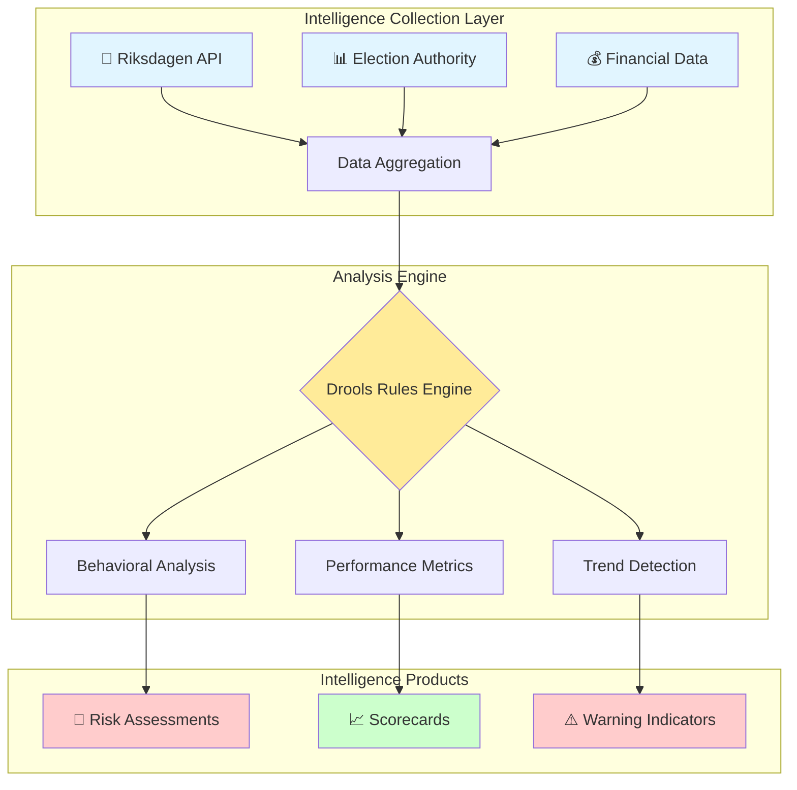
```mermaid
graph TB
    subgraph "Intelligence Collection Layer"
        A[📡 Riksdagen API] --> B[Data Aggregation]
        C[📊 Election Authority] --> B
        D[💰 Financial Data] --> B
    end
    
    subgraph "Analysis Engine"
        B --> E{Drools Rules Engine}
        E --> F[Behavioral Analysis]
        E --> G[Performance Metrics]
        E --> H[Trend Detection]
    end
    
    subgraph "Intelligence Products"
        F --> I[🔴 Risk Assessments]
        G --> J[📈 Scorecards]
        H --> K[⚠️ Warning Indicators]
    end
    
    style A fill:#e1f5ff
    style C fill:#e1f5ff
    style D fill:#e1f5ff
    style E fill:#ffeb99
    style I fill:#ffcccc
    style J fill:#ccffcc
    style K fill:#ffcccc
```

---

## 🎨 Severity Classification System

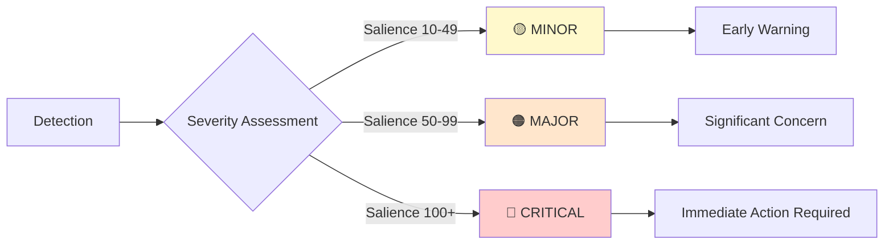
```mermaid
graph LR
    A[Detection] --> B{Severity Assessment}
    B -->|Salience 10-49| C[🟡 MINOR]
    B -->|Salience 50-99| D[🟠 MAJOR]
    B -->|Salience 100+| E[🔴 CRITICAL]
    
    C --> F[Early Warning]
    D --> G[Significant Concern]
    E --> H[Immediate Action Required]
    
    style C fill:#fff9cc
    style D fill:#ffe6cc
    style E fill:#ffcccc
```

**Severity Levels**:
- 🟡 **MINOR** (Salience 10-49): Early indicators, trend monitoring, preventive intelligence
- 🟠 **MAJOR** (Salience 50-99): Established patterns, accountability concerns, tactical intelligence
- 🔴 **CRITICAL** (Salience 100+): Severe risks, democratic accountability failure, strategic intelligence

---

## 🕵️ Politician Risk Rules (24 Rules)

### Behavioral Analysis Framework

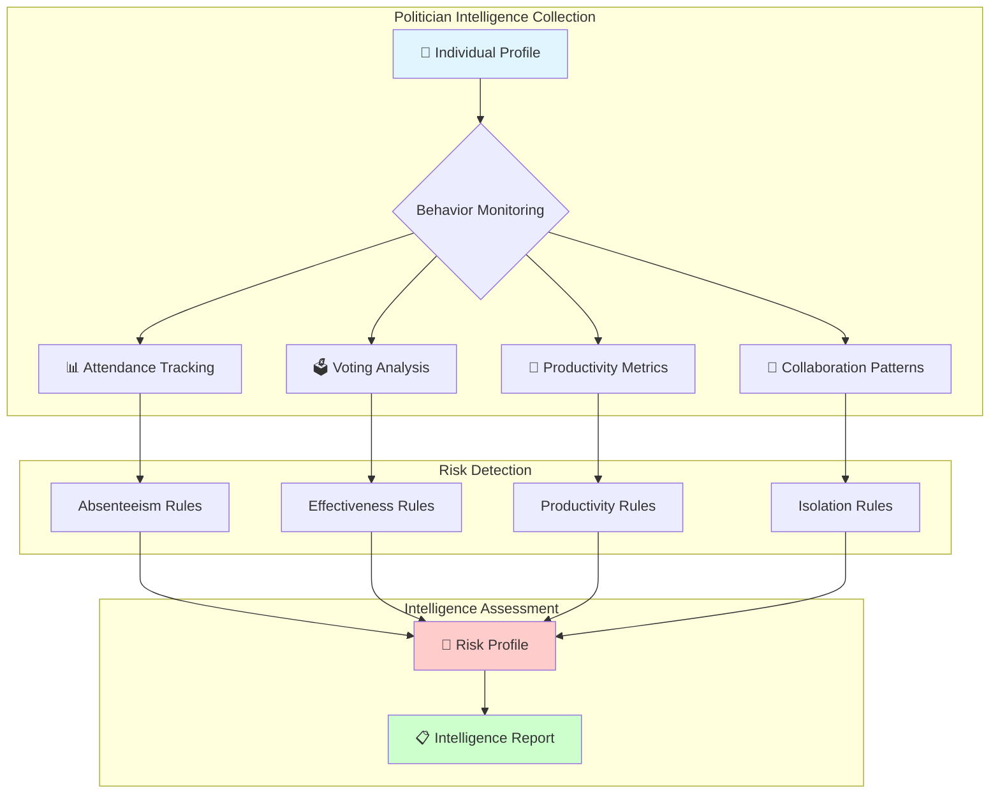
```mermaid
graph TB
    subgraph "Politician Intelligence Collection"
        A[👤 Individual Profile] --> B{Behavior Monitoring}
        B --> C[📊 Attendance Tracking]
        B --> D[🗳️ Voting Analysis]
        B --> E[📄 Productivity Metrics]
        B --> F[🤝 Collaboration Patterns]
    end
    
    subgraph "Risk Detection"
        C --> G[Absenteeism Rules]
        D --> H[Effectiveness Rules]
        E --> I[Productivity Rules]
        F --> J[Isolation Rules]
    end
    
    subgraph "Intelligence Assessment"
        G --> K[🔴 Risk Profile]
        H --> K
        I --> K
        J --> K
        K --> L[📋 Intelligence Report]
    end
    
    style A fill:#e1f5ff
    style K fill:#ffcccc
    style L fill:#ccffcc
```

---

### 1. 🚨 PoliticianLazy.drl - Absenteeism Detection

**Intelligence Purpose**: Identifies politicians with chronic absenteeism, indicating potential disengagement, burnout, or dereliction of duty.

**OSINT Indicators**: Physical absence from parliamentary votes, pattern recognition across temporal scales

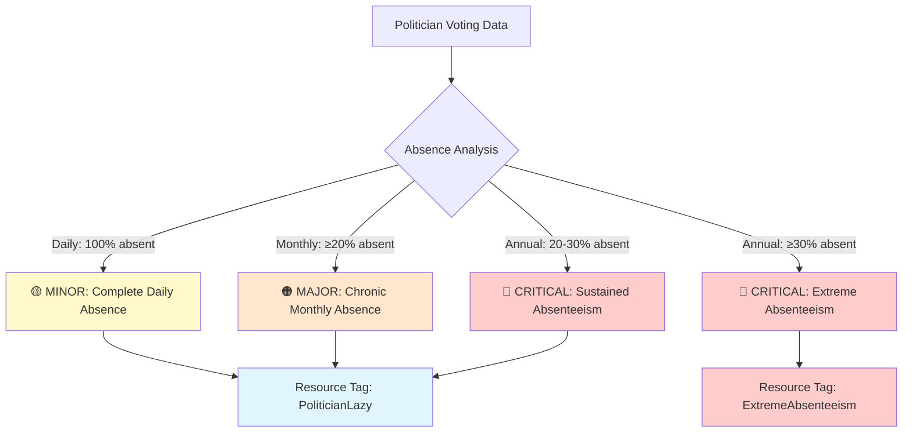
```mermaid
flowchart TD
    A[Politician Voting Data] --> B{Absence Analysis}
    B -->|Daily: 100% absent| C[🟡 MINOR: Complete Daily Absence]
    B -->|Monthly: ≥20% absent| D[🟠 MAJOR: Chronic Monthly Absence]
    B -->|Annual: 20-30% absent| E[🔴 CRITICAL: Sustained Absenteeism]
    B -->|Annual: ≥30% absent| F[🔴 CRITICAL: Extreme Absenteeism]
    
    C --> G[Resource Tag: PoliticianLazy]
    D --> G
    E --> G
    F --> H[Resource Tag: ExtremeAbsenteeism]
    
    style C fill:#fff9cc
    style D fill:#ffe6cc
    style E fill:#ffcccc
    style F fill:#ffcccc
    style G fill:#e1f5ff
    style H fill:#ffcccc
```

**Rules**:
1. **🟡 MINOR** (Salience 10): Absent 100% last day - temporary spike detection
2. **🟠 MAJOR** (Salience 50): Absent ≥20% last month - emerging pattern
3. **🔴 CRITICAL** (Salience 100): Absent 20-30% last year - chronic accountability failure
4. **🔴 CRITICAL** (Salience 150): Absent ≥30% last year - extreme dereliction

**INTOP Analysis**: High absenteeism correlates with political disengagement, health issues, or strategic withdrawal. Cross-reference with media coverage for context.

---

### 2. 🎯 PoliticianIneffectiveVoting.drl - Effectiveness Tracking

**Intelligence Purpose**: Measures political effectiveness by tracking alignment with winning vote outcomes.

**OSINT Indicators**: Vote outcome correlation, minority party patterns, coalition effectiveness

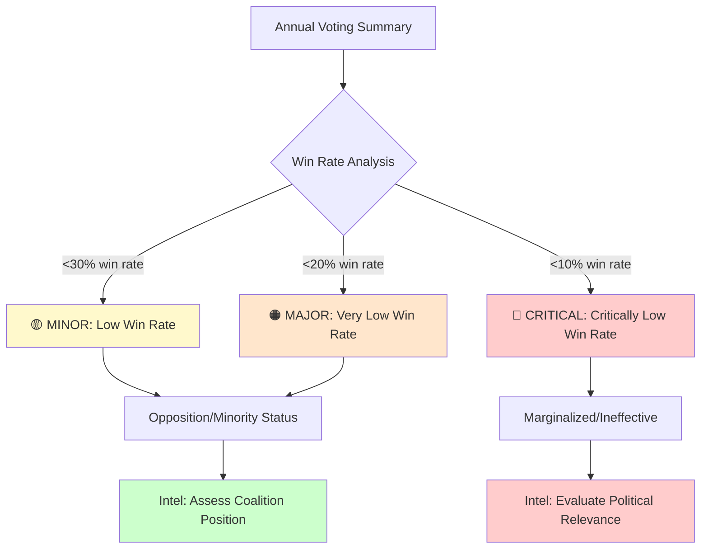
```mermaid
flowchart TD
    A[Annual Voting Summary] --> B{Win Rate Analysis}
    B -->|<30% win rate| C[🟡 MINOR: Low Win Rate]
    B -->|<20% win rate| D[🟠 MAJOR: Very Low Win Rate]
    B -->|<10% win rate| E[🔴 CRITICAL: Critically Low Win Rate]
    
    C --> F[Opposition/Minority Status]
    D --> F
    E --> G[Marginalized/Ineffective]
    
    F --> H[Intel: Assess Coalition Position]
    G --> I[Intel: Evaluate Political Relevance]
    
    style C fill:#fff9cc
    style D fill:#ffe6cc
    style E fill:#ffcccc
    style H fill:#ccffcc
    style I fill:#ffcccc
```

**Rules**:
1. **🟡 MINOR** (Salience 10): Win rate <30% - minority positioning
2. **🟠 MAJOR** (Salience 50): Win rate <20% - significant marginalization
3. **🔴 CRITICAL** (Salience 100): Win rate <10% - political irrelevance

**INTOP Analysis**: Low win rates indicate either opposition party status or internal coalition weakness. Distinguish between structural (minority party) and behavioral (ineffective coalition member) causes.

---

### 3. 🔄 PoliticianHighRebelRate.drl - Party Discipline Analysis

**Intelligence Purpose**: Detects politicians who frequently vote against party line, indicating internal conflicts or ideological independence.

**OSINT Indicators**: Party loyalty metrics, factional analysis, ideological positioning

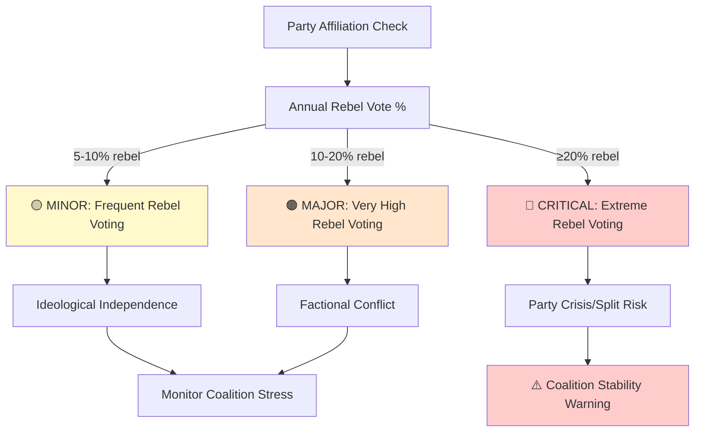
```mermaid
flowchart TD
    A[Party Affiliation Check] --> B[Annual Rebel Vote %]
    B -->|5-10% rebel| C[🟡 MINOR: Frequent Rebel Voting]
    B -->|10-20% rebel| D[🟠 MAJOR: Very High Rebel Voting]
    B -->|≥20% rebel| E[🔴 CRITICAL: Extreme Rebel Voting]
    
    C --> F[Ideological Independence]
    D --> G[Factional Conflict]
    E --> H[Party Crisis/Split Risk]
    
    F --> I[Monitor Coalition Stress]
    G --> I
    H --> J[⚠️ Coalition Stability Warning]
    
    style C fill:#fff9cc
    style D fill:#ffe6cc
    style E fill:#ffcccc
    style J fill:#ffcccc
```

**Rules**:
1. **🟡 MINOR** (Salience 10): Rebel rate 5-10% annually - moderate independence
2. **🟠 MAJOR** (Salience 50): Rebel rate 10-20% annually - significant dissent
3. **🔴 CRITICAL** (Salience 100): Rebel rate ≥20% annually - party crisis

**INTOP Analysis**: Cross-reference with committee assignments, media statements, and biographical data. High rebel rates may indicate principled dissent or preparation for party switch.

---

### 4. 📉 PoliticianDecliningEngagement.drl - Trend Analysis

**Intelligence Purpose**: Detects deteriorating performance by comparing recent vs. historical behavior.

**OSINT Indicators**: Temporal trend analysis, burnout indicators, crisis signals

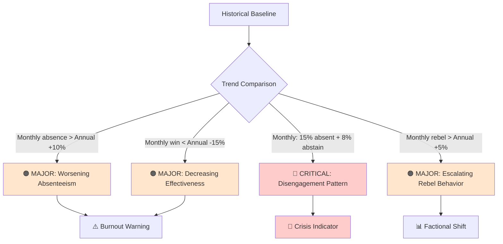
```mermaid
flowchart TD
    A[Historical Baseline] --> B{Trend Comparison}
    B -->|Monthly absence > Annual +10%| C[🟠 MAJOR: Worsening Absenteeism]
    B -->|Monthly win < Annual -15%| D[🟠 MAJOR: Decreasing Effectiveness]
    B -->|Monthly: 15% absent + 8% abstain| E[🔴 CRITICAL: Disengagement Pattern]
    B -->|Monthly rebel > Annual +5%| F[🟠 MAJOR: Escalating Rebel Behavior]
    
    C --> G[⚠️ Burnout Warning]
    D --> G
    E --> H[🚨 Crisis Indicator]
    F --> I[📊 Factional Shift]
    
    style C fill:#ffe6cc
    style D fill:#ffe6cc
    style E fill:#ffcccc
    style F fill:#ffe6cc
    style H fill:#ffcccc
```

**Rules**:
1. **🟠 MAJOR** (Salience 50): Monthly absence >10% worse than annual baseline
2. **🟠 MAJOR** (Salience 50): Monthly win rate 15%+ drop from annual
3. **🔴 CRITICAL** (Salience 100): High absence (≥15%) + high abstention (≥8%)
4. **🟠 MAJOR** (Salience 50): Monthly rebel rate exceeds annual by 5%+

**INTOP Analysis**: Declining engagement is a leading indicator of resignation, scandal, or health crisis. Prioritize for deeper investigation when detected.

---

### 5. ⚠️ PoliticianCombinedRisk.drl - Multi-Factor Assessment

**Intelligence Purpose**: Comprehensive risk profiling combining multiple negative indicators.

**OSINT Indicators**: Compound behavioral analysis, holistic risk assessment

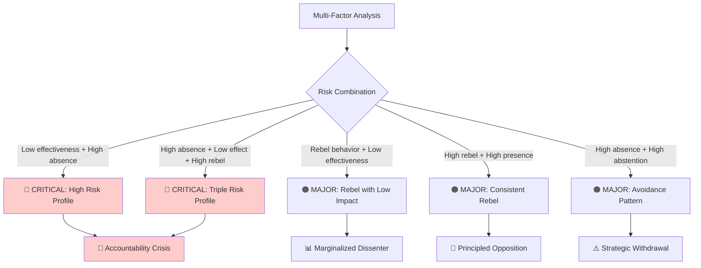
```mermaid
flowchart TD
    A[Multi-Factor Analysis] --> B{Risk Combination}
    B -->|Low effectiveness + High absence| C[🔴 CRITICAL: High Risk Profile]
    B -->|Rebel behavior + Low effectiveness| D[🟠 MAJOR: Rebel with Low Impact]
    B -->|High absence + Low effect + High rebel| E[🔴 CRITICAL: Triple Risk Profile]
    B -->|High rebel + High presence| F[🟠 MAJOR: Consistent Rebel]
    B -->|High absence + High abstention| G[🟠 MAJOR: Avoidance Pattern]
    
    C --> H[🚨 Accountability Crisis]
    E --> H
    D --> I[📊 Marginalized Dissenter]
    F --> J[🎯 Principled Opposition]
    G --> K[⚠️ Strategic Withdrawal]
    
    style C fill:#ffcccc
    style E fill:#ffcccc
    style H fill:#ffcccc
```

**Rules**:
1. **🔴 CRITICAL** (Salience 100): Win <25% + Absence ≥20%
2. **🟠 MAJOR** (Salience 75): Rebel ≥15% + Win <30%
3. **🔴 CRITICAL** (Salience 150): Absence ≥18% + Win <25% + Rebel ≥12% (Triple Risk)
4. **🟠 MAJOR** (Salience 50): Rebel ≥12% + Absence <8% (Principled dissent)
5. **🟠 MAJOR** (Salience 75): Absence ≥12% + Abstention ≥8%

**INTOP Analysis**: Combined risk profiles identify politicians who are both present problems (low effectiveness) and structural risks (instability). Priority targets for oversight.

---

### 6. 🤐 PoliticianAbstentionPattern.drl - Strategic Behavior Analysis

**Intelligence Purpose**: Analyzes voting abstention as indicator of indecision, strategic positioning, or conflict avoidance.

**OSINT Indicators**: Abstention patterns, controversial vote analysis, strategic positioning

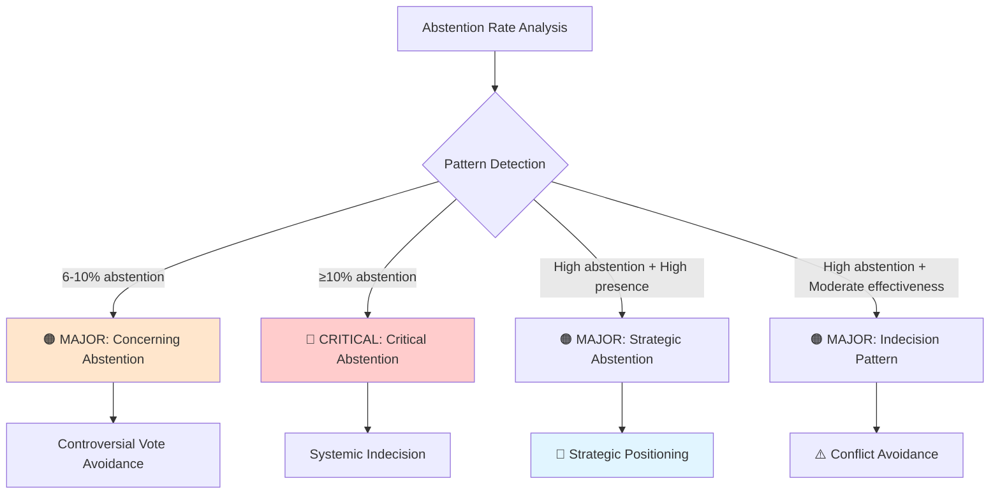
```mermaid
flowchart TD
    A[Abstention Rate Analysis] --> B{Pattern Detection}
    B -->|6-10% abstention| C[🟠 MAJOR: Concerning Abstention]
    B -->|≥10% abstention| D[🔴 CRITICAL: Critical Abstention]
    B -->|High abstention + High presence| E[🟠 MAJOR: Strategic Abstention]
    B -->|High abstention + Moderate effectiveness| F[🟠 MAJOR: Indecision Pattern]
    
    C --> G[Controversial Vote Avoidance]
    D --> H[Systemic Indecision]
    E --> I[🎯 Strategic Positioning]
    F --> J[⚠️ Conflict Avoidance]
    
    style C fill:#ffe6cc
    style D fill:#ffcccc
    style I fill:#e1f5ff
```

**Rules**:
1. **🟠 MAJOR** (Salience 50): Abstention rate 6-10% - concerning avoidance
2. **🔴 CRITICAL** (Salience 100): Abstention rate ≥10% - chronic indecision
3. **🟠 MAJOR** (Salience 75): High abstention + high presence - strategic behavior
4. **🟠 MAJOR** (Salience 50): High abstention + moderate effectiveness - genuine indecision

**INTOP Analysis**: Distinguish between strategic abstention (calculated positioning) and systemic indecision (leadership weakness). Correlate with controversial votes.

---

### 7. 💤 PoliticianLowEngagement.drl - Participation Monitoring

**Intelligence Purpose**: Identifies minimal parliamentary engagement and comprehensive avoidance patterns.

**OSINT Indicators**: Vote volume, combined absence/abstention, participation metrics

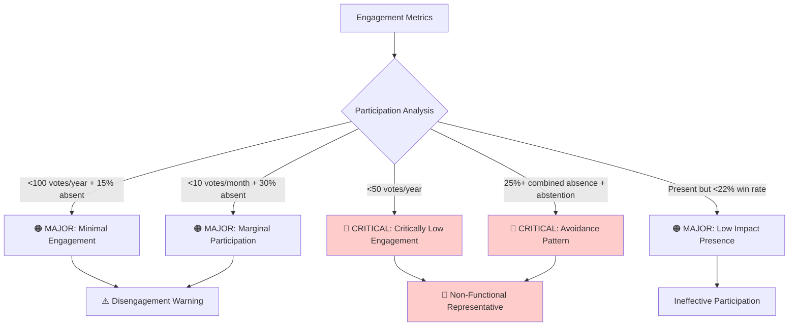
```mermaid
flowchart TD
    A[Engagement Metrics] --> B{Participation Analysis}
    B -->|<100 votes/year + 15% absent| C[🟠 MAJOR: Minimal Engagement]
    B -->|<50 votes/year| D[🔴 CRITICAL: Critically Low Engagement]
    B -->|25%+ combined absence + abstention| E[🔴 CRITICAL: Avoidance Pattern]
    B -->|Present but <22% win rate| F[🟠 MAJOR: Low Impact Presence]
    B -->|<10 votes/month + 30% absent| G[🟠 MAJOR: Marginal Participation]
    
    C --> H[⚠️ Disengagement Warning]
    D --> I[🚨 Non-Functional Representative]
    E --> I
    F --> J[Ineffective Participation]
    G --> H
    
    style D fill:#ffcccc
    style E fill:#ffcccc
    style I fill:#ffcccc
```

**Rules**:
1. **🟠 MAJOR** (Salience 50): <100 annual votes + ≥15% absence
2. **🔴 CRITICAL** (Salience 100): <50 annual votes
3. **🔴 CRITICAL** (Salience 100): Combined absence + abstention ≥25%
4. **🟠 MAJOR** (Salience 75): Present but win rate <22%
5. **🟠 MAJOR** (Salience 50): <10 monthly votes + ≥30% absence

**INTOP Analysis**: Low engagement indicates either structural barriers (illness, role conflicts) or willful neglect. Critical for constituent accountability.

---

### 8. 📄 PoliticianLowDocumentActivity.drl - Legislative Productivity

**Intelligence Purpose**: Tracks legislative document production (motions, proposals, questions) as proxy for policy initiative.

**OSINT Indicators**: Document production rates, legislative initiative, policy entrepreneurship

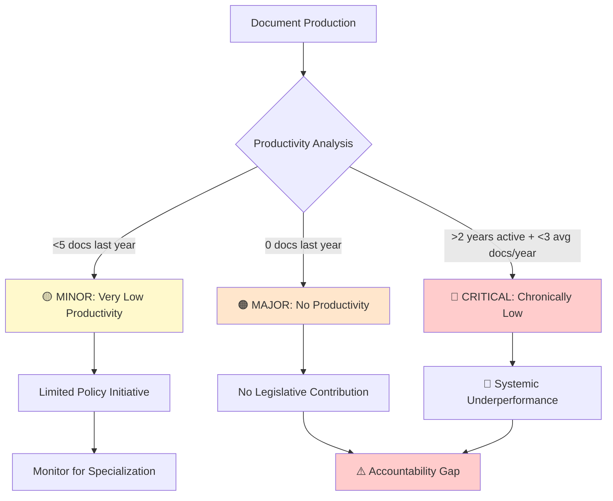
```mermaid
flowchart TD
    A[Document Production] --> B{Productivity Analysis}
    B -->|<5 docs last year| C[🟡 MINOR: Very Low Productivity]
    B -->|0 docs last year| D[🟠 MAJOR: No Productivity]
    B -->|>2 years active + <3 avg docs/year| E[🔴 CRITICAL: Chronically Low]
    
    C --> F[Limited Policy Initiative]
    D --> G[No Legislative Contribution]
    E --> H[🚨 Systemic Underperformance]
    
    F --> I[Monitor for Specialization]
    G --> J[⚠️ Accountability Gap]
    H --> J
    
    style C fill:#fff9cc
    style D fill:#ffe6cc
    style E fill:#ffcccc
    style J fill:#ffcccc
```

**Rules**:
1. **🟡 MINOR** (Salience 10): Documents last year <5 but >0
2. **🟠 MAJOR** (Salience 50): Zero documents last year
3. **🔴 CRITICAL** (Salience 100): >2 years active + average <3 docs/year

**INTOP Analysis**: Low document production may indicate focus on other roles (committee work, party leadership) or lack of policy engagement. Context-dependent assessment.

---

### 9. 🏝️ PoliticianIsolatedBehavior.drl - Collaboration Analysis

**Intelligence Purpose**: Identifies politicians who avoid cross-party collaboration, indicating partisan rigidity or ideological isolation.

**OSINT Indicators**: Collaboration rates, multi-party motion participation, coalition-building capacity

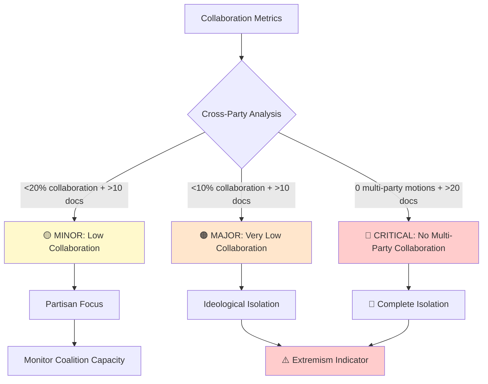
```mermaid
flowchart TD
    A[Collaboration Metrics] --> B{Cross-Party Analysis}
    B -->|<20% collaboration + >10 docs| C[🟡 MINOR: Low Collaboration]
    B -->|<10% collaboration + >10 docs| D[🟠 MAJOR: Very Low Collaboration]
    B -->|0 multi-party motions + >20 docs| E[🔴 CRITICAL: No Multi-Party Collaboration]
    
    C --> F[Partisan Focus]
    D --> G[Ideological Isolation]
    E --> H[🚨 Complete Isolation]
    
    F --> I[Monitor Coalition Capacity]
    G --> J[⚠️ Extremism Indicator]
    H --> J
    
    style C fill:#fff9cc
    style D fill:#ffe6cc
    style E fill:#ffcccc
    style J fill:#ffcccc
```

**Rules**:
1. **🟡 MINOR** (Salience 10): Collaboration <20% but ≥10%, >10 total docs
2. **🟠 MAJOR** (Salience 50): Collaboration <10% but >0%, >10 total docs
3. **🔴 CRITICAL** (Salience 100): Zero multi-party motions, >20 total docs

**INTOP Analysis**: Isolation may indicate ideological extremism, party discipline, or personal conflicts. Correlate with party positioning on political spectrum.

---

### 10. 🔄 PoliticianLowVotingParticipation.drl - Comprehensive Participation

**Intelligence Purpose**: Multi-dimensional participation assessment combining absence, abstention, and effectiveness.

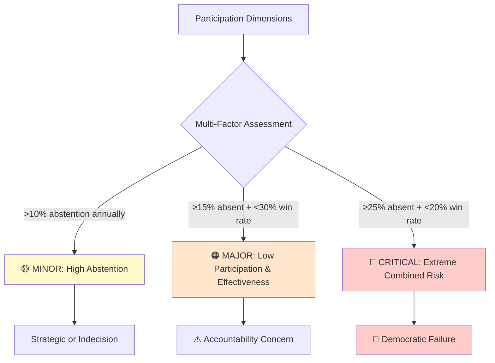
```mermaid
flowchart TD
    A[Participation Dimensions] --> B{Multi-Factor Assessment}
    B -->|>10% abstention annually| C[🟡 MINOR: High Abstention]
    B -->|≥15% absent + <30% win rate| D[🟠 MAJOR: Low Participation & Effectiveness]
    B -->|≥25% absent + <20% win rate| E[🔴 CRITICAL: Extreme Combined Risk]
    
    C --> F[Strategic or Indecision]
    D --> G[⚠️ Accountability Concern]
    E --> H[🚨 Democratic Failure]
    
    style C fill:#fff9cc
    style D fill:#ffe6cc
    style E fill:#ffcccc
    style H fill:#ffcccc
```

**Rules**:
1. **🟡 MINOR** (Salience 10): Abstention >10% annually
2. **🟠 MAJOR** (Salience 50): Absence ≥15% + Win <30%
3. **🔴 CRITICAL** (Salience 100): Absence ≥25% + Win <20%

---

### Additional Politician Rules (Summary)

**11. 🎓 PoliticianExperience.drl** - Career development and expertise tracking  
**12. 👶 PoliticianYoungMember.drl** - New member monitoring and onboarding assessment  
**13. 👴 PoliticianTimeToRetire.drl** - Long-serving member analysis  
**14. 🎤 PoliticianSpeaker.drl** - Speaker role identification  
**15. 🏛️ PoliticianPartyLeader.drl** - Leadership position tracking  
**16. 🚪 PoliticianLeftPartyStillHoldingPositions.drl** - Transition accountability  
**17. 🎯 PoliticianPartyRebel.drl** - Rebel behavior flagging  
**18. 📊 PoliticianBusySchedule.drl** - High activity level identification  
**19. 🏛️ PoliticianCommitteeLeadership.drl** - Committee leadership tracking  
**20. 📋 PoliticianCommitteeInfluence.drl** - Committee influence assessment  
**21. 🔄 PoliticianCommiteeSubstitute.drl** - Substitute role monitoring  
**22. 🎓 PoliticianMinisterWithoutParliamentExperience.drl** - Government appointment analysis  
**23. ⚖️ PoliticianBalancedRules.drl** - Positive indicator tracking  
**24. ➕ PoliticianAdditionalAttributes.drl** - Extended attribute analysis

---

## 🏛️ Party Risk Rules (10 Rules)

### Organizational Intelligence Framework

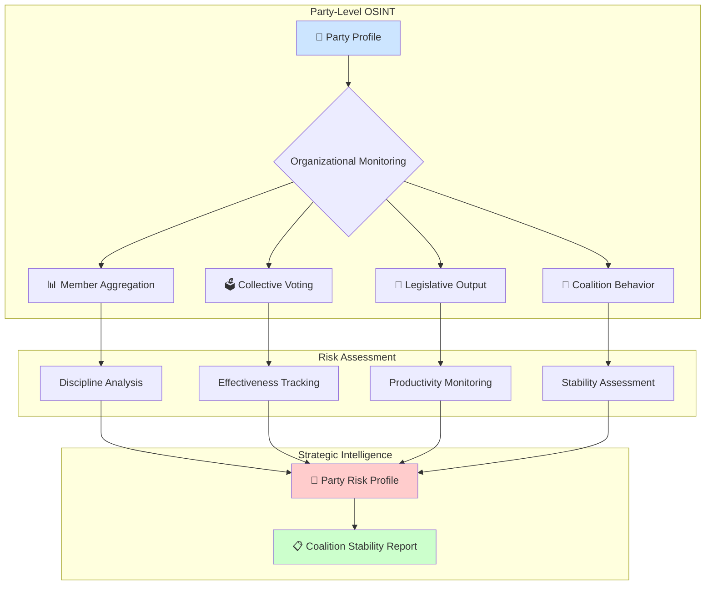
```mermaid
graph TB
    subgraph "Party-Level OSINT"
        A[🎯 Party Profile] --> B{Organizational Monitoring}
        B --> C[📊 Member Aggregation]
        B --> D[🗳️ Collective Voting]
        B --> E[📄 Legislative Output]
        B --> F[🤝 Coalition Behavior]
    end
    
    subgraph "Risk Assessment"
        C --> G[Discipline Analysis]
        D --> H[Effectiveness Tracking]
        E --> I[Productivity Monitoring]
        F --> J[Stability Assessment]
    end
    
    subgraph "Strategic Intelligence"
        G --> K[🔴 Party Risk Profile]
        H --> K
        I --> K
        J --> K
        K --> L[📋 Coalition Stability Report]
    end
    
    style A fill:#cce5ff
    style K fill:#ffcccc
    style L fill:#ccffcc
```

---

### Complete Party Rules List

**1. 💤 PartyLazy.drl** - Party-wide absenteeism monitoring  
**2. 📉 PartyDecliningPerformance.drl** - Performance trend analysis and early warning  
**3. ⚠️ PartyCombinedRisk.drl** - Multi-dimensional party health assessment  
**4. 🔄 PartyInconsistentBehavior.drl** - Erratic pattern detection  
**5. 📊 PartyLowEffectiveness.drl** - Coalition impact assessment  
**6. 🤝 PartyLowCollaboration.drl** - Coalition capacity evaluation  
**7. 📄 PartyLowProductivity.drl** - Legislative output monitoring  
**8. 🏛️ PartyHighAbsenteeism.drl** - Enhanced party absence tracking  
**9. 🎓 PartyNoGovernmentExperience.drl** - Government readiness assessment  
**10. 💭 PartyNoOpinion.drl** - Policy positioning analysis

---

## 🏛️ Committee Risk Rules (4 Rules)

### Legislative Body Intelligence

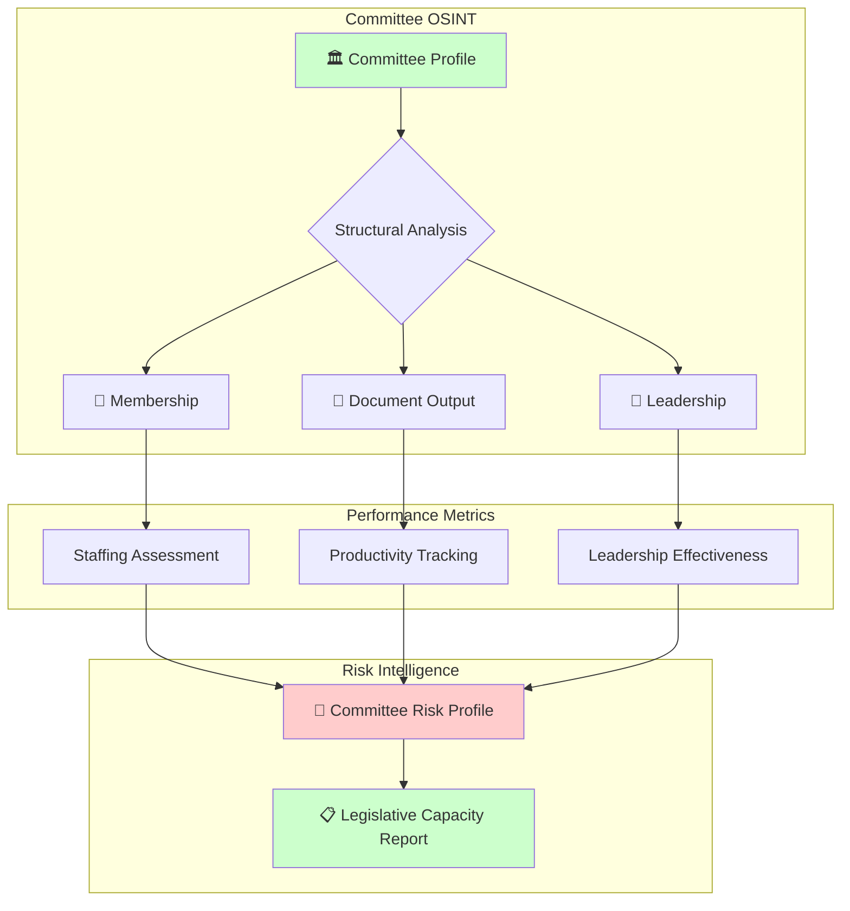
```mermaid
graph TB
    subgraph "Committee OSINT"
        A[🏛️ Committee Profile] --> B{Structural Analysis}
        B --> C[👥 Membership]
        B --> D[📄 Document Output]
        B --> E[🎯 Leadership]
    end
    
    subgraph "Performance Metrics"
        C --> F[Staffing Assessment]
        D --> G[Productivity Tracking]
        E --> H[Leadership Effectiveness]
    end
    
    subgraph "Risk Intelligence"
        F --> I[🔴 Committee Risk Profile]
        G --> I
        H --> I
        I --> J[📋 Legislative Capacity Report]
    end
    
    style A fill:#ccffcc
    style I fill:#ffcccc
    style J fill:#ccffcc
```

---

### Complete Committee Rules List

**1. 📉 CommitteeLowProductivity.drl** - Output monitoring and productivity tracking  
**2. 👥 CommitteeLeadershipVacancy.drl** - Structural health and leadership analysis  
**3. 💤 CommitteeInactivity.drl** - Engagement monitoring through motion activity  
**4. 🔻 CommitteeStagnation.drl** - Comprehensive decline analysis

---

## 👔 Ministry Risk Rules (4 Rules)

### Government Executive Intelligence

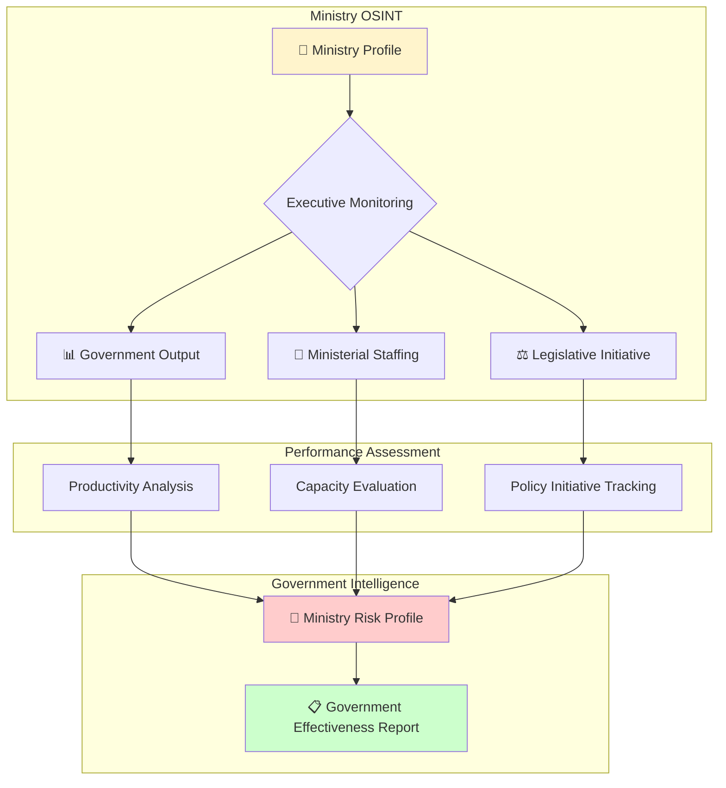
```mermaid
graph TB
    subgraph "Ministry OSINT"
        A[👔 Ministry Profile] --> B{Executive Monitoring}
        B --> C[📊 Government Output]
        B --> D[👥 Ministerial Staffing]
        B --> E[⚖️ Legislative Initiative]
    end
    
    subgraph "Performance Assessment"
        C --> F[Productivity Analysis]
        D --> G[Capacity Evaluation]
        E --> H[Policy Initiative Tracking]
    end
    
    subgraph "Government Intelligence"
        F --> I[🔴 Ministry Risk Profile]
        G --> I
        H --> I
        I --> J[📋 Government Effectiveness Report]
    end
    
    style A fill:#fff4cc
    style I fill:#ffcccc
    style J fill:#ccffcc
```

---

### Complete Ministry Rules List

**1. 📉 MinistryLowProductivity.drl** - Output tracking and document production  
**2. ⚖️ MinistryInactiveLegislation.drl** - Legislative initiative monitoring  
**3. 👥 MinistryUnderstaffed.drl** - Capacity assessment and staffing analysis  
**4. 🔻 MinistryStagnation.drl** - Comprehensive decline detection

---

## 🎯 Intelligence Operational Framework

### OSINT Collection Methodology

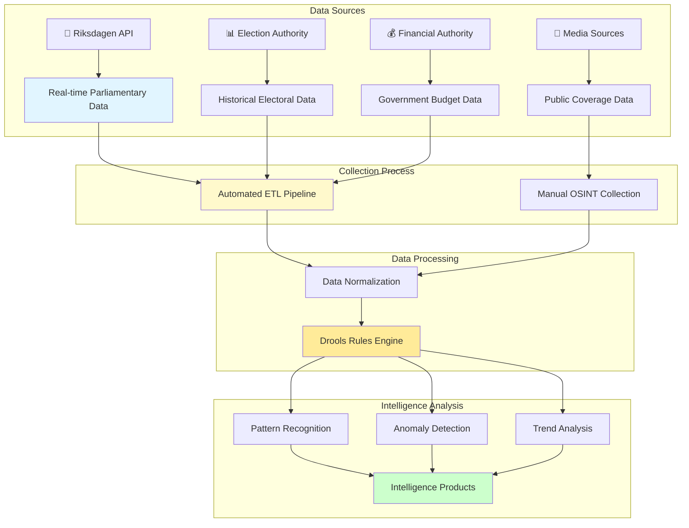
```mermaid
graph TB
    subgraph "Data Sources"
        A[📡 Riksdagen API] --> B[Real-time Parliamentary Data]
        C[📊 Election Authority] --> D[Historical Electoral Data]
        E[💰 Financial Authority] --> F[Government Budget Data]
        G[📰 Media Sources] --> H[Public Coverage Data]
    end
    
    subgraph "Collection Process"
        B --> I[Automated ETL Pipeline]
        D --> I
        F --> I
        H --> J[Manual OSINT Collection]
    end
    
    subgraph "Data Processing"
        I --> K[Data Normalization]
        J --> K
        K --> L[Drools Rules Engine]
    end
    
    subgraph "Intelligence Analysis"
        L --> M[Pattern Recognition]
        L --> N[Anomaly Detection]
        L --> O[Trend Analysis]
        M --> P[Intelligence Products]
        N --> P
        O --> P
    end
    
    style B fill:#e1f5ff
    style I fill:#fff9cc
    style L fill:#ffeb99
    style P fill:#ccffcc
```

---

### Analytical Techniques Applied

#### 1. **Temporal Analysis**
- **Daily**: Immediate anomalies, tactical shifts
- **Monthly**: Emerging trends, pattern development
- **Annual**: Strategic assessment, sustained patterns
- **Cross-temporal**: Decline detection, improvement tracking

#### 2. **Comparative Analysis**
- **Peer comparison**: Politician vs. party average
- **Historical comparison**: Current vs. baseline performance
- **Cross-party comparison**: Relative effectiveness assessment
- **Regional comparison**: Constituency representation gaps

#### 3. **Pattern Recognition**
- **Behavioral clusters**: Similar risk profiles
- **Temporal patterns**: Cyclical behavior (election-driven)
- **Correlation detection**: Related risk factors
- **Anomaly identification**: Statistical outliers

#### 4. **Predictive Intelligence**
- **Trend extrapolation**: Forecasting future performance
- **Risk escalation**: Early warning indicators
- **Coalition stability**: Government sustainability assessment
- **Electoral impact**: Vote consequence prediction

---

### Intelligence Products Generated

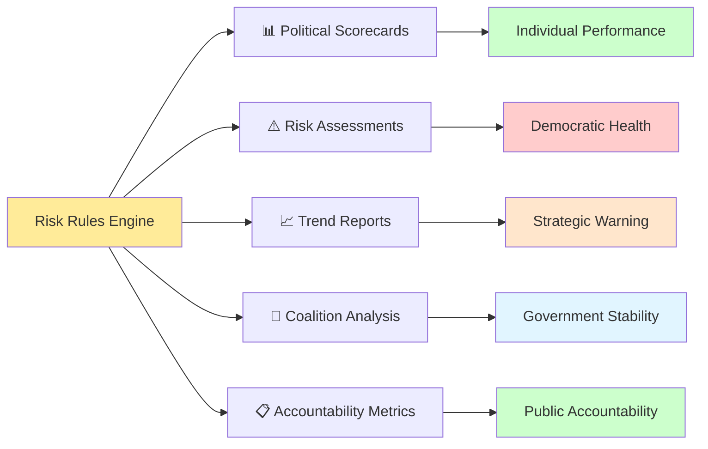
```mermaid
graph LR
    A[Risk Rules Engine] --> B[📊 Political Scorecards]
    A --> C[⚠️ Risk Assessments]
    A --> D[📈 Trend Reports]
    A --> E[🎯 Coalition Analysis]
    A --> F[📋 Accountability Metrics]
    
    B --> G[Individual Performance]
    C --> H[Democratic Health]
    D --> I[Strategic Warning]
    E --> J[Government Stability]
    F --> K[Public Accountability]
    
    style A fill:#ffeb99
    style G fill:#ccffcc
    style H fill:#ffcccc
    style I fill:#ffe6cc
    style J fill:#e1f5ff
    style K fill:#ccffcc
```

---

## 🔐 Ethical & Operational Guidelines

### OSINT Ethics

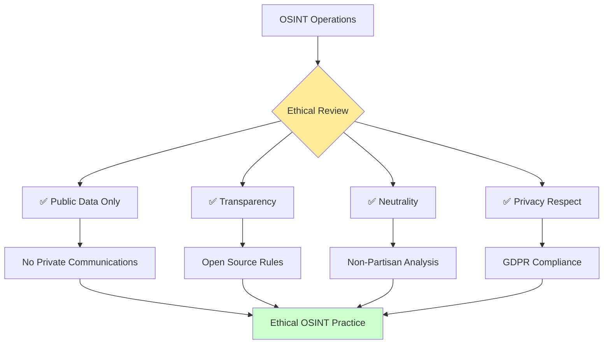
```mermaid
graph TB
    A[OSINT Operations] --> B{Ethical Review}
    B --> C[✅ Public Data Only]
    B --> D[✅ Transparency]
    B --> E[✅ Neutrality]
    B --> F[✅ Privacy Respect]
    
    C --> G[No Private Communications]
    D --> H[Open Source Rules]
    E --> I[Non-Partisan Analysis]
    F --> J[GDPR Compliance]
    
    G --> K[Ethical OSINT Practice]
    H --> K
    I --> K
    J --> K
    
    style B fill:#ffeb99
    style K fill:#ccffcc
```

### Operational Principles

1. **🔍 Transparency**: All rules and thresholds publicly documented
2. **⚖️ Neutrality**: Equal application across political spectrum
3. **🔒 Privacy**: Only public parliamentary data analyzed
4. **📊 Objectivity**: Statistical thresholds, not subjective judgment
5. **🎯 Accuracy**: Verifiable against public records
6. **🛡️ Responsibility**: Consider democratic impact of intelligence products

### Counter-Disinformation Role

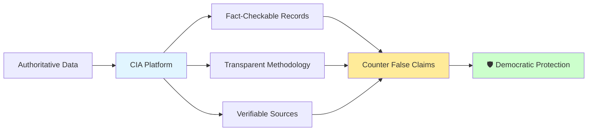
```mermaid
graph LR
    A[Authoritative Data] --> B[CIA Platform]
    B --> C[Fact-Checkable Records]
    B --> D[Transparent Methodology]
    B --> E[Verifiable Sources]
    
    C --> F[Counter False Claims]
    D --> F
    E --> F
    
    F --> G[🛡️ Democratic Protection]
    
    style B fill:#e1f5ff
    style F fill:#ffeb99
    style G fill:#ccffcc
```

**CIA as Counter-Disinformation Tool**:
- Provides authoritative voting records
- Enables fact-checking of political claims
- Offers transparent performance metrics
- Supports informed citizenship over manipulation

---

## 📊 Technical Implementation

### Drools Rules Engine Architecture

```mermaid
graph TB
    subgraph "Input Layer"
        A[Database Views] --> B[JPA Entities]
        B --> C[ComplianceCheck Implementations]
    end
    
    subgraph "Rules Engine"
        C --> D[Drools KIE Session]
        E[DRL Rule Files] --> D
        D --> F[Pattern Matching]
        F --> G[Rule Execution]
        G --> H[Salience Ordering]
    end
    
    subgraph "Output Layer"
        H --> I[RuleViolation Entities]
        I --> J[Database Persistence]
        J --> K[API Endpoints]
        J --> L[Web UI Display]
    end
    
    style D fill:#ffeb99
    style I fill:#ccffcc
```

### Data Model Integration

**Key Database Views**:
- `ViewRiksdagenPolitician` - Politician profiles
- `ViewRiksdagenPartySummary` - Party aggregates
- `ViewRiksdagenCommittee` - Committee data
- `ViewRiksdagenMinistry` - Ministry information
- `ViewRiksdagenVoteDataBallot*Summary*` - Voting summaries (Daily/Monthly/Annual)

### Compliance Check Implementations

```mermaid
graph LR
    A[ComplianceCheck Interface] --> B[PoliticianComplianceCheckImpl]
    A --> C[PartyComplianceCheckImpl]
    A --> D[CommitteeComplianceCheckImpl]
    A --> E[MinistryComplianceCheckImpl]
    
    B --> F[Politician Rules]
    C --> G[Party Rules]
    D --> H[Committee Rules]
    E --> I[Ministry Rules]
    
    style A fill:#e1f5ff
    style F fill:#ffcccc
    style G fill:#cce5ff
    style H fill:#ccffcc
    style I fill:#fff4cc
```

---

## 🎓 Intelligence Analyst Training Guide

### Using Risk Rules for Analysis

#### Step 1: Data Collection
- Access Riksdagen API data
- Verify data freshness and completeness
- Cross-reference with electoral authority records

#### Step 2: Pattern Recognition
- Run rules engine to identify violations
- Cluster similar risk profiles
- Identify temporal trends

#### Step 3: Context Assessment
- Distinguish structural from behavioral issues
- Consider party positioning (government/opposition)
- Evaluate external factors (scandals, health, family)

#### Step 4: Intelligence Production
- Draft risk assessment reports
- Create visualizations (scorecards, dashboards)
- Provide actionable insights

#### Step 5: Dissemination
- Publish via web platform
- Provide API access for third parties
- Support media and academic use

---

## 📈 Future Enhancements

### Planned Intelligence Capabilities

```mermaid
graph TB
    A[Current Rules Engine] --> B{Future Enhancements}
    B --> C[🤖 Machine Learning]
    B --> D[🌐 Network Analysis]
    B --> E[💬 Sentiment Analysis]
    B --> F[🔮 Predictive Models]
    
    C --> G[Threshold Optimization]
    D --> H[Coalition Mapping]
    E --> I[Media Coverage Integration]
    F --> J[Election Forecasting]
    
    style A fill:#e1f5ff
    style B fill:#ffeb99
    style G fill:#ccffcc
    style H fill:#ccffcc
    style I fill:#ccffcc
    style J fill:#ccffcc
```

### Research Areas

1. **Historical Trend Analysis**: Multi-year performance tracking
2. **Coalition Prediction Models**: Government stability forecasting
3. **Network Analysis**: Collaboration and influence mapping
4. **Sentiment Integration**: Media coverage impact assessment
5. **Regional Analysis**: Constituency representation effectiveness
6. **Cross-Country Comparison**: Nordic parliamentary benchmarking

---

## 📚 References & Resources

### Documentation
- [Project Architecture](ARCHITECTURE.md)
- [Data Model](DATA_MODEL.md)
- [SWOT Analysis](SWOT.md)
- [Threat Model](THREAT_MODEL.md)
- [Security Architecture](SECURITY_ARCHITECTURE.md)

### Technical
- [Drools Documentation](https://www.drools.org/)
- [Riksdagen Open Data](https://data.riksdagen.se/)
- [Swedish Election Authority](https://www.val.se/)

### Academic
- Structured Analytic Techniques (Heuer & Pherson)
- Intelligence Analysis: A Target-Centric Approach (Clark)
- Open Source Intelligence Techniques (Bazzell)

---

## 📋 Quick Reference - Rule Summary

### Politician Rules (24)
| Rule | Category | Severity Levels | Key Metric |
|------|----------|----------------|------------|
| PoliticianLazy | Absenteeism | MINOR/MAJOR/CRITICAL | Absence % |
| PoliticianIneffectiveVoting | Effectiveness | MINOR/MAJOR/CRITICAL | Win % |
| PoliticianHighRebelRate | Discipline | MINOR/MAJOR/CRITICAL | Rebel % |
| PoliticianDecliningEngagement | Trends | MAJOR/CRITICAL | Month vs. Annual |
| PoliticianCombinedRisk | Multi-Factor | MAJOR/CRITICAL | Combined Metrics |
| PoliticianAbstentionPattern | Strategic | MAJOR/CRITICAL | Abstention % |
| PoliticianLowEngagement | Participation | MAJOR/CRITICAL | Vote Count |
| PoliticianLowDocumentActivity | Productivity | MINOR/MAJOR/CRITICAL | Document Count |
| PoliticianIsolatedBehavior | Collaboration | MINOR/MAJOR/CRITICAL | Collab % |
| PoliticianLowVotingParticipation | Comprehensive | MINOR/MAJOR/CRITICAL | Multiple Factors |
| + 14 additional politician rules | Various | Various | Various |

### Party Rules (10)
| Rule | Category | Severity Levels | Key Metric |
|------|----------|----------------|------------|
| PartyLazy | Absenteeism | MINOR/MAJOR/CRITICAL | Party Absence % |
| PartyDecliningPerformance | Trends | MAJOR/CRITICAL | Performance Decline |
| PartyCombinedRisk | Multi-Factor | MAJOR/CRITICAL | Combined Metrics |
| PartyInconsistentBehavior | Stability | MAJOR/CRITICAL | Variance |
| PartyLowEffectiveness | Impact | MINOR/MAJOR/CRITICAL | Win % |
| PartyLowCollaboration | Coalition | MINOR/MAJOR/CRITICAL | Collab % |
| PartyLowProductivity | Output | MINOR/MAJOR/CRITICAL | Document Count |
| PartyHighAbsenteeism | Attendance | MINOR/MAJOR/CRITICAL | Absence % |
| PartyNoGovernmentExperience | Readiness | MINOR | Experience Level |
| PartyNoOpinion | Positioning | MINOR | Policy Stance |

### Committee Rules (4)
| Rule | Category | Severity Levels | Key Metric |
|------|----------|----------------|------------|
| CommitteeLowProductivity | Output | MINOR/MAJOR/CRITICAL | Document Count |
| CommitteeLeadershipVacancy | Structure | MINOR/MAJOR/CRITICAL | Leadership |
| CommitteeInactivity | Engagement | MINOR/MAJOR/CRITICAL | Motion Count |
| CommitteeStagnation | Decline | MAJOR/CRITICAL | Combined Metrics |

### Ministry Rules (4)
| Rule | Category | Severity Levels | Key Metric |
|------|----------|----------------|------------|
| MinistryLowProductivity | Output | MINOR/MAJOR/CRITICAL | Document Count |
| MinistryInactiveLegislation | Initiative | MINOR/MAJOR/CRITICAL | Bills/Propositions |
| MinistryUnderstaffed | Capacity | MINOR/MAJOR/CRITICAL | Member Count |
| MinistryStagnation | Decline | MAJOR/CRITICAL | Combined Metrics |

---

## 🎯 Conclusion

This comprehensive risk rules framework provides the Citizen Intelligence Agency with a sophisticated **Intelligence Operations** and **OSINT** capability for monitoring Swedish political actors and institutions. By combining:

- **45 behavioral detection rules** across 4 domains
- **Color-coded severity classification** for prioritization
- **Multi-temporal analysis** (daily, monthly, annual)
- **Ethical OSINT principles** ensuring democratic values
- **Transparent methodology** supporting accountability

The platform delivers authoritative intelligence products that empower citizens, support accountability, and strengthen democratic processes while maintaining strict neutrality and respect for privacy.

**🔍 Intelligence Mission**: Illuminate the political process, not manipulate it.

---

*Document Version: 1.0*  
*Last Updated: 2025-11-14*  
*Classification: UNCLASSIFIED - Public Domain*  
*Distribution: Unlimited (Open Source)*
