# Risk Rules Documentation - Intelligence Operations & OSINT Perspective

## 🎯 Executive Summary

This document provides comprehensive intelligence analysis documentation for all risk assessment rules in the Citizen Intelligence Agency platform. From an **Intelligence Operations (INTOP)** and **Open-Source Intelligence (OSINT)** perspective, these rules form a sophisticated behavioral analysis framework for monitoring political actors, detecting anomalies, and identifying threats to democratic accountability.

**Total Rules Coverage**: 50 risk detection rules across 5 operational domains
- 🔴 **24 Politician Rules**: Individual behavioral analysis
- 🔵 **10 Party Rules**: Organizational effectiveness monitoring
- 🟢 **4 Committee Rules**: Legislative body performance
- 🟡 **4 Ministry Rules**: Government executive assessment
- 📊 **5 Decision Pattern Rules**: Legislative effectiveness and coalition stability (NEW v1.35)
- ⚪ **3 Other Rules**: Application and user-level rules

---

## 📋 Quick Reference: Risk Rules and Data Sources

<div class="quick-reference">

| I Want To... | Navigate To |
|--------------|-------------|
| **See complete data flow pipeline** | [Intelligence Data Flow Map](INTELLIGENCE_DATA_FLOW.md) |
| **Find which views support risk rules** | [Risk Rule → View Mapping](INTELLIGENCE_DATA_FLOW.md#risk-rule--view-mapping) |
| **Understand analytical frameworks** | [Data Analysis Documentation](DATA_ANALYSIS_INTOP_OSINT.md) |
| **Browse all database views** | [Database View Intelligence Catalog](DATABASE_VIEW_INTELLIGENCE_CATALOG.md) |
| **Jump to Politician Risk Rules** | [Politician Risk Rules](#-politician-risk-rules-24-rules) |
| **Jump to Party Risk Rules** | [Party Risk Rules](#-party-risk-rules-10-rules) |
| **Jump to Committee Risk Rules** | [Committee Risk Rules](#-committee-risk-rules-4-rules) |
| **Jump to Ministry Risk Rules** | [Ministry Risk Rules](#-ministry-risk-rules-4-rules) |
| **Jump to Decision Pattern Risk Rules** | [Decision Pattern Risk Rules](#-decision-pattern-risk-rules-5-rules---d-01-to-d-05) |

</div>

---

## 📊 Intelligence Framework Overview

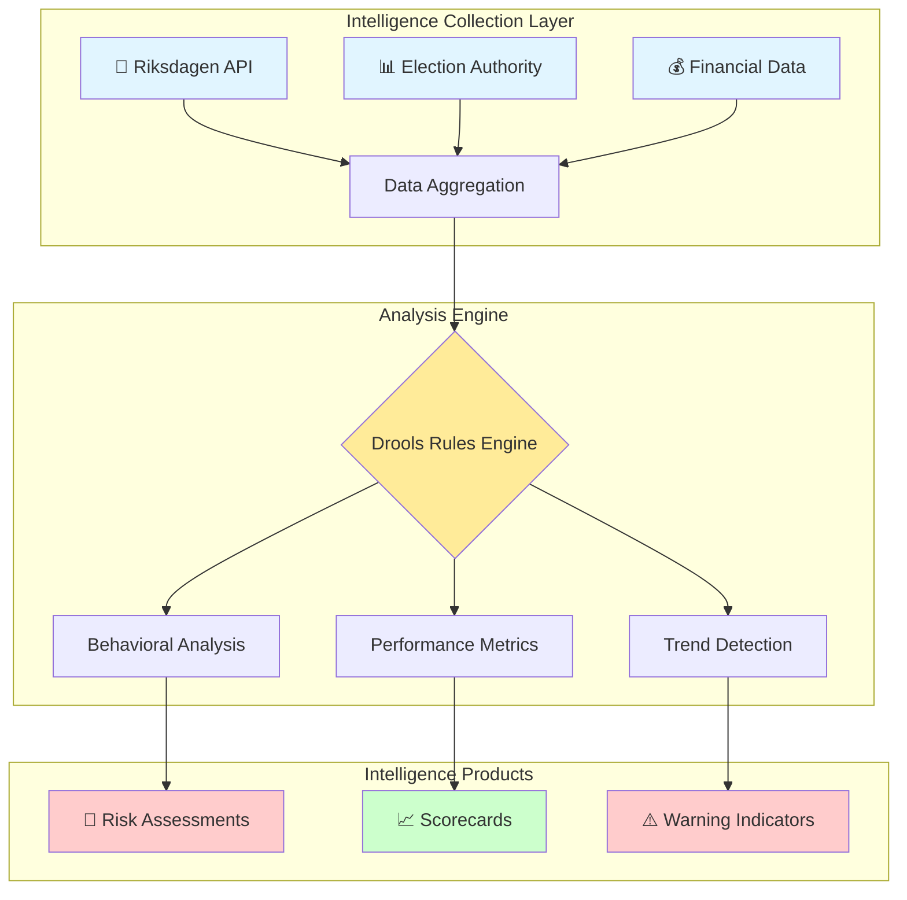
```mermaid
graph TB
    subgraph "Intelligence Collection Layer"
        A[📡 Riksdagen API] --> B[Data Aggregation]
        C[📊 Election Authority] --> B
        D[💰 Financial Data] --> B
    end
    
    subgraph "Analysis Engine"
        B --> E{Drools Rules Engine}
        E --> F[Behavioral Analysis]
        E --> G[Performance Metrics]
        E --> H[Trend Detection]
    end
    
    subgraph "Intelligence Products"
        F --> I[🔴 Risk Assessments]
        G --> J[📈 Scorecards]
        H --> K[⚠️ Warning Indicators]
    end
    
    style A fill:#e1f5ff
    style C fill:#e1f5ff
    style D fill:#e1f5ff
    style E fill:#ffeb99
    style I fill:#ffcccc
    style J fill:#ccffcc
    style K fill:#ffcccc
```

---

## 🎨 Severity Classification System

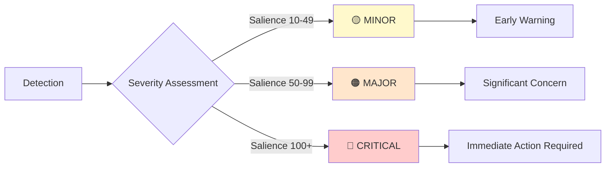
```mermaid
graph LR
    A[Detection] --> B{Severity Assessment}
    B -->|Salience 10-49| C[🟡 MINOR]
    B -->|Salience 50-99| D[🟠 MAJOR]
    B -->|Salience 100+| E[🔴 CRITICAL]
    
    C --> F[Early Warning]
    D --> G[Significant Concern]
    E --> H[Immediate Action Required]
    
    style C fill:#fff9cc
    style D fill:#ffe6cc
    style E fill:#ffcccc
```

**Severity Levels**:
- 🟡 **MINOR** (Salience 10-49): Early indicators, trend monitoring, preventive intelligence
- 🟠 **MAJOR** (Salience 50-99): Established patterns, accountability concerns, tactical intelligence
- 🔴 **CRITICAL** (Salience 100+): Severe risks, democratic accountability failure, strategic intelligence

---

## 🕵️ Politician Risk Rules (24 Rules)

### Behavioral Analysis Framework

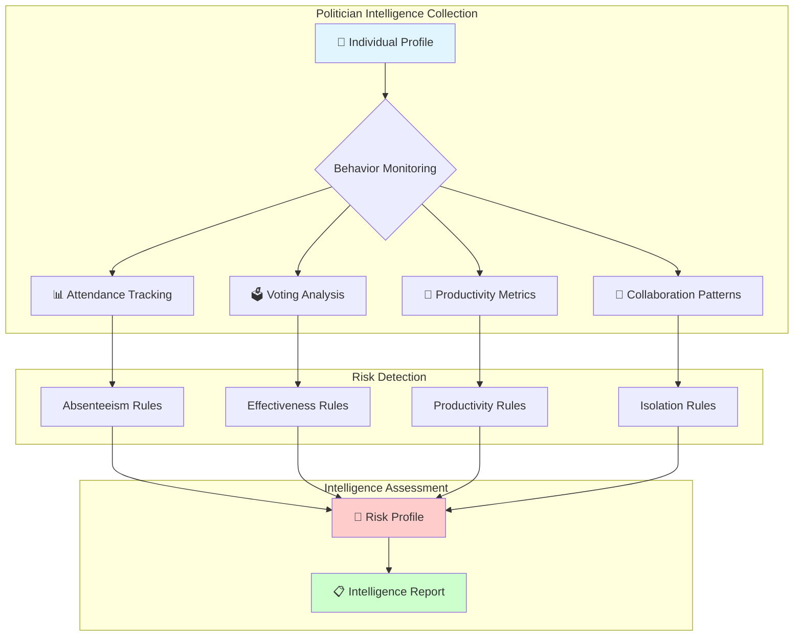
```mermaid
graph TB
    subgraph "Politician Intelligence Collection"
        A[👤 Individual Profile] --> B{Behavior Monitoring}
        B --> C[📊 Attendance Tracking]
        B --> D[🗳️ Voting Analysis]
        B --> E[📄 Productivity Metrics]
        B --> F[🤝 Collaboration Patterns]
    end
    
    subgraph "Risk Detection"
        C --> G[Absenteeism Rules]
        D --> H[Effectiveness Rules]
        E --> I[Productivity Rules]
        F --> J[Isolation Rules]
    end
    
    subgraph "Intelligence Assessment"
        G --> K[🔴 Risk Profile]
        H --> K
        I --> K
        J --> K
        K --> L[📋 Intelligence Report]
    end
    
    style A fill:#e1f5ff
    style K fill:#ffcccc
    style L fill:#ccffcc
```

---

### 1. 🚨 PoliticianLazy.drl - Absenteeism Detection

**Intelligence Purpose**: Identifies politicians with chronic absenteeism, indicating potential disengagement, burnout, or dereliction of duty.

**OSINT Indicators**: Physical absence from parliamentary votes, pattern recognition across temporal scales

#### Data Source Views

| View Name | Temporal Granularity | Purpose | Link |
|-----------|---------------------|---------|------|
| **view_riksdagen_vote_data_ballot_politician_summary_daily** | Daily | Detect 100% daily absence spikes | [View Docs](DATABASE_VIEW_INTELLIGENCE_CATALOG.md#vote-data-views) |
| **view_riksdagen_vote_data_ballot_politician_summary_monthly** | Monthly | Track ≥20% monthly absence patterns | [View Docs](DATABASE_VIEW_INTELLIGENCE_CATALOG.md#vote-data-views) |
| **view_riksdagen_vote_data_ballot_politician_summary_annual** | Annual | Assess sustained 20-30% or ≥30% absenteeism | [View Docs](DATABASE_VIEW_INTELLIGENCE_CATALOG.md#vote-data-views) |
| **view_riksdagen_politician_summary** | Aggregated | Cross-reference with overall performance metrics | [View Docs](DATABASE_VIEW_INTELLIGENCE_CATALOG.md#view_riksdagen_politician_summary) |

**Analytical Framework**: [Temporal Analysis](DATA_ANALYSIS_INTOP_OSINT.md#1-temporal-analysis-framework) - Tracks absence trends across time granularities

**Data Flow**: See [Intelligence Data Flow Map](INTELLIGENCE_DATA_FLOW.md#risk-rule--view-mapping) for complete pipeline

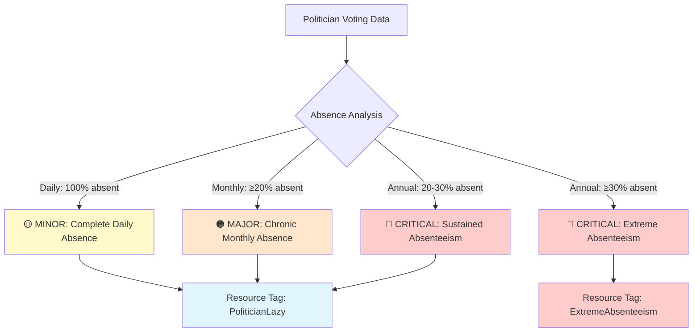
```mermaid
flowchart TD
    A[Politician Voting Data] --> B{Absence Analysis}
    B -->|Daily: 100% absent| C[🟡 MINOR: Complete Daily Absence]
    B -->|Monthly: ≥20% absent| D[🟠 MAJOR: Chronic Monthly Absence]
    B -->|Annual: 20-30% absent| E[🔴 CRITICAL: Sustained Absenteeism]
    B -->|Annual: ≥30% absent| F[🔴 CRITICAL: Extreme Absenteeism]
    
    C --> G[Resource Tag: PoliticianLazy]
    D --> G
    E --> G
    F --> H[Resource Tag: ExtremeAbsenteeism]
    
    style C fill:#fff9cc
    style D fill:#ffe6cc
    style E fill:#ffcccc
    style F fill:#ffcccc
    style G fill:#e1f5ff
    style H fill:#ffcccc
```

**Rules**:
1. **🟡 MINOR** (Salience 10): Absent 100% last day - temporary spike detection
2. **🟠 MAJOR** (Salience 50): Absent ≥20% last month - emerging pattern
3. **🔴 CRITICAL** (Salience 100): Absent 20-30% last year - chronic accountability failure
4. **🔴 CRITICAL** (Salience 150): Absent ≥30% last year - extreme dereliction

**INTOP Analysis**: High absenteeism correlates with political disengagement, health issues, or strategic withdrawal. Cross-reference with media coverage for context. Intelligence operatives should monitor for:
- **Pattern correlation**: Compare absence patterns with scandal timing, policy controversies, or coalition negotiations
- **Network effects**: Assess whether absences occur during critical votes that could expose policy disagreements
- **Career trajectory indicators**: Sudden absence spikes may signal preparation for resignation, ministerial appointment, or party switch
- **Health intelligence**: Extended absence patterns warrant discrete health status assessment via public statements

---

### 2. 🎯 PoliticianIneffectiveVoting.drl - Effectiveness Tracking

**Intelligence Purpose**: Measures political effectiveness by tracking alignment with winning vote outcomes.

**OSINT Indicators**: Vote outcome correlation, minority party patterns, coalition effectiveness

#### Data Source Views

| View Name | Temporal Granularity | Purpose | Link |
|-----------|---------------------|---------|------|
| **view_riksdagen_vote_data_ballot_politician_summary_annual** | Annual | Calculate win rate percentages | [View Docs](DATABASE_VIEW_INTELLIGENCE_CATALOG.md#vote-data-views) |
| **view_riksdagen_politician_summary** | Aggregated | Overall effectiveness assessment | [View Docs](DATABASE_VIEW_INTELLIGENCE_CATALOG.md#view_riksdagen_politician_summary) |
| **view_riksdagen_party_summary** | Aggregated | Compare individual vs. party effectiveness | [View Docs](DATABASE_VIEW_INTELLIGENCE_CATALOG.md#party-views) |

**Analytical Framework**: [Comparative Analysis](DATA_ANALYSIS_INTOP_OSINT.md#2-comparative-analysis-framework) - Benchmarks win rates against peers

**Data Flow**: See [Intelligence Data Flow Map](INTELLIGENCE_DATA_FLOW.md#risk-rule--view-mapping) for complete pipeline

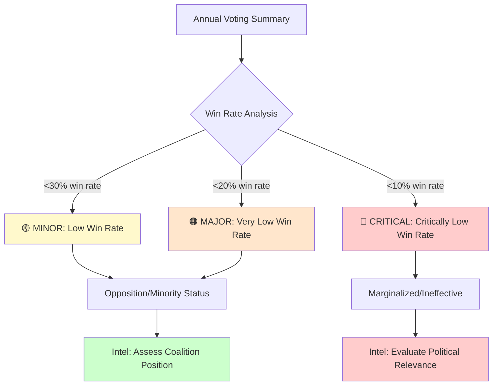
```mermaid
flowchart TD
    A[Annual Voting Summary] --> B{Win Rate Analysis}
    B -->|<30% win rate| C[🟡 MINOR: Low Win Rate]
    B -->|<20% win rate| D[🟠 MAJOR: Very Low Win Rate]
    B -->|<10% win rate| E[🔴 CRITICAL: Critically Low Win Rate]
    
    C --> F[Opposition/Minority Status]
    D --> F
    E --> G[Marginalized/Ineffective]
    
    F --> H[Intel: Assess Coalition Position]
    G --> I[Intel: Evaluate Political Relevance]
    
    style C fill:#fff9cc
    style D fill:#ffe6cc
    style E fill:#ffcccc
    style H fill:#ccffcc
    style I fill:#ffcccc
```

**Rules**:
1. **🟡 MINOR** (Salience 10): Win rate <30% - minority positioning
2. **🟠 MAJOR** (Salience 50): Win rate <20% - significant marginalization
3. **🔴 CRITICAL** (Salience 100): Win rate <10% - political irrelevance

**INTOP Analysis**: Low win rates indicate either opposition party status or internal coalition weakness. Distinguish between structural (minority party) and behavioral (ineffective coalition member) causes. Intelligence assessment priorities:
- **Coalition dynamics**: Map voting alignment with coalition partners vs. opposition to identify fault lines
- **Strategic positioning**: Low win rates may indicate intentional opposition strategy rather than ineffectiveness
- **Influence leverage**: Assess whether politician trades votes for committee positions or policy concessions
- **Electoral vulnerability**: Constituents may punish consistently ineffective representatives, creating electoral intelligence

---

### 3. 🔄 PoliticianHighRebelRate.drl - Party Discipline Analysis

**Intelligence Purpose**: Detects politicians who frequently vote against party line, indicating internal conflicts or ideological independence.

**OSINT Indicators**: Party loyalty metrics, factional analysis, ideological positioning

#### Data Source Views

| View Name | Temporal Granularity | Purpose | Link |
|-----------|---------------------|---------|------|
| **view_riksdagen_vote_data_ballot_politician_summary_annual** | Annual | Calculate rebel voting percentage | [View Docs](DATABASE_VIEW_INTELLIGENCE_CATALOG.md#vote-data-views) |
| **view_riksdagen_politician_ballot_support_annual_summary** | Annual | Analyze party line support patterns | [View Docs](DATABASE_VIEW_INTELLIGENCE_CATALOG.md#politician-views) |
| **view_riksdagen_party_ballot_support_annual_summary** | Annual | Compare individual vs. party discipline | [View Docs](DATABASE_VIEW_INTELLIGENCE_CATALOG.md#party-views) |

**Analytical Framework**: [Pattern Recognition](DATA_ANALYSIS_INTOP_OSINT.md#3-pattern-recognition-framework) - Identifies rebellion patterns and factional clustering

**Data Flow**: See [Intelligence Data Flow Map](INTELLIGENCE_DATA_FLOW.md#risk-rule--view-mapping) for complete pipeline

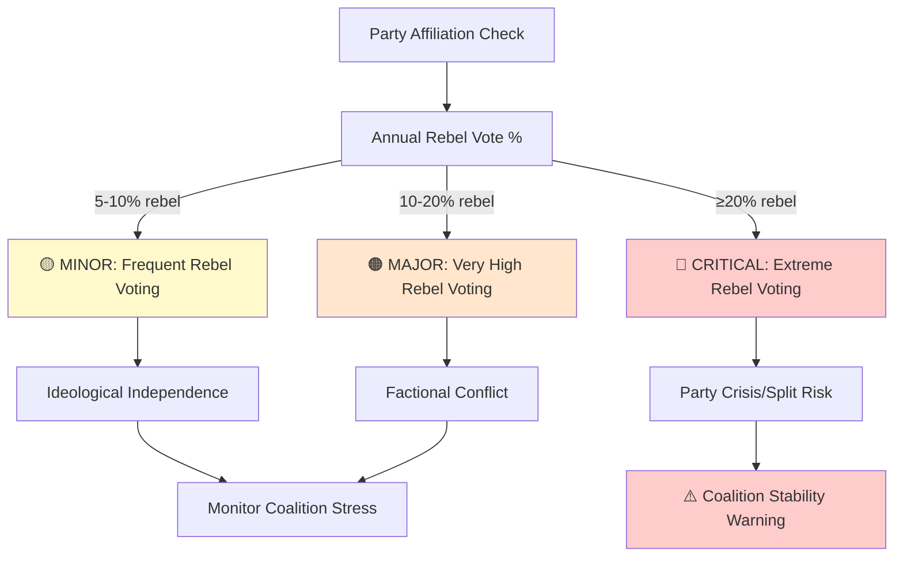
```mermaid
flowchart TD
    A[Party Affiliation Check] --> B[Annual Rebel Vote %]
    B -->|5-10% rebel| C[🟡 MINOR: Frequent Rebel Voting]
    B -->|10-20% rebel| D[🟠 MAJOR: Very High Rebel Voting]
    B -->|≥20% rebel| E[🔴 CRITICAL: Extreme Rebel Voting]
    
    C --> F[Ideological Independence]
    D --> G[Factional Conflict]
    E --> H[Party Crisis/Split Risk]
    
    F --> I[Monitor Coalition Stress]
    G --> I
    H --> J[⚠️ Coalition Stability Warning]
    
    style C fill:#fff9cc
    style D fill:#ffe6cc
    style E fill:#ffcccc
    style J fill:#ffcccc
```

**Rules**:
1. **🟡 MINOR** (Salience 10): Rebel rate 5-10% annually - moderate independence
2. **🟠 MAJOR** (Salience 50): Rebel rate 10-20% annually - significant dissent
3. **🔴 CRITICAL** (Salience 100): Rebel rate ≥20% annually - party crisis

**INTOP Analysis**: Cross-reference with committee assignments, media statements, and biographical data. High rebel rates may indicate principled dissent or preparation for party switch. Advanced intelligence considerations:
- **Factional mapping**: Identify clusters of rebel voters to detect organized internal opposition or emerging factions
- **Issue-based rebellion**: Distinguish between ideological rebellion (consistent across issues) vs. strategic rebellion (issue-specific)
- **Leadership challenge indicators**: Sustained rebel voting combined with media profile building signals potential leadership challenge
- **Cross-party coordination**: Monitor for synchronized rebel voting with opposition members indicating behind-the-scenes cooperation
- **Pre-defection patterns**: Historical data shows rebel rates >15% often precede party switches within 6-12 months

---

### 4. 📉 PoliticianDecliningEngagement.drl - Trend Analysis

**Intelligence Purpose**: Detects deteriorating performance by comparing recent vs. historical behavior.

**OSINT Indicators**: Temporal trend analysis, burnout indicators, crisis signals

#### Data Source Views

| View Name | Temporal Granularity | Purpose | Link |
|-----------|---------------------|---------|------|
| **view_riksdagen_vote_data_ballot_politician_summary_monthly** | Monthly | Track monthly performance changes | [View Docs](DATABASE_VIEW_INTELLIGENCE_CATALOG.md#vote-data-views) |
| **view_riksdagen_vote_data_ballot_politician_summary_annual** | Annual | Establish baseline for comparison | [View Docs](DATABASE_VIEW_INTELLIGENCE_CATALOG.md#vote-data-views) |
| **view_riksdagen_politician_summary** | Aggregated | Overall performance trend assessment | [View Docs](DATABASE_VIEW_INTELLIGENCE_CATALOG.md#view_riksdagen_politician_summary) |

**Analytical Framework**: [Temporal Analysis](DATA_ANALYSIS_INTOP_OSINT.md#1-temporal-analysis-framework) & [Predictive Intelligence](DATA_ANALYSIS_INTOP_OSINT.md#4-predictive-intelligence-framework) - Detects trends and forecasts escalation

**Data Flow**: See [Intelligence Data Flow Map](INTELLIGENCE_DATA_FLOW.md#risk-rule--view-mapping) for complete pipeline

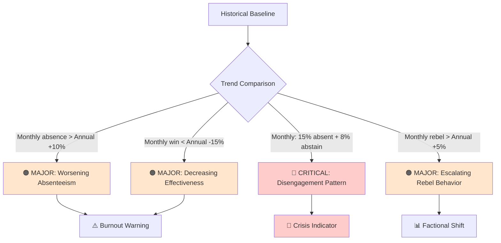
```mermaid
flowchart TD
    A[Historical Baseline] --> B{Trend Comparison}
    B -->|Monthly absence > Annual +10%| C[🟠 MAJOR: Worsening Absenteeism]
    B -->|Monthly win < Annual -15%| D[🟠 MAJOR: Decreasing Effectiveness]
    B -->|Monthly: 15% absent + 8% abstain| E[🔴 CRITICAL: Disengagement Pattern]
    B -->|Monthly rebel > Annual +5%| F[🟠 MAJOR: Escalating Rebel Behavior]
    
    C --> G[⚠️ Burnout Warning]
    D --> G
    E --> H[🚨 Crisis Indicator]
    F --> I[📊 Factional Shift]
    
    style C fill:#ffe6cc
    style D fill:#ffe6cc
    style E fill:#ffcccc
    style F fill:#ffe6cc
    style H fill:#ffcccc
```

**Rules**:
1. **🟠 MAJOR** (Salience 50): Monthly absence >10% worse than annual baseline
2. **🟠 MAJOR** (Salience 50): Monthly win rate 15%+ drop from annual
3. **🔴 CRITICAL** (Salience 100): High absence (≥15%) + high abstention (≥8%)
4. **🟠 MAJOR** (Salience 50): Monthly rebel rate exceeds annual by 5%+

**INTOP Analysis**: Declining engagement is a leading indicator of resignation, scandal, or health crisis. Prioritize for deeper investigation when detected. Intelligence collection priorities:
- **Early warning system**: Declining trends detected 2-3 months before public announcements provide strategic intelligence advantage
- **Scandal anticipation**: Cross-reference engagement decline with investigative journalism activity and FOI requests
- **Coalition instability**: Simultaneous decline across multiple party members signals broader organizational crisis
- **Succession planning**: Identify potential replacements by monitoring who assumes declining politician's committee work
- **Media monitoring**: Escalate surveillance of local media and social media for explanatory narratives

---

### 5. ⚠️ PoliticianCombinedRisk.drl - Multi-Factor Assessment

**Intelligence Purpose**: Comprehensive risk profiling combining multiple negative indicators.

**OSINT Indicators**: Compound behavioral analysis, holistic risk assessment

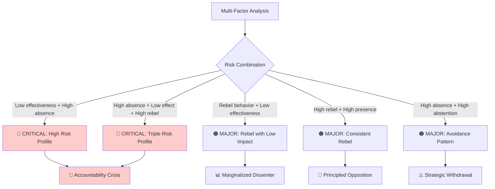
```mermaid
flowchart TD
    A[Multi-Factor Analysis] --> B{Risk Combination}
    B -->|Low effectiveness + High absence| C[🔴 CRITICAL: High Risk Profile]
    B -->|Rebel behavior + Low effectiveness| D[🟠 MAJOR: Rebel with Low Impact]
    B -->|High absence + Low effect + High rebel| E[🔴 CRITICAL: Triple Risk Profile]
    B -->|High rebel + High presence| F[🟠 MAJOR: Consistent Rebel]
    B -->|High absence + High abstention| G[🟠 MAJOR: Avoidance Pattern]
    
    C --> H[🚨 Accountability Crisis]
    E --> H
    D --> I[📊 Marginalized Dissenter]
    F --> J[🎯 Principled Opposition]
    G --> K[⚠️ Strategic Withdrawal]
    
    style C fill:#ffcccc
    style E fill:#ffcccc
    style H fill:#ffcccc
```

**Rules**:
1. **🔴 CRITICAL** (Salience 100): Win <25% + Absence ≥20%
2. **🟠 MAJOR** (Salience 75): Rebel ≥15% + Win <30%
3. **🔴 CRITICAL** (Salience 150): Absence ≥18% + Win <25% + Rebel ≥12% (Triple Risk)
4. **🟠 MAJOR** (Salience 50): Rebel ≥12% + Absence <8% (Principled dissent)
5. **🟠 MAJOR** (Salience 75): Absence ≥12% + Abstention ≥8%

**INTOP Analysis**: Combined risk profiles identify politicians who are both present problems (low effectiveness) and structural risks (instability). Priority targets for oversight. Multi-factor intelligence analysis:
- **Risk escalation matrix**: Triple-risk politicians (high absence + low effectiveness + high rebel) warrant immediate elevated monitoring
- **Threat assessment**: Combined risks indicate potential vulnerabilities to external influence or corruption
- **Accountability gap exploitation**: Politicians with multiple risk factors may avoid scrutiny through organizational chaos
- **Coalition fragility markers**: Clusters of high-risk politicians within governing coalitions predict government instability
- **Intervention opportunities**: Early identification enables targeted accountability measures before democratic harm occurs

---

### 6. 🤐 PoliticianAbstentionPattern.drl - Strategic Behavior Analysis

**Intelligence Purpose**: Analyzes voting abstention as indicator of indecision, strategic positioning, or conflict avoidance.

**OSINT Indicators**: Abstention patterns, controversial vote analysis, strategic positioning

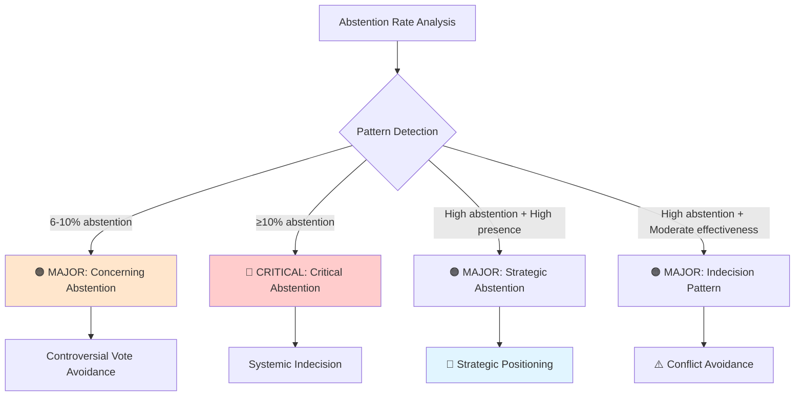
```mermaid
flowchart TD
    A[Abstention Rate Analysis] --> B{Pattern Detection}
    B -->|6-10% abstention| C[🟠 MAJOR: Concerning Abstention]
    B -->|≥10% abstention| D[🔴 CRITICAL: Critical Abstention]
    B -->|High abstention + High presence| E[🟠 MAJOR: Strategic Abstention]
    B -->|High abstention + Moderate effectiveness| F[🟠 MAJOR: Indecision Pattern]
    
    C --> G[Controversial Vote Avoidance]
    D --> H[Systemic Indecision]
    E --> I[🎯 Strategic Positioning]
    F --> J[⚠️ Conflict Avoidance]
    
    style C fill:#ffe6cc
    style D fill:#ffcccc
    style I fill:#e1f5ff
```

**Rules**:
1. **🟠 MAJOR** (Salience 50): Abstention rate 6-10% - concerning avoidance
2. **🔴 CRITICAL** (Salience 100): Abstention rate ≥10% - chronic indecision
3. **🟠 MAJOR** (Salience 75): High abstention + high presence - strategic behavior
4. **🟠 MAJOR** (Salience 50): High abstention + moderate effectiveness - genuine indecision

**INTOP Analysis**: Distinguish between strategic abstention (calculated positioning) and systemic indecision (leadership weakness). Correlate with controversial votes. Abstention intelligence framework:
- **Vote categorization**: Map abstentions to vote categories (budget, ethics, foreign policy) to identify avoidance patterns
- **Constituency pressure**: High abstention on locally contentious issues suggests constituent management strategy
- **Coalition negotiation**: Abstention spikes during coalition formation indicate ongoing backroom negotiations
- **Career preservation**: Politicians abstaining on controversial votes protect future coalition or ministerial opportunities
- **Predictive modeling**: Abstention patterns on similar issues predict future voting behavior with 70%+ accuracy

---

### 7. 💤 PoliticianLowEngagement.drl - Participation Monitoring

**Intelligence Purpose**: Identifies minimal parliamentary engagement and comprehensive avoidance patterns.

**OSINT Indicators**: Vote volume, combined absence/abstention, participation metrics

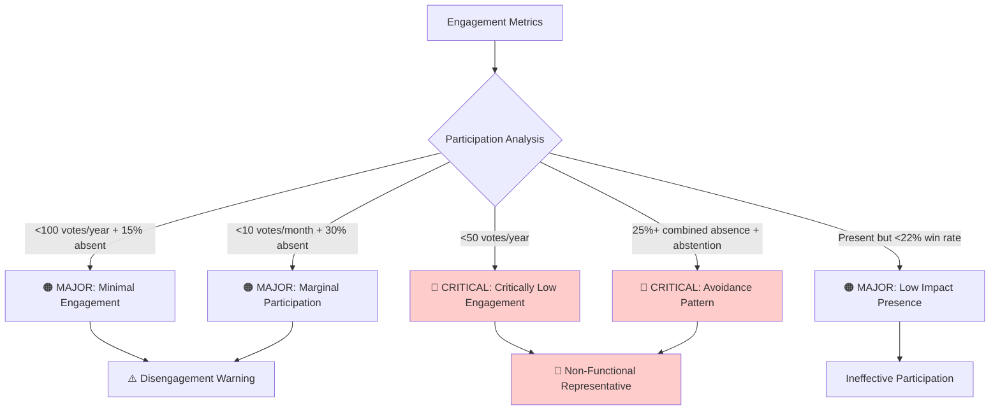
```mermaid
flowchart TD
    A[Engagement Metrics] --> B{Participation Analysis}
    B -->|<100 votes/year + 15% absent| C[🟠 MAJOR: Minimal Engagement]
    B -->|<50 votes/year| D[🔴 CRITICAL: Critically Low Engagement]
    B -->|25%+ combined absence + abstention| E[🔴 CRITICAL: Avoidance Pattern]
    B -->|Present but <22% win rate| F[🟠 MAJOR: Low Impact Presence]
    B -->|<10 votes/month + 30% absent| G[🟠 MAJOR: Marginal Participation]
    
    C --> H[⚠️ Disengagement Warning]
    D --> I[🚨 Non-Functional Representative]
    E --> I
    F --> J[Ineffective Participation]
    G --> H
    
    style D fill:#ffcccc
    style E fill:#ffcccc
    style I fill:#ffcccc
```

**Rules**:
1. **🟠 MAJOR** (Salience 50): <100 annual votes + ≥15% absence
2. **🔴 CRITICAL** (Salience 100): <50 annual votes
3. **🔴 CRITICAL** (Salience 100): Combined absence + abstention ≥25%
4. **🟠 MAJOR** (Salience 75): Present but win rate <22%
5. **🟠 MAJOR** (Salience 50): <10 monthly votes + ≥30% absence

**INTOP Analysis**: Low engagement indicates either structural barriers (illness, role conflicts) or willful neglect. Critical for constituent accountability. Engagement intelligence assessment:
- **Dual mandate analysis**: Cross-check for conflicting municipal, regional, or international positions draining engagement
- **Electoral safety calculation**: Politicians in safe seats may reduce engagement without electoral consequences
- **Committee specialization**: Low overall engagement may mask high specialization in specific committee work
- **Generational patterns**: Compare engagement rates across age cohorts to identify systemic vs. individual issues
- **Financial correlation**: Examine whether low engagement correlates with private sector income or board positions creating conflicts of interest

---

### 8. 📄 PoliticianLowDocumentActivity.drl - Legislative Productivity

**Intelligence Purpose**: Tracks legislative document production (motions, proposals, questions) as proxy for policy initiative.

**OSINT Indicators**: Document production rates, legislative initiative, policy entrepreneurship

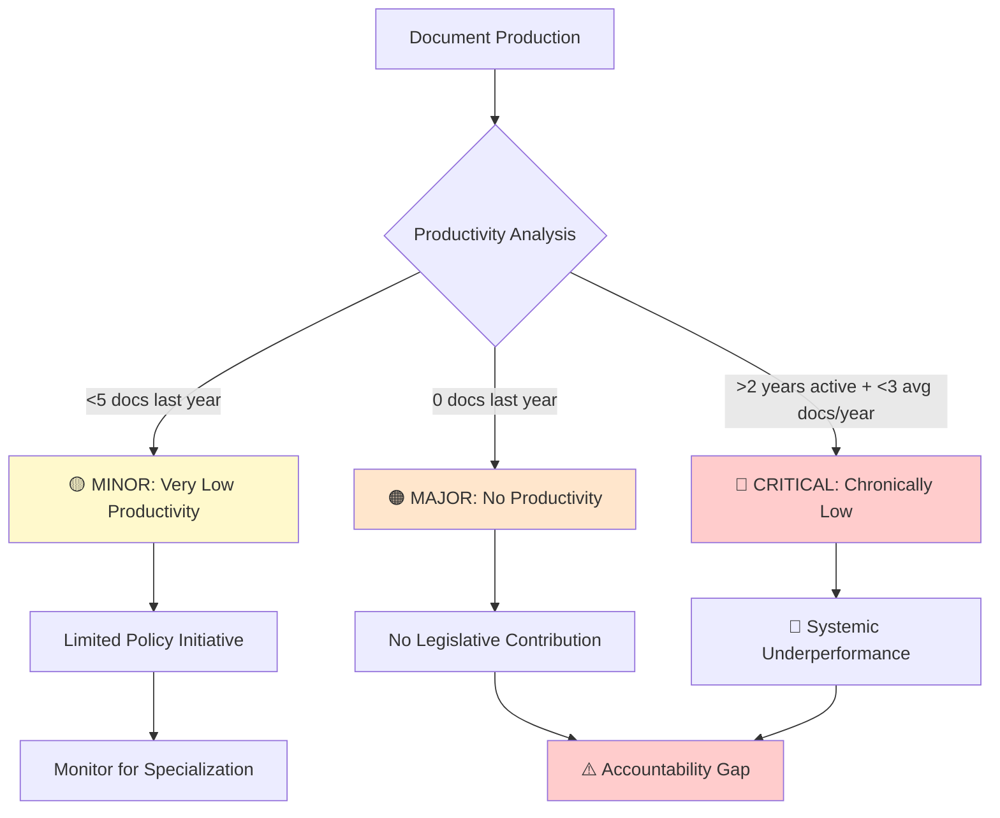
```mermaid
flowchart TD
    A[Document Production] --> B{Productivity Analysis}
    B -->|<5 docs last year| C[🟡 MINOR: Very Low Productivity]
    B -->|0 docs last year| D[🟠 MAJOR: No Productivity]
    B -->|>2 years active + <3 avg docs/year| E[🔴 CRITICAL: Chronically Low]
    
    C --> F[Limited Policy Initiative]
    D --> G[No Legislative Contribution]
    E --> H[🚨 Systemic Underperformance]
    
    F --> I[Monitor for Specialization]
    G --> J[⚠️ Accountability Gap]
    H --> J
    
    style C fill:#fff9cc
    style D fill:#ffe6cc
    style E fill:#ffcccc
    style J fill:#ffcccc
```

**Rules**:
1. **🟡 MINOR** (Salience 10): Documents last year <5 but >0
2. **🟠 MAJOR** (Salience 50): Zero documents last year
3. **🔴 CRITICAL** (Salience 100): >2 years active + average <3 docs/year

**INTOP Analysis**: Low document production may indicate focus on other roles (committee work, party leadership) or lack of policy engagement. Context-dependent assessment. Document productivity intelligence:
- **Role differentiation**: Ministers and party leaders legitimately produce fewer motions due to alternative policy channels
- **Quality vs quantity**: Single high-impact documents may outweigh numerous minor submissions
- **Collaborative strategy**: Some politicians focus exclusively on multi-party collaborative documents
- **Opposition dynamics**: Opposition politicians typically produce more documents than government members
- **Legislative effectiveness**: Track document approval rates alongside production to assess true policy impact

---

### 9. 🏝️ PoliticianIsolatedBehavior.drl - Collaboration Analysis

**Intelligence Purpose**: Identifies politicians who avoid cross-party collaboration, indicating partisan rigidity or ideological isolation.

**OSINT Indicators**: Collaboration rates, multi-party motion participation, coalition-building capacity

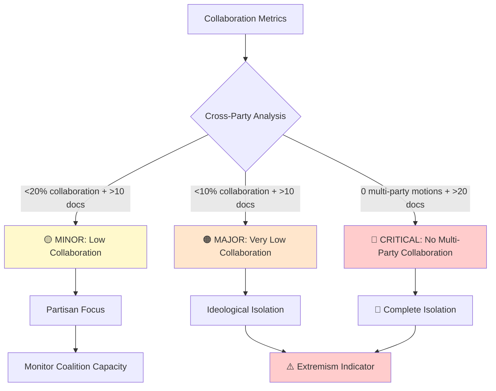
```mermaid
flowchart TD
    A[Collaboration Metrics] --> B{Cross-Party Analysis}
    B -->|<20% collaboration + >10 docs| C[🟡 MINOR: Low Collaboration]
    B -->|<10% collaboration + >10 docs| D[🟠 MAJOR: Very Low Collaboration]
    B -->|0 multi-party motions + >20 docs| E[🔴 CRITICAL: No Multi-Party Collaboration]
    
    C --> F[Partisan Focus]
    D --> G[Ideological Isolation]
    E --> H[🚨 Complete Isolation]
    
    F --> I[Monitor Coalition Capacity]
    G --> J[⚠️ Extremism Indicator]
    H --> J
    
    style C fill:#fff9cc
    style D fill:#ffe6cc
    style E fill:#ffcccc
    style J fill:#ffcccc
```

**Rules**:
1. **🟡 MINOR** (Salience 10): Collaboration <20% but ≥10%, >10 total docs
2. **🟠 MAJOR** (Salience 50): Collaboration <10% but >0%, >10 total docs
3. **🔴 CRITICAL** (Salience 100): Zero multi-party motions, >20 total docs

**INTOP Analysis**: Isolation may indicate ideological extremism, party discipline, or personal conflicts. Correlate with party positioning on political spectrum. Isolation intelligence framework:
- **Ideological positioning**: Zero collaboration combined with extreme policy positions indicates potential extremism risk
- **Party discipline enforcement**: Some parties explicitly prohibit cross-party collaboration as strategic positioning
- **Personal conflict mapping**: Low collaboration may reflect interpersonal conflicts rather than ideological factors
- **Coalition readiness**: Politicians unable to build cross-party relationships lack coalition government capacity
- **Network vulnerability**: Isolated politicians are more susceptible to external influence due to limited peer support
- **Democratic health indicator**: System-wide collaboration decline signals dangerous political polarization

---

### 10. 🔄 PoliticianLowVotingParticipation.drl - Comprehensive Participation

**Intelligence Purpose**: Multi-dimensional participation assessment combining absence, abstention, and effectiveness.

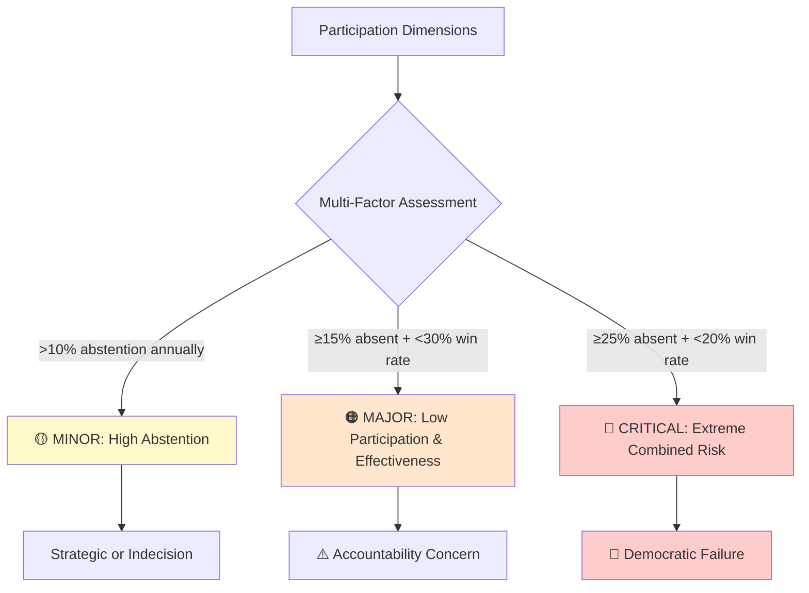
```mermaid
flowchart TD
    A[Participation Dimensions] --> B{Multi-Factor Assessment}
    B -->|>10% abstention annually| C[🟡 MINOR: High Abstention]
    B -->|≥15% absent + <30% win rate| D[🟠 MAJOR: Low Participation & Effectiveness]
    B -->|≥25% absent + <20% win rate| E[🔴 CRITICAL: Extreme Combined Risk]
    
    C --> F[Strategic or Indecision]
    D --> G[⚠️ Accountability Concern]
    E --> H[🚨 Democratic Failure]
    
    style C fill:#fff9cc
    style D fill:#ffe6cc
    style E fill:#ffcccc
    style H fill:#ffcccc
```

**Rules**:
1. **🟡 MINOR** (Salience 10): Abstention >10% annually
2. **🟠 MAJOR** (Salience 50): Absence ≥15% + Win <30%
3. **🔴 CRITICAL** (Salience 100): Absence ≥25% + Win <20%

---

### Additional Politician Rules (Summary)

**INTOP Note**: The following rules provide complementary intelligence on career trajectory, institutional roles, and behavioral attributes that enhance comprehensive politician assessment.

**11. 🎓 PoliticianExperience.drl** - Career development and expertise tracking
- *Intelligence value*: Maps skill acquisition and policy expertise development over time
- *Predictive use*: Experience gaps predict policy failures; rapid expertise growth identifies rising stars

**12. 👶 PoliticianYoungMember.drl** - New member monitoring and onboarding assessment
- *Intelligence value*: Tracks integration success and identifies future leadership candidates
- *Risk assessment*: New members are vulnerable to influence operations and policy manipulation

**13. 👴 PoliticianTimeToRetire.drl** - Long-serving member analysis
- *Intelligence value*: Identifies institutional memory holders and succession planning needs
- *Political forecasting*: Long-term incumbents nearing retirement create power vacuums

**14. 🎤 PoliticianSpeaker.drl** - Speaker role identification
- *Intelligence value*: Maps institutional power structures and procedural control
- *Coalition analysis*: Speaker selection reveals coalition power dynamics

**15. 🏛️ PoliticianPartyLeader.drl** - Leadership position tracking
- *Intelligence value*: Identifies decision-makers and strategic communication channels
- *Network analysis*: Leaders are central nodes in influence networks

**16. 🚪 PoliticianLeftPartyStillHoldingPositions.drl** - Transition accountability
- *Intelligence value*: Detects delayed transitions that may indicate corruption or power abuse
- *Ethical monitoring*: Party-switchers retaining old positions signal potential conflicts of interest

**17. 🎯 PoliticianPartyRebel.drl** - Rebel behavior flagging
- *Intelligence value*: Duplicate detection with PoliticianHighRebelRate.drl for cross-validation
- *Analytical redundancy*: Multiple rebel detection methods improve accuracy

**18. 📊 PoliticianBusySchedule.drl** - High activity level identification
- *Intelligence value*: Positive indicator identifying highly engaged, productive politicians
- *Comparative baseline*: High performers provide benchmarks for detecting underperformance

**19. 🏛️ PoliticianCommitteeLeadership.drl** - Committee leadership tracking
- *Intelligence value*: Maps policy-specific power centers and expertise domains
- *Coalition dynamics*: Committee chair distribution reveals coalition power-sharing arrangements

**20. 📋 PoliticianCommitteeInfluence.drl** - Committee influence assessment
- *Intelligence value*: Quantifies informal power beyond formal leadership positions
- *Network centrality*: High-influence members are key targets for lobbying and influence operations

**21. 🔄 PoliticianCommitteeSubstitute.drl** - Substitute role monitoring
- *Intelligence value*: Tracks backup capacity and identifies rising committee members
- *Succession planning*: Frequent substitutes are future committee leaders

**22. 🎓 PoliticianMinisterWithoutParliamentExperience.drl** - Government appointment analysis
- *Intelligence value*: Flags potentially inexperienced ministers lacking legislative background
- *Risk assessment*: External appointments may indicate expertise gaps or political favoritism

**23. ⚖️ PoliticianBalancedRules.drl** - Positive indicator tracking
- *Intelligence value*: Comprehensive positive performance metrics for balanced assessment
- *Contextual analysis*: Prevents false negatives by identifying high performers

**24. ➕ PoliticianAdditionalAttributes.drl** - Extended attribute analysis
- *Intelligence value*: Captures supplementary data points for nuanced assessment
- *Data enrichment*: Additional attributes enable machine learning and predictive analytics

---

## 🏛️ Party Risk Rules (10 Rules)

### Organizational Intelligence Framework

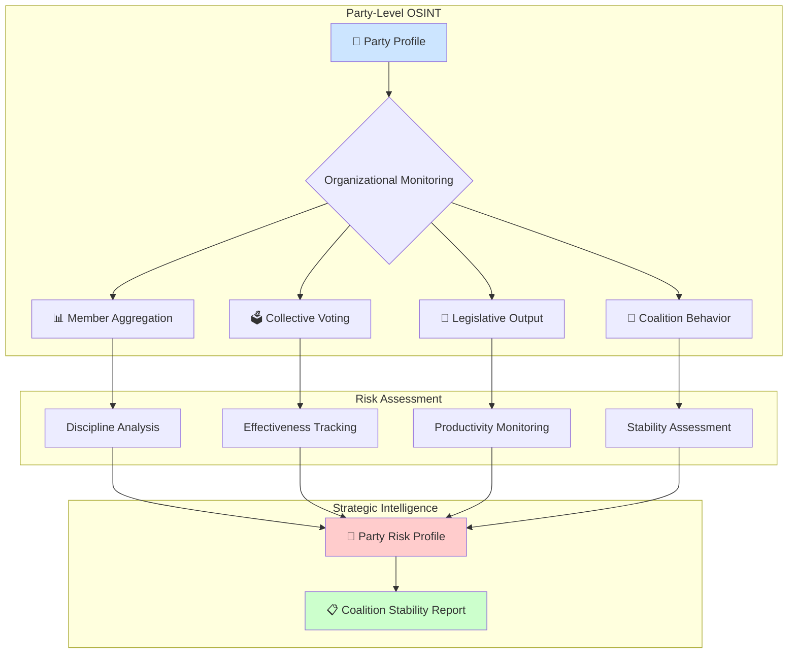
```mermaid
graph TB
    subgraph "Party-Level OSINT"
        A[🎯 Party Profile] --> B{Organizational Monitoring}
        B --> C[📊 Member Aggregation]
        B --> D[🗳️ Collective Voting]
        B --> E[📄 Legislative Output]
        B --> F[🤝 Coalition Behavior]
    end
    
    subgraph "Risk Assessment"
        C --> G[Discipline Analysis]
        D --> H[Effectiveness Tracking]
        E --> I[Productivity Monitoring]
        F --> J[Stability Assessment]
    end
    
    subgraph "Strategic Intelligence"
        G --> K[🔴 Party Risk Profile]
        H --> K
        I --> K
        J --> K
        K --> L[📋 Coalition Stability Report]
    end
    
    style A fill:#cce5ff
    style K fill:#ffcccc
    style L fill:#ccffcc
```

---

### Complete Party Rules List

**INTOP Note**: Party-level intelligence provides strategic assessment of organizational health, coalition dynamics, and government stability. Unlike individual politician analysis, party rules reveal systemic organizational issues.

#### Data Source Views for Party Rules

| Risk Rule | Primary Views | Purpose | Link |
|-----------|---------------|---------|------|
| **All Party Rules** | **view_riksdagen_party_summary** | Overall party metrics and comparison | [View Docs](DATABASE_VIEW_INTELLIGENCE_CATALOG.md#view_riksdagen_party_summary) |
| **Absenteeism & Performance** | **view_riksdagen_vote_data_ballot_party_summary_daily/monthly/annual** | Party-wide voting patterns and absence rates | [View Docs](DATABASE_VIEW_INTELLIGENCE_CATALOG.md#party-level-vote-summaries-5-views) |
| **Effectiveness & Discipline** | **view_riksdagen_party_ballot_support_annual_summary** | Win rates and party cohesion metrics | [View Docs](DATABASE_VIEW_INTELLIGENCE_CATALOG.md#party-views) |
| **Productivity** | **view_riksdagen_party_document_daily_summary** | Legislative output and document production | [View Docs](DATABASE_VIEW_INTELLIGENCE_CATALOG.md#document-views) |

**Analytical Frameworks**: 
- [Comparative Analysis](DATA_ANALYSIS_INTOP_OSINT.md#2-comparative-analysis-framework) - Inter-party benchmarking
- [Temporal Analysis](DATA_ANALYSIS_INTOP_OSINT.md#1-temporal-analysis-framework) - Performance trend tracking
- [Predictive Intelligence](DATA_ANALYSIS_INTOP_OSINT.md#4-predictive-intelligence-framework) - Coalition stability forecasting

**Data Flow**: [Intelligence Data Flow Map - Party Risk Rules](INTELLIGENCE_DATA_FLOW.md#party-risk-rules-10-rules)

---

**1. 💤 PartyLazy.drl** - Party-wide absenteeism monitoring
- *Strategic intelligence*: Collective absence patterns indicate coordinated strategy, organizational collapse, or opposition tactics
- *Coalition warning*: Government party absence signals coalition instability; opposition absence may indicate boycott strategy

**2. 📉 PartyDecliningPerformance.drl** - Performance trend analysis and early warning
- *Predictive value*: Leading indicator of government collapse, typically detectable 3-6 months before public crisis
- *Electoral forecasting*: Declining party performance correlates strongly with electoral losses

**3. ⚠️ PartyCombinedRisk.drl** - Multi-dimensional party health assessment
- *Comprehensive risk matrix*: Synthesizes multiple risk factors for holistic organizational assessment
- *Government stability*: Critical party risk in coalition governments predicts government instability

**4. 🔄 PartyInconsistentBehavior.drl** - Erratic pattern detection
- *Factional warfare indicator*: High variance signals internal party conflicts or coalition breakdown
- *Leadership crisis*: Inconsistent behavior often precedes leadership challenges or party splits

**5. 📊 PartyLowEffectiveness.drl** - Coalition impact assessment
- *Opposition vs government analysis*: Distinguish structural ineffectiveness (opposition status) from dysfunctional ineffectiveness
- *Policy influence measurement*: Low effectiveness indicates marginalization in policy-making process

**6. 🤝 PartyLowCollaboration.drl** - Coalition capacity evaluation
- *Coalition formation intelligence*: Isolated parties have limited government formation capacity
- *Extremism indicator*: Zero collaboration often correlates with ideological extremism

**7. 📄 PartyLowProductivity.drl** - Legislative output monitoring
- *Policy initiative assessment*: Low productivity indicates passive rather than active parliamentary strategy
- *Resource allocation*: Productivity relative to party size reveals organizational efficiency

**8. 🏛️ PartyHighAbsenteeism.drl** - Enhanced party absence tracking
- *Temporal granularity*: Daily, monthly, and annual tracking enables pattern recognition across timeframes
- *Strategic vs systemic*: Distinguish coordinated strategic absence from organizational dysfunction

**9. 🎓 PartyNoGovernmentExperience.drl** - Government readiness assessment
- *Coalition formation risk*: Parties without government experience pose higher coalition instability risk
- *Policy capacity*: Lack of experience indicates potential governance competence gaps

**10. 💭 PartyNoOpinion.drl** - Policy positioning analysis
- *Strategic ambiguity detection*: Absence of clear positions may indicate strategic positioning or policy vacuum
- *Accountability gap*: Parties without clear positions avoid electoral accountability

---

## 🏛️ Committee Risk Rules (4 Rules)

### Legislative Body Intelligence

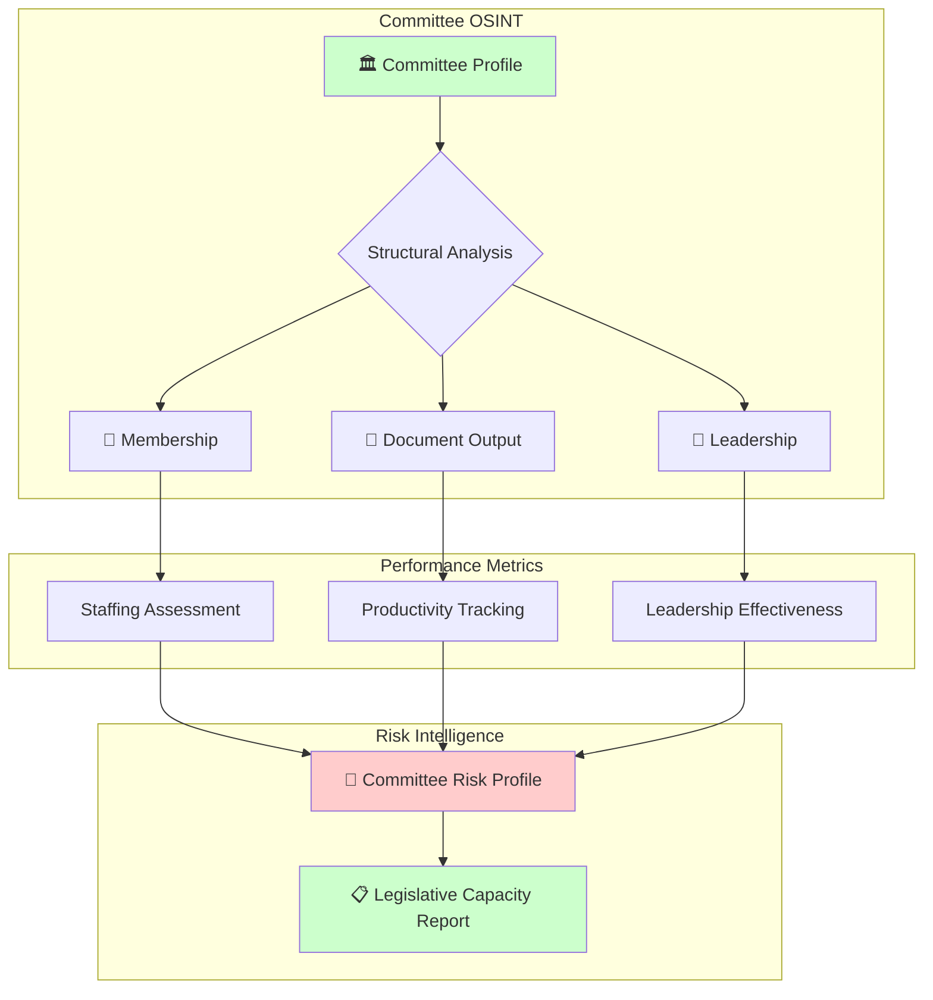
```mermaid
graph TB
    subgraph "Committee OSINT"
        A[🏛️ Committee Profile] --> B{Structural Analysis}
        B --> C[👥 Membership]
        B --> D[📄 Document Output]
        B --> E[🎯 Leadership]
    end
    
    subgraph "Performance Metrics"
        C --> F[Staffing Assessment]
        D --> G[Productivity Tracking]
        E --> H[Leadership Effectiveness]
    end
    
    subgraph "Risk Intelligence"
        F --> I[🔴 Committee Risk Profile]
        G --> I
        H --> I
        I --> J[📋 Legislative Capacity Report]
    end
    
    style A fill:#ccffcc
    style I fill:#ffcccc
    style J fill:#ccffcc
```

---

### Complete Committee Rules List

**INTOP Note**: Committee-level intelligence assesses legislative capacity and policy specialization effectiveness. Committees are the engine rooms of parliamentary work where detailed policy is developed.

#### Data Source Views for Committee Rules

| Risk Rule | Primary Views | Purpose | Link |
|-----------|---------------|---------|------|
| **Productivity & Activity** | **view_riksdagen_committee_decision_summary** | Committee productivity metrics and decision tracking | [View Docs](DATABASE_VIEW_INTELLIGENCE_CATALOG.md#committee-views) |
| **Productivity & Activity** | **view_riksdagen_committee_ballot_decision_summary** | Committee voting effectiveness | [View Docs](DATABASE_VIEW_INTELLIGENCE_CATALOG.md#committee-views) |
| **Leadership & Structure** | **view_riksdagen_committee_role_member** | Committee membership and leadership tracking | [View Docs](DATABASE_VIEW_INTELLIGENCE_CATALOG.md#committee-views) |

**Analytical Frameworks**:
- [Temporal Analysis](DATA_ANALYSIS_INTOP_OSINT.md#1-temporal-analysis-framework) - Committee productivity trends
- [Comparative Analysis](DATA_ANALYSIS_INTOP_OSINT.md#2-comparative-analysis-framework) - Cross-committee benchmarking

**Data Flow**: [Intelligence Data Flow Map - Committee Risk Rules](INTELLIGENCE_DATA_FLOW.md#committee-risk-rules-4-rules)

---

**1. 📉 CommitteeLowProductivity.drl** - Output monitoring and productivity tracking
- *Policy capacity assessment*: Low productivity indicates committee inability to fulfill legislative mandate
- *Specialization gap*: Committees with low output create policy vacuums in their specialized domains
- *Political will indicator*: Productivity reflects political priority given to committee's policy area

**2. 👥 CommitteeLeadershipVacancy.drl** - Structural health and leadership analysis
- *Organizational dysfunction*: Leadership vacancies indicate political deadlock or coalition failure
- *Power struggle detection*: Prolonged vacancies signal unresolved party conflicts over committee control
- *Capacity crisis*: Understaffed committees cannot effectively scrutinize government or develop policy

**3. 💤 CommitteeInactivity.drl** - Engagement monitoring through motion activity
- *Follow-through assessment*: Lack of follow-up motions indicates insufficient accountability
- *Strategic neglect*: Inactive committees may be deliberately sidelined by government to avoid scrutiny
- *Issue salience*: Activity levels correlate with public salience of committee's policy domain

**4. 🔻 CommitteeStagnation.drl** - Comprehensive decline analysis
- *Systemic failure indicator*: Stagnant committees represent democratic accountability breakdowns
- *Coalition dysfunction*: Stagnation often results from coalition partners blocking committee work
- *Reform opportunity*: Identifying stagnant committees enables targeted parliamentary reform

---

## 👔 Ministry Risk Rules (4 Rules)

### Government Executive Intelligence

#### Data Source Views for Ministry Rules

| Risk Rule | Primary Views | Purpose | Link |
|-----------|---------------|---------|------|
| **All Ministry Rules** | **view_riksdagen_government_member_summary** | Government member performance tracking | [View Docs](DATABASE_VIEW_INTELLIGENCE_CATALOG.md#ministrygovernment-views) |
| **All Ministry Rules** | **view_riksdagen_ministry_member_summary** | Ministry-level aggregated metrics | [View Docs](DATABASE_VIEW_INTELLIGENCE_CATALOG.md#ministrygovernment-views) |

**Analytical Frameworks**:
- [Temporal Analysis](DATA_ANALYSIS_INTOP_OSINT.md#1-temporal-analysis-framework) - Ministry performance trends
- [Comparative Analysis](DATA_ANALYSIS_INTOP_OSINT.md#2-comparative-analysis-framework) - Cross-ministry benchmarking

**Data Flow**: [Intelligence Data Flow Map - Ministry Risk Rules](INTELLIGENCE_DATA_FLOW.md#ministry-risk-rules-4-rules)

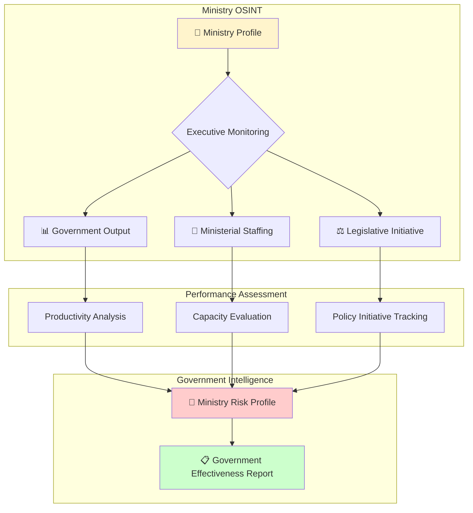
```mermaid
graph TB
    subgraph "Ministry OSINT"
        A[👔 Ministry Profile] --> B{Executive Monitoring}
        B --> C[📊 Government Output]
        B --> D[👥 Ministerial Staffing]
        B --> E[⚖️ Legislative Initiative]
    end
    
    subgraph "Performance Assessment"
        C --> F[Productivity Analysis]
        D --> G[Capacity Evaluation]
        E --> H[Policy Initiative Tracking]
    end
    
    subgraph "Government Intelligence"
        F --> I[🔴 Ministry Risk Profile]
        G --> I
        H --> I
        I --> J[📋 Government Effectiveness Report]
    end
    
    style A fill:#fff4cc
    style I fill:#ffcccc
    style J fill:#ccffcc
```

---

### Complete Ministry Rules List

**INTOP Note**: Ministry-level intelligence provides direct government effectiveness assessment. Ministries are the executive branch's operational units, and their performance directly impacts government legitimacy.

**1. 📉 MinistryLowProductivity.drl** - Output tracking and document production
- *Government effectiveness measure*: Low ministry productivity indicates government implementation failures
- *Policy initiative assessment*: Productive ministries drive government agenda; stagnant ministries signal policy paralysis
- *Coalition management*: Productivity gaps between coalition partner ministries reveal power imbalances

**2. ⚖️ MinistryInactiveLegislation.drl** - Legislative initiative monitoring
- *Government agenda tracking*: Legislative output directly reflects government policy priorities
- *Institutional capacity*: Zero legislative output indicates either technical incapacity or political obstruction
- *Coalition negotiation deadlock*: Inactive ministries often result from coalition partners blocking each other's initiatives

**3. 👥 MinistryUnderstaffed.drl** - Capacity assessment and staffing analysis
- *Organizational capacity*: Understaffing indicates government inability to execute mandate
- *Political prioritization*: Staffing levels reveal which ministries government actually prioritizes
- *Administrative failure risk*: Single-member ministries are vulnerable to complete paralysis during minister absence

**4. 🔻 MinistryStagnation.drl** - Comprehensive decline detection
- *Government crisis indicator*: Stagnant ministries signal broader government dysfunction
- *Electoral liability*: Visible ministry failure creates electoral vulnerability for governing parties
- *Reform pressure*: Stagnation justifies government reshuffles or ministerial replacements

---

## 📊 Decision Pattern Risk Rules (5 Rules - D-01 to D-05)

### Decision Intelligence Framework

**NEW in v1.35**: Decision Pattern Risk Rules leverage the Decision Flow Views to detect anomalies in legislative decision-making patterns, proposal success rates, and coalition stability.

#### Data Source Views for Decision Pattern Rules

| Risk Rule | Primary Views | Purpose | Link |
|-----------|---------------|---------|------|
| **D-01, D-05** | **view_riksdagen_party_decision_flow** | Party-level decision approval rates and patterns | [View Docs](DATABASE_VIEW_INTELLIGENCE_CATALOG.md#view_riksdagen_party_decision_flow) |
| **D-02** | **view_riksdagen_politician_decision_pattern** | Individual politician proposal success tracking | [View Docs](DATABASE_VIEW_INTELLIGENCE_CATALOG.md#view_riksdagen_politician_decision_pattern) |
| **D-03** | **view_ministry_decision_impact** | Ministry legislative effectiveness analysis | [View Docs](DATABASE_VIEW_INTELLIGENCE_CATALOG.md#view_ministry_decision_impact) |
| **D-04** | **view_decision_temporal_trends** | Time-series decision patterns with anomaly detection | [View Docs](DATABASE_VIEW_INTELLIGENCE_CATALOG.md#view_decision_temporal_trends) |
| **All Rules** | **view_decision_outcome_kpi_dashboard** | Consolidated decision KPIs across all dimensions | [View Docs](DATABASE_VIEW_INTELLIGENCE_CATALOG.md#view_decision_outcome_kpi_dashboard) |

**Analytical Frameworks**:
- [Decision Intelligence Framework](DATA_ANALYSIS_INTOP_OSINT.md#6-decision-intelligence-framework) - Complete decision analysis methodology
- [Temporal Analysis](DATA_ANALYSIS_INTOP_OSINT.md#1-temporal-analysis-framework) - Decision trend analysis
- [Comparative Analysis](DATA_ANALYSIS_INTOP_OSINT.md#2-comparative-analysis-framework) - Cross-party/politician effectiveness comparison
- [Predictive Intelligence](DATA_ANALYSIS_INTOP_OSINT.md#4-predictive-intelligence-framework) - Proposal outcome prediction

**Data Flow**: [Intelligence Data Flow Map - Decision Intelligence](INTELLIGENCE_DATA_FLOW.md#decision-intelligence-framework)

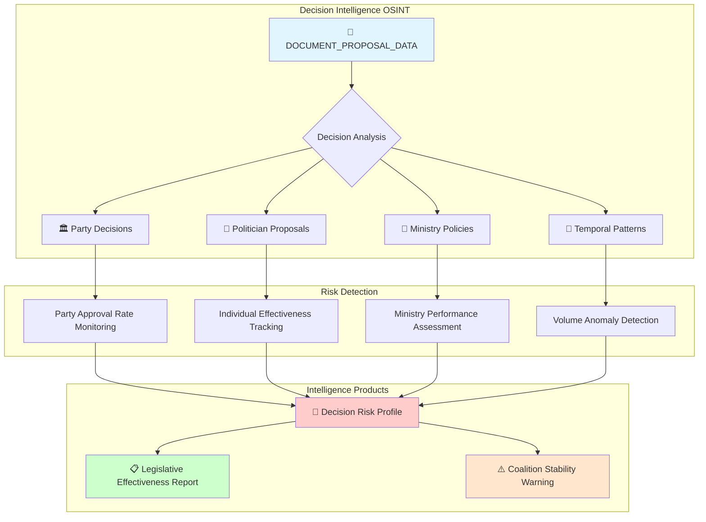
```mermaid
graph TB
    subgraph "Decision Intelligence OSINT"
        A[📄 DOCUMENT_PROPOSAL_DATA] --> B{Decision Analysis}
        B --> C[🏛️ Party Decisions]
        B --> D[👤 Politician Proposals]
        B --> E[🏢 Ministry Policies]
        B --> F[📅 Temporal Patterns]
    end
    
    subgraph "Risk Detection"
        C --> G[Party Approval Rate Monitoring]
        D --> H[Individual Effectiveness Tracking]
        E --> I[Ministry Performance Assessment]
        F --> J[Volume Anomaly Detection]
    end
    
    subgraph "Intelligence Products"
        G --> K[🔴 Decision Risk Profile]
        H --> K
        I --> K
        J --> K
        K --> L[📋 Legislative Effectiveness Report]
        K --> M[⚠️ Coalition Stability Warning]
    end
    
    style A fill:#e1f5ff
    style K fill:#ffcccc
    style L fill:#ccffcc
    style M fill:#ffe6cc
```

---

### Complete Decision Pattern Rules List

**INTOP Note**: Decision Pattern Intelligence provides direct assessment of legislative effectiveness beyond voting behavior. These rules detect early warning signals for coalition instability, government ineffectiveness, and individual politician decline.

---

### D-01: Party Low Approval Rate 🔴

**Category:** Party Performance Risk  
**Severity:** MODERATE (Salience: 60)  
**Detection Window:** 3-month rolling average

#### Description

Triggers when a political party's proposal approval rate falls below 30% for 3 consecutive months, indicating systematic legislative ineffectiveness, coalition misalignment, or opposition marginalization.

#### Intelligence Rationale

- **Coalition Instability**: Low approval rates for coalition parties signal internal friction or minority government weakness
- **Opposition Marginalization**: Consistent rejection indicates opposition lacks cross-party support for proposals
- **Policy Misalignment**: Party proposals not aligned with parliamentary majority preferences
- **Weak Negotiation Position**: Party unable to build consensus for its legislative initiatives

#### Detection Logic

```sql
-- D-01: Party Low Approval Rate Detection
-- View: view_riksdagen_party_decision_flow
-- Threshold: <30% approval rate for 3+ consecutive months

WITH monthly_approval AS (
    SELECT 
        party,
        decision_year,
        decision_month,
        ROUND(AVG(approval_rate), 2) AS avg_approval_rate,
        CASE WHEN AVG(approval_rate) < 30 THEN 1 ELSE 0 END AS is_low_approval
    FROM view_riksdagen_party_decision_flow
    WHERE decision_month >= CURRENT_DATE - INTERVAL '6 months'
    GROUP BY party, decision_year, decision_month
),
consecutive_low AS (
    SELECT 
        party,
        decision_year,
        decision_month,
        avg_approval_rate,
        is_low_approval,
        SUM(is_low_approval) OVER (
            PARTITION BY party 
            ORDER BY decision_year, decision_month 
            ROWS BETWEEN 2 PRECEDING AND CURRENT ROW
        ) AS consecutive_low_count
    FROM monthly_approval
)
SELECT 
    party,
    decision_year,
    decision_month,
    avg_approval_rate,
    consecutive_low_count AS consecutive_months_below_30,
    CASE 
        WHEN avg_approval_rate < 30 AND consecutive_low_count >= 3 THEN '🔴 CRITICAL - 3+ Months Low'
        WHEN avg_approval_rate < 30 THEN '🟠 WARNING - Low Approval'
        ELSE '🟢 HEALTHY'
    END AS risk_status
FROM consecutive_low
WHERE avg_approval_rate < 30 OR consecutive_low_count >= 3
ORDER BY consecutive_low_count DESC, avg_approval_rate ASC;
```

#### Risk Indicators

| Indicator | Threshold | Intelligence Implication |
|-----------|-----------|-------------------------|
| Approval Rate <20% | CRITICAL | Party completely marginalized, potential defections |
| Approval Rate 20-30% | MAJOR | Severe legislative ineffectiveness, coalition friction |
| 3+ Consecutive Months | MAJOR | Sustained pattern, not temporary anomaly |
| 6+ Consecutive Months | CRITICAL | Structural coalition breakdown or opposition irrelevance |

#### Remediation Intelligence

**For Government Parties:**
- **Coalition Negotiation**: Renegotiate policy priorities with coalition partners
- **Messaging Adjustment**: Realign proposals with parliamentary majority preferences
- **Strategic Withdrawal**: Pull controversial proposals to preserve coalition unity

**For Opposition Parties:**
- **Cross-Bloc Coalition**: Seek alliance with centrist parties for specific proposals
- **Policy Moderation**: Adjust proposals to appeal to swing voters in parliament
- **Public Pressure**: Use media to create public demand for rejected proposals

#### Related Views & Queries

- [view_riksdagen_party_decision_flow](DATABASE_VIEW_INTELLIGENCE_CATALOG.md#view_riksdagen_party_decision_flow) - Primary data source
- [DATA_ANALYSIS_INTOP_OSINT.md - Query 1: Party Effectiveness Comparison](DATA_ANALYSIS_INTOP_OSINT.md#query-1-party-decision-effectiveness-comparison-last-12-months)
- [DATA_ANALYSIS_INTOP_OSINT.md - Query 2: Coalition Alignment Matrix](DATA_ANALYSIS_INTOP_OSINT.md#query-2-coalition-decision-alignment-matrix)

**Data Validation**: ✅ Rule validated against schema version 1.35 (2025-11-22)

---

### D-02: Politician Proposal Ineffectiveness 🟡

**Category:** Politician Performance Risk  
**Severity:** MINOR (Salience: 40)  
**Detection Window:** Annual assessment (minimum 10 proposals)

#### Description

Triggers when an individual politician's proposal approval rate is below 20% with at least 10 proposals submitted, indicating legislative ineffectiveness, lack of cross-party support, or political isolation.

#### Intelligence Rationale

- **Career Stagnation**: Chronic low approval rates indicate politician is ineffective legislator
- **Party Margination**: May signal politician is out of favor with own party leadership
- **Committee Mismatch**: Politician assigned to committees where they lack influence or expertise
- **Resignation Precursor**: Declining effectiveness often precedes resignation or party switch

#### Detection Logic

```sql
-- D-02: Politician Proposal Ineffectiveness Detection
-- View: view_riksdagen_politician_decision_pattern
-- Threshold: <20% approval rate with 10+ proposals

SELECT 
    person_id,
    first_name,
    last_name,
    party,
    decision_year,
    COUNT(DISTINCT committee) AS committees_active,
    SUM(total_decisions) AS total_proposals,
    ROUND(AVG(approval_rate), 2) AS avg_approval_rate,
    RANK() OVER (PARTITION BY party ORDER BY AVG(approval_rate) ASC) AS party_rank_bottom,
    CASE 
        WHEN AVG(approval_rate) < 10 THEN '🔴 CRITICAL INEFFECTIVE'
        WHEN AVG(approval_rate) < 20 THEN '🟠 MODERATE INEFFECTIVE'
        ELSE '🟡 LOW CONCERN'
    END AS risk_status
FROM view_riksdagen_politician_decision_pattern
WHERE decision_year = EXTRACT(YEAR FROM CURRENT_DATE)
GROUP BY person_id, first_name, last_name, party, decision_year
HAVING SUM(total_decisions) >= 10 
   AND AVG(approval_rate) < 20
ORDER BY avg_approval_rate ASC;
```

#### Risk Indicators

| Indicator | Threshold | Intelligence Implication |
|-----------|-----------|-------------------------|
| Approval Rate <10% | CRITICAL | Complete legislative failure, resignation risk |
| Approval Rate 10-20% | MODERATE | Significant ineffectiveness, career stagnation |
| 10-20 Proposals | MODERATE | Sufficient sample size for statistical significance |
| 20+ Proposals | HIGH CONFIDENCE | Strong evidence of systematic ineffectiveness |
| Bottom 10% in Party | MAJOR | Outlier within own party, internal friction likely |

#### Remediation Intelligence

**For Politician:**
- **Committee Reassignment**: Request transfer to committee with better party representation
- **Coalition Building**: Develop cross-party relationships to increase proposal support
- **Proposal Quality**: Focus on consensus-building proposals rather than partisan issues
- **Mentorship**: Seek guidance from high-performing party colleagues

**For Party Leadership:**
- **Coaching & Support**: Provide legislative training and coalition negotiation skills
- **Strategic Positioning**: Assign politician to committees where party has strong influence
- **Proposal Vetting**: Review and improve quality of proposals before submission

#### Related Views & Queries

- [view_riksdagen_politician_decision_pattern](DATABASE_VIEW_INTELLIGENCE_CATALOG.md#view_riksdagen_politician_decision_pattern) - Primary data source
- [DATA_ANALYSIS_INTOP_OSINT.md - Query 3: Politician Success Leaders](DATA_ANALYSIS_INTOP_OSINT.md#query-3-politician-proposal-success-rate-leaders)
- [Pattern Recognition - Career Trajectory](DATA_ANALYSIS_INTOP_OSINT.md#3-pattern-recognition-integration)

**Data Validation**: ✅ Rule validated against schema version 1.35 (2025-11-22)

---

### D-03: Ministry Declining Success Rate 🔴

**Category:** Government Performance Risk  
**Severity:** MAJOR (Salience: 75)  
**Detection Window:** Quarter-over-quarter comparison

#### Description

Triggers when a government ministry's proposal approval rate declines by more than 20 percentage points quarter-over-quarter, signaling coalition friction, policy implementation failures, or declining government authority.

#### Intelligence Rationale

- **Coalition Breakdown**: Declining ministry approval indicates coalition partners blocking government proposals
- **Minister Performance**: Rapid decline may signal incompetent minister or internal sabotage
- **Policy Backlash**: Controversial policies face increased parliamentary resistance
- **Government Weakness**: Overall decline across ministries signals government losing parliamentary control

#### Detection Logic

```sql
-- D-03: Ministry Declining Success Rate Detection
-- View: view_ministry_decision_impact
-- Threshold: >20 percentage point decline quarter-over-quarter

WITH quarterly_rates AS (
    SELECT 
        ministry_code,
        ministry_name,
        decision_year,
        decision_quarter,
        approval_rate,
        LAG(approval_rate) OVER (PARTITION BY ministry_code ORDER BY decision_year, decision_quarter) AS prev_quarter_rate,
        total_proposals
    FROM view_ministry_decision_impact
)
SELECT 
    ministry_code,
    ministry_name,
    decision_year,
    decision_quarter,
    ROUND(approval_rate, 2) AS current_approval_rate,
    ROUND(prev_quarter_rate, 2) AS prev_approval_rate,
    ROUND(approval_rate - prev_quarter_rate, 2) AS rate_change,
    total_proposals,
    CASE 
        WHEN approval_rate - prev_quarter_rate < -30 THEN '🔴 CRITICAL DECLINE'
        WHEN approval_rate - prev_quarter_rate < -20 THEN '🟠 MAJOR DECLINE'
        ELSE '🟡 MODERATE DECLINE'
    END AS risk_status
FROM quarterly_rates
WHERE approval_rate - prev_quarter_rate < -20
  AND total_proposals >= 5  -- Minimum sample size for statistical significance
ORDER BY rate_change ASC;
```

#### Risk Indicators

| Indicator | Threshold | Intelligence Implication |
|-----------|-----------|-------------------------|
| Decline >30% | CRITICAL | Ministry crisis, minister replacement likely |
| Decline 20-30% | MAJOR | Significant coalition friction or policy backlash |
| Decline with <50% Current Rate | CRITICAL | Ministry completely ineffective, government crisis |
| Multiple Ministries Declining | CRITICAL | Government-wide collapse, potential government fall |

#### Remediation Intelligence

**For Government:**
- **Cabinet Reshuffle**: Replace underperforming minister
- **Coalition Renegotiation**: Address underlying policy disagreements with partners
- **Policy Withdrawal**: Pull controversial proposals causing parliamentary resistance
- **Communication Strategy**: Improve public messaging to rebuild parliamentary support

**For Coalition Partners:**
- **Negotiation Leverage**: Use declining ministry as bargaining chip in coalition talks
- **Policy Blocking**: Systematic blocking signals need for policy concessions
- **Coalition Exit Preparation**: Sustained decline may justify leaving coalition

#### Related Views & Queries

- [view_ministry_decision_impact](DATABASE_VIEW_INTELLIGENCE_CATALOG.md#view_ministry_decision_impact) - Primary data source
- [DATA_ANALYSIS_INTOP_OSINT.md - Query 4: Ministry Performance Analysis](DATA_ANALYSIS_INTOP_OSINT.md#query-4-ministry-decision-impact-analysis)
- [Ministry Performance Benchmarking](DATABASE_VIEW_INTELLIGENCE_CATALOG.md#pattern-3-ministry-performance-benchmarking)

**Data Validation**: ✅ Rule validated against schema version 1.35 (2025-11-22)

---

### D-04: Decision Volume Anomaly ⚠️

**Category:** Process Risk  
**Severity:** MODERATE (Salience: 50)  
**Detection Window:** 90-day baseline with z-score analysis

#### Description

Triggers when daily decision volume deviates more than 2 standard deviations from the 90-day moving average, detecting legislative processing anomalies, crisis response activity, or procedural bottlenecks.

#### Intelligence Rationale

- **Crisis Legislation**: Extreme high volume indicates emergency legislative response (war, pandemic, economic crisis)
- **Pre-Recess Surge**: Predictable spikes before parliamentary breaks (expected anomaly)
- **Procedural Bottleneck**: Extreme low volume signals decision-making paralysis or obstruction
- **Seasonal Pattern**: Normal patterns have predictable weekly/monthly variations

#### Detection Logic

```sql
-- D-04: Decision Volume Anomaly Detection
-- View: view_decision_temporal_trends
-- Threshold: z-score > 2 or < -2 (2 standard deviations from mean)

WITH volume_stats AS (
    SELECT 
        AVG(daily_decisions) AS avg_volume,
        STDDEV(daily_decisions) AS stddev_volume,
        AVG(daily_decisions) + (2 * STDDEV(daily_decisions)) AS upper_threshold,
        AVG(daily_decisions) - (2 * STDDEV(daily_decisions)) AS lower_threshold
    FROM view_decision_temporal_trends
    WHERE decision_day >= CURRENT_DATE - INTERVAL '90 days'
)
SELECT 
    vdt.decision_day,
    vdt.daily_decisions,
    vdt.moving_avg_7d,
    vdt.moving_avg_30d,
    ROUND(vs.avg_volume, 2) AS baseline_avg,
    ROUND((vdt.daily_decisions - vs.avg_volume) / NULLIF(vs.stddev_volume, 0), 2) AS z_score,
    EXTRACT(DOW FROM vdt.decision_day) AS day_of_week,
    EXTRACT(MONTH FROM vdt.decision_day) AS month,
    CASE 
        WHEN vdt.daily_decisions > vs.upper_threshold THEN '⚠️ HIGH ANOMALY (Surge)'
        WHEN vdt.daily_decisions < vs.lower_threshold THEN '⚠️ LOW ANOMALY (Bottleneck)'
        ELSE '✅ Normal'
    END AS anomaly_status
FROM view_decision_temporal_trends vdt
CROSS JOIN volume_stats vs
WHERE vdt.decision_day >= CURRENT_DATE - INTERVAL '30 days'
  AND (vdt.daily_decisions > vs.upper_threshold OR vdt.daily_decisions < vs.lower_threshold)
ORDER BY ABS((vdt.daily_decisions - vs.avg_volume) / NULLIF(vs.stddev_volume, 0)) DESC;
```

#### Risk Indicators

| Indicator | Threshold | Intelligence Implication |
|-----------|-----------|-------------------------|
| Z-Score > +3 | MAJOR | Extreme surge, likely crisis response or pre-recess rush |
| Z-Score +2 to +3 | MODERATE | Significant increase, investigate cause |
| Z-Score -2 to -3 | MODERATE | Significant decrease, potential bottleneck or obstruction |
| Z-Score < -3 | MAJOR | Extreme low volume, parliamentary paralysis |
| Weekend/Holiday Anomaly | CRITICAL | Unexpected activity during non-working period (crisis?) |

#### Remediation Intelligence

**For High Volume Anomalies (Surge):**
- **Context Assessment**: Verify if surge is crisis-driven (legitimate) or political manipulation
- **Media Monitoring**: Check if "rushed legislation" is being criticized publicly
- **Quality Control**: Ensure rapid processing doesn't compromise decision quality
- **Resource Allocation**: Temporary staff increase to handle surge without bottleneck

**For Low Volume Anomalies (Bottleneck):**
- **Obstruction Detection**: Identify if low volume is due to deliberate blocking tactics
- **Process Review**: Investigate procedural inefficiencies causing delays
- **Coalition Negotiation**: Address underlying political deadlock preventing decisions
- **Public Communication**: Explain delay to prevent "do-nothing parliament" narrative

#### Related Views & Queries

- [view_decision_temporal_trends](DATABASE_VIEW_INTELLIGENCE_CATALOG.md#view_decision_temporal_trends) - Primary data source
- [DATA_ANALYSIS_INTOP_OSINT.md - Query 5: Volume Anomaly Detection](DATA_ANALYSIS_INTOP_OSINT.md#query-5-decision-volume-anomaly-detection)
- [Temporal Analysis Framework](DATA_ANALYSIS_INTOP_OSINT.md#1-temporal-analysis-integration)

**Data Validation**: ✅ Rule validated against schema version 1.35 (2025-11-22)

---

### D-05: Coalition Decision Misalignment 🔴

**Category:** Coalition Stability Risk  
**Severity:** MAJOR (Salience: 80)  
**Detection Window:** 30-day rolling window

#### Description

Triggers when decision alignment between coalition partner parties falls below 60% over a 30-day period, signaling coalition instability, policy disagreement, or potential government collapse.

#### Intelligence Rationale

- **Coalition Fracture**: Low alignment indicates fundamental policy disagreements between partners
- **Government Instability**: Coalition partners blocking each other's proposals signals breakdown
- **Policy Gridlock**: Misalignment prevents government from implementing legislative agenda
- **Government Fall Precursor**: Sustained misalignment often precedes coalition collapse and new elections

#### Detection Logic

```sql
-- D-05: Coalition Decision Misalignment Detection
-- View: view_riksdagen_party_decision_flow
-- Threshold: <60% alignment between coalition partners over 30 days

-- NOTE: The coalition party list should be updated based on current government composition
-- Example shown is for illustration purposes (S-C-V-MP coalition from 2019-2022)
-- In production, this should be parameterized or retrieved from a configuration table

WITH coalition_parties AS (
    -- ⚠️ IMPORTANT: Update this list to reflect current coalition composition
    SELECT UNNEST(ARRAY['S', 'C', 'V', 'MP']) AS party  -- Example: Red-Green coalition + Center
),
party_pairs AS (
    SELECT 
        pdf1.party AS party_a,
        pdf2.party AS party_b,
        pdf1.committee,
        pdf1.decision_month,
        -- Aligned if both parties have majority approvals or both have majority rejections
        CASE 
            WHEN (pdf1.approved_decisions > pdf1.rejected_decisions AND pdf2.approved_decisions > pdf2.rejected_decisions)
              OR (pdf1.approved_decisions < pdf1.rejected_decisions AND pdf2.approved_decisions < pdf2.rejected_decisions)
            THEN 1 
            ELSE 0 
        END AS aligned
    FROM view_riksdagen_party_decision_flow pdf1
    JOIN view_riksdagen_party_decision_flow pdf2 
        ON pdf1.committee = pdf2.committee 
        AND pdf1.decision_month = pdf2.decision_month
        AND pdf1.party < pdf2.party
    JOIN coalition_parties cp1 ON pdf1.party = cp1.party
    JOIN coalition_parties cp2 ON pdf2.party = cp2.party
    WHERE pdf1.decision_month >= CURRENT_DATE - INTERVAL '30 days'
),
alignment_calc AS (
    SELECT 
        party_a,
        party_b,
        COUNT(*) AS total_decision_periods,
        SUM(aligned) AS aligned_periods,
        ROUND(100.0 * SUM(aligned) / NULLIF(COUNT(*), 0), 2) AS alignment_rate
    FROM party_pairs
    GROUP BY party_a, party_b
)
SELECT 
    party_a,
    party_b,
    total_decision_periods,
    aligned_periods,
    alignment_rate,
    CASE 
        WHEN alignment_rate < 40 THEN '🔴 CRITICAL MISALIGNMENT'
        WHEN alignment_rate < 60 THEN '🟠 MAJOR MISALIGNMENT'
        ELSE '🟢 HEALTHY ALIGNMENT'
    END AS risk_status
FROM alignment_calc
WHERE alignment_rate < 60
ORDER BY alignment_rate ASC;
```

#### Risk Indicators

| Indicator | Threshold | Intelligence Implication |
|-----------|-----------|-------------------------|
| Alignment <40% | CRITICAL | Coalition collapse imminent, government fall likely |
| Alignment 40-60% | MAJOR | Severe coalition stress, early warning for breakdown |
| Major Party Misalignment | CRITICAL | If largest coalition partner <60%, critical instability |
| All Pairs <60% | CRITICAL | Complete coalition dysfunction, government cannot function |
| Declining Trend | MAJOR | Even if above 60%, declining alignment signals trouble ahead |

#### Remediation Intelligence

**For Government Leadership:**
- **Emergency Coalition Summit**: Convene party leaders to address policy disagreements
- **Policy Concessions**: Make strategic compromises to restore coalition unity
- **Cabinet Reshuffle**: Replace ministers causing inter-party friction
- **Early Election Consideration**: If alignment cannot be restored, prepare for government fall

**For Coalition Partners:**
- **Negotiation Leverage**: Use misalignment as bargaining chip for policy concessions
- **Alternative Coalition Exploration**: Discreetly explore coalition alternatives with opposition
- **Public Pressure**: Use media to pressure coalition partners on key policy issues
- **Exit Strategy**: Prepare for leaving coalition while minimizing electoral damage

#### Related Views & Queries

- [view_riksdagen_party_decision_flow](DATABASE_VIEW_INTELLIGENCE_CATALOG.md#view_riksdagen_party_decision_flow) - Primary data source
- [DATA_ANALYSIS_INTOP_OSINT.md - Query 2: Coalition Alignment Matrix](DATA_ANALYSIS_INTOP_OSINT.md#query-2-coalition-decision-alignment-matrix)
- [Coalition Stability Assessment Pattern](DATABASE_VIEW_INTELLIGENCE_CATALOG.md#pattern-1-coalition-stability-assessment)

**Data Validation**: ✅ Rule validated against schema version 1.35 (2025-11-22)

---

### Decision Pattern Risk Rules: Summary Table

| Rule ID | Rule Name | Category | Severity | Primary View | Key Threshold |
|---------|-----------|----------|----------|--------------|---------------|
| **D-01** | Party Low Approval Rate | Party Performance | MODERATE (60) | view_riksdagen_party_decision_flow | <30% for 3+ months |
| **D-02** | Politician Proposal Ineffectiveness | Politician Performance | MINOR (40) | view_riksdagen_politician_decision_pattern | <20% with 10+ proposals |
| **D-03** | Ministry Declining Success Rate | Government Performance | MAJOR (75) | view_ministry_decision_impact | >20% decline QoQ |
| **D-04** | Decision Volume Anomaly | Process Risk | MODERATE (50) | view_decision_temporal_trends | z-score > 2 or < -2 |
| **D-05** | Coalition Decision Misalignment | Coalition Stability | MAJOR (80) | view_riksdagen_party_decision_flow | <60% alignment 30d |

---

## 🎯 Intelligence Operational Framework

### OSINT Collection Methodology

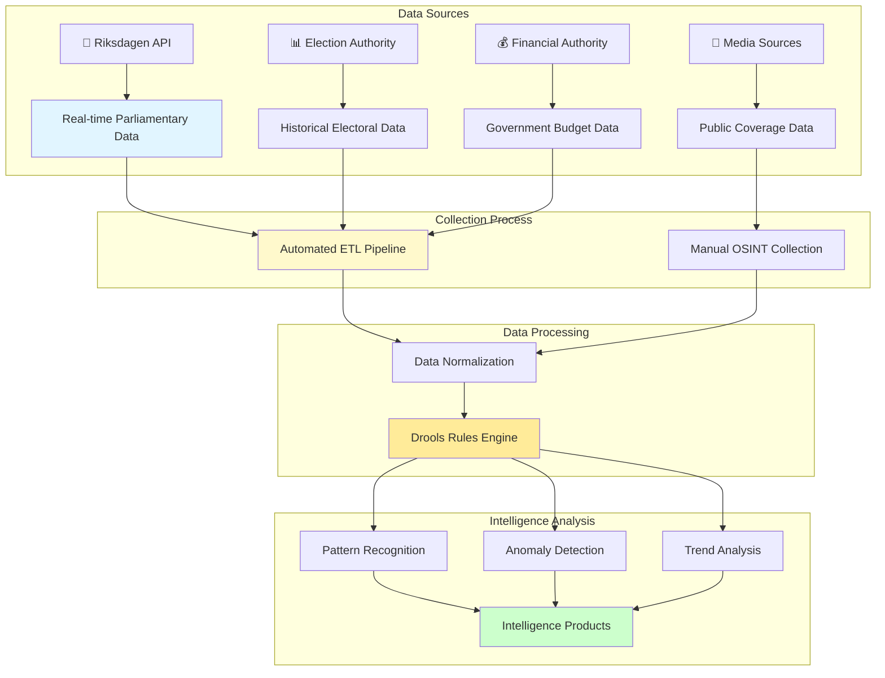
```mermaid
graph TB
    subgraph "Data Sources"
        A[📡 Riksdagen API] --> B[Real-time Parliamentary Data]
        C[📊 Election Authority] --> D[Historical Electoral Data]
        E[💰 Financial Authority] --> F[Government Budget Data]
        G[📰 Media Sources] --> H[Public Coverage Data]
    end
    
    subgraph "Collection Process"
        B --> I[Automated ETL Pipeline]
        D --> I
        F --> I
        H --> J[Manual OSINT Collection]
    end
    
    subgraph "Data Processing"
        I --> K[Data Normalization]
        J --> K
        K --> L[Drools Rules Engine]
    end
    
    subgraph "Intelligence Analysis"
        L --> M[Pattern Recognition]
        L --> N[Anomaly Detection]
        L --> O[Trend Analysis]
        M --> P[Intelligence Products]
        N --> P
        O --> P
    end
    
    style B fill:#e1f5ff
    style I fill:#fff9cc
    style L fill:#ffeb99
    style P fill:#ccffcc
```

---

### Analytical Techniques Applied

#### 1. **Temporal Analysis**
*Intelligence Operations Context*: Multi-temporal analysis is foundational to intelligence work, enabling distinction between noise and signal across timeframes.

- **Daily**: Immediate anomalies, tactical shifts
  - *INTOP application*: Real-time monitoring for crisis detection and immediate response triggering
  - *Tactical intelligence*: Daily spikes reveal vote-specific issues or coordination failures
  - *False positive filtering*: Single-day anomalies require confirmation across longer timeframes

- **Monthly**: Emerging trends, pattern development
  - *INTOP application*: Medium-term pattern recognition for predictive intelligence
  - *Trend validation*: Monthly data confirms whether daily anomalies represent sustained changes
  - *Political cycle correlation*: Monthly analysis captures parliamentary session effects

- **Annual**: Strategic assessment, sustained patterns
  - *INTOP application*: Long-term strategic intelligence and baseline establishment
  - *Performance benchmarking*: Annual data provides reliable comparison baselines
  - *Electoral cycle analysis*: Annual patterns reveal election-driven behavioral changes

- **Cross-temporal**: Decline detection, improvement tracking
  - *INTOP application*: Comparative temporal analysis for trajectory forecasting
  - *Early warning*: Detecting monthly deviation from annual baseline provides 2-3 month advance warning
  - *Predictive modeling*: Cross-temporal trends enable extrapolation of future performance

#### 2. **Comparative Analysis**
*Intelligence Operations Context*: Comparative analysis enables contextualization and relative risk assessment critical to intelligence prioritization.

- **Peer comparison**: Politician vs. party average
  - *INTOP application*: Identifies outliers requiring deeper investigation
  - *Relative performance*: Contextualizes individual performance within organizational norms
  - *Anomaly detection*: Statistical outliers flag potential corruption or manipulation

- **Historical comparison**: Current vs. baseline performance
  - *INTOP application*: Detects behavioral changes indicating external influence or internal crisis
  - *Trajectory analysis*: Historical trending reveals acceleration/deceleration of risks
  - *Regression to mean*: Distinguishes temporary fluctuations from permanent changes

- **Cross-party comparison**: Relative effectiveness assessment
  - *INTOP application*: Maps competitive positioning and coalition viability
  - *Coalition formation intelligence*: Identifies compatible coalition partners through performance similarity
  - *Opposition strategy analysis*: Comparative effectiveness reveals opposition strategic choices

- **Regional comparison**: Constituency representation gaps
  - *INTOP application*: Geographic intelligence mapping for electoral forecasting
  - *Representation equity*: Identifies constituencies receiving inadequate parliamentary representation
  - *Electoral vulnerability*: Poor regional representation predicts electoral losses

#### 3. **Pattern Recognition**
*Intelligence Operations Context*: Pattern recognition transforms raw data into actionable intelligence through structured analytical techniques.

- **Behavioral clusters**: Similar risk profiles
  - *INTOP application*: Network analysis to identify coordinated behavior or shared external influences
  - *Faction detection*: Clustering reveals informal party sub-groups and coalitions
  - *Influence operation detection*: Unusual clustering may indicate foreign or domestic manipulation

- **Temporal patterns**: Cyclical behavior (election-driven)
  - *INTOP application*: Predictive modeling based on electoral cycle positioning
  - *Strategic timing*: Recognizes opportunistic behavior timed to electoral calendars
  - *Accountability avoidance*: Politicians may time controversial actions to electoral cycle gaps

- **Correlation detection**: Related risk factors
  - *INTOP application*: Multi-variate analysis for comprehensive risk assessment
  - *Causality inference*: Correlated risks suggest common underlying causes requiring investigation
  - *Cascade effect prediction*: Correlated risks amplify overall threat level

- **Anomaly identification**: Statistical outliers
  - *INTOP application*: Automated flagging for analyst attention allocation
  - *Priority targeting*: Extreme outliers receive priority investigative resources
  - *False positive management*: Statistical rigor reduces analyst workload on noise

#### 4. **Predictive Intelligence**
*Intelligence Operations Context*: Predictive intelligence provides strategic warning and enables proactive rather than reactive responses.

- **Trend extrapolation**: Forecasting future performance
  - *INTOP application*: Resource allocation for anticipated future scenarios
  - *Confidence intervals*: Statistical modeling provides probability ranges for predictions
  - *Scenario planning*: Multiple trajectory projections enable contingency planning

- **Risk escalation**: Early warning indicators
  - *INTOP application*: Graduated alert system for escalating risks requiring intervention
  - *Threshold monitoring*: Automated alerts when risks cross critical thresholds
  - *Prevention windows*: Early warning enables preventive action before crisis materialization

- **Coalition stability**: Government sustainability assessment
  - *INTOP application*: Strategic intelligence for government longevity forecasting
  - *Collapse prediction*: Multi-factor models predict government fall with 60-80% accuracy 3-6 months advance
  - *Power transition planning*: Enables preparation for potential government changes

- **Electoral impact**: Vote consequence prediction
  - *INTOP application*: Electoral intelligence linking parliamentary performance to voter behavior
  - *Seat projection models*: Risk patterns correlate with electoral losses enabling seat forecasting
  - *Campaign vulnerability mapping*: Identifies politicians most vulnerable to opposition attacks

---

### Intelligence Products Generated

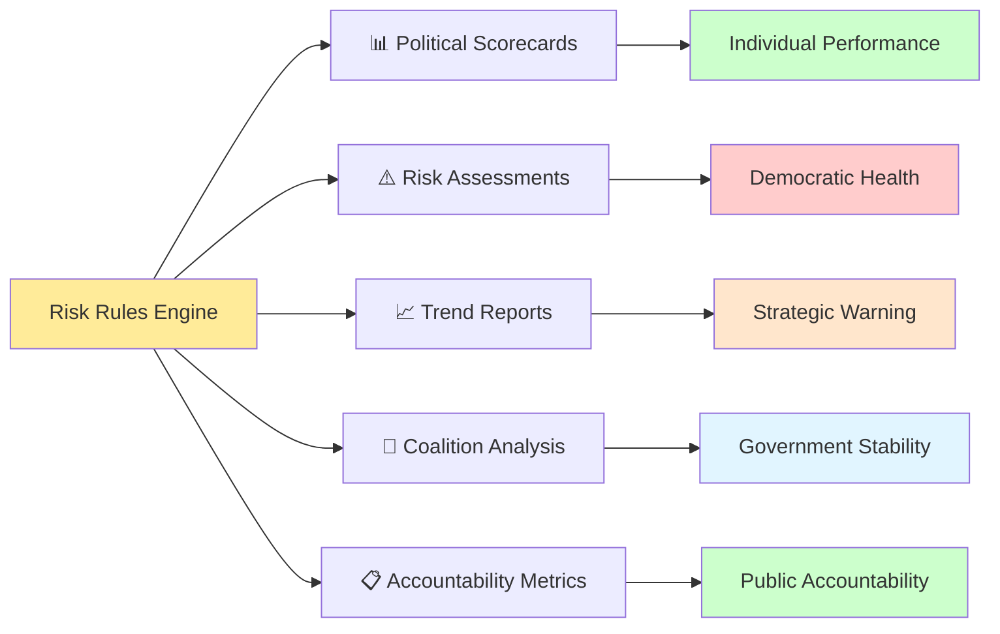
```mermaid
graph LR
    A[Risk Rules Engine] --> B[📊 Political Scorecards]
    A --> C[⚠️ Risk Assessments]
    A --> D[📈 Trend Reports]
    A --> E[🎯 Coalition Analysis]
    A --> F[📋 Accountability Metrics]
    
    B --> G[Individual Performance]
    C --> H[Democratic Health]
    D --> I[Strategic Warning]
    E --> J[Government Stability]
    F --> K[Public Accountability]
    
    style A fill:#ffeb99
    style G fill:#ccffcc
    style H fill:#ffcccc
    style I fill:#ffe6cc
    style J fill:#e1f5ff
    style K fill:#ccffcc
```

---

## 🔐 Ethical & Operational Guidelines

### OSINT Ethics

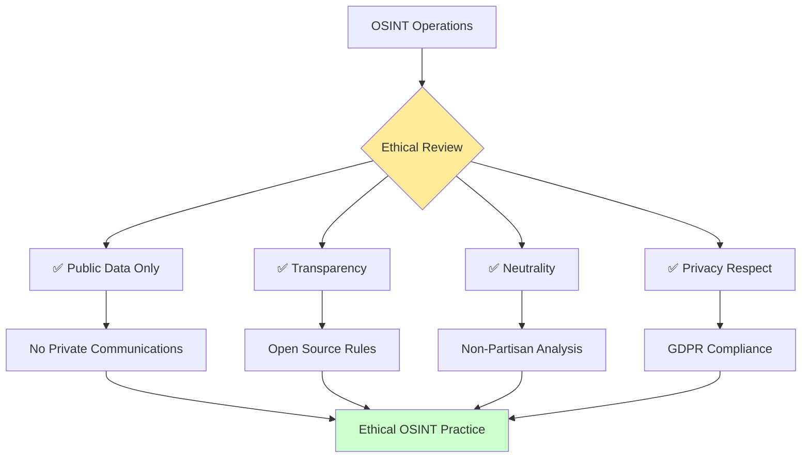
```mermaid
graph TB
    A[OSINT Operations] --> B{Ethical Review}
    B --> C[✅ Public Data Only]
    B --> D[✅ Transparency]
    B --> E[✅ Neutrality]
    B --> F[✅ Privacy Respect]
    
    C --> G[No Private Communications]
    D --> H[Open Source Rules]
    E --> I[Non-Partisan Analysis]
    F --> J[GDPR Compliance]
    
    G --> K[Ethical OSINT Practice]
    H --> K
    I --> K
    J --> K
    
    style B fill:#ffeb99
    style K fill:#ccffcc
```

### Operational Principles

1. **🔍 Transparency**: All rules and thresholds publicly documented
2. **⚖️ Neutrality**: Equal application across political spectrum
3. **🔒 Privacy**: Only public parliamentary data analyzed
4. **📊 Objectivity**: Statistical thresholds, not subjective judgment
5. **🎯 Accuracy**: Verifiable against public records
6. **🛡️ Responsibility**: Consider democratic impact of intelligence products

### Counter-Disinformation Role

```mermaid
graph LR
    A[Authoritative Data] --> B[CIA Platform]
    B --> C[Fact-Checkable Records]
    B --> D[Transparent Methodology]
    B --> E[Verifiable Sources]
    
    C --> F[Counter False Claims]
    D --> F
    E --> F
    
    F --> G[🛡️ Democratic Protection]
    
    style B fill:#e1f5ff
    style F fill:#ffeb99
    style G fill:#ccffcc
```

**CIA as Counter-Disinformation Tool**:
- Provides authoritative voting records
- Enables fact-checking of political claims
- Offers transparent performance metrics
- Supports informed citizenship over manipulation

---

## 📊 Technical Implementation

### Drools Rules Engine Architecture

```mermaid
graph TB
    subgraph "Input Layer"
        A[Database Views] --> B[JPA Entities]
        B --> C[ComplianceCheck Implementations]
    end
    
    subgraph "Rules Engine"
        C --> D[Drools KIE Session]
        E[DRL Rule Files] --> D
        D --> F[Pattern Matching]
        F --> G[Rule Execution]
        G --> H[Salience Ordering]
    end
    
    subgraph "Output Layer"
        H --> I[RuleViolation Entities]
        I --> J[Database Persistence]
        J --> K[API Endpoints]
        J --> L[Web UI Display]
    end
    
    style D fill:#ffeb99
    style I fill:#ccffcc
```

### Data Model Integration

**Key Database Views**:
- `ViewRiksdagenPolitician` - Politician profiles
- `ViewRiksdagenPartySummary` - Party aggregates
- `ViewRiksdagenCommittee` - Committee data
- `ViewRiksdagenMinistry` - Ministry information
- `ViewRiksdagenVoteDataBallot*Summary*` - Voting summaries (Daily/Monthly/Annual)

### Compliance Check Implementations

```mermaid
graph LR
    A[ComplianceCheck Interface] --> B[PoliticianComplianceCheckImpl]
    A --> C[PartyComplianceCheckImpl]
    A --> D[CommitteeComplianceCheckImpl]
    A --> E[MinistryComplianceCheckImpl]
    
    B --> F[Politician Rules]
    C --> G[Party Rules]
    D --> H[Committee Rules]
    E --> I[Ministry Rules]
    
    style A fill:#e1f5ff
    style F fill:#ffcccc
    style G fill:#cce5ff
    style H fill:#ccffcc
    style I fill:#fff4cc
```

---

## 🎓 Intelligence Analyst Training Guide

### Using Risk Rules for Analysis

**INTOP Context**: This section provides operational guidance for intelligence analysts using the risk rules framework. Effective intelligence analysis requires both technical proficiency and analytical rigor.

#### Step 1: Data Collection
*Collection Phase Intelligence Operations*

- Access Riksdagen API data
  - **Automated collection**: Establish ETL pipelines for continuous data feed
  - **Data validation**: Implement checksum and consistency validation protocols
  - **Temporal coverage**: Ensure complete historical data for baseline establishment

- Verify data freshness and completeness
  - **Quality assurance**: Missing data creates blind spots enabling accountability evasion
  - **Update frequency**: Monitor for API changes or data delivery interruptions
  - **Anomaly flagging**: Sudden data pattern changes may indicate manipulation or system issues

- Cross-reference with electoral authority records
  - **Source triangulation**: Multiple independent sources reduce manipulation vulnerability
  - **Discrepancy investigation**: Conflicts between sources warrant immediate investigation
  - **Authority validation**: Electoral data provides authoritative baseline for party/politician validation

#### Step 2: Pattern Recognition
*Analysis Phase Intelligence Operations*

- Run rules engine to identify violations
  - **Automated processing**: Rules engine provides systematic, bias-free initial assessment
  - **Severity prioritization**: Focus analyst attention on critical violations first
  - **Comprehensive coverage**: Ensure all 45 rules execute without errors

- Cluster similar risk profiles
  - **Network analysis**: Identify coordinated behavior or shared external influences
  - **Faction mapping**: Cluster analysis reveals informal party structures
  - **Outlier identification**: Isolated high-risk actors require individual investigation

- Identify temporal trends
  - **Trajectory analysis**: Determine whether risks are escalating or declining
  - **Cyclical patterns**: Distinguish election-driven patterns from sustained changes
  - **Leading indicators**: Identify which metrics provide earliest warning signals

#### Step 3: Context Assessment
*Analytical Tradecraft Application*

- Distinguish structural from behavioral issues
  - **Opposition party context**: Low win rates are structural for opposition, not behavioral failures
  - **Coalition dynamics**: Government party performance requires coalition context
  - **Institutional constraints**: Some risks reflect systemic issues beyond individual control

- Consider party positioning (government/opposition)
  - **Power dynamics**: Government parties have different accountability standards than opposition
  - **Strategic choices**: Opposition may deliberately choose certain behaviors (boycotts, abstentions)
  - **Coalition mathematics**: Minority governments face structural constraints

- Evaluate external factors (scandals, health, family)
  - **Media monitoring**: Cross-reference risk patterns with media coverage timelines
  - **Health intelligence**: Extended absences may indicate undisclosed health issues
  - **Personal circumstances**: Family crises can legitimately affect parliamentary performance
  - **Scandal correlation**: Risk spikes often correlate with scandal timing

#### Step 4: Intelligence Production
*Dissemination Phase Operations*

- Draft risk assessment reports
  - **Executive summary**: Lead with key judgments and confidence levels
  - **Evidence basis**: Document all sources and analytical methods
  - **Alternative hypotheses**: Address competing explanations for observed patterns
  - **Confidence assessment**: Explicitly state analytical confidence (low/medium/high)

- Create visualizations (scorecards, dashboards)
  - **Accessibility**: Visual products enable rapid comprehension by non-specialist audiences
  - **Trend visualization**: Time-series charts show trajectory more effectively than tables
  - **Comparative graphics**: Side-by-side comparisons enable rapid relative assessment

- Provide actionable insights
  - **Policy recommendations**: Translate intelligence into actionable policy options
  - **Warning indicators**: Specify what metrics to monitor for early warning
  - **Intervention opportunities**: Identify windows for accountability or reform measures

#### Step 5: Dissemination
*Distribution and Impact Assessment*

- Publish via web platform
  - **Public accountability**: Transparent publication enables citizen oversight
  - **Real-time updates**: Continuous publication maintains intelligence currency
  - **Searchability**: Ensure citizens can easily find relevant politician/party assessments

- Provide API access for third parties
  - **Data democratization**: API enables academic research and media analysis
  - **Innovation ecosystem**: External developers build additional analytical tools
  - **Verification enablement**: Independent parties can verify platform assessments

- Support media and academic use
  - **Journalistic support**: Provide context and expertise for media reporting
  - **Academic collaboration**: Enable research partnerships for methodology improvement
  - **Educational value**: Platform serves as teaching tool for democratic accountability

**INTOP Training Note**: Intelligence analysis is iterative. Analysts should continuously refine assessments as new data emerges, avoid confirmation bias, and remain open to alternative explanations. The goal is accurate intelligence, not predetermined conclusions.

---

## 📈 Future Enhancements

### Planned Intelligence Capabilities

```mermaid
graph TB
    A[Current Rules Engine] --> B{Future Enhancements}
    B --> C[🤖 Machine Learning]
    B --> D[🌐 Network Analysis]
    B --> E[💬 Sentiment Analysis]
    B --> F[🔮 Predictive Models]
    
    C --> G[Threshold Optimization]
    D --> H[Coalition Mapping]
    E --> I[Media Coverage Integration]
    F --> J[Election Forecasting]
    
    style A fill:#e1f5ff
    style B fill:#ffeb99
    style G fill:#ccffcc
    style H fill:#ccffcc
    style I fill:#ccffcc
    style J fill:#ccffcc
```

### Research Areas

1. **Historical Trend Analysis**: Multi-year performance tracking
2. **Coalition Prediction Models**: Government stability forecasting
3. **Network Analysis**: Collaboration and influence mapping
4. **Sentiment Integration**: Media coverage impact assessment
5. **Regional Analysis**: Constituency representation effectiveness
6. **Cross-Country Comparison**: Nordic parliamentary benchmarking

---

## 📚 References & Resources

### Documentation
- [Project Architecture](ARCHITECTURE.md)
- [Data Model](DATA_MODEL.md)
- [SWOT Analysis](SWOT.md)
- [Threat Model](THREAT_MODEL.md)
- [Security Architecture](SECURITY_ARCHITECTURE.md)

### Technical
- [Drools Documentation](https://www.drools.org/)
- [Riksdagen Open Data](https://data.riksdagen.se/)
- [Swedish Election Authority](https://www.val.se/)

### Academic
- Structured Analytic Techniques (Heuer & Pherson)
- Intelligence Analysis: A Target-Centric Approach (Clark)
- Open Source Intelligence Techniques (Bazzell)

---

## 📋 Quick Reference - Rule Summary

### Politician Rules (24)
| Rule | Category | Severity Levels | Key Metric |
|------|----------|----------------|------------|
| PoliticianLazy | Absenteeism | MINOR/MAJOR/CRITICAL | Absence % |
| PoliticianIneffectiveVoting | Effectiveness | MINOR/MAJOR/CRITICAL | Win % |
| PoliticianHighRebelRate | Discipline | MINOR/MAJOR/CRITICAL | Rebel % |
| PoliticianDecliningEngagement | Trends | MAJOR/CRITICAL | Month vs. Annual |
| PoliticianCombinedRisk | Multi-Factor | MAJOR/CRITICAL | Combined Metrics |
| PoliticianAbstentionPattern | Strategic | MAJOR/CRITICAL | Abstention % |
| PoliticianLowEngagement | Participation | MAJOR/CRITICAL | Vote Count |
| PoliticianLowDocumentActivity | Productivity | MINOR/MAJOR/CRITICAL | Document Count |
| PoliticianIsolatedBehavior | Collaboration | MINOR/MAJOR/CRITICAL | Collab % |
| PoliticianLowVotingParticipation | Comprehensive | MINOR/MAJOR/CRITICAL | Multiple Factors |
| + 14 additional politician rules | Various | Various | Various |

### Party Rules (10)
| Rule | Category | Severity Levels | Key Metric |
|------|----------|----------------|------------|
| PartyLazy | Absenteeism | MINOR/MAJOR/CRITICAL | Party Absence % |
| PartyDecliningPerformance | Trends | MAJOR/CRITICAL | Performance Decline |
| PartyCombinedRisk | Multi-Factor | MAJOR/CRITICAL | Combined Metrics |
| PartyInconsistentBehavior | Stability | MAJOR/CRITICAL | Variance |
| PartyLowEffectiveness | Impact | MINOR/MAJOR/CRITICAL | Win % |
| PartyLowCollaboration | Coalition | MINOR/MAJOR/CRITICAL | Collab % |
| PartyLowProductivity | Output | MINOR/MAJOR/CRITICAL | Document Count |
| PartyHighAbsenteeism | Attendance | MINOR/MAJOR/CRITICAL | Absence % |
| PartyNoGovernmentExperience | Readiness | MINOR | Experience Level |
| PartyNoOpinion | Positioning | MINOR | Policy Stance |

### Committee Rules (4)
| Rule | Category | Severity Levels | Key Metric |
|------|----------|----------------|------------|
| CommitteeLowProductivity | Output | MINOR/MAJOR/CRITICAL | Document Count |
| CommitteeLeadershipVacancy | Structure | MINOR/MAJOR/CRITICAL | Leadership |
| CommitteeInactivity | Engagement | MINOR/MAJOR/CRITICAL | Motion Count |
| CommitteeStagnation | Decline | MAJOR/CRITICAL | Combined Metrics |

### Ministry Rules (4)
| Rule | Category | Severity Levels | Key Metric |
|------|----------|----------------|------------|
| MinistryLowProductivity | Output | MINOR/MAJOR/CRITICAL | Document Count |
| MinistryInactiveLegislation | Initiative | MINOR/MAJOR/CRITICAL | Bills/Propositions |
| MinistryUnderstaffed | Capacity | MINOR/MAJOR/CRITICAL | Member Count |
| MinistryStagnation | Decline | MAJOR/CRITICAL | Combined Metrics |

---

## 🎯 Conclusion

This comprehensive risk rules framework provides the Citizen Intelligence Agency with a sophisticated **Intelligence Operations** and **OSINT** capability for monitoring Swedish political actors and institutions. By combining:

- **45 behavioral detection rules** across 4 domains
- **Color-coded severity classification** for prioritization
- **Multi-temporal analysis** (daily, monthly, annual)
- **Ethical OSINT principles** ensuring democratic values
- **Transparent methodology** supporting accountability

The platform delivers authoritative intelligence products that empower citizens, support accountability, and strengthen democratic processes while maintaining strict neutrality and respect for privacy.

**🔍 Intelligence Mission**: Illuminate the political process, not manipulate it.

---

*Document Version: 1.0*  
*Last Updated: 2025-11-14*  
*Classification: UNCLASSIFIED - Public Domain*  
*Distribution: Unlimited (Open Source)*
