# Risk Rules Documentation - Intelligence Operations & OSINT Perspective

## 🎯 Executive Summary

This document provides comprehensive intelligence analysis documentation for all risk assessment rules in the Citizen Intelligence Agency platform. From an **Intelligence Operations (INTOP)** and **Open-Source Intelligence (OSINT)** perspective, these rules form a sophisticated behavioral analysis framework for monitoring political actors, detecting anomalies, and identifying threats to democratic accountability.

**Total Rules Coverage**: 45 risk detection rules across 4 operational domains
- 🔴 **24 Politician Rules**: Individual behavioral analysis
- 🔵 **10 Party Rules**: Organizational effectiveness monitoring
- 🟢 **4 Committee Rules**: Legislative body performance
- 🟡 **4 Ministry Rules**: Government executive assessment
- ⚪ **3 Other Rules**: Application and user-level rules

---

## 📊 Intelligence Framework Overview

```mermaid
graph TB
    subgraph "Intelligence Collection Layer"
        A[📡 Riksdagen API] --> B[Data Aggregation]
        C[📊 Election Authority] --> B
        D[💰 Financial Data] --> B
    end
    
    subgraph "Analysis Engine"
        B --> E{Drools Rules Engine}
        E --> F[Behavioral Analysis]
        E --> G[Performance Metrics]
        E --> H[Trend Detection]
    end
    
    subgraph "Intelligence Products"
        F --> I[🔴 Risk Assessments]
        G --> J[📈 Scorecards]
        H --> K[⚠️ Warning Indicators]
    end
    
    style A fill:#e1f5ff
    style C fill:#e1f5ff
    style D fill:#e1f5ff
    style E fill:#ffeb99
    style I fill:#ffcccc
    style J fill:#ccffcc
    style K fill:#ffcccc
```

---

## 🎨 Severity Classification System

```mermaid
graph LR
    A[Detection] --> B{Severity Assessment}
    B -->|Salience 10-49| C[🟡 MINOR]
    B -->|Salience 50-99| D[🟠 MAJOR]
    B -->|Salience 100+| E[🔴 CRITICAL]
    
    C --> F[Early Warning]
    D --> G[Significant Concern]
    E --> H[Immediate Action Required]
    
    style C fill:#fff9cc
    style D fill:#ffe6cc
    style E fill:#ffcccc
```

**Severity Levels**:
- 🟡 **MINOR** (Salience 10-49): Early indicators, trend monitoring, preventive intelligence
- 🟠 **MAJOR** (Salience 50-99): Established patterns, accountability concerns, tactical intelligence
- 🔴 **CRITICAL** (Salience 100+): Severe risks, democratic accountability failure, strategic intelligence

---

## 🕵️ Politician Risk Rules (24 Rules)

### Behavioral Analysis Framework

```mermaid
graph TB
    subgraph "Politician Intelligence Collection"
        A[👤 Individual Profile] --> B{Behavior Monitoring}
        B --> C[📊 Attendance Tracking]
        B --> D[🗳️ Voting Analysis]
        B --> E[📄 Productivity Metrics]
        B --> F[🤝 Collaboration Patterns]
    end
    
    subgraph "Risk Detection"
        C --> G[Absenteeism Rules]
        D --> H[Effectiveness Rules]
        E --> I[Productivity Rules]
        F --> J[Isolation Rules]
    end
    
    subgraph "Intelligence Assessment"
        G --> K[🔴 Risk Profile]
        H --> K
        I --> K
        J --> K
        K --> L[📋 Intelligence Report]
    end
    
    style A fill:#e1f5ff
    style K fill:#ffcccc
    style L fill:#ccffcc
```

---

### 1. 🚨 PoliticianLazy.drl - Absenteeism Detection

**Intelligence Purpose**: Identifies politicians with chronic absenteeism, indicating potential disengagement, burnout, or dereliction of duty.

**OSINT Indicators**: Physical absence from parliamentary votes, pattern recognition across temporal scales


**Rules**:
1. **🟡 MINOR** (Salience 10): Absent 100% last day - temporary spike detection
2. **🟠 MAJOR** (Salience 50): Absent ≥20% last month - emerging pattern
3. **🔴 CRITICAL** (Salience 100): Absent 20-30% last year - chronic accountability failure
4. **🔴 CRITICAL** (Salience 150): Absent ≥30% last year - extreme dereliction

**INTOP Analysis**: High absenteeism correlates with political disengagement, health issues, or strategic withdrawal. Cross-reference with media coverage for context. Intelligence operatives should monitor for:
- **Pattern correlation**: Compare absence patterns with scandal timing, policy controversies, or coalition negotiations
- **Network effects**: Assess whether absences occur during critical votes that could expose policy disagreements
- **Career trajectory indicators**: Sudden absence spikes may signal preparation for resignation, ministerial appointment, or party switch
- **Health intelligence**: Extended absence patterns warrant discrete health status assessment via public statements

---

### 2. 🎯 PoliticianIneffectiveVoting.drl - Effectiveness Tracking

**Intelligence Purpose**: Measures political effectiveness by tracking alignment with winning vote outcomes.

**OSINT Indicators**: Vote outcome correlation, minority party patterns, coalition effectiveness

```mermaid
flowchart TD
    A[Annual Voting Summary] --> B{Win Rate Analysis}
    B -->|<30% win rate| C[🟡 MINOR: Low Win Rate]
    B -->|<20% win rate| D[🟠 MAJOR: Very Low Win Rate]
    B -->|<10% win rate| E[🔴 CRITICAL: Critically Low Win Rate]
    
    C --> F[Opposition/Minority Status]
    D --> F
    E --> G[Marginalized/Ineffective]
    
    F --> H[Intel: Assess Coalition Position]
    G --> I[Intel: Evaluate Political Relevance]
    
    style C fill:#fff9cc
    style D fill:#ffe6cc
    style E fill:#ffcccc
    style H fill:#ccffcc
    style I fill:#ffcccc
```

**Rules**:
1. **🟡 MINOR** (Salience 10): Win rate <30% - minority positioning
2. **🟠 MAJOR** (Salience 50): Win rate <20% - significant marginalization
3. **🔴 CRITICAL** (Salience 100): Win rate <10% - political irrelevance

**INTOP Analysis**: Low win rates indicate either opposition party status or internal coalition weakness. Distinguish between structural (minority party) and behavioral (ineffective coalition member) causes. Intelligence assessment priorities:
- **Coalition dynamics**: Map voting alignment with coalition partners vs. opposition to identify fault lines
- **Strategic positioning**: Low win rates may indicate intentional opposition strategy rather than ineffectiveness
- **Influence leverage**: Assess whether politician trades votes for committee positions or policy concessions
- **Electoral vulnerability**: Constituents may punish consistently ineffective representatives, creating electoral intelligence

---

### 3. 🔄 PoliticianHighRebelRate.drl - Party Discipline Analysis

**Intelligence Purpose**: Detects politicians who frequently vote against party line, indicating internal conflicts or ideological independence.

**OSINT Indicators**: Party loyalty metrics, factional analysis, ideological positioning


**Rules**:
1. **🟡 MINOR** (Salience 10): Rebel rate 5-10% annually - moderate independence
2. **🟠 MAJOR** (Salience 50): Rebel rate 10-20% annually - significant dissent
3. **🔴 CRITICAL** (Salience 100): Rebel rate ≥20% annually - party crisis

**INTOP Analysis**: Cross-reference with committee assignments, media statements, and biographical data. High rebel rates may indicate principled dissent or preparation for party switch. Advanced intelligence considerations:
- **Factional mapping**: Identify clusters of rebel voters to detect organized internal opposition or emerging factions
- **Issue-based rebellion**: Distinguish between ideological rebellion (consistent across issues) vs. strategic rebellion (issue-specific)
- **Leadership challenge indicators**: Sustained rebel voting combined with media profile building signals potential leadership challenge
- **Cross-party coordination**: Monitor for synchronized rebel voting with opposition members indicating behind-the-scenes cooperation
- **Pre-defection patterns**: Historical data shows rebel rates >15% often precede party switches within 6-12 months

---

### 4. 📉 PoliticianDecliningEngagement.drl - Trend Analysis

**Intelligence Purpose**: Detects deteriorating performance by comparing recent vs. historical behavior.

**OSINT Indicators**: Temporal trend analysis, burnout indicators, crisis signals

```mermaid
flowchart TD
    A[Historical Baseline] --> B{Trend Comparison}
    B -->|Monthly absence > Annual +10%| C[🟠 MAJOR: Worsening Absenteeism]
    B -->|Monthly win < Annual -15%| D[🟠 MAJOR: Decreasing Effectiveness]
    B -->|Monthly: 15% absent + 8% abstain| E[🔴 CRITICAL: Disengagement Pattern]
    B -->|Monthly rebel > Annual +5%| F[🟠 MAJOR: Escalating Rebel Behavior]
    
    C --> G[⚠️ Burnout Warning]
    D --> G
    E --> H[🚨 Crisis Indicator]
    F --> I[📊 Factional Shift]
    
    style C fill:#ffe6cc
    style D fill:#ffe6cc
    style E fill:#ffcccc
    style F fill:#ffe6cc
    style H fill:#ffcccc
```

**Rules**:
1. **🟠 MAJOR** (Salience 50): Monthly absence >10% worse than annual baseline
2. **🟠 MAJOR** (Salience 50): Monthly win rate 15%+ drop from annual
3. **🔴 CRITICAL** (Salience 100): High absence (≥15%) + high abstention (≥8%)
4. **🟠 MAJOR** (Salience 50): Monthly rebel rate exceeds annual by 5%+

**INTOP Analysis**: Declining engagement is a leading indicator of resignation, scandal, or health crisis. Prioritize for deeper investigation when detected. Intelligence collection priorities:
- **Early warning system**: Declining trends detected 2-3 months before public announcements provide strategic intelligence advantage
- **Scandal anticipation**: Cross-reference engagement decline with investigative journalism activity and FOI requests
- **Coalition instability**: Simultaneous decline across multiple party members signals broader organizational crisis
- **Succession planning**: Identify potential replacements by monitoring who assumes declining politician's committee work
- **Media monitoring**: Escalate surveillance of local media and social media for explanatory narratives

---

### 5. ⚠️ PoliticianCombinedRisk.drl - Multi-Factor Assessment

**Intelligence Purpose**: Comprehensive risk profiling combining multiple negative indicators.

**OSINT Indicators**: Compound behavioral analysis, holistic risk assessment

```mermaid
flowchart TD
    A[Multi-Factor Analysis] --> B{Risk Combination}
    B -->|Low effectiveness + High absence| C[🔴 CRITICAL: High Risk Profile]
    B -->|Rebel behavior + Low effectiveness| D[🟠 MAJOR: Rebel with Low Impact]
    B -->|High absence + Low effect + High rebel| E[🔴 CRITICAL: Triple Risk Profile]
    B -->|High rebel + High presence| F[🟠 MAJOR: Consistent Rebel]
    B -->|High absence + High abstention| G[🟠 MAJOR: Avoidance Pattern]
    
    C --> H[🚨 Accountability Crisis]
    E --> H
    D --> I[📊 Marginalized Dissenter]
    F --> J[🎯 Principled Opposition]
    G --> K[⚠️ Strategic Withdrawal]
    
    style C fill:#ffcccc
    style E fill:#ffcccc
    style H fill:#ffcccc
```

**Rules**:
1. **🔴 CRITICAL** (Salience 100): Win <25% + Absence ≥20%
2. **🟠 MAJOR** (Salience 75): Rebel ≥15% + Win <30%
3. **🔴 CRITICAL** (Salience 150): Absence ≥18% + Win <25% + Rebel ≥12% (Triple Risk)
4. **🟠 MAJOR** (Salience 50): Rebel ≥12% + Absence <8% (Principled dissent)
5. **🟠 MAJOR** (Salience 75): Absence ≥12% + Abstention ≥8%

**INTOP Analysis**: Combined risk profiles identify politicians who are both present problems (low effectiveness) and structural risks (instability). Priority targets for oversight. Multi-factor intelligence analysis:
- **Risk escalation matrix**: Triple-risk politicians (high absence + low effectiveness + high rebel) warrant immediate elevated monitoring
- **Threat assessment**: Combined risks indicate potential vulnerabilities to external influence or corruption
- **Accountability gap exploitation**: Politicians with multiple risk factors may avoid scrutiny through organizational chaos
- **Coalition fragility markers**: Clusters of high-risk politicians within governing coalitions predict government instability
- **Intervention opportunities**: Early identification enables targeted accountability measures before democratic harm occurs

---

### 6. 🤐 PoliticianAbstentionPattern.drl - Strategic Behavior Analysis

**Intelligence Purpose**: Analyzes voting abstention as indicator of indecision, strategic positioning, or conflict avoidance.

**OSINT Indicators**: Abstention patterns, controversial vote analysis, strategic positioning


**Rules**:
1. **🟠 MAJOR** (Salience 50): Abstention rate 6-10% - concerning avoidance
2. **🔴 CRITICAL** (Salience 100): Abstention rate ≥10% - chronic indecision
3. **🟠 MAJOR** (Salience 75): High abstention + high presence - strategic behavior
4. **🟠 MAJOR** (Salience 50): High abstention + moderate effectiveness - genuine indecision

**INTOP Analysis**: Distinguish between strategic abstention (calculated positioning) and systemic indecision (leadership weakness). Correlate with controversial votes. Abstention intelligence framework:
- **Vote categorization**: Map abstentions to vote categories (budget, ethics, foreign policy) to identify avoidance patterns
- **Constituency pressure**: High abstention on locally contentious issues suggests constituent management strategy
- **Coalition negotiation**: Abstention spikes during coalition formation indicate ongoing backroom negotiations
- **Career preservation**: Politicians abstaining on controversial votes protect future coalition or ministerial opportunities
- **Predictive modeling**: Abstention patterns on similar issues predict future voting behavior with 70%+ accuracy

---

### 7. 💤 PoliticianLowEngagement.drl - Participation Monitoring

**Intelligence Purpose**: Identifies minimal parliamentary engagement and comprehensive avoidance patterns.

**OSINT Indicators**: Vote volume, combined absence/abstention, participation metrics


**Rules**:
1. **🟠 MAJOR** (Salience 50): <100 annual votes + ≥15% absence
2. **🔴 CRITICAL** (Salience 100): <50 annual votes
3. **🔴 CRITICAL** (Salience 100): Combined absence + abstention ≥25%
4. **🟠 MAJOR** (Salience 75): Present but win rate <22%
5. **🟠 MAJOR** (Salience 50): <10 monthly votes + ≥30% absence

**INTOP Analysis**: Low engagement indicates either structural barriers (illness, role conflicts) or willful neglect. Critical for constituent accountability. Engagement intelligence assessment:
- **Dual mandate analysis**: Cross-check for conflicting municipal, regional, or international positions draining engagement
- **Electoral safety calculation**: Politicians in safe seats may reduce engagement without electoral consequences
- **Committee specialization**: Low overall engagement may mask high specialization in specific committee work
- **Generational patterns**: Compare engagement rates across age cohorts to identify systemic vs. individual issues
- **Financial correlation**: Examine whether low engagement correlates with private sector income or board positions creating conflicts of interest

---

### 8. 📄 PoliticianLowDocumentActivity.drl - Legislative Productivity

**Intelligence Purpose**: Tracks legislative document production (motions, proposals, questions) as proxy for policy initiative.

**OSINT Indicators**: Document production rates, legislative initiative, policy entrepreneurship


**Rules**:
1. **🟡 MINOR** (Salience 10): Documents last year <5 but >0
2. **🟠 MAJOR** (Salience 50): Zero documents last year
3. **🔴 CRITICAL** (Salience 100): >2 years active + average <3 docs/year

**INTOP Analysis**: Low document production may indicate focus on other roles (committee work, party leadership) or lack of policy engagement. Context-dependent assessment. Document productivity intelligence:
- **Role differentiation**: Ministers and party leaders legitimately produce fewer motions due to alternative policy channels
- **Quality vs quantity**: Single high-impact documents may outweigh numerous minor submissions
- **Collaborative strategy**: Some politicians focus exclusively on multi-party collaborative documents
- **Opposition dynamics**: Opposition politicians typically produce more documents than government members
- **Legislative effectiveness**: Track document approval rates alongside production to assess true policy impact

---

### 9. 🏝️ PoliticianIsolatedBehavior.drl - Collaboration Analysis

**Intelligence Purpose**: Identifies politicians who avoid cross-party collaboration, indicating partisan rigidity or ideological isolation.

**OSINT Indicators**: Collaboration rates, multi-party motion participation, coalition-building capacity

```mermaid
flowchart TD
    A[Collaboration Metrics] --> B{Cross-Party Analysis}
    B -->|<20% collaboration + >10 docs| C[🟡 MINOR: Low Collaboration]
    B -->|<10% collaboration + >10 docs| D[🟠 MAJOR: Very Low Collaboration]
    B -->|0 multi-party motions + >20 docs| E[🔴 CRITICAL: No Multi-Party Collaboration]
    
    C --> F[Partisan Focus]
    D --> G[Ideological Isolation]
    E --> H[🚨 Complete Isolation]
    
    F --> I[Monitor Coalition Capacity]
    G --> J[⚠️ Extremism Indicator]
    H --> J
    
    style C fill:#fff9cc
    style D fill:#ffe6cc
    style E fill:#ffcccc
    style J fill:#ffcccc
```

**Rules**:
1. **🟡 MINOR** (Salience 10): Collaboration <20% but ≥10%, >10 total docs
2. **🟠 MAJOR** (Salience 50): Collaboration <10% but >0%, >10 total docs
3. **🔴 CRITICAL** (Salience 100): Zero multi-party motions, >20 total docs

**INTOP Analysis**: Isolation may indicate ideological extremism, party discipline, or personal conflicts. Correlate with party positioning on political spectrum. Isolation intelligence framework:
- **Ideological positioning**: Zero collaboration combined with extreme policy positions indicates potential extremism risk
- **Party discipline enforcement**: Some parties explicitly prohibit cross-party collaboration as strategic positioning
- **Personal conflict mapping**: Low collaboration may reflect interpersonal conflicts rather than ideological factors
- **Coalition readiness**: Politicians unable to build cross-party relationships lack coalition government capacity
- **Network vulnerability**: Isolated politicians are more susceptible to external influence due to limited peer support
- **Democratic health indicator**: System-wide collaboration decline signals dangerous political polarization

---

### 10. 🔄 PoliticianLowVotingParticipation.drl - Comprehensive Participation

**Intelligence Purpose**: Multi-dimensional participation assessment combining absence, abstention, and effectiveness.

```mermaid
flowchart TD
    A[Participation Dimensions] --> B{Multi-Factor Assessment}
    B -->|>10% abstention annually| C[🟡 MINOR: High Abstention]
    B -->|≥15% absent + <30% win rate| D[🟠 MAJOR: Low Participation & Effectiveness]
    B -->|≥25% absent + <20% win rate| E[🔴 CRITICAL: Extreme Combined Risk]
    
    C --> F[Strategic or Indecision]
    D --> G[⚠️ Accountability Concern]
    E --> H[🚨 Democratic Failure]
    
    style C fill:#fff9cc
    style D fill:#ffe6cc
    style E fill:#ffcccc
    style H fill:#ffcccc
```

**Rules**:
1. **🟡 MINOR** (Salience 10): Abstention >10% annually
2. **🟠 MAJOR** (Salience 50): Absence ≥15% + Win <30%
3. **🔴 CRITICAL** (Salience 100): Absence ≥25% + Win <20%

---

### Additional Politician Rules (Summary)

**INTOP Note**: The following rules provide complementary intelligence on career trajectory, institutional roles, and behavioral attributes that enhance comprehensive politician assessment.

**11. 🎓 PoliticianExperience.drl** - Career development and expertise tracking
- *Intelligence value*: Maps skill acquisition and policy expertise development over time
- *Predictive use*: Experience gaps predict policy failures; rapid expertise growth identifies rising stars

**12. 👶 PoliticianYoungMember.drl** - New member monitoring and onboarding assessment
- *Intelligence value*: Tracks integration success and identifies future leadership candidates
- *Risk assessment*: New members are vulnerable to influence operations and policy manipulation

**13. 👴 PoliticianTimeToRetire.drl** - Long-serving member analysis
- *Intelligence value*: Identifies institutional memory holders and succession planning needs
- *Political forecasting*: Long-term incumbents nearing retirement create power vacuums

**14. 🎤 PoliticianSpeaker.drl** - Speaker role identification
- *Intelligence value*: Maps institutional power structures and procedural control
- *Coalition analysis*: Speaker selection reveals coalition power dynamics

**15. 🏛️ PoliticianPartyLeader.drl** - Leadership position tracking
- *Intelligence value*: Identifies decision-makers and strategic communication channels
- *Network analysis*: Leaders are central nodes in influence networks

**16. 🚪 PoliticianLeftPartyStillHoldingPositions.drl** - Transition accountability
- *Intelligence value*: Detects delayed transitions that may indicate corruption or power abuse
- *Ethical monitoring*: Party-switchers retaining old positions signal potential conflicts of interest

**17. 🎯 PoliticianPartyRebel.drl** - Rebel behavior flagging
- *Intelligence value*: Duplicate detection with PoliticianHighRebelRate.drl for cross-validation
- *Analytical redundancy*: Multiple rebel detection methods improve accuracy

**18. 📊 PoliticianBusySchedule.drl** - High activity level identification
- *Intelligence value*: Positive indicator identifying highly engaged, productive politicians
- *Comparative baseline*: High performers provide benchmarks for detecting underperformance

**19. 🏛️ PoliticianCommitteeLeadership.drl** - Committee leadership tracking
- *Intelligence value*: Maps policy-specific power centers and expertise domains
- *Coalition dynamics*: Committee chair distribution reveals coalition power-sharing arrangements

**20. 📋 PoliticianCommitteeInfluence.drl** - Committee influence assessment
- *Intelligence value*: Quantifies informal power beyond formal leadership positions
- *Network centrality*: High-influence members are key targets for lobbying and influence operations

**21. 🔄 PoliticianCommitteeSubstitute.drl** - Substitute role monitoring
- *Intelligence value*: Tracks backup capacity and identifies rising committee members
- *Succession planning*: Frequent substitutes are future committee leaders

**22. 🎓 PoliticianMinisterWithoutParliamentExperience.drl** - Government appointment analysis
- *Intelligence value*: Flags potentially inexperienced ministers lacking legislative background
- *Risk assessment*: External appointments may indicate expertise gaps or political favoritism

**23. ⚖️ PoliticianBalancedRules.drl** - Positive indicator tracking
- *Intelligence value*: Comprehensive positive performance metrics for balanced assessment
- *Contextual analysis*: Prevents false negatives by identifying high performers

**24. ➕ PoliticianAdditionalAttributes.drl** - Extended attribute analysis
- *Intelligence value*: Captures supplementary data points for nuanced assessment
- *Data enrichment*: Additional attributes enable machine learning and predictive analytics

---

## 🏛️ Party Risk Rules (10 Rules)

### Organizational Intelligence Framework

```mermaid
graph TB
    subgraph "Party-Level OSINT"
        A[🎯 Party Profile] --> B{Organizational Monitoring}
        B --> C[📊 Member Aggregation]
        B --> D[🗳️ Collective Voting]
        B --> E[📄 Legislative Output]
        B --> F[🤝 Coalition Behavior]
    end
    
    subgraph "Risk Assessment"
        C --> G[Discipline Analysis]
        D --> H[Effectiveness Tracking]
        E --> I[Productivity Monitoring]
        F --> J[Stability Assessment]
    end
    
    subgraph "Strategic Intelligence"
        G --> K[🔴 Party Risk Profile]
        H --> K
        I --> K
        J --> K
        K --> L[📋 Coalition Stability Report]
    end
    
    style A fill:#cce5ff
    style K fill:#ffcccc
    style L fill:#ccffcc
```

---

### Complete Party Rules List

**INTOP Note**: Party-level intelligence provides strategic assessment of organizational health, coalition dynamics, and government stability. Unlike individual politician analysis, party rules reveal systemic organizational issues.

**1. 💤 PartyLazy.drl** - Party-wide absenteeism monitoring
- *Strategic intelligence*: Collective absence patterns indicate coordinated strategy, organizational collapse, or opposition tactics
- *Coalition warning*: Government party absence signals coalition instability; opposition absence may indicate boycott strategy

**2. 📉 PartyDecliningPerformance.drl** - Performance trend analysis and early warning
- *Predictive value*: Leading indicator of government collapse, typically detectable 3-6 months before public crisis
- *Electoral forecasting*: Declining party performance correlates strongly with electoral losses

**3. ⚠️ PartyCombinedRisk.drl** - Multi-dimensional party health assessment
- *Comprehensive risk matrix*: Synthesizes multiple risk factors for holistic organizational assessment
- *Government stability*: Critical party risk in coalition governments predicts government instability

**4. 🔄 PartyInconsistentBehavior.drl** - Erratic pattern detection
- *Factional warfare indicator*: High variance signals internal party conflicts or coalition breakdown
- *Leadership crisis*: Inconsistent behavior often precedes leadership challenges or party splits

**5. 📊 PartyLowEffectiveness.drl** - Coalition impact assessment
- *Opposition vs government analysis*: Distinguish structural ineffectiveness (opposition status) from dysfunctional ineffectiveness
- *Policy influence measurement*: Low effectiveness indicates marginalization in policy-making process

**6. 🤝 PartyLowCollaboration.drl** - Coalition capacity evaluation
- *Coalition formation intelligence*: Isolated parties have limited government formation capacity
- *Extremism indicator*: Zero collaboration often correlates with ideological extremism

**7. 📄 PartyLowProductivity.drl** - Legislative output monitoring
- *Policy initiative assessment*: Low productivity indicates passive rather than active parliamentary strategy
- *Resource allocation*: Productivity relative to party size reveals organizational efficiency

**8. 🏛️ PartyHighAbsenteeism.drl** - Enhanced party absence tracking
- *Temporal granularity*: Daily, monthly, and annual tracking enables pattern recognition across timeframes
- *Strategic vs systemic*: Distinguish coordinated strategic absence from organizational dysfunction

**9. 🎓 PartyNoGovernmentExperience.drl** - Government readiness assessment
- *Coalition formation risk*: Parties without government experience pose higher coalition instability risk
- *Policy capacity*: Lack of experience indicates potential governance competence gaps

**10. 💭 PartyNoOpinion.drl** - Policy positioning analysis
- *Strategic ambiguity detection*: Absence of clear positions may indicate strategic positioning or policy vacuum
- *Accountability gap*: Parties without clear positions avoid electoral accountability

---

## 🏛️ Committee Risk Rules (4 Rules)

### Legislative Body Intelligence

```mermaid
graph TB
    subgraph "Committee OSINT"
        A[🏛️ Committee Profile] --> B{Structural Analysis}
        B --> C[👥 Membership]
        B --> D[📄 Document Output]
        B --> E[🎯 Leadership]
    end
    
    subgraph "Performance Metrics"
        C --> F[Staffing Assessment]
        D --> G[Productivity Tracking]
        E --> H[Leadership Effectiveness]
    end
    
    subgraph "Risk Intelligence"
        F --> I[🔴 Committee Risk Profile]
        G --> I
        H --> I
        I --> J[📋 Legislative Capacity Report]
    end
    
    style A fill:#ccffcc
    style I fill:#ffcccc
    style J fill:#ccffcc
```

---

### Complete Committee Rules List

**INTOP Note**: Committee-level intelligence assesses legislative capacity and policy specialization effectiveness. Committees are the engine rooms of parliamentary work where detailed policy is developed.

**1. 📉 CommitteeLowProductivity.drl** - Output monitoring and productivity tracking
- *Policy capacity assessment*: Low productivity indicates committee inability to fulfill legislative mandate
- *Specialization gap*: Committees with low output create policy vacuums in their specialized domains
- *Political will indicator*: Productivity reflects political priority given to committee's policy area

**2. 👥 CommitteeLeadershipVacancy.drl** - Structural health and leadership analysis
- *Organizational dysfunction*: Leadership vacancies indicate political deadlock or coalition failure
- *Power struggle detection*: Prolonged vacancies signal unresolved party conflicts over committee control
- *Capacity crisis*: Understaffed committees cannot effectively scrutinize government or develop policy

**3. 💤 CommitteeInactivity.drl** - Engagement monitoring through motion activity
- *Follow-through assessment*: Lack of follow-up motions indicates insufficient accountability
- *Strategic neglect*: Inactive committees may be deliberately sidelined by government to avoid scrutiny
- *Issue salience*: Activity levels correlate with public salience of committee's policy domain

**4. 🔻 CommitteeStagnation.drl** - Comprehensive decline analysis
- *Systemic failure indicator*: Stagnant committees represent democratic accountability breakdowns
- *Coalition dysfunction*: Stagnation often results from coalition partners blocking committee work
- *Reform opportunity*: Identifying stagnant committees enables targeted parliamentary reform

---

## 👔 Ministry Risk Rules (4 Rules)

### Government Executive Intelligence

```mermaid
graph TB
    subgraph "Ministry OSINT"
        A[👔 Ministry Profile] --> B{Executive Monitoring}
        B --> C[📊 Government Output]
        B --> D[👥 Ministerial Staffing]
        B --> E[⚖️ Legislative Initiative]
    end
    
    subgraph "Performance Assessment"
        C --> F[Productivity Analysis]
        D --> G[Capacity Evaluation]
        E --> H[Policy Initiative Tracking]
    end
    
    subgraph "Government Intelligence"
        F --> I[🔴 Ministry Risk Profile]
        G --> I
        H --> I
        I --> J[📋 Government Effectiveness Report]
    end
    
    style A fill:#fff4cc
    style I fill:#ffcccc
    style J fill:#ccffcc
```

---

### Complete Ministry Rules List

**INTOP Note**: Ministry-level intelligence provides direct government effectiveness assessment. Ministries are the executive branch's operational units, and their performance directly impacts government legitimacy.

**1. 📉 MinistryLowProductivity.drl** - Output tracking and document production
- *Government effectiveness measure*: Low ministry productivity indicates government implementation failures
- *Policy initiative assessment*: Productive ministries drive government agenda; stagnant ministries signal policy paralysis
- *Coalition management*: Productivity gaps between coalition partner ministries reveal power imbalances

**2. ⚖️ MinistryInactiveLegislation.drl** - Legislative initiative monitoring
- *Government agenda tracking*: Legislative output directly reflects government policy priorities
- *Institutional capacity*: Zero legislative output indicates either technical incapacity or political obstruction
- *Coalition negotiation deadlock*: Inactive ministries often result from coalition partners blocking each other's initiatives

**3. 👥 MinistryUnderstaffed.drl** - Capacity assessment and staffing analysis
- *Organizational capacity*: Understaffing indicates government inability to execute mandate
- *Political prioritization*: Staffing levels reveal which ministries government actually prioritizes
- *Administrative failure risk*: Single-member ministries are vulnerable to complete paralysis during minister absence

**4. 🔻 MinistryStagnation.drl** - Comprehensive decline detection
- *Government crisis indicator*: Stagnant ministries signal broader government dysfunction
- *Electoral liability*: Visible ministry failure creates electoral vulnerability for governing parties
- *Reform pressure*: Stagnation justifies government reshuffles or ministerial replacements

---

## 🎯 Intelligence Operational Framework

### OSINT Collection Methodology


---

### Analytical Techniques Applied

#### 1. **Temporal Analysis**
*Intelligence Operations Context*: Multi-temporal analysis is foundational to intelligence work, enabling distinction between noise and signal across timeframes.

- **Daily**: Immediate anomalies, tactical shifts
  - *INTOP application*: Real-time monitoring for crisis detection and immediate response triggering
  - *Tactical intelligence*: Daily spikes reveal vote-specific issues or coordination failures
  - *False positive filtering*: Single-day anomalies require confirmation across longer timeframes

- **Monthly**: Emerging trends, pattern development
  - *INTOP application*: Medium-term pattern recognition for predictive intelligence
  - *Trend validation*: Monthly data confirms whether daily anomalies represent sustained changes
  - *Political cycle correlation*: Monthly analysis captures parliamentary session effects

- **Annual**: Strategic assessment, sustained patterns
  - *INTOP application*: Long-term strategic intelligence and baseline establishment
  - *Performance benchmarking*: Annual data provides reliable comparison baselines
  - *Electoral cycle analysis*: Annual patterns reveal election-driven behavioral changes

- **Cross-temporal**: Decline detection, improvement tracking
  - *INTOP application*: Comparative temporal analysis for trajectory forecasting
  - *Early warning*: Detecting monthly deviation from annual baseline provides 2-3 month advance warning
  - *Predictive modeling*: Cross-temporal trends enable extrapolation of future performance

#### 2. **Comparative Analysis**
*Intelligence Operations Context*: Comparative analysis enables contextualization and relative risk assessment critical to intelligence prioritization.

- **Peer comparison**: Politician vs. party average
  - *INTOP application*: Identifies outliers requiring deeper investigation
  - *Relative performance*: Contextualizes individual performance within organizational norms
  - *Anomaly detection*: Statistical outliers flag potential corruption or manipulation

- **Historical comparison**: Current vs. baseline performance
  - *INTOP application*: Detects behavioral changes indicating external influence or internal crisis
  - *Trajectory analysis*: Historical trending reveals acceleration/deceleration of risks
  - *Regression to mean*: Distinguishes temporary fluctuations from permanent changes

- **Cross-party comparison**: Relative effectiveness assessment
  - *INTOP application*: Maps competitive positioning and coalition viability
  - *Coalition formation intelligence*: Identifies compatible coalition partners through performance similarity
  - *Opposition strategy analysis*: Comparative effectiveness reveals opposition strategic choices

- **Regional comparison**: Constituency representation gaps
  - *INTOP application*: Geographic intelligence mapping for electoral forecasting
  - *Representation equity*: Identifies constituencies receiving inadequate parliamentary representation
  - *Electoral vulnerability*: Poor regional representation predicts electoral losses

#### 3. **Pattern Recognition**
*Intelligence Operations Context*: Pattern recognition transforms raw data into actionable intelligence through structured analytical techniques.

- **Behavioral clusters**: Similar risk profiles
  - *INTOP application*: Network analysis to identify coordinated behavior or shared external influences
  - *Faction detection*: Clustering reveals informal party sub-groups and coalitions
  - *Influence operation detection*: Unusual clustering may indicate foreign or domestic manipulation

- **Temporal patterns**: Cyclical behavior (election-driven)
  - *INTOP application*: Predictive modeling based on electoral cycle positioning
  - *Strategic timing*: Recognizes opportunistic behavior timed to electoral calendars
  - *Accountability avoidance*: Politicians may time controversial actions to electoral cycle gaps

- **Correlation detection**: Related risk factors
  - *INTOP application*: Multi-variate analysis for comprehensive risk assessment
  - *Causality inference*: Correlated risks suggest common underlying causes requiring investigation
  - *Cascade effect prediction*: Correlated risks amplify overall threat level

- **Anomaly identification**: Statistical outliers
  - *INTOP application*: Automated flagging for analyst attention allocation
  - *Priority targeting*: Extreme outliers receive priority investigative resources
  - *False positive management*: Statistical rigor reduces analyst workload on noise

#### 4. **Predictive Intelligence**
*Intelligence Operations Context*: Predictive intelligence provides strategic warning and enables proactive rather than reactive responses.

- **Trend extrapolation**: Forecasting future performance
  - *INTOP application*: Resource allocation for anticipated future scenarios
  - *Confidence intervals*: Statistical modeling provides probability ranges for predictions
  - *Scenario planning*: Multiple trajectory projections enable contingency planning

- **Risk escalation**: Early warning indicators
  - *INTOP application*: Graduated alert system for escalating risks requiring intervention
  - *Threshold monitoring*: Automated alerts when risks cross critical thresholds
  - *Prevention windows*: Early warning enables preventive action before crisis materialization

- **Coalition stability**: Government sustainability assessment
  - *INTOP application*: Strategic intelligence for government longevity forecasting
  - *Collapse prediction*: Multi-factor models predict government fall with 60-80% accuracy 3-6 months advance
  - *Power transition planning*: Enables preparation for potential government changes

- **Electoral impact**: Vote consequence prediction
  - *INTOP application*: Electoral intelligence linking parliamentary performance to voter behavior
  - *Seat projection models*: Risk patterns correlate with electoral losses enabling seat forecasting
  - *Campaign vulnerability mapping*: Identifies politicians most vulnerable to opposition attacks

---

### Intelligence Products Generated


---

## 🔐 Ethical & Operational Guidelines

### OSINT Ethics

```mermaid
graph TB
    A[OSINT Operations] --> B{Ethical Review}
    B --> C[✅ Public Data Only]
    B --> D[✅ Transparency]
    B --> E[✅ Neutrality]
    B --> F[✅ Privacy Respect]
    
    C --> G[No Private Communications]
    D --> H[Open Source Rules]
    E --> I[Non-Partisan Analysis]
    F --> J[GDPR Compliance]
    
    G --> K[Ethical OSINT Practice]
    H --> K
    I --> K
    J --> K
    
    style B fill:#ffeb99
    style K fill:#ccffcc
```

### Operational Principles

1. **🔍 Transparency**: All rules and thresholds publicly documented
2. **⚖️ Neutrality**: Equal application across political spectrum
3. **🔒 Privacy**: Only public parliamentary data analyzed
4. **📊 Objectivity**: Statistical thresholds, not subjective judgment
5. **🎯 Accuracy**: Verifiable against public records
6. **🛡️ Responsibility**: Consider democratic impact of intelligence products

### Counter-Disinformation Role

```mermaid
graph LR
    A[Authoritative Data] --> B[CIA Platform]
    B --> C[Fact-Checkable Records]
    B --> D[Transparent Methodology]
    B --> E[Verifiable Sources]
    
    C --> F[Counter False Claims]
    D --> F
    E --> F
    
    F --> G[🛡️ Democratic Protection]
    
    style B fill:#e1f5ff
    style F fill:#ffeb99
    style G fill:#ccffcc
```

**CIA as Counter-Disinformation Tool**:
- Provides authoritative voting records
- Enables fact-checking of political claims
- Offers transparent performance metrics
- Supports informed citizenship over manipulation

---

## 📊 Technical Implementation

### Drools Rules Engine Architecture

```mermaid
graph TB
    subgraph "Input Layer"
        A[Database Views] --> B[JPA Entities]
        B --> C[ComplianceCheck Implementations]
    end
    
    subgraph "Rules Engine"
        C --> D[Drools KIE Session]
        E[DRL Rule Files] --> D
        D --> F[Pattern Matching]
        F --> G[Rule Execution]
        G --> H[Salience Ordering]
    end
    
    subgraph "Output Layer"
        H --> I[RuleViolation Entities]
        I --> J[Database Persistence]
        J --> K[API Endpoints]
        J --> L[Web UI Display]
    end
    
    style D fill:#ffeb99
    style I fill:#ccffcc
```

### Data Model Integration

**Key Database Views**:
- `ViewRiksdagenPolitician` - Politician profiles
- `ViewRiksdagenPartySummary` - Party aggregates
- `ViewRiksdagenCommittee` - Committee data
- `ViewRiksdagenMinistry` - Ministry information
- `ViewRiksdagenVoteDataBallot*Summary*` - Voting summaries (Daily/Monthly/Annual)

### Compliance Check Implementations

```mermaid
graph LR
    A[ComplianceCheck Interface] --> B[PoliticianComplianceCheckImpl]
    A --> C[PartyComplianceCheckImpl]
    A --> D[CommitteeComplianceCheckImpl]
    A --> E[MinistryComplianceCheckImpl]
    
    B --> F[Politician Rules]
    C --> G[Party Rules]
    D --> H[Committee Rules]
    E --> I[Ministry Rules]
    
    style A fill:#e1f5ff
    style F fill:#ffcccc
    style G fill:#cce5ff
    style H fill:#ccffcc
    style I fill:#fff4cc
```

---

## 🎓 Intelligence Analyst Training Guide

### Using Risk Rules for Analysis

**INTOP Context**: This section provides operational guidance for intelligence analysts using the risk rules framework. Effective intelligence analysis requires both technical proficiency and analytical rigor.

#### Step 1: Data Collection
*Collection Phase Intelligence Operations*

- Access Riksdagen API data
  - **Automated collection**: Establish ETL pipelines for continuous data feed
  - **Data validation**: Implement checksum and consistency validation protocols
  - **Temporal coverage**: Ensure complete historical data for baseline establishment

- Verify data freshness and completeness
  - **Quality assurance**: Missing data creates blind spots enabling accountability evasion
  - **Update frequency**: Monitor for API changes or data delivery interruptions
  - **Anomaly flagging**: Sudden data pattern changes may indicate manipulation or system issues

- Cross-reference with electoral authority records
  - **Source triangulation**: Multiple independent sources reduce manipulation vulnerability
  - **Discrepancy investigation**: Conflicts between sources warrant immediate investigation
  - **Authority validation**: Electoral data provides authoritative baseline for party/politician validation

#### Step 2: Pattern Recognition
*Analysis Phase Intelligence Operations*

- Run rules engine to identify violations
  - **Automated processing**: Rules engine provides systematic, bias-free initial assessment
  - **Severity prioritization**: Focus analyst attention on critical violations first
  - **Comprehensive coverage**: Ensure all 45 rules execute without errors

- Cluster similar risk profiles
  - **Network analysis**: Identify coordinated behavior or shared external influences
  - **Faction mapping**: Cluster analysis reveals informal party structures
  - **Outlier identification**: Isolated high-risk actors require individual investigation

- Identify temporal trends
  - **Trajectory analysis**: Determine whether risks are escalating or declining
  - **Cyclical patterns**: Distinguish election-driven patterns from sustained changes
  - **Leading indicators**: Identify which metrics provide earliest warning signals

#### Step 3: Context Assessment
*Analytical Tradecraft Application*

- Distinguish structural from behavioral issues
  - **Opposition party context**: Low win rates are structural for opposition, not behavioral failures
  - **Coalition dynamics**: Government party performance requires coalition context
  - **Institutional constraints**: Some risks reflect systemic issues beyond individual control

- Consider party positioning (government/opposition)
  - **Power dynamics**: Government parties have different accountability standards than opposition
  - **Strategic choices**: Opposition may deliberately choose certain behaviors (boycotts, abstentions)
  - **Coalition mathematics**: Minority governments face structural constraints

- Evaluate external factors (scandals, health, family)
  - **Media monitoring**: Cross-reference risk patterns with media coverage timelines
  - **Health intelligence**: Extended absences may indicate undisclosed health issues
  - **Personal circumstances**: Family crises can legitimately affect parliamentary performance
  - **Scandal correlation**: Risk spikes often correlate with scandal timing

#### Step 4: Intelligence Production
*Dissemination Phase Operations*

- Draft risk assessment reports
  - **Executive summary**: Lead with key judgments and confidence levels
  - **Evidence basis**: Document all sources and analytical methods
  - **Alternative hypotheses**: Address competing explanations for observed patterns
  - **Confidence assessment**: Explicitly state analytical confidence (low/medium/high)

- Create visualizations (scorecards, dashboards)
  - **Accessibility**: Visual products enable rapid comprehension by non-specialist audiences
  - **Trend visualization**: Time-series charts show trajectory more effectively than tables
  - **Comparative graphics**: Side-by-side comparisons enable rapid relative assessment

- Provide actionable insights
  - **Policy recommendations**: Translate intelligence into actionable policy options
  - **Warning indicators**: Specify what metrics to monitor for early warning
  - **Intervention opportunities**: Identify windows for accountability or reform measures

#### Step 5: Dissemination
*Distribution and Impact Assessment*

- Publish via web platform
  - **Public accountability**: Transparent publication enables citizen oversight
  - **Real-time updates**: Continuous publication maintains intelligence currency
  - **Searchability**: Ensure citizens can easily find relevant politician/party assessments

- Provide API access for third parties
  - **Data democratization**: API enables academic research and media analysis
  - **Innovation ecosystem**: External developers build additional analytical tools
  - **Verification enablement**: Independent parties can verify platform assessments

- Support media and academic use
  - **Journalistic support**: Provide context and expertise for media reporting
  - **Academic collaboration**: Enable research partnerships for methodology improvement
  - **Educational value**: Platform serves as teaching tool for democratic accountability

**INTOP Training Note**: Intelligence analysis is iterative. Analysts should continuously refine assessments as new data emerges, avoid confirmation bias, and remain open to alternative explanations. The goal is accurate intelligence, not predetermined conclusions.

---

## 📈 Future Enhancements

### Planned Intelligence Capabilities

```mermaid
graph TB
    A[Current Rules Engine] --> B{Future Enhancements}
    B --> C[🤖 Machine Learning]
    B --> D[🌐 Network Analysis]
    B --> E[💬 Sentiment Analysis]
    B --> F[🔮 Predictive Models]
    
    C --> G[Threshold Optimization]
    D --> H[Coalition Mapping]
    E --> I[Media Coverage Integration]
    F --> J[Election Forecasting]
    
    style A fill:#e1f5ff
    style B fill:#ffeb99
    style G fill:#ccffcc
    style H fill:#ccffcc
    style I fill:#ccffcc
    style J fill:#ccffcc
```

### Research Areas

1. **Historical Trend Analysis**: Multi-year performance tracking
2. **Coalition Prediction Models**: Government stability forecasting
3. **Network Analysis**: Collaboration and influence mapping
4. **Sentiment Integration**: Media coverage impact assessment
5. **Regional Analysis**: Constituency representation effectiveness
6. **Cross-Country Comparison**: Nordic parliamentary benchmarking

---

## 📚 References & Resources

### Documentation
- [Project Architecture](ARCHITECTURE.md)
- [Data Model](DATA_MODEL.md)
- [SWOT Analysis](SWOT.md)
- [Threat Model](THREAT_MODEL.md)
- [Security Architecture](SECURITY_ARCHITECTURE.md)

### Technical
- [Drools Documentation](https://www.drools.org/)
- [Riksdagen Open Data](https://data.riksdagen.se/)
- [Swedish Election Authority](https://www.val.se/)

### Academic
- Structured Analytic Techniques (Heuer & Pherson)
- Intelligence Analysis: A Target-Centric Approach (Clark)
- Open Source Intelligence Techniques (Bazzell)

---

## 📋 Quick Reference - Rule Summary

### Politician Rules (24)
| Rule | Category | Severity Levels | Key Metric |
|------|----------|----------------|------------|
| PoliticianLazy | Absenteeism | MINOR/MAJOR/CRITICAL | Absence % |
| PoliticianIneffectiveVoting | Effectiveness | MINOR/MAJOR/CRITICAL | Win % |
| PoliticianHighRebelRate | Discipline | MINOR/MAJOR/CRITICAL | Rebel % |
| PoliticianDecliningEngagement | Trends | MAJOR/CRITICAL | Month vs. Annual |
| PoliticianCombinedRisk | Multi-Factor | MAJOR/CRITICAL | Combined Metrics |
| PoliticianAbstentionPattern | Strategic | MAJOR/CRITICAL | Abstention % |
| PoliticianLowEngagement | Participation | MAJOR/CRITICAL | Vote Count |
| PoliticianLowDocumentActivity | Productivity | MINOR/MAJOR/CRITICAL | Document Count |
| PoliticianIsolatedBehavior | Collaboration | MINOR/MAJOR/CRITICAL | Collab % |
| PoliticianLowVotingParticipation | Comprehensive | MINOR/MAJOR/CRITICAL | Multiple Factors |
| + 14 additional politician rules | Various | Various | Various |

### Party Rules (10)
| Rule | Category | Severity Levels | Key Metric |
|------|----------|----------------|------------|
| PartyLazy | Absenteeism | MINOR/MAJOR/CRITICAL | Party Absence % |
| PartyDecliningPerformance | Trends | MAJOR/CRITICAL | Performance Decline |
| PartyCombinedRisk | Multi-Factor | MAJOR/CRITICAL | Combined Metrics |
| PartyInconsistentBehavior | Stability | MAJOR/CRITICAL | Variance |
| PartyLowEffectiveness | Impact | MINOR/MAJOR/CRITICAL | Win % |
| PartyLowCollaboration | Coalition | MINOR/MAJOR/CRITICAL | Collab % |
| PartyLowProductivity | Output | MINOR/MAJOR/CRITICAL | Document Count |
| PartyHighAbsenteeism | Attendance | MINOR/MAJOR/CRITICAL | Absence % |
| PartyNoGovernmentExperience | Readiness | MINOR | Experience Level |
| PartyNoOpinion | Positioning | MINOR | Policy Stance |

### Committee Rules (4)
| Rule | Category | Severity Levels | Key Metric |
|------|----------|----------------|------------|
| CommitteeLowProductivity | Output | MINOR/MAJOR/CRITICAL | Document Count |
| CommitteeLeadershipVacancy | Structure | MINOR/MAJOR/CRITICAL | Leadership |
| CommitteeInactivity | Engagement | MINOR/MAJOR/CRITICAL | Motion Count |
| CommitteeStagnation | Decline | MAJOR/CRITICAL | Combined Metrics |

### Ministry Rules (4)
| Rule | Category | Severity Levels | Key Metric |
|------|----------|----------------|------------|
| MinistryLowProductivity | Output | MINOR/MAJOR/CRITICAL | Document Count |
| MinistryInactiveLegislation | Initiative | MINOR/MAJOR/CRITICAL | Bills/Propositions |
| MinistryUnderstaffed | Capacity | MINOR/MAJOR/CRITICAL | Member Count |
| MinistryStagnation | Decline | MAJOR/CRITICAL | Combined Metrics |

---

## 🎯 Conclusion

This comprehensive risk rules framework provides the Citizen Intelligence Agency with a sophisticated **Intelligence Operations** and **OSINT** capability for monitoring Swedish political actors and institutions. By combining:

- **45 behavioral detection rules** across 4 domains
- **Color-coded severity classification** for prioritization
- **Multi-temporal analysis** (daily, monthly, annual)
- **Ethical OSINT principles** ensuring democratic values
- **Transparent methodology** supporting accountability

The platform delivers authoritative intelligence products that empower citizens, support accountability, and strengthen democratic processes while maintaining strict neutrality and respect for privacy.

**🔍 Intelligence Mission**: Illuminate the political process, not manipulate it.

---

*Document Version: 1.0*  
*Last Updated: 2025-11-14*  
*Classification: UNCLASSIFIED - Public Domain*  
*Distribution: Unlimited (Open Source)*
