# 🛡️ Citizen Intelligence Agency Security Architecture

This document outlines the comprehensive security architecture of the Citizen Intelligence Agency platform, detailing the authentication mechanisms, network security, data protection, AWS infrastructure, and compliance measures that safeguard the system and its data.

## 📑 Table of Contents

- [Security Documentation Map](#-security-documentation-map)
- [Authentication and Authorization Architecture](#-authentication-and-authorization-architecture)
- [Data Integrity & Auditing Architecture](#-data-integrity--auditing-architecture)
- [Network Security Architecture](#-network-security-architecture)
- [VPC Endpoints Security](#-vpc-endpoints-security)
- [High Availability Security Architecture](#-high-availability-security-architecture)
- [Data Protection Architecture](#-data-protection-architecture)
- [AWS Security Infrastructure](#-aws-security-infrastructure)
- [Monitoring and Compliance Architecture](#-monitoring-and-compliance-architecture)
- [Enhanced Automated Security Operations](#-enhanced-automated-security-operations)
- [Application Security Controls](#-application-security-controls)
- [Security Compliance Architecture](#-security-compliance-architecture)
- [Defense-in-Depth Strategy](#-defense-in-depth-strategy)
- [Security Threat Modeling](#-security-threat-modeling)
- [Security Operations and Maintenance](#-security-operations-and-maintenance)
- [Security Architecture Best Practices](#-security-architecture-best-practices)
- [Conclusion](#-conclusion)

## 📚 Security Documentation Map

| Document | Focus | Description |
|----------|-------|-------------|
| [Security Architecture](SECURITY_ARCHITECTURE.md) | 🔐 Security | Complete security overview |
| [Future Security Architecture](FUTURE_SECURITY_ARCHITECTURE.md) | 🔐 Security | Future security overview |
| [Financial Security Plan](FinancialSecurityPlan.md) | 💰 Cost/Security | AWS security implementation costs |
| [Architecture](ARCHITECTURE.md) | 🏛️ Structure | Overall system architecture |
| [End-of-Life Strategy](End-of-Life-Strategy.md) | 📅 Lifecycle | Security patching and updates |

## 🔑 Authentication and Authorization Architecture

This diagram illustrates the multi-layered authentication and authorization process, including the MFA (Multi-Factor Authentication) flow, login blocking mechanisms, and role-based access control.

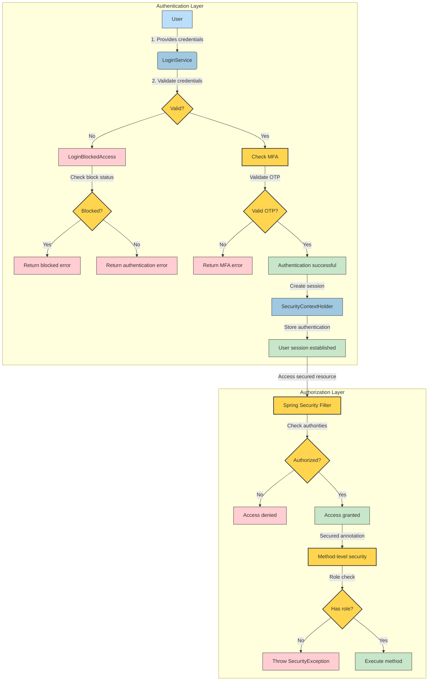

### 🔐 Authentication Components

1. **Login Service**: Processes user authentication requests and validates credentials
   - Implements password validation with BCryptPasswordEncoder
   - Supports MFA with Google Authenticator
   - Enforces account lockout after failed attempts

2. **Login Blocking**: Prevents brute force attacks through multiple protection mechanisms
   - IP-based blocking after excessive failures
   - Session-based tracking 
   - User account-based blocking
   - Configurable thresholds via application configuration

3. **Role-Based Security**: Three primary security roles
   - `ROLE_ANONYMOUS`: Unauthenticated users with limited access
   - `ROLE_USER`: Standard authenticated users
   - `ROLE_ADMIN`: Administrative users with extended privileges

4. **Method-Level Security**: `@Secured` annotations protecting service methods
   - Example: `@Secured({ "ROLE_USER", "ROLE_ADMIN" })` for user operations
   - Example: `@Secured({ "ROLE_ADMIN" })` for administrative functions
   - Example: `@Secured({ "ROLE_ANONYMOUS" })` for public endpoints

5. **Logout Handling**: Secure session termination
   - Invalidates authentication token
   - Creates audit log entry
   - Returns to anonymous context

## 📜 Data Integrity & Auditing Architecture

This diagram illustrates our comprehensive data integrity and auditing system, which ensures complete traceability, ownership attribution, and immutable history for all data changes.

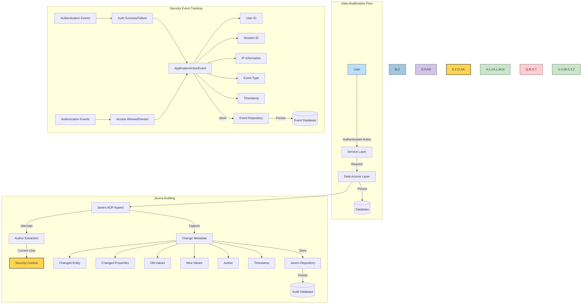

### 📊 Data Versioning with Javers

Our system uses Javers to provide comprehensive audit trails and data versioning capabilities:

1. **Change Tracking**: Every modification to domain objects is automatically captured
   - Entity creation, updates, and deletions
   - Property-level change detection
   - Before/after value comparisons
   - Complete audit trail of who changed what and when

2. **Author Attribution**: Every change is attributed to a specific user
   ```java
   @Bean
   public AuthorProvider authorProvider() {
       return () -> {
           final SecurityContext context = SecurityContextHolder.getContext();
           if (context != null && context.getAuthentication() != null) {
               return context.getAuthentication().getPrincipal().toString();
           } else {
               return "system";
           }
       };
   }
   ```

3. **JPA Integration**: Seamlessly works with our Hibernate/JPA persistence layer
   ```java
   @Bean
   public Javers getJavers(final PlatformTransactionManager txManager) {
       final JaversSqlRepository sqlRepository = SqlRepositoryBuilder.sqlRepository()
               .withConnectionProvider(new ConnectionProvider() {
                   @Override
                   public Connection getConnection() {
                       final SharedSessionContractImplementor session = 
                           entityManager.unwrap(SharedSessionContractImplementor.class);
                       return session.connection();
                   }
               }).withDialect(DialectName.POSTGRES).build();

       return TransactionalJpaJaversBuilder.javers().withTxManager(txManager)
               .withObjectAccessHook(new HibernateUnproxyObjectAccessHook())
               .registerJaversRepository(sqlRepository)
               .withMappingStyle(MappingStyle.BEAN).build();
   }
   ```

4. **AOP-Based Auditing**: Transparent interception of data operations
   ```java
   @Bean
   public JaversAuditableAspect javersAuditableAspect(final Javers javers, 
           final AuthorProvider authorProvider,
           final CommitPropertiesProvider commitPropertiesProvider) {
       return new JaversAuditableAspect(javers, authorProvider, commitPropertiesProvider);
   }
   ```

5. **Audit Analysis**: Author-based activity reporting and summaries
   ```java
   public class ViewAuditAuthorSummary implements ModelObject {
       protected long id;
       protected String author;
       protected long changes;
       protected Date firstDate;
       protected Date lastDate;
       // Methods omitted for brevity
   }
   ```

### 📋 User Activity Tracking

The system maintains comprehensive records of all user activities through session and event tracking:

1. **Application Sessions**: Tracks complete user sessions
   ```java
   public class ApplicationSession implements ModelObject {
       protected String sessionId;
       protected String userId;
       protected String ipInformation;
       protected String userAgentInformation;
       protected String operatingSystem;
       protected String screenSize;
       protected String timeZone;
       protected ApplicationSessionType sessionType;
       protected List<ApplicationActionEvent> events;
       protected Date createdDate;
       protected Date destroyedDate;
       // Methods omitted for brevity
   }
   ```

2. **Application Action Events**: Records specific user actions
   ```java
   public class ApplicationActionEvent implements ModelObject {
       protected ApplicationOperationType applicationOperation;
       protected ApplicationEventGroup eventGroup;
       protected String sessionId;
       protected String userId;
       protected String page;
       protected String pageMode;
       protected String elementId;
       protected String actionName;
       protected String errorMessage;
       protected String applicationMessage;
       protected Date createdDate;
       // Methods omitted for brevity
   }
   ```

3. **Event Categories**:
   - Authentication events (login success/failure)
   - Authorization events (access allowed/denied)
   - Data manipulation events (create/update/delete)
   - System events (startup/shutdown)

### 🔍 Security Event Monitoring

The platform implements comprehensive monitoring of security-related events:

1. **Authentication Failure Tracking**:
   - Records all failed login attempts with context
   ```java
   private static final String MAX_FAILED_LOGIN_ATTEMPTS_RECENT_HOUR_PER_IP = 
       "Max failed login attempts recent hour per ip";
   private static final String MAX_FAILED_LOGIN_ATTEMPTS_RECENT_HOUR_PER_SESSION = 
       "Max failed login attempts recent hour per session";
   private static final String MAX_FAILED_LOGIN_ATTEMPTS_RECENT_HOUR_PER_USER = 
       "Max failed login attempts recent hour per user";
   ```

2. **Authorization Failure Monitoring**:
   ```java
   public class AuthorizationFailureEventListener 
           implements ApplicationListener<AuthorizationFailureEvent> {
       private static final String ACCESS_DENIED = "Access Denied";
       private static final String ERROR_MESSAGE_FORMAT = 
           "SECURITY:Url:{0} , Method{1} ,{2}{3}{4}{5} source:{6}";
       
       @Override
       public void onApplicationEvent(final AuthorizationFailureEvent authorizationFailureEvent) {
           // Event handling logic
           serviceRequest.setEventGroup(ApplicationEventGroup.APPLICATION);
           serviceRequest.setApplicationOperation(ApplicationOperationType.AUTHORIZATION);
           serviceRequest.setUserId(UserContextUtil.getUserIdFromSecurityContext());
           serviceRequest.setErrorMessage(MessageFormat.format(ERROR_MESSAGE_FORMAT, 
               requestUrl, methodInfo, AUTHORITIES, authorities, 
               REQUIRED_AUTHORITIES, configAttributes, 
               authorizationFailureEvent.getSource()));
           serviceRequest.setApplicationMessage(ACCESS_DENIED);
           
           applicationManager.service(serviceRequest);
       }
   }
   ```

3. **Comprehensive Event Auditing**:
   - Every security event recorded with:
     - User identity (if available)
     - Session identifier
     - IP address and user agent
     - Event timestamp
     - Operation type
     - Success/failure indication
     - Detailed error messages
     - Required vs. actual permissions (for authorization failures)

### 🛡️ Data Integrity Controls

Our data integrity controls ensure the reliability and trustworthiness of stored information:

1. **Entity Versioning**: All entities maintain version information
   ```java
   @Version
   @Column(name = "MODEL_OBJECT_VERSION")
   public int getModelObjectVersion() {
       return modelObjectVersion;
   }
   ```

2. **Optimistic Locking**: Prevents concurrent modification conflicts
   - Hibernate `@Version` annotation for optimistic locking
   - Automatic detection of concurrent modifications
   - Appropriate error handling for version conflicts

3. **Immutable Audit Trail**: Guaranteed integrity of audit records
   - Audit records cannot be modified once created
   - Complete historical record maintained permanently
   - JaversSQL repository with proper permissions

4. **Database Constraints**: Structural integrity enforcement
   - Referential integrity through foreign key constraints
   - Check constraints for data validation
   - Unique constraints for entity identity

5. **Data Validation**: Application-level input validation
   - Bean Validation (JSR-380) constraints
   - Custom validators for complex business rules
   - Pre-persistence validation in service layer

## 🌐 Network Security Architecture

This diagram shows how network security is implemented across multiple layers, from AWS WAF through VPC security to the application layer, including NAT Gateways for secured outbound connectivity.

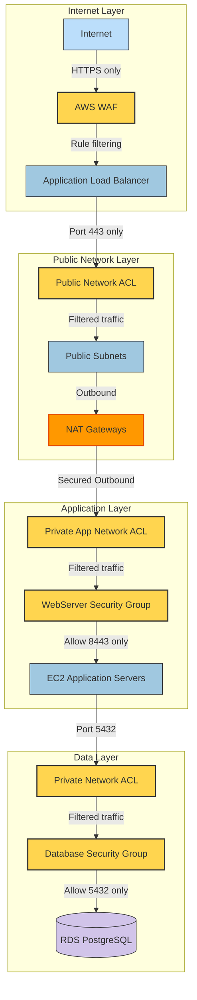

### 🔒 Network Security Components

1. **AWS WAF (Web Application Firewall)**: Protects against common web exploits
   - AWS Managed Rules for known attack patterns
   - IP reputation filtering
   - Rate limiting and bot control
   - Protection against SQL injection and XSS

2. **Network Isolation**: VPC design with clear separation of concerns
   - Public subnets for load balancers only
   - Private application subnets for EC2 instances
   - Private database subnets for data storage
   - Controlled traffic flow between layers

3. **NAT Gateways**: Secure outbound connectivity for private resources
   - Deployed in each availability zone for redundancy
   - Allows private instances to access the internet for updates and patches
   - Prevents direct inbound access to private instances
   - Highly available managed service with automatic failover

4. **Network ACLs**: Stateless packet filtering at subnet level
   - Inbound/outbound rules limiting traffic by port and source/destination
   - Explicit deny rules for RDP (port 3389)
   - Public subnet limited to HTTPS (443)
   - Private app subnets limited to application traffic
   - Private database subnets limited to PostgreSQL (5432)

5. **Security Groups**: Stateful instance-level firewall
   - Load balancer security group: Allow 443 inbound, 8443 outbound
   - Web server security group: Allow 8443 inbound from load balancer only
   - Database security group: Allow 5432 inbound from application servers only

6. **TLS Encryption**: Secure communication throughout
   - Certificate Manager for public certificates
   - HTTPS enforcement with HTTP-to-HTTPS redirection
   - Security headers including HSTS, CSP, and X-Frame-Options

7. **VPC Flow Logs**: Network traffic monitoring and analysis
   - Captures all network traffic flowing through the VPC
   - Stored in CloudWatch Logs for security analysis
   - Used for threat detection and compliance auditing
   - Custom IAM roles with least-privilege permissions

## 🔌 VPC Endpoints Security

This diagram illustrates how VPC Endpoints provide secure, private connectivity to AWS services without traversing the public internet, enhancing both security and performance.

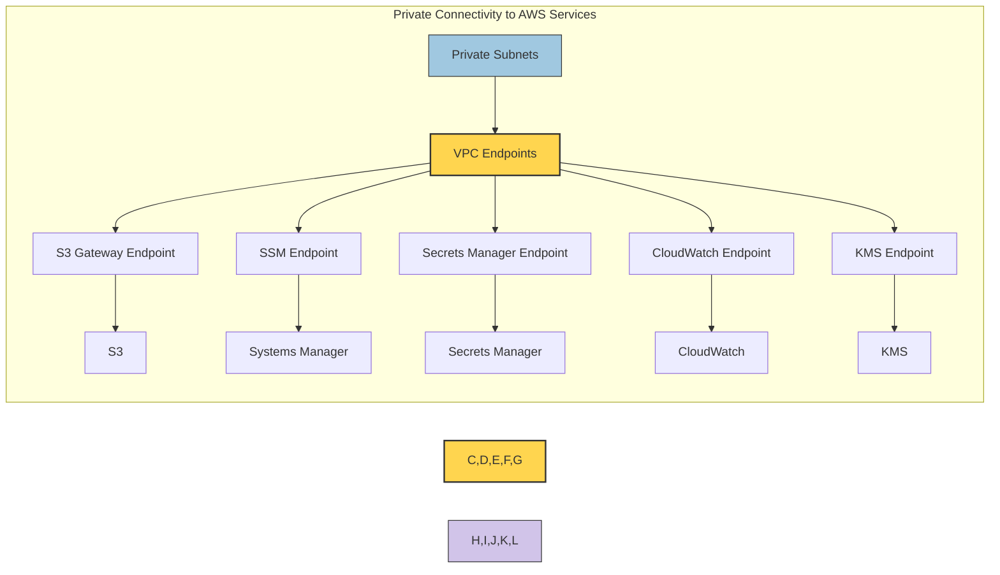

### 🔐 VPC Endpoint Security Benefits

1. **Private AWS Service Access**: Services accessed directly through AWS private network
   - Traffic never traverses the public internet
   - Enhanced security posture with reduced attack surface
   - Lower latency for AWS service requests

2. **Gateway Endpoints**:
   - S3 endpoint for secure access to artifact storage and logs
   - DynamoDB endpoint for NoSQL database access
   - Regional endpoint policies restrict access to specific resources

3. **Interface Endpoints**:
   - Systems Manager endpoints allow secure instance management without internet access
   - Secrets Manager endpoint provides secure credentials retrieval
   - CloudWatch endpoint for secure log and metric delivery
   - KMS endpoint for encryption operations

4. **Security Controls**:
   - Endpoint policies restrict what actions can be performed
   - Endpoint security groups control which instances can access endpoints
   - Private DNS resolution ensures standard AWS service hostnames work properly

5. **Compliance Benefits**:
   - Meets data locality requirements by keeping traffic within AWS network
   - Enables complete removal of internet gateways in highly secure environments
   - Provides detailed audit logs of service access

## 🏗️ High Availability Security Architecture

This diagram shows the multi-AZ security architecture designed for resilience against infrastructure failures while maintaining security boundaries.

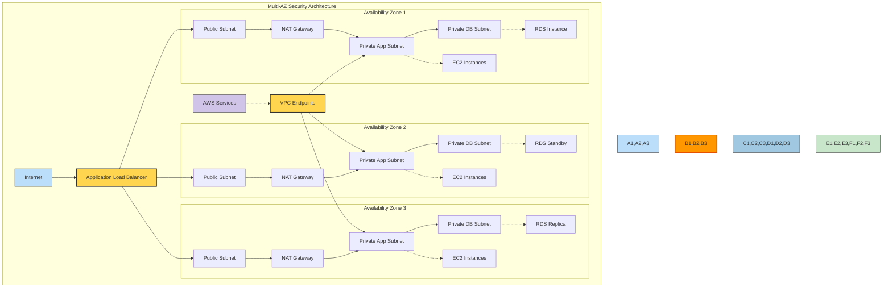

### 🔄 High Availability Security Features

1. **Multi-AZ Network Architecture**:
   - Multiple isolated availability zones for resilience
   - Security boundaries maintained across failure domains
   - Each AZ contains complete set of public, private app, and private database subnets
   - Network ACLs and security groups consistently applied across zones

2. **Redundant Security Components**:
   - NAT Gateways deployed in each public subnet
   - Automatic failover if an AZ becomes unavailable
   - Multiple EC2 instances distributed across availability zones
   - Security groups and network ACLs consistently applied

3. **Database Redundancy**:
   - Multi-AZ RDS deployment with automatic failover
   - Primary instance in first AZ with standby in second AZ
   - Read replicas for increased availability and performance
   - Encrypted storage and transit across all instances

4. **Load Balancing**:
   - Application Load Balancer distributed across all AZs
   - Health checks to detect and replace unhealthy instances
   - SSL/TLS termination with AWS Certificate Manager
   - Security groups restrict traffic to authorized sources

5. **Disaster Recovery**:
   - Cross-AZ resilience for infrastructure failures
   - Automated failover for database instances
   - Auto-scaling to replace failed application servers
   - Configuration and state management through Systems Manager

## 💾 Data Protection Architecture

This diagram illustrates how data is protected throughout its lifecycle, including encryption, access controls, and secure storage mechanisms.

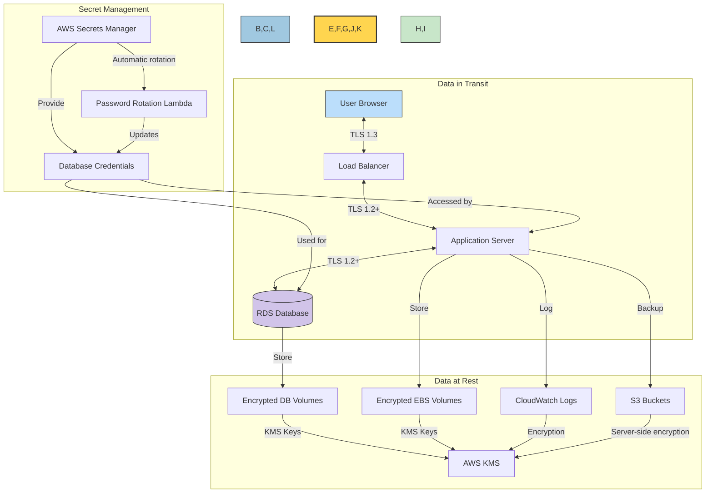

### 🔐 Data Protection Components

1. **Encryption in Transit**: Secure data transmission
   - TLS 1.3 for client-to-load-balancer communication
   - TLS 1.2+ for internal service communications
   - SSL policy: ELBSecurityPolicy-TLS13-1-2-2021-06
   - Certificate management through AWS Certificate Manager

2. **Encryption at Rest**: Protection of stored data
   - EBS encryption for EC2 instance volumes
   - RDS encryption with AWS KMS
   - S3 bucket encryption for logs and artifacts
   - Encrypted PostgreSQL connections

3. **Secret Management**: Secure credential handling
   - AWS Secrets Manager for database credentials
   - Automatic credential rotation
   - Limited IAM access to secrets
   - No hardcoded secrets in application code

4. **S3 Bucket Security**: Comprehensive protection for object storage
   - Server-side encryption using KMS
   - Bucket policies preventing public access
   - Versioning enabled for data integrity
   - Lifecycle policies for secure data retention
   - Access logging for audit trail

5. **Data Access Control**: Least privilege principles
   - Role-based access in application
   - IAM policies for AWS resource access
   - Limited database access through security groups
   - Application-level data access authorization

6. **Password Security**: Strong password policies
   - BCrypt password hashing with unique salts
   - Password complexity requirements:
     - Minimum 8 characters, maximum 64 characters
     - At least one uppercase letter
     - At least one lowercase letter
     - At least one number
     - At least one special character
     - No whitespace characters

## ☁️ AWS Security Infrastructure

This diagram shows the multi-layered AWS security infrastructure protecting the application.

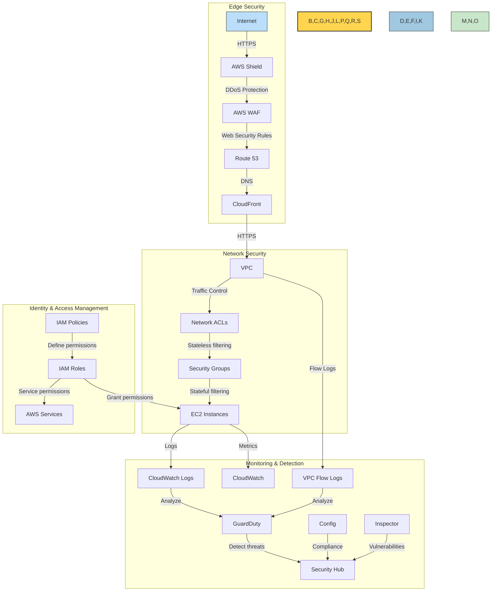

### 🛡️ AWS Security Components

1. **Edge Protection**: Defense against internet-based attacks
   - AWS Shield for DDoS protection
   - AWS WAF with managed rule sets:
     - AWSManagedRulesAmazonIpReputationList
     - AWSManagedRulesAnonymousIpList
     - AWSManagedRulesCommonRuleSet
     - AWSManagedRulesKnownBadInputsRuleSet
     - AWSManagedRulesLinuxRuleSet
     - AWSManagedRulesUnixRuleSet
   - Route 53 for secure DNS management
   - Certificate Manager for TLS certificates

2. **Network Security**: Layered defense within AWS
   - VPC with public/private subnet isolation
   - Network ACLs for subnet-level filtering
   - Security Groups for instance-level access control
   - VPC Endpoints for secure AWS service access
   - VPC Flow Logs for traffic monitoring

3. **Identity and Access Management**:
   - IAM roles with least privilege principle
   - Role-based access for EC2 instances
   - Service roles for AWS service integration
   - Secure parameter and secret access

4. **Threat Detection and Monitoring**:
   - GuardDuty for continuous threat detection
   - AWS Config for compliance monitoring
   - Inspector for vulnerability assessment
   - Security Hub for security posture management
   - CloudWatch for monitoring and alerting

5. **Hardened Infrastructure**:
   - Encrypted EBS volumes
   - IMDSv2 required for all EC2 instances
   - Security patch management
   - Automatic software updates

## 📊 Monitoring and Compliance Architecture

This diagram illustrates how security events are monitored, detected, and responded to across the system.

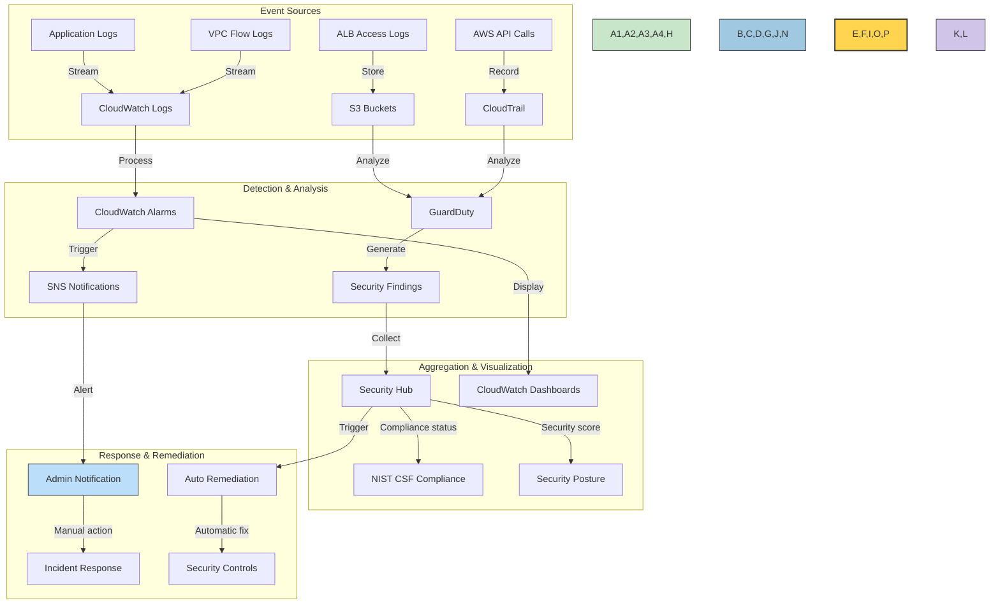

### 📈 Monitoring Components

1. **Logging and Monitoring**: Comprehensive visibility
   - CloudWatch Logs for application logs
   - VPC Flow Logs for network traffic
   - CloudTrail for API activity
   - ALB access logs for request tracking
   - Custom application event logging

2. **Security Event Detection**:
   - CloudWatch Alarms for threshold-based alerts
   - GuardDuty for threat detection
   - AWS Config for compliance checking
   - Security Hub for finding aggregation

3. **Compliance Framework Integration**:
   - NIST Cybersecurity Framework controls
   - ISO 27001 alignment
   - Automated compliance checking
   - Security posture dashboards

4. **Application Security Monitoring**:
   - Login attempt monitoring
   - User activity tracking
   - Session management
   - API request logging
   - Error tracking and analysis

5. **Alerting and Response**:
   - SNS notifications for security events
   - Automated remediation for common issues
   - Incident response procedures
   - Security control feedback loop

## 🤖 Enhanced Automated Security Operations

This diagram shows the automated security maintenance system that keeps the infrastructure patched and secure.

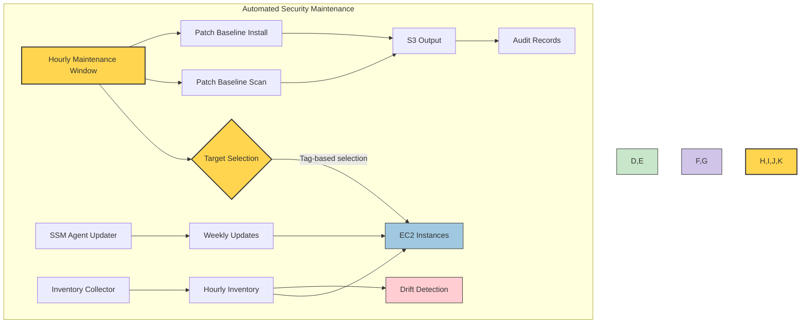

### 🔄 Automated Security Operations Components

1. **Systems Manager Patch Management**:
   - Scheduled maintenance windows for regular patching
   - Tag-based targeting of instances for updates
   - Automatic scanning and installation of security patches
   - Detailed logs and reports of patch operations
   - S3 storage of patch results for audit purposes

2. **SSM Agent Updates**:
   - Automatic updating of Systems Manager agents
   - Weekly schedule to ensure latest security capabilities
   - Tag-based selection of instances to update
   - Output logging for compliance verification

3. **Resource Inventory**:
   - Hourly collection of software inventory
   - Application, OS, and patch level tracking
   - Configuration drift detection
   - Encrypted storage of inventory data
   - Integration with compliance frameworks

4. **Automated Artifact Management**:
   - Secure S3 bucket with server-side encryption
   - Public access blocking for security artifacts
   - HTTPS-only access enforcement
   - Lifecycle policies for secure retention
   - Bucket policies restricting access to authorized services

5. **Security Role Separation**:
   - Dedicated service roles with least privilege
   - Specific IAM permissions for each automation component
   - Policy enforcement through resource tags
   - Comprehensive logging of role usage

## 🔐 Application Security Controls

### Spring Security Configuration

The application uses Spring Security for authentication, authorization, and web security controls:

```xml
<http use-expressions="false">
    <csrf disabled="true" />
    <form-login />
    <anonymous />
    <logout />
    <headers>
        <frame-options policy="SAMEORIGIN" />
        <hsts include-subdomains="true" max-age-seconds="31536000" />
        <referrer-policy policy="no-referrer"/>
        <header name="Feature-Policy" value="geolocation 'none'; camera 'none'; microphone 'none'"/>
        <content-security-policy policy-directives="default-src 'unsafe-inline' 'self'; connect-src 'unsafe-inline' 'unsafe-eval' 'self' wss:; script-src 'unsafe-inline' 'unsafe-eval' 'self' https://w[...]
        <content-type-options/>
    </headers>
</http>
```

Key security headers implemented:
- **HSTS** (HTTP Strict Transport Security): Ensures browser only connects via HTTPS
- **Content Security Policy**: Restricts resource loading to specific trusted sources
- **X-Content-Type-Options**: Prevents MIME type sniffing
- **Referrer Policy**: Controls HTTP referrer information
- **Feature Policy**: Restricts browser feature usage

### 🛡️ Authentication Protections

The system implements multiple layers of authentication protection:

1. **Login Attempt Limiting**: 
   ```java
   private static final String MAX_FAILED_LOGIN_ATTEMPTS_RECENT_HOUR_PER_IP = "Max failed login attempts recent hour per ip";
   private static final String MAX_FAILED_LOGIN_ATTEMPTS_RECENT_HOUR_PER_SESSION = "Max failed login attempts recent hour per session";
   private static final String MAX_FAILED_LOGIN_ATTEMPTS_RECENT_HOUR_PER_USER = "Max failed login attempts recent hour per user";
   ```

2. **Password Validation**:
   ```java
   private final PasswordValidator passwordValidator = new PasswordValidator(new LengthRule(8, 64),
        new CharacterRule(EnglishCharacterData.UpperCase, 1), new CharacterRule(EnglishCharacterData.LowerCase, 1),
        new CharacterRule(EnglishCharacterData.Digit, 1), new CharacterRule(EnglishCharacterData.Special, 1),
        new WhitespaceRule());
   ```

3. **Multi-Factor Authentication**:
   ```java
   private static boolean verifyOtp(final LoginRequest serviceRequest, final String authKey) {
       boolean authorizedOtp = true;
       if (authKey != null) {
           final GoogleAuthenticator gAuth = new GoogleAuthenticator();
           if (!StringUtils.isBlank(serviceRequest.getOtpCode())
                   && StringUtils.isNumeric(serviceRequest.getOtpCode())) {
               authorizedOtp = gAuth.authorize(authKey,
                       Integer.parseInt(serviceRequest.getOtpCode()));
           } else {
               authorizedOtp = false;
           }
       }
       return authorizedOtp;
   }
   ```

4. **Secure Password Storage**:
   ```java
   private final PasswordEncoder passwordEncoder = new BCryptPasswordEncoder();
   userAccount.setUserpassword(passwordEncoder.encode(userAccount.getUserId() + ".uuid" + serviceRequest.getUserpassword()));
   ```

### ⚙️ AWS Security Implementation

AWS infrastructure security as defined in CloudFormation:

1. **VPC Security Architecture**:
   - Public subnets for load balancers
   - Private subnets for application and database
   - Network ACLs and security groups for traffic control

2. **Security Groups**:
   ```json
   "WebServerSecurityGroup": {
       "Type": "AWS::EC2::SecurityGroup",
       "Properties": {
           "GroupDescription": "Allow access from load balancer and bastion as well as outbound HTTP and HTTPS traffic",
           "SecurityGroupIngress": [
               {
                   "Description": "Loadbalancer inbound access",
                   "IpProtocol": "tcp",
                   "FromPort": "8443",
                   "ToPort": "8443",
                   "SourceSecurityGroupId": {"Ref": "PublicLoadBalancerSecurityGroup"}
               }
           ]
       }
   }
   ```

3. **WAF Implementation**:
   ```json
   "BasicSecurityACL": {
       "Type": "AWS::WAFv2::WebACL",
       "Properties": {
           "Name": "BasicSecurityACL",
           "Scope": "REGIONAL",
           "Rules": [
               {
                   "Name": "RuleWithAWSManagedRulesAmazonIpReputationList",
                   "Priority": 0,
                   "Statement": {
                       "ManagedRuleGroupStatement": {
                           "VendorName": "AWS",
                           "Name": "AWSManagedRulesAmazonIpReputationList"
                       }
                   }
               }
           ]
       }
   }
   ```

4. **Database Encryption**:
   ```json
   "Database": {
       "Type": "AWS::RDS::DBInstance",
       "Properties": {
           "StorageEncrypted": "true",
           "KmsKeyId": {"Ref": "DBEncryptionKmsAlias"},
           "EnableCloudwatchLogsExports": ["postgresql", "upgrade"]
       }
   }
   ```

5. **S3 Bucket Security**:
   ```json
   "ArtifactBucket": {
       "Type": "AWS::S3::Bucket",
       "DependsOn": "LogsBucket",
       "DeletionPolicy": "Retain",
       "Properties": {
           "AccessControl": "Private",
           "BucketEncryption": {
               "ServerSideEncryptionConfiguration": [
                   {
                       "ServerSideEncryptionByDefault": {
                           "KMSMasterKeyID": {
                               "Ref": "ArtifactBucketEncryptionKey"
                           },
                           "SSEAlgorithm": "aws:kms"
                       }
                   }
               ]
           },
           "VersioningConfiguration": {
               "Status": "Enabled"
           },
           "PublicAccessBlockConfiguration": {
               "BlockPublicAcls": true,
               "BlockPublicPolicy": true,
               "IgnorePublicAcls": true,
               "RestrictPublicBuckets": true
           }
       }
   }
   ```

## 📜 Security Compliance Architecture

The CIA platform is designed to comply with major security frameworks:

### NIST Cybersecurity Framework Mapping

| Function | Category | Implementation |
|----------|----------|----------------|
| **Identify (ID)** | Asset Management (ID.AM) | AWS Config for resource inventory |
| | Risk Assessment (ID.RA) | Security Hub risk scoring |
| **Protect (PR)** | Identity Management (PR.AC) | IAM, Spring Security, MFA |
| | Data Security (PR.DS) | Encryption at rest and in transit |
| | Protective Technology (PR.PT) | WAF, Security Groups, Network ACLs |
| **Detect (DE)** | Anomalies and Events (DE.AE) | CloudWatch, GuardDuty |
| | Security Monitoring (DE.CM) | VPC Flow Logs, CloudTrail |
| **Respond (RS)** | Response Planning (RS.RP) | SNS alerting, Security Hub |
| | Analysis (RS.AN) | Detective, Security Hub |
| **Recover (RC)** | Recovery Planning (RC.RP) | AWS Backup, Multi-AZ deployment |
| | Improvements (RC.IM) | Automated remediations |

### ISO 27001 Control Alignment

| Control ID | Description | Implementation |
|------------|-------------|----------------|
| A.5 | Information security policies | Documentation, compliance checks |
| A.9 | Access control | IAM, Spring Security |
| A.10 | Cryptography | KMS, TLS, password hashing |
| A.12 | Operations security | Patching, monitoring |
| A.13 | Communications security | Network security, encryption |
| A.14 | System acquisition and development | Secure SDLC |
| A.18 | Compliance | Security Hub, Config Rules |

## 🛡️ Defense-in-Depth Strategy

The security architecture follows the defense-in-depth principle with multiple layers of protection:

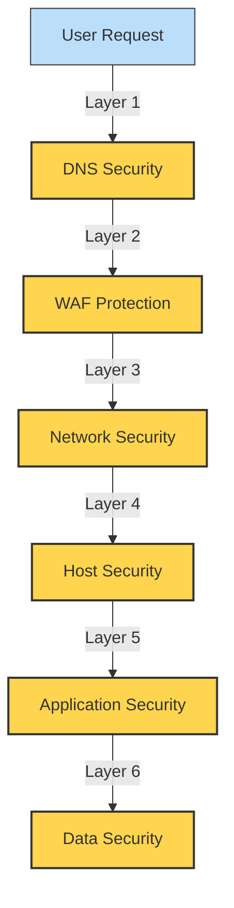

### 🔒 Security Layer Details

1. **DNS Security Layer**
   - Route 53 with DNSSEC support
   - DNS query logging
   - Monitoring for DNS poisoning attempts

2. **WAF Protection Layer**
   - Rate limiting
   - IP reputation filtering
   - SQL injection and XSS protection
   - Bot control

3. **Network Security Layer**
   - VPC isolation
   - Network ACLs
   - Security Groups
   - Flow logging and monitoring
   - NAT Gateways for secure outbound connectivity
   - VPC Endpoints for AWS service access

4. **Host Security Layer**
   - Hardened AMIs
   - Instance encryption
   - Systems Manager patching
   - IMDSv2 enforcement
   - Host-based monitoring

5. **Application Security Layer**
   - Spring Security framework
   - Authentication and authorization controls
   - Input validation
   - Session management
   - Security headers

6. **Data Security Layer**
   - Encryption at rest
   - Encryption in transit
   - Access controls
   - Secrets management
   - Data loss prevention

## 📈 Security Threat Modeling

### STRIDE Threat Analysis

| Threat Type | Controls |
|-------------|----------|
| **Spoofing** | Authentication, MFA, secure session management |
| **Tampering** | Encryption, integrity checks, WAF rules |
| **Repudiation** | Comprehensive logging, audit trails, CloudTrail |
| **Information Disclosure** | Encryption, access control, data classification |
| **Denial of Service** | WAF rate limiting, auto scaling, DDoS protection |
| **Elevation of Privilege** | Least privilege, role separation, input validation |

### Critical Data Flow Protection

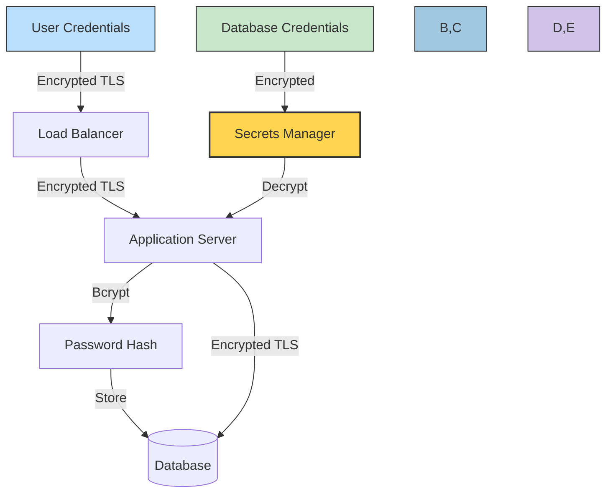

## 🔄 Security Operations and Maintenance

### Security Update Lifecycle

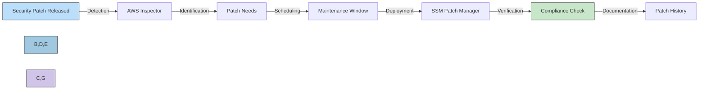

### Automated Security Processes

1. **Automated Security Assessments**:
   - Daily vulnerability scans
   - Weekly compliance checks
   - Monthly penetration tests

2. **Continuous Monitoring**:
   - Real-time threat detection
   - Behavior analysis
   - Anomaly detection

3. **Automatic Remediation**:
   - Self-healing infrastructure
   - Automatic patching
   - Configuration correction

## 🌟 Security Architecture Best Practices

### Implemented Security Principles

1. **Zero Trust Architecture**
   - "Never trust, always verify" approach
   - Network segmentation
   - Least privilege access
   - Continuous validation

2. **Secure by Design**
   - Security integrated from project inception
   - Regular threat modeling
   - Security requirements as first-class constraints
   - Defensive programming practices

3. **Security Automation**
   - Automated security testing
   - Compliance as code
   - Infrastructure as code security checks
   - Continuous security monitoring

4. **Shift-Left Security**
   - Security integrated into CI/CD pipeline
   - Early vulnerability detection
   - Developer security training
   - Security gates in deployment process

5. **High Availability Security**
   - Multi-AZ deployments for all security components
   - Resilient network architecture
   - Redundant NAT Gateways
   - Database failover capabilities

## 📝 Conclusion

The Citizen Intelligence Agency employs a comprehensive, defense-in-depth security architecture that spans from application-level controls to infrastructure security. By implementing multiple layers of protection with high availability designs, we ensure the confidentiality, integrity, and availability of sensitive political data.

Key security highlights include:

- 🔐 Multi-factor authentication with sophisticated brute force protection
- 🛡️ AWS WAF and Shield protection against web-based attacks
- 🔒 Comprehensive encryption for data at rest and in transit
- 🌐 Redundant multi-AZ architecture with NAT Gateways for resilience
- 🔌 VPC Endpoints for secure AWS service access
- 👁️ Continuous monitoring with GuardDuty, Inspector, and Security Hub
- 📜 Complete data integrity with Javers versioning and author attribution
- 🔍 Comprehensive user activity and security event tracking
- 📋 NIST CSF and ISO 27001 compliance alignment
- 🤖 Automated security operations with Systems Manager

For detailed implementation costs and specific AWS security services, refer to the [Financial Security Plan](FinancialSecurityPlan.md).
