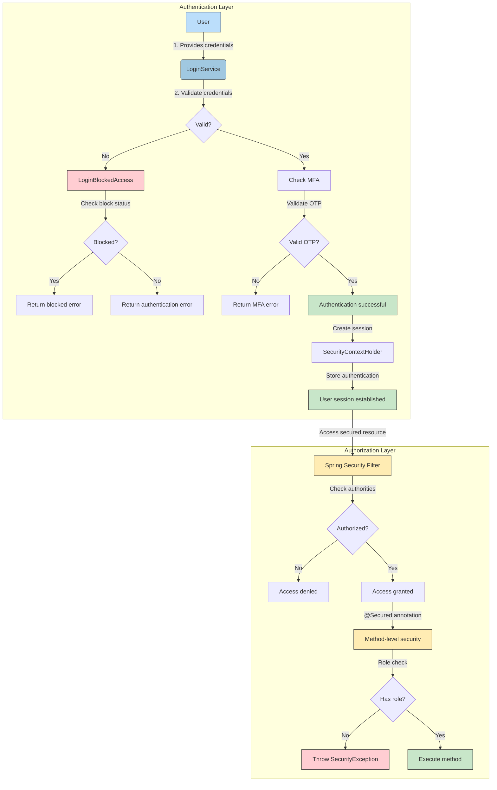
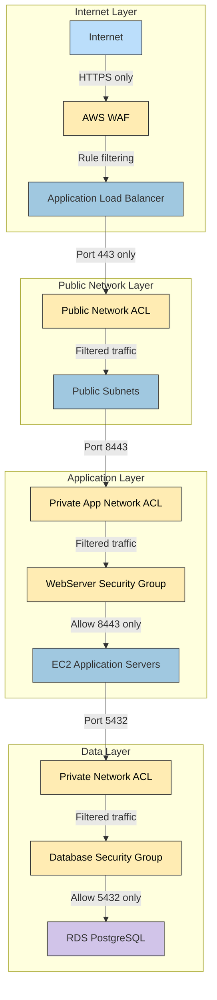
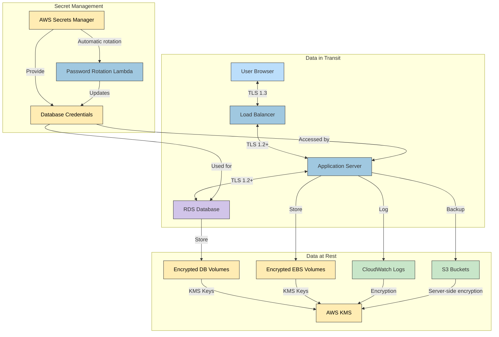
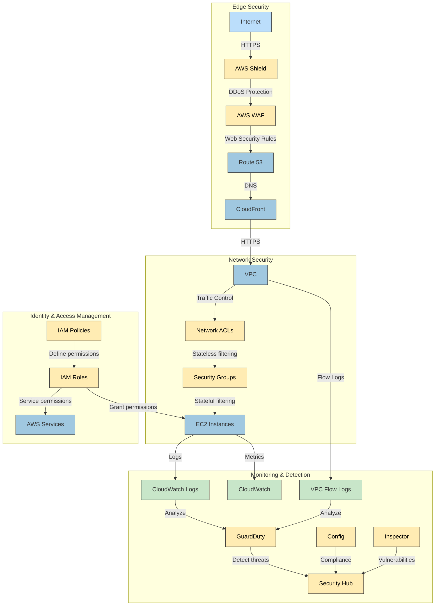
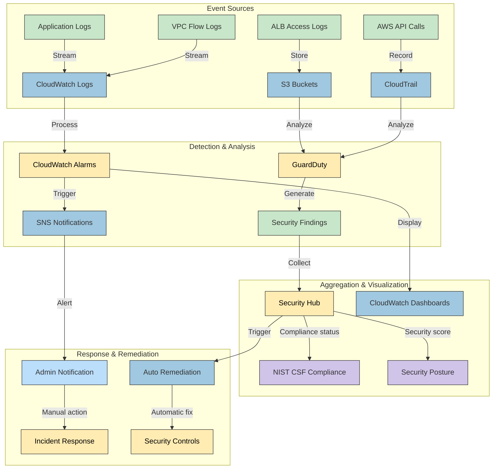
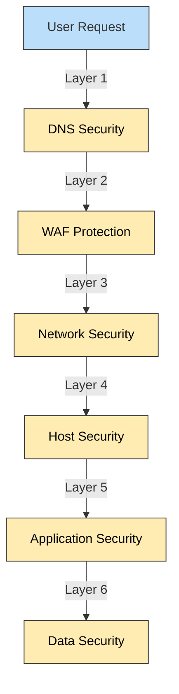
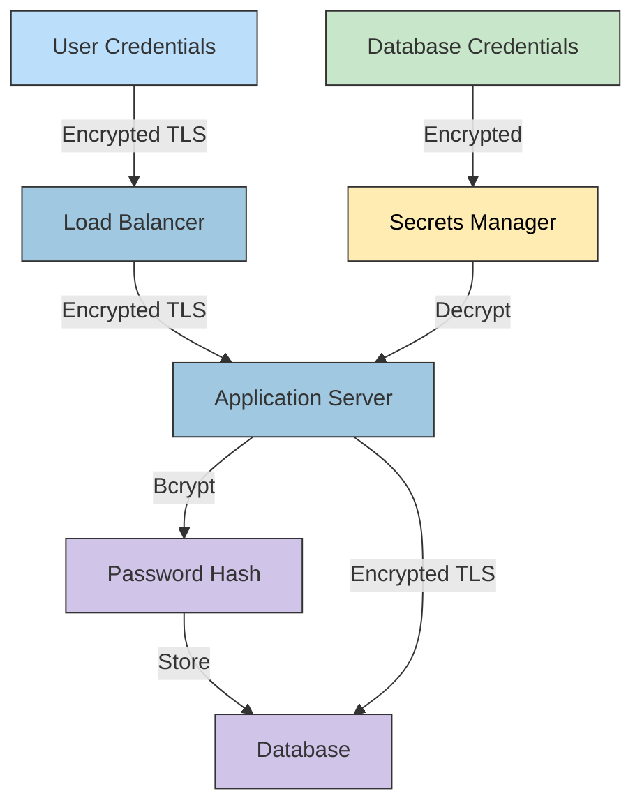

# 🔐 Citizen Intelligence Agency Security Architecture

This document outlines the comprehensive security architecture of the Citizen Intelligence Agency platform, detailing the authentication mechanisms, network security, data protection, AWS infrastructure security layers, and compliance monitoring approaches.

## 📚 Security Documentation Map

| Document | Focus | Description |
|----------|-------|-------------|
| [Security Architecture](SECURITY_ARCHITECTURE.md) | 🔐 Security | Complete security overview |
| [Financial Security Plan](FinancialSecurityPlan.md) | 💰 Cost/Security | AWS security implementation costs |
| [Architecture](ARCHITECTURE.md) | 🏛️ Structure | Overall system architecture |
| [End-of-Life Strategy](End-of-Life-Strategy.md) | 📅 Lifecycle | Security patching and updates |

## 🔑 Authentication and Authorization Architecture

This diagram illustrates the multi-layered authentication and authorization process, including the MFA (Multi-Factor Authentication) flow, login blocking mechanisms, and role-based access control.



### Authentication Components

1. **Login Service**: Processes user authentication requests and validates credentials
   - Implements password validation with BCryptPasswordEncoder
   - Supports MFA with Google Authenticator
   - Enforces account lockout after failed attempts

2. **Login Blocking**: Prevents brute force attacks through multiple protection mechanisms
   - IP-based blocking after excessive failures
   - Session-based tracking 
   - User account-based blocking
   - Configurable thresholds via application configuration

3. **Role-Based Security**: Three primary security roles
   - `ROLE_ANONYMOUS`: Unauthenticated users with limited access
   - `ROLE_USER`: Standard authenticated users
   - `ROLE_ADMIN`: Administrative users with extended privileges

4. **Method-Level Security**: `@Secured` annotations protecting service methods
   - Example: `@Secured({ "ROLE_USER", "ROLE_ADMIN" })` for user operations
   - Example: `@Secured({ "ROLE_ADMIN" })` for administrative functions
   - Example: `@Secured({ "ROLE_ANONYMOUS" })` for public endpoints

5. **Logout Handling**: Secure session termination
   - Invalidates authentication token
   - Creates audit log entry
   - Returns to anonymous context

## 🔒 Network Security Architecture

This diagram shows how network security is implemented across multiple layers, from AWS WAF through VPC security to the application layer.



### Network Security Components

1. **AWS WAF (Web Application Firewall)**: Protects against common web exploits
   - AWS Managed Rules for known attack patterns
   - IP reputation filtering
   - Rate limiting and bot control
   - Protection against SQL injection and XSS

2. **Network Isolation**: VPC design with clear separation of concerns
   - Public subnets for load balancers only
   - Private application subnets for EC2 instances
   - Private database subnets for data storage
   - Controlled traffic flow between layers

3. **Network ACLs**: Stateless packet filtering at subnet level
   - Inbound/outbound rules limiting traffic by port and source/destination
   - Explicit deny rules for RDP (port 3389)
   - Public subnet limited to HTTPS (443)
   - Private app subnets limited to application traffic
   - Private database subnets limited to PostgreSQL (5432)

4. **Security Groups**: Stateful instance-level firewall
   - Load balancer security group: Allow 443 inbound, 8443 outbound
   - Web server security group: Allow 8443 inbound from load balancer only
   - Database security group: Allow 5432 inbound from application servers only

5. **TLS Encryption**: Secure communication throughout
   - Certificate Manager for public certificates
   - HTTPS enforcement with HTTP-to-HTTPS redirection
   - Security headers including HSTS, CSP, and X-Frame-Options

## 🛡️ Data Protection Architecture

This diagram illustrates how data is protected throughout its lifecycle, including encryption, access controls, and secure storage mechanisms.



### Data Protection Components

1. **Encryption in Transit**: Secure data transmission
   - TLS 1.3 for client-to-load-balancer communication
   - TLS 1.2+ for internal service communications
   - SSL policy: ELBSecurityPolicy-TLS13-1-2-2021-06
   - Certificate management through AWS Certificate Manager

2. **Encryption at Rest**: Protection of stored data
   - EBS encryption for EC2 instance volumes
   - RDS encryption with AWS KMS
   - S3 bucket encryption for logs and artifacts
   - Encrypted PostgreSQL connections

3. **Secret Management**: Secure credential handling
   - AWS Secrets Manager for database credentials
   - Automatic credential rotation
   - Limited IAM access to secrets
   - No hardcoded secrets in application code

4. **Data Access Control**: Least privilege principles
   - Role-based access in application
   - IAM policies for AWS resource access
   - Limited database access through security groups
   - Application-level data access authorization

5. **Password Security**: Strong password policies
   - BCrypt password hashing with unique salts
   - Password complexity requirements:
     - Minimum 8 characters, maximum 64 characters
     - At least one uppercase letter
     - At least one lowercase letter
     - At least one number
     - At least one special character
     - No whitespace characters

## 🌐 AWS Security Infrastructure

This diagram shows the multi-layered AWS security infrastructure protecting the application.



### AWS Security Components

1. **Edge Protection**: Defense against internet-based attacks
   - AWS Shield for DDoS protection
   - AWS WAF with managed rule sets:
     - AWSManagedRulesAmazonIpReputationList
     - AWSManagedRulesAnonymousIpList
     - AWSManagedRulesCommonRuleSet
     - AWSManagedRulesKnownBadInputsRuleSet
     - AWSManagedRulesLinuxRuleSet
     - AWSManagedRulesUnixRuleSet
   - Route 53 for secure DNS management
   - Certificate Manager for TLS certificates

2. **Network Security**: Layered defense within AWS
   - VPC with public/private subnet isolation
   - Network ACLs for subnet-level filtering
   - Security Groups for instance-level access control
   - VPC Endpoints for secure AWS service access
   - VPC Flow Logs for traffic monitoring

3. **Identity and Access Management**:
   - IAM roles with least privilege principle
   - Role-based access for EC2 instances
   - Service roles for AWS service integration
   - Secure parameter and secret access

4. **Threat Detection and Monitoring**:
   - GuardDuty for continuous threat detection
   - AWS Config for compliance monitoring
   - Inspector for vulnerability assessment
   - Security Hub for security posture management
   - CloudWatch for monitoring and alerting

5. **Hardened Infrastructure**:
   - Encrypted EBS volumes
   - IMDSv2 required for all EC2 instances
   - Security patch management
   - Automatic software updates

## 📊 Monitoring and Compliance Architecture

This diagram illustrates how security events are monitored, detected, and responded to across the system.



### Monitoring Components

1. **Logging and Monitoring**: Comprehensive visibility
   - CloudWatch Logs for application logs
   - VPC Flow Logs for network traffic
   - CloudTrail for API activity
   - ALB access logs for request tracking
   - Custom application event logging

2. **Security Event Detection**:
   - CloudWatch Alarms for threshold-based alerts
   - GuardDuty for threat detection
   - AWS Config for compliance checking
   - Security Hub for finding aggregation

3. **Compliance Framework Integration**:
   - NIST Cybersecurity Framework controls
   - ISO 27001 alignment
   - Automated compliance checking
   - Security posture dashboards

4. **Application Security Monitoring**:
   - Login attempt monitoring
   - User activity tracking
   - Session management
   - API request logging
   - Error tracking and analysis

5. **Alerting and Response**:
   - SNS notifications for security events
   - Automated remediation for common issues
   - Incident response procedures
   - Security control feedback loop

## 🔐 Application Security Controls

### Spring Security Configuration

The application uses Spring Security for authentication, authorization, and web security controls:

```xml
<http use-expressions="false">
    <csrf disabled="true" />
    <form-login />
    <anonymous />
    <logout />
    <headers>
        <frame-options policy="SAMEORIGIN" />
        <hsts include-subdomains="true" max-age-seconds="31536000" />
        <referrer-policy policy="no-referrer"/>
        <header name="Feature-Policy" value="geolocation 'none'; camera 'none'; microphone 'none'"/>
        <content-security-policy policy-directives="default-src 'unsafe-inline' 'self'; connect-src 'unsafe-inline' 'unsafe-eval' 'self' wss:; script-src 'unsafe-inline' 'unsafe-eval' 'self' https://www.gstatic.com; style-src 'unsafe-inline' 'self' https://fonts.gstatic.com https://www.gstatic.com; font-src 'self' https://fonts.gstatic.com; img-src 'self' https://data.riksdagen.se https://www.gstatic.com data:"/>
        <content-type-options/>
    </headers>
</http>
```

Key security headers implemented:
- **HSTS** (HTTP Strict Transport Security): Ensures browser only connects via HTTPS
- **Content Security Policy**: Restricts resource loading to specific trusted sources
- **X-Content-Type-Options**: Prevents MIME type sniffing
- **Referrer Policy**: Controls HTTP referrer information
- **Feature Policy**: Restricts browser feature usage

### Authentication Protections

The system implements multiple layers of authentication protection:

1. **Login Attempt Limiting**: 
   ```java
   private static final String MAX_FAILED_LOGIN_ATTEMPTS_RECENT_HOUR_PER_IP = "Max failed login attempts recent hour per ip";
   private static final String MAX_FAILED_LOGIN_ATTEMPTS_RECENT_HOUR_PER_SESSION = "Max failed login attempts recent hour per session";
   private static final String MAX_FAILED_LOGIN_ATTEMPTS_RECENT_HOUR_PER_USER = "Max failed login attempts recent hour per user";
   ```

2. **Password Validation**:
   ```java
   private final PasswordValidator passwordValidator = new PasswordValidator(new LengthRule(8, 64),
        new CharacterRule(EnglishCharacterData.UpperCase, 1), new CharacterRule(EnglishCharacterData.LowerCase, 1),
        new CharacterRule(EnglishCharacterData.Digit, 1), new CharacterRule(EnglishCharacterData.Special, 1),
        new WhitespaceRule());
   ```

3. **Multi-Factor Authentication**:
   ```java
   private static boolean verifyOtp(final LoginRequest serviceRequest, final String authKey) {
       boolean authorizedOtp = true;
       if (authKey != null) {
           final GoogleAuthenticator gAuth = new GoogleAuthenticator();
           if (!StringUtils.isBlank(serviceRequest.getOtpCode())
                   && StringUtils.isNumeric(serviceRequest.getOtpCode())) {
               authorizedOtp = gAuth.authorize(authKey,
                       Integer.parseInt(serviceRequest.getOtpCode()));
           } else {
               authorizedOtp = false;
           }
       }
       return authorizedOtp;
   }
   ```

4. **Secure Password Storage**:
   ```java
   private final PasswordEncoder passwordEncoder = new BCryptPasswordEncoder();
   userAccount.setUserpassword(passwordEncoder.encode(userAccount.getUserId() + ".uuid" + serviceRequest.getUserpassword()));
   ```

### AWS Security Implementation

AWS infrastructure security as defined in CloudFormation:

1. **VPC Security Architecture**:
   - Public subnets for load balancers
   - Private subnets for application and database
   - Network ACLs and security groups for traffic control

2. **Security Groups**:
   ```json
   "WebServerSecurityGroup": {
       "Type": "AWS::EC2::SecurityGroup",
       "Properties": {
           "GroupDescription": "Allow access from load balancer and bastion as well as outbound HTTP and HTTPS traffic",
           "SecurityGroupIngress": [
               {
                   "Description": "Loadbalancer inbound access",
                   "IpProtocol": "tcp",
                   "FromPort": "8443",
                   "ToPort": "8443",
                   "SourceSecurityGroupId": {"Ref": "PublicLoadBalancerSecurityGroup"}
               }
           ]
       }
   }
   ```

3. **WAF Implementation**:
   ```json
   "BasicSecurityACL": {
       "Type": "AWS::WAFv2::WebACL",
       "Properties": {
           "Name": "BasicSecurityACL",
           "Scope": "REGIONAL",
           "Rules": [
               {
                   "Name": "RuleWithAWSManagedRulesAmazonIpReputationList",
                   "Priority": 0,
                   "Statement": {
                       "ManagedRuleGroupStatement": {
                           "VendorName": "AWS",
                           "Name": "AWSManagedRulesAmazonIpReputationList"
                       }
                   }
               }
           ]
       }
   }
   ```

4. **Database Encryption**:
   ```json
   "Database": {
       "Type": "AWS::RDS::DBInstance",
       "Properties": {
           "StorageEncrypted": "true",
           "KmsKeyId": {"Ref": "DBEncryptionKmsAlias"},
           "EnableCloudwatchLogsExports": ["postgresql", "upgrade"]
       }
   }
   ```

## 🏛️ Security Compliance Architecture

The CIA platform is designed to comply with major security frameworks:

### NIST Cybersecurity Framework Mapping

| Function | Category | Implementation |
|----------|----------|----------------|
| **Identify (ID)** | Asset Management (ID.AM) | AWS Config for resource inventory |
| | Risk Assessment (ID.RA) | Security Hub risk scoring |
| **Protect (PR)** | Identity Management (PR.AC) | IAM, Spring Security, MFA |
| | Data Security (PR.DS) | Encryption at rest and in transit |
| | Protective Technology (PR.PT) | WAF, Security Groups, Network ACLs |
| **Detect (DE)** | Anomalies and Events (DE.AE) | CloudWatch, GuardDuty |
| | Security Monitoring (DE.CM) | VPC Flow Logs, CloudTrail |
| **Respond (RS)** | Response Planning (RS.RP) | SNS alerting, Security Hub |
| | Analysis (RS.AN) | Detective, Security Hub |
| **Recover (RC)** | Recovery Planning (RC.RP) | AWS Backup, Multi-AZ deployment |
| | Improvements (RC.IM) | Automated remediations |

### ISO 27001 Control Alignment

| Control ID | Description | Implementation |
|------------|-------------|----------------|
| A.5 | Information security policies | Documentation, compliance checks |
| A.9 | Access control | IAM, Spring Security |
| A.10 | Cryptography | KMS, TLS, password hashing |
| A.12 | Operations security | Patching, monitoring |
| A.13 | Communications security | Network security, encryption |
| A.14 | System acquisition and development | Secure SDLC |
| A.18 | Compliance | Security Hub, Config Rules |

## 🛡️ Defense-in-Depth Strategy

The security architecture follows the defense-in-depth principle with multiple layers of protection:



### Security Layer Details

1. **DNS Security Layer**
   - Route 53 with DNSSEC support
   - DNS query logging
   - Monitoring for DNS poisoning attempts

2. **WAF Protection Layer**
   - Rate limiting
   - IP reputation filtering
   - SQL injection and XSS protection
   - Bot control

3. **Network Security Layer**
   - VPC isolation
   - Network ACLs
   - Security Groups
   - Flow logging and monitoring

4. **Host Security Layer**
   - Hardened AMIs
   - Instance encryption
   - Systems Manager patching
   - IMDSv2 enforcement
   - Host-based monitoring

5. **Application Security Layer**
   - Spring Security framework
   - Authentication and authorization controls
   - Input validation
   - Session management
   - Security headers

6. **Data Security Layer**
   - Encryption at rest
   - Encryption in transit
   - Access controls
   - Secrets management
   - Data loss prevention

## 📈 Security Threat Modeling

### STRIDE Threat Analysis

| Threat Type | Controls |
|-------------|----------|
| **Spoofing** | Authentication, MFA, secure session management |
| **Tampering** | Encryption, integrity checks, WAF rules |
| **Repudiation** | Comprehensive logging, audit trails, CloudTrail |
| **Information Disclosure** | Encryption, access control, data classification |
| **Denial of Service** | WAF rate limiting, auto scaling, DDoS protection |
| **Elevation of Privilege** | Least privilege, role separation, input validation |

### Critical Data Flow Protection



## 🔄 Security Operations and Maintenance

### Security Update Lifecycle

```mermaid
graph LR
    A[Security Patch Released] -->|Detection| B[AWS Inspector]
    B -->|Identification| C[Patch Needs]
    C -->|Scheduling| D[Maintenance Window]
    D -->|Deployment| E[SSM Patch Manager]
    E -->|Verification| F[Compliance Check]
    F -->|Documentation| G[Patch History]
    
    style A fill:#bbdefb,stroke:#333,stroke-width:1px
    style B fill:#a0c8e0,stroke:#333,stroke-width:1px
    style C fill:#d1c4e9,stroke:#333,stroke-width:1px
    style D fill:#a0c8e0,stroke:#333,stroke-width:1px
    style E fill:#ffecb3,stroke:#333,stroke-width:1px,color:black
    style F fill:#c8e6c9,stroke:#333,stroke-width:1px
    style G fill:#d1c4e9,stroke:#333,stroke-width:1px
```



### Automated Security Processes

1. **Automated Security Assessments**:
   - Daily vulnerability scans
   - Weekly compliance checks
   - Monthly penetration tests

2. **Continuous Monitoring**:
   - Real-time threat detection
   - Behavior analysis
   - Anomaly detection

3. **Automatic Remediation**:
   - Self-healing infrastructure
   - Automatic patching
   - Configuration correction

## 🌟 Security Architecture Best Practices

### Implemented Security Principles

1. **Zero Trust Architecture**
   - "Never trust, always verify" approach
   - Network segmentation
   - Least privilege access
   - Continuous validation

2. **Secure by Design**
   - Security integrated from project inception
   - Regular threat modeling
   - Security requirements as first-class constraints
   - Defensive programming practices

3. **Security Automation**
   - Automated security testing
   - Compliance as code
   - Infrastructure as code security checks
   - Continuous security monitoring

4. **Shift-Left Security**
   - Security integrated into CI/CD pipeline
   - Early vulnerability detection
   - Developer security training
   - Security gates in deployment process

## 📝 Conclusion

The Citizen Intelligence Agency employs a comprehensive, defense-in-depth security architecture that spans from application-level controls to infrastructure security. By implementing multiple layers of protection—from WAF rules and network segmentation to application security and data encryption—the system maintains resilience against a wide range of threats while ensuring compliance with industry security standards.

For detailed implementation costs and specific AWS security services, refer to the [Financial Security Plan](FinancialSecurityPlan.md).
