# 🛡️ Citizen Intelligence Agency Security Architecture

This document outlines the comprehensive security architecture of the Citizen Intelligence Agency platform, detailing how we protect our systems and data through multiple security layers.

## 📑 Table of Contents

- [🔐 Security Documentation Map](#-security-documentation-map)
- [🔑 Authentication Architecture](#-authentication-architecture)
- [📜 Data Integrity & Auditing](#-data-integrity--auditing)
- [📊 Session & Action Tracking](#-session--action-tracking)
- [🔍 Security Event Monitoring](#-security-event-monitoring)
- [🌐 Network Security](#-network-security)
- [🔌 VPC Endpoints Security](#-vpc-endpoints-security)
- [🏗️ High Availability Design](#-high-availability-design)
- [💾 Data Protection](#-data-protection)
- [☁️ AWS Security Infrastructure](#-aws-security-infrastructure)
- [📈 Monitoring & Compliance](#-monitoring--compliance)
- [🤖 Automated Security Operations](#-automated-security-operations)
- [🔒 Application Security](#-application-security)
- [📋 Compliance Framework](#-compliance-framework)
- [🛡️ Defense-in-Depth Strategy](#-defense-in-depth-strategy)
- [🔄 Security Operations](#-security-operations)
- [📝 Conclusion](#-conclusion)

## 🔐 Security Documentation Map

| Document | Focus | Description |
|----------|-------|-------------|
| [Security Architecture](SECURITY_ARCHITECTURE.md) | 🛡️ Security | Complete security overview |
| [Future Security Architecture](FUTURE_SECURITY_ARCHITECTURE.md) | 🚀 Vision | Future security roadmap |
| [Financial Security Plan](FinancialSecurityPlan.md) | 💰 Cost | AWS security implementation costs |
| [Architecture](ARCHITECTURE.md) | 🏛️ Structure | Overall system architecture |
| [End-of-Life Strategy](End-of-Life-Strategy.md) | 📅 Lifecycle | Security patching and updates |

## 🔑 Authentication Architecture

Our multi-layered authentication and authorization process includes MFA, login blocking, and role-based access control.

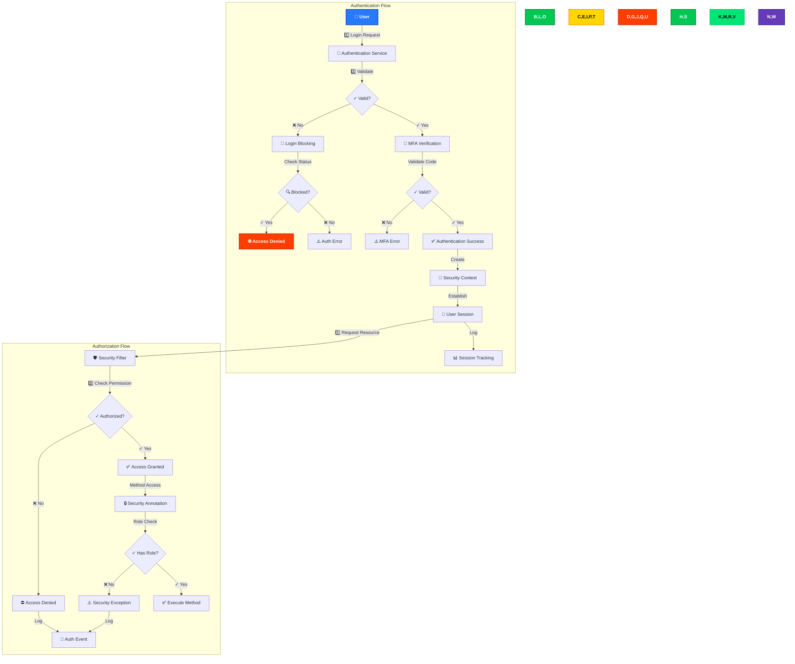

### Key Components

- **🔐 Multi-Factor Authentication**: Google Authenticator OTP integration
- **🚫 Brute Force Protection**: IP, session, and user-based blocking with configurable thresholds
- **👥 Role-Based Access**: Three security tiers (Anonymous, User, Admin)
- **🔒 Method-Level Security**: `@Secured` annotations for fine-grained control
- **📤 Secure Logout**: Complete session invalidation with audit logging

### Login Blocking Protection

The system implements sophisticated login blocking mechanisms:

```java
private static final String MAX_FAILED_LOGIN_ATTEMPTS_RECENT_HOUR_PER_IP = 
    "Max failed login attempts recent hour per ip";
private static final String MAX_FAILED_LOGIN_ATTEMPTS_RECENT_HOUR_PER_SESSION = 
    "Max failed login attempts recent hour per session";
private static final String MAX_FAILED_LOGIN_ATTEMPTS_RECENT_HOUR_PER_USER = 
    "Max failed login attempts recent hour per user";
```

These thresholds can be configured via the application's administrative interface to adjust security posture based on threat conditions.

## 📜 Data Integrity & Auditing

Our auditing system provides comprehensive traceability and data integrity protection through Javers versioning.

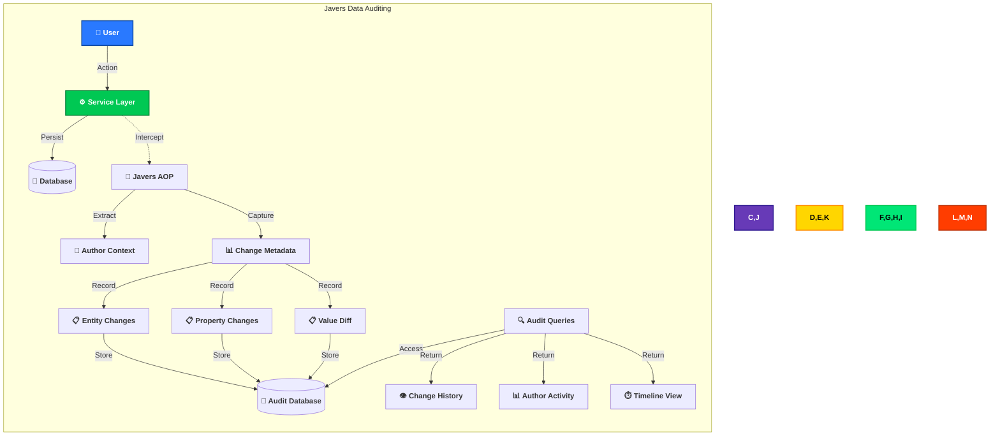

### Javers Audit Components

- **📝 AOP Interception**: Transparent capture of all data changes
- **👤 Author Tracking**: Every change attributed to the authenticated user
- **📊 Complete Change History**: Entity, property, and value-level auditing
- **📋 Property-Level Tracking**: Detailed before/after snapshots for all changes
- **⏱️ Temporal Data Access**: Historical view of data at any point in time

### Javers Implementation

Our system uses Javers to provide comprehensive audit trails and data versioning capabilities:

```java
@Bean
public Javers getJavers(final PlatformTransactionManager txManager) {
    final JaversSqlRepository sqlRepository = SqlRepositoryBuilder.sqlRepository()
            .withConnectionProvider(new ConnectionProvider() {
                @Override
                public Connection getConnection() {
                    final SharedSessionContractImplementor session = 
                        entityManager.unwrap(SharedSessionContractImplementor.class);
                    return session.connection();
                }
            }).withDialect(DialectName.POSTGRES).build();

    return TransactionalJpaJaversBuilder.javers().withTxManager(txManager)
            .withObjectAccessHook(new HibernateUnproxyObjectAccessHook())
            .registerJaversRepository(sqlRepository)
            .withMappingStyle(MappingStyle.BEAN).build();
}
```

The author attribution system ensures every change is linked to the user who made it:

```java
@Bean
public AuthorProvider authorProvider() {
    return () -> {
        final SecurityContext context = SecurityContextHolder.getContext();
        if (context != null && context.getAuthentication() != null) {
            return context.getAuthentication().getPrincipal().toString();
        } else {
            return "system";
        }
    };
}
```

## 📊 Session & Action Tracking

Our comprehensive user activity tracking system records all user sessions and actions for security monitoring and audit purposes.

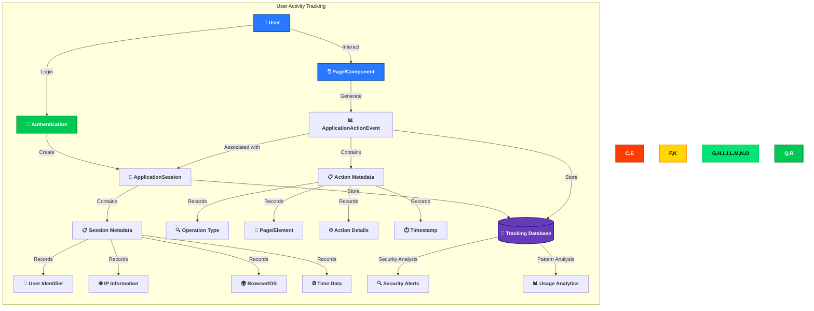

### ApplicationSession Tracking

Every user session is tracked with comprehensive metadata:

```java
public class ApplicationSession implements ModelObject {
    protected String sessionId;
    protected String userId;
    protected String ipInformation;
    protected String userAgentInformation;
    protected String operatingSystem;
    protected String screenSize;
    protected String timeZone;
    protected ApplicationSessionType sessionType;
    protected List<ApplicationActionEvent> events;
    protected Date createdDate;
    protected Date destroyedDate;
}
```

Key session tracking features:
- **🔑 Unique Session Identification**: Each session receives a unique ID
- **👤 User Attribution**: All sessions linked to authenticated or anonymous users
- **📡 Network Context**: IP address and location information
- **💻 Device Information**: Browser, OS, and screen characteristics
- **⏰ Temporal Tracking**: Complete session lifecycle timestamps
- **🔄 Session Type Classification**: Different session types for various contexts

### ApplicationActionEvent Tracking

Every user interaction with the system is recorded as an ApplicationActionEvent:

```java
public class ApplicationActionEvent implements ModelObject {
    protected ApplicationOperationType applicationOperation;
    protected ApplicationEventGroup eventGroup;
    protected String sessionId;
    protected String userId;
    protected String page;
    protected String pageMode;
    protected String elementId;
    protected String actionName;
    protected String errorMessage;
    protected String applicationMessage;
    protected Date createdDate;
}
```

Key action tracking features:
- **🔄 Operation Categorization**: Events classified by operation type
- **📊 Event Grouping**: Logical grouping of related events
- **🔗 Session Association**: Every event linked to its parent session
- **📱 UI Context**: Page, component, and element identification
- **🔍 Action Details**: Complete description of user action
- **⚠️ Error Tracking**: Any errors associated with the action
- **⏱️ Precise Timing**: Exact timestamp of each action

## 🔍 Security Event Monitoring

Our security event monitoring system captures, analyzes, and responds to security-related events throughout the application.

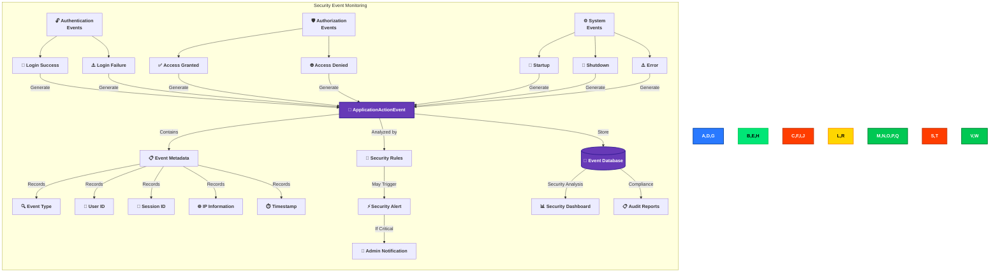

### Security Event Types

Our system monitors several categories of security events:

1. **🔓 Authentication Events**
   - Login success/failure
   - Password changes
   - MFA enrollments/verifications
   - Account lockouts

2. **🛡️ Authorization Events**
   - Access granted/denied to resources
   - Permission changes
   - Role assignments
   - Privilege escalations

3. **🔐 Data Security Events**
   - Sensitive data access
   - Unusual data operations
   - Large data retrievals
   - Encryption operations

4. **⚙️ System Events**
   - Application startup/shutdown
   - Configuration changes
   - System errors
   - Integration failures

### Event Monitoring Implementation

The system uses event listeners to capture security events:

```java
public class AuthorizationFailureEventListener 
        implements ApplicationListener<AuthorizationFailureEvent> {
    private static final String ACCESS_DENIED = "Access Denied";
    private static final String ERROR_MESSAGE_FORMAT = 
        "SECURITY:Url:{0} , Method{1} ,{2}{3}{4}{5} source:{6}";
    
    @Override
    public void onApplicationEvent(final AuthorizationFailureEvent authorizationFailureEvent) {
        // Event handling logic
        serviceRequest.setEventGroup(ApplicationEventGroup.APPLICATION);
        serviceRequest.setApplicationOperation(ApplicationOperationType.AUTHORIZATION);
        serviceRequest.setUserId(UserContextUtil.getUserIdFromSecurityContext());
        serviceRequest.setErrorMessage(MessageFormat.format(ERROR_MESSAGE_FORMAT, 
            requestUrl, methodInfo, AUTHORITIES, authorities, 
            REQUIRED_AUTHORITIES, configAttributes, 
            authorizationFailureEvent.getSource()));
        serviceRequest.setApplicationMessage(ACCESS_DENIED);
        
        applicationManager.service(serviceRequest);
    }
}
```

### Authentication Failure Tracking

The system implements thresholds for detecting authentication attacks:

```java
private static final String MAX_FAILED_LOGIN_ATTEMPTS_RECENT_HOUR_PER_IP = 
    "Max failed login attempts recent hour per ip";
private static final String MAX_FAILED_LOGIN_ATTEMPTS_RECENT_HOUR_PER_SESSION = 
    "Max failed login attempts recent hour per session";
private static final String MAX_FAILED_LOGIN_ATTEMPTS_RECENT_HOUR_PER_USER = 
    "Max failed login attempts recent hour per user";
```

## 🌐 Network Security

Our defense-in-depth network architecture implements multiple security layers.

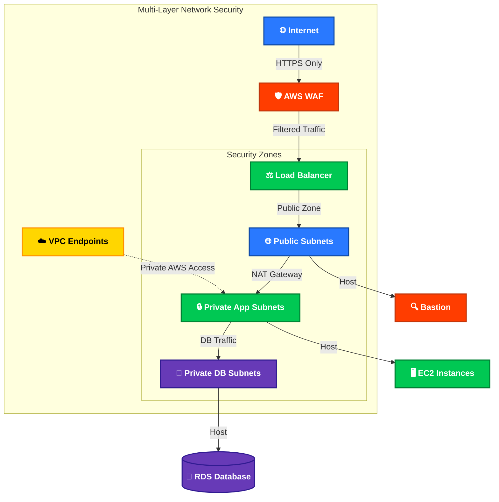

### Key Components

- **🛡️ AWS WAF**: Guards against OWASP Top 10 vulnerabilities
- **🌐 Network Segmentation**: Three isolated security zones with controlled traffic flow
- **🚪 NAT Gateways**: Secure outbound connectivity for private resources
- **🔥 Security Groups & NACLs**: Layered stateful and stateless filtering
- **📊 VPC Flow Logs**: Comprehensive traffic monitoring and anomaly detection
- **🔒 TLS Everywhere**: End-to-end encryption for all network traffic

## 🔌 VPC Endpoints Security

VPC Endpoints provide secure, private access to AWS services without internet exposure.

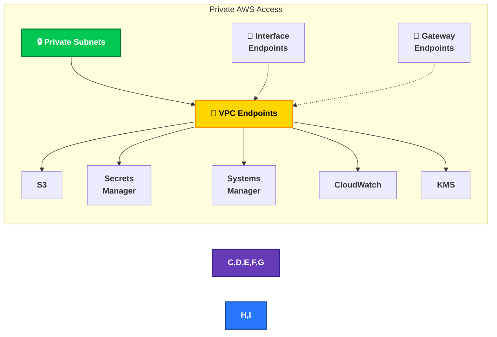

### Security Benefits

- **🔒 Private Connectivity**: Services accessed through AWS private network
- **🌐 No Internet Exposure**: Traffic never traverses the public internet
- **⚡ Performance**: Lower latency for AWS service requests
- **📄 Fine-Grained Control**: Endpoint policies restrict actions and resources
- **🔍 Audit Trail**: Complete logging of all endpoint activity

## 🏗️ High Availability Design

Our multi-AZ architecture ensures both security and resilience against infrastructure failures.

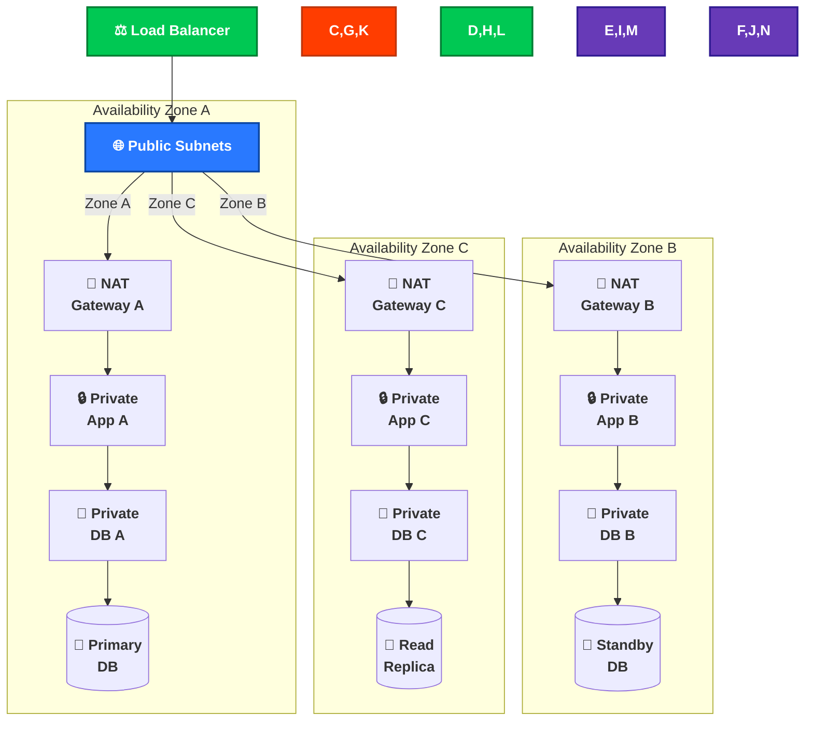

### Resilience Features

- **⚖️ Multi-AZ Load Balancing**: Traffic distribution across three availability zones
- **🚪 Redundant NAT Gateways**: One per AZ for fault-tolerant outbound connectivity
- **📊 Security Consistency**: Identical security controls across all zones
- **💾 Database Redundancy**: Multi-AZ deployment with automatic failover
- **⚡ Automatic Recovery**: Self-healing infrastructure with health checks

## 💾 Data Protection

Our comprehensive data protection strategy secures data throughout its lifecycle.

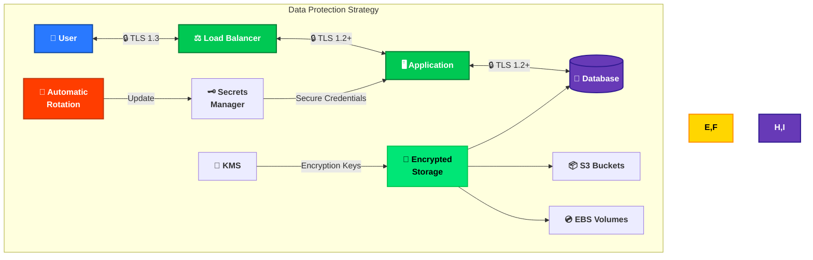

### Protection Mechanisms

- **🔒 End-to-End Encryption**: TLS for all communications
- **🔐 Data-at-Rest Encryption**: KMS encryption for databases, EBS volumes, and S3
- **🗝️ Secrets Management**: Secure credential storage with automated rotation
- **📦 S3 Security**: Server-side encryption, versioning, and access controls
- **🔑 Key Management**: Automatic key rotation and strict access controls

## ☁️ AWS Security Infrastructure

Our AWS security infrastructure provides comprehensive protection at all levels.

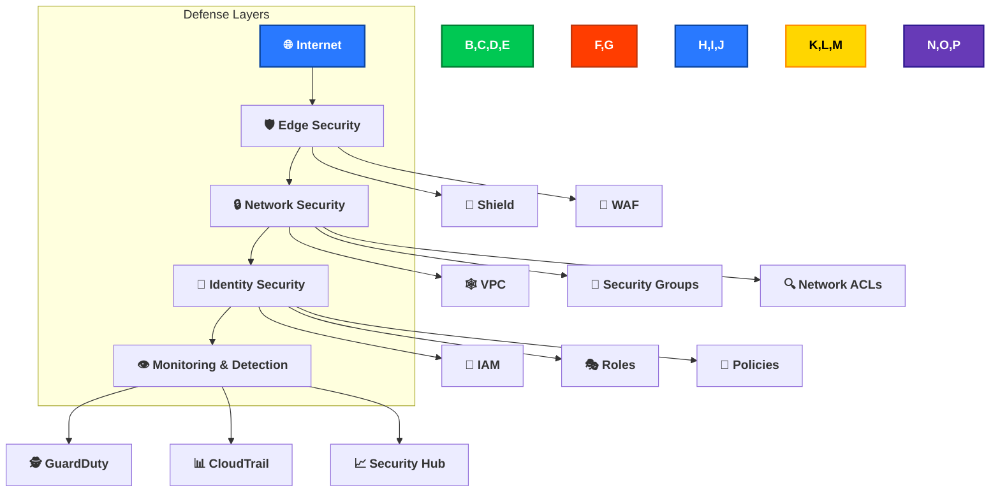

### Core AWS Security Services

- **🔰 AWS Shield**: DDoS protection at network and transport layers
- **🧱 AWS WAF**: Web application firewall with managed rule sets
- **🕸️ VPC Design**: Isolated network segments with controlled traffic flow
- **👥 IAM Framework**: Least-privilege access model with role-based permissions
- **🕵️ GuardDuty**: Continuous threat detection with machine learning
- **📈 Security Hub**: Unified security and compliance management

## 📊 Monitoring & Compliance

Our comprehensive monitoring system provides real-time visibility and rapid response capabilities.

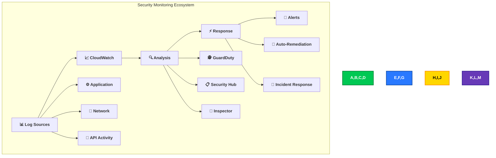

### Monitoring Components

- **📊 Centralized Logging**: CloudWatch for application, VPC Flow, and CloudTrail logs
- **🕵️ Threat Intelligence**: GuardDuty for anomaly detection and threat identification
- **🔎 Vulnerability Management**: Inspector for automated assessment
- **📋 Compliance Dashboard**: Security Hub for standards adherence
- **🚨 Alert Pipeline**: SNS-based notifications with severity classifications
- **🤖 Automated Response**: EventBridge rules for common security events

## 🤖 Automated Security Operations

Our automated security maintenance system ensures continuous protection.

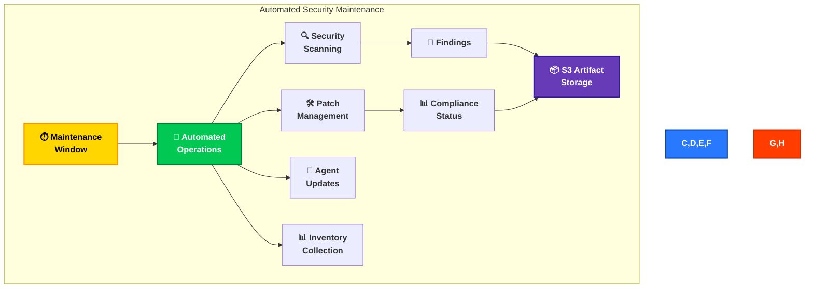

### AWS Systems Manager Maintenance Window

The CloudFormation template defines a comprehensive maintenance window for automated security operations:

```json
"MaintenanceWindow": {
    "Type": "AWS::SSM::MaintenanceWindow",
    "Properties": {
        "Description": "Daily Maintenance Window",
        "AllowUnassociatedTargets": false,
        "Cutoff": 0,
        "Schedule": "rate(1 hour)",
        "Duration": 1,
        "Name": "hourly-patching"
    }
}
```

This configuration ensures regular, automated security maintenance:
- Hourly execution schedule
- Defined maintenance window
- Controlled target selection via tags
- Automated output logging

### Automation Components

- **⏱️ Scheduled Maintenance**: Regular security operations on defined schedules
- **🛠️ Patch Management**: Automated security patch deployment and validation
- **🔄 Agent Updates**: SSM agent and security tool updates
- **📊 Inventory Tracking**: Software and configuration monitoring
- **🔍 Compliance Verification**: Automated checks against security baselines

## 🔒 Application Security

Our application implements robust security controls at the code level.

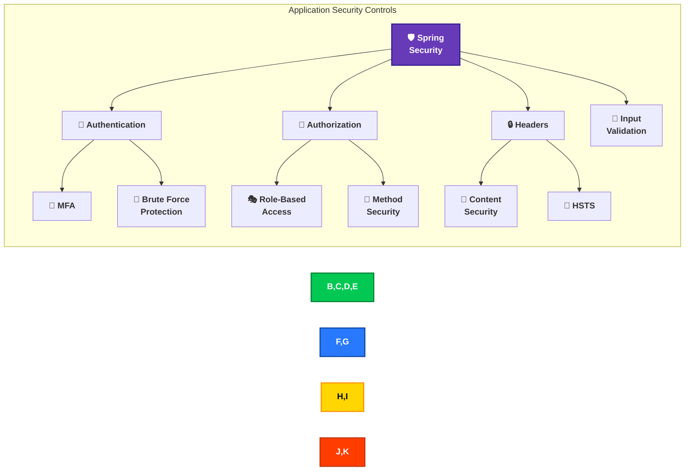

### Method-Level Security Implementation

The application implements `@Secured` annotations for fine-grained access control:

```java
@Secured({ "ROLE_USER", "ROLE_ADMIN" })
public DataContainer<UserAccount> getUserAccountByEmail(ServiceRequest serviceRequest) {
    // Implementation details...
}

@Secured({ "ROLE_ADMIN" })
public ServiceResponse updateApplicationConfiguration(ServiceRequest serviceRequest) {
    // Implementation details...
}
```

Each secured method enforces specific role requirements:
- `ROLE_ANONYMOUS`: Unauthenticated access (limited functionality)
- `ROLE_USER`: Standard authenticated user access
- `ROLE_ADMIN`: Administrative privileges for sensitive operations

### Application Security Features

- **🛡️ Spring Security Framework**: Enterprise-grade security integration
- **🔐 Authentication**: Multi-factor and password-based with BCrypt hashing
- **🔑 Role-Based Access Control**: Fine-grained authorization with method annotations
- **🔒 Security Headers**: CSP, HSTS, X-Content-Type-Options, and Referrer-Policy
- **🛑 Input Validation**: Both client and server-side validation

## 📋 Compliance Framework

Our security architecture aligns with key compliance frameworks.

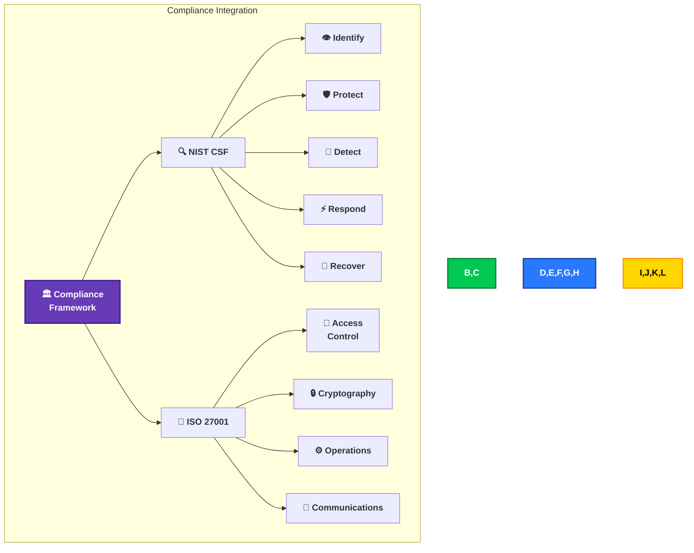

### NIST Cybersecurity Framework Mapping

| Function | Category | Implementation |
|----------|----------|----------------|
| **Identify (ID)** | Asset Management (ID.AM) | AWS Config for resource inventory |
| | Risk Assessment (ID.RA) | Security Hub risk scoring |
| **Protect (PR)** | Identity Management (PR.AC) | IAM, Spring Security, MFA |
| | Data Security (PR.DS) | Encryption at rest and in transit |
| | Protective Technology (PR.PT) | WAF, Security Groups, Network ACLs |
| **Detect (DE)** | Anomalies and Events (DE.AE) | CloudWatch, GuardDuty |
| | Security Monitoring (DE.CM) | VPC Flow Logs, CloudTrail |
| **Respond (RS)** | Response Planning (RS.RP) | SNS alerting, Security Hub |
| | Analysis (RS.AN) | Detective, Security Hub |
| **Recover (RC)** | Recovery Planning (RC.RP) | AWS Backup, Multi-AZ deployment |
| | Improvements (RC.IM) | Automated remediations |

### Framework Alignment

- **🔍 NIST Cybersecurity Framework**: Complete implementation of all core functions
- **🔐 ISO 27001 Controls**: Alignment with key control domains
- **📊 Security Hub Standards**: Automated compliance verification
- **📝 Documentation**: Comprehensive policy and procedure documentation

## 🛡️ Defense-in-Depth Strategy

Our security architecture implements multiple protective layers to create a comprehensive defense.

```mermaid
graph LR
    A[👤 User<br>Request] --> B[🌐 DNS]
    B --> C[🧱 WAF]
    C --> D[🔒 Network]
    D --> E[💻 Host]
    E --> F[⚙️ Application]
    F --> G[💾 Data]
    
    style A fill:#2979FF,stroke:#0D47A1,stroke-width:2px,color:white,font-weight:bold
    style B fill:#673AB7,stroke:#311B92,stroke-width:2px,color:white,font-weight:bold
    style C fill:#FF3D00,stroke:#BF360C,stroke-width:2px,color:white,font-weight:bold
    style D fill:#00C853,stroke:#007E33,stroke-width:2px,color:white,font-weight:bold
    style E fill:#FFD600,stroke:#FF8F00,stroke-width:2px,color:black,font-weight:bold
    style F fill:#673AB7,stroke:#311B92,stroke-width:2px,color:white,font-weight:bold
    style G fill:#00C853,stroke:#007E33,stroke-width:2px,color:white,font-weight:bold
    classDef default font-weight:bold
```

### Security Layers

Each layer provides distinct security controls:

- **🌐 DNS Security**: Route 53 with DNSSEC and query logging
- **🧱 WAF Protection**: Rule-based filtering for OWASP Top 10 vulnerabilities
- **🔒 Network Security**: Segmentation, ACLs, and encryption
- **💻 Host Security**: Hardened AMIs, encryption, and patch management
- **⚙️ Application Security**: Authentication, authorization, and input validation
- **💾 Data Security**: Encryption, access controls, and integrity verification

## 🔄 Security Operations

Our continuous security operations ensure the environment remains protected.

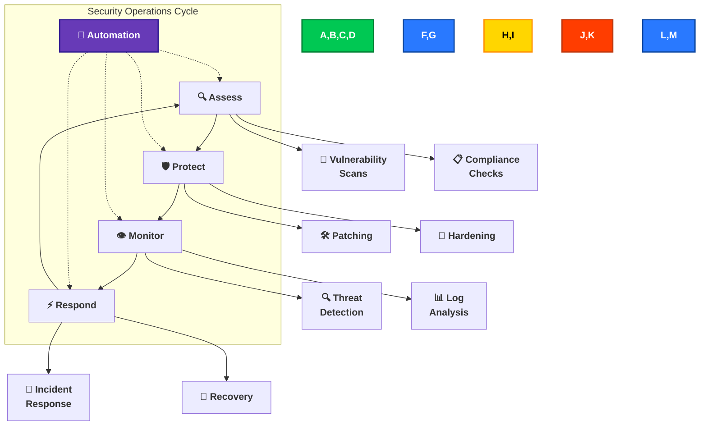

### Operations Components

- **🔍 Security Assessment**: Regular vulnerability scans and penetration tests
- **🛡️ Protection Controls**: Continuous hardening and configuration management
- **👁️ Monitoring**: Real-time detection of security events
- **⚡ Incident Response**: Structured process for security incidents
- **🤖 Automation**: Programmatic security operations across the lifecycle

## 📝 Conclusion

The Citizen Intelligence Agency employs a comprehensive, defense-in-depth security architecture that spans from application-level controls to infrastructure security. By implementing multiple layers of protection with high availability designs, we ensure the confidentiality, integrity, and availability of sensitive political data.

### Key Security Highlights

- 🔐 Multi-factor authentication with sophisticated brute force protection
- 🛡️ AWS WAF and Shield protection against web-based attacks
- 🔒 Comprehensive encryption for data at rest and in transit
- 🌐 Redundant multi-AZ architecture with NAT Gateways for resilience
- 🔌 VPC Endpoints for secure AWS service access
- 👁️ Continuous monitoring with GuardDuty, Inspector, and Security Hub
- 📜 Complete data integrity with Javers versioning and author attribution
- 📊 Comprehensive session tracking and user action auditing with ApplicationSession and ApplicationActionEvent
- 🔍 Detailed security event monitoring with multiple event types
- 🤖 Automated security operations with Systems Manager

For detailed implementation costs and specific AWS security services, refer to the [Financial Security Plan](FinancialSecurityPlan.md).
