<p align="center">
  
</p>

<h1 align="center">🛡️ Citizen Intelligence Agency — Security Architecture</h1>

<p align="center">
  <strong>🔐 Defense-in-Depth Protection for Democratic Transparency</strong><br>
  <em>🎯 Comprehensive Security Framework for Political Data Analysis Platform</em>
</p>

<p align="center">
  <a href="#"></a>
  <a href="#"></a>
  <a href="#"></a>
  <a href="#"></a>
</p>

**📋 Document Owner:** CEO | **📄 Version:** 1.1 | **📅 Last Updated:** 2026-04-20 (UTC)  
**🔄 Review Cycle:** Annual | **⏰ Next Review:** 2027-04-20  
**🏷️ Classification:** Public (Open Civic Transparency Platform)

---

## 🎯 Purpose

This document outlines the comprehensive security architecture of the Citizen Intelligence Agency platform, detailing how we protect our systems and data through multiple security layers while maintaining transparency and accountability in democratic oversight.

## 📑 Table of Contents

- [🔐 Security Documentation Map](#-security-documentation-map)
- [🔑 Authentication Architecture](#-authentication-architecture)
- [📜 Data Integrity & Auditing](#-data-integrity--auditing)
- [📊 Session & Action Tracking](#-session--action-tracking)
- [🔍 Security Event Monitoring](#-security-event-monitoring)
- [🌐 Network Security](#-network-security)
- [🔌 VPC Endpoints Security](#-vpc-endpoints-security)
- [🏗️ High Availability Design](#-high-availability-design)
- [💾 Data Protection](#-data-protection)
- [☁️ AWS Security Infrastructure](#-aws-security-infrastructure)
- [🔰 AWS Foundational Security Best Practices](#-aws-foundational-security-best-practices)
- [🕵️ Threat Detection & Investigation](#-threat-detection--investigation)
- [🔎 Vulnerability Management](#-vulnerability-management)
- [⚡ Resilience & Operational Readiness](#-resilience--operational-readiness)
- [📋 Configuration & Compliance Management](#-configuration--compliance-management)
- [📊 Monitoring & Analytics](#-monitoring--analytics)
- [🤖 Automated Security Operations](#-automated-security-operations)
- [🔒 Application Security](#-application-security)
- [📜 Compliance Framework](#-compliance-framework)
- [🛡️ Defense-in-Depth Strategy](#-defense-in-depth-strategy)
- [🔄 Security Operations](#-security-operations)
- [💰 Security Investment](#-security-investment)
- [📝 Conclusion](#-conclusion)

## 📚 Related Documents

| Document | Focus | Description |
|----------|-------|-------------|
| [🛡️ Security Architecture](SECURITY_ARCHITECTURE.md) | Current State | Complete security implementation overview |
| [🔐 ISMS Compliance Mapping](ISMS_COMPLIANCE_MAPPING.md) | Policy Framework | Comprehensive ISMS-PUBLIC policy mapping |
| [🚀 Future Security Architecture](FUTURE_SECURITY_ARCHITECTURE.md) | Roadmap | Future security enhancements and capabilities |
| [💰 Financial Security Plan](FinancialSecurityPlan.md) | Investment | AWS security implementation costs and ROI |
| [🏛️ Architecture](ARCHITECTURE.md) | System Design | Overall platform architecture |
| [📅 End-of-Life Strategy](End-of-Life-Strategy.md) | Lifecycle | Technology maintenance and patching strategy |
| [🎯 Threat Model](THREAT_MODEL.md) | Risk Analysis | STRIDE/MITRE ATT&CK threat analysis |
| [🔮 Future Threat Model](FUTURE_THREAT_MODEL.md) | Risk Analysis | Future threat landscape (AI/PQC/2026-2037) |
| [🛡️ CRA Assessment](CRA-ASSESSMENT.md) | Compliance | EU Cyber Resilience Act conformity |
| [📋 Business Continuity Plan](BCPPlan.md) | Resilience | RTO/RPO targets and recovery procedures |
| [💼 Business Product Document](BUSINESS_PRODUCT_DOCUMENT.md) | Business | Data analytics and risk intelligence products |

## 🔑 Authentication Architecture

Our multi-layered authentication and authorization process includes MFA (implemented with optional enrollment), login blocking, and role-based access control powered by Spring Security 5.8.16.

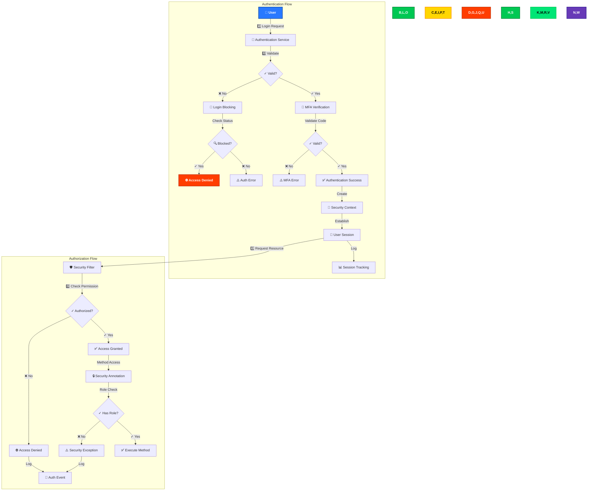
```mermaid
flowchart TD
    subgraph "Authentication Flow"
        direction TB
        A[👤 User] -->|"1️⃣ Login Request"| B[🔐 Authentication Service]
        B -->|"2️⃣ Validate"| C{✓ Valid?}
        
        C -->|"❌ No"| D[🚫 Login Blocking]
        D -->|"Check Status"| E{🔍 Blocked?}
        E -->|"✓ Yes"| F[⛔ Access Denied]
        E -->|"❌ No"| G[⚠️ Auth Error]
        
        C -->|"✓ Yes"| H[🔢 MFA Verification]
        H -->|"Validate Code"| I{✓ Valid?}
        I -->|"❌ No"| J[⚠️ MFA Error]
        I -->|"✓ Yes"| K[✅ Authentication Success]
        
        K -->|"Create"| L[🔑 Security Context]
        L -->|"Establish"| M[👤 User Session]
        M -->|"Log"| N[📊 Session Tracking]
    end

    subgraph "Authorization Flow"
        direction TB
        M -->|"1️⃣ Request Resource"| O[🛡️ Security Filter]
        O -->|"2️⃣ Check Permission"| P{✓ Authorized?}
        P -->|"❌ No"| Q[⛔ Access Denied]
        P -->|"✓ Yes"| R[✅ Access Granted]
        
        R -->|"Method Access"| S[🔒 Security Annotation]
        S -->|"Role Check"| T{✓ Has Role?}
        T -->|"❌ No"| U[⚠️ Security Exception]
        T -->|"✓ Yes"| V[✅ Execute Method]
        
        Q & U -->|"Log"| W[📝 Auth Event]
    end
    
    style A fill:#2979FF,stroke:#0D47A1,stroke-width:2px,color:white,font-weight:bold
    style B,L,O fill:#00C853,stroke:#007E33,stroke-width:2px,color:white,font-weight:bold
    style C,E,I,P,T fill:#FFD600,stroke:#FF8F00,stroke-width:2px,color:black,font-weight:bold
    style D,G,J,Q,U fill:#FF3D00,stroke:#BF360C,stroke-width:2px,color:white,font-weight:bold
    style F fill:#FF3D00,stroke:#BF360C,stroke-width:2px,color:white,font-weight:bold
    style H,S fill:#00C853,stroke:#007E33,stroke-width:2px,color:white,font-weight:bold
    style K,M,R,V fill:#00E676,stroke:#00C853,stroke-width:2px,color:black,font-weight:bold
    style N,W fill:#673AB7,stroke:#311B92,stroke-width:2px,color:white,font-weight:bold
```

### Key Components

- **🔐 Multi-Factor Authentication**: Google Authenticator OTP integration
- **🚫 Brute Force Protection**: IP, session, and user-based blocking with configurable thresholds
- **👥 Role-Based Access**: Three security tiers (Anonymous, User, Admin)
- **🔒 Method-Level Security**: `@Secured` annotations for fine-grained control
- **📤 Secure Logout**: Complete session invalidation with audit logging

### Login Blocking Protection

The system implements sophisticated login blocking mechanisms:

```java
private static final String MAX_FAILED_LOGIN_ATTEMPTS_RECENT_HOUR_PER_IP = 
    "Max failed login attempts recent hour per ip";
private static final String MAX_FAILED_LOGIN_ATTEMPTS_RECENT_HOUR_PER_SESSION = 
    "Max failed login attempts recent hour per session";
private static final String MAX_FAILED_LOGIN_ATTEMPTS_RECENT_HOUR_PER_USER = 
    "Max failed login attempts recent hour per user";
```

These thresholds can be configured via the application's administrative interface to adjust security posture based on threat conditions.

## 📜 Data Integrity & Auditing

Our auditing system provides comprehensive traceability and data integrity protection through Javers versioning.

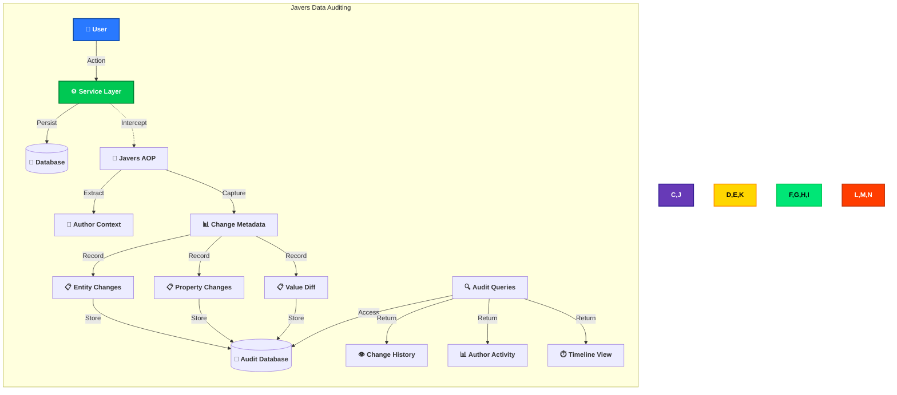
```mermaid
flowchart TD
    subgraph "Javers Data Auditing"
        direction TB
        A[👤 User] -->|"Action"| B[⚙️ Service Layer]
        B -->|"Persist"| C[(💾 Database)]
        
        B -.->|"Intercept"| D[📝 Javers AOP]
        D -->|"Extract"| E[👤 Author Context]
        D -->|"Capture"| F[📊 Change Metadata]
        
        F -->|"Record"| G[📋 Entity Changes]
        F -->|"Record"| H[📋 Property Changes]
        F -->|"Record"| I[📋 Value Diff]
        
        G & H & I -->|"Store"| J[(📜 Audit Database)]
        
        K[🔍 Audit Queries] -->|"Access"| J
        K -->|"Return"| L[👁️ Change History]
        K -->|"Return"| M[📊 Author Activity]
        K -->|"Return"| N[⏱️ Timeline View]
    end
    
    style A fill:#2979FF,stroke:#0D47A1,stroke-width:2px,color:white,font-weight:bold
    style B fill:#00C853,stroke:#007E33,stroke-width:2px,color:white,font-weight:bold
    style C,J fill:#673AB7,stroke:#311B92,stroke-width:2px,color:white,font-weight:bold
    style D,E,K fill:#FFD600,stroke:#FF8F00,stroke-width:2px,color:black,font-weight:bold
    style F,G,H,I fill:#00E676,stroke:#00C853,stroke-width:2px,color:black,font-weight:bold
    style L,M,N fill:#FF3D00,stroke:#BF360C,stroke-width:2px,color:white,font-weight:bold
    classDef default font-weight:bold
```

### Javers Audit Components

- **📝 AOP Interception**: Transparent capture of all data changes
- **👤 Author Tracking**: Every change attributed to the authenticated user
- **📊 Complete Change History**: Entity, property, and value-level auditing
- **📋 Property-Level Tracking**: Detailed before/after snapshots for all changes
- **⏱️ Temporal Data Access**: Historical view of data at any point in time

### Javers Implementation

Our system uses Javers to provide comprehensive audit trails and data versioning capabilities:

```java
@Bean
public Javers getJavers(final PlatformTransactionManager txManager) {
    final JaversSqlRepository sqlRepository = SqlRepositoryBuilder.sqlRepository()
            .withConnectionProvider(new ConnectionProvider() {
                @Override
                public Connection getConnection() {
                    final SharedSessionContractImplementor session = 
                        entityManager.unwrap(SharedSessionContractImplementor.class);
                    return session.connection();
                }
            }).withDialect(DialectName.POSTGRES).build();

    return TransactionalJpaJaversBuilder.javers().withTxManager(txManager)
            .withObjectAccessHook(new HibernateUnproxyObjectAccessHook())
            .registerJaversRepository(sqlRepository)
            .withMappingStyle(MappingStyle.BEAN).build();
}
```

The author attribution system ensures every change is linked to the user who made it:

```java
@Bean
public AuthorProvider authorProvider() {
    return () -> {
        final SecurityContext context = SecurityContextHolder.getContext();
        if (context != null && context.getAuthentication() != null) {
            return context.getAuthentication().getPrincipal().toString();
        } else {
            return "system";
        }
    };
}
```

## 📊 Session & Action Tracking

Our comprehensive user activity tracking system records all user sessions and actions for security monitoring and audit purposes.

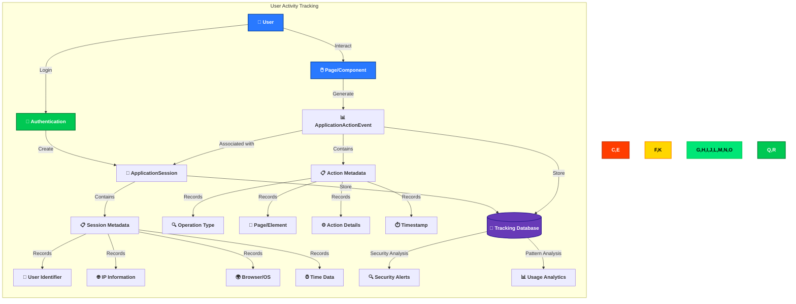
```mermaid
flowchart TD
    subgraph "User Activity Tracking"
        direction TB
        A[👤 User] -->|"Login"| B[🔑 Authentication]
        B -->|"Create"| C[📝 ApplicationSession]
        
        A -->|"Interact"| D[🖱️ Page/Component]
        D -->|"Generate"| E[📊 ApplicationActionEvent]
        E -->|"Associated with"| C
        
        C -->|"Contains"| F[📋 Session Metadata]
        F -->|"Records"| G[👤 User Identifier]
        F -->|"Records"| H[🌐 IP Information]
        F -->|"Records"| I[🌍 Browser/OS]
        F -->|"Records"| J[⏰ Time Data]
        
        E -->|"Contains"| K[📋 Action Metadata]
        K -->|"Records"| L[🔍 Operation Type]
        K -->|"Records"| M[📄 Page/Element]
        K -->|"Records"| N[⚙️ Action Details]
        K -->|"Records"| O[⏱️ Timestamp]
        
        C & E -->|"Store"| P[(💾 Tracking Database)]
        P -->|"Security Analysis"| Q[🔍 Security Alerts]
        P -->|"Pattern Analysis"| R[📊 Usage Analytics]
    end
    
    style A fill:#2979FF,stroke:#0D47A1,stroke-width:2px,color:white,font-weight:bold
    style B fill:#00C853,stroke:#007E33,stroke-width:2px,color:white,font-weight:bold
    style C,E fill:#FF3D00,stroke:#BF360C,stroke-width:2px,color:white,font-weight:bold
    style D fill:#2979FF,stroke:#0D47A1,stroke-width:2px,color:white,font-weight:bold
    style F,K fill:#FFD600,stroke:#FF8F00,stroke-width:2px,color:black,font-weight:bold
    style G,H,I,J,L,M,N,O fill:#00E676,stroke:#00C853,stroke-width:2px,color:black,font-weight:bold
    style P fill:#673AB7,stroke:#311B92,stroke-width:2px,color:white,font-weight:bold
    style Q,R fill:#00C853,stroke:#007E33,stroke-width:2px,color:white,font-weight:bold
    classDef default font-weight:bold
```

### ApplicationSession Tracking

Every user session is tracked with comprehensive metadata:

```java
public class ApplicationSession implements ModelObject {
    protected String sessionId;
    protected String userId;
    protected String ipInformation;
    protected String userAgentInformation;
    protected String operatingSystem;
    protected String screenSize;
    protected String timeZone;
    protected ApplicationSessionType sessionType;
    protected List<ApplicationActionEvent> events;
    protected Date createdDate;
    protected Date destroyedDate;
}
```

Key session tracking features:
- **🔑 Unique Session Identification**: Each session receives a unique ID
- **👤 User Attribution**: All sessions linked to authenticated or anonymous users
- **📡 Network Context**: IP address and location information
- **💻 Device Information**: Browser, OS, and screen characteristics
- **⏰ Temporal Tracking**: Complete session lifecycle timestamps
- **🔄 Session Type Classification**: Different session types for various contexts

### ApplicationActionEvent Tracking

Every user interaction with the system is recorded as an ApplicationActionEvent:

```java
public class ApplicationActionEvent implements ModelObject {
    protected ApplicationOperationType applicationOperation;
    protected ApplicationEventGroup eventGroup;
    protected String sessionId;
    protected String userId;
    protected String page;
    protected String pageMode;
    protected String elementId;
    protected String actionName;
    protected String errorMessage;
    protected String applicationMessage;
    protected Date createdDate;
}
```

Key action tracking features:
- **🔄 Operation Categorization**: Events classified by operation type
- **📊 Event Grouping**: Logical grouping of related events
- **🔗 Session Association**: Every event linked to its parent session
- **📱 UI Context**: Page, component, and element identification
- **🔍 Action Details**: Complete description of user action
- **⚠️ Error Tracking**: Any errors associated with the action
- **⏱️ Precise Timing**: Exact timestamp of each action

## 🔍 Security Event Monitoring

Our security event monitoring system captures, analyzes, and responds to security-related events throughout the application.

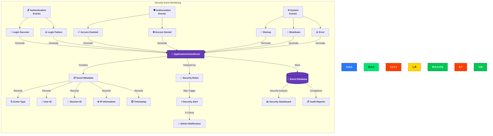
```mermaid
flowchart TD
    subgraph "Security Event Monitoring"
        direction TB
        A[🔓 Authentication<br>Events] --> B[🔑 Login Success]
        A --> C[⚠️ Login Failure]
        
        D[🛡️ Authorization<br>Events] --> E[✅ Access Granted]
        D --> F[⛔ Access Denied]
        
        G[⚙️ System<br>Events] --> H[🚀 Startup]
        G --> I[🛑 Shutdown]
        G --> J[⚠️ Error]
        
        B & C & E & F & H & I & J -->|"Generate"| K[📝 ApplicationActionEvent]
        
        K -->|"Contains"| L[📋 Event Metadata]
        L -->|"Records"| M[🔍 Event Type]
        L -->|"Records"| N[👤 User ID]
        L -->|"Records"| O[🔗 Session ID]
        L -->|"Records"| P[🌐 IP Information]
        L -->|"Records"| Q[⏱️ Timestamp]
        
        K -->|"Analyzed by"| R[🚨 Security Rules]
        R -->|"May Trigger"| S[⚡ Security Alert]
        S -->|"If Critical"| T[👥 Admin Notification]
        
        K -->|"Store"| U[(💾 Event Database)]
        U -->|"Security Analysis"| V[📊 Security Dashboard]
        U -->|"Compliance"| W[📋 Audit Reports]
    end
    
    style A,D,G fill:#2979FF,stroke:#0D47A1,stroke-width:2px,color:white,font-weight:bold
    style B,E,H fill:#00E676,stroke:#00C853,stroke-width:2px,color:black,font-weight:bold
    style C,F,I,J fill:#FF3D00,stroke:#BF360C,stroke-width:2px,color:white,font-weight:bold
    style K fill:#673AB7,stroke:#311B92,stroke-width:2px,color:white,font-weight:bold
    style L,R fill:#FFD600,stroke:#FF8F00,stroke-width:2px,color:black,font-weight:bold
    style M,N,O,P,Q fill:#00C853,stroke:#007E33,stroke-width:2px,color:white,font-weight:bold
    style S,T fill:#FF3D00,stroke:#BF360C,stroke-width:2px,color:white,font-weight:bold
    style U fill:#673AB7,stroke:#311B92,stroke-width:2px,color:white,font-weight:bold
    style V,W fill:#00C853,stroke:#007E33,stroke-width:2px,color:white,font-weight:bold
    classDef default font-weight:bold
```

### Security Event Types

Our system monitors several categories of security events:

1. **🔓 Authentication Events**
   - Login success/failure
   - Password changes
   - MFA enrollments/verifications
   - Account lockouts

2. **🛡️ Authorization Events**
   - Access granted/denied to resources
   - Permission changes
   - Role assignments
   - Privilege escalations

3. **🔐 Data Security Events**
   - Sensitive data access
   - Unusual data operations
   - Large data retrievals
   - Encryption operations

4. **⚙️ System Events**
   - Application startup/shutdown
   - Configuration changes
   - System errors
   - Integration failures

### Event Monitoring Implementation

The system uses event listeners to capture security events:

```java
public class AuthorizationFailureEventListener 
        implements ApplicationListener<AuthorizationFailureEvent> {
    private static final String ACCESS_DENIED = "Access Denied";
    private static final String ERROR_MESSAGE_FORMAT = 
        "SECURITY:Url:{0} , Method{1} ,{2}{3}{4}{5} source:{6}";
    
    @Override
    public void onApplicationEvent(final AuthorizationFailureEvent authorizationFailureEvent) {
        // Event handling logic
        serviceRequest.setEventGroup(ApplicationEventGroup.APPLICATION);
        serviceRequest.setApplicationOperation(ApplicationOperationType.AUTHORIZATION);
        serviceRequest.setUserId(UserContextUtil.getUserIdFromSecurityContext());
        serviceRequest.setErrorMessage(MessageFormat.format(ERROR_MESSAGE_FORMAT, 
            requestUrl, methodInfo, AUTHORITIES, authorities, 
            REQUIRED_AUTHORITIES, configAttributes, 
            authorizationFailureEvent.getSource()));
        serviceRequest.setApplicationMessage(ACCESS_DENIED);
        
        applicationManager.service(serviceRequest);
    }
}
```

### Authentication Failure Tracking

The system implements thresholds for detecting authentication attacks:

```java
private static final String MAX_FAILED_LOGIN_ATTEMPTS_RECENT_HOUR_PER_IP = 
    "Max failed login attempts recent hour per ip";
private static final String MAX_FAILED_LOGIN_ATTEMPTS_RECENT_HOUR_PER_SESSION = 
    "Max failed login attempts recent hour per session";
private static final String MAX_FAILED_LOGIN_ATTEMPTS_RECENT_HOUR_PER_USER = 
    "Max failed login attempts recent hour per user";
```

## 🌐 Network Security

Our defense-in-depth network architecture implements multiple security layers.

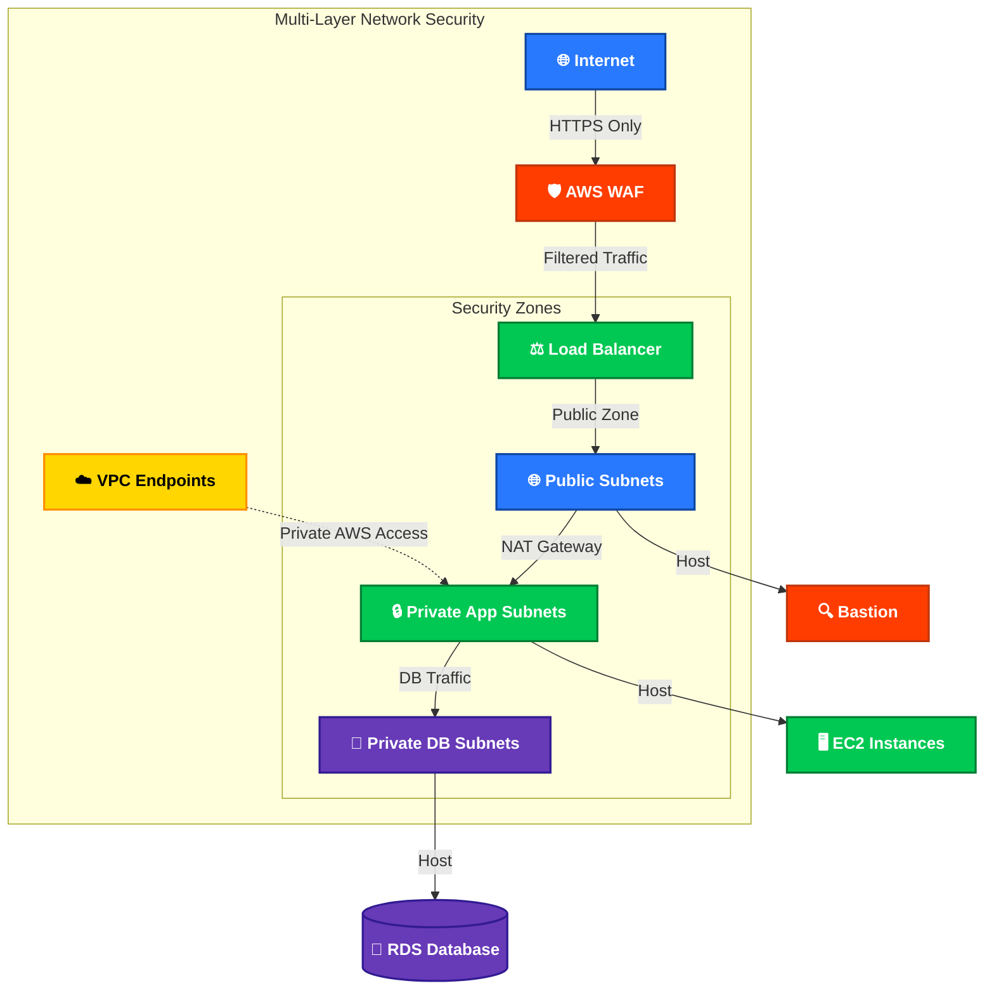
```mermaid
graph TD
    subgraph "Multi-Layer Network Security"
        A[🌐 Internet] -->|"HTTPS Only"| B[🛡️ AWS WAF]
        B -->|"Filtered Traffic"| C[⚖️ Load Balancer]
        
        subgraph "Security Zones"
            C -->|"Public Zone"| D[🌐 Public Subnets]
            D -->|"NAT Gateway"| E[🔒 Private App Subnets]
            E -->|"DB Traffic"| F[🔐 Private DB Subnets]
        end
        
        G[☁️ VPC Endpoints] -.->|"Private AWS Access"| E
    end
    
    D -->|"Host"| H[🔍 Bastion]
    E -->|"Host"| I[🖥️ EC2 Instances]
    F -->|"Host"| J[(💾 RDS Database)]
    
    style A fill:#2979FF,stroke:#0D47A1,stroke-width:2px,color:white,font-weight:bold
    style B fill:#FF3D00,stroke:#BF360C,stroke-width:2px,color:white,font-weight:bold
    style C fill:#00C853,stroke:#007E33,stroke-width:2px,color:white,font-weight:bold
    style D fill:#2979FF,stroke:#0D47A1,stroke-width:2px,color:white,font-weight:bold
    style E fill:#00C853,stroke:#007E33,stroke-width:2px,color:white,font-weight:bold
    style F fill:#673AB7,stroke:#311B92,stroke-width:2px,color:white,font-weight:bold
    style G fill:#FFD600,stroke:#FF8F00,stroke-width:2px,color:black,font-weight:bold
    style H fill:#FF3D00,stroke:#BF360C,stroke-width:2px,color:white,font-weight:bold
    style I fill:#00C853,stroke:#007E33,stroke-width:2px,color:white,font-weight:bold
    style J fill:#673AB7,stroke:#311B92,stroke-width:2px,color:white,font-weight:bold
    classDef default font-weight:bold
```

### Key Components

- **🛡️ AWS WAF**: Guards against OWASP Top 10 vulnerabilities
- **🌐 Network Segmentation**: Three isolated security zones with controlled traffic flow
- **🚪 NAT Gateways**: Secure outbound connectivity for private resources
- **🔥 Security Groups & NACLs**: Layered stateful and stateless filtering
- **📊 VPC Flow Logs**: Comprehensive traffic monitoring and anomaly detection
- **🔒 TLS Everywhere**: End-to-end encryption for all network traffic

## 🔌 VPC Endpoints Security

VPC Endpoints provide secure, private access to AWS services without internet exposure.

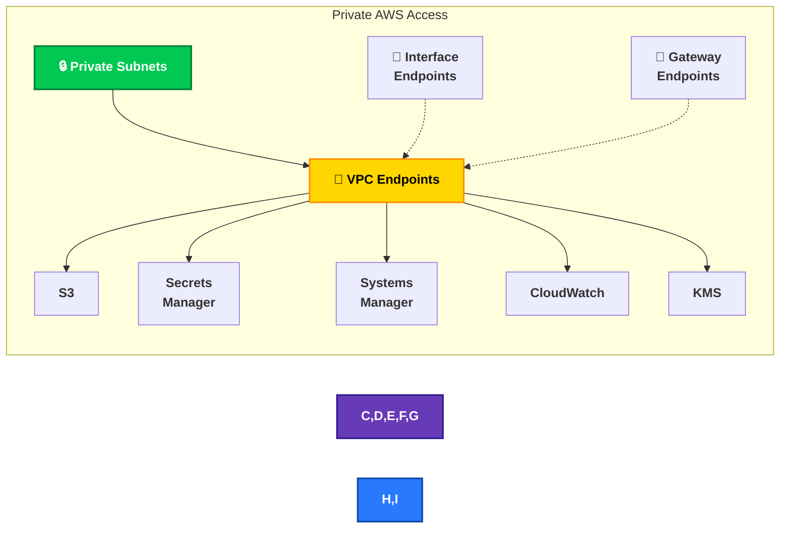
```mermaid
flowchart LR
    subgraph "Private AWS Access"
        A[🔒 Private Subnets] --> B[🔌 VPC Endpoints]
        
        B --> C[S3]
        B --> D[Secrets<br>Manager]
        B --> E[Systems<br>Manager]
        B --> F[CloudWatch]
        B --> G[KMS]
        
        H[🚪 Interface<br>Endpoints] -.-> B
        I[🔄 Gateway<br>Endpoints] -.-> B
    end
    
    style A fill:#00C853,stroke:#007E33,stroke-width:2px,color:white,font-weight:bold
    style B fill:#FFD600,stroke:#FF8F00,stroke-width:2px,color:black,font-weight:bold
    style C,D,E,F,G fill:#673AB7,stroke:#311B92,stroke-width:2px,color:white,font-weight:bold
    style H,I fill:#2979FF,stroke:#0D47A1,stroke-width:2px,color:white,font-weight:bold
    classDef default font-weight:bold
```

### Security Benefits

- **🔒 Private Connectivity**: Services accessed through AWS private network
- **🌐 No Internet Exposure**: Traffic never traverses the public internet
- **⚡ Performance**: Lower latency for AWS service requests
- **📄 Fine-Grained Control**: Endpoint policies restrict actions and resources
- **🔍 Audit Trail**: Complete logging of all endpoint activity

## 🏗️ High Availability Design

Our multi-AZ architecture ensures both security and resilience against infrastructure failures.

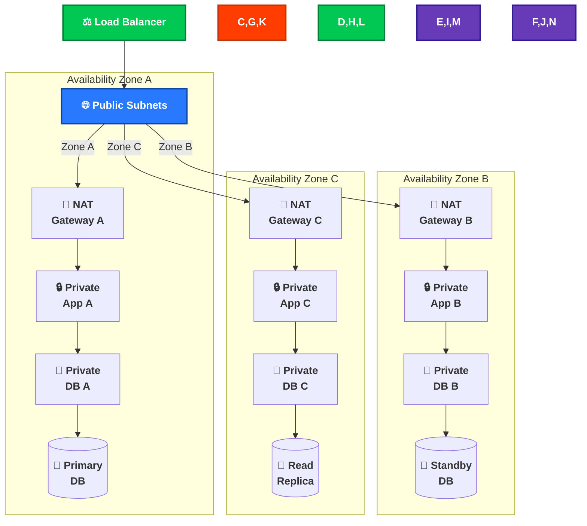
```mermaid
graph TD
    A[⚖️ Load Balancer] --> B[🌐 Public Subnets]
    
    subgraph "Availability Zone A"
        B --> |"Zone A"| C[🚪 NAT<br>Gateway A]
        C --> D[🔒 Private<br>App A]
        D --> E[🔐 Private<br>DB A]
        E --> F[(💾 Primary<br>DB)]
    end
    
    subgraph "Availability Zone B"
        B --> |"Zone B"| G[🚪 NAT<br>Gateway B]
        G --> H[🔒 Private<br>App B]
        H --> I[🔐 Private<br>DB B]
        I --> J[(💾 Standby<br>DB)]
    end
    
    subgraph "Availability Zone C"
        B --> |"Zone C"| K[🚪 NAT<br>Gateway C]
        K --> L[🔒 Private<br>App C]
        L --> M[🔐 Private<br>DB C]
        M --> N[(💾 Read<br>Replica)]
    end
    
    style A fill:#00C853,stroke:#007E33,stroke-width:2px,color:white,font-weight:bold
    style B fill:#2979FF,stroke:#0D47A1,stroke-width:2px,color:white,font-weight:bold
    style C,G,K fill:#FF3D00,stroke:#BF360C,stroke-width:2px,color:white,font-weight:bold
    style D,H,L fill:#00C853,stroke:#007E33,stroke-width:2px,color:white,font-weight:bold
    style E,I,M fill:#673AB7,stroke:#311B92,stroke-width:2px,color:white,font-weight:bold
    style F,J,N fill:#673AB7,stroke:#311B92,stroke-width:2px,color:white,font-weight:bold
    classDef default font-weight:bold
```

### Resilience Features

- **⚖️ Multi-AZ Load Balancing**: Traffic distribution across three availability zones
- **🚪 Redundant NAT Gateways**: One per AZ for fault-tolerant outbound connectivity
- **📊 Security Consistency**: Identical security controls across all zones
- **💾 Database Redundancy**: Multi-AZ deployment with automatic failover
- **⚡ Automatic Recovery**: Self-healing infrastructure with health checks

## 💾 Data Protection

Our comprehensive data protection strategy secures data throughout its lifecycle.

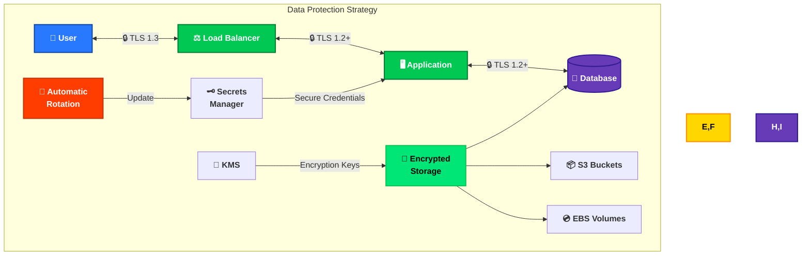
```mermaid
flowchart TD
    subgraph "Data Protection Strategy"
        A[👤 User] <-->|"🔒 TLS 1.3"| B[⚖️ Load Balancer]
        B <-->|"🔒 TLS 1.2+"| C[🖥️ Application]
        C <-->|"🔒 TLS 1.2+"| D[(💾 Database)]
        
        E[🗝️ Secrets<br>Manager] -->|"Secure Credentials"| C
        F[🔑 KMS] -->|"Encryption Keys"| G[🔐 Encrypted<br>Storage]
        
        G --> D
        G --> H[📦 S3 Buckets]
        G --> I[💿 EBS Volumes]
        
        J[🔄 Automatic<br>Rotation] -->|"Update"| E
    end
    
    style A fill:#2979FF,stroke:#0D47A1,stroke-width:2px,color:white,font-weight:bold
    style B fill:#00C853,stroke:#007E33,stroke-width:2px,color:white,font-weight:bold
    style C fill:#00C853,stroke:#007E33,stroke-width:2px,color:white,font-weight:bold
    style D fill:#673AB7,stroke:#311B92,stroke-width:2px,color:white,font-weight:bold
    style E,F fill:#FFD600,stroke:#FF8F00,stroke-width:2px,color:black,font-weight:bold
    style G fill:#00E676,stroke:#00C853,stroke-width:2px,color:black,font-weight:bold
    style H,I fill:#673AB7,stroke:#311B92,stroke-width:2px,color:white,font-weight:bold
    style J fill:#FF3D00,stroke:#BF360C,stroke-width:2px,color:white,font-weight:bold
    classDef default font-weight:bold
```

### Protection Mechanisms

- **🔒 End-to-End Encryption**: TLS for all communications
- **🔐 Data-at-Rest Encryption**: KMS encryption for databases, EBS volumes, and S3
- **🗝️ Secrets Management**: Secure credential storage with automated rotation
- **📦 S3 Security**: Server-side encryption, versioning, and access controls
- **🔑 Key Management**: Automatic key rotation and strict access controls

## ☁️ AWS Security Infrastructure

Our AWS security infrastructure provides comprehensive protection at all levels.

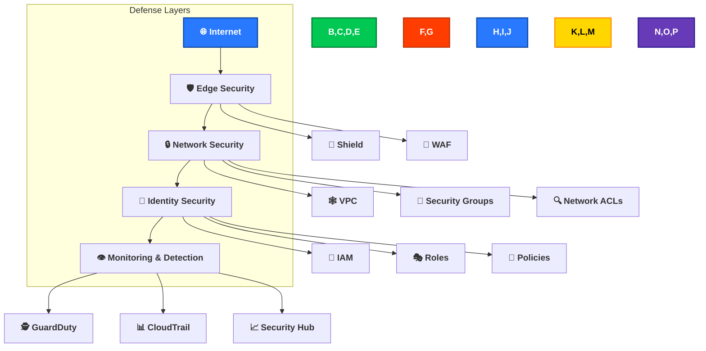
```mermaid
graph TD
    subgraph "Defense Layers"
        A[🌐 Internet] --> B[🛡️ Edge Security]
        B --> C[🔒 Network Security]
        C --> D[👤 Identity Security]
        D --> E[👁️ Monitoring & Detection]
    end
    
    B --> F[🔰 Shield]
    B --> G[🧱 WAF]
    
    C --> H[🕸️ VPC]
    C --> I[🚧 Security Groups]
    C --> J[🔍 Network ACLs]
    
    D --> K[👥 IAM]
    D --> L[🎭 Roles]
    D --> M[📜 Policies]
    
    E --> N[🕵️ GuardDuty]
    E --> O[📊 CloudTrail]
    E --> P[📈 Security Hub]
    
    style A fill:#2979FF,stroke:#0D47A1,stroke-width:2px,color:white,font-weight:bold
    style B,C,D,E fill:#00C853,stroke:#007E33,stroke-width:2px,color:white,font-weight:bold
    style F,G fill:#FF3D00,stroke:#BF360C,stroke-width:2px,color:white,font-weight:bold
    style H,I,J fill:#2979FF,stroke:#0D47A1,stroke-width:2px,color:white,font-weight:bold
    style K,L,M fill:#FFD600,stroke:#FF8F00,stroke-width:2px,color:black,font-weight:bold
    style N,O,P fill:#673AB7,stroke:#311B92,stroke-width:2px,color:white,font-weight:bold
    classDef default font-weight:bold
```

### Core AWS Security Services

- **🔰 AWS Shield**: DDoS protection at network and transport layers
- **🧱 AWS WAF**: Web application firewall with managed rule sets
- **🕸️ VPC Design**: Isolated network segments with controlled traffic flow
- **👥 IAM Framework**: Least-privilege access model with role-based permissions
- **🕵️ GuardDuty**: Continuous threat detection with machine learning
- **📈 Security Hub**: Unified security and compliance management

## 🔰 AWS Foundational Security Best Practices

Our security architecture aligns with AWS Foundational Security Best Practices (FSBP) controls to ensure a robust security posture.

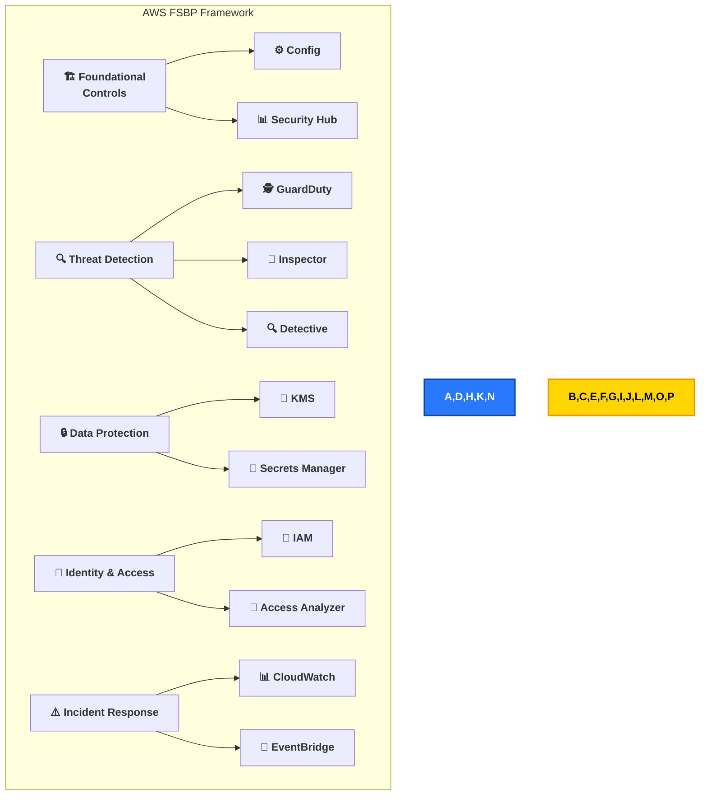
```mermaid
flowchart TD
    subgraph "AWS FSBP Framework"
        A[🏗️ Foundational<br>Controls] --> B[⚙️ Config]
        A --> C[📊 Security Hub]
        
        D[🔍 Threat Detection] --> E[🕵️ GuardDuty]
        D --> F[🔎 Inspector]
        D --> G[🔍 Detective]
        
        H[🔒 Data Protection] --> I[🔑 KMS]
        H --> J[🔐 Secrets Manager]
        
        K[👥 Identity & Access] --> L[👤 IAM]
        K --> M[🔑 Access Analyzer]
        
        N[⚠️ Incident Response] --> O[📊 CloudWatch]
        N --> P[🔌 EventBridge]
    end
    
    style A,D,H,K,N fill:#2979FF,stroke:#0D47A1,stroke-width:2px,color:white,font-weight:bold
    style B,C,E,F,G,I,J,L,M,O,P fill:#FFD600,stroke:#FF8F00,stroke-width:2px,color:black,font-weight:bold
    classDef default font-weight:bold
```

### FSBP Controls Implementation

Our system implements the following AWS Foundational Security Best Practices controls:

#### 1. Foundational Services
- **Config.1**: AWS Config enabled for continuous monitoring of resource configurations
- **SecurityHub.1**: Security Hub enabled to aggregate security findings

#### 2. Threat Detection
- **GuardDuty.1**: GuardDuty enabled for intelligent threat detection
- **GuardDuty.5**: EKS Audit Log Monitoring for Kubernetes security
- **GuardDuty.6**: Lambda Protection for serverless security
- **GuardDuty.7**: EKS Runtime Monitoring for container security
- **GuardDuty.8**: Malware Protection for EC2 instances
- **GuardDuty.9**: RDS Protection for database security
- **GuardDuty.10**: S3 Protection for object storage security

#### 3. Vulnerability Management
- **Inspector.1**: Amazon Inspector enabled for vulnerability assessment
- **Inspector.2**: ECR scanning for container image security
- **Inspector.3**: Lambda code scanning for serverless vulnerabilities
- **Inspector.4**: Lambda standard scanning for runtime protection

#### 4. Identity and Access Management
- **IAM.1-8**: IAM best practices including password policies, MFA, and least privilege

#### 5. Data Protection
- **KMS.1-4**: Encryption key management best practices
- **S3.1-13**: S3 bucket security best practices

### Key Benefits

- **🔒 Comprehensive Coverage**: All critical security areas addressed
- **📊 Continuous Assessment**: Automated evaluation against security standards
- **🔄 Automated Remediation**: Self-healing for common security issues
- **📈 Security Scoring**: Clear visibility into security posture

## 🕵️ Threat Detection & Investigation

Our threat detection and investigation capabilities combine multiple AWS security services to identify, analyze, and remediate security threats.

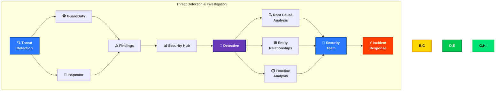
```mermaid
flowchart TD
    subgraph "Threat Detection & Investigation"
        A[🔍 Threat<br>Detection] --> B[🕵️ GuardDuty]
        A --> C[🔎 Inspector]
        
        B --> D[⚠️ Findings]
        C --> D
        
        D --> E[📊 Security Hub]
        E --> F[🔎 Detective]
        
        F --> G[🔍 Root Cause<br>Analysis]
        F --> H[🕸️ Entity<br>Relationships]
        F --> I[⏱️ Timeline<br>Analysis]
        
        G & H & I --> J[👥 Security<br>Team]
        J --> K[⚡ Incident<br>Response]
    end
    
    style A fill:#2979FF,stroke:#0D47A1,stroke-width:2px,color:white,font-weight:bold
    style B,C fill:#FFD600,stroke:#FF8F00,stroke-width:2px,color:black,font-weight:bold
    style D,E fill:#00C853,stroke:#007E33,stroke-width:2px,color:white,font-weight:bold
    style F fill:#673AB7,stroke:#311B92,stroke-width:2px,color:white,font-weight:bold
    style G,H,I fill:#00E676,stroke:#00C853,stroke-width:2px,color:black,font-weight:bold
    style J fill:#2979FF,stroke:#0D47A1,stroke-width:2px,color:white,font-weight:bold
    style K fill:#FF3D00,stroke:#BF360C,stroke-width:2px,color:white,font-weight:bold
    classDef default font-weight:bold
```

### GuardDuty Enhanced Capabilities

Amazon GuardDuty provides intelligent threat detection across multiple AWS services:

1. **🔍 Machine Learning-Based Detection**:
   - Analyzes CloudTrail, VPC Flow Logs, and DNS logs
   - Identifies suspicious activity using ML models
   - Detects reconnaissance, unauthorized access, and data exfiltration

2. **🔰 Service-Specific Protection**:
   - **EKS Protection**: Monitors Kubernetes audit and runtime logs for threats
   - **Lambda Protection**: Identifies suspicious serverless function activity
   - **RDS Protection**: Detects database threats and anomalous access
   - **S3 Protection**: Monitors for suspicious object storage activity
   - **EC2 Malware Protection**: Scans for malware on EC2 instances

3. **🚨 Managed Threat Detection**:
   - Regularly updated threat intelligence
   - Detection of the latest attack techniques
   - Minimal false positives through tuned ML models

### Amazon Detective

Amazon Detective provides powerful investigation capabilities for security incidents:

1. **🔎 Root Cause Analysis**:
   - Automatically collects and processes log data
   - Builds a unified, interactive view of resource behaviors
   - Visualizes relationships between AWS resources, IP addresses, and IAM principals

2. **⏱️ Timeline Analysis**:
   - Historical view of security events
   - Context-rich visualization of activity
   - Time-sequence analysis for understanding attack progression

3. **🔍 Entity Relationship Mapping**:
   - Interactive graph models for visual investigation
   - Connection between resources, users, roles, and IP addresses
   - Identification of lateral movement and privilege escalation

4. **📊 Behavioral Analytics**:
   - Baseline resource behaviors over time
   - Detection of anomalous behaviors
   - Statistical analysis to reduce false positives

### Key Benefits

- **🔄 Continuous Monitoring**: 24/7 automated threat detection
- **🔎 Deep Visibility**: Comprehensive view across all AWS services
- **⚡ Rapid Investigation**: Streamlined security incident analysis
- **🔍 Context-Rich Insights**: Detailed information for informed decisions
- **🚨 Proactive Alerts**: Early warning of potential security threats

## 🔎 Vulnerability Management

Our vulnerability management program combines Amazon Inspector with additional security practices to identify and remediate vulnerabilities across the infrastructure.

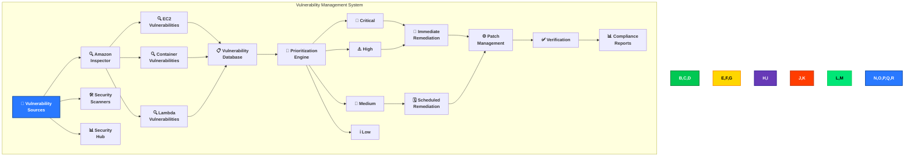
```mermaid
flowchart TD
    subgraph "Vulnerability Management System"
        A[🔎 Vulnerability<br>Sources] --> B[🔍 Amazon<br>Inspector]
        A --> C[🛠️ Security<br>Scanners]
        A --> D[📊 Security<br>Hub]
        
        B --> E[🔍 EC2<br>Vulnerabilities]
        B --> F[🔍 Container<br>Vulnerabilities]
        B --> G[🔍 Lambda<br>Vulnerabilities]
        
        E & F & G --> H[📋 Vulnerability<br>Database]
        H --> I[🔄 Prioritization<br>Engine]
        
        I --> J[🚨 Critical]
        I --> K[⚠️ High]
        I --> L[📝 Medium]
        I --> M[ℹ️ Low]
        
        J & K --> N[🔧 Immediate<br>Remediation]
        L --> O[🗓️ Scheduled<br>Remediation]
        
        N & O --> P[⚙️ Patch<br>Management]
        P --> Q[✅ Verification]
        Q --> R[📊 Compliance<br>Reports]
    end
    
    style A fill:#2979FF,stroke:#0D47A1,stroke-width:2px,color:white,font-weight:bold
    style B,C,D fill:#00C853,stroke:#007E33,stroke-width:2px,color:white,font-weight:bold
    style E,F,G fill:#FFD600,stroke:#FF8F00,stroke-width:2px,color:black,font-weight:bold
    style H,I fill:#673AB7,stroke:#311B92,stroke-width:2px,color:white,font-weight:bold
    style J,K fill:#FF3D00,stroke:#BF360C,stroke-width:2px,color:white,font-weight:bold
    style L,M fill:#00E676,stroke:#00C853,stroke-width:2px,color:black,font-weight:bold
    style N,O,P,Q,R fill:#2979FF,stroke:#0D47A1,stroke-width:2px,color:white,font-weight:bold
    classDef default font-weight:bold
```

### Amazon Inspector Capabilities

Amazon Inspector provides comprehensive vulnerability assessment:

1. **🔍 EC2 Instance Scanning**:
   - Network accessibility assessment
   - Operating system vulnerability assessment
   - Agent-based and agentless scanning options

2. **📦 Container Image Scanning**:
   - ECR image scanning for vulnerabilities
   - Detection of insecure container configurations
   - Integration with CI/CD pipelines for shift-left security

3. **λ Lambda Function Scanning**:
   - **Code Scanning**: Analyzes function code for vulnerabilities
   - **Standard Scanning**: Evaluates execution environment
   - **Runtime Monitoring**: Detects issues during execution

4. **📊 Vulnerability Intelligence**:
   - CVE database integration
   - Exploit availability assessment
   - Risk scoring based on severity and exploitability

### Vulnerability Remediation Process

Our structured approach to vulnerability management includes:

1. **🔄 Continuous Scanning**:
   - Automated scanning on a defined schedule
   - Event-triggered scans for new deployments
   - Continuous monitoring for newly discovered vulnerabilities

2. **📝 Risk-Based Prioritization**:
   - CVSS score evaluation
   - Exploitability assessment
   - Asset criticality consideration
   - Data sensitivity impact

3. **🔧 Remediation Workflow**:
   - Critical vulnerabilities addressed within 24 hours
   - High vulnerabilities addressed within 7 days
   - Medium vulnerabilities addressed within 30 days
   - Low vulnerabilities addressed within 90 days

4. **✅ Verification and Reporting**:
   - Post-remediation validation scans
   - Regular compliance reporting
   - Trend analysis for vulnerability reduction
   - Executive dashboards for security posture

### Key Benefits

- **🔍 Comprehensive Coverage**: All computing resources protected
- **🔄 Continuous Assessment**: Regular and event-driven scanning
- **📊 Risk-Based Approach**: Focus on the most critical vulnerabilities
- **⚙️ Automated Remediation**: Streamlined patching and mitigation
- **📝 Compliance Documentation**: Evidence for regulatory requirements

## ⚡ Resilience & Operational Readiness

Our resilience and operational readiness strategy ensures the system can withstand disruptions and recover quickly from incidents.

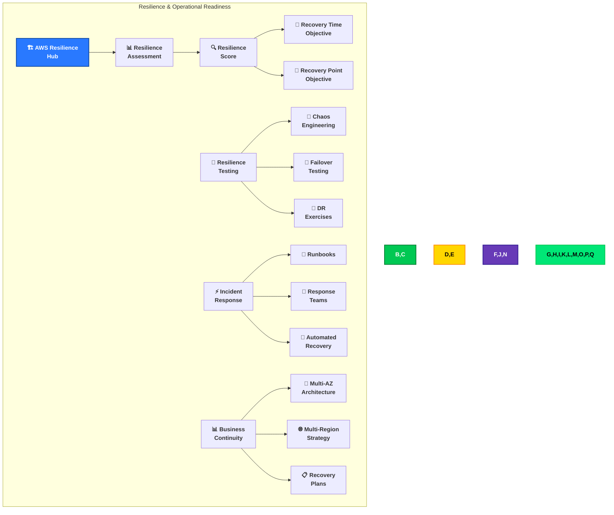
```mermaid
flowchart TD
    subgraph "Resilience & Operational Readiness"
        A[🏗️ AWS Resilience<br>Hub] --> B[📊 Resilience<br>Assessment]
        B --> C[🔍 Resilience<br>Score]
        
        C --> D[📝 Recovery Time<br>Objective]
        C --> E[📝 Recovery Point<br>Objective]
        
        F[🔄 Resilience<br>Testing] --> G[🧪 Chaos<br>Engineering]
        F --> H[🔄 Failover<br>Testing]
        F --> I[🚨 DR<br>Exercises]
        
        J[⚡ Incident<br>Response] --> K[📑 Runbooks]
        J --> L[👥 Response<br>Teams]
        J --> M[🔄 Automated<br>Recovery]
        
        N[📊 Business<br>Continuity] --> O[🔄 Multi-AZ<br>Architecture]
        N --> P[🌐 Multi-Region<br>Strategy]
        N --> Q[📋 Recovery<br>Plans]
    end
    
    style A fill:#2979FF,stroke:#0D47A1,stroke-width:2px,color:white,font-weight:bold
    style B,C fill:#00C853,stroke:#007E33,stroke-width:2px,color:white,font-weight:bold
    style D,E fill:#FFD600,stroke:#FF8F00,stroke-width:2px,color:black,font-weight:bold
    style F,J,N fill:#673AB7,stroke:#311B92,stroke-width:2px,color:white,font-weight:bold
    style G,H,I,K,L,M,O,P,Q fill:#00E676,stroke:#00C853,stroke-width:2px,color:black,font-weight:bold
    classDef default font-weight:bold
```

### AWS Resilience Hub

AWS Resilience Hub provides a comprehensive framework for assessing and improving resilience:

1. **📊 Resilience Assessment**:
   - Continuous evaluation of application resilience
   - Identification of resilience gaps
   - Recommendations for improving recovery capabilities

2. **⏱️ Recovery Objectives**:
   - Recovery Time Objective (RTO) validation
   - Recovery Point Objective (RPO) validation
   - Alignment with business requirements

3. **🔄 Automated Testing**:
   - Scheduled resilience test execution
   - Validation of recovery procedures
   - Verification of resilience configurations

4. **📋 Compliance Tracking**:
   - Documentation of resilience capabilities
   - Evidence for compliance requirements
   - Detailed resilience reporting

### Resilience Testing Strategy

Our resilience testing program includes:

1. **🧪 Chaos Engineering**:
   - Controlled fault injection
   - Component failure simulation
   - Network disruption testing
   - Latency and error introduction

2. **🔄 Failover Testing**:
   - Database failover drills
   - Redundant component verification
   - Zone and region failover exercises
   - Load balancer fail-open testing

3. **🚨 Disaster Recovery Exercises**:
   - Full DR scenario simulations
   - Recovery procedure validation
   - Cross-region recovery testing
   - Recovery time measurement

### Business Continuity Features

Our architecture includes multiple business continuity capabilities:

1. **🔄 Multi-AZ Architecture**:
   - Resources distributed across availability zones
   - Automatic failover for critical components
   - Zone-independent operation capability

2. **🌐 Multi-Region Strategy**:
   - Cross-region data replication
   - Regional disaster recovery plans
   - Global data residency compliance

3. **⚡ Automated Recovery**:
   - Self-healing infrastructure
   - Auto scaling for workload recovery
   - Automated instance replacement
   - Database point-in-time recovery

### Key Benefits

- **⚡ Improved Recovery**: Faster response to disruptions
- **🔍 Comprehensive Assessment**: Clear visibility into resilience posture
- **🔄 Validated Procedures**: Tested recovery mechanisms
- **📝 Documented Capabilities**: Evidence for auditors and stakeholders
- **🚨 Proactive Improvement**: Continuous enhancement of resilience

## 📋 Configuration & Compliance Management

Our configuration and compliance management system ensures that all resources maintain secure configurations and adhere to regulatory requirements.

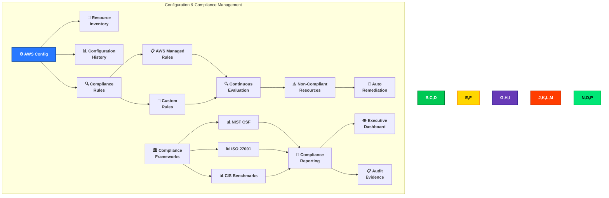
```mermaid
flowchart TD
    subgraph "Configuration & Compliance Management"
        A[⚙️ AWS Config] --> B[📝 Resource<br>Inventory]
        A --> C[📊 Configuration<br>History]
        A --> D[🔍 Compliance<br>Rules]
        
        D --> E[📋 AWS Managed<br>Rules]
        D --> F[📝 Custom<br>Rules]
        
        E & F --> G[🔍 Continuous<br>Evaluation]
        G --> H[⚠️ Non-Compliant<br>Resources]
        H --> I[🔄 Auto<br>Remediation]
        
        J[🏛️ Compliance<br>Frameworks] --> K[📊 NIST CSF]
        J --> L[📊 ISO 27001]
        J --> M[📊 CIS Benchmarks]
        
        K & L & M --> N[📑 Compliance<br>Reporting]
        N --> O[👁️ Executive<br>Dashboard]
        N --> P[📋 Audit<br>Evidence]
    end
    
    style A fill:#2979FF,stroke:#0D47A1,stroke-width:2px,color:white,font-weight:bold
    style B,C,D fill:#00C853,stroke:#007E33,stroke-width:2px,color:white,font-weight:bold
    style E,F fill:#FFD600,stroke:#FF8F00,stroke-width:2px,color:black,font-weight:bold
    style G,H,I fill:#673AB7,stroke:#311B92,stroke-width:2px,color:white,font-weight:bold
    style J,K,L,M fill:#FF3D00,stroke:#BF360C,stroke-width:2px,color:white,font-weight:bold
    style N,O,P fill:#00E676,stroke:#00C853,stroke-width:2px,color:black,font-weight:bold
    classDef default font-weight:bold
```

### AWS Config Capabilities

AWS Config provides comprehensive configuration management:

1. **📝 Resource Inventory**:
   - Detailed inventory of all AWS resources
   - Configuration details and relationships
   - Historical configuration tracking

2. **📊 Configuration Recording**:
   - Continuous configuration state capture
   - Configuration change history
   - Point-in-time configuration views

3. **🔍 Compliance Evaluation**:
   - Built-in rule library for common controls
   - Custom rule development for specific requirements
   - Automated evaluation and notification

4. **🔄 Configuration Remediation**:
   - Automated remediation actions
   - Integration with AWS Systems Manager
   - Compliance status tracking and reporting

### Compliance Framework Integration

Our system maps to multiple compliance frameworks:

1. **🏛️ NIST Cybersecurity Framework (CSF)**:
   - Identify, Protect, Detect, Respond, Recover functions
   - Control mapping for all CSF categories
   - Evidence collection for CSF compliance

2. **🔒 ISO 27001**:
   - Control implementation for all relevant domains
   - Documentation for certification requirements
   - Continuous monitoring for control effectiveness

3. **🛡️ CIS Benchmarks**:
   - Implementation of CIS AWS Foundations Benchmark
   - Operating system-level CIS compliance
   - Database configuration security benchmarks

### Key Benefits

- **🔍 Complete Visibility**: Comprehensive view of resource configurations
- **📝 Historical Tracking**: Configuration changes over time
- **🔄 Automated Compliance**: Continuous evaluation against requirements
- **⚡ Rapid Remediation**: Automated fixing of compliance issues
- **📊 Evidence Collection**: Documentation for audits and assessments

## 📊 Monitoring & Analytics

Our comprehensive monitoring and analytics system provides real-time visibility into security status and enables rapid response to incidents.

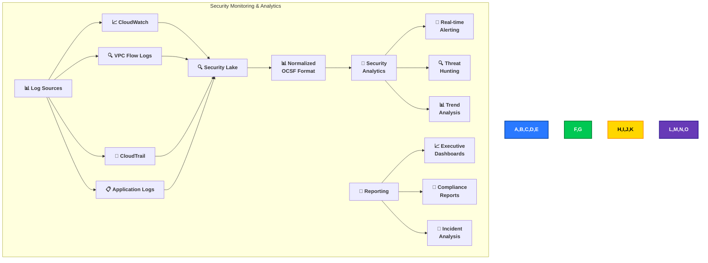
```mermaid
flowchart TD
    subgraph "Security Monitoring & Analytics"
        A[📊 Log Sources] --> B[📈 CloudWatch]
        A --> C[🔍 VPC Flow Logs]
        A --> D[🔑 CloudTrail]
        A --> E[📋 Application Logs]
        
        B & C & D & E --> F[🔍 Security Lake]
        F --> G[📊 Normalized<br>OCSF Format]
        
        G --> H[🔎 Security<br>Analytics]
        H --> I[🚨 Real-time<br>Alerting]
        H --> J[🔍 Threat<br>Hunting]
        H --> K[📊 Trend<br>Analysis]
        
        L[📑 Reporting] --> M[📈 Executive<br>Dashboards]
        L --> N[📝 Compliance<br>Reports]
        L --> O[🔎 Incident<br>Analysis]
    end
    
    style A,B,C,D,E fill:#2979FF,stroke:#0D47A1,stroke-width:2px,color:white,font-weight:bold
    style F,G fill:#00C853,stroke:#007E33,stroke-width:2px,color:white,font-weight:bold
    style H,I,J,K fill:#FFD600,stroke:#FF8F00,stroke-width:2px,color:black,font-weight:bold
    style L,M,N,O fill:#673AB7,stroke:#311B92,stroke-width:2px,color:white,font-weight:bold
    classDef default font-weight:bold
```

### AWS Security Lake

AWS Security Lake provides centralized security log management:

1. **📊 Centralized Collection**:
   - Automatic gathering of logs from AWS services
   - Collection from on-premises sources
   - Third-party integration for comprehensive visibility

2. **🔄 OCSF Normalization**:
   - Open Cybersecurity Schema Framework (OCSF) standardization
   - Consistent format for all security data
   - Simplified analysis across diverse sources

3. **📋 Long-term Storage**:
   - Cost-effective retention of security data
   - Lifecycle management for compliance requirements
   - Data sovereignty controls for regulatory compliance

4. **🔍 Advanced Analytics**:
   - Built-in query capabilities for investigation
   - Integration with analytics services
   - Third-party SIEM integration options

### Security Analytics Capabilities

Our security analytics platform provides:

1. **🚨 Real-time Detection**:
   - Continuous monitoring for security events
   - Pattern matching for known threats
   - Anomaly detection for unknown threats

2. **🔍 Threat Hunting**:
   - Interactive query capabilities
   - Advanced visualization for pattern discovery
   - Hypothesis testing for threat identification

3. **📈 Trend Analysis**:
   - Historical security data analysis
   - Identification of emerging threats
   - Risk prediction based on historical patterns

4. **📊 Security Metrics**:
   - Key performance indicators for security
   - Security posture visualization
   - Improvement tracking over time

### Key Benefits

- **👁️ Unified Visibility**: Comprehensive view across all environments
- **⚡ Rapid Detection**: Quick identification of security issues
- **🔎 Deep Analysis**: Advanced tools for security investigation
- **📋 Simplified Compliance**: Streamlined reporting for audits
- **📊 Strategic Insights**: Data-driven security decision making

## 🤖 Automated Security Operations

Our automated security maintenance system ensures continuous protection through programmatic security operations.

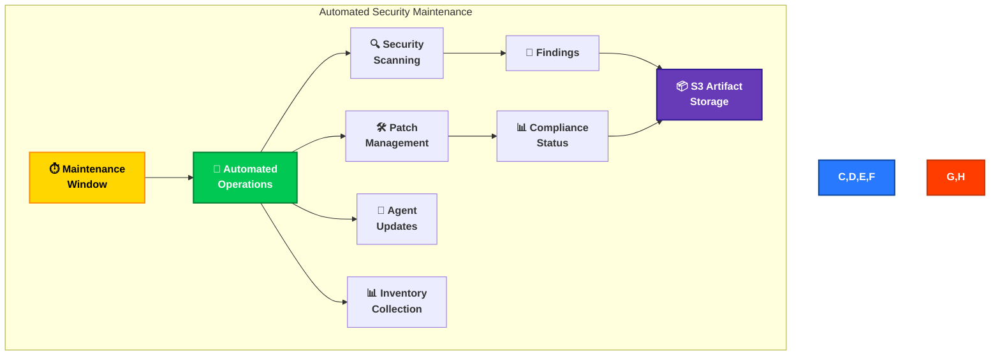
```mermaid
flowchart TD
    subgraph "Automated Security Maintenance"
        A[⏱️ Maintenance<br>Window] --> B[🔄 Automated<br>Operations]
        
        B --> C[🔍 Security<br>Scanning]
        B --> D[🛠️ Patch<br>Management]
        B --> E[🔄 Agent<br>Updates]
        B --> F[📊 Inventory<br>Collection]
        
        C --> G[📝 Findings]
        D --> H[📊 Compliance<br>Status]
        
        G & H --> I[📦 S3 Artifact<br>Storage]
    end
    
    style A fill:#FFD600,stroke:#FF8F00,stroke-width:2px,color:black,font-weight:bold
    style B fill:#00C853,stroke:#007E33,stroke-width:2px,color:white,font-weight:bold
    style C,D,E,F fill:#2979FF,stroke:#0D47A1,stroke-width:2px,color:white,font-weight:bold
    style G,H fill:#FF3D00,stroke:#BF360C,stroke-width:2px,color:white,font-weight:bold
    style I fill:#673AB7,stroke:#311B92,stroke-width:2px,color:white,font-weight:bold
    classDef default font-weight:bold
```

### AWS Systems Manager Maintenance Window

The CloudFormation template defines a comprehensive maintenance window for automated security operations:

```json
"MaintenanceWindow": {
    "Type": "AWS::SSM::MaintenanceWindow",
    "Properties": {
        "Description": "Daily Maintenance Window",
        "AllowUnassociatedTargets": false,
        "Cutoff": 0,
        "Schedule": "rate(1 hour)",
        "Duration": 1,
        "Name": "hourly-patching"
    }
}
```

This configuration ensures regular, automated security maintenance:
- Hourly execution schedule
- Defined maintenance window
- Controlled target selection via tags
- Automated output logging

### Automation Components

- **⏱️ Scheduled Maintenance**: Regular security operations on defined schedules
- **🛠️ Patch Management**: Automated security patch deployment and validation
- **🔄 Agent Updates**: SSM agent and security tool updates
- **📊 Inventory Tracking**: Software and configuration monitoring
- **🔍 Compliance Verification**: Automated checks against security baselines

### 🔄 CI/CD Security Controls

The platform implements comprehensive security controls across its 13 active GitHub Actions workflows:

**🛡️ Static & Dynamic Analysis:**
- **CodeQL Analysis** (`codeql-analysis.yml`): SAST for Java
- **OWASP ZAP DAST** (`zap-scan.yml`): Dynamic application security testing
- **OWASP Dependency-Check**: Manual/on-demand CVE scanning via Maven (`mvn dependency-check:check`)
- **SonarCloud**: Quality metrics are tracked externally/manual; not currently enforced by the active GitHub Actions workflows in this repository

**📦 Supply Chain Security:**
- **Dependency Review** (`dependency-review.yml`): PR-time dependency vulnerability scanning
- **SLSA Build Level 3** (`release.yml`): Provenance generation for all releases
- **CycloneDX SBOM** (`release.yml`): Software Bill of Materials on every release
- **OpenSSF Scorecard** (`scorecards.yml`): Continuous supply chain health monitoring (current: **7.2/10**)

**✅ Quality & Compliance Gates:**
- **Field Completeness Validation** (`validate-field-completeness.yml`): Data model integrity checks
- **JSON Schema Validation** (`validate-json-schemas.yml`): Configuration file validation
- **View Documentation Validation** (`validate-view-documentation.yml`): Database view documentation checks

**📚 Documentation & Release:**
- **JavaDoc Generation** (`javadoc-generation.yml`): Automated API documentation
- **Site Generation** (`site-generation.yml`): Maven site reports
- **Intelligence Changelog** (`generate-intelligence-changelog.yml`): Automated change documentation

**🔐 Security Posture Metrics (Current):**
- **OpenSSF Scorecard**: 7.2/10 ([scorecard.dev/viewer](https://scorecard.dev/viewer/?uri=github.com/Hack23/cia))
- **SLSA Build Level**: 3 (provenance + SBOM)
- **CII Best Practices**: Passing (project 770)
- **Critical CVEs**: Zero in last 5+ years
- **Dependabot**: Active with automated PRs
- **FOSSA License Compliance**: Passing (Apache License 2.0)

All workflows enforce security-by-default principles aligned with the [Hack23 Secure Development Policy](https://github.com/Hack23/ISMS-PUBLIC/blob/main/Secure_Development_Policy.md) and [CI/CD Security](https://github.com/Hack23/ISMS-PUBLIC/blob/main/Secure_Development_Policy.md#cicd-security) requirements.

## 🔒 Application Security

Our application implements robust security controls at the code level.

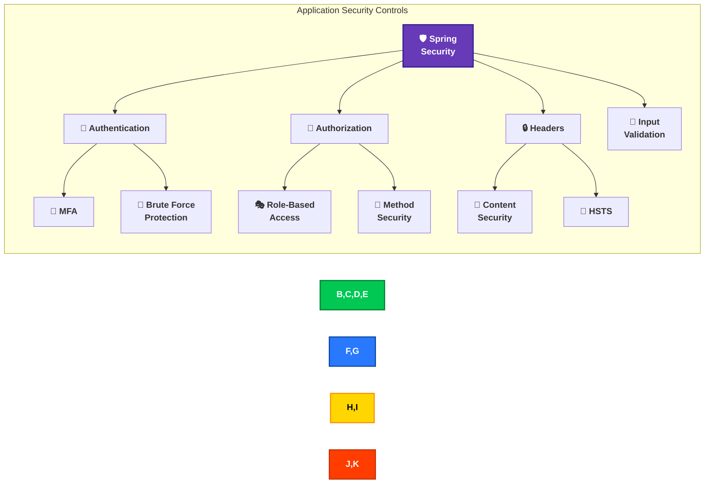
```mermaid
flowchart LR
    subgraph "Application Security Controls"
        A[🛡️ Spring<br>Security] --> B[🔐 Authentication]
        A --> C[🔑 Authorization]
        A --> D[🔒 Headers]
        A --> E[🛑 Input<br>Validation]
        
        B --> F[👤 MFA]
        B --> G[🚫 Brute Force<br>Protection]
        
        C --> H[🎭 Role-Based<br>Access]
        C --> I[📝 Method<br>Security]
        
        D --> J[🔐 Content<br>Security]
        D --> K[📌 HSTS]
    end
    
    style A fill:#673AB7,stroke:#311B92,stroke-width:2px,color:white,font-weight:bold
    style B,C,D,E fill:#00C853,stroke:#007E33,stroke-width:2px,color:white,font-weight:bold
    style F,G fill:#2979FF,stroke:#0D47A1,stroke-width:2px,color:white,font-weight:bold
    style H,I fill:#FFD600,stroke:#FF8F00,stroke-width:2px,color:black,font-weight:bold
    style J,K fill:#FF3D00,stroke:#BF360C,stroke-width:2px,color:white,font-weight:bold
    classDef default font-weight:bold
```

### Method-Level Security Implementation

The application implements `@Secured` annotations for fine-grained access control:

```java
@Secured({ "ROLE_USER", "ROLE_ADMIN" })
public DataContainer<UserAccount> getUserAccountByEmail(ServiceRequest serviceRequest) {
    // Implementation details...
}

@Secured({ "ROLE_ADMIN" })
public ServiceResponse updateApplicationConfiguration(ServiceRequest serviceRequest) {
    // Implementation details...
}
```

Each secured method enforces specific role requirements:
- `ROLE_ANONYMOUS`: Unauthenticated access (limited functionality)
- `ROLE_USER`: Standard authenticated user access
- `ROLE_ADMIN`: Administrative privileges for sensitive operations

### Application Security Features

- **🛡️ Spring Security Framework**: Enterprise-grade security integration
- **🔐 Authentication**: Multi-factor and password-based with BCrypt hashing
- **🔑 Role-Based Access Control**: Fine-grained authorization with method annotations
- **🔒 Security Headers**: CSP, HSTS, X-Content-Type-Options, and Referrer-Policy
- **🛑 Input Validation**: Both client and server-side validation

## 📜 Compliance Framework

Our security architecture aligns with key compliance frameworks.

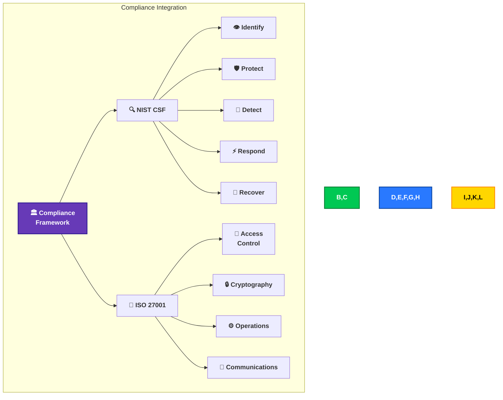
```mermaid
graph TD
    subgraph "Compliance Integration"
        A[🏛️ Compliance<br>Framework] --> B[🔍 NIST CSF]
        A --> C[🔐 ISO 27001]
        
        B --> D[👁️ Identify]
        B --> E[🛡️ Protect]
        B --> F[🔎 Detect]
        B --> G[⚡ Respond]
        B --> H[🔄 Recover]
        
        C --> I[👥 Access<br>Control]
        C --> J[🔒 Cryptography]
        C --> K[⚙️ Operations]
        C --> L[📡 Communications]
    end
    
    style A fill:#673AB7,stroke:#311B92,stroke-width:2px,color:white,font-weight:bold
    style B,C fill:#00C853,stroke:#007E33,stroke-width:2px,color:white,font-weight:bold
    style D,E,F,G,H fill:#2979FF,stroke:#0D47A1,stroke-width:2px,color:white,font-weight:bold
    style I,J,K,L fill:#FFD600,stroke:#FF8F00,stroke-width:2px,color:black,font-weight:bold
    classDef default font-weight:bold
```

## 🛡️ Defense-in-Depth Strategy

Our defense-in-depth strategy coordinates the multiple security layers already implemented throughout the Citizen Intelligence Agency platform to create overlapping protection mechanisms.

### Strategic Implementation

The defense-in-depth approach manifests through several implemented layers of protection:

1. **Identity Security Layer**: The implemented MFA with Google Authenticator (optional enrollment), Drools 10.1.0 brute-force attack detection rules, login blocking protection, and role-based access control create the first line of defense.

2. **Application Security Layer**: Our implemented Spring Security 5.8.16 framework with method-level `@Secured` annotations, Passay 2.0.0 password validation, and Bouncy Castle 1.84 cryptographic services provides protection at the code level.

3. **Data Security Layer**: The Javers 7.11.0 auditing system, combined with AWS KMS-backed encryption at rest and TLS for data in transit, creates a comprehensive data protection layer.

4. **Network Security Layer**: Our AWS WAF implementation, three-zone network segmentation, and VPC Endpoints establish network boundaries and traffic filtering.

5. **Infrastructure Security Layer**: Multi-AZ architecture, AWS security services (GuardDuty, Security Hub, Inspector), and automated security maintenance via AWS Systems Manager provide foundational protection.

6. **Monitoring & Detection Layer**: The implemented ApplicationSession tracking, security event listeners, GuardDuty, and Inspector combined with PostgreSQL 18 (pgaudit, pg_stat_statements, auto_explain) provide visibility across all layers.

This integration of multiple security controls means that a compromise of any single layer will not lead to a complete security failure, as additional protective measures exist at each level of the technology stack.


## 🔄 Security Operations

Our security operations framework orchestrates the ongoing management of the security controls implemented throughout our architecture.

### Operational Functions

The security operations activities leverage our implemented systems:

1. **Continuous Monitoring**: Using the implemented security event monitoring system and ApplicationActionEvent tracking to maintain visibility into security-relevant activities.

2. **Threat Detection & Response**: Operationalizing the implemented GuardDuty service with its machine learning capabilities and multiple AWS service protections.

3. **Vulnerability Management**: Operating the Amazon Inspector implementation to identify and remediate vulnerabilities across EC2, container images, and Lambda functions.

4. **Configuration Management**: Utilizing AWS Config to ensure secure configurations are maintained and compliance rules are enforced.

5. **Automated Security Maintenance**: Executing regular security operations through the implemented AWS Systems Manager Maintenance Windows, which run on the documented hourly schedule.

6. **Log Management & Analysis**: Leveraging Security Lake's OCSF standardization for security data analysis across the environment.

These operational activities ensure that the security controls documented throughout this architecture remain effective on an ongoing basis.


## 💰 Security Investment

Our security investment approach focuses on the maintenance and optimization of the implemented security controls documented in this architecture.

### Investment Priorities

Based on the security implementation described throughout this document, our investment focuses on:

1. **AWS Security Services**: Funding the AWS security services already implemented including WAF, GuardDuty with its enhanced capabilities, Inspector, Security Hub, Detective, Config, and Security Lake.

2. **High Availability Infrastructure**: Supporting the multi-AZ architecture with redundant components as documented in the High Availability Design section.

3. **Authentication & Authorization**: Maintaining the implemented multi-factor authentication system and role-based access control framework.

4. **Operational Security**: Supporting the automated security operations through the implemented maintenance window and security event monitoring.

5. **Compliance Management**: Resources for maintaining the implemented compliance controls mapped to NIST CSF, ISO 27001, and CIS Benchmarks.

For detailed cost breakdowns of the AWS security implementation, refer to the [Financial Security Plan](FinancialSecurityPlan.md) referenced in our Security Documentation Map.

## 🏛️ AWS Well-Architected Alignment

Our security architecture aligns with the AWS Well-Architected Framework pillars, ensuring that security best practices are implemented across all aspects of the system.

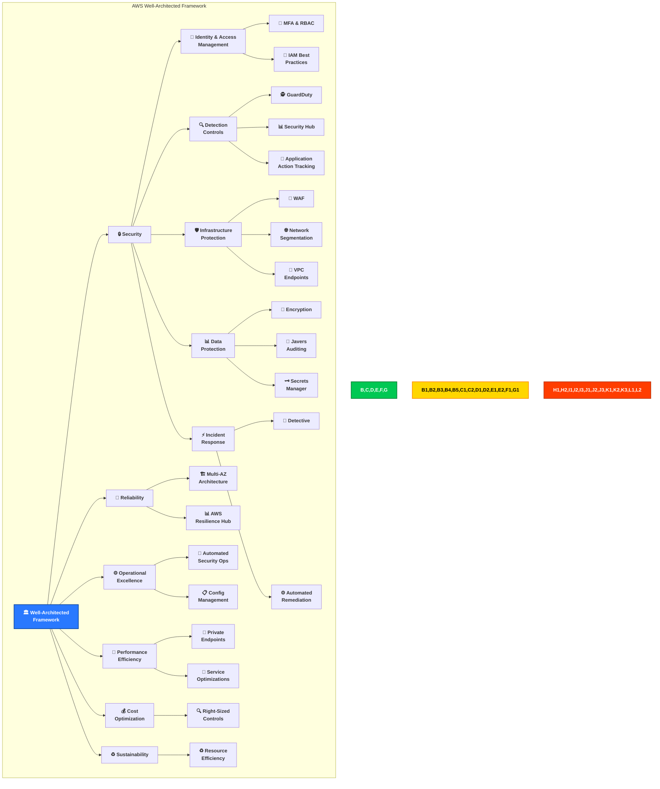
```mermaid
flowchart TD
    subgraph "AWS Well-Architected Framework"
        A[🏛️ Well-Architected<br>Framework] 
        
        A --> B[🔒 Security]
        A --> C[💪 Reliability]
        A --> D[⚙️ Operational<br>Excellence]
        A --> E[🚀 Performance<br>Efficiency]
        A --> F[💰 Cost<br>Optimization]
        A --> G[♻️ Sustainability]
        
        B --> B1[🔐 Identity & Access<br>Management]
        B --> B2[🔍 Detection<br>Controls]
        B --> B3[🛡️ Infrastructure<br>Protection]
        B --> B4[📊 Data<br>Protection]
        B --> B5[⚡ Incident<br>Response]
        
        B1 --> H1[🔑 MFA & RBAC]
        B1 --> H2[👥 IAM Best<br>Practices]
        
        B2 --> I1[🕵️ GuardDuty]
        B2 --> I2[📊 Security Hub]
        B2 --> I3[📝 Application<br>Action Tracking]
        
        B3 --> J1[🧱 WAF]
        B3 --> J2[🌐 Network<br>Segmentation]
        B3 --> J3[🔌 VPC<br>Endpoints]
        
        B4 --> K1[🔐 Encryption]
        B4 --> K2[📜 Javers<br>Auditing]
        B4 --> K3[🗝️ Secrets<br>Manager]
        
        B5 --> L1[🔎 Detective]
        B5 --> L2[⚙️ Automated<br>Remediation]
        
        C --> C1[🏗️ Multi-AZ<br>Architecture]
        C --> C2[📊 AWS<br>Resilience Hub]
        
        D --> D1[🤖 Automated<br>Security Ops]
        D --> D2[📋 Config<br>Management]
        
        E --> E1[🔌 Private<br>Endpoints]
        E --> E2[🔄 Service<br>Optimizations]
        
        F --> F1[🔍 Right-Sized<br>Controls]
        
        G --> G1[♻️ Resource<br>Efficiency]
    end
    
    style A fill:#2979FF,stroke:#0D47A1,stroke-width:2px,color:white,font-weight:bold
    style B,C,D,E,F,G fill:#00C853,stroke:#007E33,stroke-width:2px,color:white,font-weight:bold
    style B1,B2,B3,B4,B5,C1,C2,D1,D2,E1,E2,F1,G1 fill:#FFD600,stroke:#FF8F00,stroke-width:2px,color:black,font-weight:bold
    style H1,H2,I1,I2,I3,J1,J2,J3,K1,K2,K3,L1,L2 fill:#FF3D00,stroke:#BF360C,stroke-width:2px,color:white,font-weight:bold
    classDef default font-weight:bold
```

### Security Pillar Implementation

Our security architecture most directly addresses the AWS Security pillar through:

1. **🔐 Identity & Access Management**
   - Multi-factor authentication (MFA) with Google Authenticator (implemented, optional enrollment)
   - Brute-force attack detection via Drools 10.1.0 BruteForceAttack.drl rules
   - Role-based access control with three security tiers
   - Method-level security with `@Secured` annotations (Spring Security 5.8.16)
   - Password policy enforcement via Passay 2.0.0
   - IAM best practices (IAM.1-8) as documented in AWS Foundational Security Best Practices

2. **🔍 Detection Controls**
   - GuardDuty with enhanced capabilities for EKS, Lambda, RDS, S3, and EC2
   - Security Hub for centralized security findings
   - ApplicationSession and ApplicationActionEvent tracking
   - Security event monitoring with event listeners

3. **🛡️ Infrastructure Protection**
   - AWS WAF implementation against OWASP Top 10
   - Three-zone network segmentation (public, private app, private DB)
   - VPC Endpoints for private AWS service access
   - Security Groups and NACLs for traffic filtering

4. **📊 Data Protection**
   - Encryption in transit using TLS
   - KMS encryption for data at rest
   - Secrets Manager with automated rotation
   - Javers 7.11.0 auditing for data integrity
   - PostgreSQL 18 with pgaudit, pgcrypto, pgvector extensions
   - Bouncy Castle 1.84 cryptographic provider

5. **⚡ Incident Response**
   - Amazon Detective for investigation capabilities
   - Automated remediation through AWS Systems Manager

### Cross-Pillar Security Benefits

Our security architecture also supports other Well-Architected pillars:

1. **💪 Reliability**
   - Multi-AZ architecture enhances both security and availability
   - AWS Resilience Hub assessments and testing

2. **⚙️ Operational Excellence**
   - Automated security operations through maintenance windows
   - Configuration management with AWS Config

3. **🚀 Performance Efficiency**
   - VPC Endpoints improve security while enhancing performance
   - Security controls designed to minimize performance impact

4. **💰 Cost Optimization**
   - Risk-based approach to security ensures appropriate investment levels
   - Automated operations reduce security maintenance costs

5. **♻️ Sustainability**
   - Efficient security resource usage through automation
   - Right-sized security controls designed for minimal resource consumption


## 📝 Conclusion

The Citizen Intelligence Agency security architecture establishes a comprehensive security framework through the implementation of multiple protective layers and controls.

### Security Foundation

The implemented security architecture includes:

1. **Strong Authentication**: Multi-factor authentication (implemented, optional enrollment), Drools 10.1.0 brute-force attack detection, and sophisticated login blocking mechanisms

2. **Detailed Auditing**: Comprehensive data change tracking via Javers 7.11.0, PostgreSQL 18 pgaudit, and user activity monitoring

3. **Network Protection**: Multi-layer network security with AWS WAF (OWASP Top 10) and segmentation

4. **Data Security**: TLS-protected data in transit, KMS-backed encryption for data at rest, Bouncy Castle 1.84, and secure data storage

5. **Threat Detection**: GuardDuty implementation with extended protection capabilities across EKS, Lambda, RDS, S3, and EC2

6. **Vulnerability Management**: Amazon Inspector scanning across multiple resource types

7. **Automated Operations**: Systems Manager maintenance windows for consistent security

8. **Resilient Design**: Multi-AZ architecture for security and availability

9. **Technology Stack**: Java 26 runtime (source 21), Jetty 12.1.8 EE8, Spring 5.3.39.hack23java25, Spring Security 5.8.16, Vaadin 8.14.4

This implemented security foundation positions the Citizen Intelligence Agency platform to fulfill its mission of providing transparency and political data analysis while maintaining appropriate protection for sensitive information.

For information on future security enhancements, refer to the [🚀 Future Security Architecture](FUTURE_SECURITY_ARCHITECTURE.md) document.

---

**📋 Document Control:**  
**✅ Approved by:** James Pether Sörling, CEO - Hack23 AB  
**📤 Distribution:** Public  
**🏷️ Classification:** [](https://github.com/Hack23/ISMS-PUBLIC/blob/main/CLASSIFICATION.md#confidentiality-levels) [](https://github.com/Hack23/ISMS-PUBLIC/blob/main/CLASSIFICATION.md#integrity-levels) [](https://github.com/Hack23/ISMS-PUBLIC/blob/main/CLASSIFICATION.md#availability-levels)  
**📅 Effective Date:** 2026-04-20  
**⏰ Next Review:** 2027-04-20  
**🎯 Framework Compliance:** [](https://github.com/Hack23/ISMS-PUBLIC/blob/main/CLASSIFICATION.md) [](https://github.com/Hack23/ISMS-PUBLIC/blob/main/CLASSIFICATION.md) [](https://github.com/Hack23/ISMS-PUBLIC/blob/main/CLASSIFICATION.md) [](https://github.com/Hack23/ISMS-PUBLIC/blob/main/CLASSIFICATION.md)
