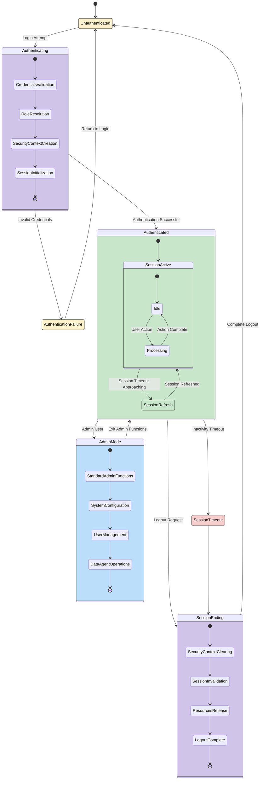
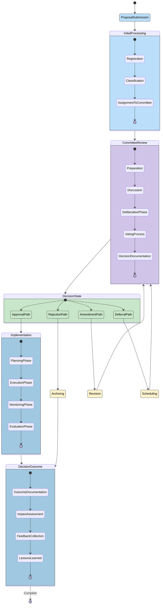

# 🔄 Citizen Intelligence Agency State Diagrams

This document illustrates the key state transitions and behavioral models within the Citizen Intelligence Agency platform. These diagrams provide a view of how system components change states in response to user interactions, data updates, and system events.

## 📚 Related Architecture Documentation

| Document                                            | Focus           | Description                               | Documentation Link                                                              |
| --------------------------------------------------- | --------------- | ----------------------------------------- | ------------------------------------------------------------------------------- |
| **[Architecture](ARCHITECTURE.md)**                 | 🏛️ Architecture | C4 model showing current system structure | [View Source](https://github.com/Hack23/cia/blob/master/ARCHITECTURE.md)         |
| **[Future Architecture](FUTURE_ARCHITECTURE.md)**   | 🏛️ Architecture | C4 model showing future system structure | [View Source](https://github.com/Hack23/cia/blob/master/FUTURE_ARCHITECTURE.md)         |
| **[Mindmaps](MINDMAP.md)**                          | 🧠 Concept      | Current system component relationships    | [View Source](https://github.com/Hack23/cia/blob/master/MINDMAP.md)             |
| **[Future Mindmaps](FUTURE_MINDMAP.md)**            | 🧠 Concept      | Future capability evolution               | [View Source](https://github.com/Hack23/cia/blob/master/FUTURE_MINDMAP.md)      |
| **[SWOT Analysis](SWOT.md)**                        | 💼 Business     | Current strategic assessment              | [View Source](https://github.com/Hack23/cia/blob/master/SWOT.md)                |
| **[Future SWOT Analysis](FUTURE_SWOT.md)**          | 💼 Business     | Future strategic opportunities            | [View Source](https://github.com/Hack23/cia/blob/master/FUTURE_SWOT.md)         |
| **[Data Model](DATA_MODEL.md)**                     | 📊 Data         | Current data structures and relationships | [View Source](https://github.com/Hack23/cia/blob/master/DATA_MODEL.md)          |
| **[Future Data Model](FUTURE_DATA_MODEL.md)**       | 📊 Data         | Enhanced political data architecture      | [View Source](https://github.com/Hack23/cia/blob/master/FUTURE_DATA_MODEL.md)   |
| **[Flowcharts](FLOWCHART.md)**                      | 🔄 Process      | Current data processing workflows         | [View Source](https://github.com/Hack23/cia/blob/master/FLOWCHART.md)           |
| **[Future Flowcharts](FUTURE_FLOWCHART.md)**        | 🔄 Process      | Enhanced AI-driven workflows              | [View Source](https://github.com/Hack23/cia/blob/master/FUTURE_FLOWCHART.md)    |
| **[State Diagrams](STATEDIAGRAM.md)**               | 🔄 Behavior     | Current system state transitions          | [View Source](https://github.com/Hack23/cia/blob/master/STATEDIAGRAM.md)        |
| **[Future State Diagrams](FUTURE_STATEDIAGRAM.md)** | 🔄 Behavior     | Enhanced adaptive state transitions       | [View Source](https://github.com/Hack23/cia/blob/master/FUTURE_STATEDIAGRAM.md) |
| **[CI/CD Workflows](WORKFLOWS.md)**                 | 🔧 DevOps       | Current automation processes              | [View Source](https://github.com/Hack23/cia/blob/master/WORKFLOWS.md)           |
| **[Future Workflows](FUTURE_WORKFLOWS.md)**         | 🔧 DevOps       | Enhanced CI/CD with ML                    | [View Source](https://github.com/Hack23/cia/blob/master/FUTURE_WORKFLOWS.md)    |
| **[End-of-Life Strategy](End-of-Life-Strategy.md)** | 📅 Lifecycle    | Maintenance and EOL planning              | [View Source](https://github.com/Hack23/cia/blob/master/End-of-Life-Strategy.md) |
| **[Financial Security Plan](FinancialSecurityPlan.md)** | 💰 Security | Cost and security implementation          | [View Source](https://github.com/Hack23/cia/blob/master/FinancialSecurityPlan.md) |
| **[CIA Features](https://hack23.com/cia-features.html)** | 🚀 Features | Platform features overview                | [View on hack23.com](https://hack23.com/cia-features.html)                     |

## 🔄 Data Processing State Diagram

**📊 Data Focus:** Illustrates how political data flows through the system from collection to visualization.

**🔄 Process Focus:** Shows state transitions as data is processed, validated, transformed, and made available for analysis.

```mermaid
stateDiagram-v2
    [*] --> Initialization
    Initialization --> DataCollection
    
    state DataCollection {
        [*] --> SourceSelection
        SourceSelection --> ParliamentaryDataImport: Parliament API
        SourceSelection --> ElectoralDataImport: Election Authority
        SourceSelection --> FinancialDataImport: Government Bodies
        SourceSelection --> WorldBankDataImport: World Bank
        
        ParliamentaryDataImport --> ValidationQueue
        ElectoralDataImport --> ValidationQueue
        FinancialDataImport --> ValidationQueue
        WorldBankDataImport --> ValidationQueue
        
        ValidationQueue --> [*]
    }
    
    DataCollection --> DataValidation
    
    state DataValidation {
        [*] --> SchemaValidation
        SchemaValidation --> DataIntegrityCheck
        DataIntegrityCheck --> ReferentialIntegrityCheck
        ReferentialIntegrityCheck --> DuplicateDetection
        DuplicateDetection --> [*]
    }
    
    DataValidation --> Invalid: Validation Failed
    DataValidation --> DataTransformation: Validation Successful
    
    Invalid --> DataCollection: Retry Collection
    Invalid --> ErrorHandling: Manual Intervention
    
    state DataTransformation {
        [*] --> Normalization
        Normalization --> EntityExtraction
        EntityExtraction --> RelationshipMapping
        RelationshipMapping --> MetricsCalculation
        MetricsCalculation --> [*]
    }
    
    DataTransformation --> DataPersistence
    
    state DataPersistence {
        [*] --> DatabaseWrite
        DatabaseWrite --> IndexUpdate
        IndexUpdate --> CacheRefresh
        CacheRefresh --> [*]
    }
    
    DataPersistence --> DataAvailable
    
    state DataAvailable {
        [*] --> ReadyForQuery
        ReadyForQuery --> AvailableForAnalysis
        AvailableForAnalysis --> AvailableForVisualization
        AvailableForVisualization --> [*]
    }
    
    DataAvailable --> DataArchive: Retention Policy
    DataAvailable --> DataCollection: Update Cycle
    
    state ErrorHandling {
        [*] --> ErrorLogging
        ErrorLogging --> NotificationDispatch
        NotificationDispatch --> ManualReview
        ManualReview --> [*]
    }
    
    ErrorHandling --> DataCollection: Issue Resolved
    
    state DataArchive {
        [*] --> CompressionPreparation
        CompressionPreparation --> MetadataGeneration
        MetadataGeneration --> ArchivalStorage
        ArchivalStorage --> [*]
    }
    
    DataArchive --> [*]: Archived

    %% Color scheme consistent with other diagrams
    classDef baseState fill:#a0c8e0,stroke:#333,stroke-width:1px,color:black
    classDef errorState fill:#f8cecc,stroke:#333,stroke-width:1px,color:black
    classDef processState fill:#d1c4e9,stroke:#333,stroke-width:1px,color:black
    classDef availableState fill:#c8e6c9,stroke:#333,stroke-width:1px,color:black
    classDef archiveState fill:#fff2cc,stroke:#333,stroke-width:1px,color:black

    class Initialization,DataCollection,DataValidation,DataTransformation,DataPersistence baseState
    class Invalid,ErrorHandling errorState
    class DataAvailable availableState
    class DataArchive archiveState
```

## 👤 User Session State Diagram

**👤 User Focus:** Illustrates the states and transitions of a user session from authentication to termination.

**🔒 Security Focus:** Shows authentication flows and session management states.

## 📊 Political Entity Analysis State Diagram

**📊 Analysis Focus:** Shows how political entity analysis flows from selection to detailed insights.

**🔍 Visualization Focus:** Illustrates the states involved in generating political insights and visualizations.

```mermaid
stateDiagram-v2
    [*] --> EntitySelection
    
    state EntitySelection {
        [*] --> BrowsingEntities
        BrowsingEntities --> Searching
        Searching --> FilteringResults
        FilteringResults --> EntityChosen
        EntityChosen --> [*]
    }
    
    EntitySelection --> EntityAnalysis
    
    state EntityAnalysis {
        [*] --> ProfileLoading
        
        state ProfileLoading {
            [*] --> BasicInformation
            [*] --> ActivityMetrics
            [*] --> RelatedEntities
            [*] --> HistoricalData
        }
        
        ProfileLoading --> AnalysisComputation
        
        state AnalysisComputation {
            [*] --> PerformanceScoring
            PerformanceScoring --> TrendAnalysis
            TrendAnalysis --> PatternDetection
            PatternDetection --> ComparisonGeneration
            ComparisonGeneration --> [*]
        }
        
        AnalysisComputation --> [*]
    }
    
    EntityAnalysis --> Visualization
    
    state Visualization {
        [*] --> ChartGeneration
        ChartGeneration --> DataTableRendering
        DataTableRendering --> TimelineCreation
        TimelineCreation --> NetworkGraphRendering
        NetworkGraphRendering --> [*]
    }
    
    Visualization --> InteractiveAnalysis
    
    state InteractiveAnalysis {
        [*] --> UserInteraction
        
        state UserInteraction {
            [*] --> FilterApplication
            FilterApplication --> DrillDown
            DrillDown --> ParameterAdjustment
            ParameterAdjustment --> ViewportChange
            ViewportChange --> [*]
        }
        
        UserInteraction --> VisualizationUpdate
        VisualizationUpdate --> UserInteraction
    }
    
    InteractiveAnalysis --> Export
    
    state Export {
        [*] --> FormatSelection
        FormatSelection --> DataPreparation
        DataPreparation --> DocumentGeneration
        DocumentGeneration --> DeliveryMethod
        DeliveryMethod --> [*]
    }
    
    Export --> EntitySelection: New Analysis
    InteractiveAnalysis --> EntitySelection: New Entity
    
    %% Color scheme consistent with other diagrams
    classDef selectionState fill:#bbdefb,stroke:#333,stroke-width:1px,color:black
    classDef analysisState fill:#d1c4e9,stroke:#333,stroke-width:1px,color:black
    classDef visualizationState fill:#c8e6c9,stroke:#333,stroke-width:1px,color:black
    classDef interactionState fill:#a0c8e0,stroke:#333,stroke-width:1px,color:black
    classDef exportState fill:#fff2cc,stroke:#333,stroke-width:1px,color:black
    
    class EntitySelection selectionState
    class EntityAnalysis,AnalysisComputation analysisState
    class Visualization visualizationState
    class InteractiveAnalysis,UserInteraction interactionState
    class Export exportState
```

## 🔄 Committee Decision Flow State Diagram

**📋 Process Focus:** Illustrates the states and transitions of parliamentary committee decisions.

**🏛️ Political Focus:** Shows how decisions move through the committee system.

These state diagrams illustrate the various states and transitions within the Citizen Intelligence Agency platform. They provide a visual representation of how different components of the system change states in response to data processing activities, user interactions, and political processes being monitored.

The color schemes used in the diagrams help to visually group related states, making it easier to understand the different phases and transitions in each process. These diagrams complement the architectural views presented in the [Architecture documentation](ARCHITECTURE.md) and the conceptual models in the [System Mindmaps](MINDMAP.md).

## Related Documentation

- [Architecture Documentation](ARCHITECTURE.md) - Detailed C4 model architecture
- [System Mindmaps](MINDMAP.md) - Conceptual overview and component relationships
- [Future Vision](FUTURE_MINDMAP.md) - Roadmap for AI-enhanced capabilities
- [Future State Diagrams](FUTURE_STATEDIAGRAM.md) - Enhanced adaptive state transitions
- [End-of-Life Strategy](End-of-Life-Strategy.md) - Technology maintenance plans
- [Financial Security Plan](FinancialSecurityPlan.md) - AWS security implementations
