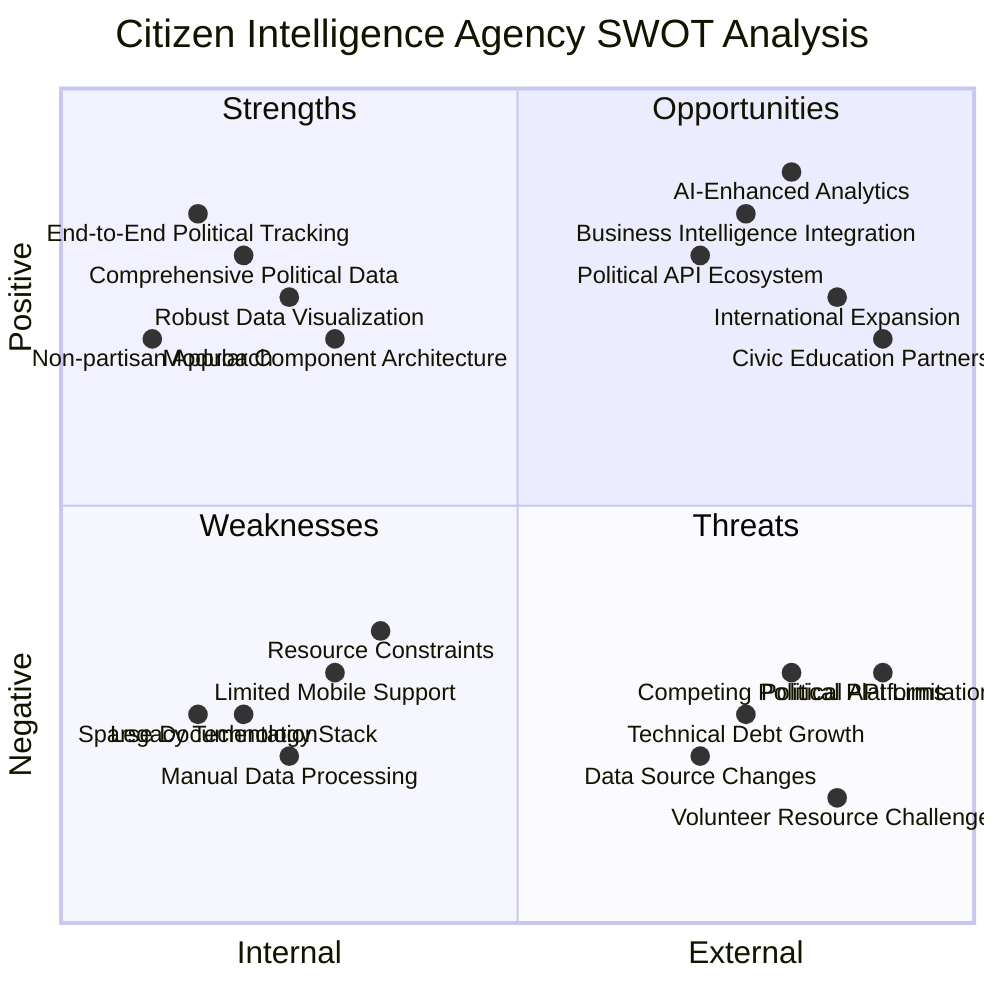
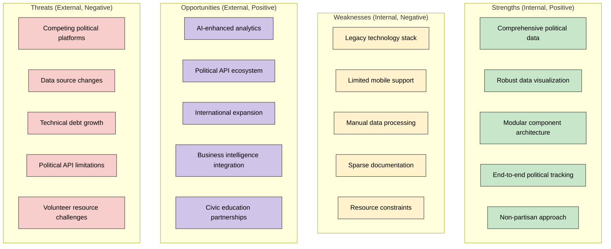
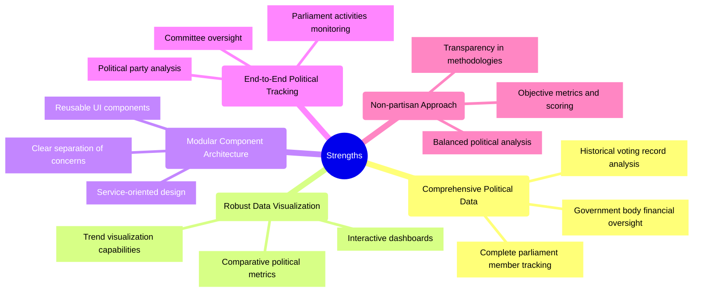
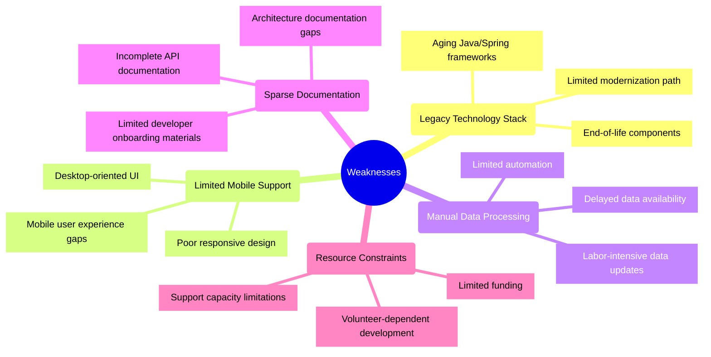
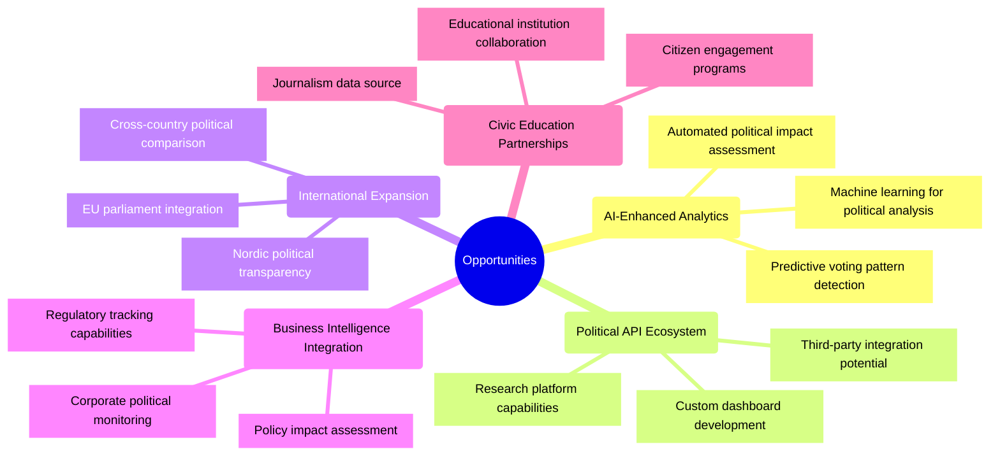
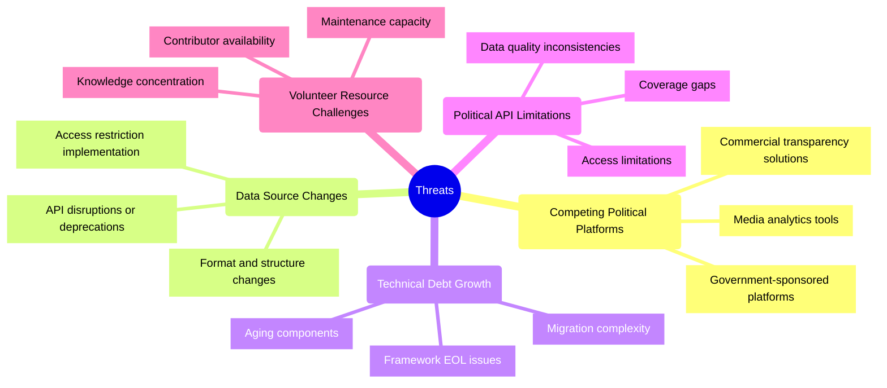
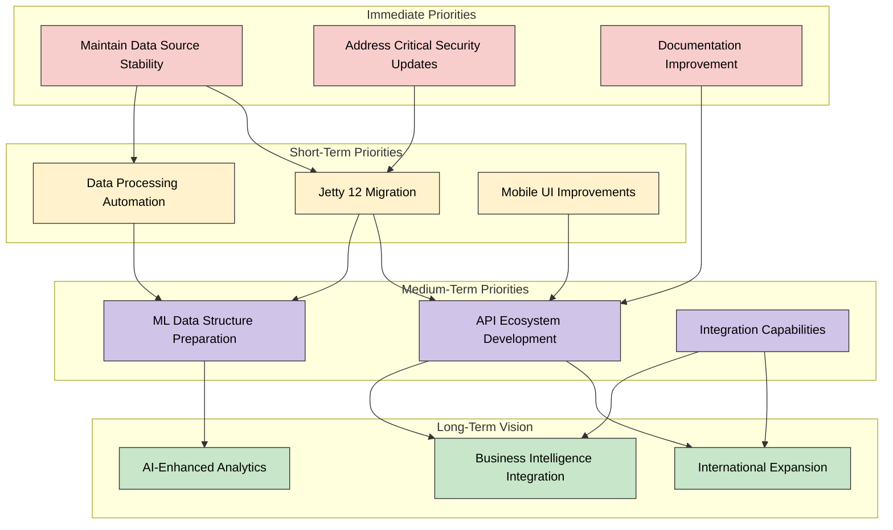

# 🧩 Citizen Intelligence Agency SWOT Analysis

This document provides a strategic analysis of the Citizen Intelligence Agency's current strengths, weaknesses, opportunities, and threats. This analysis helps inform the roadmap for future development and strategic decision-making.

## 📚 Related Architecture Documentation

<div class="documentation-map">

| Document                                            | Focus           | Description                               | Documentation Link                                                              |
| --------------------------------------------------- | --------------- | ----------------------------------------- | ------------------------------------------------------------------------------- |
| **[Current Architecture](ARCHITECTURE.md)**         | 🏛️ Architecture | C4 model showing current system structure | [View in Portal](https://hack23.github.io/cia/architecture.html)                |
| **[Future Architecture](FUTURE_ARCHITECTURE.md)**   | 🏛️ Architecture | Vision for ML-enhanced platform           | [View in Portal](https://hack23.github.io/cia/future-architecture.html)         |
| **[State Diagrams](STATEDIAGRAM.md)**               | 🔄 Behavior     | Current system state transitions          | [View in Portal](https://hack23.github.io/cia/statediagram.html)               |
| **[Future State Diagrams](FUTURE_STATEDIAGRAM.md)** | 🔄 Behavior     | Enhanced adaptive state transitions       | [View in Portal](https://hack23.github.io/cia/future-statediagram.html)        |
| **[Process Flowcharts](FLOWCHART.md)**              | 🔄 Process      | Current data processing workflows         | [View in Portal](https://hack23.github.io/cia/flowchart.html)                  |
| **[Future Flowcharts](FUTURE_FLOWCHART.md)**        | 🔄 Process      | Enhanced AI-driven workflows              | [View in Portal](https://hack23.github.io/cia/future-flowchart.html)           |
| **[Mindmaps](MINDMAP.md)**                          | 🧠 Concept      | Current system component relationships    | [View in Portal](https://hack23.github.io/cia/mindmap.html)                    |
| **[Future Mindmaps](FUTURE_MINDMAP.md)**            | 🧠 Concept      | Future capability evolution               | [View in Portal](https://hack23.github.io/cia/future-mindmap.html)             |
| **[Future SWOT Analysis](FUTURE_SWOT.md)**          | 💼 Business     | Future strategic opportunities            | [View in Portal](https://hack23.github.io/cia/future-swot.html)                |
| **[CI/CD Workflows](WORKFLOWS.md)**                 | 🔧 DevOps       | Current automation processes              | [View in Portal](https://hack23.github.io/cia/workflows.html)                  |
| **[Future Workflows](FUTURE_WORKFLOWS.md)**         | 🔧 DevOps       | Enhanced CI/CD with ML                    | [View in Portal](https://hack23.github.io/cia/future-workflows.html)           |
| **[README](README.md)**                             | 📘 Overview     | Project introduction and key links        | [View in Portal](https://hack23.github.io/cia/)                                |
| **[CIA Features](https://hack23.com/cia-features.html)** | 🚀 Features | Platform features overview                | [View on hack23.com](https://hack23.com/cia-features.html)                     |

</div>

## SWOT Overview

### Traditional SWOT Quadrant Chart

**Strategic Focus:** This quadrant chart provides a visual representation of the Citizen Intelligence Agency's strengths, weaknesses, opportunities, and threats arranged by their internal/external nature and positive/negative impact.



### Alternative Network Visualization

<!-- Quadrant charts are not well supported in GitHub Markdown, so providing an alternative mermaid diagram -->



## Strengths



### Current Strengths Analysis

The Citizen Intelligence Agency has established several key strengths that provide a solid foundation for its political transparency mission:

1. **Comprehensive Political Data**: The platform successfully integrates multiple sources of political data including Parliament API, Election Authority data, and government body financial information, providing a holistic view of the Swedish political landscape.

2. **Robust Data Visualization**: Through well-designed dashboards, charts, and comparative displays, the platform makes complex political data accessible and meaningful to users of varying technical backgrounds.

3. **Modular Component Architecture**: The application employs a consistent Spring/Vaadin architecture with well-defined component hierarchies, clear separation of concerns, and reusable UI patterns that enhance maintainability.

4. **End-to-End Political Tracking**: The comprehensive coverage spans from individual politicians to committees, parties, and government bodies, enabling users to track activities across the entire political process.

5. **Non-partisan Approach**: The platform maintains an objective stance, using consistent methodologies to evaluate political activities regardless of party or ideology, enhancing credibility and trustworthiness.

## Weaknesses



### Current Weaknesses Analysis

Several weaknesses present challenges for the ongoing development and support of the platform:

1. **Legacy Technology Stack**: The platform relies on aging frameworks and components including Vaadin 8 and Spring 5.x that will eventually reach EOL, creating future migration challenges as outlined in the [End-of-Life Strategy](End-of-Life-Strategy.md).

2. **Limited Mobile Support**: The current UI implementation is primarily designed for desktop use with limited responsive design, creating a sub-optimal experience for the growing segment of mobile users.

3. **Manual Data Processing**: Despite some automation, significant manual effort is required to process and integrate data from various political sources, causing delays in data updates and resource constraints.

4. **Sparse Documentation**: While improving, there are still gaps in documentation for APIs, architecture, and developer onboarding, creating potential barriers to new contributor engagement.

5. **Resource Constraints**: As a volunteer-driven project with limited funding, the platform faces challenges in maintaining consistent development velocity and supporting user growth.

## Opportunities



### Future Opportunities Analysis

Looking forward, several opportunities exist for growth and enhancement:

1. **AI-Enhanced Analytics**: As detailed in the [Future Mindmap](FUTURE_MINDMAP.md), incorporating machine learning and AI could provide predictive analytics, automated pattern detection, and enhanced political insights beyond what is currently possible.

2. **Political API Ecosystem**: Developing a comprehensive API would enable third-party developers, researchers, and organizations to build on the platform's data, extending reach and impact.

3. **International Expansion**: Extending coverage to other Nordic countries, the EU Parliament, or creating comparative political analysis tools would significantly increase the platform's relevance and user base.

4. **Business Intelligence Integration**: Creating connections with business intelligence tools and developing features for policy impact assessment could open new use cases for corporate and organizational users.

5. **Civic Education Partnerships**: Collaborating with educational institutions, journalism outlets, and civic engagement programs could boost adoption and strengthen the platform's role in democratic transparency.

## Threats



### Current Threats Analysis

Several external threats could impact the project's success:

1. **Competing Political Platforms**: Commercial products, government platforms, and media tools offering similar functionality could challenge the platform's user adoption and relevance.

2. **Data Source Changes**: The platform's reliance on external data APIs creates vulnerability to changes in those sources, including format changes, API deprecations, or access restrictions.

3. **Technical Debt Growth**: As detailed in the [End-of-Life Strategy](End-of-Life-Strategy.md), the aging technology stack creates growing technical debt that will eventually require significant investment to address.

4. **Political API Limitations**: Issues with the quality, timeliness, or completeness of political data from source APIs can affect the platform's accuracy and value.

5. **Volunteer Resource Challenges**: The volunteer-driven nature of the project creates risks around consistent development progress, knowledge retention, and long-term maintenance capacity.

## Strategic Focus Areas

Based on the SWOT analysis, the following strategic focus areas emerge as priorities:

1. **Modernize Critical Architecture Components**:
   - Implement the transition to Jetty 12 as described in [End-of-Life Strategy](End-of-Life-Strategy.md)
   - Evaluate selective modernization of UI components
   - Strengthen security implementation as outlined in [Financial Security Plan](FinancialSecurityPlan.md)

2. **Enhance Data Processing Automation**:
   - Improve data ingestion pipelines from political sources
   - Implement advanced data validation and error handling
   - Create monitoring for data source changes

3. **Prepare for AI/ML Integration**:
   - Develop data structures supporting future ML capabilities
   - Identify high-value analytics use cases
   - Create roadmap for [Future Architecture](FUTURE_MINDMAP.md) implementation

4. **Strengthen Documentation and Community**:
   - Complete comprehensive API documentation
   - Enhance developer onboarding materials
   - Create contributor engagement program

5. **Optimize Mobile Experience**:
   - Improve responsive design implementation
   - Prioritize mobile-friendly features
   - Consider progressive web app capabilities

## Implementation Prioritization



## Development Timeline

```mermaid
gantt
    title Strategic Development Timeline
    dateFormat YYYY-Q1
    axisFormat %Y-%q
    
    section Technology Stability
    Jetty 12 Migration                    :a1, 2024-Q1, 2quarters
    Dependency Security Updates           :a2, 2024-Q1, 4quarters
    Documentation Enhancement             :a3, 2024-Q1, 3quarters
    
    section Data Processing
    Automated Data Pipeline Improvement   :b1, 2024-Q2, 2quarters
    Data Validation Enhancement           :b2, 2024-Q3, 2quarters
    Data Source Monitoring                :b3, 2024-Q4, 1quarters
    
    section User Experience
    Mobile Responsive Improvements        :c1, 2024-Q3, 2quarters
    UI Component Modernization            :c2, 2025-Q1, 3quarters
    Performance Optimization              :c3, 2025-Q2, 2quarters
    
    section Future Capabilities
    API Ecosystem Development             :d1, 2024-Q4, 3quarters
    ML Data Structure Preparation         :d2, 2025-Q1, 2quarters
    Integration Framework                 :d3, 2025-Q2, 2quarters
    Initial AI Analytics Features         :d4, 2025-Q3, 3quarters
```

## Conclusion

The Citizen Intelligence Agency platform has established strong foundations with its comprehensive political data and robust visualization capabilities. By addressing key weaknesses in the technology stack, mobile experience, and data processing automation, while simultaneously preparing for future AI-enhanced analytics, the platform can maintain its relevance and impact.

Strategic priorities should balance immediate stability needs with incremental progress toward the future vision outlined in the [Future Mindmap](FUTURE_MINDMAP.md). The volunteer-driven nature of the project necessitates careful resource allocation, with an emphasis on sustainable development practices and community building.

The ultimate goal remains enhancing political transparency and citizen engagement, with technology serving as an enabler for democratic participation and informed decision-making.

<div class="chart-legend">
The color scheme used in these diagrams follows the consistent palette used throughout the architecture documentation:

- **Strengths** (Green - #c8e6c9): Represents positive internal factors
- **Weaknesses** (Yellow - #fff2cc): Represents negative internal factors
- **Opportunities** (Purple - #d1c4e9): Represents positive external factors
- **Threats** (Red - #f8cecc): Represents negative external factors
</div>
