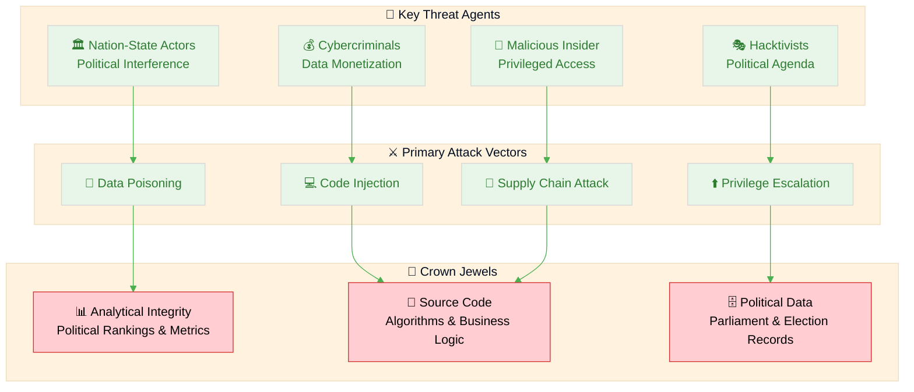
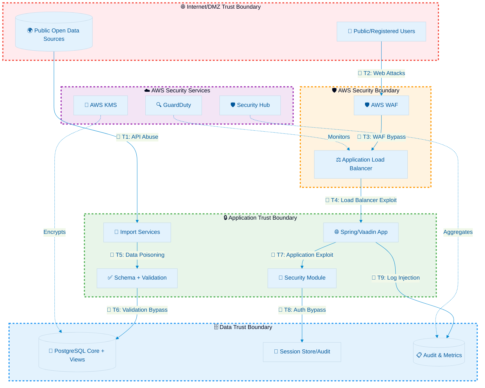
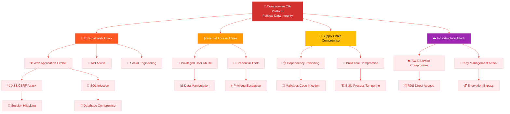
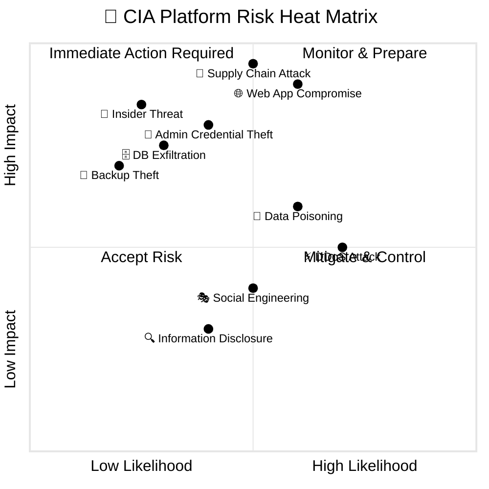
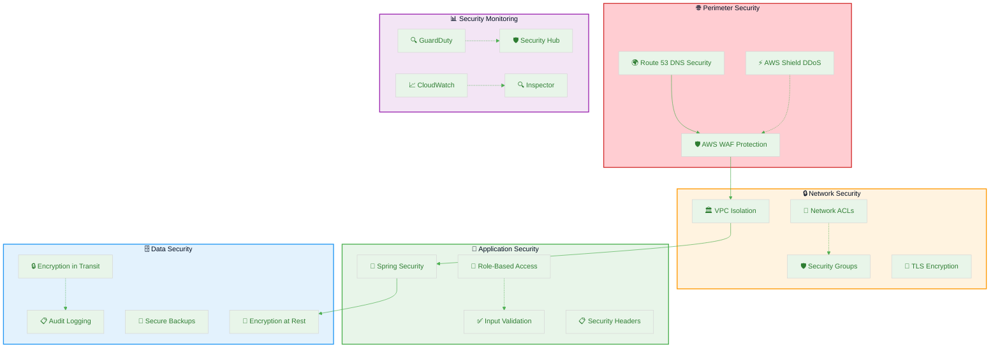
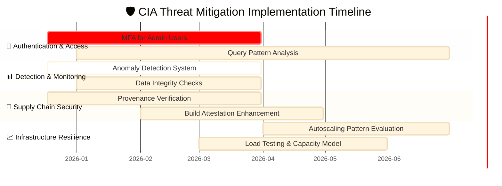
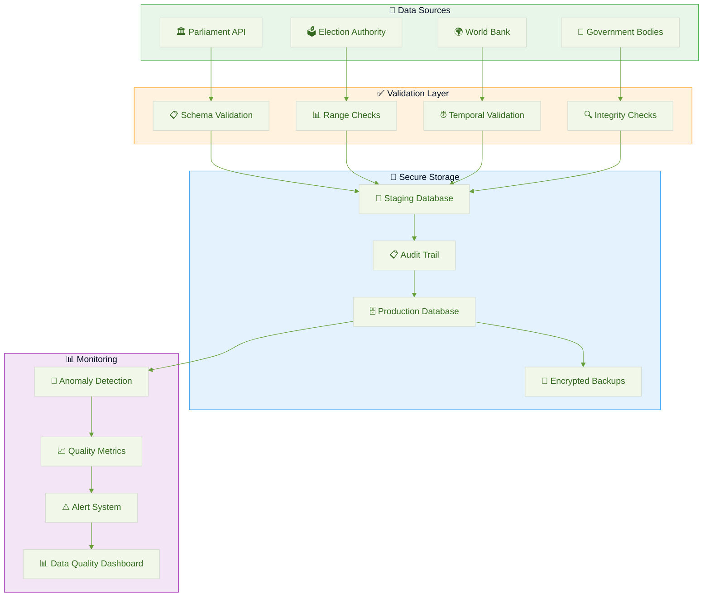

  

<h1 align="center">🎯 Citizen Intelligence Agency — Threat Model</h1>

  <strong>🛡️ Proactive Security Through Structured Threat Analysis</strong> 
  <em>🔍 STRIDE • MITRE ATT&CK • CIA System Architecture • Public Transparency</em>

  
  
  
  

**📋 Document Owner:** CEO | **📄 Version:** 2.0 | **📅 Last Updated:** 2025-12-18 (UTC)  
**🔄 Review Cycle:** Annual | **⏰ Next Review:** 2026-12-18  
**🏷️ Classification:** Public (Open Civic Transparency Platform)

---

## 🎯 Purpose & Scope

Establish a comprehensive threat model for the Citizen Intelligence Agency (CIA) civic transparency platform (Swedish parliamentary/open data OSINT). This systematic threat analysis integrates multiple threat modeling frameworks to ensure proactive security through structured analysis.

### **🌟 Transparency Commitment**
This threat model demonstrates **🛡️ cybersecurity consulting expertise** through public documentation of advanced threat assessment methodologies, showcasing our **🏆 competitive advantage** via systematic risk management and **🤝 customer trust** through transparent security practices.

*— Based on Hack23 AB's commitment to security through transparency and excellence*

### **📚 Framework Integration**
- **🎭 STRIDE per architecture element:** Systematic threat categorization
- **🎖️ MITRE ATT&CK mapping:** Advanced threat intelligence integration
- **🏗️ Asset-centric analysis:** Critical resource protection focus
- **🎯 Scenario-centric modeling:** Real-world attack simulation
- **⚖️ Risk-centric assessment:** Business impact quantification

### **🔍 Scope Definition**
**Included Systems:**
- 🌐 Web application (Vaadin/Spring framework)
- 🔄 Data ingestion/import services
- 💾 PostgreSQL persistence + analytical views
- 🔐 Authentication / session / audit subsystems
- ☁️ AWS infrastructure (WAF, ALB, EC2, RDS, KMS, GuardDuty, Security Hub)

**Out of Scope:**
- Third-party downstream consumers of published open dashboards (read-only usage)
- External data source security (Parliament API, Election Authority, World Bank)

### **🔗 Policy Alignment**
Integrated with [🎯 Hack23 AB Threat Modeling Policy](https://github.com/Hack23/ISMS-PUBLIC/blob/main/Threat_Modeling.md) methodology and frameworks.

---

## 📊 System Classification & Operating Profile

### **🏷️ Security Classification Matrix**

| Dimension | Level | Rationale | Business Impact |
|----------|-------|-----------|----------------|
| **🔐 Confidentiality** |  | Parliamentary, governmental, or open economic sources |  |
| **🔒 Integrity** |  | Analytical credibility & ranking accuracy critical |  |
| **⚡ Availability** |  | Public civic transparency; tolerates brief maintenance |  |

### **⚖️ Regulatory & Compliance Profile**

| Compliance Area | Classification | Implementation Status |
|-----------------|----------------|----------------------|
| **📋 Regulatory Exposure** | Low | Mostly open data; minimal personal data (user accounts only) |
| **🇪🇺 CRA (EU Cyber Resilience Act)** | Low baseline | Non–safety-critical civic analytics; maintains secure development controls |
| **📊 SLA Targets (Internal)** | 99.5% | Single-region + resilience roadmap |
| **🔄 RPO / RTO** | RPO ≤ 24h / RTO ≤ 4h | Acceptable for civic analytics with daily refresh cadence |

---

## 💎 Critical Assets & Protection Goals

### **🏗️ Asset-Centric Threat Analysis**

Following [Hack23 AB Asset-Centric Threat Modeling](https://github.com/Hack23/ISMS-PUBLIC/blob/main/Threat_Modeling.md#asset-centric-threat-modeling) methodology:

| Asset Category | Why Valuable | Threat Goals | Key Controls | Business Value |
|----------------|--------------|-------------|-------------|----------------|
| **📊 Analytical Integrity** | Public trust in political metrics | Tampering, covert manipulation | DB RBAC, immutable audit (Javers), CSP, WAF |  |
| **🧠 Source Code** | Policy logic, ranking algorithms | IP theft, malicious injection | Private repo controls, dependency scanning, SLSA provenance |  |
| **🔄 Import Pipelines** | Freshness & correctness | Poisoned input, replay, API abuse | Input validation, schema checks, rate limiting |  |
| **👤 User Accounts** | Abuse vector | Credential stuffing, enumeration | Login throttling, password policy, MFA optional path |  |
| **🔑 Admin Role** | Elevated capability | Privilege escalation | Method-level @Secured, restricted session generation |  |
| **☁️ Infrastructure Config** | Security baseline | Supply chain/manipulation | Template versioning, provenance attestations |  |

### **🔐 Crown Jewel Analysis**

---

## 🌐 Data Flow & Architecture Analysis

### **🏛️ Architecture-Centric STRIDE Analysis**

Following [Architecture-Centric Threat Modeling](https://github.com/Hack23/ISMS-PUBLIC/blob/main/Threat_Modeling.md#architecture-centric-threat-modeling) methodology:

### **🎭 STRIDE per Element Analysis**

| Element | S | T | R | I | D | E | Notable Mitigations |
|---------|---|---|---|---|---|---|---------------------|
| **🌐 Web Entry (WAF/ALB)** | IP spoof | Header tamper | Limited | TLS downgrade | L7 flood | — | WAF managed rules, TLS policy |
| **🖥️ Vaadin UI** | Session hijack | DOM/script injection (XSS) | Action denial | Leakage via mis-render | Render lock | View bypass | CSP, HSTS, security headers |
| **⚙️ Service Layer** | Impersonation | Parameter tampering | Log forging | Data mapping leak | Thread starvation | Priv esc via service call | Method @Secured, input canonicalization |
| **🔄 Import Jobs** | Source spoof | Payload corruption | Replay abuse | Poisoned dataset | Batch backlog | Elevated connector perms | Source signature checks, schema validation |
| **💾 Database** | Connection spoof | Row/column mod | Transaction denial | Full dump | Connection exhaustion | Role escalation | Least-privilege roles, network isolation |
| **🔑 Session/Audit** | Token substitution | Log injection | Non-repudiation risk | PII over-log | Log flooding | Log privilege misuse | Structured logging, size limits |
| **🔧 Build/CI** | Actor spoof (PR) | Artifact tamper | Tamper denial | Secret exposure | Runner exhaustion | Escalated workflow perms | Hardening, pin actions, attestations |
| **🔐 Secrets Manager** | API misuse | Secret overwrite | Retrieval repudiation | Broad read | API flood | Policy bypass | IAM SCP, rotation, minimal scope |

---

## 🎖️ MITRE ATT&CK Framework Integration

### **🔍 Attacker-Centric Analysis**

Following [MITRE ATT&CK-Driven Analysis](https://github.com/Hack23/ISMS-PUBLIC/blob/main/Threat_Modeling.md#mitre-attck-driven-analysis) methodology:

| Phase | Technique | ID | CIA Context | Control | Detection |
|-------|----------|----|-------------|---------|-----------|
| **🔍 Initial Access** | Exploit Public-Facing App | [T1190](https://attack.mitre.org/techniques/T1190/) | Web endpoints, API services | WAF, patch cadence, input validation | WAF logs, application monitoring |
| **🔍 Initial Access** | Phishing for Credentials | [T1566](https://attack.mitre.org/techniques/T1566/) | Admin/user login targeting | Password policy, lockouts, awareness | Failed login monitoring, email security |
| **⚡ Execution** | Command/Script Interpreter | [T1059](https://attack.mitre.org/techniques/T1059/) | Limited server scripts | Hardened AMI, no interactive shells | Process monitoring, endpoint detection |
| **🔄 Persistence** | Valid Accounts | [T1078](https://attack.mitre.org/techniques/T1078/) | Compromised user accounts | Login attempt throttling, MFA | Account monitoring, behavioral analysis |
| **⬆️ Priv Esc** | Exploit for Priv Esc | [T1068](https://attack.mitre.org/techniques/T1068/) | JVM/OS vulnerabilities | Patch mgmt, Inspector scanning | Vulnerability scanning, system monitoring |
| **🎭 Defense Evasion** | Obfuscated Files | [T1027](https://attack.mitre.org/techniques/T1027/) | Malicious libraries | SCA + SBOM diff, code review | Static analysis, artifact scanning |
| **🔑 Credential Access** | Brute Force | [T1110](https://attack.mitre.org/techniques/T1110/) | Login form attacks | Throttling, IP/session caps | Login attempt monitoring, rate limiting |
| **🔍 Discovery** | Application Enumeration | [T1083](https://attack.mitre.org/techniques/T1083/) | Public endpoint scanning | Rate limits, minimal error detail | Access pattern analysis, traffic monitoring |
| **📤 Exfiltration** | Exfil Over HTTPS | [T1041](https://attack.mitre.org/techniques/T1041/) | Bulk data export via APIs | Query limits, audit logging | Data volume monitoring, unusual access patterns |
| **💥 Impact** | Data Manipulation | [T1565](https://attack.mitre.org/techniques/T1565/) | Rankings/doc count tampering | Integrity validation jobs, checksums | Data integrity monitoring, change detection |

### **🌳 Attack Tree Analysis**

---

## 🎯 Priority Threat Scenarios

### **🔴 Critical Threat Scenarios**

Following [Risk-Centric Threat Modeling](https://github.com/Hack23/ISMS-PUBLIC/blob/main/Threat_Modeling.md#risk-centric-threat-modeling) methodology:

| # | Scenario | MITRE Tactic | Impact Focus | Likelihood | Risk | Key Mitigations | Residual Action |
|---|----------|--------------|--------------|------------|------|-----------------|-----------------|
| **1** | **🌐 Web Application Compromise** | [Initial Access](https://attack.mitre.org/tactics/TA0001/) | Data integrity manipulation | Medium |  | WAF, validation, ORM parameterization | Add periodic data hash verification |
| **2** | **🔗 Supply Chain Dependency Attack** | [Initial Access](https://attack.mitre.org/tactics/TA0001/) | Code integrity & confidentiality | Medium |  | SBOM, pin SHAs, attestations | Add provenance verification policy gate |
| **3** | **🔑 Administrative Credential Compromise** | [Credential Access](https://attack.mitre.org/tactics/TA0006/) | System-wide access | Low-Med |  | Lockouts, strong policy, IP rate limiting | Enforce mandatory MFA for admin |
| **4** | **🗄️ Database Exfiltration** | [Exfiltration](https://attack.mitre.org/tactics/TA0010/) | Political data confidentiality | Low |  | Network isolation, least privilege | Implement query anomaly detection |
| **5** | **🔄 Import Pipeline Data Poisoning** | [Impact](https://attack.mitre.org/tactics/TA0040/) | Analytical integrity | Medium |  | Schema validation, duplicate detection | Add source signature/etag validation |
| **6** | **⚡ Distributed Denial of Service** | [Impact](https://attack.mitre.org/tactics/TA0040/) | Service availability | Medium |  | WAF rate limits, autoscaling planned | Load test + capacity model update |

### **⚖️ Risk Heat Matrix**

---

## 🛡️ Comprehensive Security Control Framework

### **🔒 Defense-in-Depth Architecture**

Aligned with [Security Architecture](SECURITY_ARCHITECTURE.md) implementation:

### **🎭 STRIDE → Control Mapping**

| STRIDE Category | Example Threat | Primary Control | Secondary Control | Monitoring |
|----------------|----------------|-----------------|-------------------|------------|
| **🎭 Spoofing** | Credential stuffing | Throttling + password policy | MFA (admin), account lockout | Failed login attempts, IP tracking |
| **🔧 Tampering** | SQL/logic manipulation | Parameterized queries, ORM | WAF rules, input validation | Database activity monitoring |
| **❌ Repudiation** | Action denial | Immutable audit logs (Javers) | Correlated session IDs | Comprehensive audit trail |
| **📤 Information Disclosure** | Data exfiltration | Network isolation, encryption | Row-level access control | Unusual query pattern detection |
| **⚡ Denial of Service** | Request flood | WAF rate limiting | Auto-scaling, resource sizing | Traffic pattern analysis |
| **⬆️ Elevation of Privilege** | Privilege escalation | Method @Secured annotations | Separate admin role tokens | Privilege usage monitoring |

---

## 🔄 Continuous Validation & Assessment

### **🎪 Threat Modeling Workshop Process**

Following [Hack23 AB Workshop Framework](https://github.com/Hack23/ISMS-PUBLIC/blob/main/Threat_Modeling.md#threat-modeling-workshop-framework):

### **📅 Assessment Lifecycle**

| Assessment Type | Trigger | Frequency | Scope | Documentation Update |
|----------------|---------|-----------|-------|---------------------|
| **📅 Comprehensive Review** | Annual cycle | Annual | Complete threat model | Full document revision |
| **🔄 Delta Assessment** | Architecture changes | Per change | Modified components | Incremental updates |
| **🚨 Incident-Driven** | Security events | As needed | Affected systems | Lessons learned integration |
| **🎯 Threat Intelligence** | New attack patterns | Quarterly | High-risk scenarios | MITRE ATT&CK updates |

### **📊 Validation Pipeline Integration**

Aligned with [CI/CD Workflows](WORKFLOWS.md) security gates:

| Control Layer | Pipeline Evidence | Enforcement | Threat Coverage |
|---------------|-------------------|-------------|----------------|
| **🔍 SAST** | SonarCloud scan | Quality gate | Code injection, logic flaws |
| **📦 SCA** | Dependency/SBOM + submission | Fails on high CVE | Supply chain attacks |
| **🔗 Supply Chain** | Attest-build-provenance + attest-sbom | Signature presence | Build integrity |
| **🔍 Secret Scanning** | GitHub native + custom patterns | Alert + block | Credential exposure |
| **👥 Code Review** | Mandatory PR + labeler | Branch rule | Human verification |
| **🛡️ Artifact Integrity** | SLSA provenance | Release gating | Deployment integrity |

---

## 🔄 Mitigation Roadmap

### **📅 Implementation Timeline**

| Item | Type | ETA | Owner | Status | Business Value |
|------|------|-----|-------|--------|----------------|
| **🔐 MFA enforcement for admin users** | Preventive | Q1 2026 | Security | Planned |  |
| **📊 Anomaly detection for metrics drift** | Detective | Q1 2026 | Data | Planned |  |
| **🔍 Query pattern analysis** | Detective | Q2 2026 | DevSecOps | Backlog |  |
| **✅ Provenance verification gate** | Preventive | Q1 2026 | Platform | In design |  |
| **🔐 Data integrity digest checks** | Detective | Q1 2026 | Data | Planned |  |
| **📈 Autoscaling pattern evaluation** | Resilience | Q2 2026 | Infra | Backlog |  |

### **🎯 Strategic Development Timeline**

---

## 🛡️ Supply Chain Security Framework

### **🔗 Software Supply Chain Threats**

| Vector | Threat Description | MITRE Technique | Control | Detection |
|--------|-------------------|-----------------|---------|-----------|
| **📦 Dependency Poisoning** | Malicious packages in dependencies | [Supply Chain Compromise](https://attack.mitre.org/techniques/T1195/) | SBOM + vulnerability scanning | Dependency diff monitoring |
| **🔧 Build Tool Compromise** | Compromised CI/CD infrastructure | [Build Image Compromise](https://attack.mitre.org/techniques/T1525/) | Hardened runners + attestations | Build artifact verification |
| **📝 Source Code Tampering** | Unauthorized code modifications | [Software Deployment Tools](https://attack.mitre.org/techniques/T1072/) | Code signing + branch protection | Commit signature verification |
| **🏗️ Infrastructure as Code** | Malicious infrastructure templates | [Cloud Instance Metadata API](https://attack.mitre.org/techniques/T1552/005/) | Template scanning + approval | IaC drift detection |
| **🎯 Artifact Substitution** | Deployment package replacement | [Man-in-the-Middle](https://attack.mitre.org/techniques/T1557/) | Provenance attestations | Checksum verification |

### **🔒 Supply Chain Controls Matrix**

| Control Category | Implementation | Verification | Monitoring |
|------------------|----------------|--------------|------------|
| **🔐 Source Integrity** | Signed commits, branch protection | GPG signature verification | Git audit logs |
| **📦 Dependency Security** | SBOM generation, SCA scanning | Vulnerability database checks | Dependency update monitoring |
| **🏗️ Build Security** | Hardened runners, secure environments | Build reproducibility | Build log analysis |
| **🛡️ Artifact Security** | SLSA provenance, digital signatures | Signature verification | Artifact integrity checks |
| **🚀 Deployment Security** | Secure channels, access controls | Deployment verification | Deployment monitoring |

---

## 🌍 Open Data Integrity Framework

### **📊 Data Source Validation**

Following open data principles while maintaining security:

| Risk Category | Validation Control | Implementation | Monitoring |
|---------------|-------------------|----------------|------------|
| **📡 API Schema Changes** | Schema validation + version checks | Automated schema comparison | API response structure monitoring |
| **🔄 Partial Data Ingestion** | Transactional batches + row counting | Database transaction management | Data completeness verification |
| **🔄 Data Replay Attacks** | Timestamp freshness validation | Chronological data verification | Temporal anomaly detection |
| **📈 Malicious Data Inflation** | Range + sanity rule validation | Statistical outlier detection | Data distribution analysis |
| **❌ Hidden Data Nullification** | NOT NULL constraints + validation | Database constraint enforcement | Missing data pattern detection |

### **🔍 Data Integrity Architecture**

---

## 📚 Related Documents

| Document | Purpose | Integration Point |
|----------|---------|-------------------|
| **[🏛️ Architecture](ARCHITECTURE.md)** | System architecture context | Trust boundaries, component analysis |
| **[🔐 Security Architecture](SECURITY_ARCHITECTURE.md)** | Implemented security controls | Defense-in-depth validation |
| **[💰 Financial Security Plan](FinancialSecurityPlan.md)** | Cost & AWS security services | Control cost-benefit analysis |
| **[📅 End-of-Life Strategy](End-of-Life-Strategy.md)** | Lifecycle risk constraints | Technology risk assessment |
| **[🔧 CI/CD Workflows](WORKFLOWS.md)** | CI/CD enforcement gates | Pipeline security validation |
| **[📊 Data Model](DATA_MODEL.md)** | Integrity-critical schema context | Data protection requirements |
| **[🧠 System Mindmap](MINDMAP.md)** | Component relationships overview | Asset identification |
| **[🚀 CIA Features](https://hack23.com/cia-features.html)** | Platform capabilities | Attack surface analysis |

---

**📋 Document Control:**  
**✅ Approved by:** James Pether Sörling, CEO  
**📤 Distribution:** Public  
**🏷️ Classification:**   
**📅 Effective Date:** 2025-12-18  
**⏰ Next Review:** 2026-12-18  
**🎯 Framework Compliance:**    
