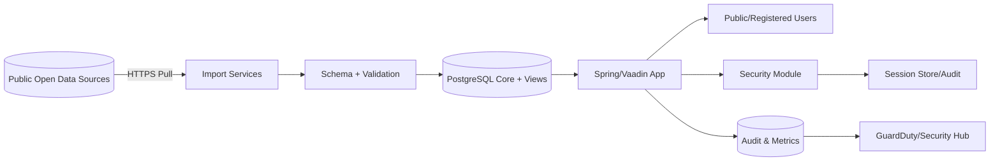
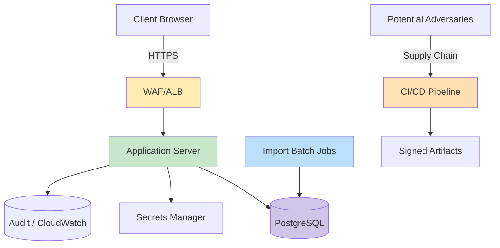

<p align="center">
  
</p>

<h1 align="center">🎯 Citizen Intelligence Agency — Threat Model</h1>

<p align="center">
  <strong>🛡️ Proactive Security Through Structured Threat Analysis</strong><br>
  <em>🔍 STRIDE • MITRE ATT&CK • CIA System Architecture • Public Transparency</em>
</p>

<p align="center">
  <a></a>
  <a></a>
  <a></a>
  <a></a>
</p>

**📋 Document Owner:** CEO | **📄 Version:** 1.0 | **📅 Last Updated:** 2025-09-18 (UTC)  
**🔄 Review Cycle:** Annual | **⏰ Next Review:** 2026-09-18  
**🏷️ Classification:** Public (Open Civic Transparency Platform)

---

## 1. Purpose & Scope

Establish a living threat model for the Citizen Intelligence Agency (CIA) civic transparency platform (Swedish parliamentary/open data OSINT). Integrates:
- STRIDE per architecture element
- MITRE ATT&CK mapping
- Asset-centric + scenario + architecture + risk-centric hybrid
- Alignment with: SECURITY_ARCHITECTURE.md, FinancialSecurityPlan.md, End-of-Life-Strategy.md, Secure Development Policy (ISMS-PUBLIC)

Scope includes:
- Web application (Vaadin/Spring)  
- Data ingestion/import services  
- PostgreSQL persistence + analytical views  
- Authentication / session / audit subsystems  
- AWS infrastructure (WAF, ALB, EC2, RDS, KMS, GuardDuty, Security Hub)  

Out of scope: Third-party downstream consumers of published open dashboards (read-only usage).

---

## 2. System Classification Snapshot (Platform Operating Profile)

| Dimension | Level | Rationale |
|----------|-------|-----------|
| Confidentiality | Low / Public | Data is parliamentary, governmental, or open economic sources |
| Integrity | High | Analytical credibility & ranking accuracy must not be tampered |
| Availability | Medium-High | Public civic transparency; tolerates brief maintenance but not prolonged denial |
| Regulatory Exposure | Low | Mostly open data; minimal personal data (user accounts only) |
| CRA (EU Cyber Resilience Act) Profile | Low baseline | Non–safety-critical civic analytics; still maintains secure development controls |
| SLA Targets (Internal) | 99.5% | Single-region + resilience roadmap |
| RPO / RTO | RPO ≤ 24h / RTO ≤ 4h | Acceptable for civic analytics with daily refresh cadence |

---

## 3. Critical Assets & Protection Goals

| Asset | Why Valuable | Threat Goals | Key Controls |
|-------|--------------|-------------|-------------|
| Analytical Integrity (scores, rankings) | Public trust | Tampering, covert manipulation | DB RBAC, immutable audit (Javers), CSP, WAF |
| Source Code (policy logic, ranking algorithms) | Integrity & reputational trust | IP theft, malicious injection | Private repo controls, dependency scanning, SLSA provenance |
| Import Pipelines (parliament/election/world bank) | Freshness & correctness | Poisoned input, replay, API abuse | Input validation, schema checks, rate limiting |
| User Accounts (non-admin) | Abuse vector | Credential stuffing, enumeration | Login throttling, password policy, MFA optional path |
| Admin Role | Elevated capability | Privilege escalation | Method-level @Secured, restricted session generation |
| Infrastructure Config (CloudFormation) | Security baseline | Supply chain/manipulation | Template versioning, provenance attestations |
| Secrets (DB creds) | Backend access | Exfiltration | AWS Secrets Manager + rotation |
| Logs / Audit Trails | Forensics trust | Deletion / tampering | Centralized CloudWatch + retention + restricted write |
| SBOM / Attestations | Supply chain trust | Substitution / forgery | Sigstore provenance, GitHub attestation workflows |

---

## 4. Data Flow (High-Level)



---

## 5. STRIDE per Element (Summary Matrix)

| Element | S | T | R | I | D | E | Notable Mitigations |
|---------|---|---|---|---|---|---|---------------------|
| Web Entry (WAF/ALB) | IP spoof | Header tamper | Limited | TLS downgrade | L7 flood | — | WAF managed rules, TLS policy |
| Vaadin UI | Session hijack | DOM/script injection (XSS) | Action denial | Leakage via mis-render | Render lock | View bypass | CSP, HSTS, security headers |
| Service Layer | Impersonation | Parameter tampering | Log forging | Data mapping leak | Thread starvation | Priv esc via service call | Method @Secured, input canonicalization |
| Import Jobs | Source spoof | Payload corruption | Replay abuse | Poisoned dataset | Batch backlog | Elevated connector perms | Source signature checks, schema validation |
| Database | Connection spoof | Row/column mod | Transaction denial | Full dump | Connection exhaustion | Role escalation | Least-privilege roles, network isolation |
| Session/Audit | Token substitution | Log injection | Non-repudiation risk | PII over-log | Log flooding | Log privilege misuse | Structured logging, size limits |
| Build/CI | Actor spoof (PR) | Artifact tamper | Tamper denial | Secret exposure | Runner exhaustion | Escalated workflow perms | Hardening, pin actions, attestations |
| Secrets Manager | API misuse | Secret overwrite | Retrieval repudiation | Broad read | API flood | Policy bypass | IAM SCP, rotation, minimal scope |

---

## 6. MITRE ATT&CK Mapping (Focused Set)

| Phase | Technique | ID | CIA Context | Control |
|-------|----------|----|-------------|---------|
| Initial Access | Exploit Public-Facing App | T1190 | Web endpoints | WAF, patch cadence |
| Initial Access | Phishing for Credentials | T1566 | Admin/user login | Password policy, lockouts |
| Execution | Command/Script Interpreter | T1059 | Limited (server scripts) | Hardened AMI, no interactive shells |
| Persistence | Valid Accounts | T1078 | Compromised user | Login attempt throttling |
| Priv Esc | Exploit for Priv Esc | T1068 | JVM/OS vulns | Patch mgmt, Inspector |
| Defense Evasion | Obfuscated/Encrypted Files | T1027 | Malicious lib | SCA + SBOM diff |
| Credential Access | Brute Force | T1110 | Login form | Throttling, IP/session caps |
| Discovery | Application Enumeration | T1083 (legacy) / Recon | Public endpoints | Rate limits, minimal error detail |
| Exfiltration | Exfil Over HTTPS | T1041 | Bulk data export | Query limits, audit |
| Impact | Data Manipulation | T1565 | Rankings/doc counts | Integrity validation jobs |

---

## 7. Attack Surface (Condensed View)



---

## 8. Priority Threat Scenarios (Top 6)

| # | Scenario | Impact Focus | Likelihood | Risk | Key Mitigations | Residual Action |
|---|----------|--------------|------------|------|-----------------|-----------------|
| 1 | Web injection → data integrity manipulation | Integrity | Medium | High | WAF, validation, ORM parameterization | Add periodic data hash verification |
| 2 | Supply chain dependency compromise | Integrity/Conf | Medium | High | SBOM, pin SHAs, attestations | Add provenance verification policy gate |
| 3 | Credential stuffing (admin) | Confidentiality | Low-Med | High | Lockouts, strong policy, IP rate limiting | Enforce mandatory MFA for admin |
| 4 | DB exfiltration via stolen creds | Confidentiality | Low | High | Network isolation, least privilege | Implement query anomaly detection |
| 5 | Import pipeline poisoning | Integrity | Medium | Medium | Schema validation, duplicate detection | Add source signature/etag validation |
| 6 | DoS (app saturation) | Availability | Medium | Medium | WAF rate limits, autoscaling option planned | Load test + capacity model update |

---

## 9. Risk Heat Snapshot

| Likelihood \ Impact | Low | Medium | High | Critical |
|---------------------|-----|--------|------|----------|
| High | — | DoS | Supply Chain | — |
| Medium | — | Import Poisoning | Web Manipulation | — |
| Low | — | — | DB Exfiltration | Admin Credential Compromise |

---

## 10. Mitigation Roadmap (Delta Items)

| Item | Type | ETA | Owner | Status |
|------|------|-----|-------|--------|
| MFA enforcement for administrative users | Preventive | Q4 2025 | Security | Planned |
| Automated anomaly detection on analytical metric drift | Detective | Q4 2025 | Data | Planned |
| Query pattern analysis for extraction attempts | Detective | Q1 2026 | DevSecOps | Backlog |
| Provenance verification gate (attestation policy) | Preventive | Q4 2025 | Platform | In design |
| Data integrity digest (nightly hash compare) | Detective | Q4 2025 | Data | Planned |
| Cost‑efficient autoscaling pattern evaluation | Resilience | Q1 2026 | Infra | Backlog |

---

## 11. Continuous Validation Pipeline Alignment

| Control Layer | Pipeline Evidence (WORKFLOWS.md) | Enforcement |
|---------------|-----------------------------------|-------------|
| SAST | SonarCloud scan | Quality gate |
| SCA | Dependency/SBOM + submission | Fails on high CVE |
| Supply Chain | Attest-build-provenance + attest-sbom | Signature presence |
| Secret Scanning | GitHub native + custom patterns | Alert + block |
| Code Review | Mandatory PR + labeler | Branch rule |
| Artifact Integrity | SLSA provenance | Release gating |

---

## 12. STRIDE → Control Mapping (Representative)

| STRIDE | Example Threat | Primary Control | Secondary |
|--------|----------------|-----------------|-----------|
| S | Credential stuffing | Throttling + policy | MFA (admin) |
| T | SQL/logic tamper | Param binding | WAF |
| R | Action denial | Immutable audit logs | Correlated session IDs |
| I | Data exfiltration | Network isolation | Row-level least privilege |
| D | Request flood | WAF rate limiting | Resource sizing |
| E | Privilege escalation | Method @Secured | Separate admin role token scope |

---

## 13. Workshop Model (Adopted Process)

```mermaid
flowchart LR
  PRE[Pre-Workshop Prep] --> ENUM[Asset & Trust Boundary Enumeration]
  ENUM --> THREATS[Threat Identification (STRIDE + MITRE)]
  THREATS --> MAP[Risk & Scenario Mapping]
  MAP --> PLAN[Mitigation & Control Plan]
  PLAN --> INTEG[Pipeline Integration]
  INTEG --> MON[Monitoring & Metrics]
  MON --> REVIEW[Annual / Event Review]
  REVIEW --> THREATS
```

---

## 14. Supply Chain Safeguards

| Vector | Control |
|--------|---------|
| Action version drift | Pinned SHAs |
| Artifact substitution | Provenance attestations |
| Dependency poisoning | SBOM diff + vulnerability gating |
| Build tamper | Hardened runner + egress allowlist |
| Release manipulation | Signed release + checksum distribution |

---

## 15. Open Data Integrity Safeguards

| Risk | Safeguard |
|------|-----------|
| API schema change upstream | Schema validation failure + alert |
| Partial data ingestion | Transactional batch + row counts |
| Data replay | Timestamp freshness guard |
| Malicious numeric inflation | Range & sanity rules |
| Hidden nullification | Mandatory NOT NULL domain constraints |

---

## 16. Residual Risk Acceptance

All residual Medium risks documented in Risk Register pending completion of Q4 2025 roadmap items. No Critical unmitigated risks accepted.

---

## 17. Related Documents

| Document | Purpose |
|----------|---------|
| SECURITY_ARCHITECTURE.md | Implemented security controls |
| FinancialSecurityPlan.md | Cost & AWS security services |
| End-of-Life-Strategy.md | Lifecycle risk constraints |
| WORKFLOWS.md | CI/CD enforcement gates |
| DATA_MODEL.md | Integrity-critical schema context |
| ARCHITECTURE.md | C4 context for trust boundaries |
| Secure Development Policy (external) | DevSecOps governance |

---

## 18. Change Log

| Version | Date | Change | Author |
|---------|------|--------|--------|
| 1.0 | 2025-09-18 | Initial publication | Maintainer |

---

**Document Control:** Public • Transparency-aligned  
Framework Alignment: ISO 27001 / NIST CSF / CIS v8 / OWASP ASVS (selective)  
