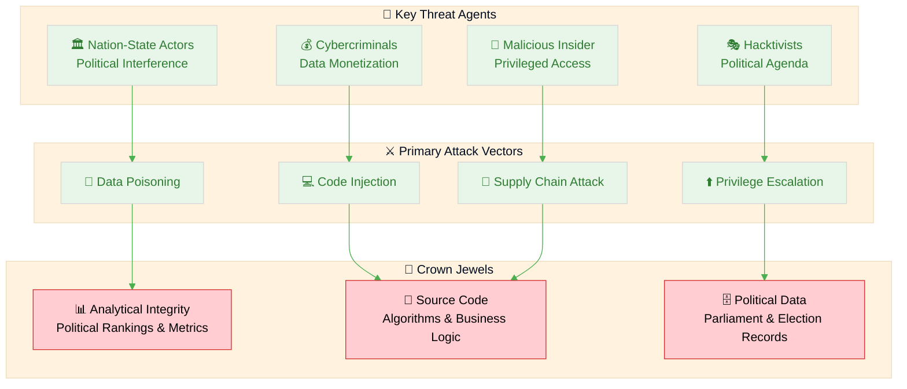
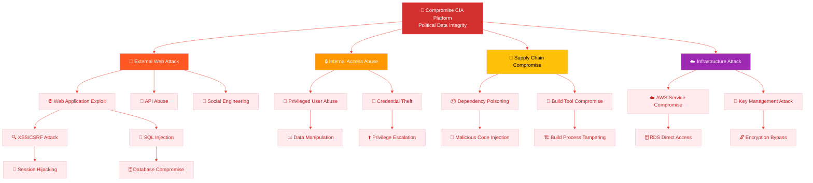
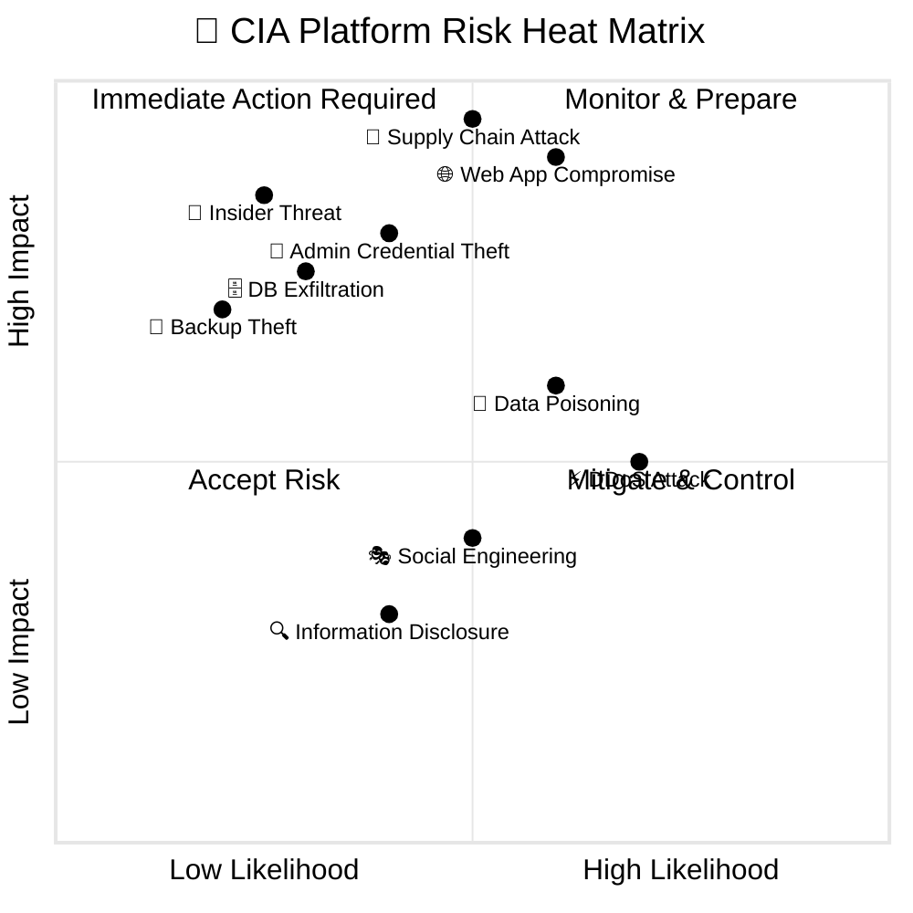
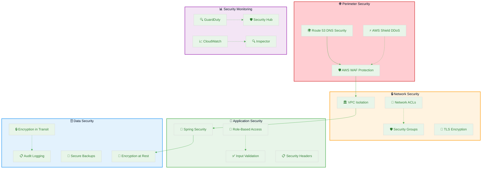
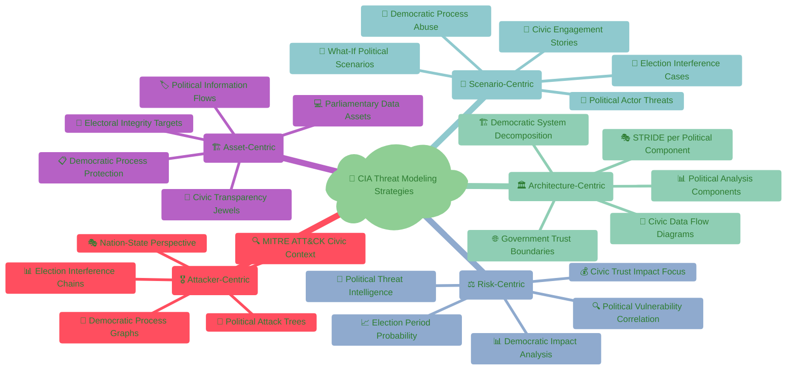

  

<h1 align="center">🎯 Citizen Intelligence Agency — Threat Model</h1>

  <strong>🛡️ Proactive Security Through Structured Threat Analysis</strong> 
  <em>🔍 STRIDE • MITRE ATT&CK • CIA System Architecture • Public Transparency</em>

  
  
  
  

**📋 Document Owner:** CEO | **📄 Version:** 1.0 | **📅 Last Updated:** 2025-09-18 (UTC)  
**🔄 Review Cycle:** Annual | **⏰ Next Review:** 2026-09-18  
**🏷️ Classification:** Public (Open Civic Transparency Platform)

---

## 🎯 Purpose & Scope

Establish a comprehensive threat model for the Citizen Intelligence Agency (CIA) civic transparency platform (Swedish parliamentary/open data OSINT). This systematic threat analysis integrates multiple threat modeling frameworks to ensure proactive security through structured analysis.

### **🌟 Transparency Commitment**
This threat model demonstrates **🛡️ cybersecurity consulting expertise** through public documentation of advanced threat assessment methodologies, showcasing our **🏆 competitive advantage** via systematic risk management and **🤝 customer trust** through transparent security practices.

*— Based on Hack23 AB's commitment to security through transparency and excellence*

### **📚 Framework Integration**
- **🎭 STRIDE per architecture element:** Systematic threat categorization
- **🎖️ MITRE ATT&CK mapping:** Advanced threat intelligence integration
- **🏗️ Asset-centric analysis:** Critical resource protection focus
- **🎯 Scenario-centric modeling:** Real-world attack simulation
- **⚖️ Risk-centric assessment:** Business impact quantification

### **🔍 Scope Definition**
**Included Systems:**
- 🌐 Web application (Vaadin/Spring framework)
- 🔄 Data ingestion/import services
- 💾 PostgreSQL persistence + analytical views
- 🔐 Authentication / session / audit subsystems
- ☁️ AWS infrastructure (WAF, ALB, EC2, RDS, KMS, GuardDuty, Security Hub)

**Out of Scope:**
- Third-party downstream consumers of published open dashboards (read-only usage)
- External data source security (Parliament API, Election Authority, World Bank)

### **🔗 Policy Alignment**
Integrated with [🎯 Hack23 AB Threat Modeling Policy](https://github.com/Hack23/ISMS-PUBLIC/blob/main/Threat_Modeling.md) methodology and frameworks.

---

## 📊 System Classification & Operating Profile

### **🏷️ Security Classification Matrix**

| Dimension | Level | Rationale | Business Impact |
|----------|-------|-----------|----------------|
| **🔐 Confidentiality** |  | Parliamentary, governmental, or open economic sources |  |
| **🔒 Integrity** |  | Analytical credibility & ranking accuracy critical |  |
| **⚡ Availability** |  | Public civic transparency; tolerates brief maintenance |  |

### **⚖️ Regulatory & Compliance Profile**

| Compliance Area | Classification | Implementation Status |
|-----------------|----------------|----------------------|
| **📋 Regulatory Exposure** | Low | Mostly open data; minimal personal data (user accounts only) |
| **🇪🇺 CRA (EU Cyber Resilience Act)** | Low baseline | Non–safety-critical civic analytics; maintains secure development controls |
| **📊 SLA Targets (Internal)** | 99.5% | Single-region + resilience roadmap |
| **🔄 RPO / RTO** | RPO ≤ 24h / RTO ≤ 4h | Acceptable for civic analytics with daily refresh cadence |

---

## 💎 Critical Assets & Protection Goals

### **🏗️ Asset-Centric Threat Analysis**

Following [Hack23 AB Asset-Centric Threat Modeling](https://github.com/Hack23/ISMS-PUBLIC/blob/main/Threat_Modeling.md#asset-centric-threat-modeling) methodology:

| Asset Category | Why Valuable | Threat Goals | Key Controls | Business Value |
|----------------|--------------|-------------|-------------|----------------|
| **📊 Analytical Integrity** | Public trust in political metrics | Tampering, covert manipulation | DB RBAC, immutable audit (Javers), CSP, WAF |  |
| **🧠 Source Code** | Policy logic, ranking algorithms | IP theft, malicious injection | Private repo controls, dependency scanning, SLSA provenance |  |
| **🔄 Import Pipelines** | Freshness & correctness | Poisoned input, replay, API abuse | Input validation, schema checks, rate limiting |  |
| **👤 User Accounts** | Abuse vector | Credential stuffing, enumeration | Login throttling, password policy, MFA optional path |  |
| **🔑 Admin Role** | Elevated capability | Privilege escalation | Method-level @Secured, restricted session generation |  |
| **☁️ Infrastructure Config** | Security baseline | Supply chain/manipulation | Template versioning, provenance attestations |  |

### **🔐 Crown Jewel Analysis**

---

## 🌐 Data Flow & Architecture Analysis

### **🏛️ Architecture-Centric STRIDE Analysis**

Following [Architecture-Centric Threat Modeling](https://github.com/Hack23/ISMS-PUBLIC/blob/main/Threat_Modeling.md#architecture-centric-threat-modeling) methodology:

```mermaid
%%{
  init: {
    'theme': 'base',
    'themeVariables': {
      'primaryColor': '#e3f2fd',
      'primaryTextColor': '#01579b',
      'lineColor': '#0288d1',
      'secondaryColor': '#f1f8e9',
      'tertiaryColor': '#fff8e1'
    }
  }
}%%
flowchart TB
    subgraph TRUST_BOUNDARY_1["🌐 Internet/DMZ Trust Boundary"]
        EXT[(🌍 Public Open Data Sources)]
        USER[👤 Public/Registered Users]
    end
    
    subgraph TRUST_BOUNDARY_2["🛡️ AWS Security Boundary"]
        WAF[🛡️ AWS WAF]
        ALB[⚖️ Application Load Balancer]
    end
    
    subgraph TRUST_BOUNDARY_3["🔒 Application Trust Boundary"]
        IMPORT[🔄 Import Services]
        VALID[✅ Schema + Validation]
        APP[🌐 Spring/Vaadin App]
        AUTH[🔐 Security Module]
    end
    
    subgraph TRUST_BOUNDARY_4["🗄️ Data Trust Boundary"]
        DB[(💾 PostgreSQL Core + Views)]
        SESS[🔑 Session Store/Audit]
        LOGS[(📋 Audit & Metrics)]
    end
    
    subgraph TRUST_BOUNDARY_5["☁️ AWS Security Services"]
        GUARDDUTY[🔍 GuardDuty]
        SECURITYHUB[🛡️ Security Hub]
        KMS[🔐 AWS KMS]
    end
    
    EXT -->|🎯 T1: API Abuse| IMPORT
    USER -->|🎯 T2: Web Attacks| WAF
    WAF -->|🎯 T3: WAF Bypass| ALB
    ALB -->|🎯 T4: Load Balancer Exploit| APP
    IMPORT -->|🎯 T5: Data Poisoning| VALID
    VALID -->|🎯 T6: Validation Bypass| DB
    APP -->|🎯 T7: Application Exploit| AUTH
    AUTH -->|🎯 T8: Auth Bypass| SESS
    APP -->|🎯 T9: Log Injection| LOGS
    
    GUARDDUTY -.->|Monitors| ALB
    SECURITYHUB -.->|Aggregates| LOGS
    KMS -.->|Encrypts| DB
    
    style TRUST_BOUNDARY_1 fill:#ffebee,stroke:#f44336,stroke-width:3px,stroke-dasharray: 5 5
    style TRUST_BOUNDARY_2 fill:#fff3e0,stroke:#ff9800,stroke-width:3px,stroke-dasharray: 5 5
    style TRUST_BOUNDARY_3 fill:#e8f5e9,stroke:#4caf50,stroke-width:3px,stroke-dasharray: 5 5
    style TRUST_BOUNDARY_4 fill:#e3f2fd,stroke:#2196f3,stroke-width:3px,stroke-dasharray: 5 5
    style TRUST_BOUNDARY_5 fill:#f3e5f5,stroke:#9c27b0,stroke-width:3px,stroke-dasharray: 5 5
```

### **🎭 STRIDE per Element Analysis**

| Element | S | T | R | I | D | E | Notable Mitigations |
|---------|---|---|---|---|---|---|---------------------|
| **🌐 Web Entry (WAF/ALB)** | IP spoof | Header tamper | Limited | TLS downgrade | L7 flood | — | WAF managed rules, TLS policy |
| **🖥️ Vaadin UI** | Session hijack | DOM/script injection (XSS) | Action denial | Leakage via mis-render | Render lock | View bypass | CSP, HSTS, security headers |
| **⚙️ Service Layer** | Impersonation | Parameter tampering | Log forging | Data mapping leak | Thread starvation | Priv esc via service call | Method @Secured, input canonicalization |
| **🔄 Import Jobs** | Source spoof | Payload corruption | Replay abuse | Poisoned dataset | Batch backlog | Elevated connector perms | Source signature checks, schema validation |
| **💾 Database** | Connection spoof | Row/column mod | Transaction denial | Full dump | Connection exhaustion | Role escalation | Least-privilege roles, network isolation |
| **🔑 Session/Audit** | Token substitution | Log injection | Non-repudiation risk | PII over-log | Log flooding | Log privilege misuse | Structured logging, size limits |
| **🔧 Build/CI** | Actor spoof (PR) | Artifact tamper | Tamper denial | Secret exposure | Runner exhaustion | Escalated workflow perms | Hardening, pin actions, attestations |
| **🔐 Secrets Manager** | API misuse | Secret overwrite | Retrieval repudiation | Broad read | API flood | Policy bypass | IAM SCP, rotation, minimal scope |

---

## 🎖️ MITRE ATT&CK Framework Integration

### **🔍 Attacker-Centric Analysis**

Following [MITRE ATT&CK-Driven Analysis](https://github.com/Hack23/ISMS-PUBLIC/blob/main/Threat_Modeling.md#mitre-attck-driven-analysis) methodology:

| Phase | Technique | ID | CIA Context | Control | Detection |
|-------|----------|----|-------------|---------|-----------|
| **🔍 Initial Access** | Exploit Public-Facing App | [T1190](https://attack.mitre.org/techniques/T1190/) | Web endpoints, API services | WAF, patch cadence, input validation | WAF logs, application monitoring |
| **🔍 Initial Access** | Phishing for Credentials | [T1566](https://attack.mitre.org/techniques/T1566/) | Admin/user login targeting | Password policy, lockouts, awareness | Failed login monitoring, email security |
| **⚡ Execution** | Command/Script Interpreter | [T1059](https://attack.mitre.org/techniques/T1059/) | Limited server scripts | Hardened AMI, no interactive shells | Process monitoring, endpoint detection |
| **🔄 Persistence** | Valid Accounts | [T1078](https://attack.mitre.org/techniques/T1078/) | Compromised user accounts | Login attempt throttling, MFA | Account monitoring, behavioral analysis |
| **⬆️ Priv Esc** | Exploit for Priv Esc | [T1068](https://attack.mitre.org/techniques/T1068/) | JVM/OS vulnerabilities | Patch mgmt, Inspector scanning | Vulnerability scanning, system monitoring |
| **🎭 Defense Evasion** | Obfuscated Files | [T1027](https://attack.mitre.org/techniques/T1027/) | Malicious libraries | SCA + SBOM diff, code review | Static analysis, artifact scanning |
| **🔑 Credential Access** | Brute Force | [T1110](https://attack.mitre.org/techniques/T1110/) | Login form attacks | Throttling, IP/session caps | Login attempt monitoring, rate limiting |
| **🔍 Discovery** | Application Enumeration | [T1083](https://attack.mitre.org/techniques/T1083/) | Public endpoint scanning | Rate limits, minimal error detail | Access pattern analysis, traffic monitoring |
| **📤 Exfiltration** | Exfil Over HTTPS | [T1041](https://attack.mitre.org/techniques/T1041/) | Bulk data export via APIs | Query limits, audit logging | Data volume monitoring, unusual access patterns |
| **💥 Impact** | Data Manipulation | [T1565](https://attack.mitre.org/techniques/T1565/) | Rankings/doc count tampering | Integrity validation jobs, checksums | Data integrity monitoring, change detection |

### **🌳 Attack Tree Analysis**

---

## 🎯 Priority Threat Scenarios

### **🔴 Critical Threat Scenarios**

Following [Risk-Centric Threat Modeling](https://github.com/Hack23/ISMS-PUBLIC/blob/main/Threat_Modeling.md#risk-centric-threat-modeling) methodology:

| # | Scenario | MITRE Tactic | Impact Focus | Likelihood | Risk | Key Mitigations | Residual Action |
|---|----------|--------------|--------------|------------|------|-----------------|-----------------|
| **1** | **🌐 Web Application Compromise** | [Initial Access](https://attack.mitre.org/tactics/TA0001/) | Data integrity manipulation | Medium |  | WAF, validation, ORM parameterization | Add periodic data hash verification |
| **2** | **🔗 Supply Chain Dependency Attack** | [Initial Access](https://attack.mitre.org/tactics/TA0001/) | Code integrity & confidentiality | Medium |  | SBOM, pin SHAs, attestations | Add provenance verification policy gate |
| **3** | **🔑 Administrative Credential Compromise** | [Credential Access](https://attack.mitre.org/tactics/TA0006/) | System-wide access | Low-Med |  | Lockouts, strong policy, IP rate limiting | Enforce mandatory MFA for admin |
| **4** | **🗄️ Database Exfiltration** | [Exfiltration](https://attack.mitre.org/tactics/TA0010/) | Political data confidentiality | Low |  | Network isolation, least privilege | Implement query anomaly detection |
| **5** | **🔄 Import Pipeline Data Poisoning** | [Impact](https://attack.mitre.org/tactics/TA0040/) | Analytical integrity | Medium |  | Schema validation, duplicate detection | Add source signature/etag validation |
| **6** | **⚡ Distributed Denial of Service** | [Impact](https://attack.mitre.org/tactics/TA0040/) | Service availability | Medium |  | WAF rate limits, autoscaling planned | Load test + capacity model update |

### **⚖️ Risk Heat Matrix**

---

## 🛡️ Comprehensive Security Control Framework

### **🔒 Defense-in-Depth Architecture**

Aligned with [Security Architecture](SECURITY_ARCHITECTURE.md) implementation:

### **🎭 STRIDE → Control Mapping**

| STRIDE Category | Example Threat | Primary Control | Secondary Control | Monitoring |
|----------------|----------------|-----------------|-------------------|------------|
| **🎭 Spoofing** | Credential stuffing | Throttling + password policy | MFA (admin), account lockout | Failed login attempts, IP tracking |
| **🔧 Tampering** | SQL/logic manipulation | Parameterized queries, ORM | WAF rules, input validation | Database activity monitoring |
| **❌ Repudiation** | Action denial | Immutable audit logs (Javers) | Correlated session IDs | Comprehensive audit trail |
| **📤 Information Disclosure** | Data exfiltration | Network isolation, encryption | Row-level access control | Unusual query pattern detection |
| **⚡ Denial of Service** | Request flood | WAF rate limiting | Auto-scaling, resource sizing | Traffic pattern analysis |
| **⬆️ Elevation of Privilege** | Privilege escalation | Method @Secured annotations | Separate admin role tokens | Privilege usage monitoring |

---

## 🔄 Continuous Validation & Assessment

### **🎪 Threat Modeling Workshop Process**

Following [Hack23 AB Workshop Framework](https://github.com/Hack23/ISMS-PUBLIC/blob/main/Threat_Modeling.md#threat-modeling-workshop-framework):

### **📅 Assessment Lifecycle**

| Assessment Type | Trigger | Frequency | Scope | Documentation Update |
|----------------|---------|-----------|-------|---------------------|
| **📅 Comprehensive Review** | Annual cycle | Annual | Complete threat model | Full document revision |
| **🔄 Delta Assessment** | Architecture changes | Per change | Modified components | Incremental updates |
| **🚨 Incident-Driven** | Security events | As needed | Affected systems | Lessons learned integration |
| **🎯 Threat Intelligence** | New attack patterns | Quarterly | High-risk scenarios | MITRE ATT&CK updates |

---

## 📊 Comprehensive Threat Agent Analysis

### **🔍 Detailed Threat Actor Classification**

Following [Hack23 AB Threat Agent Classification](https://github.com/Hack23/ISMS-PUBLIC/blob/main/Threat_Modeling.md#threat-agent-classification) methodology:

| Threat Agent | Category | CIA-Specific Context | MITRE Techniques | Risk Level | Political Motivation |
|--------------|----------|---------------------|------------------|------------|-------------------|
| **🏛️ Nation-State Actors** | External | Political interference, election influence | [Spearphishing](https://attack.mitre.org/techniques/T1566/001), [Data Manipulation](https://attack.mitre.org/techniques/T1565) |  | High - targeting political transparency |
| **🎭 Hacktivists** | External | Political agenda promotion, transparency manipulation | [Defacement](https://attack.mitre.org/techniques/T1491), [DDoS](https://attack.mitre.org/techniques/T1499) |  | High - political platform targeting |
| **💰 Cybercriminals** | External | Data monetization, political manipulation for hire | [Phishing](https://attack.mitre.org/techniques/T1566), [Ransomware](https://attack.mitre.org/techniques/T1486) |  | Medium - financial motivation |
| **🔒 Accidental Insiders** | Internal | Unintentional data corruption, misconfigurations | [Data Deletion](https://attack.mitre.org/techniques/T1485), [Misconfiguration](https://attack.mitre.org/techniques/T1611) |  | Low - no political intent |
| **🎯 Malicious Insiders** | Internal | Political bias injection, data manipulation | [Data Manipulation](https://attack.mitre.org/techniques/T1565), [Account Manipulation](https://attack.mitre.org/techniques/T1098) |  | High - political influence |
| **🤝 Third-Party Providers** | External | Indirect access through service dependencies | [Supply Chain Compromise](https://attack.mitre.org/techniques/T1195), [Valid Accounts](https://attack.mitre.org/techniques/T1078) |  | Variable - depends on provider |

---

## 🌐 Current Threat Landscape Integration

### **📊 ENISA Threat Landscape 2024 Application**

Implementing [ENISA Threat Landscape 2024](https://www.enisa.europa.eu/publications/enisa-threat-landscape-2024) specific to CIA platform:

| ENISA Priority | Threat Category | CIA Platform Context | Specific Scenarios | Mitigation Strategy |
|----------------|-----------------|----------------------|-------------------|-------------------|
| **1️⃣** | **⚡ Availability Threats** | DoS against civic transparency services | Political period attacks, election interference |  WAF + DDoS protection |
| **2️⃣** | **🔐 Ransomware** | Parliamentary data encryption | Critical voting period disruption |  Immutable backups + isolation |
| **3️⃣** | **📊 Data Threats** | Political data manipulation/theft | Ranking algorithm tampering, voter influence |  Integrity validation + audit |
| **4️⃣** | **🦠 Malware** | System infiltration for data access | Persistent political espionage |  Endpoint protection + monitoring |
| **5️⃣** | **🎭 Social Engineering** | Admin credential theft for access | Targeted phishing against civic platform staff |  Security awareness + MFA |
| **6️⃣** | **📰 Information Manipulation** | False political data injection | Disinformation campaigns via platform |  Source validation + verification |
| **7️⃣** | **🔗 Supply Chain** | Dependency compromise for backdoor access | Third-party library infiltration |  SBOM + provenance verification |

---

## 🎯 Multi-Strategy Threat Modeling Implementation

### **🔍 Complete Framework Integration**

Following [Hack23 AB Comprehensive Threat Modeling Strategies](https://github.com/Hack23/ISMS-PUBLIC/blob/main/Threat_Modeling.md#comprehensive-threat-modeling-strategies--models):

---

## 🎯 Scenario-Centric Threat Modeling

### **📝 Democratic Process Abuse Analysis**

Following [Hack23 AB Scenario-Centric Modeling](https://github.com/Hack23/ISMS-PUBLIC/blob/main/Threat_Modeling.md#scenario-centric-threat-modeling):

#### **🚨 Political Misuse Cases**

| Legitimate Democratic Use Case | Political Misuse Case | Attack Method | Democratic Impact | Civic Mitigation |
|-------------------------------|----------------------|---------------|------------------|------------------|
| **🗳️ Election Result Analysis** | **📊 Vote Manipulation Perception** | False data injection, statistic skewing | Public trust erosion in democracy | Source verification, data provenance tracking |
| **👥 Politician Performance Tracking** | **🎯 Character Assassination** | Selective data presentation, bias injection | Political career damage, voter manipulation | Balanced metrics, transparent methodology |
| **🏛️ Parliamentary Process Monitoring** | **📰 Legislative Process Interference** | Timeline manipulation, procedure misrepresentation | Democratic process confusion | Real-time validation, audit trails |
| **💰 Government Spending Transparency** | **💸 Financial Scandal Manufacturing** | Misleading financial correlation, context removal | Government legitimacy questioning | Context preservation, expert validation |
| **📈 Political Trend Visualization** | **🔮 Election Outcome Manipulation** | Predictive model bias, trend fabrication | Voter behavior influence, election interference | Statistical validation, methodology transparency |

#### **👤 Political Persona-Based Threat Analysis**

```mermaid
%%{
  init: {
    "theme": "base",
    "themeVariables": {
      "primaryColor": "#f3e5f5",
      "primaryTextColor": "#6a1b9a",
      "lineColor": "#9c27b0",
      "secondaryColor": "#e8f5e9",
      "tertiaryColor": "#fff3e0"
    }
  }
}%%
flowchart TD
    subgraph PERSONAS["👥 Political Threat Personas"]
        FOREIGN_STATE[🏛️ Foreign State Actor<br/>High Resources, Strategic Patience]
        DOMESTIC_EXTREMIST[🎭 Domestic Extremist<br/>High Motivation, Targeted Attacks]
        POLITICAL_OPERATIVE[🎯 Political Operative<br/>Medium Resources, Election Timing]
        CORPORATE_INFLUENCER[💼 Corporate Influencer<br/>Financial Resources, Policy Focus]
    end
    
    subgraph METHODS["⚔️ Political Attack Methods"]
        DISINFORMATION[📰 Disinformation Campaigns]
        DATA_MANIPULATION[📊 Data Manipulation]
        TIMING_ATTACKS[⏰ Strategic Timing Attacks]
        PERCEPTION_WARFARE[🧠 Perception Warfare]
    end
    
    subgraph TARGETS["🎯 Democratic Targets"]
        ELECTION_INTEGRITY[🗳️ Election Integrity]
        POLITICAL_TRUST[🤝 Political Trust]
        DEMOCRATIC_PROCESS[🏛️ Democratic Process]
        CIVIC_ENGAGEMENT[👥 Civic Engagement]
    end
    
    FOREIGN_STATE --> DISINFORMATION
    FOREIGN_STATE --> ELECTION_INTEGRITY
    
    DOMESTIC_EXTREMIST --> DATA_MANIPULATION
    DOMESTIC_EXTREMIST --> POLITICAL_TRUST
    
    POLITICAL_OPERATIVE --> TIMING_ATTACKS
    POLITICAL_OPERATIVE --> DEMOCRATIC_PROCESS
    
    CORPORATE_INFLUENCER --> PERCEPTION_WARFARE
    CORPORATE_INFLUENCER --> CIVIC_ENGAGEMENT
    
    style FOREIGN_STATE fill:#ffcdd2
    style DOMESTIC_EXTREMIST fill:#fff3e0
    style POLITICAL_OPERATIVE fill:#e8f5e9
    style CORPORATE_INFLUENCER fill:#e3f2fd
```

#### **🎲 Political What-If Scenario Planning**

**🔍 Scenario 1: Pre-Election Platform Compromise**
- **What if:** The CIA platform is compromised 30 days before a major election?
- **Attack Path:** Initial Access → Data Manipulation → Public Misinformation → Election Influence
- **Democratic Impact:** Voter confusion, election legitimacy questions, democratic trust erosion
- **Detection:** Real-time data integrity monitoring, anomaly detection, public verification systems
- **Response:** Emergency transparency protocols, independent verification, rapid correction procedures

**🔍 Scenario 2: Parliamentary Crisis Information Warfare**
- **What if:** During a government crisis, the platform becomes a disinformation vector?
- **Attack Path:** Social Engineering → Insider Access → Content Manipulation → Media Amplification
- **Democratic Impact:** Political instability amplification, public disorder, institutional damage
- **Detection:** Editorial workflow monitoring, multi-source verification, expert validation panels
- **Response:** Crisis communication protocols, expert fact-checking, transparent correction processes

**🔍 Scenario 3: Long-term Democratic Erosion Campaign**
- **What if:** A sustained, subtle campaign gradually erodes trust in democratic institutions?
- **Attack Path:** Persistent Access → Gradual Bias Introduction → Normalized Distortion → Trust Degradation
- **Democratic Impact:** Slow democratic norm erosion, reduced civic participation, institutional weakening
- **Detection:** Long-term trend analysis, bias detection algorithms, public trust metrics
- **Response:** Regular methodology audits, transparent bias correction, public engagement initiatives

---

## ⚖️ Enhanced Risk-Centric Analysis

### **📊 Political Impact Quantification**

Following [Risk-Centric Threat Modeling](https://github.com/Hack23/ISMS-PUBLIC/blob/main/Threat_Modeling.md#risk-centric-threat-modeling):

#### **🏛️ Democratic Impact Assessment Matrix**

| Threat Scenario | Probability | Democratic Impact | Public Trust Impact | Electoral Impact | Civic Risk Score |
|----------------|-------------|-------------------|-------------------|------------------|------------------|
| **🗳️ Election Period Data Manipulation** | 25% |  |  |  | 9.5/10 |
| **🏛️ Parliamentary Process Interference** | 20% |  |  |  | 7.8/10 |
| **👥 Politician Reputation Attacks** | 30% |  |  |  | 8.2/10 |
| **💰 Government Spending Manipulation** | 15% |  |  |  | 5.9/10 |
| **📊 Statistical Methodology Attacks** | 10% |  |  |  | 7.1/10 |

#### **📈 Political Threat Intelligence Integration**

| Intelligence Source | Update Frequency | Democratic Relevance | Integration Method | CIA Platform Application |
|-------------------|------------------|---------------------|-------------------|-------------------------|
| **🏛️ Election Authority Alerts** | Real-time | 10/10 | Direct API integration | Election period threat escalation |
| **📰 Media Monitoring** | Hourly | 8/10 | Content analysis integration | Misinformation pattern detection |
| **🌐 Social Media Threat Feeds** | Real-time | 9/10 | API aggregation | Coordinated attack detection |
| **🔍 Parliamentary Security Bulletins** | Daily | 7/10 | Manual review integration | Government target awareness |
| **🎯 Political Cyber Threat Intelligence** | Weekly | 9/10 | Threat modeling updates | Political actor capability assessment |

---

## 🎪 Advanced Threat Modeling Workshop Framework

### **📋 Political Platform-Specific Preparation**

Following [Hack23 AB Workshop Framework](https://github.com/Hack23/ISMS-PUBLIC/blob/main/Threat_Modeling.md#threat-modeling-workshop-framework) with civic transparency adaptations:

#### **🎯 CIA-Specific Workshop Scope**
- **🏛️ Democratic Process Mapping:** Parliamentary procedures, election cycles, government transparency requirements
- **📊 Political Data Sensitivity:** Ranking methodologies, bias detection, source verification
- **🗳️ Electoral Period Considerations:** High-risk timeframes, attack surface expansion, emergency procedures
- **👥 Civic Stakeholder Impact:** Citizens, politicians, media, researchers, government bodies

#### **👥 Political Platform Team Assembly**
- **🏛️ Civic Technology Expert:** Democratic process digitization, transparency platform expertise
- **📊 Political Data Scientist:** Bias detection, statistical validation, methodology transparency
- **🛡️ Democracy Security Specialist:** Election security, political threat landscape, civic platform protection
- **📰 Media Relations Coordinator:** Public communication, misinformation response, transparency communication
- **⚖️ Legal/Compliance Officer:** Election law compliance, data protection, transparency regulations

#### **📊 Political Context Analysis Framework**

**🏛️ Democratic Process Security Assessment:**
- How might different political actors attempt to manipulate the platform?
- What are the critical democratic periods requiring enhanced security?
- How do we maintain neutrality while protecting against political manipulation?
- What transparency measures prevent and detect bias injection?

**🗳️ Electoral Integrity Evaluation:**
- How could the platform influence electoral outcomes inappropriately?
- What safeguards prevent pre-election manipulation campaigns?
- How do we ensure equal treatment across political parties and candidates?
- What emergency procedures exist for election period incidents?

**📊 Political Data Protection Analysis:**
- How do we prevent selective or biased data presentation?
- What validation ensures ranking methodology integrity?
- How do we protect against gradual algorithmic bias introduction?
- What transparency measures allow public verification of fairness?

---

## 📊 Political Threat Catalog Framework

### **🏛️ Democracy-Specific Threat Documentation**

Each political threat entry includes democratic impact assessment per [Threat Catalog Framework](https://github.com/Hack23/ISMS-PUBLIC/blob/main/Threat_Modeling.md#threat-catalog-framework):

#### **🔴 Critical Democratic Threats**

##### **🗳️ Election Period Information Manipulation**
- **🎯 Political Tactic:** Electoral Interference via Information Manipulation
- **🔧 MITRE Technique:** [Data Manipulation (T1565)](https://attack.mitre.org/techniques/T1565/)
- **🏛️ Democratic Component:** Electoral process transparency and integrity
- **📝 Threat Description:** Coordinated manipulation of political data during critical election periods to influence voter behavior
- **👥 Threat Agent:** Nation-state actors, domestic political operatives, foreign election interference groups
- **🔐 CIA at Risk:** Integrity (democratic process), Availability (public access), Confidentiality (premature results)
- **🔑 AAA Controls:** Authentication for data modification, Authorization for critical period access, Accounting for all changes
- **🎭 STRIDE Attribute:** Tampering, Information Disclosure, Repudiation
- **🛡️ Security Measures:** Multi-source validation, immutable audit trails, real-time integrity monitoring, emergency response protocols
- **⚡ Priority:** **Critical**
- **🏛️ Democratic Impact:** Direct election integrity threat, voter manipulation, democratic legitimacy undermining
- **❓ Assessment Questions:** Are election period protections sufficient? Can real-time manipulation be detected? Are emergency response procedures tested?

##### **🏛️ Parliamentary Data Corruption for Policy Influence**
- **🎯 Political Tactic:** Legislative Process Manipulation
- **🔧 MITRE Technique:** [Supply Chain Compromise (T1195)](https://attack.mitre.org/techniques/T1195/)
- **🏛️ Democratic Component:** Parliamentary transparency and legislative tracking
- **📝 Threat Description:** Long-term infiltration to gradually corrupt parliamentary data and influence policy perception
- **👥 Threat Agent:** Corporate influence groups, foreign policy interference, special interest organizations
- **🔐 CIA at Risk:** Integrity (legislative records), Confidentiality (sensitive political information)
- **🔑 AAA Controls:** Authentication for data source access, Authorization for parliamentary data modification, Accounting for all legislative record changes
- **🎭 STRIDE Attribute:** Tampering, Spoofing, Elevation of Privilege
- **🛡️ Security Measures:** Source verification protocols, parliamentary API security, data provenance tracking, expert validation panels
- **⚡ Priority:** **Critical**
- **🏛️ Democratic Impact:** Policy manipulation, legislative process corruption, public policy misunderstanding
- **❓ Assessment Questions:** Are parliamentary data sources verified? Can gradual corruption be detected? Are policy experts involved in validation?

---

## 🔄 Continuous Democratic Validation

### **📅 Political Context Assessment Lifecycle**

| Assessment Type | Political Trigger | Frequency | Democratic Scope | Public Transparency |
|----------------|------------------|-----------|------------------|-------------------|
| **🗳️ Election Period Assessment** | Election announcement | Per election cycle | Complete platform security posture | Enhanced transparency reporting |
| **🏛️ Parliamentary Session Assessment** | Parliamentary term start/major crisis | Per session/as needed | Legislative tracking systems | Public methodology reviews |
| **👥 Political Actor Assessment** | New government formation | Per government change | Stakeholder access and bias detection | Stakeholder engagement reports |
| **📊 Methodology Assessment** | Algorithm/ranking changes | Per significant change | Data processing and presentation | Public methodology documentation |
| **🌐 Democratic Landscape Assessment** | Major democratic events globally | Quarterly | Threat landscape and best practices | International cooperation reports |

### **🏛️ Democratic Validation Pipeline Integration**

| Democratic Control Layer | Public Evidence | Transparency Enforcement | Democratic Threat Coverage |
|-------------------------|-----------------|-------------------------|---------------------------|
| **🔍 Political Bias Detection** | Public methodology documentation | Open algorithm explanations | Gradual bias injection, partisan manipulation |
| **📊 Source Verification** | Public source listings + verification status | Open data provenance | Information manipulation, false data injection |
| **🏛️ Democratic Process Validation** | Public parliamentary procedure mapping | Open process documentation | Legislative process manipulation |
| **🗳️ Election Period Protection** | Public security posture reporting | Open threat response documentation | Election interference, voter manipulation |
| **👥 Stakeholder Balance Verification** | Public engagement reports | Open stakeholder consultation logs | Partisan capture, interest group manipulation |
| **📈 Democratic Impact Assessment** | Public impact evaluations | Open democratic health metrics | Democratic erosion, civic disengagement |

---

## 🎯 Democratic Threat Modeling Maturity

### **📈 Civic Platform Maturity Framework**

Following [Hack23 AB Maturity Levels](https://github.com/Hack23/ISMS-PUBLIC/blob/main/Threat_Modeling.md#threat-modeling-maturity-levels) with democratic adaptations:

#### **🟢 Level 1: Democratic Foundation**
- **🏛️ Basic Democratic Architecture:** Core civic transparency documentation with basic bias detection
- **🗳️ Election Period Awareness:** Basic election security protocols and enhanced monitoring
- **👥 Stakeholder Identification:** Key democratic actors mapped with influence assessment
- **📊 Transparency Baseline:** Public methodology documentation and basic verification
- **🛡️ Democratic Security Controls:** Basic protections against political manipulation

#### **🟡 Level 2: Democratic Process Integration**
- **📅 Electoral Cycle Integration:** Threat assessment aligned with democratic calendar
- **📝 Political Context Documentation:** Enhanced threat models including political scenarios
- **🔧 Democratic Tool Integration:** Bias detection tools and democratic validation systems
- **🔄 Civic Engagement Tracking:** Public participation in threat identification and validation

#### **🟠 Level 3: Democratic Analysis Excellence**
- **🔍 Comprehensive Political STRIDE:** Systematic threat categorization for all democratic processes
- **⚖️ Democratic Risk Assessment:** Political impact, civic trust, and electoral integrity criteria
- **🛡️ Political Mitigation Strategies:** Comprehensive controls for democratic threats
- **🎓 Civic Security Education:** Public education on democratic platform security

#### **🔴 Level 4: Advanced Democratic Intelligence**
- **🌐 Advanced Political Modeling:** Real-world political attack simulations and democratic war gaming
- **📊 Continuous Democratic Monitoring:** Real-time political threat landscape integration
- **📈 Democratic Health Metrics:** Comprehensive civic engagement and trust measurement
- **🔄 Public Validation Sessions:** Community-driven threat identification and mitigation validation

#### **🟣 Level 5: Democratic Innovation Leadership**
- **🔮 Proactive Democratic Protection:** Emerging political threat anticipation and countermeasures
- **🤖 AI-Enhanced Democratic Security:** Machine learning for bias detection and political manipulation identification
- **📊 Global Democratic Intelligence:** International democratic security collaboration and best practice sharing
- **🔬 Predictive Democratic Analytics:** Advanced modeling for democratic health and threat prediction

---

## 🌟 Democratic Security Best Practices

### **🏛️ Civic Platform Security Principles**

#### **🗳️ Electoral Integrity by Design**
- **🔍 Transparent Methodology:** All ranking and analysis methodologies publicly documented and verifiable
- **⚖️ Political Neutrality Enforcement:** Systematic bias detection and correction mechanisms
- **📊 Multi-Source Validation:** Cross-verification of political data from multiple independent sources
- **🛡️ Election Period Protection:** Enhanced security during critical democratic periods

#### **👥 Democratic Participation Security**
- **🤝 Stakeholder Engagement:** Regular consultation with democratic actors on security concerns
- **📢 Public Validation:** Community-driven verification of platform neutrality and accuracy
- **🔍 Open Source Transparency:** Public access to security methodologies and threat assessments
- **📈 Civic Trust Measurement:** Regular assessment of public confidence in platform integrity

#### **🔄 Continuous Democratic Improvement**
- **⚡ Proactive Political Threat Detection:** Early identification of emerging democratic manipulation techniques
- **📊 Evidence-Based Security:** Data-driven democratic security decisions with public accountability
- **🤝 International Cooperation:** Collaboration with global democratic transparency organizations
- **💡 Innovation in Democratic Security:** Leading development of new civic platform protection methods

---

**📋 Document Control:**  
**✅ Approved by:** James Pether Sörling, CEO  
**📤 Distribution:** Public  
**🏷️ Classification:**   
**📅 Effective Date:** 2025-09-18  
**⏰ Next Review:** 2026-09-18  
**🎯 Framework Compliance:**     
