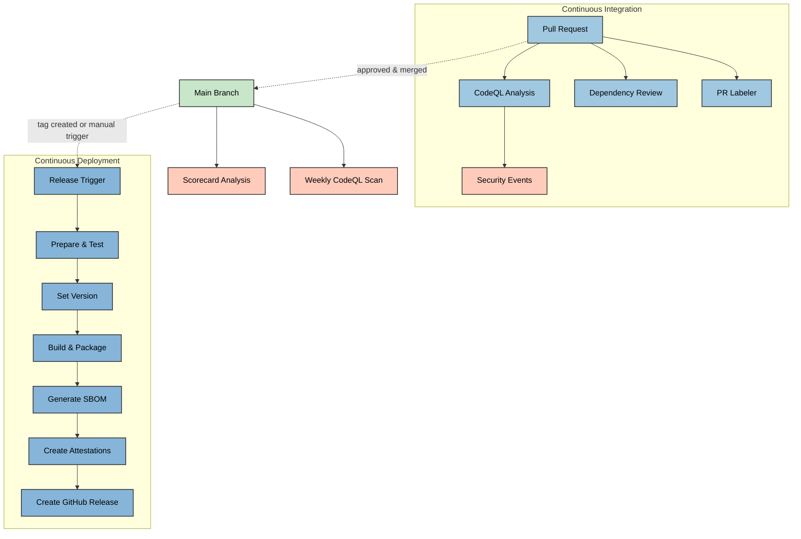
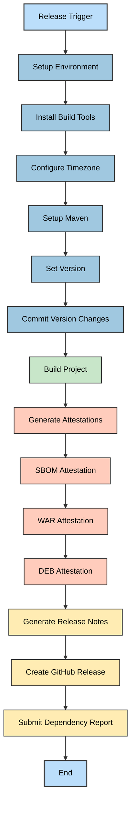
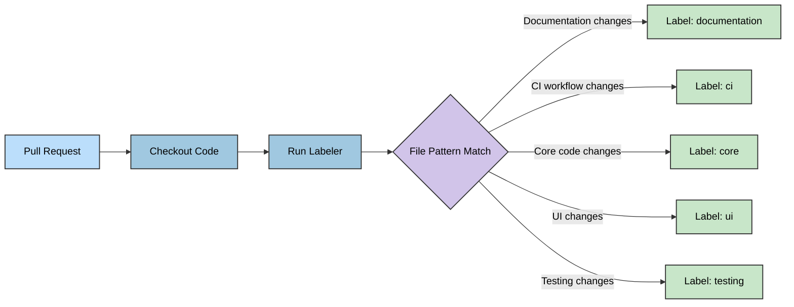
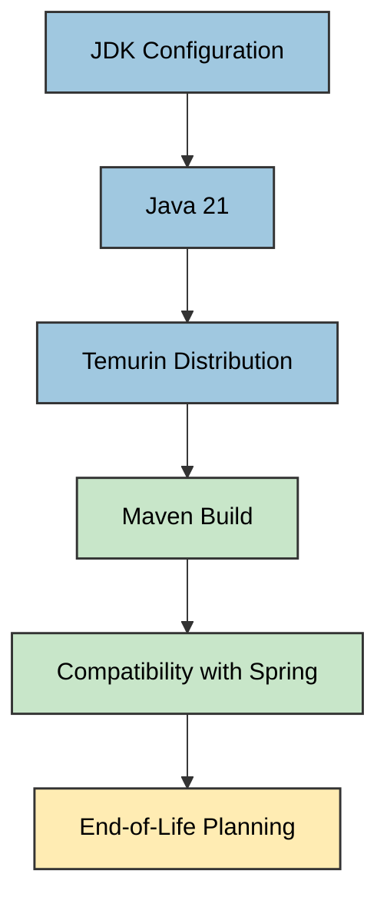
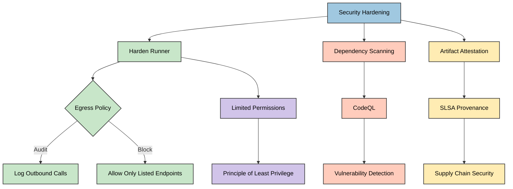

# 🔧 Citizen Intelligence Agency CI/CD Workflows

This document details the continuous integration and deployment workflows used in the Citizen Intelligence Agency project. These workflows automate testing, security scanning, and release procedures to ensure code quality and security compliance.

## 📚 Related Architecture Documentation

| Document                                            | Focus           | Description                               | Documentation Link                                                              |
| --------------------------------------------------- | --------------- | ----------------------------------------- | ------------------------------------------------------------------------------- |
| **[Architecture](ARCHITECTURE.md)**                 | 🏛️ Architecture | C4 model showing current system structure | [View Source](https://github.com/Hack23/cia/blob/master/ARCHITECTURE.md)         |
| **[Future Architecture](FUTURE_ARCHITECTURE.md)**   | 🏛️ Architecture | C4 model showing future system structure | [View Source](https://github.com/Hack23/cia/blob/master/FUTURE_ARCHITECTURE.md)         |
| **[Mindmaps](MINDMAP.md)**                          | 🧠 Concept      | Current system component relationships    | [View Source](https://github.com/Hack23/cia/blob/master/MINDMAP.md)             |
| **[Future Mindmaps](FUTURE_MINDMAP.md)**            | 🧠 Concept      | Future capability evolution               | [View Source](https://github.com/Hack23/cia/blob/master/FUTURE_MINDMAP.md)      |
| **[SWOT Analysis](SWOT.md)**                        | 💼 Business     | Current strategic assessment              | [View Source](https://github.com/Hack23/cia/blob/master/SWOT.md)                |
| **[Future SWOT Analysis](FUTURE_SWOT.md)**          | 💼 Business     | Future strategic opportunities            | [View Source](https://github.com/Hack23/cia/blob/master/FUTURE_SWOT.md)         |
| **[Data Model](DATA_MODEL.md)**                     | 📊 Data         | Current data structures and relationships | [View Source](https://github.com/Hack23/cia/blob/master/DATA_MODEL.md)          |
| **[Future Data Model](FUTURE_DATA_MODEL.md)**       | 📊 Data         | Enhanced political data architecture      | [View Source](https://github.com/Hack23/cia/blob/master/FUTURE_DATA_MODEL.md)   |
| **[Flowcharts](FLOWCHART.md)**                      | 🔄 Process      | Current data processing workflows         | [View Source](https://github.com/Hack23/cia/blob/master/FLOWCHART.md)           |
| **[Future Flowcharts](FUTURE_FLOWCHART.md)**        | 🔄 Process      | Enhanced AI-driven workflows              | [View Source](https://github.com/Hack23/cia/blob/master/FUTURE_FLOWCHART.md)    |
| **[State Diagrams](STATEDIAGRAM.md)**               | 🔄 Behavior     | Current system state transitions          | [View Source](https://github.com/Hack23/cia/blob/master/STATEDIAGRAM.md)        |
| **[Future State Diagrams](FUTURE_STATEDIAGRAM.md)** | 🔄 Behavior     | Enhanced adaptive state transitions       | [View Source](https://github.com/Hack23/cia/blob/master/FUTURE_STATEDIAGRAM.md) |
| **[CI/CD Workflows](WORKFLOWS.md)**                 | 🔧 DevOps       | Current automation processes              | [View Source](https://github.com/Hack23/cia/blob/master/WORKFLOWS.md)           |
| **[Future Workflows](FUTURE_WORKFLOWS.md)**         | 🔧 DevOps       | Enhanced CI/CD with ML                    | [View Source](https://github.com/Hack23/cia/blob/master/FUTURE_WORKFLOWS.md)    |
| **[End-of-Life Strategy](End-of-Life-Strategy.md)** | 📅 Lifecycle    | Maintenance and EOL planning              | [View Source](https://github.com/Hack23/cia/blob/master/End-of-Life-Strategy.md) |
| **[Financial Security Plan](FinancialSecurityPlan.md)** | 💰 Security | Cost and security implementation          | [View Source](https://github.com/Hack23/cia/blob/master/FinancialSecurityPlan.md) |
| **[ISMS Compliance Mapping](ISMS_COMPLIANCE_MAPPING.md)** | 🔐 ISMS | Comprehensive ISMS-PUBLIC policy mapping | [View Source](https://github.com/Hack23/cia/blob/master/ISMS_COMPLIANCE_MAPPING.md) |
| **[Security Architecture](SECURITY_ARCHITECTURE.md)** | 🛡️ Security | Complete security overview | [View Source](https://github.com/Hack23/cia/blob/master/SECURITY_ARCHITECTURE.md) |
| **[CIA Features](https://hack23.com/cia-features.html)** | 🚀 Features | Platform features overview                | [View on hack23.com](https://hack23.com/cia-features.html)                     |
| **[Threat Model](THREAT_MODEL.md)**                 | 🛡️ Security     | Threat analysis informing pipeline gates  | [View Source](https://github.com/Hack23/cia/blob/master/THREAT_MODEL.md)        |

## 🔄 Workflow Overview

The CIA project uses GitHub Actions for automation with the following workflows:

1. **🚀 Verify & Release**: Builds, tests, and releases new versions with comprehensive security checks and attestations
2. **🔍 CodeQL Analysis**: Performs advanced code security scanning to detect vulnerabilities
3. **📦 Dependency Review**: Analyzes dependency changes in PRs for security vulnerabilities
4. **⭐ Scorecard Analysis**: Evaluates the project against OSSF security best practices
5. **🏷️ PR Labeler**: Applies automated labels to pull requests

## Workflow Relationships

## 🔐 ISMS Policy Integration

The CI/CD workflows implement security controls aligned with Hack23 AB's [ISMS-PUBLIC framework](https://github.com/Hack23/ISMS-PUBLIC). See the [ISMS Compliance Mapping](ISMS_COMPLIANCE_MAPPING.md) for complete policy-to-control traceability.

### Security Controls by ISMS Policy

| 🛡️ ISMS Policy | 🔧 Workflow Implementation | 📋 Evidence |
|---------------|---------------------------|-----------|
| [**Secure Development Policy**](https://github.com/Hack23/ISMS-PUBLIC/blob/main/Secure_Development_Policy.md) | CodeQL SAST scanning, Dependency Review SCA, SBOM generation | [CodeQL workflow](.github/workflows/codeql-analysis.yml) |
| [**Vulnerability Management**](https://github.com/Hack23/ISMS-PUBLIC/blob/main/Vulnerability_Management.md) | Dependabot automated patching, Weekly security scans, OSSF Scorecard | [Scorecard workflow](.github/workflows/scorecards.yml) |
| [**Change Management**](https://github.com/Hack23/ISMS-PUBLIC/blob/main/Change_Management.md) | PR workflow with automated checks, Version control, Automated testing | [Release workflow](.github/workflows/release.yml) |
| [**Third-Party Management**](https://github.com/Hack23/ISMS-PUBLIC/blob/main/Third_Party_Management.md) | Dependency review on PRs, SBOM attestations, Supply chain security | [Dependency Review workflow](.github/workflows/dependency-review.yml) |
| [**Security Metrics**](https://github.com/Hack23/ISMS-PUBLIC/blob/main/Security_Metrics.md) | OpenSSF Scorecard monitoring, Test coverage reporting, Build metrics | Automated dashboards |

**Related Documentation:**
- 📊 [ISMS Compliance Mapping](ISMS_COMPLIANCE_MAPPING.md) - Complete policy alignment
- 🛡️ [Security Architecture](SECURITY_ARCHITECTURE.md) - Implementation details
- 🎯 [Threat Model](THREAT_MODEL.md) - Risk-based security controls

## 🚀 Verify & Release Workflow

This comprehensive workflow handles the verification and release process, including building, testing, attestation generation, and release publication.

### Key Features of the Release Workflow:

- **Automated Version Management**: Sets version numbers and commits changes
- **Comprehensive Building**: Compiles all project components with proper dependency management
- **Security Attestations**: Generates cryptographic attestations for artifacts (DEB, WAR)
- **SBOM Generation**: Creates Software Bill of Materials for transparency
- **Dependency Reporting**: Submits dependency information to GitHub

## 🔍 Security Scanning Workflows

Multiple security workflows validate different aspects of the CIA project to ensure security and compliance.

```mermaid
flowchart TD
    subgraph "CodeQL Analysis"
        CQL1[CodeQL Initialization] --> CQL2[Setup JDK 21]
        CQL2 --> CQL3[Install Dependencies]
        CQL3 --> CQL4[Build Project]
        CQL4 --> CQL5[Perform Analysis]
        CQL5 --> CQL6[Submit Dependencies]
    end

    subgraph "Dependency Review"
        DR1[Checkout Code] --> DR2[Review Dependencies]
        DR2 --> DR3[Comment in PR]
    end

    subgraph "Scorecard Analysis"
        SC1[Checkout Code] --> SC2[Run Analysis]
        SC2 --> SC3[Upload Results]
        SC3 --> SC4[Upload to Code-Scanning]
    end

    %% Enhanced styling
    classDef codeql fill:#ffccbc,stroke:#333,stroke-width:1.5px,color:black
    classDef depend fill:#c8e6c9,stroke:#333,stroke-width:1.5px,color:black
    classDef score fill:#ffecb3,stroke:#333,stroke-width:1.5px,color:black

    class CQL1,CQL2,CQL3,CQL4,CQL5,CQL6 codeql
    class DR1,DR2,DR3 depend
    class SC1,SC2,SC3,SC4 score
```

### 🔍 CodeQL Analysis Workflow

The CodeQL workflow analyzes code for security vulnerabilities using GitHub's CodeQL engine. It runs on:

- Pull requests to the main branch
- Weekly scheduled scans
- Direct pushes to the main branch

This workflow ensures that vulnerabilities are detected early in the development process, with additional scheduled scans to catch issues that might emerge due to new vulnerability patterns.

### 📦 Dependency Review

The dependency review workflow scans dependency manifest changes in pull requests to identify potentially vulnerable packages:

- Runs automatically on all pull requests
- Provides PR comments with findings
- Helps prevent introducing new vulnerabilities

### ⭐ Scorecard Analysis

The Scorecard workflow evaluates the project against OSSF security best practices:

- Branch protection rules validation
- Dependency management practices assessment
- Code signing verification
- Supply chain security adherence

Results are uploaded to GitHub's code scanning dashboard for easy visibility and tracking.

## 🏷️ PR Labeler Workflow

This workflow automatically applies labels to pull requests based on configured rules:

## 📊 CI/CD Configuration Details

The GitHub Actions workflows use several key configuration patterns:

1. **Hardened Runner Security**: Step Security's harden-runner is used to secure CI/CD pipelines
2. **Egress Policies**: Control outbound network connections from workflows
3. **Explicit Permissions**: Limited, specific permissions for each workflow
4. **Dependency Caching**: Optimizes build times by caching dependencies
5. **Comprehensive Attestations**: SLSA provenance and SBOM attestations for security

## JDK Configuration

The project's workflows are configured to use JDK 21 for building and testing:

For details on JDK compatibility planning, see the [End-of-Life Strategy](End-of-Life-Strategy.md).

## 🔐 Security Hardening in Workflows

All workflows include security hardening features:

## Future CI/CD Improvements

For information about planned enhancements to the CI/CD pipelines, including ML integration, automated adaptation, and advanced security features, see [Future Workflows](FUTURE_WORKFLOWS.md).

The following improvements are prioritized for future implementation:

1. **Automated Testing Expansion**: Expanding automated test coverage for UI components
2. **Performance Benchmarking**: Implementing performance testing in CI pipeline
3. **Security Scanning Enhancement**: Adding additional security scanners
4. **Containerization**: Adding Docker image building and scanning
5. **Deployment Automation**: Enhancing AWS deployment automation
6. **Accessibility Testing**: Adding automated accessibility compliance checks

## Mermaid Diagram Support

GitHub natively supports Mermaid diagrams in Markdown files. The diagrams in this documentation leverage this support to visually represent workflows using the Mermaid syntax, enabling:

- Visual representation of workflow relationships
- Clear process documentation
- Easier onboarding for new contributors

For more information about Mermaid syntax and capabilities, see the [Mermaid documentation](https://mermaid.js.org/).
