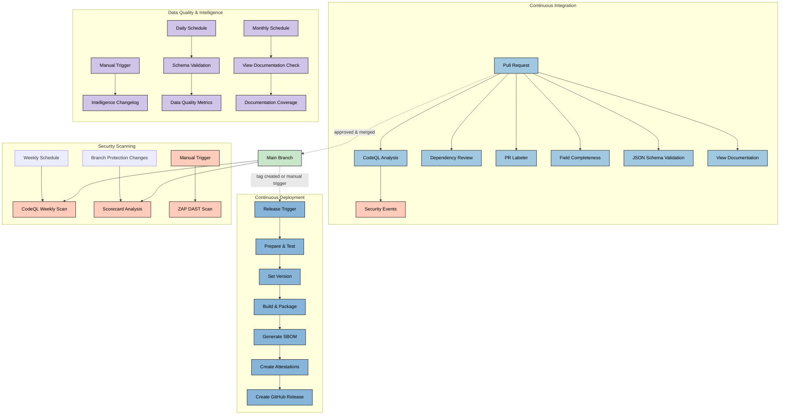
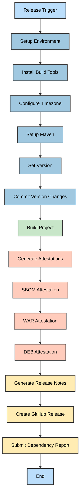
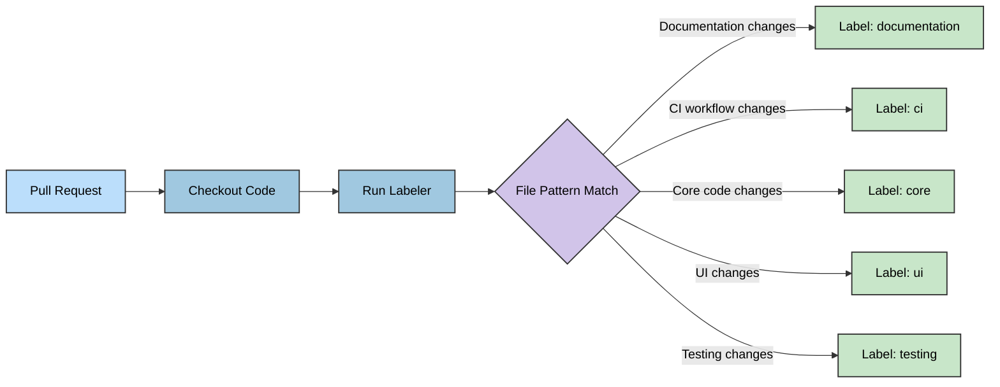
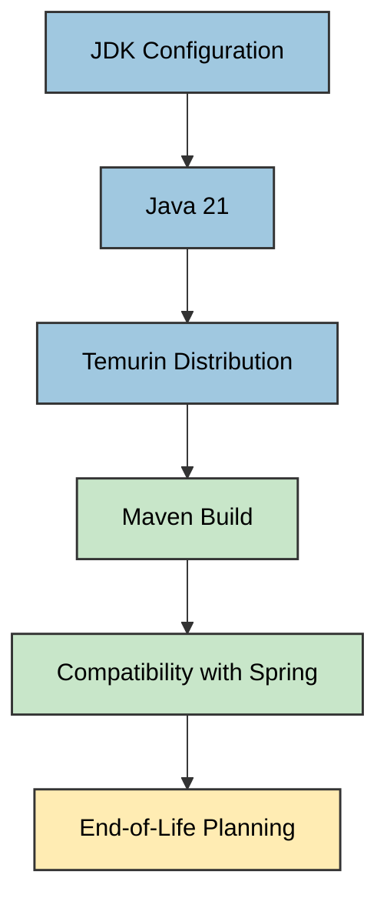
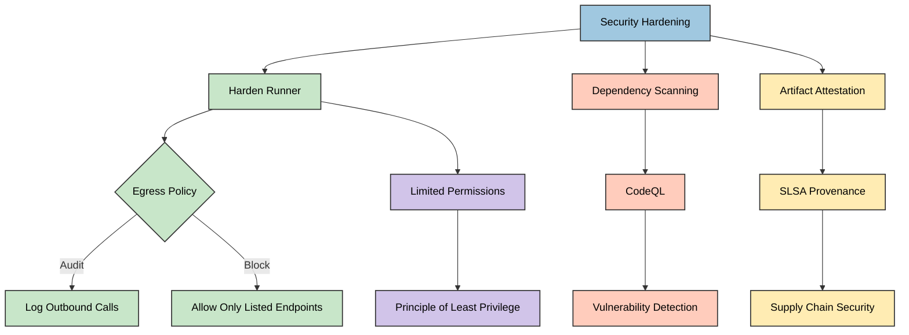
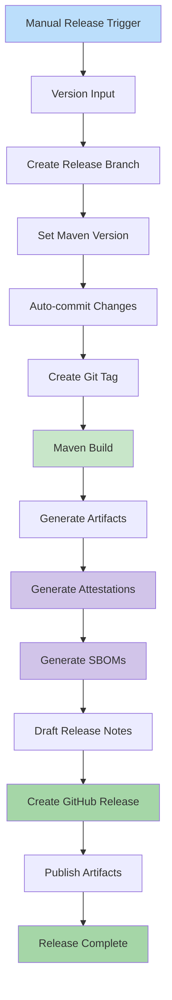

# 🔄 Citizen Intelligence Agency - CI/CD Workflows

[](https://github.com/Hack23/cia/actions/workflows/release.yml)
[](https://github.com/Hack23/cia/security/code-scanning)
[](https://github.com/Hack23/cia/actions/workflows/scorecards.yml)
[](https://scorecard.dev/viewer/?uri=github.com/Hack23/cia)
[](https://github.com/Hack23/cia/actions/workflows/dependency-review.yml)

[](https://sonarcloud.io/summary/new_code?id=Hack23_cia)
[](https://sonarcloud.io/summary/new_code?id=Hack23_cia)
[](https://sonarcloud.io/summary/new_code?id=Hack23_cia)
[](https://sonarcloud.io/summary/new_code?id=Hack23_cia)
[](https://sonarcloud.io/summary/new_code?id=Hack23_cia)

## 🎯 Pipeline Overview

The Citizen Intelligence Agency project implements a comprehensive DevSecOps CI/CD pipeline with multi-stage quality gates ensuring security, quality, and reliability at every step. This document details the continuous integration and deployment workflows that automate testing, security scanning, and release procedures to ensure code quality and security compliance.

## 📚 Related Architecture Documentation

<div class="documentation-map">

| Document                                            | Focus           | Description                               | Documentation Link                                                              |
| --------------------------------------------------- | --------------- | ----------------------------------------- | ------------------------------------------------------------------------------- |
| **[Architecture](ARCHITECTURE.md)**                 | 🏛️ Architecture | C4 model showing current system structure | [View Source](https://github.com/Hack23/cia/blob/master/ARCHITECTURE.md)         |
| **[Future Architecture](FUTURE_ARCHITECTURE.md)**   | 🏛️ Architecture | C4 model showing future system structure | [View Source](https://github.com/Hack23/cia/blob/master/FUTURE_ARCHITECTURE.md)         |
| **[Mindmaps](MINDMAP.md)**                          | 🧠 Concept      | Current system component relationships    | [View Source](https://github.com/Hack23/cia/blob/master/MINDMAP.md)             |
| **[Future Mindmaps](FUTURE_MINDMAP.md)**            | 🧠 Concept      | Future capability evolution               | [View Source](https://github.com/Hack23/cia/blob/master/FUTURE_MINDMAP.md)      |
| **[SWOT Analysis](SWOT.md)**                        | 💼 Business     | Current strategic assessment              | [View Source](https://github.com/Hack23/cia/blob/master/SWOT.md)                |
| **[Future SWOT Analysis](FUTURE_SWOT.md)**          | 💼 Business     | Future strategic opportunities            | [View Source](https://github.com/Hack23/cia/blob/master/FUTURE_SWOT.md)         |
| **[Data Model](DATA_MODEL.md)**                     | 📊 Data         | Current data structures and relationships | [View Source](https://github.com/Hack23/cia/blob/master/DATA_MODEL.md)          |
| **[Future Data Model](FUTURE_DATA_MODEL.md)**       | 📊 Data         | Enhanced political data architecture      | [View Source](https://github.com/Hack23/cia/blob/master/FUTURE_DATA_MODEL.md)   |
| **[Flowcharts](FLOWCHART.md)**                      | 🔄 Process      | Current data processing workflows         | [View Source](https://github.com/Hack23/cia/blob/master/FLOWCHART.md)           |
| **[Future Flowcharts](FUTURE_FLOWCHART.md)**        | 🔄 Process      | Enhanced AI-driven workflows              | [View Source](https://github.com/Hack23/cia/blob/master/FUTURE_FLOWCHART.md)    |
| **[State Diagrams](STATEDIAGRAM.md)**               | 🔄 Behavior     | Current system state transitions          | [View Source](https://github.com/Hack23/cia/blob/master/STATEDIAGRAM.md)        |
| **[Future State Diagrams](FUTURE_STATEDIAGRAM.md)** | 🔄 Behavior     | Enhanced adaptive state transitions       | [View Source](https://github.com/Hack23/cia/blob/master/FUTURE_STATEDIAGRAM.md) |
| **[CI/CD Workflows](WORKFLOWS.md)**                 | 🔧 DevOps       | Current automation processes              | [View Source](https://github.com/Hack23/cia/blob/master/WORKFLOWS.md)           |
| **[Future Workflows](FUTURE_WORKFLOWS.md)**         | 🔧 DevOps       | Enhanced CI/CD with ML                    | [View Source](https://github.com/Hack23/cia/blob/master/FUTURE_WORKFLOWS.md)    |
| **[End-of-Life Strategy](End-of-Life-Strategy.md)** | 📅 Lifecycle    | Maintenance and EOL planning              | [View Source](https://github.com/Hack23/cia/blob/master/End-of-Life-Strategy.md) |
| **[Financial Security Plan](FinancialSecurityPlan.md)** | 💰 Security | Cost and security implementation          | [View Source](https://github.com/Hack23/cia/blob/master/FinancialSecurityPlan.md) |
| **[ISMS Compliance Mapping](ISMS_COMPLIANCE_MAPPING.md)** | 🔐 ISMS | Comprehensive ISMS-PUBLIC policy mapping | [View Source](https://github.com/Hack23/cia/blob/master/ISMS_COMPLIANCE_MAPPING.md) |
| **[Security Architecture](SECURITY_ARCHITECTURE.md)** | 🛡️ Security | Complete security overview | [View Source](https://github.com/Hack23/cia/blob/master/SECURITY_ARCHITECTURE.md) |
| **[CIA Features](https://hack23.com/cia-features.html)** | 🚀 Features | Platform features overview                | [View on hack23.com](https://hack23.com/cia-features.html)                     |
| **[Threat Model](THREAT_MODEL.md)**                 | 🛡️ Security     | Threat analysis informing pipeline gates  | [View Source](https://github.com/Hack23/cia/blob/master/THREAT_MODEL.md)        |

</div>

## 🏗️ Pipeline Architecture

The CIA project implements a multi-stage CI/CD pipeline with comprehensive quality gates:

```mermaid
graph LR
    A[Code Push] --> B[Build & Test]
    B --> C[SCA Scan]
    C --> D[CodeQL Scan]
    D --> E[Quality Gate]
    E --> F[Security Gate]
    F --> G[SBOM Generation]
    G --> H[Attestations]
    H --> I[Release]
    I --> J[DAST Scan]
    
    style A fill:#bbdefb
    style B fill:#c8e6c9
    style C fill:#ffccbc
    style D fill:#ffccbc
    style E fill:#fff9c4
    style F fill:#fff9c4
    style G fill:#d1c4e9
    style H fill:#d1c4e9
    style I fill:#a5d6a7
    style J fill:#ffccbc
```



### Pipeline Stages Summary

| Stage | Tool/Service | Trigger | Quality Gate | Duration |
|-------|-------------|---------|--------------|----------|
| **Build & Test** | Maven, JUnit, PostgreSQL 16 | Manual workflow dispatch | Tests pass, Coverage ≥80% | ~15-20 min |
| **SCA** | Dependabot, Dependency Review | Daily / PR | No critical vulnerabilities | ~2 min |
| **CodeQL** | GitHub CodeQL | PR, Push to master, Weekly | No critical/high issues | ~20 min |
| **Quality Gate** | Multiple tools | Every commit | Overall quality ≥A | Auto |
| **Security Gate** | Multiple tools | Every commit | Zero critical vulnerabilities | Auto |
| **SBOM** | Maven CycloneDX | Release | Complete SBOM generated | ~5 min |
| **Attestations** | GitHub Attestations | Release | SLSA provenance created | ~2 min |
| **DAST** | OWASP ZAP | Manual/Scheduled | No high-risk vulnerabilities | ~30 min |
| **Data Quality** | Schema Validation | Daily/PR | 100% field coverage | ~2-3 min |
| **Intelligence** | Changelog Generation | Manual | Complete change tracking | ~2-5 min |
| **Documentation** | View Validation | Monthly/PR | Coverage ≥95% | ~2-3 min |

## 🔄 Workflow Overview

The CIA project uses GitHub Actions for automation with the following workflows:

### Core CI/CD Workflows
1. **🚀 Verify & Release** (`release.yml`): Builds, tests, and releases new versions with comprehensive security checks and attestations
2. **🔍 CodeQL Analysis** (`codeql-analysis.yml`): Performs advanced code security scanning to detect vulnerabilities
3. **📦 Dependency Review** (`dependency-review.yml`): Analyzes dependency changes in PRs for security vulnerabilities
4. **⭐ Scorecard Analysis** (`scorecards.yml`): Evaluates the project against OSSF security best practices
5. **🔒 ZAP Scan** (`zap-scan.yml`): Dynamic application security testing
6. **🏷️ PR Labeler** (`labeler.yml`): Applies automated labels to pull requests

### Data Quality & Validation Workflows
7. **📊 Generate Intelligence Changelog** (`generate-intelligence-changelog.yml`): Generates intelligence-focused changelog reports
8. **✅ Validate Field Completeness** (`validate-field-completeness.yml`): Validates JSON export field completeness against schemas
9. **🔍 Validate JSON Schemas** (`validate-json-schemas.yml`): Validates JSON schemas against sample data
10. **📚 Validate View Documentation** (`validate-view-documentation.yml`): Ensures database view documentation is complete and accurate

### Infrastructure & Support Workflows
11. **🤖 Copilot Setup** (`copilot-setup-steps.yml`): Configures GitHub Copilot workspace automation

## Workflow Relationships



## 📋 Detailed Pipeline Stages

### Stage 1: Build & Test (release.yml)

**Workflow:** `Verify and Release` (`release.yml`)  
**Trigger:** Manual workflow dispatch with version input  
**Duration:** ~15-20 minutes  
**Runtime:** Ubuntu 24.04, JDK 25 (Temurin), Maven 3.9.9, PostgreSQL 16

**Quality Gates:**
- ✅ Maven build success (Java 25, source 21)
- ✅ All modules compile successfully
- ✅ Unit tests pass (207+ tests across modules)
- ✅ Integration tests pass
- ✅ No build warnings or errors

**Key Steps:**
```yaml
- name: Install PostgreSQL
  run: sudo apt-get install -y postgresql-16 postgresql-contrib-16 postgresql-16-pgaudit postgresql-16-pgvector

- name: Configure PostgreSQL
  run: |
    # Enable prepared transactions and required extensions
    sudo sed -i "s/#max_prepared_transactions = 0/max_prepared_transactions = 100/" /etc/postgresql/16/main/postgresql.conf
    sudo sed -i "s/#shared_preload_libraries = ''/shared_preload_libraries = 'pg_stat_statements, pgaudit, pgcrypto'/" /etc/postgresql/16/main/postgresql.conf
    
    # Performance optimization settings
    echo "shared_buffers = '1GB'" | sudo tee -a /etc/postgresql/16/main/postgresql.conf
    echo "effective_cache_size = '4GB'" | sudo tee -a /etc/postgresql/16/main/postgresql.conf
    echo "work_mem = '32MB'" | sudo tee -a /etc/postgresql/16/main/postgresql.conf
    
    # Enable SSL in PostgreSQL
    echo "ssl = on" | sudo tee -a /etc/postgresql/16/main/postgresql.conf

- name: Build with Maven
  run: mvn -B --file pom.xml clean install -Prelease-site,all-modules
```

**Artifacts Generated:**
- WAR file: `citizen-intelligence-agency-{version}.war`
- DEB package: `cia-dist-deb-{version}.all.deb`
- CloudFormation template: `cia-dist-cloudformation.json`

**Success Metrics:**
- Build success rate: Target 95%+
- Average build time: 18 minutes
- Test pass rate: Target 99%+

### Stage 2: SCA - Software Composition Analysis

**Tools:** Dependabot, GitHub Dependency Review, OWASP Dependency-Check  
**Trigger:** Daily automated scans, PR-based scanning  
**Duration:** ~2 minutes

**Quality Gates:**
- ✅ No critical vulnerabilities in dependencies
- ✅ All dependencies up-to-date (within 30 days for critical)
- ✅ License compliance verified
- ✅ Known vulnerabilities < 30 days old remediated

**Workflows:**
- `.github/workflows/dependency-review.yml` - PR-based scanning
- `.github/dependabot.yml` - Automated dependency updates

**Dependency Review Configuration:**
```yaml
- name: 'Dependency Review'
  uses: actions/dependency-review-action@v4.8.2
  with:
    comment-summary-in-pr: always
```

**Remediation SLA:**
- Critical vulnerabilities: 7 days
- High vulnerabilities: 30 days
- Medium vulnerabilities: 90 days
- Low vulnerabilities: Best effort

**Dependency Freshness Target:** 95% within 30 days of latest release

### Stage 3: CodeQL - Semantic Code Analysis

**Tool:** GitHub CodeQL  
**Trigger:** Push to master, PR, weekly schedule (Wednesday 04:00)  
**Duration:** ~20 minutes  
**Language:** Java

**Quality Gates:**
- ✅ No critical security issues detected
- ✅ No high-severity vulnerabilities
- ✅ Code patterns comply with security best practices
- ✅ OWASP Top 10 checks pass

**Workflow File:** `.github/workflows/codeql-analysis.yml`

**Configuration:**
```yaml
- name: Initialize CodeQL
  uses: github/codeql-action/init@v3
  with:
    languages: java
    dependency-caching: true
    queries: security-extended  # Enhanced security analysis
```

**Additional Security Checks:**
- Infrastructure as Code (IaC) scanning with Checkov
- CloudFormation template validation
- Security best practices verification

**Security Dashboard:** [Code Scanning Alerts](https://github.com/Hack23/cia/security/code-scanning)

**Checkov Integration:**
```yaml
- name: Run Checkov action
  uses: bridgecrewio/checkov-action@master
  with:
    file: cia-dist-cloudformation/src/main/resources/cia-dist-cloudformation.json
    framework: cloudformation
    output_format: sarif
```

### Stage 4: OpenSSF Scorecard

**Tool:** OpenSSF Scorecard  
**Trigger:** Weekly (Tuesday 07:20), branch protection changes, master push  
**Duration:** ~5 minutes  
**Target Score:** ≥ 7.0/10

**Quality Gates:**
- ✅ Overall score ≥ 7.0/10
- ✅ Branch protection enabled
- ✅ Code review required
- ✅ SAST/SCA tools configured
- ✅ Dependency update automation active
- ✅ Security policy published

**Workflow File:** `.github/workflows/scorecards.yml`

**Checks Performed:**
- Binary-Artifacts
- Branch-Protection
- CI-Tests
- CII-Best-Practices
- Code-Review
- Contributors
- Dangerous-Workflow
- Dependency-Update-Tool
- Fuzzing
- License
- Maintained
- Packaging
- Pinned-Dependencies
- SAST
- Security-Policy
- Signed-Releases
- Token-Permissions
- Vulnerabilities

**Current Score:** [View OpenSSF Scorecard](https://scorecard.dev/viewer/?uri=github.com/Hack23/cia)

**Results Publication:**
```yaml
- name: "Run analysis"
  uses: ossf/scorecard-action@v2.4.3
  with:
    results_file: results.sarif
    results_format: sarif
    publish_results: true  # Enables OpenSSF badge
```

### Stage 5: SBOM Generation & Attestations

**Tool:** GitHub Attestations, Maven CycloneDX  
**Trigger:** Release workflow  
**Duration:** ~5 minutes  
**Format:** SPDX JSON

**Attestations Generated:**

1. **Build Provenance (SLSA)**
   - DEB package provenance
   - WAR file provenance
   - Build environment details
   - Dependencies snapshot

2. **SBOM Attestations**
   - Complete software bill of materials
   - Dependency tree
   - License information
   - Version tracking

**Implementation:**
```yaml
# DEB Package Attestation
- name: Generate artifact attestation for deb package
  uses: actions/attest-build-provenance@v3.0.0
  with:
    subject-path: 'cia-dist-deb/target/cia-dist-deb-${{ github.event.inputs.release }}.all.deb'

# SBOM Attestation
- name: Generate SBOM attestation for deb package
  uses: actions/attest-sbom@v3.0.0
  with:
    subject-path: 'cia-dist-deb/target/cia-dist-deb-${{ github.event.inputs.release }}.all.deb'
    sbom-path: 'cia-dist-deb/target/site/*.spdx.json'
```

**Artifacts with Attestations:**
- `cia-dist-deb-{version}.all.deb` + `.intoto.jsonl`
- `citizen-intelligence-agency-{version}.war` + `.intoto.jsonl`
- `*.spdx.json` + `.intoto.jsonl`

**Verification:**
Attestations can be verified using GitHub CLI:
```bash
gh attestation verify cia-dist-deb-{version}.all.deb --owner Hack23
```

### Stage 6: DAST - Dynamic Application Security Testing

**Tool:** OWASP ZAP  
**Trigger:** Manual workflow dispatch  
**Duration:** ~30 minutes  
**Scan Type:** Full scan

**Quality Gates:**
- ✅ No high-risk vulnerabilities
- ✅ No medium-risk vulnerabilities in critical paths
- ✅ Security headers validated
- ✅ Authentication/authorization tested
- ✅ Common web vulnerabilities checked (XSS, SQLi, CSRF)

**Workflow File:** `.github/workflows/zap-scan.yml`

**Configuration:**
```yaml
- name: ZAP Scan
  uses: zaproxy/action-full-scan@v0.13.0
  with:
    token: ${{ github.token }}
    docker_name: "ghcr.io/zaproxy/zaproxy:stable"
    target: ${{ github.event.inputs.url }}
```

**Default Target:** `https://hack23.github.io/cia-compliance-manager/`

**Scan Coverage:**
- SQL Injection
- Cross-Site Scripting (XSS)
- Cross-Site Request Forgery (CSRF)
- Security Headers
- Cookie Security
- SSL/TLS Configuration
- Authentication Bypass
- Session Management
- Information Disclosure

**Vulnerability Reporting:**
- Results posted as GitHub issues
- SARIF report generated
- Automated triage and prioritization

## 📊 Data Quality & Intelligence Workflows

The CIA project implements comprehensive data quality validation workflows to ensure accuracy and completeness of political intelligence data.

### Intelligence Changelog Generation

**Workflow:** `Generate Intelligence Changelog` (`generate-intelligence-changelog.yml`)  
**Trigger:** Manual workflow dispatch with commit range  
**Duration:** ~2-5 minutes

**Purpose:**
Generates comprehensive changelog reports focused on intelligence data changes between commits, tracking modifications to political data, database views, and analysis rules.

**Configuration:**
```yaml
on:
  workflow_dispatch:
    inputs:
      previous_commit:
        description: 'Previous commit SHA (default: HEAD~1)'
        required: false
        default: 'HEAD~1'
      current_commit:
        description: 'Current commit SHA (default: HEAD)'
        required: false
        default: 'HEAD'
```

**Artifacts Generated:**
- `intelligence-changelog-report`: Detailed changelog with intelligence data changes
- Retention: 30 days

**Key Features:**
- Tracks database view changes
- Monitors risk rule modifications
- Documents data model updates
- Reports intelligence data quality changes

### JSON Export Field Completeness Validation

**Workflow:** `Validate Field Completeness` (`validate-field-completeness.yml`)  
**Trigger:** Push to master/develop, PR, specific file changes  
**Duration:** ~2-3 minutes

**Purpose:**
Validates that sample CSV data files contain all required fields defined in JSON export schemas, ensuring data completeness for political intelligence exports.

**Validation Checks:**
- ✅ All required fields present in sample data
- ✅ Field names match schema definitions
- ✅ No missing columns in CSV files
- ✅ Data type compatibility

**Monitored Paths:**
```yaml
paths:
  - 'json-export-specs/schemas/**'
  - 'service.data.impl/sample-data/**'
  - 'json-export-specs/validate-field-completeness.sh'
```

**Artifacts Generated:**
- `field-completeness-report` (FIELD_COMPLETENESS_REPORT.md)
- Retention: 14 days

**Quality Gates:**
- ✅ 100% field coverage for all schemas
- ✅ No missing required fields
- ✅ CSV column names match schema definitions

### JSON Schema Validation

**Workflow:** `Validate JSON Schemas` (`validate-json-schemas.yml`)  
**Trigger:** Push, PR, manual dispatch, daily schedule (02:00 UTC)  
**Duration:** ~2-3 minutes

**Purpose:**
Validates JSON export schemas against actual sample data, ensuring schema definitions match the real data structure extracted from database views.

**Validation Features:**
- Compares original projected schemas with actual data
- Generates data-validated schema versions
- Documents field mismatches
- Provides recommendations for schema updates
- Tracks data structure evolution

**Configuration:**
```yaml
on:
  push:
    paths:
      - 'json-export-specs/schemas/*.md'
      - 'json-export-specs/validate_schemas.py'
      - 'service.data.impl/sample-data/*.csv'
  schedule:
    - cron: '0 2 * * *'  # Daily at 02:00 UTC
```

**Artifacts Generated:**
- `schema-validation-report` containing:
  - SCHEMA_VALIDATION_REPORT.md
  - validation-results.json
  - validation_output.txt
- Retention: 30 days

**PR Integration:**
- Automatic comment with validation summary
- Schema status table showing field coverage
- Mismatch documentation
- Recommendations for fixes

**Issue Creation:**
- Creates GitHub issues on scheduled validation failures
- Updates existing issues with new findings
- Labels: `schema-validation`, `data-quality`, `automated`

**Quality Metrics:**
- Total schemas validated
- Fields defined vs. actual
- Matched views per schema
- Field mismatches documented
- Missing view detection

### Database View Documentation Validation

**Workflow:** `Validate View Documentation` (`validate-view-documentation.yml`)  
**Trigger:** Monthly schedule (1st day, 02:00 UTC), manual dispatch, PR  
**Duration:** ~2-3 minutes

**Purpose:**
Ensures all database views in the schema are properly documented in DATABASE_VIEW_INTELLIGENCE_CATALOG.md, maintaining comprehensive documentation coverage.

**Validation Checks:**
- ✅ All views from full_schema.sql are documented
- ✅ Documentation includes view purpose and structure
- ✅ No orphaned documentation entries
- ✅ View naming conventions followed

**Configuration:**
```yaml
on:
  schedule:
    - cron: '0 2 1 * *'  # Monthly on 1st day at 02:00 UTC
  pull_request:
    paths:
      - 'DATABASE_VIEW_INTELLIGENCE_CATALOG.md'
      - 'service.data.impl/src/main/resources/full_schema.sql'
```

**Artifacts Generated:**
- `validation-report` (DATABASE_VIEW_VALIDATION_REPORT.md)
- Retention: 90 days

**Automated Actions:**
- Commits updated validation report on scheduled runs
- Creates GitHub issues on validation failures
- Comments on PRs with validation results

**Issue Creation:**
- Title includes coverage percentage and missing view count
- Summary with coverage metrics and validation date
- Links to validation report and documentation
- Labels: `documentation`, `database`, `automation`, `priority:medium`

**Quality Metrics:**
- Documentation coverage percentage
- Number of missing views
- Total views in schema
- Orphaned documentation entries

**Continuous Improvement:**
- Monthly validation ensures documentation stays current
- Automatic issue creation for maintainers
- PR validation prevents documentation drift
- Historical tracking via 90-day artifact retention

## 🔐 ISMS Policy Integration

The CI/CD workflows implement security controls aligned with Hack23 AB's [ISMS-PUBLIC framework](https://github.com/Hack23/ISMS-PUBLIC). See the [ISMS Compliance Mapping](ISMS_COMPLIANCE_MAPPING.md) for complete policy-to-control traceability.

### Security Controls by ISMS Policy

| 🛡️ ISMS Policy | 🔧 Workflow Implementation | 📋 Evidence |
|---------------|---------------------------|-----------|
| [**Secure Development Policy**](https://github.com/Hack23/ISMS-PUBLIC/blob/main/Secure_Development_Policy.md) | CodeQL SAST scanning, Dependency Review SCA, SBOM generation | [CodeQL workflow](.github/workflows/codeql-analysis.yml) |
| [**Vulnerability Management**](https://github.com/Hack23/ISMS-PUBLIC/blob/main/Vulnerability_Management.md) | Dependabot automated patching, Weekly security scans, OSSF Scorecard | [Scorecard workflow](.github/workflows/scorecards.yml) |
| [**Change Management**](https://github.com/Hack23/ISMS-PUBLIC/blob/main/Change_Management.md) | PR workflow with automated checks, Version control, Automated testing | [Release workflow](.github/workflows/release.yml) |
| [**Third-Party Management**](https://github.com/Hack23/ISMS-PUBLIC/blob/main/Third_Party_Management.md) | Dependency review on PRs, SBOM attestations, Supply chain security | [Dependency Review workflow](.github/workflows/dependency-review.yml) |
| [**Security Metrics**](https://github.com/Hack23/ISMS-PUBLIC/blob/main/Security_Metrics.md) | OpenSSF Scorecard monitoring, Test coverage reporting, Build metrics | Automated dashboards |

**Related Documentation:**
- 📊 [ISMS Compliance Mapping](ISMS_COMPLIANCE_MAPPING.md) - Complete policy alignment
- 🛡️ [Security Architecture](SECURITY_ARCHITECTURE.md) - Implementation details
- 🎯 [Threat Model](THREAT_MODEL.md) - Risk-based security controls

## 🚀 Verify & Release Workflow

This comprehensive workflow handles the verification and release process, including building, testing, attestation generation, and release publication.



### Key Features of the Release Workflow:

- **Automated Version Management**: Sets version numbers and commits changes
- **Comprehensive Building**: Compiles all project components with proper dependency management
- **Security Attestations**: Generates cryptographic attestations for artifacts (DEB, WAR)
- **SBOM Generation**: Creates Software Bill of Materials for transparency
- **Dependency Reporting**: Submits dependency information to GitHub

## 🔍 Security Scanning Workflows

Multiple security workflows validate different aspects of the CIA project to ensure security and compliance.

```mermaid
flowchart TD
    subgraph "CodeQL Analysis"
        CQL1[CodeQL Initialization] --> CQL2[Setup JDK 21]
        CQL2 --> CQL3[Install Dependencies]
        CQL3 --> CQL4[Build Project]
        CQL4 --> CQL5[Perform Analysis]
        CQL5 --> CQL6[Submit Dependencies]
    end

    subgraph "Dependency Review"
        DR1[Checkout Code] --> DR2[Review Dependencies]
        DR2 --> DR3[Comment in PR]
    end

    subgraph "Scorecard Analysis"
        SC1[Checkout Code] --> SC2[Run Analysis]
        SC2 --> SC3[Upload Results]
        SC3 --> SC4[Upload to Code-Scanning]
    end

    %% Enhanced styling
    classDef codeql fill:#ffccbc,stroke:#333,stroke-width:1.5px,color:black
    classDef depend fill:#c8e6c9,stroke:#333,stroke-width:1.5px,color:black
    classDef score fill:#ffecb3,stroke:#333,stroke-width:1.5px,color:black

    class CQL1,CQL2,CQL3,CQL4,CQL5,CQL6 codeql
    class DR1,DR2,DR3 depend
    class SC1,SC2,SC3,SC4 score
```



### 🔍 CodeQL Analysis Workflow

The CodeQL workflow analyzes code for security vulnerabilities using GitHub's CodeQL engine. It runs on:

- Pull requests to the main branch
- Weekly scheduled scans
- Direct pushes to the main branch

This workflow ensures that vulnerabilities are detected early in the development process, with additional scheduled scans to catch issues that might emerge due to new vulnerability patterns.

### 📦 Dependency Review

The dependency review workflow scans dependency manifest changes in pull requests to identify potentially vulnerable packages:

- Runs automatically on all pull requests
- Provides PR comments with findings
- Helps prevent introducing new vulnerabilities

### ⭐ Scorecard Analysis

The Scorecard workflow evaluates the project against OSSF security best practices:

- Branch protection rules validation
- Dependency management practices assessment
- Code signing verification
- Supply chain security adherence

Results are uploaded to GitHub's code scanning dashboard for easy visibility and tracking.

## 🏷️ PR Labeler Workflow

This workflow automatically applies labels to pull requests based on configured rules:



## 📊 CI/CD Configuration Details

The GitHub Actions workflows use several key configuration patterns:

1. **Hardened Runner Security**: Step Security's harden-runner is used to secure CI/CD pipelines
2. **Egress Policies**: Control outbound network connections from workflows
3. **Explicit Permissions**: Limited, specific permissions for each workflow
4. **Dependency Caching**: Optimizes build times by caching dependencies
5. **Comprehensive Attestations**: SLSA provenance and SBOM attestations for security

## JDK Configuration

The project's workflows are configured to use JDK 21 for building and testing:



For details on JDK compatibility planning, see the [End-of-Life Strategy](End-of-Life-Strategy.md).

## 🔐 Security Hardening in Workflows

All workflows include security hardening features:



## 🚀 Deployment Process

### Release Workflow Overview

The release process is triggered manually via workflow dispatch with version input:



### Deployment Gates

**Pre-Deployment Checks:**
- ✅ All quality gates passed
- ✅ Security scans clean (CodeQL)
- ✅ Dependencies reviewed and approved
- ✅ Test coverage meets threshold (≥80% line coverage)
- ✅ Manual approval for version number

**Post-Deployment Validation:**
- ✅ Release artifacts published to GitHub
- ✅ Attestations generated and verified
- ✅ SBOM available for transparency
- ✅ Release notes generated
- ✅ Git tag created

### Version Management

**Versioning Strategy:**
- Manual version input via workflow dispatch
- Semantic versioning (MAJOR.MINOR.PATCH)
- Maven versions plugin for version updates
- Automated version commit to release branch

**Version Update Process:**
```bash
mvn versions:set -DnewVersion="${{ github.event.inputs.release }}" -Pall-modules
mvn versions:commit
```

### Deployment Targets

**GitHub Release:**
- Primary deployment target
- Artifacts published with attestations
- Release notes auto-generated
- Tagged in Git for traceability

**Artifacts Published:**
1. **DEB Package**: `cia-dist-deb-{version}.all.deb`
   - Debian/Ubuntu installation package
   - With build provenance attestation
   - With SBOM attestation

2. **WAR Application**: `citizen-intelligence-agency-{version}.war`
   - Java web application archive
   - With build provenance attestation
   - With SBOM attestation

3. **CloudFormation Template**: `cia-dist-cloudformation.json`
   - AWS infrastructure as code
   - Validated by Checkov
   - Ready for AWS deployment

4. **SBOM Files**: `*.spdx.json`
   - Software Bill of Materials
   - SPDX format
   - Complete dependency transparency

### Rollback Strategy

**Rollback Capabilities:**
- Git tag-based version history
- Previous releases available on GitHub
- Immutable release artifacts
- Clear version tracking

**Rollback Procedure:**
1. Identify target rollback version
2. Download artifacts from GitHub release
3. Deploy previous version
4. Verify system health
5. Document rollback reason

### Health Checks

**Post-Deployment Validation:**
- Application startup validation
- Version verification
- Basic functionality tests
- Log monitoring for errors

**Monitoring:**
- GitHub Actions workflow status
- Release artifacts availability
- Attestation verification
- SBOM completeness

## 📊 Pipeline Analytics & Success Metrics

### Performance Metrics

| Metric | Target | Measurement | Status |
|--------|--------|-------------|--------|
| **Build Success Rate** | ≥95% | Last 30 days | [](https://github.com/Hack23/cia/actions/workflows/release.yml) |
| **Test Pass Rate** | ≥99% | Per build | Tracked in Maven reports |
| **Security Scan Pass** | 100% | Every commit | [](https://github.com/Hack23/cia/security/code-scanning) |
| **Mean Time to Build** | <20min | Average | ~18 minutes |
| **Code Coverage** | ≥80% line, ≥70% branch | JaCoCo reports | Enforced by Maven |
| **OpenSSF Score** | ≥7.0/10 | Weekly scan | [](https://scorecard.dev/viewer/?uri=github.com/Hack23/cia) |
| **SonarCloud Quality Gate** | Passed | Every commit | [](https://sonarcloud.io/summary/new_code?id=Hack23_cia) |

### Quality Metrics

| Metric | Target | Current |
|--------|--------|---------|
| **Security Rating** | A | [](https://sonarcloud.io/summary/new_code?id=Hack23_cia) |
| **Maintainability Rating** | A | [](https://sonarcloud.io/summary/new_code?id=Hack23_cia) |
| **Reliability Rating** | A | [](https://sonarcloud.io/summary/new_code?id=Hack23_cia) |
| **Vulnerabilities** | 0 | [](https://sonarcloud.io/summary/new_code?id=Hack23_cia) |
| **Technical Debt** | <5% | Tracked in SonarCloud |

### Security Metrics

| Metric | Target | Monitoring |
|--------|--------|------------|
| **Critical Vulnerabilities** | 0 | Daily Dependabot scans |
| **High Vulnerabilities** | 0 | Daily Dependabot scans |
| **Vulnerability Remediation SLA** | 7d (Critical), 30d (High) | GitHub Security Advisories |
| **Dependency Freshness** | 95% within 30 days | Dependabot alerts |
| **SBOM Coverage** | 100% | Every release |
| **Attestation Coverage** | 100% | Every release |

### Failure Analysis & Response

**Automated Failure Notifications:**
- GitHub Actions workflow status
- Email notifications for failed workflows
- GitHub Security Advisories for vulnerabilities

**Log Retention:**
- Failed job logs preserved for 90 days
- Build artifacts retained per GitHub settings
- Security scan results in GitHub Security tab

**Continuous Improvement:**
- Root cause analysis tracked in issues
- Workflow improvements documented
- Regular retrospectives on failures
- Metrics review and adjustment

**Failure Response Process:**
1. Automated notification triggered
2. Review workflow logs
3. Identify root cause
4. Implement fix
5. Validate fix in next run
6. Document lessons learned

## 🔒 Security Automation Evidence

### Continuous Security Validation

The CIA project implements comprehensive security automation across all pipeline stages:

**Security Scanning Schedule:**
- **SCA (Dependabot)**: Daily automated scans
- **CodeQL**: Every PR, push to master, weekly schedule
- **Dependency Review**: Every PR
- **OpenSSF Scorecard**: Weekly, branch protection changes
- **DAST (ZAP)**: Manual/on-demand
- **Secret Scanning**: Continuous monitoring (GitHub native)
- **IaC Scanning (Checkov)**: Every CodeQL workflow run

### Security Evidence Badges

**GitHub Actions Workflows:**

[](https://github.com/Hack23/cia/actions/workflows/release.yml)
[](https://github.com/Hack23/cia/security/code-scanning)
[](https://github.com/Hack23/cia/actions/workflows/scorecards.yml)
[](https://github.com/Hack23/cia/actions/workflows/dependency-review.yml)

**Security & Quality Ratings:**

[](https://scorecard.dev/viewer/?uri=github.com/Hack23/cia)
[](https://sonarcloud.io/summary/new_code?id=Hack23_cia)
[](https://sonarcloud.io/summary/new_code?id=Hack23_cia)
[](https://sonarcloud.io/summary/new_code?id=Hack23_cia)
[](https://sonarcloud.io/summary/new_code?id=Hack23_cia)
[](https://sonarcloud.io/summary/new_code?id=Hack23_cia)

### Supply Chain Security

**SLSA Provenance:**
- Build provenance for all release artifacts
- GitHub-hosted runner attestations
- Immutable build environment
- Complete build parameter capture

**SBOM Generation:**
- SPDX format
- Complete dependency tree
- License information
- Version tracking
- Attestation signing

**Artifact Verification:**
```bash
# Verify DEB package attestation
gh attestation verify cia-dist-deb-{version}.all.deb \
  --owner Hack23 --repo cia

# Verify WAR attestation
gh attestation verify citizen-intelligence-agency-{version}.war \
  --owner Hack23 --repo cia

# Verify SBOM attestation
gh attestation verify *.spdx.json \
  --owner Hack23 --repo cia
```

### Security Hardening

**Workflow Security:**
- Step Security Harden Runner on all workflows
- Egress policy enforcement (audit/block)
- Minimal permissions (principle of least privilege)
- Pinned action versions with SHA256
- Dependency caching security

**Example Hardening:**
```yaml
- name: Harden Runner
  uses: step-security/harden-runner@v2.13.2
  with:
    egress-policy: block
    allowed-endpoints: >
      api.github.com:443
      github.com:443
      maven.apache.org:443
      sonarcloud.io:443
```

**Permission Model:**
```yaml
permissions:
  contents: write        # For checkout and release creation
  security-events: write # For security scanning results
  id-token: write        # For SLSA provenance
  attestations: write    # For artifact attestations
  packages: write        # For package publishing
```

## 📋 Compliance Alignment

### ISO 27001 Controls

The CI/CD workflows implement the following ISO 27001:2022 controls:

| Control | Description | Implementation |
|---------|-------------|----------------|
| **A.8.31** | Separation of development, test and production environments | Branch-based workflow, release branches |
| **A.8.32** | Change management | Pull request workflow, automated testing, code review |
| **A.8.33** | Test information | JUnit tests, JaCoCo coverage, test reports |
| **A.5.15** | Access control | GitHub permissions, branch protection, code review |
| **A.5.23** | Information security for use of cloud services | Hardened runners, egress policies, secure secrets |

### NIST Cybersecurity Framework

| Function | Category | Subcategory | Implementation |
|----------|----------|-------------|----------------|
| **Protect** | PR.IP-1 | Baseline configuration maintained | Infrastructure as Code, pinned dependencies |
| **Protect** | PR.DS-6 | Integrity checking mechanisms | SBOM attestations, SLSA provenance |
| **Detect** | DE.CM-4 | Malicious code detected | SAST (SonarCloud, CodeQL), SCA (Dependabot) |
| **Detect** | DE.CM-8 | Vulnerability scans performed | Daily dependency scans, weekly CodeQL |
| **Respond** | RS.AN-5 | Processes established for vulnerabilities | Automated Dependabot PRs, security advisories |

### CIS Controls v8

| Control | Sub-Control | Implementation |
|---------|-------------|----------------|
| **2.3** | Address Unauthorized Software | Dependency review, SCA scanning |
| **2.7** | Allowlist Authorized Software | Maven dependency management, SBOM |
| **7.1** | Establish Secure Configurations | Hardened runner, egress policies |
| **7.5** | Implement Automated Configuration Monitoring | CodeQL, SonarCloud, Checkov |
| **16.8** | Establish Process for Software Updates | Automated Dependabot, weekly scans |
| **16.11** | Leverage Vetted Modules/Services | Pinned GitHub Actions, trusted registries |

### EU Cyber Resilience Act (CRA)

| Requirement | Implementation |
|-------------|----------------|
| **SBOM Requirements** | SPDX SBOM generated for all releases, attested |
| **Vulnerability Disclosure** | GitHub Security Advisories, SECURITY.md |
| **Security Updates** | Automated Dependabot, 7-day SLA for critical |
| **Supply Chain Security** | SLSA provenance, attestations, dependency review |
| **Transparency** | Public workflows, badges, documentation |

## 🔗 Related Resources

### ISMS Compliance Documentation
- [ISMS Compliance Mapping](ISMS_COMPLIANCE_MAPPING.md) - Complete policy-to-control traceability
- [Secure Development Policy](https://github.com/Hack23/ISMS-PUBLIC/blob/main/Secure_Development_Policy.md) - CI/CD workflow requirements
- [Vulnerability Management](https://github.com/Hack23/ISMS-PUBLIC/blob/main/Vulnerability_Management.md) - Vulnerability handling procedures
- [Change Management](https://github.com/Hack23/ISMS-PUBLIC/blob/main/Change_Management.md) - Change control processes
- [Third-Party Management](https://github.com/Hack23/ISMS-PUBLIC/blob/main/Third_Party_Management.md) - Dependency management policies

### Security Documentation
- [Security Architecture](SECURITY_ARCHITECTURE.md) - Complete security overview
- [Threat Model](THREAT_MODEL.md) - Threat analysis informing pipeline gates
- [SECURITY.md](SECURITY.md) - Security policy and vulnerability reporting
- [CRA Assessment](CRA-ASSESSMENT.md) - EU Cyber Resilience Act compliance

### Technical Documentation
- [Architecture](ARCHITECTURE.md) - System architecture and design
- [Data Model](DATA_MODEL.md) - Database schema and relationships
- [Flowcharts](FLOWCHART.md) - Data processing workflows

### External Resources
- [GitHub Actions Documentation](https://docs.github.com/en/actions)
- [SonarCloud Quality Gates](https://docs.sonarsource.com/sonarcloud/improving/quality-gates/)
- [OpenSSF Scorecard](https://github.com/ossf/scorecard)
- [OWASP DevSecOps Guideline](https://owasp.org/www-project-devsecops-guideline/)
- [SLSA Framework](https://slsa.dev/)

## Future CI/CD Improvements

For information about planned enhancements to the CI/CD pipelines, including ML integration, automated adaptation, and advanced security features, see [Future Workflows](FUTURE_WORKFLOWS.md).

The following improvements are prioritized for future implementation:

1. **Automated Testing Expansion**: Expanding automated test coverage for UI components
2. **Performance Benchmarking**: Implementing performance testing in CI pipeline
3. **Security Scanning Enhancement**: Adding additional security scanners
4. **Containerization**: Adding Docker image building and scanning
5. **Deployment Automation**: Enhancing AWS deployment automation
6. **Accessibility Testing**: Adding automated accessibility compliance checks

## Mermaid Diagram Support

GitHub natively supports Mermaid diagrams in Markdown files. The diagrams in this documentation leverage this support to visually represent workflows using the Mermaid syntax, enabling:

- Visual representation of workflow relationships
- Clear process documentation
- Easier onboarding for new contributors

For more information about Mermaid syntax and capabilities, see the [Mermaid documentation](https://mermaid.js.org/).
