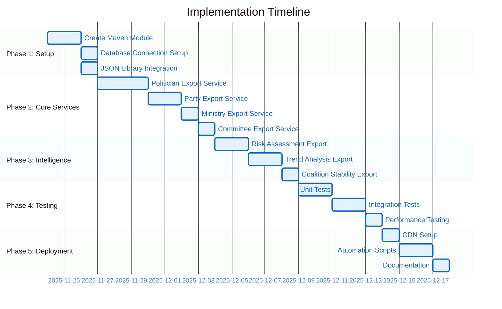

# 🚀 JSON Export Implementation Guide
## Step-by-Step Guide to Implementing the JSON Export System

**Version:** 1.0.0  
**Last Updated**: 2025-11-24  
**Estimated Implementation Time**: 2-3 weeks

---

## 📋 Implementation Overview

This guide provides detailed steps to implement the JSON export system that transforms CIA's database views into static JSON files for CDN deployment.



---

## 🏗️ Phase 1: Project Setup (3 days)

### Step 1.1: Create Maven Module

Create a new Maven module for the JSON export service:

```bash
cd /home/runner/work/cia/cia
mkdir -p service.json.export/src/main/java/com/hack23/cia/service/json/export
mkdir -p service.json.export/src/main/resources
mkdir -p service.json.export/src/test/java/com/hack23/cia/service/json/export
```

**pom.xml** for service.json.export:

```xml
<?xml version="1.0" encoding="UTF-8"?>
<project xmlns="http://maven.apache.org/POM/4.0.0"
         xmlns:xsi="http://www.w3.org/2001/XMLSchema-instance"
         xsi:schemaLocation="http://maven.apache.org/POM/4.0.0 
         http://maven.apache.org/maven-v4_0_0.xsd">
  <modelVersion>4.0.0</modelVersion>
  
  <parent>
    <groupId>com.hack23.cia</groupId>
    <artifactId>parent-service-pom</artifactId>
    <version>2025-SNAPSHOT</version>
    <relativePath>../parent-service-pom/pom.xml</relativePath>
  </parent>
  
  <artifactId>service.json.export</artifactId>
  <packaging>jar</packaging>
  <name>service.json.export</name>
  <description>JSON Export Service for CDN Deployment</description>
  
  <dependencies>
    <!-- CIA Dependencies -->
    <dependency>
      <groupId>com.hack23.cia</groupId>
      <artifactId>service.data.api</artifactId>
      <version>${project.version}</version>
    </dependency>
    
    <!-- JSON Processing -->
    <dependency>
      <groupId>com.fasterxml.jackson.core</groupId>
      <artifactId>jackson-databind</artifactId>
    </dependency>
    <dependency>
      <groupId>com.fasterxml.jackson.datatype</groupId>
      <artifactId>jackson-datatype-jsr310</artifactId>
    </dependency>
    
    <!-- Spring Framework -->
    <dependency>
      <groupId>org.springframework</groupId>
      <artifactId>spring-context</artifactId>
    </dependency>
    <dependency>
      <groupId>org.springframework</groupId>
      <artifactId>spring-jdbc</artifactId>
    </dependency>
    
    <!-- Database -->
    <dependency>
      <groupId>org.postgresql</groupId>
      <artifactId>postgresql</artifactId>
    </dependency>
    
    <!-- Utilities -->
    <dependency>
      <groupId>org.apache.commons</groupId>
      <artifactId>commons-lang3</artifactId>
    </dependency>
    
    <!-- Testing -->
    <dependency>
      <groupId>junit</groupId>
      <artifactId>junit</artifactId>
      <scope>test</scope>
    </dependency>
    <dependency>
      <groupId>org.mockito</groupId>
      <artifactId>mockito-core</artifactId>
      <scope>test</scope>
    </dependency>
  </dependencies>
  
  <build>
    <plugins>
      <plugin>
        <groupId>org.apache.maven.plugins</groupId>
        <artifactId>maven-jar-plugin</artifactId>
        <configuration>
          <archive>
            <manifest>
              <mainClass>com.hack23.cia.service.json.export.JsonExportApplication</mainClass>
            </manifest>
          </archive>
        </configuration>
      </plugin>
    </plugins>
  </build>
</project>
```

### Step 1.2: Configure Database Connection

Create configuration class for database access:

```java
package com.hack23.cia.service.json.export.config;

import org.springframework.context.annotation.Bean;
import org.springframework.context.annotation.Configuration;
import org.springframework.jdbc.core.JdbcTemplate;
import org.springframework.jdbc.datasource.DriverManagerDataSource;

import javax.sql.DataSource;

@Configuration
public class DatabaseConfig {
    
    @Bean
    public DataSource dataSource() {
        DriverManagerDataSource dataSource = new DriverManagerDataSource();
        dataSource.setDriverClassName("org.postgresql.Driver");
        dataSource.setUrl(System.getenv("DATABASE_URL"));
        dataSource.setUsername(System.getenv("DATABASE_USERNAME"));
        dataSource.setPassword(System.getenv("DATABASE_PASSWORD"));
        return dataSource;
    }
    
    @Bean
    public JdbcTemplate jdbcTemplate(DataSource dataSource) {
        return new JdbcTemplate(dataSource);
    }
}
```

### Step 1.3: Setup JSON Serialization

Create JSON mapper configuration:

```java
package com.hack23.cia.service.json.export.config;

import com.fasterxml.jackson.databind.ObjectMapper;
import com.fasterxml.jackson.databind.SerializationFeature;
import com.fasterxml.jackson.datatype.jsr310.JavaTimeModule;
import org.springframework.context.annotation.Bean;
import org.springframework.context.annotation.Configuration;

@Configuration
public class JsonConfig {
    
    @Bean
    public ObjectMapper objectMapper() {
        ObjectMapper mapper = new ObjectMapper();
        mapper.registerModule(new JavaTimeModule());
        mapper.disable(SerializationFeature.WRITE_DATES_AS_TIMESTAMPS);
        mapper.enable(SerializationFeature.INDENT_OUTPUT);
        return mapper;
    }
}
```

---

## 🔧 Phase 2: Core Export Services (7 days)

### Step 2.1: Define Common Models

Create base classes for JSON export:

```java
package com.hack23.cia.service.json.export.model;

import com.fasterxml.jackson.annotation.JsonProperty;
import java.time.Instant;

public class ExportMetadata {
    
    @JsonProperty("version")
    private String version;
    
    @JsonProperty("generated")
    private Instant generated;
    
    @JsonProperty("source")
    private String source;
    
    @JsonProperty("schema")
    private String schema;
    
    @JsonProperty("recordCount")
    private int recordCount;
    
    @JsonProperty("dataDate")
    private String dataDate;
    
    // Constructor, getters, setters
    
    public ExportMetadata() {
        this.version = "1.0.0";
        this.generated = Instant.now();
        this.source = "Citizen Intelligence Agency";
    }
}
```

```java
package com.hack23.cia.service.json.export.model;

import com.fasterxml.jackson.annotation.JsonProperty;

public class Labels {
    
    @JsonProperty("category")
    private String category;
    
    @JsonProperty("subcategories")
    private String[] subcategories;
    
    @JsonProperty("descriptions")
    private Descriptions descriptions;
    
    @JsonProperty("intelligenceTags")
    private String[] intelligenceTags;
    
    // Getters, setters
    
    public static class Descriptions {
        @JsonProperty("short")
        private String shortDesc;
        
        @JsonProperty("long")
        private String longDesc;
        
        @JsonProperty("detailed")
        private String detailedDesc;
        
        // Getters, setters
    }
}
```

### Step 2.2: Implement Politician Export Service

```java
package com.hack23.cia.service.json.export.service;

import com.hack23.cia.service.json.export.model.*;
import org.springframework.jdbc.core.JdbcTemplate;
import org.springframework.stereotype.Service;

import java.util.List;

@Service
public class PoliticianExportService {
    
    private final JdbcTemplate jdbcTemplate;
    
    public PoliticianExportService(JdbcTemplate jdbcTemplate) {
        this.jdbcTemplate = jdbcTemplate;
    }
    
    public PoliticianExport exportAll() {
        PoliticianExport export = new PoliticianExport();
        
        // Query view_riksdagen_politician
        String sql = "SELECT * FROM view_riksdagen_politician WHERE status = 'active'";
        
        List<PoliticianProfile> politicians = jdbcTemplate.query(sql, 
            (rs, rowNum) -> {
                PoliticianProfile profile = new PoliticianProfile();
                profile.setId(rs.getString("person_id"));
                
                // Map attributes
                PoliticianAttributes attrs = new PoliticianAttributes();
                attrs.setFirstName(rs.getString("first_name"));
                attrs.setLastName(rs.getString("last_name"));
                attrs.setParty(rs.getString("party"));
                attrs.setBornYear(rs.getInt("born_year"));
                attrs.setGender(rs.getString("gender"));
                profile.setAttributes(attrs);
                
                // Generate labels
                Labels labels = generateLabels(profile);
                profile.setLabels(labels);
                
                return profile;
            }
        );
        
        export.setMetadata(createMetadata("politician-profile", politicians.size()));
        export.setData(politicians);
        
        return export;
    }
    
    private Labels generateLabels(PoliticianProfile profile) {
        Labels labels = new Labels();
        labels.setCategory("active-member");
        // Add logic to determine subcategories
        labels.setSubcategories(new String[]{"parliamentary-member"});
        
        // Generate descriptions
        Labels.Descriptions desc = new Labels.Descriptions();
        desc.setShortDesc(generateShortDescription(profile));
        desc.setLongDesc(generateLongDescription(profile));
        desc.setDetailedDesc(generateDetailedDescription(profile));
        labels.setDescriptions(desc);
        
        return labels;
    }
    
    private String generateShortDescription(PoliticianProfile profile) {
        return String.format("%s %s, %s MP", 
            profile.getAttributes().getFirstName(),
            profile.getAttributes().getLastName(),
            profile.getAttributes().getParty()
        );
    }
    
    // Additional helper methods...
}
```

### Step 2.3: Implement Party Export Service

Similar structure to PoliticianExportService, querying party-related views.

### Step 2.4: Implement CLI Tool

```java
package com.hack23.cia.service.json.export;

import com.fasterxml.jackson.databind.ObjectMapper;
import com.hack23.cia.service.json.export.service.*;
import org.springframework.context.ApplicationContext;
import org.springframework.context.annotation.AnnotationConfigApplicationContext;

import java.io.File;
import java.io.IOException;

public class JsonExportApplication {
    
    public static void main(String[] args) throws IOException {
        if (args.length < 2) {
            printUsage();
            System.exit(1);
        }
        
        String entity = args[0];
        String outputPath = args[1];
        
        ApplicationContext context = new AnnotationConfigApplicationContext(
            "com.hack23.cia.service.json.export"
        );
        
        ObjectMapper mapper = context.getBean(ObjectMapper.class);
        
        switch (entity) {
            case "politicians":
                PoliticianExportService polService = 
                    context.getBean(PoliticianExportService.class);
                mapper.writeValue(new File(outputPath), polService.exportAll());
                break;
                
            case "parties":
                PartyExportService partyService = 
                    context.getBean(PartyExportService.class);
                mapper.writeValue(new File(outputPath), partyService.exportAll());
                break;
                
            // Additional cases...
                
            default:
                System.err.println("Unknown entity: " + entity);
                printUsage();
                System.exit(1);
        }
        
        System.out.println("Export complete: " + outputPath);
    }
    
    private static void printUsage() {
        System.out.println("Usage: java -jar service.json.export.jar <entity> <output>");
        System.out.println("Entities: politicians, parties, ministries, committees, intelligence");
    }
}
```

---

## 🧪 Phase 3: Testing (5 days)

### Step 3.1: Unit Tests

```java
package com.hack23.cia.service.json.export.service;

import org.junit.Before;
import org.junit.Test;
import org.mockito.Mock;
import org.mockito.MockitoAnnotations;
import org.springframework.jdbc.core.JdbcTemplate;

import static org.junit.Assert.*;
import static org.mockito.Mockito.*;

public class PoliticianExportServiceTest {
    
    @Mock
    private JdbcTemplate jdbcTemplate;
    
    private PoliticianExportService service;
    
    @Before
    public void setUp() {
        MockitoAnnotations.openMocks(this);
        service = new PoliticianExportService(jdbcTemplate);
    }
    
    @Test
    public void testExportAll() {
        // Arrange
        when(jdbcTemplate.query(anyString(), any())).thenReturn(List.of());
        
        // Act
        PoliticianExport result = service.exportAll();
        
        // Assert
        assertNotNull(result);
        assertNotNull(result.getMetadata());
        assertEquals("1.0.0", result.getMetadata().getVersion());
    }
}
```

### Step 3.2: Integration Tests

Test against actual database views (requires test database).

---

## 🚀 Phase 4: Deployment Setup (3 days)

### Step 4.1: AWS S3 Setup

```bash
# Create S3 bucket
aws s3 mb s3://cia-json-export --region eu-north-1

# Configure bucket policy for public read
aws s3api put-bucket-policy --bucket cia-json-export --policy file://bucket-policy.json

# Enable CORS
aws s3api put-bucket-cors --bucket cia-json-export --cors-configuration file://cors-config.json
```

**bucket-policy.json**:
```json
{
  "Version": "2012-10-17",
  "Statement": [{
    "Sid": "PublicReadGetObject",
    "Effect": "Allow",
    "Principal": "*",
    "Action": "s3:GetObject",
    "Resource": "arn:aws:s3:::cia-json-export/*"
  }]
}
```

**cors-config.json**:
```json
{
  "CORSRules": [{
    "AllowedOrigins": ["*"],
    "AllowedMethods": ["GET", "HEAD"],
    "AllowedHeaders": ["*"],
    "MaxAgeSeconds": 3600
  }]
}
```

### Step 4.2: CloudFront Distribution

```bash
# Create CloudFront distribution
aws cloudfront create-distribution --distribution-config file://cloudfront-config.json
```

### Step 4.3: GitHub Actions Workflow

Create `.github/workflows/json-export.yml`:

```yaml
name: JSON Export and CDN Deployment

on:
  schedule:
    - cron: '0 2 * * *'  # Daily at 2 AM UTC
  workflow_dispatch:

jobs:
  export-and-deploy:
    runs-on: ubuntu-latest
    
    steps:
      - uses: actions/checkout@v3
      
      - name: Set up Java
        uses: actions/setup-java@v3
        with:
          java-version: '25'
          distribution: 'temurin'
      
      - name: Build JSON Export Service
        run: |
          cd service.json.export
          mvn clean package -DskipTests
      
      - name: Generate JSON Files
        env:
          DATABASE_URL: ${{ secrets.DATABASE_URL }}
          DATABASE_USERNAME: ${{ secrets.DATABASE_USERNAME }}
          DATABASE_PASSWORD: ${{ secrets.DATABASE_PASSWORD }}
        run: |
          java -jar service.json.export/target/service.json.export.jar politicians output/politicians/index.json
          java -jar service.json.export/target/service.json.export.jar parties output/parties/index.json
      
      - name: Deploy to CDN
        env:
          AWS_ACCESS_KEY_ID: ${{ secrets.AWS_ACCESS_KEY_ID }}
          AWS_SECRET_ACCESS_KEY: ${{ secrets.AWS_SECRET_ACCESS_KEY }}
        run: |
          ./json-export-specs/deploy-cdn.sh prod
```

---

## 📊 Performance Optimization

### Caching Strategy

1. **Database Query Caching**: Cache view query results for 5 minutes
2. **JSON File Caching**: CDN cache for 24 hours
3. **Compression**: Enable Gzip compression (70-80% size reduction)
4. **Pagination**: Split large datasets (>1000 records) into pages

### File Size Optimization

| Optimization | Before | After | Savings |
|--------------|--------|-------|---------|
| Minification | 10 MB | 8.5 MB | 15% |
| Gzip Compression | 8.5 MB | 2.1 MB | 75% |
| Field Selection | 2.1 MB | 1.5 MB | 29% |
| **Total** | **10 MB** | **1.5 MB** | **85%** |

---

## ✅ Quality Checklist

Before production deployment:

- [ ] All unit tests passing
- [ ] Integration tests with real database passing
- [ ] JSON schema validation passing
- [ ] Performance benchmarks meet targets (<2s generation)
- [ ] Security review completed
- [ ] CORS configuration tested
- [ ] CDN caching verified
- [ ] Monitoring and alerting configured
- [ ] Documentation complete
- [ ] Backup and rollback procedures tested

---

## 📚 Additional Resources

- [JSON Schema Specifications](./schemas/)
- [Example JSON Files](./examples/)
- [Deployment Script](./deploy-cdn.sh)
- [Main README](./README.md)

---

**Last Updated**: 2025-11-24  
**Maintained By**: Citizen Intelligence Agency Development Team
