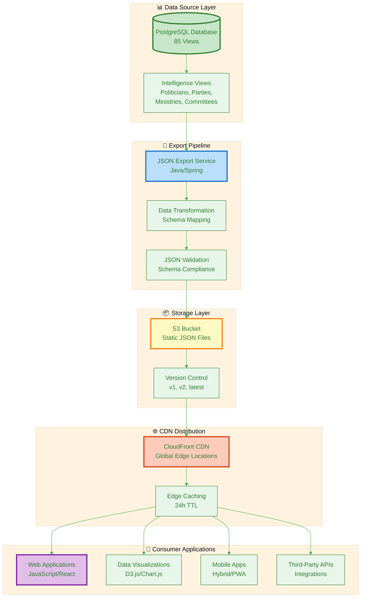

# 📊 CIA JSON Export System - Static CDN Deployment
## Comprehensive Political Intelligence Data for JavaScript Applications

**Version:** 1.1.0  
**Date:** 2024-12-03  
**Purpose:** Static JSON data exports for CDN hosting and JavaScript consumption  
**Update Frequency:** Daily automated updates

---

## 🔗 Business Context & Product Integration

These JSON specifications are the **technical foundation** for the CIA product portfolio, enabling all 6 product lines with structured political intelligence data.

### Business Strategy Documentation
- **[BUSINESS_PRODUCT_DOCUMENT.md](../BUSINESS_PRODUCT_DOCUMENT.md)** - Complete business strategy with product-to-data mapping (€46M TAM)
- **[BUSINESS_PRODUCT_DOCUMENT.md#technical-data-specifications](../BUSINESS_PRODUCT_DOCUMENT.md#technical-data-specifications)** - Product-to-Data Mapping Table
- **[BUSINESS_PRODUCT_DOCUMENT.md#appendix-e-product-to-data-mapping](../BUSINESS_PRODUCT_DOCUMENT.md#appendix-e-product-to-data-mapping)** - Comprehensive traceability from features to data

### Market Opportunity
The JSON specifications power products serving 5 customer segments with **€46M Total Addressable Market**:
- **Political Consulting** (€15M TAM) - Politician risk assessment, voting statistics
- **Media & Journalism** (€8M TAM) - Real-time political monitoring, investigative data
- **Academic Research** (€5M TAM) - Comprehensive datasets, bulk exports
- **Corporate Affairs** (€12M TAM) - Government affairs monitoring, regulatory tracking
- **Financial Services** (€20M+ TAM) - Political risk intelligence, early warning systems

### Product Line Integration

| Product Line | JSON Schemas Used | Revenue Potential | Customer Segments |
|--------------|-------------------|-------------------|-------------------|
| **Political Intelligence API** | [politician-schema.md](schemas/politician-schema.md), [party-schema.md](schemas/party-schema.md) | €630K/year | Political consulting, media, academic |
| **Advanced Analytics Suite** | [intelligence-schema.md](schemas/intelligence-schema.md), All schemas | €855K/year | Corporate affairs, NGOs, political parties |
| **Risk Intelligence Feed** | [intelligence-schema.md](schemas/intelligence-schema.md) | €1.77M/year | Financial services, corporate risk, consulting |
| **Predictive Analytics** | [intelligence-schema.md](schemas/intelligence-schema.md), [party-schema.md](schemas/party-schema.md) | €2.05M/year | Strategic consulting, corporate strategy, campaigns |
| **White-Label Platform** | All schemas | €1.7M-4.7M/year | Government agencies, international orgs, consulting |
| **Decision Intelligence** | [intelligence-schema.md](schemas/intelligence-schema.md), [ministry-schema.md](schemas/ministry-schema.md) | €2.09M/year | Lobbying, corporate affairs, media |

**Total Annual Revenue Potential**: €9.1M+ from JSON-powered products

---

## 🎯 Executive Summary

The CIA JSON Export System transforms the comprehensive political intelligence database into structured, versioned JSON files optimized for static CDN hosting. This enables lightweight JavaScript applications, data visualization tools, and third-party integrations to access Swedish political data without direct database connections.

### Key Benefits

- **🚀 High Performance**: Static JSON files served via CDN with global edge caching
- **💰 Cost-Effective**: Eliminate database query costs, pay only for storage and bandwidth
- **🔒 Secure**: Read-only data access, no database credentials exposed
- **🌐 Universal Access**: CORS-enabled, accessible from any JavaScript application
- **📱 Mobile-Friendly**: Optimized JSON sizes for mobile and low-bandwidth scenarios
- **🔄 Always Current**: Daily automated updates from live database

### Data Coverage

| Entity Type | Records | Update Frequency | Avg File Size |
|------------|---------|------------------|---------------|
| **Politicians** | ~350 active | Daily | ~2.5 MB |
| **Parties** | 8 parliamentary | Daily | ~500 KB |
| **Ministries** | 12 government | Daily | ~800 KB |
| **Committees** | 15 riksdag | Daily | ~600 KB |
| **Intelligence Products** | Risk scores, trends | Daily | ~1.2 MB |

---

## 📋 Table of Contents

1. [Architecture Overview](#architecture-overview)
2. [JSON Schema Specifications](#json-schema-specifications)
3. [Data Categories & Labels](#data-categories--labels)
4. [File Structure & Naming](#file-structure--naming)
5. [CDN Deployment Guide](#cdn-deployment-guide)
6. [JavaScript Usage Examples](#javascript-usage-examples)
7. [Update & Versioning Strategy](#update--versioning-strategy)
8. [API Compatibility](#api-compatibility)

---

## 🏗️ Architecture Overview



### Data Flow Pipeline

1. **📥 Data Extraction**: Query materialized views from PostgreSQL database
2. **🔄 Transformation**: Map database records to JSON schema with labels
3. **✅ Validation**: Verify JSON schema compliance and data quality
4. **💾 Storage**: Write versioned JSON files to S3 bucket
5. **🚀 Distribution**: Invalidate CDN cache and propagate to edge locations
6. **📊 Consumption**: JavaScript applications fetch JSON via HTTPS

---

## 📄 JSON Schema Specifications

### Schema Design Principles

1. **Consistent Structure**: All JSON files follow standardized patterns
2. **Rich Metadata**: Include timestamps, versions, source attribution
3. **Multi-Level Descriptions**: Short (tweet), long (paragraph), detailed (essay)
4. **Category Labels**: Hierarchical classification system
5. **Relationship Links**: Cross-references between entities
6. **Performance Optimized**: Minimal nesting, efficient serialization

### Common JSON Structure

```json
{
  "metadata": {
    "version": "1.0.0",
    "generated": "2024-11-24T02:23:58Z",
    "source": "Citizen Intelligence Agency",
    "schema": "politician-profile",
    "recordCount": 349,
    "dataDate": "2024-11-23"
  },
  "data": [
    {
      "id": "unique-identifier",
      "labels": {
        "category": "primary-classification",
        "subcategories": ["tag1", "tag2"],
        "descriptions": {
          "short": "One-line summary (max 140 chars)",
          "long": "Paragraph description (max 500 chars)",
          "detailed": "Comprehensive overview with context"
        }
      },
      "attributes": {
        // Entity-specific fields
      },
      "relationships": {
        // Cross-references to related entities
      },
      "intelligence": {
        // Analytical metrics and scores
      }
    }
  ]
}
```

### Schema-to-Product Mapping

Each JSON schema directly supports specific product features and customer use cases:

| Schema File | Product Lines | Key Features | Business Value | Customer Segments |
|------------|---------------|--------------|----------------|-------------------|
| **[politician-schema.md](schemas/politician-schema.md)** | Political Intelligence API, Advanced Analytics, Risk Intelligence | Politician profiles, voting records, risk scores, activity metrics | Core API product, €15M TAM | Political consulting, media, academic |
| **[party-schema.md](schemas/party-schema.md)** | Political Intelligence API, Advanced Analytics, Predictive Analytics | Party performance, coalition patterns, voting trends | Coalition analysis, €12M TAM | Corporate affairs, political consulting |
| **[committee-schema.md](schemas/committee-schema.md)** | Advanced Analytics, Decision Intelligence | Committee composition, proposal tracking, effectiveness metrics | Legislative monitoring, €8M TAM | Government affairs, lobbying |
| **[ministry-schema.md](schemas/ministry-schema.md)** | Decision Intelligence, White-Label Platform | Government ministry data, decision flows, policy effectiveness | Regulatory forecasting, €10M TAM | Corporate risk, consulting firms |
| **[intelligence-schema.md](schemas/intelligence-schema.md)** | Risk Intelligence, Predictive Analytics, Decision Intelligence | Risk assessment, predictions, decision analytics, trend forecasting | Premium analytics, €30M+ TAM | Financial services, strategic consulting |

**See Complete Product Documentation**: [BUSINESS_PRODUCT_DOCUMENT.md](../BUSINESS_PRODUCT_DOCUMENT.md)

### Detailed Schema Documentation

All schemas are documented in Markdown format with:
- **Entity structure** and field definitions
- **Database view mappings** (from 85 available views)
- **Sample data** with real examples
- **Mermaid diagrams** for visual representation
- **Intelligence applications** and use cases

**Complete Schema Catalog**:
1. **[schemas/politician-schema.md](schemas/politician-schema.md)** - 19,893 bytes, comprehensive politician data model
2. **[schemas/party-schema.md](schemas/party-schema.md)** - 19,748 bytes, party performance and coalition analytics
3. **[schemas/committee-schema.md](schemas/committee-schema.md)** - 10,245 bytes, committee composition and proposals
4. **[schemas/ministry-schema.md](schemas/ministry-schema.md)** - 10,949 bytes, government ministry performance
5. **[schemas/intelligence-schema.md](schemas/intelligence-schema.md)** - 17,122 bytes, risk assessment and predictive models

**Database View Integration**: All schemas map to specific database views documented in [DATABASE_VIEW_INTELLIGENCE_CATALOG.md](../DATABASE_VIEW_INTELLIGENCE_CATALOG.md) (85 views total).

### Example JSON Files (CDN-Ready)

The following example files demonstrate the complete JSON export format for each intelligence product:

| Example File | Schema | Description | File Size | Update Frequency |
|-------------|--------|-------------|-----------|------------------|
| **[politician-example.json](examples/politician-example.json)** | politician-schema.md | Comprehensive politician profiles with voting, activity, and risk data | ~2.5 KB | Daily |
| **[party-example.json](examples/party-example.json)** | party-schema.md | Party performance, coalition, and electoral analytics | ~3.5 KB | Daily |
| **[risk-assessment-example.json](examples/risk-assessment-example.json)** | intelligence-schema.md | Risk assessment with 50 behavioral rules catalog | ~15 KB | Daily |
| **[coalition-alignment-example.json](examples/coalition-alignment-example.json)** | intelligence-schema.md | Coalition alignment matrix and party voting patterns | ~10 KB | Daily |
| **[temporal-trends-example.json](examples/temporal-trends-example.json)** | intelligence-schema.md | Temporal trend analysis (daily/weekly/monthly/annual) | ~13 KB | Daily |

**Intelligence Products Coverage**:
- ✅ **Risk Assessments**: Complete 50-rule risk catalog with entity-level assessments
- ✅ **Coalition Analysis**: Party alignment matrix with voting cohesion metrics
- ✅ **Temporal Trends**: Multi-timeframe trend analysis for intelligence monitoring
- ✅ **Politician Profiles**: Individual politician data with risk and performance scores
- ✅ **Party Analytics**: Party-level performance and coalition stability metrics

---

## 🏷️ Data Categories & Labels

### Label System Architecture

```mermaid
%%{
  init: {
    'theme': 'base',
    'themeVariables': {
      'primaryColor': '#e3f2fd',
      'primaryTextColor': '#1565c0',
      'lineColor': '#42a5f5',
      'secondaryColor': '#f3e5f5',
      'tertiaryColor': '#fff3e0',
      'primaryBorderColor': '#1565c0',
      'fontSize': '14px'
    }
  }
}%%
graph TB
    ROOT[Entity Root]
    
    subgraph "🏛️ Politicians"
        POL_CAT[Category: Politician]
        POL_SUB1[Active Member]
        POL_SUB2[Former Member]
        POL_SUB3[Minister]
        POL_SUB4[Committee Chair]
    end
    
    subgraph "🎭 Parties"
        PARTY_CAT[Category: Party]
        PARTY_SUB1[Government Coalition]
        PARTY_SUB2[Opposition]
        PARTY_SUB3[Left Wing]
        PARTY_SUB4[Right Wing]
        PARTY_SUB5[Center]
    end
    
    subgraph "🏢 Ministries"
        MIN_CAT[Category: Ministry]
        MIN_SUB1[Policy Area]
        MIN_SUB2[Budget Size]
        MIN_SUB3[Coalition Member]
    end
    
    subgraph "👥 Committees"
        COM_CAT[Category: Committee]
        COM_SUB1[Standing Committee]
        COM_SUB2[Policy Domain]
        COM_SUB3[Activity Level]
    end
    
    ROOT --> POL_CAT
    ROOT --> PARTY_CAT
    ROOT --> MIN_CAT
    ROOT --> COM_CAT
    
    POL_CAT --> POL_SUB1
    POL_CAT --> POL_SUB2
    POL_CAT --> POL_SUB3
    POL_CAT --> POL_SUB4
    
    PARTY_CAT --> PARTY_SUB1
    PARTY_CAT --> PARTY_SUB2
    PARTY_CAT --> PARTY_SUB3
    PARTY_CAT --> PARTY_SUB4
    PARTY_CAT --> PARTY_SUB5
    
    MIN_CAT --> MIN_SUB1
    MIN_CAT --> MIN_SUB2
    MIN_CAT --> MIN_SUB3
    
    COM_CAT --> COM_SUB1
    COM_CAT --> COM_SUB2
    COM_CAT --> COM_SUB3
    
    style POL_CAT fill:#bbdefb,stroke:#1976d2,stroke-width:3px
    style PARTY_CAT fill:#c8e6c9,stroke:#388e3c,stroke-width:3px
    style MIN_CAT fill:#fff9c4,stroke:#f57f17,stroke-width:3px
    style COM_CAT fill:#ffccbc,stroke:#d84315,stroke-width:3px
```



### Category Definitions

#### Politicians
- **Primary Categories**: Active Member, Former Member, Minister, Committee Chair, Party Leader
- **Subcategories**: Electoral District, Party Affiliation, Committee Memberships, Cabinet Positions
- **Intelligence Tags**: High Risk, Rising Star, Coalition Broker, Policy Expert, Media Influencer

#### Parties
- **Primary Categories**: Government Coalition, Opposition, Parliamentary, Extra-Parliamentary
- **Subcategories**: Ideological Spectrum (Left, Center, Right), Policy Focus, Coalition History
- **Intelligence Tags**: Stable, Volatile, Growing, Declining, Swing Voter Appeal

#### Ministries
- **Primary Categories**: Cabinet Ministry, Administrative Agency, Policy Domain
- **Subcategories**: Budget Allocation, Staff Size, Coalition Control, Reform Agenda
- **Intelligence Tags**: High Performance, Budget Concerns, Reform Focus, Crisis Management

#### Committees
- **Primary Categories**: Standing Committee, Special Committee, EU Committee
- **Subcategories**: Policy Domain, Activity Level, Cross-Party Cooperation
- **Intelligence Tags**: Productive, Contentious, Consensus-Building, Media Focus

---

## 📁 File Structure & Naming

### Directory Layout

```
json-export/
├── v1.0.0/                          # Version directory
│   ├── metadata.json                # Export metadata
│   ├── politicians/
│   │   ├── index.json              # All politicians list
│   │   ├── active.json             # Active politicians only
│   │   ├── by-party/
│   │   │   ├── s.json              # Social Democrats
│   │   │   ├── m.json              # Moderates
│   │   │   └── ...
│   │   ├── by-committee/
│   │   │   ├── au.json             # Foreign Affairs
│   │   │   ├── ju.json             # Justice
│   │   │   └── ...
│   │   └── profiles/
│   │       ├── {personId}.json     # Individual profiles
│   │       └── ...
│   ├── parties/
│   │   ├── index.json              # All parties
│   │   ├── parliamentary.json      # Parliamentary parties
│   │   ├── profiles/
│   │   │   ├── {partyId}.json      # Individual party profiles
│   │   │   └── ...
│   │   └── analytics/
│   │       ├── voting-cohesion.json
│   │       ├── electoral-trends.json
│   │       └── coalition-matrix.json
│   ├── ministries/
│   │   ├── index.json
│   │   ├── current-government.json
│   │   ├── profiles/
│   │   │   ├── {ministryId}.json
│   │   │   └── ...
│   │   └── performance/
│   │       ├── budget-execution.json
│   │       └── policy-effectiveness.json
│   ├── committees/
│   │   ├── index.json
│   │   ├── standing.json
│   │   ├── profiles/
│   │   │   ├── {committeeId}.json
│   │   │   └── ...
│   │   └── productivity/
│   │       ├── legislation-output.json
│   │       └── decision-timeline.json
│   └── intelligence/
│       ├── risk-assessments.json
│       ├── trend-analysis.json
│       ├── coalition-stability.json
│       ├── voting-patterns.json
│       └── predictive-analytics.json
└── latest/                          # Symlink to current version
    └── ... (mirrors v1.0.0 structure)
```

### Naming Conventions

- **Version Format**: Semantic versioning (MAJOR.MINOR.PATCH)
- **File Names**: Lowercase, hyphen-separated, descriptive
- **IDs**: Use official identifiers from source systems
- **Timestamps**: ISO 8601 format (UTC)

---

## 🌐 CDN Deployment Guide

### Recommended CDN Options

#### Option 1: AWS S3 + CloudFront (Recommended)

**Cost**: ~$15-30/month for 100GB storage + 1TB transfer

```bash
# 1. Create S3 bucket
aws s3 mb s3://cia-json-export --region eu-north-1

# 2. Configure public read access
aws s3api put-bucket-policy --bucket cia-json-export --policy '{
  "Version": "2012-10-17",
  "Statement": [{
    "Sid": "PublicReadGetObject",
    "Effect": "Allow",
    "Principal": "*",
    "Action": "s3:GetObject",
    "Resource": "arn:aws:s3:::cia-json-export/*"
  }]
}'

# 3. Enable CORS
aws s3api put-bucket-cors --bucket cia-json-export --cors-configuration '{
  "CORSRules": [{
    "AllowedOrigins": ["*"],
    "AllowedMethods": ["GET", "HEAD"],
    "AllowedHeaders": ["*"],
    "MaxAgeSeconds": 3600
  }]
}'

# 4. Create CloudFront distribution
aws cloudfront create-distribution --origin-domain-name cia-json-export.s3.amazonaws.com
```

**Configuration**:
- **Cache Behavior**: 24-hour TTL
- **Compression**: Gzip enabled
- **HTTPS**: Required
- **Query String Forwarding**: None
- **Geo Restrictions**: None

#### Option 2: Cloudflare Pages

**Cost**: Free tier (unlimited bandwidth)

1. Create Cloudflare account
2. Add custom domain or use pages.dev subdomain
3. Deploy via Git integration or Wrangler CLI
4. Configure caching rules and CORS headers

#### Option 3: Netlify

**Cost**: Free tier (100GB bandwidth/month)

```bash
# Deploy with Netlify CLI
npm install -g netlify-cli
netlify deploy --prod --dir=json-export
```

### CORS Configuration

```json
{
  "Access-Control-Allow-Origin": "*",
  "Access-Control-Allow-Methods": "GET, HEAD, OPTIONS",
  "Access-Control-Allow-Headers": "Content-Type",
  "Access-Control-Max-Age": "86400",
  "Cache-Control": "public, max-age=86400"
}
```

---

## 💻 JavaScript Usage Examples

### Basic Fetch Example

```javascript
// Fetch all politicians
async function fetchPoliticians() {
  const response = await fetch('https://cdn.cia.se/v1.0.0/politicians/index.json');
  const data = await response.json();
  
  console.log(`Loaded ${data.metadata.recordCount} politicians`);
  return data.data;
}

// Fetch specific politician profile
async function fetchPoliticianProfile(personId) {
  const response = await fetch(`https://cdn.cia.se/v1.0.0/politicians/profiles/${personId}.json`);
  return response.json();
}
```

### React Integration

```jsx
import { useState, useEffect } from 'react';

function PoliticianList() {
  const [politicians, setPoliticians] = useState([]);
  const [loading, setLoading] = useState(true);
  
  useEffect(() => {
    fetch('https://cdn.cia.se/v1.0.0/politicians/active.json')
      .then(res => res.json())
      .then(data => {
        setPoliticians(data.data);
        setLoading(false);
      })
      .catch(err => console.error('Failed to load politicians:', err));
  }, []);
  
  if (loading) return <div>Loading...</div>;
  
  return (
    <div>
      <h2>Active Politicians ({politicians.length})</h2>
      <ul>
        {politicians.map(pol => (
          <li key={pol.id}>
            {pol.attributes.firstName} {pol.attributes.lastName} 
            ({pol.attributes.party})
            <p>{pol.labels.descriptions.short}</p>
          </li>
        ))}
      </ul>
    </div>
  );
}
```

### Vue.js Integration

```vue
<template>
  <div>
    <h2>Parliamentary Parties</h2>
    <div v-for="party in parties" :key="party.id">
      <h3>{{ party.attributes.name }}</h3>
      <p>{{ party.labels.descriptions.long }}</p>
      <span>Members: {{ party.intelligence.memberCount }}</span>
    </div>
  </div>
</template>

<script>
export default {
  data() {
    return {
      parties: []
    };
  },
  async mounted() {
    const response = await fetch('https://cdn.cia.se/v1.0.0/parties/parliamentary.json');
    const data = await response.json();
    this.parties = data.data;
  }
};
</script>
```

### Data Visualization (D3.js)

```javascript
// Load and visualize party voting cohesion
async function visualizePartyVoting() {
  const response = await fetch('https://cdn.cia.se/v1.0.0/parties/analytics/voting-cohesion.json');
  const data = await response.json();
  
  const svg = d3.select('#chart')
    .append('svg')
    .attr('width', 800)
    .attr('height', 400);
  
  // Create bar chart showing party cohesion scores
  svg.selectAll('rect')
    .data(data.data)
    .enter()
    .append('rect')
    .attr('x', (d, i) => i * 90 + 50)
    .attr('y', d => 350 - d.intelligence.cohesionScore * 3)
    .attr('width', 70)
    .attr('height', d => d.intelligence.cohesionScore * 3)
    .attr('fill', d => d.attributes.color);
}
```

---

## 🔄 Update & Versioning Strategy

### Update Schedule

```mermaid
%%{
  init: {
    'theme': 'base',
    'themeVariables': {
      'primaryColor': '#fff9c4',
      'primaryTextColor': '#f57f17',
      'lineColor': '#fbc02d',
      'secondaryColor': '#e1bee7',
      'tertiaryColor': '#e8f5e9',
      'primaryBorderColor': '#f57f17',
      'fontSize': '14px'
    }
  }
}%%
gantt
    title Daily Update Cycle
    dateFormat HH:mm
    axisFormat %H:%M
    
    section Data Collection
    Extract from DB Views    :a1, 01:00, 30m
    Transform to JSON        :a2, after a1, 20m
    Validate Schema          :a3, after a2, 10m
    
    section Versioning
    Generate Version Tag     :b1, after a3, 5m
    Create Archive           :b2, after b1, 10m
    
    section Deployment
    Upload to S3             :c1, after b2, 15m
    Invalidate CDN Cache     :c2, after c1, 5m
    Update Latest Symlink    :c3, after c2, 2m
    
    section Validation
    Health Check             :d1, after c3, 10m
    Send Notifications       :d2, after d1, 2m
```



### Semantic Versioning

- **MAJOR**: Breaking schema changes (incompatible with previous versions)
- **MINOR**: New fields added, backward compatible
- **PATCH**: Bug fixes, data corrections, no schema change

### Version Migration

```javascript
// Version compatibility checker
function checkVersion(requiredVersion, currentVersion) {
  const [reqMajor] = requiredVersion.split('.');
  const [curMajor] = currentVersion.split('.');
  return reqMajor === curMajor;
}

// Fetch with version fallback
async function fetchWithFallback(path, preferredVersion = 'latest') {
  try {
    const url = `https://cdn.cia.se/${preferredVersion}/${path}`;
    return await fetch(url).then(r => r.json());
  } catch (err) {
    console.warn(`Failed to fetch ${preferredVersion}, trying v1.0.0`);
    return await fetch(`https://cdn.cia.se/v1.0.0/${path}`).then(r => r.json());
  }
}
```

---

## 🔗 API Compatibility

### RESTful URL Patterns

The JSON export structure mimics RESTful API conventions:

| Pattern | Example | Description |
|---------|---------|-------------|
| `/{entity}/index.json` | `/politicians/index.json` | List all entities |
| `/{entity}/{filter}.json` | `/politicians/active.json` | Filtered list |
| `/{entity}/by-{field}/{value}.json` | `/politicians/by-party/s.json` | Group by field |
| `/{entity}/profiles/{id}.json` | `/politicians/profiles/0123456789.json` | Individual profile |
| `/{entity}/{category}/{metric}.json` | `/parties/analytics/voting-cohesion.json` | Analytical data |

### Query Parameters (Future Enhancement)

While static JSON doesn't support query parameters, future enhancements could include:
- Pre-generated filtered views for common queries
- GraphQL layer for complex queries
- API Gateway with caching tier

---

## 📊 Performance Optimization

### File Size Optimization

| Optimization | Strategy | Savings |
|--------------|---------|---------|
| **Minification** | Remove whitespace | ~15-20% |
| **Gzip Compression** | CDN-level compression | ~70-80% |
| **Pagination** | Split large datasets | Variable |
| **Selective Fields** | Minimal vs. full profiles | ~40-50% |
| **Lazy Loading** | Load on-demand | N/A |

### Caching Strategy

```javascript
// Service Worker caching for offline support
self.addEventListener('fetch', event => {
  if (event.request.url.includes('cdn.cia.se')) {
    event.respondWith(
      caches.open('cia-data-v1').then(cache => {
        return cache.match(event.request).then(response => {
          return response || fetch(event.request).then(response => {
            cache.put(event.request, response.clone());
            return response;
          });
        });
      })
    );
  }
});
```

---

## 🔐 Security Considerations

### Data Privacy
- Only public information included (no personal contact details)
- Compliance with GDPR and Swedish data protection laws
- No tracking or analytics in JSON files

### Access Control
- Public read access (no authentication required)
- HTTPS-only (TLS 1.2+ required)
- Rate limiting at CDN level
- No write access from client side

### Integrity Verification

```javascript
// Verify data integrity with checksum
async function verifyDataIntegrity(url, expectedHash) {
  const response = await fetch(url);
  const data = await response.text();
  
  const buffer = new TextEncoder().encode(data);
  const hashBuffer = await crypto.subtle.digest('SHA-256', buffer);
  const hashArray = Array.from(new Uint8Array(hashBuffer));
  const hashHex = hashArray.map(b => b.toString(16).padStart(2, '0')).join('');
  
  return hashHex === expectedHash;
}
```

---

## 📚 Additional Resources

### Related Documentation
- [DATABASE_VIEW_INTELLIGENCE_CATALOG.md](../DATABASE_VIEW_INTELLIGENCE_CATALOG.md) - Source data views
- [DATA_ANALYSIS_INTOP_OSINT.md](../DATA_ANALYSIS_INTOP_OSINT.md) - Intelligence frameworks
- [BUSINESS_PRODUCT_DOCUMENT.md](../BUSINESS_PRODUCT_DOCUMENT.md) - Product strategy
- [ARCHITECTURE.md](../ARCHITECTURE.md) - System architecture

### Schema Documentation
- [Politician JSON Schema](./schemas/politician-schema.md)
- [Party JSON Schema](./schemas/party-schema.md)
- [Ministry JSON Schema](./schemas/ministry-schema.md)
- [Committee JSON Schema](./schemas/committee-schema.md)
- [Intelligence Products Schema](./schemas/intelligence-schema.md)

### Tools & Libraries
- [JSON Schema Validator](https://github.com/ajv-validator/ajv)
- [D3.js Data Visualization](https://d3js.org/)
- [Chart.js](https://www.chartjs.org/)
- [React Query](https://tanstack.com/query/latest) - Data fetching
- [SWR](https://swr.vercel.app/) - React hooks for data fetching

---

## 🤝 Contributing

For questions, issues, or contributions related to the JSON export system:

1. Review existing schemas and documentation
2. Test changes with sample data
3. Validate JSON schema compliance
4. Submit pull request with clear description
5. Ensure backward compatibility

---

## 📝 License

The JSON export system and generated data files are licensed under the Apache License 2.0, consistent with the Citizen Intelligence Agency platform.

---

**Last Updated**: 2024-11-24  
**Maintained By**: Citizen Intelligence Agency Development Team  
**Contact**: See [CONTRIBUTING.md](../CONTRIBUTING.md)
