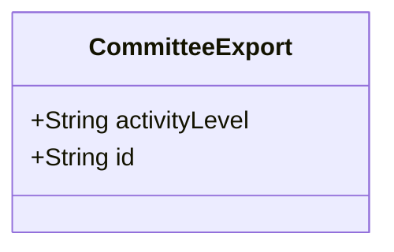

# Committee Schema (Data-Validated)

**Status:** ✅ Validated against actual sample data  
**Last Updated:** 2025-12-31  
**Fields:** 2 (only fields present in sample data)

## Overview

This schema has been automatically updated to reflect **only fields that exist in actual sample data**. 
Fields that were originally specified but not found in any data source have been removed.

**Validation Results:**
- Original fields defined: 26
- Fields validated in data: 2
- Fields removed (not in data): 24

## Data Model

## Field Descriptions

- **activityLevel** (`String`): Field found in sample data
- **id** (`String`): Field found in sample data

## Data Sources

This schema is validated against the following data sources:

- `view_riksdagen_committee_roles_sample.csv`
- `view_riksdagen_committee_ballot_decision_politician_summary_sample.csv`
- `view_riksdagen_committee_decisions_sample.csv`
- `view_riksdagen_committee_ballot_decision_summary_sample.csv`
- `view_riksdagen_committee_decision_type_summary_sample.csv`
- `view_riksdagen_committee_parliament_member_proposal_sample.csv`
- `view_riksdagen_committee_ballot_decision_party_summary_sample.csv`
- `view_riksdagen_committee_role_member_sample.csv`
- `view_riksdagen_committee_decision_type_org_summary_sample.csv`
- `view_riksdagen_committee_sample.csv`

## Migration Notes

**⚠️ Breaking Changes from Original Schema:**

This schema has been significantly reduced to match actual data availability. Fields removed include:

- `amendments` - Not found in any data source
- `attendanceRate` - Not found in any data source
- `attributes` - Not found in any data source
- `code` - Not found in any data source
- `decisions` - Not found in any data source
- `deputyMembers` - Not found in any data source
- `established` - Not found in any data source
- `hearings` - Not found in any data source
- `influence` - Not found in any data source
- `intelligence` - Not found in any data source
- `labels` - Not found in any data source
- `meetings` - Not found in any data source
- `membership` - Not found in any data source
- `name` - Not found in any data source
- `nameEn` - Not found in any data source
- `performanceScore` - Not found in any data source
- `policy` - Not found in any data source
- `policyDomain` - Not found in any data source
- `productivity` - Not found in any data source
- `regularMembers` - Not found in any data source
- `relationships` - Not found in any data source
- `reports` - Not found in any data source
- `totalMembers` - Not found in any data source
- `type` - Not found in any data source

**Recommendation:** Review the original schema documentation for intended functionality and determine:
1. Which removed fields should be implemented in the database
2. Which removed fields were speculative and can be permanently removed
3. Whether additional computed fields should be added to the export logic

See `SCHEMA_VALIDATION_REPORT.md` for detailed analysis.
