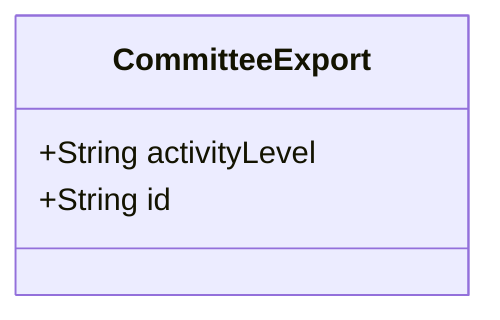

# Committee Schema (Data-Validated)

**Status:** ✅ Validated against actual sample data  
**Last Updated:** 2026-04-05  
**Fields:** 2 implemented (only fields present in sample data)

## Overview

This schema reflects **only fields that exist in actual sample data**. 
The 24 mismatched fields have been categorized by implementation status.

**Validation Results:**
- Original fields defined: 26
- Fields validated in data: 2
- Fields not in data: 24 (6 structural, 13 computable, 5 planned)

## Data Model

```mermaid
classDiagram
    class CommitteeExport {
        +String activityLevel
        +String id
    }
```

## Field Descriptions

- **activityLevel** (`String`): Field found in sample data
- **id** (`String`): Field found in sample data

## Data Sources

This schema is validated against the following data sources:

- `view_riksdagen_committee_roles_sample.csv`
- `view_riksdagen_committee_ballot_decision_politician_summary_sample.csv`
- `view_riksdagen_committee_decisions_sample.csv`
- `view_riksdagen_committee_ballot_decision_summary_sample.csv`
- `view_riksdagen_committee_decision_type_summary_sample.csv`
- `view_riksdagen_committee_parliament_member_proposal_sample.csv`
- `view_riksdagen_committee_ballot_decision_party_summary_sample.csv`
- `view_riksdagen_committee_role_member_sample.csv`
- `view_riksdagen_committee_decision_type_org_summary_sample.csv`
- `view_riksdagen_committee_sample.csv`

## Migration Notes

## Migration Notes

**Field Classification (24 fields not in data):**

### ❌ Structural Fields (JSON grouping objects)
- `attributes`, `labels`, `relationships`, `intelligence`, `membership`, `policy`

### 🔀 Computable Fields (derivable from existing DB columns)
- `code` — from `embedded_id_org_code` or `committee_code`
- `name` — from `embedded_id_detail` or `committee_name`
- `totalMembers` — from `current_member_size`
- `regularMembers` — from `current_regular_members`
- `deputyMembers` — from `current_substitute_positions`
- `established` — from `first_assignment_date`
- `reports` — from `reports_count` or `committee_reports`
- `performanceScore` — from `productivity_score`
- `productivity` — from `productivity_level`
- `decisions` — from `total_decisions_all_time` or `approved`
- `attendanceRate` — from `total_days_served` / expected days
- `amendments` — from document type filtering
- `hearings` — from activity tracking data

### 🔄 Planned Fields (require new data sources)
- `nameEn` — English translation not in database
- `type` — committee type classification
- `policyDomain` — policy area classification
- `meetings` — meeting count data not tracked
- `influence` — influence metric not yet defined

**Recommendation:** See `FIELD_MAPPING.md` for implementation priority and `SCHEMA_VALIDATION_REPORT.md` for remediation plan.
