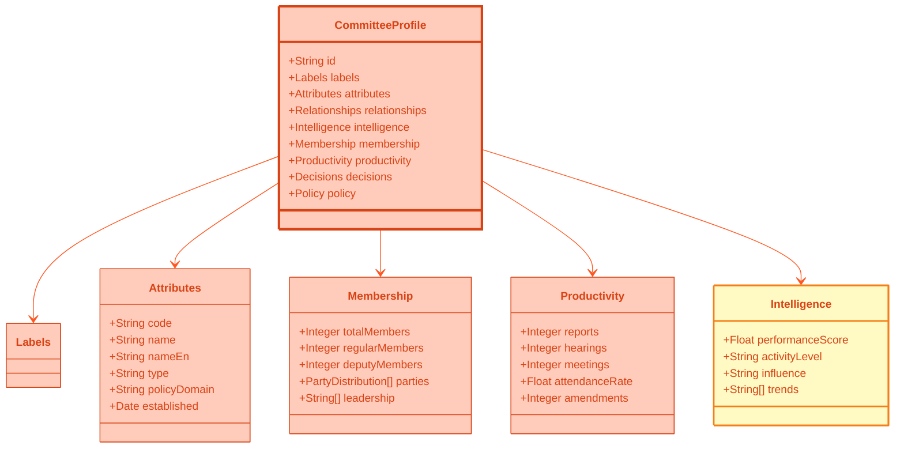

# 👥 Committee JSON Schema Specification
## Parliamentary Committee Comprehensive Profile Format

**Version:** 1.0.0  
**Schema ID**: `committee-profile`  
**Last Updated**: 2024-11-24

---

## 🔗 Business Context

This JSON schema powers **2 product lines** serving multiple market segments:

### Product Integration
- **[Advanced Analytics Suite](../../BUSINESS_PRODUCT_DOCUMENT.md#-product-line-2-advanced-analytics-suite)** - Analytics platform (€855K/year)
  - Committee analytics dashboards
  - Proposal tracking and effectiveness
  - Committee composition monitoring
- **[Decision Intelligence](../../BUSINESS_PRODUCT_DOCUMENT.md#-product-line-6-decision-intelligence-suite)** - Legislative analytics (€2.09M/year)
  - Committee decision patterns
  - Proposal success rates
  - Legislative bottleneck analysis

### Primary Market Segments
> **Note:** Market segments overlap across multiple schemas and products. This schema primarily serves:

- **Lobbying & Government Relations** (€15M+ TAM) - Committee targeting, proposal strategy
- **Corporate Affairs** (€12M TAM) - Legislative monitoring, committee relationship tracking

**See Complete Business Strategy**: [BUSINESS_PRODUCT_DOCUMENT.md](../../BUSINESS_PRODUCT_DOCUMENT.md) | [Product-to-Data Mapping](../../BUSINESS_PRODUCT_DOCUMENT.md#appendix-e-product-to-data-mapping)

---

## 🎯 Overview

The Committee JSON schema provides comprehensive representation of Swedish Riksdag committees, including membership, productivity, decision-making, policy focus, and performance analytics.

### Data Sources

This schema aggregates data from multiple database views:
- `view_riksdagen_committee_summary` - Core committee data
- `view_riksdagen_committee_decision_summary` - Decision-making
- `view_riksdagen_committee_ballot_decision_summary` - Voting patterns
- Committee productivity metrics

---

## 📊 Schema Diagram



---

## 📝 Complete JSON Example

```json
{
  "metadata": {
    "version": "1.0.0",
    "generated": "2024-11-24T02:23:58Z",
    "source": "Citizen Intelligence Agency",
    "schema": "committee-profile",
    "recordCount": 15
  },
  "data": [
    {
      "id": "FiU",
      "labels": {
        "category": "standing-committee",
        "subcategories": [
          "economic-policy",
          "high-influence",
          "budget-authority"
        ],
        "descriptions": {
          "short": "Finance Committee oversees budget and economic policy",
          "long": "The Finance Committee (Finansutskottet) is one of Riksdag's most powerful committees, responsible for scrutinizing the state budget, taxation, financial markets, and economic policy. The committee reviews government budget proposals and plays crucial role in fiscal oversight.",
          "detailed": "The Finance Committee (Finansutskottet) holds central position in Swedish parliamentary system as the body responsible for examining government budget proposals, taxation legislation, financial market regulation, and overall economic policy. With 17 members representing all parliamentary parties, the committee conducts extensive hearings with government ministers, central bank officials, and economic experts. The committee's work culminates in budget review each autumn, where detailed analysis of government spending proposals determines final budget approved by Riksdag. Committee also monitors implementation of fiscal policy framework and Sweden's participation in EU economic governance."
        },
        "intelligenceTags": [
          "high-influence",
          "budget-authority",
          "cross-party-cooperation",
          "expert-intensive",
          "media-focus"
        ]
      },
      "attributes": {
        "code": "FiU",
        "name": "Finansutskottet",
        "nameEn": "Finance Committee",
        "type": "standing",
        "policyDomain": "economic-policy",
        "subDomains": ["budget", "taxation", "financial-markets"],
        "established": "1809-01-01",
        "chair": {
          "personId": "0123456789",
          "name": "Anna Andersson",
          "party": "S",
          "since": "2022-10-01"
        },
        "viceChairs": [
          {
            "personId": "0234567890",
            "name": "Lars Larsson",
            "party": "M",
            "since": "2022-10-01"
          }
        ]
      },
      "relationships": {
        "relatedCommittees": ["SkU", "UU", "NU"],
        "ministries": ["FI", "N"],
        "agencies": [
          "Riksbanken",
          "Konjunkturinstitutet",
          "ESV"
        ]
      },
      "intelligence": {
        "performanceScore": 88.5,
        "activityLevel": "very-high",
        "influence": "very-high",
        "influenceFactors": {
          "budgetAuthority": 30,
          "policyImpact": 25,
          "mediaAttention": 18,
          "crossPartyWork": 15.5
        },
        "trend": "stable",
        "strengths": [
          "Strong technical expertise",
          "Effective cross-party collaboration",
          "High public visibility"
        ],
        "challenges": [
          "Heavy workload during budget season",
          "Complex EU coordination"
        ]
      },
      "membership": {
        "totalMembers": 34,
        "regularMembers": 17,
        "deputyMembers": 17,
        "parties": [
          {
            "party": "S",
            "regularMembers": 5,
            "deputyMembers": 5,
            "total": 10
          },
          {
            "party": "M",
            "regularMembers": 4,
            "deputyMembers": 4,
            "total": 8
          },
          {
            "party": "SD",
            "regularMembers": 3,
            "deputyMembers": 3,
            "total": 6
          }
        ],
        "leadership": [
          {
            "role": "chair",
            "personId": "0123456789",
            "name": "Anna Andersson",
            "party": "S"
          },
          {
            "role": "vice-chair",
            "personId": "0234567890",
            "name": "Lars Larsson",
            "party": "M"
          }
        ],
        "experience": {
          "averageYears": 6.3,
          "newMembers": 4,
          "veteranMembers": 8
        }
      },
      "productivity": {
        "reports": 87,
        "hearings": 156,
        "meetings": 234,
        "amendments": 423,
        "documents": {
          "motions": 234,
          "statements": 87,
          "reports": 87
        },
        "attendanceRate": 92.3,
        "comparison": {
          "riksdagAverage": 88.5,
          "rank": 2
        },
        "recentActivity": {
          "last30Days": {
            "meetings": 12,
            "reports": 4,
            "hearings": 8
          }
        }
      },
      "decisions": {
        "totalDecisions": 423,
        "byType": {
          "unanimous": 287,
          "majority": 98,
          "split": 38
        },
        "consensusRate": 67.8,
        "implementationRate": 89.3,
        "keyDecisions": [
          {
            "id": "FiU12",
            "date": "2024-11-15",
            "topic": "Budget 2025 review",
            "outcome": "approved",
            "vote": "14-3",
            "impact": "very-high"
          }
        ]
      },
      "policy": {
        "focusAreas": [
          {
            "area": "fiscal-policy",
            "priority": "very-high",
            "documents": 145,
            "description": "Budget oversight and fiscal framework"
          },
          {
            "area": "taxation",
            "priority": "high",
            "documents": 98,
            "description": "Tax legislation and reform"
          },
          {
            "area": "financial-markets",
            "priority": "medium",
            "documents": 67,
            "description": "Financial regulation and supervision"
          }
        ],
        "crossPartyWork": {
          "rate": 72.5,
          "successRate": 85.3,
          "examples": [
            "Pension system review",
            "Climate investment framework"
          ]
        }
      }
    }
  ]
}
```

---

## 🎨 Committee Codes

| Code | Swedish Name | English Name | Domain |
|------|--------------|--------------|--------|
| FiU | Finansutskottet | Finance Committee | Economic |
| SkU | Skatteutskottet | Tax Committee | Economic |
| UU | Utrikesutskottet | Foreign Affairs Committee | Foreign |
| JuU | Justitieutskottet | Justice Committee | Legal |
| SoU | Socialutskottet | Social Affairs Committee | Social |
| AU | Arbetsmarknadsutskottet | Labour Market Committee | Social |
| NU | Näringsutskottet | Business Committee | Economic |
| UbU | Utbildningsutskottet | Education Committee | Social |
| MJU | Miljö- och jordbruksutskottet | Environment Committee | Environment |
| TU | Trafikutskottet | Transport Committee | Infrastructure |
| KrU | Kulturutskottet | Culture Committee | Culture |
| FöU | Försvarsutskottet | Defence Committee | Defence |
| KU | Konstitutionsutskottet | Constitutional Committee | Legal |
| CU | Civilutskottet | Civil Law Committee | Legal |
| EU | EU-nämnden | EU Committee | EU Affairs |

---

## 💻 Usage Example

```javascript
async function getCommitteeActivity(committeeCode) {
  const response = await fetch(`/committees/profiles/${committeeCode}.json`);
  const data = await response.json();
  const committee = data.data[0];
  
  return {
    name: committee.attributes.nameEn,
    influence: committee.intelligence.influence,
    activityLevel: committee.intelligence.activityLevel,
    reports: committee.productivity.reports,
    consensusRate: committee.decisions.consensusRate
  };
}
```

---

**Schema Version**: 1.0.0  
**Last Updated**: 2024-11-24  
**Maintained By**: Citizen Intelligence Agency Development Team
