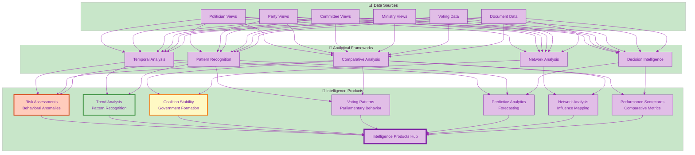

# 🎯 Intelligence Products JSON Schema Specification
## Political Intelligence Analytics and Risk Assessment Format

**Version:** 1.1.0  
**Schema ID**: `intelligence-products`  
**Last Updated**: 2024-12-03

---

## 🔗 Business Context

This JSON schema is the **highest-value** data specification, powering **5 product lines** serving €38M+ Total Addressable Market:

> **v1.1.0 Update**: Added comprehensive JSON export examples for risk assessments (50 rules), coalition alignment matrix, and temporal trend analysis (daily/weekly/monthly/annual) to enable CDN-ready static JSON file generation.

### JSON Export Examples (CDN-Ready)

| Export Type | Example File | Update Frequency | File Size |
|------------|--------------|------------------|-----------|
| **Risk Assessments** | [risk-assessment-example.json](../examples/risk-assessment-example.json) | Daily | ~15 KB |
| **Coalition Alignment** | [coalition-alignment-example.json](../examples/coalition-alignment-example.json) | Daily | ~10 KB |
| **Temporal Trends** | [temporal-trends-example.json](../examples/temporal-trends-example.json) | Daily | ~13 KB |

### Product Integration (Revenue-Ranked)
1. **[Risk Intelligence Feed](../../BUSINESS_PRODUCT_DOCUMENT.md#product-line-3-risk-intelligence-feed)** - Premium risk monitoring (€1.77M/year)
   - Real-time risk assessment with 50 behavioral rules
   - Early warning system for political instability
   - Compliance and governance reporting
   - **Primary Market**: Financial services (€20M+ TAM), Corporate risk (€12M TAM)

2. **[Predictive Analytics](../../BUSINESS_PRODUCT_DOCUMENT.md#product-line-4-predictive-analytics-service)** - Forecasting service (€2.05M/year)
   - Electoral forecasting and seat projections
   - Coalition probability modeling
   - Risk escalation prediction
   - **Primary Market**: Strategic consulting (€30M+ TAM), Corporate strategy (€20M TAM)

3. **[Decision Intelligence](../../BUSINESS_PRODUCT_DOCUMENT.md#product-line-6-decision-intelligence-suite)** - Legislative analytics (€2.09M/year)
   - Decision flow analytics and KPI dashboards
   - Approval rate forecasting
   - Ministry/party effectiveness tracking
   - **Primary Market**: Lobbying & consulting (€15M+ TAM), Corporate affairs (€10M TAM)

4. **[Advanced Analytics Suite](../../BUSINESS_PRODUCT_DOCUMENT.md#product-line-2-advanced-analytics-suite)** - Analytics platform (€855K/year)
   - Political scorecards and benchmarking
   - Trend analysis and visualization
   - Comparative intelligence dashboards
   - **Primary Market**: Corporate affairs (€12M TAM), NGOs (€8M TAM)

5. **[Political Intelligence API](../../BUSINESS_PRODUCT_DOCUMENT.md#product-line-1-political-intelligence-api)** - Core API (€630K/year)
   - Programmatic access to intelligence products
   - Real-time risk alerts via API
   - Analytical insights endpoints
   - **Primary Market**: Political consulting (€15M TAM), Media (€8M TAM)

### Primary Market Segments
> **Note:** Market segments overlap across multiple schemas and products. This schema is the primary data source for:

- **Financial Services** (€20M+ TAM) - Political risk for investments, portfolio management
- **Strategic Consulting** (€30M+ TAM) - Scenario planning, market entry analysis
- **Political Consulting & Lobbying** (€15M+ TAM) - Opposition research, legislative strategy

**Revenue Impact**: Products using this schema as their primary data source generate **€5.91M/year** (Risk Intelligence €1.77M + Predictive Analytics €2.05M + Decision Intelligence €2.09M), representing 65% of total product portfolio revenue (€9.1M). The Advanced Analytics Suite (€855K) and Political Intelligence API (€630K) use this schema alongside politician-schema.md and party-schema.md.

**See Complete Business Strategy**: [BUSINESS_PRODUCT_DOCUMENT.md](../../BUSINESS_PRODUCT_DOCUMENT.md) | [Product-to-Data Mapping](../../BUSINESS_PRODUCT_DOCUMENT.md#appendix-e-product-to-data-mapping)

---

## 🎯 Overview

The Intelligence Products JSON schema provides structured formats for analytical intelligence products including risk assessments, trend analysis, coalition stability monitoring, voting pattern analytics, and predictive intelligence derived from the CIA platform's analytical frameworks.

### Intelligence Products Categories

1. **Risk Assessments** - Behavioral anomaly detection and risk scoring
2. **Trend Analysis** - Temporal pattern recognition and momentum tracking
3. **Coalition Stability** - Government formation and stability analytics
4. **Voting Patterns** - Parliamentary voting behavior analysis
5. **Predictive Analytics** - Election forecasting and policy impact prediction
6. **Network Analysis** - Influence mapping and power structure visualization
7. **Performance Scorecards** - Comparative politician and party metrics

**Election Cycle Analysis Views (v1.59-v1.60)**:
- `view_riksdagen_election_proximity_trends` - Quarterly activity tracking relative to election dates with phase classification (58 columns)
- `view_riksdagen_election_year_behavioral_patterns` - Election year specific behavioral patterns and anomalies
- `view_riksdagen_pre_election_quarterly_activity` - Q4 pre-election activity surge analysis
- Supporting views: `view_election_cycle_temporal_trends`, `view_riksdagen_election_year_anomalies`, `view_riksdagen_election_year_vs_midterm`, `view_riksdagen_q4_election_year_comparison`, `view_election_cycle_comparative_analysis`, `view_election_cycle_network_analysis`, `view_election_cycle_predictive_intelligence`

See [Election Cycle Analysis Visualization](../visualizations/election-cycle-analysis.md) for detailed implementation guide.

---

## 📊 Schema Architecture



---

## 📝 Product 1: Risk Assessments

### Schema Structure

```json
{
  "metadata": {
    "version": "1.0.0",
    "generated": "2024-11-24T02:23:58Z",
    "schema": "risk-assessment",
    "productType": "intelligence",
    "updateFrequency": "daily",
    "confidenceLevel": 0.85
  },
  "summary": {
    "totalEntities": 349,
    "highRisk": 12,
    "moderateRisk": 45,
    "lowRisk": 292,
    "criticalAlerts": 3
  },
  "data": [
    {
      "entityId": "0123456789",
      "entityType": "politician",
      "entityName": "Erik Eriksson",
      "riskProfile": {
        "overallScore": 72.5,
        "level": "high",
        "trend": "increasing",
        "lastUpdated": "2024-11-24T02:23:58Z"
      },
      "riskFactors": [
        {
          "category": "attendance",
          "factor": "excessive-absence",
          "severity": 45,
          "level": "major",
          "description": "Attendance dropped from 92% to 67% in last 6 months",
          "rule": "RULE-POL-002",
          "detected": "2024-11-15T10:23:00Z",
          "trend": "worsening",
          "evidence": {
            "previousAttendance": 92.0,
            "currentAttendance": 67.0,
            "absenceDays": 45,
            "period": "6 months"
          }
        },
        {
          "category": "ethics",
          "factor": "investigation-pending",
          "severity": 25,
          "level": "moderate",
          "description": "Subject of ongoing ethics investigation",
          "rule": "RULE-POL-012",
          "detected": "2024-11-10T14:30:00Z",
          "status": "active",
          "details": {
            "investigationType": "conflict-of-interest",
            "agency": "Riksdag Ethics Committee",
            "publiclyDisclosed": true
          }
        }
      ],
      "timeline": [
        {
          "date": "2024-11-15",
          "event": "Attendance threshold breached",
          "riskScore": 72.5,
          "change": +15.2
        },
        {
          "date": "2024-10-01",
          "event": "Ethics investigation initiated",
          "riskScore": 57.3,
          "change": +12.0
        }
      ],
      "recommendations": [
        "Monitor attendance patterns closely",
        "Track ethics investigation developments",
        "Compare with constituency expectations"
      ],
      "predictions": {
        "nextElection": {
          "reelectionProbability": 0.45,
          "confidenceInterval": [0.32, 0.58]
        },
        "partyAction": {
          "disciplinaryAction": 0.68,
          "replacementProbability": 0.32
        }
      }
    }
  ]
}
```

---

## 📝 Product 2: Trend Analysis

### Schema Structure

```json
{
  "metadata": {
    "version": "1.0.0",
    "generated": "2024-11-24T02:23:58Z",
    "schema": "trend-analysis",
    "productType": "intelligence",
    "timePeriod": "30-days",
    "dataPoints": 30
  },
  "summary": {
    "majorTrends": 5,
    "emergingIssues": 8,
    "shiftingAlignments": 3,
    "significantChanges": 12
  },
  "data": [
    {
      "trendId": "TREND-2024-023",
      "category": "electoral-support",
      "title": "Social Democrats losing youth vote",
      "description": "Electoral support among 18-29 age group declining significantly for Social Democrats",
      "significance": "high",
      "confidence": 0.82,
      "detected": "2024-11-01T00:00:00Z",
      "direction": "declining",
      "magnitude": -5.8,
      "velocity": "accelerating",
      "affected": {
        "parties": ["S"],
        "demographics": ["18-29"],
        "regions": ["Stockholm", "Göteborg", "Malmö"]
      },
      "dataPoints": [
        {
          "date": "2024-10-24",
          "value": 22.3,
          "sample": 1200
        },
        {
          "date": "2024-09-24",
          "value": 24.8,
          "sample": 1150
        },
        {
          "date": "2024-08-24",
          "value": 26.5,
          "sample": 1180
        }
      ],
      "analysis": {
        "rootCauses": [
          "Housing crisis resonating with young voters",
          "Environment Party gaining youth support",
          "Social media campaign effectiveness"
        ],
        "implications": [
          "Future electoral challenges for S",
          "Opportunity for MP and V",
          "Policy shift pressure on S leadership"
        ],
        "projections": {
          "nextElection": {
            "youthVoteShare": 19.5,
            "confidenceInterval": [16.2, 22.8]
          }
        }
      },
      "relatedTrends": ["TREND-2024-015", "TREND-2024-019"]
    }
  ]
}
```

---

## 📝 Product 3: Coalition Stability

### Schema Structure

```json
{
  "metadata": {
    "version": "1.0.0",
    "generated": "2024-11-24T02:23:58Z",
    "schema": "coalition-stability",
    "productType": "intelligence",
    "government": "Tidö Coalition",
    "formed": "2022-10-18"
  },
  "summary": {
    "overallStability": 68.5,
    "trend": "declining",
    "riskLevel": "moderate",
    "daysInPower": 768,
    "confidenceVotes": 23,
    "defeatedVotes": 8
  },
  "coalition": {
    "parties": [
      {
        "code": "M",
        "name": "Moderaterna",
        "role": "leader",
        "seats": 68,
        "ministers": 7,
        "stabilityScore": 82.3,
        "commitment": "high",
        "tensions": [
          {
            "issue": "immigration-policy",
            "severity": "low",
            "withParty": "L"
          }
        ]
      },
      {
        "code": "KD",
        "name": "Kristdemokraterna",
        "role": "partner",
        "seats": 19,
        "ministers": 2,
        "stabilityScore": 78.9,
        "commitment": "high",
        "tensions": []
      }
    ],
    "support": [
      {
        "code": "SD",
        "name": "Sverigedemokraterna",
        "seats": 73,
        "supportType": "confidence-and-supply",
        "stabilityScore": 72.1,
        "reliability": "moderate",
        "demands": [
          "Immigration policy influence",
          "Justice ministry consultation"
        ]
      }
    ],
    "totalSeats": 176,
    "neededForMajority": 175,
    "margin": 1
  },
  "stability": {
    "indicators": [
      {
        "metric": "voting-cohesion",
        "value": 94.3,
        "threshold": 90.0,
        "status": "healthy"
      },
      {
        "metric": "policy-agreement",
        "value": 78.5,
        "threshold": 75.0,
        "status": "healthy"
      },
      {
        "metric": "public-support",
        "value": 48.2,
        "threshold": 50.0,
        "status": "warning"
      },
      {
        "metric": "internal-tensions",
        "value": 32.1,
        "threshold": 40.0,
        "status": "moderate"
      }
    ],
    "riskFactors": [
      {
        "factor": "narrow-majority",
        "severity": 25,
        "description": "Only 1 seat majority, vulnerable to defections"
      },
      {
        "factor": "support-party-demands",
        "severity": 18,
        "description": "SD making increasing policy demands"
      },
      {
        "factor": "declining-polls",
        "severity": 15,
        "description": "Coalition polling below 50%"
      }
    ],
    "strengths": [
      "High voting cohesion",
      "Clear policy agreements",
      "Experienced leadership"
    ]
  },
  "predictions": {
    "survivalProbability": {
      "6months": 0.92,
      "12months": 0.78,
      "untilElection": 0.65
    },
    "alternativeScenarios": [
      {
        "scenario": "current-coalition-continues",
        "probability": 0.65,
        "conditions": ["Maintain SD support", "No major scandals"]
      },
      {
        "scenario": "minority-government",
        "probability": 0.20,
        "trigger": "SD withdraws support"
      },
      {
        "scenario": "early-election",
        "probability": 0.15,
        "trigger": "Confidence vote failure"
      }
    ]
  }
}
```

---

## 📝 Product 4: Voting Patterns

### Schema Structure

```json
{
  "metadata": {
    "version": "1.0.0",
    "generated": "2024-11-24T02:23:58Z",
    "schema": "voting-patterns",
    "productType": "intelligence",
    "period": "2024-Q3"
  },
  "summary": {
    "totalVotes": 456,
    "parties": 8,
    "topIssues": ["budget", "immigration", "energy"],
    "coalitionCohesion": 94.3,
    "crossPartyVotes": 23
  },
  "data": [
    {
      "patternId": "VOTE-PATTERN-023",
      "type": "party-loyalty",
      "title": "High party discipline in budget votes",
      "description": "All parties showing increased discipline in budget-related votes",
      "confidence": 0.91,
      "votes": 67,
      "parties": {
        "S": {
          "loyalty": 98.5,
          "rebellions": 1,
          "trend": "increasing"
        },
        "M": {
          "loyalty": 97.8,
          "rebellions": 2,
          "trend": "stable"
        }
      },
      "alignment": {
        "coalitionVsOpposition": 0.95,
        "leftVsRight": 0.89,
        "crossPartyConsensus": 0.12
      },
      "keyVotes": [
        {
          "voteId": "H901234",
          "date": "2024-11-15",
          "topic": "Budget 2025",
          "result": "passed",
          "margin": 12,
          "breakdown": {
            "yes": 181,
            "no": 169,
            "abstain": 0,
            "absent": 0
          },
          "significance": "high"
        }
      ]
    }
  ]
}
```

---

## 📝 Product 5: Predictive Analytics

### Schema Structure

```json
{
  "metadata": {
    "version": "1.0.0",
    "generated": "2024-11-24T02:23:58Z",
    "schema": "predictive-analytics",
    "productType": "intelligence",
    "horizon": "2026-election"
  },
  "summary": {
    "nextElection": "2026-09-13",
    "daysUntil": 658,
    "majorPredictions": 8,
    "highConfidence": 5,
    "modelAccuracy": 0.82
  },
  "predictions": [
    {
      "predictionId": "PRED-2024-012",
      "type": "electoral-outcome",
      "title": "2026 Riksdag Election Forecast",
      "generated": "2024-11-24T02:23:58Z",
      "confidence": 0.78,
      "timeHorizon": "22-months",
      "forecast": {
        "government": {
          "coalition": ["M", "KD", "SD"],
          "seats": 181,
          "probability": 0.62
        },
        "parties": [
          {
            "code": "S",
            "predictedSupport": 27.8,
            "predictedSeats": 97,
            "confidenceInterval": {
              "support": [24.5, 31.1],
              "seats": [86, 108]
            },
            "change": -2.5
          },
          {
            "code": "M",
            "predictedSupport": 21.2,
            "predictedSeats": 74,
            "confidenceInterval": {
              "support": [18.9, 23.5],
              "seats": [66, 82]
            },
            "change": +1.7
          }
        ]
      },
      "methodology": {
        "model": "ensemble-forecast",
        "inputs": [
          "Current polling trends",
          "Historical patterns",
          "Economic indicators",
          "Government performance metrics"
        ],
        "assumptions": [
          "No major political crisis",
          "Economic growth 2-3%",
          "Current coalition maintains"
        ]
      },
      "alternatives": [
        {
          "scenario": "red-green-coalition",
          "probability": 0.28,
          "parties": ["S", "V", "MP", "C"],
          "seats": 172
        },
        {
          "scenario": "hung-parliament",
          "probability": 0.10,
          "description": "No clear majority coalition possible"
        }
      ]
    }
  ]
}
```

---

## 🎨 Visualization Metadata

Each intelligence product includes visualization hints:

```json
{
  "visualization": {
    "recommendedCharts": ["line", "bar", "heatmap"],
    "colorScheme": "risk-gradient",
    "dataFormat": "time-series",
    "interactive": true,
    "exports": ["png", "svg", "pdf"]
  }
}
```

---

## 💻 Usage Examples

### Fetch Risk Dashboard

```javascript
async function getRiskDashboard() {
  const response = await fetch('/intelligence/risk-assessments.json');
  const data = await response.json();
  
  const highRisk = data.data.filter(e => e.riskProfile.level === 'high');
  
  return {
    total: data.summary.totalEntities,
    highRisk: highRisk.length,
    criticalAlerts: data.summary.criticalAlerts,
    entities: highRisk.map(e => ({
      name: e.entityName,
      score: e.riskProfile.overallScore,
      factors: e.riskFactors.length
    }))
  };
}
```

### Monitor Coalition Stability

```javascript
async function monitorCoalition() {
  const response = await fetch('/intelligence/coalition-stability.json');
  const data = await response.json();
  
  return {
    stability: data.summary.overallStability,
    trend: data.summary.trend,
    riskLevel: data.summary.riskLevel,
    survivalProbability: data.predictions.survivalProbability,
    parties: data.coalition.parties.map(p => ({
      name: p.name,
      stability: p.stabilityScore,
      tensions: p.tensions.length
    }))
  };
}
```

---

## 📊 Intelligence Product Catalog

| Product | Update Frequency | Entities | Confidence | File Size |
|---------|-----------------|----------|------------|-----------|
| Risk Assessments | Daily | All politicians | 85% | ~800 KB |
| Trend Analysis | Daily | Parties, topics | 78% | ~1.2 MB |
| Coalition Stability | Daily | Government | 82% | ~400 KB |
| Voting Patterns | Weekly | Parties, committees | 88% | ~600 KB |
| Predictive Analytics | Weekly | Elections | 76% | ~500 KB |
| Network Analysis | Weekly | All entities | 71% | ~900 KB |
| Performance Scorecards | Daily | Politicians, parties | 91% | ~1.5 MB |

---

## ✅ Validation & Quality Control

### Data Quality Metrics
- **Completeness**: >95% of fields populated
- **Accuracy**: Cross-validated with source data
- **Timeliness**: Updated within 24 hours
- **Consistency**: Schema validation on all exports
- **Confidence**: Explicit confidence levels for predictions

---

## 📁 CDN File Structure

The intelligence products are exported to static JSON files following this structure:

```
json-export/
├── v1.1.0/
│   ├── intelligence/
│   │   ├── risk-assessments.json          # 50-rule risk assessment catalog
│   │   ├── coalition-alignment-matrix.json # Party voting alignment matrix
│   │   ├── temporal-trends.json           # Multi-timeframe trend analysis
│   │   ├── voting-patterns.json           # Parliamentary voting behavior
│   │   ├── predictive-analytics.json      # Election forecasts
│   │   └── coalition-stability.json       # Government stability metrics
│   └── metadata.json
└── latest/                                 # Symlink to current version
```

### CDN URLs

| Product | URL Pattern | Update Frequency |
|---------|------------|------------------|
| Risk Assessments | `/v1.1.0/intelligence/risk-assessments.json` | Daily |
| Coalition Alignment | `/v1.1.0/intelligence/coalition-alignment-matrix.json` | Daily |
| Temporal Trends | `/v1.1.0/intelligence/temporal-trends.json` | Daily |
| Voting Patterns | `/v1.1.0/intelligence/voting-patterns.json` | Weekly |
| Predictive Analytics | `/v1.1.0/intelligence/predictive-analytics.json` | Weekly |

---

## 📋 Risk Rules Complete Catalog (50 Rules)

### Rule Categories

| Category | Count | Severity Distribution | Primary Data Source |
|----------|-------|----------------------|---------------------|
| **Politician** | 24 | 8 MINOR, 8 MAJOR, 8 CRITICAL | view_riksdagen_politician, view_rule_violation |
| **Party** | 10 | 3 MINOR, 4 MAJOR, 3 CRITICAL | view_riksdagen_party_summary |
| **Committee** | 4 | 2 MINOR, 2 MAJOR | view_riksdagen_committee |
| **Ministry** | 4 | 1 MINOR, 2 MAJOR, 1 CRITICAL | view_ministry_effectiveness_trends |
| **Decision** | 5 | 1 MINOR, 3 MAJOR, 1 CRITICAL | view_party_decision_flow |
| **Other** | 3 | 1 MINOR, 1 MAJOR, 1 CRITICAL | Application monitoring |

### Severity Classification

- 🟡 **MINOR** (Salience 10-49): Early indicators, trend monitoring, preventive intelligence
- 🟠 **MAJOR** (Salience 50-99): Established patterns, accountability concerns, tactical intelligence  
- 🔴 **CRITICAL** (Salience 100+): Severe risks, democratic accountability failure, strategic intelligence

---

**Schema Version**: 1.1.0  
**Last Updated**: 2024-12-03  
**Maintained By**: Citizen Intelligence Agency Development Team
