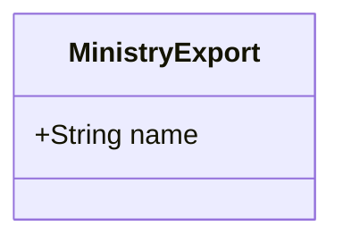

# Ministry Schema (Data-Validated)

**Status:** ✅ Validated against actual sample data  
**Last Updated:** 2026-04-05  
**Fields:** 1 implemented (only fields present in sample data)

## Overview

This schema reflects **only fields that exist in actual sample data**. 
The 28 mismatched fields have been categorized by implementation status.

**Validation Results:**
- Original fields defined: 29
- Fields validated in data: 1
- Fields not in data: 28 (8 structural, 11 computable, 9 planned)

## Data Model

```mermaid
classDiagram
    class MinistryExport {
        +String name
    }
```

## Field Descriptions

- **name** (`String`): Field found in sample data

## Data Sources

This schema is validated against the following data sources:

- `view_ministry_effectiveness_trends_sample.csv`
- `view_ministry_decision_impact_sample.csv`

## Migration Notes

## Migration Notes

**Field Classification (28 fields not in data):**

### ❌ Structural Fields (JSON grouping objects)
- `attributes`, `labels`, `relationships`, `intelligence`, `personnel`
- `performance`, `decisions`, `policy`

### 🔀 Computable Fields (derivable from existing DB columns)
- `id` — from `name_id` or `ministry_code`
- `code` — from `org_code` or `ministry_code`
- `ministers` — count from `view_riksdagen_goverment_role_member` where role = minister
- `stateSecretaries` — count where role = state secretary
- `civilServants` — from `current_member_size`
- `performanceScore` — from `productivity_level`
- `effectiveness` — from `effectiveness_assessment`
- `decisionsImplemented` — from `approved_proposals`
- `efficiency` — from `approval_rate`
- `executionRate` — from `approval_rate`
- `trend` — from `document_trend` or `legislative_trend`

### 🔄 Planned Fields (require new data sources)
- `nameEn` — English translation not in database
- `portfolio` — ministry portfolio classification
- `established` — establishment date
- `headquarters` — physical location
- `allocation` — budget allocation data not in DB
- `spent` — spending data not in DB
- `budget` — budget data not available
- `publicSatisfaction` — external survey data
- `predictions` — predictive model not yet implemented

**Recommendation:** See `FIELD_MAPPING.md` for implementation priority and `SCHEMA_VALIDATION_REPORT.md` for remediation plan.
