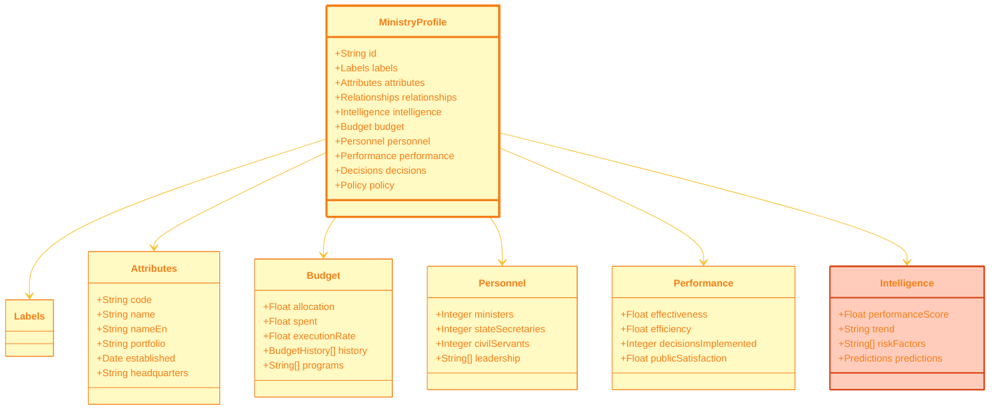

# 🏢 Ministry JSON Schema Specification
## Government Ministry Comprehensive Profile Format

**Version:** 1.0.0  
**Schema ID**: `ministry-profile`  
**Last Updated**: 2024-11-24

---

## 🎯 Overview

The Ministry JSON schema provides comprehensive representation of Swedish government ministries, including organizational structure, budget allocation, policy effectiveness, personnel, decision-making patterns, and performance analytics.

### Data Sources

This schema aggregates data from multiple database views:
- `view_riksdagen_government_role_member_summary` - Ministry composition
- `view_ministry_decision_impact` - Policy effectiveness
- Ministry performance metrics
- Budget allocation data

---

## 📊 Schema Diagram



---

## 📝 Complete JSON Example

```json
{
  "metadata": {
    "version": "1.0.0",
    "generated": "2024-11-24T02:23:58Z",
    "source": "Citizen Intelligence Agency",
    "schema": "ministry-profile",
    "recordCount": 11
  },
  "data": [
    {
      "id": "FI",
      "labels": {
        "category": "cabinet-ministry",
        "subcategories": [
          "economic-policy",
          "coalition-led",
          "large-budget"
        ],
        "descriptions": {
          "short": "Finance Ministry manages national budget and economic policy",
          "long": "The Ministry of Finance is responsible for government finances, economic policy, taxation, and financial markets. Led by the Minister for Finance, it prepares the state budget, coordinates economic policy, and oversees financial regulation.",
          "detailed": "The Ministry of Finance (Finansdepartementet) is one of Sweden's most influential government departments, responsible for the overall direction of economic and fiscal policy. Key responsibilities include preparation and execution of the state budget, coordination of economic policy across government, taxation policy, financial market regulation, and government debt management. The ministry plays central role in budget negotiations with Riksdag and coordinates Sweden's participation in EU economic governance. Current priorities include fiscal sustainability, climate transition financing, digitalization of tax administration, and economic recovery post-pandemic."
        },
        "intelligenceTags": [
          "high-influence",
          "coalition-critical",
          "economic-expertise",
          "eu-coordination",
          "reform-focused"
        ]
      },
      "attributes": {
        "code": "FI",
        "name": "Finansdepartementet",
        "nameEn": "Ministry of Finance",
        "portfolio": "Finance and Economic Policy",
        "established": "1840-01-01",
        "headquarters": "Stockholm",
        "address": "Drottninggatan 21, 103 33 Stockholm",
        "website": "https://www.regeringen.se/regeringens-politik/finansdepartementet/",
        "minister": {
          "personId": "0123456789",
          "name": "Elisabeth Svantesson",
          "party": "M",
          "since": "2022-10-18",
          "title": "Minister for Finance"
        },
        "stateSecretaries": [
          {
            "name": "Henrik Persson Ekdahl",
            "portfolio": "Budget coordination",
            "since": "2022-10-18"
          }
        ]
      },
      "relationships": {
        "coalition": {
          "controllingParty": "M",
          "coalitionPartners": ["KD", "SD", "L"]
        },
        "agencies": [
          "Swedish Tax Agency",
          "Swedish National Debt Office",
          "Swedish Financial Supervisory Authority"
        ],
        "relatedMinistries": ["UD", "N", "A"]
      },
      "intelligence": {
        "performanceScore": 82.3,
        "effectivenessRating": "high",
        "trend": "stable",
        "riskFactors": [
          {
            "factor": "budget-complexity",
            "severity": 15,
            "description": "Challenging coalition budget negotiations"
          }
        ],
        "strengths": [
          "Strong technical expertise",
          "Clear policy direction",
          "Effective EU coordination"
        ],
        "weaknesses": [
          "Limited parliamentary majority",
          "Coalition policy tensions"
        ],
        "predictions": {
          "budgetSuccessRate": 0.78,
          "reformImplementation": 0.72,
          "politicalStability": 0.85
        }
      },
      "budget": {
        "allocation": 185000000000,
        "currency": "SEK",
        "year": 2025,
        "spent": 92500000000,
        "executionRate": 50.0,
        "percentOfTotal": 38.5,
        "history": [
          {
            "year": 2024,
            "allocation": 178000000000,
            "executionRate": 98.2
          },
          {
            "year": 2023,
            "allocation": 172000000000,
            "executionRate": 97.8
          }
        ],
        "majorPrograms": [
          {
            "name": "Tax Administration",
            "allocation": 45000000000,
            "percent": 24.3
          },
          {
            "name": "Debt Service",
            "allocation": 38000000000,
            "percent": 20.5
          },
          {
            "name": "Financial Regulation",
            "allocation": 12000000000,
            "percent": 6.5
          }
        ],
        "trend": {
          "direction": "increasing",
          "changePercent": 3.9
        }
      },
      "personnel": {
        "ministers": 1,
        "stateSecretaries": 2,
        "politicalAdvisors": 8,
        "civilServants": 485,
        "total": 496,
        "leadership": [
          {
            "name": "Elisabeth Svantesson",
            "role": "Minister for Finance",
            "party": "M"
          }
        ],
        "departments": [
          {
            "name": "Budget Department",
            "head": "Anders Borg",
            "staff": 125
          },
          {
            "name": "Tax Department",
            "head": "Maria Svensson",
            "staff": 98
          }
        ]
      },
      "performance": {
        "effectiveness": 82.3,
        "efficiency": 78.9,
        "decisionsImplemented": 87,
        "decisionsTotal": 102,
        "implementationRate": 85.3,
        "publicSatisfaction": 68.5,
        "expertRating": 8.2,
        "metrics": {
          "budgetAccuracy": 96.8,
          "timelyDelivery": 89.2,
          "stakeholderSatisfaction": 75.4,
          "transparencyScore": 82.1
        },
        "reforms": [
          {
            "name": "Tax digitalization",
            "status": "in-progress",
            "completion": 65,
            "impact": "high"
          }
        ]
      },
      "decisions": {
        "totalDecisions": 342,
        "byType": {
          "regulation": 89,
          "directive": 123,
          "appointment": 45,
          "budget": 85
        },
        "implementationSuccess": 85.3,
        "averageTimeToImplement": 4.5,
        "recentDecisions": [
          {
            "id": "FI-2024-234",
            "date": "2024-11-20",
            "topic": "Tax reform implementation",
            "status": "implementing",
            "impact": "high"
          }
        ]
      },
      "policy": {
        "keyPolicies": [
          {
            "area": "fiscal-policy",
            "priority": "high",
            "status": "active",
            "description": "Balanced budget with modest surplus target"
          },
          {
            "area": "tax-reform",
            "priority": "high",
            "status": "implementing",
            "description": "Simplification of tax system"
          }
        ],
        "reforms": {
          "planned": 8,
          "inProgress": 5,
          "completed": 12
        }
      }
    }
  ]
}
```

---

## 🎨 Ministry Codes

| Code | Swedish Name | English Name |
|------|--------------|--------------|
| FI | Finansdepartementet | Ministry of Finance |
| UD | Utrikesdepartementet | Ministry for Foreign Affairs |
| JU | Justitiedepartementet | Ministry of Justice |
| S | Socialdepartementet | Ministry of Health and Social Affairs |
| A | Arbetsmarknadsdepartementet | Ministry of Employment |
| N | Näringsdepartementet | Ministry of Enterprise and Innovation |
| U | Utbildningsdepartementet | Ministry of Education |
| M | Miljödepartementet | Ministry of Climate and Enterprise |
| I | Infrastrukturdepartementet | Ministry of Infrastructure |
| K | Kulturdepartementet | Ministry of Culture |
| FB | Försvarsdepartementet | Ministry of Defence |

---

## 💻 Usage Example

```javascript
async function getMinistryPerformance(ministryId) {
  const response = await fetch(`/ministries/profiles/${ministryId}.json`);
  const data = await response.json();
  const ministry = data.data[0];
  
  return {
    name: ministry.attributes.nameEn,
    budget: ministry.budget.allocation,
    effectiveness: ministry.performance.effectiveness,
    implementationRate: ministry.performance.implementationRate,
    trend: ministry.intelligence.trend
  };
}
```

---

**Schema Version**: 1.0.0  
**Last Updated**: 2024-11-24  
**Maintained By**: Citizen Intelligence Agency Development Team
