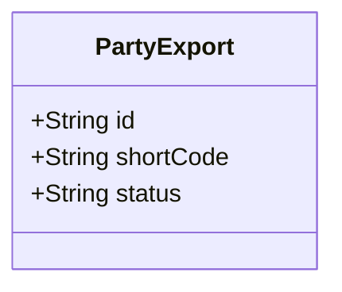

# Party Schema (Data-Validated)

**Status:** ✅ Validated against actual sample data  
**Last Updated:** 2026-04-05  
**Fields:** 4 implemented (only fields present in sample data)

## Overview

This schema reflects **only fields that exist in actual sample data**. 
The 38 mismatched fields have been categorized by implementation status.

**Validation Results:**
- Original fields defined: 42
- Fields validated in data: 4
- Fields not in data: 38 (14 structural, 13 computable, 11 planned)

## Data Model

```mermaid
classDiagram
    class PartyExport {
        +String id
        +String shortCode
        +String status
    }
```

## Field Descriptions

- **id** (`String`): Field found in sample data
- **shortCode** (`String`): Field found in sample data
- **status** (`String`): Field found in sample data

## Data Sources

This schema is validated against the following data sources:

- `view_riksdagen_party_ballot_support_annual_summary_sample.csv`
- `view_riksdagen_party_sample.csv`
- `view_riksdagen_party_decision_flow_sample.csv`
- `view_riksdagen_party_member_sample.csv`
- `view_riksdagen_party_document_daily_summary_sample.csv`
- `view_riksdagen_party_summary_sample.csv`
- `view_riksdagen_party_role_member_sample.csv`
- `view_riksdagen_party_momentum_analysis_sample.csv`
- `view_riksdagen_party_coalation_against_annual_summary_sample.csv`
- `view_riksdagen_party_signatures_document_summary_sample.csv`
- `view_riksdagen_party_document_summary_sample.csv`

## Migration Notes

## Migration Notes

**Field Classification (38 fields not in data):**

### ❌ Structural Fields (JSON grouping objects)
- `attributes`, `labels`, `relationships`, `intelligence`, `electoral`, `voting`
- `documents`, `members`, `coalition`, `policy`, `parliamentary`, `predictions`
- `descriptions`, `category`

### 🔀 Computable Fields (derivable from existing DB columns)
- `fullName` — from `party_name` column
- `totalMembers` — from `total_active` in `view_riksdagen_party_summary`
- `currentSupport` — from `participation_rate`
- `seats` — from `seat_count_proxy`
- `votePercentage` — from `win_rate`
- `cohesionScore` — from `avg_collaboration_pct`
- `activityRate` — from `activity_level`
- `disciplineRate` — inverse of `avg_rebel_rate`
- `stability` — from `stability_classification`
- `trend` — from `trend_direction`
- `legislativeSuccess` — from `legislative_effectiveness_score`
- `alignment` — from `alignment_rate`
- `productivity` — from `performance_tier`

### 🔄 Planned Fields (require new data sources)
- `foundedYear` — external data not in database
- `ideology` — external political classification
- `spectrum` — political spectrum positioning
- `color` — party official color
- `websiteUrl` — party website URL
- `logoUrl` — party logo URL
- `nameEn` — English translation
- `strengthScore` — composite metric not yet defined
- `riskScore` — party-level risk assessment
- `committeeChairs` — derivable but needs specific query
- `ministries` — government participation data

**Recommendation:** See `FIELD_MAPPING.md` for implementation priority and `SCHEMA_VALIDATION_REPORT.md` for remediation plan.
