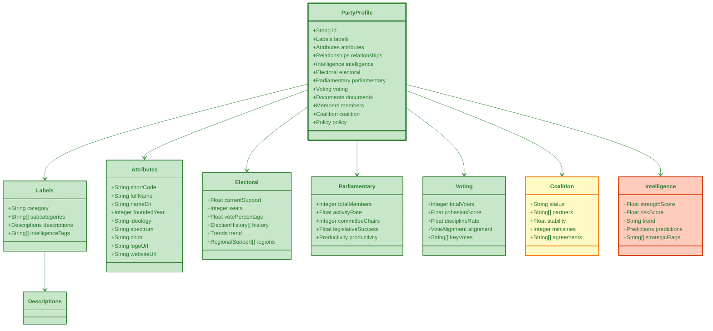

# 🎭 Party JSON Schema Specification
## Political Party Comprehensive Profile Format

**Version:** 1.0.0  
**Schema ID**: `party-profile`  
**Last Updated**: 2024-11-24

---

## 🔗 Business Context

This JSON schema powers **4 product lines** serving €32M Total Addressable Market:

### Product Integration
- **[Political Intelligence API](../../BUSINESS_PRODUCT_DOCUMENT.md#-product-line-1-political-intelligence-api)** - Core API product (€630K/year)
  - Party performance metrics
  - Voting pattern analysis
  - Coalition monitoring
- **[Advanced Analytics Suite](../../BUSINESS_PRODUCT_DOCUMENT.md#-product-line-2-advanced-analytics-suite)** - Analytics platform (€855K/year)
  - Party performance dashboards
  - Coalition stability monitoring
  - Comparative party analysis
- **[Predictive Analytics](../../BUSINESS_PRODUCT_DOCUMENT.md#-product-line-4-predictive-analytics-service)** - Forecasting service (€2.05M/year)
  - Electoral forecasting and seat projections
  - Coalition formation probability
  - Government stability predictions
- **[Decision Intelligence](../../BUSINESS_PRODUCT_DOCUMENT.md#-product-line-6-decision-intelligence-suite)** - Legislative analytics (€2.09M/year)
  - Party decision effectiveness tracking
  - Approval rate monitoring
  - Coalition alignment analysis

### Market Segments
- **Political Consulting** (€15M TAM) - Campaign strategy, coalition analysis
- **Corporate Affairs** (€12M TAM) - Government relations, regulatory monitoring
- **Strategic Consulting** (€30M+ TAM) - Political scenario planning, market entry risk
- **Media & Journalism** (€8M TAM) - Political analysis, investigative reporting

**See Complete Business Strategy**: [BUSINESS_PRODUCT_DOCUMENT.md](../../BUSINESS_PRODUCT_DOCUMENT.md) | [Product-to-Data Mapping](../../BUSINESS_PRODUCT_DOCUMENT.md#appendix-e-product-to-data-mapping)

---

## 🎯 Overview

The Party JSON schema provides comprehensive representation of Swedish political parties, including electoral performance, parliamentary activity, coalition dynamics, voting cohesion, policy positions, and intelligence analytics.

### Data Sources

This schema aggregates data from multiple database views:
- `view_riksdagen_party_summary` - Core party data and activity
- `view_riksdagen_party_document_summary` - Legislative productivity
- `view_riksdagen_party_vote_summary` - Voting patterns
- `view_riksdagen_party_ballot_support_summary` - Electoral support
- `view_riksdagen_party_decision_flow` - Decision-making effectiveness

---

## 📊 Schema Diagram



---

## 📝 Complete JSON Schema

### Root Structure

```json
{
  "metadata": {
    "version": "1.0.0",
    "generated": "2024-11-24T02:23:58Z",
    "source": "Citizen Intelligence Agency",
    "schema": "party-profile",
    "recordCount": 8,
    "dataDate": "2024-11-23",
    "parliamentaryParties": 8,
    "extraParliamentaryParties": 0
  },
  "data": [
    {
      "id": "string",
      "labels": { },
      "attributes": { },
      "relationships": { },
      "intelligence": { },
      "electoral": { },
      "parliamentary": { },
      "voting": { },
      "documents": { },
      "members": { },
      "coalition": { },
      "policy": { }
    }
  ]
}
```

---

## 🏷️ Labels Section

```json
{
  "labels": {
    "category": "government-coalition",
    "subcategories": [
      "center-left",
      "social-democratic",
      "major-party",
      "coalition-partner"
    ],
    "descriptions": {
      "short": "Sweden's largest party, Social Democrats lead center-left coalition",
      "long": "The Social Democratic Party (Socialdemokraterna) is Sweden's historically dominant political force, currently leading a minority government in coalition with the Green Party and Centre Party. Founded in 1889, the party advocates for social welfare, progressive taxation, and regulated market economy.",
      "detailed": "The Social Democratic Workers' Party of Sweden (Socialdemokraterna) has shaped modern Swedish society through the creation of the comprehensive welfare state, known as the 'Swedish Model.' With roots in the labor movement, the party has been Sweden's largest for over a century, governing for most of the 20th century. Current policy priorities include climate transition, welfare system protection, labor market regulation, and Nordic cooperation. The party maintains strong ties with trade unions and represents urban workers and public sector employees. Recent electoral challenges include competition from Sweden Democrats on immigration and from Left Party on economic policy. Current government coalition faces minority status requiring cross-aisle negotiations."
    },
    "intelligenceTags": [
      "coalition-leader",
      "stable-support",
      "union-affiliated",
      "center-left-ideology",
      "government-experience",
      "welfare-state-champion"
    ]
  }
}
```

### Category Values

- `government-coalition` - Currently in government
- `opposition` - Not in government
- `parliamentary-party` - Has riksdag seats
- `extra-parliamentary` - No riksdag seats
- `major-party` - Large parliamentary group (>15%)
- `minor-party` - Small parliamentary group (<15%)
- `new-entry` - First term in parliament

---

## 📋 Attributes Section

```json
{
  "attributes": {
    "shortCode": "S",
    "fullName": "Socialdemokraterna",
    "nameEn": "Social Democratic Party",
    "officialName": "Sveriges socialdemokratiska arbetareparti",
    "foundedYear": 1889,
    "ideology": "social-democracy",
    "spectrum": "center-left",
    "position": {
      "economic": -2.5,
      "social": -1.8
    },
    "color": "#E8112d",
    "logoUrl": "https://data.riksdagen.se/partier/s/logo.svg",
    "websiteUrl": "https://www.socialdemokraterna.se",
    "headquarters": "Stockholm",
    "leader": {
      "personId": "0123456789",
      "name": "Magdalena Andersson",
      "since": "2021-11-04",
      "title": "Party Leader"
    },
    "contact": {
      "email": "info@socialdemokraterna.se",
      "phone": "+46 8 700 26 00",
      "address": "Sveavägen 68, Stockholm"
    }
  }
}
```

---

## 🗳️ Electoral Section

```json
{
  "electoral": {
    "currentSupport": 30.3,
    "currentSupportTrend": -2.1,
    "seats": 107,
    "totalSeats": 349,
    "seatPercentage": 30.7,
    "lastElection": {
      "date": "2022-09-11",
      "votePercentage": 30.33,
      "votes": 1935455,
      "seats": 107,
      "result": "government-formation"
    },
    "history": [
      {
        "year": 2022,
        "votePercentage": 30.33,
        "seats": 107,
        "outcome": "government-formation"
      },
      {
        "year": 2018,
        "votePercentage": 28.26,
        "seats": 100,
        "outcome": "government-formation"
      },
      {
        "year": 2014,
        "votePercentage": 31.01,
        "seats": 113,
        "outcome": "government-formation"
      }
    ],
    "trend": {
      "direction": "declining",
      "magnitude": -2.1,
      "since": "2014-09-14",
      "peakYear": 2014,
      "peakPercentage": 31.01
    },
    "regionalSupport": [
      {
        "region": "Stockholm",
        "support": 28.5,
        "seats": 31,
        "strongholds": ["Södermalm", "Kungsholmen"]
      },
      {
        "region": "Västra Götaland",
        "support": 32.1,
        "seats": 38,
        "strongholds": ["Göteborg", "Borås"]
      }
    ],
    "demographics": {
      "strongestAge": "50-64",
      "strongestEducation": "upper-secondary",
      "strongestSector": "public",
      "urbanRural": {
        "urban": 31.2,
        "rural": 29.4
      }
    }
  }
}
```

---

## 🏛️ Parliamentary Section

```json
{
  "parliamentary": {
    "totalMembers": 107,
    "activeMemberCount": 105,
    "averageAttendance": 89.3,
    "committeeChairs": 5,
    "committeeRepresentation": {
      "FiU": 8,
      "UU": 7,
      "SkU": 6
    },
    "legislativeSuccess": {
      "motionsSubmitted": 2847,
      "motionsAdopted": 387,
      "successRate": 13.6,
      "amendmentsSuccess": 24.8
    },
    "productivity": {
      "documentsPerMember": 26.6,
      "questionsPerMember": 12.3,
      "motionsPerMember": 8.9,
      "comparativeRank": 2
    },
    "speakingTime": {
      "totalMinutes": 48573,
      "percentOfTotal": 32.1,
      "averagePerMember": 453.9
    },
    "leadershipPositions": {
      "speaker": false,
      "deputySpeakers": 1,
      "committeeChairs": 5,
      "committeeDeputyChairs": 7
    }
  }
}
```

---

## 🗳️ Voting Section

```json
{
  "voting": {
    "totalVotes": 45821,
    "breakdown": {
      "yes": 28934,
      "no": 14287,
      "abstain": 1823,
      "absent": 777
    },
    "cohesionScore": 96.8,
    "disciplineRate": 94.5,
    "rebellions": 312,
    "rebellionRate": 0.68,
    "alignment": {
      "withCoalition": 98.3,
      "withOpposition": 1.7,
      "crossParty": 45
    },
    "votingPatterns": {
      "economicPolicy": {
        "votes": 8932,
        "cohesion": 98.1,
        "alignment": "progressive"
      },
      "socialPolicy": {
        "votes": 7234,
        "cohesion": 96.4,
        "alignment": "progressive"
      },
      "immigration": {
        "votes": 3421,
        "cohesion": 93.2,
        "alignment": "liberal"
      },
      "foreignPolicy": {
        "votes": 2134,
        "cohesion": 97.8,
        "alignment": "nato-supportive"
      }
    },
    "keyVotes": [
      {
        "id": "H901234",
        "date": "2024-11-15",
        "topic": "Budget 2025",
        "partyPosition": "yes",
        "result": "passed",
        "cohesion": 99.1
      }
    ],
    "comparison": {
      "riksdagAverage": 94.2,
      "cohesionRank": 2,
      "disciplineRank": 3
    }
  }
}
```

---

## 📄 Documents Section

```json
{
  "documents": {
    "totalDocuments": 2847,
    "byType": {
      "motion": 1234,
      "interpellation": 456,
      "writtenQuestion": 892,
      "amendment": 187,
      "report": 78
    },
    "byPolicyArea": {
      "economics": 876,
      "socialPolicy": 654,
      "laborMarket": 432,
      "education": 321,
      "healthcare": 298,
      "environment": 266
    },
    "topAuthors": [
      {
        "personId": "0123456789",
        "name": "Anna Andersson",
        "documentCount": 98
      }
    ],
    "collaboration": {
      "withinParty": 2134,
      "crossParty": 123,
      "coalitionPartners": 234
    },
    "productivity": {
      "docsPerMember": 26.6,
      "riksdagAverage": 22.3,
      "rank": 2
    }
  }
}
```

---

## 👥 Members Section

```json
{
  "members": {
    "total": 107,
    "active": 105,
    "inactive": 2,
    "leadership": [
      {
        "personId": "0123456789",
        "name": "Magdalena Andersson",
        "position": "Party Leader",
        "since": "2021-11-04"
      },
      {
        "personId": "0234567890",
        "name": "Tobias Baudin",
        "position": "Party Secretary",
        "since": "2021-11-04"
      }
    ],
    "demographics": {
      "gender": {
        "female": 54,
        "male": 53,
        "femalePercentage": 50.5
      },
      "averageAge": 48.3,
      "ageDistribution": {
        "under30": 5,
        "30to39": 18,
        "40to49": 32,
        "50to59": 34,
        "over60": 18
      },
      "experience": {
        "firstTerm": 23,
        "secondTerm": 34,
        "thirdTerm": 28,
        "fourthPlus": 22
      }
    },
    "topPerformers": [
      {
        "personId": "0123456789",
        "name": "Anna Andersson",
        "influenceScore": 89.3,
        "specialty": "economics"
      }
    ],
    "riskMembers": [
      {
        "personId": "0345678901",
        "name": "Erik Eriksson",
        "riskScore": 65.2,
        "concerns": ["low-attendance", "ethics-inquiry"]
      }
    ]
  }
}
```

---

## 🤝 Coalition Section

```json
{
  "coalition": {
    "status": "government",
    "role": "leader",
    "since": "2021-11-30",
    "partners": ["MP", "C"],
    "formationType": "minority",
    "stability": 72.5,
    "stabilityTrend": "declining",
    "ministries": {
      "controlled": 9,
      "total": 11,
      "key": ["FI", "UD", "JU", "S", "A"]
    },
    "agreements": [
      {
        "name": "January Agreement",
        "date": "2019-01-03",
        "parties": ["S", "MP", "C", "L"],
        "status": "expired",
        "keyPoints": [
          "Labour market reform",
          "Housing policy",
          "Climate transition"
        ]
      }
    ],
    "supportParties": ["V"],
    "toleranceParties": [],
    "opposition": ["M", "SD", "KD"],
    "parliamentaryMajority": false,
    "seatsInCoalition": 130,
    "seatsNeededForMajority": 175,
    "dependenceOnSupport": "high",
    "coalitionVoting": {
      "cohesion": 94.3,
      "successRate": 78.9,
      "defeatedVotes": 156
    }
  }
}
```

---

## 📋 Policy Section

```json
{
  "policy": {
    "keyPolicies": [
      {
        "area": "welfare",
        "position": "expand",
        "priority": "high",
        "description": "Strengthen welfare state, increase healthcare funding"
      },
      {
        "area": "labor-market",
        "position": "regulation",
        "priority": "high",
        "description": "Protect workers' rights, strengthen unions"
      },
      {
        "area": "taxation",
        "position": "progressive",
        "priority": "medium",
        "description": "Progressive taxation, higher taxes on wealth"
      },
      {
        "area": "climate",
        "position": "ambitious",
        "priority": "high",
        "description": "Net-zero by 2045, renewable energy investment"
      }
    ],
    "positions": {
      "economy": {
        "marketRegulation": "moderate",
        "publicSpending": "high",
        "taxation": "progressive",
        "welfare": "comprehensive"
      },
      "social": {
        "immigration": "moderate",
        "integration": "supportive",
        "lgbtq": "supportive",
        "abortion": "pro-choice"
      },
      "foreign": {
        "eu": "supportive",
        "nato": "member",
        "defense": "increased",
        "development": "high-priority"
      }
    },
    "manifestoHighlights": [
      "Expand publicly funded healthcare",
      "Increase housing construction",
      "Climate transition with jobs guarantee",
      "Strengthen labor protections"
    ]
  }
}
```

---

## 🎯 Intelligence Section

```json
{
  "intelligence": {
    "strengthScore": 78.5,
    "strengthFactors": {
      "electoralSupport": 20.5,
      "parliamentarySize": 22.0,
      "coalitionLeadership": 15.0,
      "organizationalStrength": 12.5,
      "financialResources": 8.5
    },
    "riskScore": 32.8,
    "riskLevel": "moderate",
    "riskFactors": [
      {
        "factor": "declining-support",
        "severity": 15,
        "description": "Electoral support down 2.1% from peak"
      },
      {
        "factor": "coalition-tension",
        "severity": 10,
        "description": "Internal disagreements with Centre Party"
      },
      {
        "factor": "competition-left",
        "severity": 7.8,
        "description": "Left Party competing for voters"
      }
    ],
    "trend": {
      "overall": "declining",
      "electoral": "declining",
      "parliamentary": "stable",
      "influence": "declining",
      "confidence": 0.78
    },
    "predictions": {
      "nextElection": {
        "predictedSupport": 28.5,
        "predictedSeats": 99,
        "confidenceInterval": [26.2, 30.8],
        "confidence": 0.85
      },
      "governmentContinuity": {
        "probability": 0.42,
        "alternativeCoalition": "opposition-majority",
        "keyFactors": ["voter-migration", "coalition-stability"]
      },
      "leadershipChange": {
        "probability": 0.15,
        "timeframe": "2-4 years",
        "successors": ["Anna Andersson", "Per Bolund"]
      }
    },
    "strategicFlags": [
      "coalition-leader",
      "declining-support",
      "union-dependency",
      "regional-weakness-stockholm",
      "demographic-challenge-youth",
      "policy-crowding-left"
    ],
    "competitivePosition": {
      "mainCompetitors": ["M", "SD", "V"],
      "marketShare": 30.3,
      "differentiators": ["welfare-expertise", "government-experience"],
      "vulnerabilities": ["immigration-policy", "crime-policy"]
    }
  }
}
```

---

## 🎨 Visualization Metadata

```json
{
  "visualization": {
    "primaryColor": "#E8112d",
    "secondaryColor": "#c50e26",
    "textColor": "#ffffff",
    "chartType": "line",
    "iconUrl": "https://cdn.cia.se/icons/parties/s.svg",
    "trends": {
      "electoral": {
        "type": "line",
        "color": "#E8112d",
        "dataPoints": [31.01, 28.26, 30.33]
      }
    }
  }
}
```

---

## 📏 Swedish Political Party Codes

| Code | Party Name | English Name | Spectrum |
|------|-----------|--------------|----------|
| S | Socialdemokraterna | Social Democrats | Center-left |
| M | Moderaterna | Moderate Party | Center-right |
| SD | Sverigedemokraterna | Sweden Democrats | Right |
| C | Centerpartiet | Centre Party | Center |
| V | Vänsterpartiet | Left Party | Left |
| KD | Kristdemokraterna | Christian Democrats | Center-right |
| MP | Miljöpartiet | Green Party | Left |
| L | Liberalerna | Liberals | Center-right |

---

## 💻 Usage Examples

### Example 1: Display Party Comparison

```javascript
async function compareParties() {
  const response = await fetch('/parties/parliamentary.json');
  const data = await response.json();
  
  return data.data.map(party => ({
    name: party.attributes.fullName,
    support: party.electoral.currentSupport,
    seats: party.electoral.seats,
    cohesion: party.voting.cohesionScore,
    color: party.attributes.color
  }));
}
```

### Example 2: Coalition Stability Monitor

```javascript
async function assessCoalitionStability() {
  const response = await fetch('/parties/index.json');
  const data = await response.json();
  
  const governmentParties = data.data
    .filter(p => p.coalition.status === 'government');
  
  const avgStability = governmentParties
    .reduce((sum, p) => sum + p.coalition.stability, 0) 
    / governmentParties.length;
  
  return {
    parties: governmentParties.map(p => p.attributes.shortCode),
    averageStability: avgStability,
    trend: governmentParties[0].coalition.stabilityTrend,
    riskLevel: avgStability < 60 ? 'high' : avgStability < 75 ? 'moderate' : 'low'
  };
}
```

---

## ✅ Validation Rules

### Required Fields
- `id`, `labels`, `attributes`, `electoral`, `parliamentary`, `voting`, `intelligence`
- `attributes.shortCode`, `attributes.fullName`, `attributes.ideology`
- `electoral.seats`, `electoral.currentSupport`

### Data Constraints
- `electoral.currentSupport`: 0-100 (percentage)
- `electoral.seats`: 0-349 (total riksdag seats)
- `voting.cohesionScore`: 0-100
- `intelligence.strengthScore`: 0-100

---

**Schema Version**: 1.0.0  
**Last Updated**: 2024-11-24  
**Maintained By**: Citizen Intelligence Agency Development Team
