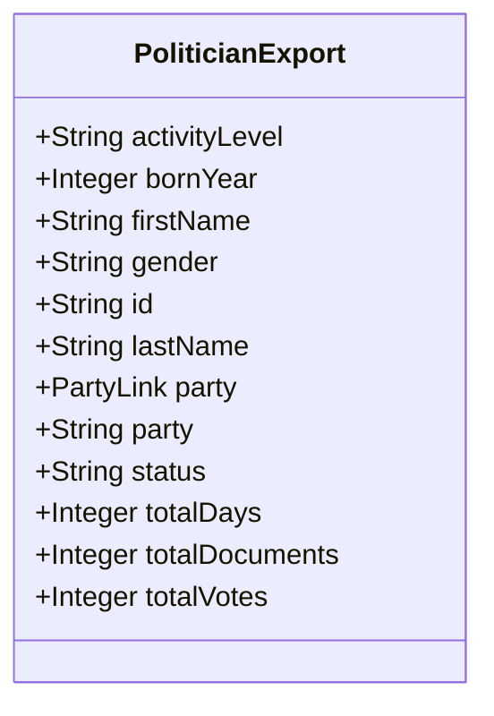

# Politician Schema (Data-Validated)

**Status:** ✅ Validated against actual sample data  
**Last Updated:** 2026-04-05  
**Fields:** 14 implemented (only fields present in sample data)

## Overview

This schema reflects **only fields that exist in actual sample data**. 
The 31 mismatched fields have been categorized by implementation status.

**Validation Results:**
- Original fields defined: 45
- Fields validated in data: 14
- Fields not in data: 31 (14 structural, 12 computable, 5 planned)

## Data Model

```mermaid
classDiagram
    class PoliticianExport {
        +String activityLevel
        +Integer bornYear
        +String firstName
        +String gender
        +String id
        +String lastName
        +PartyLink party
        +String party
        +String status
        +Integer totalDays
        +Integer totalDocuments
        +Integer totalVotes
    }
```

## Field Descriptions

- **activityLevel** (`String`): Field found in sample data
- **bornYear** (`Integer`): Field found in sample data
- **firstName** (`String`): Field found in sample data
- **gender** (`String`): Field found in sample data
- **id** (`String`): Field found in sample data
- **lastName** (`String`): Field found in sample data
- **party** (`PartyLink`): Field found in sample data
- **party** (`String`): Field found in sample data
- **status** (`String`): Field found in sample data
- **totalDays** (`Integer`): Field found in sample data
- **totalDocuments** (`Integer`): Field found in sample data
- **totalVotes** (`Integer`): Field found in sample data

## Data Sources

This schema is validated against the following data sources:

- `view_riksdagen_politician_document_sample.csv`
- `view_riksdagen_politician_document_daily_summary_sample.csv`
- `view_riksdagen_politician_document_summary_sample.csv`
- `view_riksdagen_politician_ballot_summary_sample.csv`
- `view_riksdagen_politician_experience_summary_sample.csv`
- `view_riksdagen_politician_decision_pattern_sample.csv`
- `view_riksdagen_politician_sample.csv`

## Migration Notes

**Field Classification (31 fields not in data):**

### ❌ Structural Fields (JSON grouping objects — not direct DB columns)
- `attributes`, `labels`, `relationships`, `intelligence`, `activity`, `voting`, `documents`, `committees`
- `descriptions`, `category`, `short`, `detailed`, `long`, `breakdown`, `period`, `byType`

### 🔀 Computable Fields (derivable from existing DB columns)
- `fullName` — concatenate `first_name` + `last_name`
- `partyLoyalty` — from `loyalty_rate` column
- `rebellions` — from `rebel_rate` column
- `influenceScore` — from `influence_classification` + `leadership_profile`
- `rankingPosition` — comparative ranking via ROW_NUMBER()
- `trendDirection` — from `career_phase` + `career_score`
- `absences` — from `attendance_rate` + `total_days_served`
- `activeDays` — from `attendance_rate` * `total_days_served`
- `amendments` — count documents where type = 'mot'
- `questions` — count documents where type = 'fr' or 'ip'
- `motions` — from document type filtering
- `performance` — composite from `risk_score`, `attendance_rate`, `win_rate`

### 🔄 Planned Fields (require new data sources)
- `district` — needs electoral region mapping (available in `election_region`)
- `imageUrl` — needs external image URL source
- `riskScore` — available in `view_politician_risk_summary` (needs view mapping)
- `riskLevel` — derivable from riskScore
- `behavioralFlags` — from rule violation data

**Recommendation:** See `FIELD_MAPPING.md` for implementation priority and `SCHEMA_VALIDATION_REPORT.md` for remediation plan.
