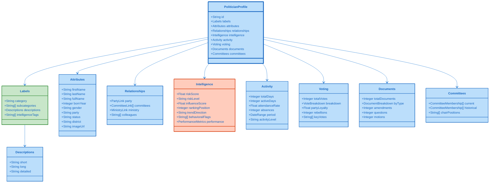

# 👤 Politician JSON Schema Specification
## Comprehensive Profile Format for Political Representatives

**Version:** 1.0.0  
**Schema ID**: `politician-profile`  
**Last Updated**: 2024-11-24

---

## 🔗 Business Context

This JSON schema powers **3 product lines** serving €23M Total Addressable Market:

### Product Integration
- **[Political Intelligence API](../../BUSINESS_PRODUCT_DOCUMENT.md#-product-line-1-political-intelligence-api)** - Core API product (€630K/year revenue potential)
  - Politician profiles and risk assessment
  - Voting statistics export
  - Real-time political monitoring
- **[Advanced Analytics Suite](../../BUSINESS_PRODUCT_DOCUMENT.md#-product-line-2-advanced-analytics-suite)** - Analytics platform (€855K/year)
  - Political scorecards dashboard
  - Comparative politician benchmarking
  - Activity metrics visualization
- **[Risk Intelligence Feed](../../BUSINESS_PRODUCT_DOCUMENT.md#-product-line-3-risk-intelligence-feed)** - Risk monitoring (€1.77M/year)
  - Real-time risk assessment (45 rules)
  - Compliance violation tracking
  - Early warning alerts

### Market Segments
- **Political Consulting** (€15M TAM) - Opposition research, candidate selection
- **Media & Journalism** (€8M TAM) - Investigative reporting, fact-checking
- **Academic Research** (€5M TAM) - Political science studies, electoral research
- **Corporate Affairs** (€12M TAM) - Stakeholder monitoring, regulatory tracking
- **Financial Services** (€20M+ TAM) - Political risk assessment for investments

**See Complete Business Strategy**: [BUSINESS_PRODUCT_DOCUMENT.md](../../BUSINESS_PRODUCT_DOCUMENT.md) | [Product-to-Data Mapping](../../BUSINESS_PRODUCT_DOCUMENT.md#appendix-e-product-to-data-mapping)

---

## 🎯 Overview

The Politician JSON schema provides a comprehensive representation of Swedish parliamentary representatives, including biographical data, political activity, voting records, committee memberships, and intelligence analytics.

### Data Sources

This schema aggregates data from multiple database views:
- `view_riksdagen_politician` - Core politician data
- `view_riksdagen_politician_summary` - Activity summaries
- `view_riksdagen_politician_document_summary` - Legislative productivity
- `view_riksdagen_politician_vote_summary` - Voting patterns
- `view_riksdagen_politician_ranking` - Comparative rankings

---

## 📊 Schema Diagram



---

## 📝 Complete JSON Schema

### Root Structure

```json
{
  "metadata": {
    "version": "1.0.0",
    "generated": "2024-11-24T02:23:58Z",
    "source": "Citizen Intelligence Agency",
    "schema": "politician-profile",
    "recordCount": 349,
    "dataDate": "2024-11-23",
    "attribution": "Data derived from Riksdagen Open Data API",
    "license": "Apache-2.0"
  },
  "data": [
    {
      "id": "string",
      "labels": { },
      "attributes": { },
      "relationships": { },
      "intelligence": { },
      "activity": { },
      "voting": { },
      "documents": { },
      "committees": { }
    }
  ]
}
```

---

## 🏷️ Labels Section

Labels provide categorical classification and multi-level descriptions optimized for different UI contexts.

```json
{
  "labels": {
    "category": "active-member",
    "subcategories": [
      "government-coalition",
      "committee-chair",
      "party-leadership",
      "minister"
    ],
    "descriptions": {
      "short": "Social Democrat MP, Finance Committee Chair",
      "long": "Experienced politician serving third term as member of Riksdag, currently chairing the influential Finance Committee with focus on fiscal policy and budget oversight.",
      "detailed": "Elected to Riksdag in 2014 representing Stockholm constituency, has established reputation as expert in economic policy and public finance. Current role as Finance Committee Chair involves oversight of national budget process and scrutiny of government financial management. Previously served as deputy member of EU Affairs Committee and active in housing policy debates. Known for pragmatic approach to coalition building and ability to work across party lines on technical economic matters."
    },
    "intelligenceTags": [
      "coalition-broker",
      "policy-expert-economics",
      "high-media-presence",
      "committee-leader",
      "rising-influence"
    ]
  }
}
```

### Label Field Definitions

| Field | Type | Max Length | Description |
|-------|------|------------|-------------|
| `category` | String | - | Primary classification (see categories below) |
| `subcategories` | String[] | - | Additional classifications/tags |
| `descriptions.short` | String | 140 chars | Tweet-length summary |
| `descriptions.long` | String | 500 chars | Paragraph description |
| `descriptions.detailed` | String | 2000 chars | Comprehensive profile |
| `intelligenceTags` | String[] | - | Analytical classifications |

### Category Values

- `active-member` - Currently serving in Riksdag
- `former-member` - No longer serving
- `minister` - Current government minister
- `committee-chair` - Chairs parliamentary committee
- `party-leader` - Leads political party
- `speaker` - Riksdag speaker or deputy speaker
- `eu-representative` - Serves in EU parliament

### Intelligence Tag Values

- **Influence**: `high-influence`, `rising-influence`, `declining-influence`, `coalition-broker`, `policy-expert-{domain}`
- **Activity**: `highly-active`, `moderately-active`, `low-activity`, `frequent-absence`
- **Alignment**: `party-loyalist`, `independent-thinker`, `rebel`, `swing-voter`
- **Media**: `high-media-presence`, `low-profile`, `controversial`, `scandal-affected`
- **Risk**: `high-risk`, `defection-risk`, `ethical-concerns`, `investigation-pending`
- **Performance**: `high-performer`, `committee-leader`, `legislative-champion`, `question-master`

---

## 📋 Attributes Section

Core biographical and current status information.

```json
{
  "attributes": {
    "firstName": "Anna",
    "lastName": "Andersson",
    "fullName": "Anna Maria Andersson",
    "bornYear": 1975,
    "gender": "female",
    "party": "S",
    "partyName": "Socialdemokraterna",
    "status": "active",
    "district": "Stockholms kommun",
    "imageUrl": "https://data.riksdagen.se/filarkiv/bilder/ledamot/0123456789_max.jpg",
    "riksdagenId": "0123456789",
    "intressentId": "0ABCDEFGHIJ123",
    "enteredParliament": "2014-09-29",
    "currentTerm": {
      "start": "2022-09-26",
      "end": "2026-09-30",
      "number": 3
    },
    "contact": {
      "riksdagenEmail": "anna.andersson@riksdagen.se",
      "phone": "+46 8 786 40 00",
      "officialWebsite": null
    }
  }
}
```

### Attribute Field Definitions

| Field | Type | Required | Description |
|-------|------|----------|-------------|
| `firstName` | String | Yes | First name |
| `lastName` | String | Yes | Surname |
| `fullName` | String | Yes | Complete name |
| `bornYear` | Integer | Yes | Birth year (age privacy) |
| `gender` | String | Yes | `male`, `female`, `other` |
| `party` | String | Yes | Short party code (S, M, SD, etc.) |
| `partyName` | String | Yes | Full party name |
| `status` | String | Yes | `active`, `inactive`, `leave`, `deceased` |
| `district` | String | Yes | Electoral constituency |
| `imageUrl` | String | No | Official portrait URL |
| `riksdagenId` | String | Yes | Official Riksdag ID |
| `enteredParliament` | String (Date) | Yes | First entry date |
| `currentTerm` | Object | Yes | Current term details |

---

## 🔗 Relationships Section

Links to related entities and colleagues.

```json
{
  "relationships": {
    "party": {
      "id": "s",
      "name": "Socialdemokraterna",
      "role": "member",
      "since": "2005-01-15",
      "positions": ["finance-spokesperson", "party-board"]
    },
    "committees": [
      {
        "id": "FiU",
        "name": "Finansutskottet",
        "role": "chair",
        "since": "2022-10-01"
      },
      {
        "id": "UU",
        "name": "Utrikesutskottet",
        "role": "deputy-member",
        "since": "2018-10-01",
        "until": "2022-09-30"
      }
    ],
    "ministry": {
      "id": "FI",
      "name": "Finansdepartementet",
      "position": "minister-finance",
      "since": "2021-11-30"
    },
    "colleagues": {
      "partyColleagues": ["0234567890", "0345678901"],
      "committeeColleagues": ["0456789012", "0567890123"],
      "districtColleagues": ["0678901234"]
    }
  }
}
```

---

## 🎯 Intelligence Section

Analytical metrics, risk scores, and performance indicators.

```json
{
  "intelligence": {
    "riskScore": 15.5,
    "riskLevel": "low",
    "riskFactors": [
      {
        "factor": "attendance-drop",
        "severity": 10,
        "description": "Attendance declined from 95% to 87% in past 6 months"
      }
    ],
    "influenceScore": 78.3,
    "influenceRank": 12,
    "influenceFactors": {
      "committeeLeadership": 25,
      "partyPosition": 20,
      "mediaVisibility": 18,
      "legislativeSuccess": 15.3
    },
    "ranking": {
      "overall": 12,
      "inParty": 3,
      "inCommittee": 1,
      "trend": "rising"
    },
    "trendDirection": "positive",
    "trendMetrics": {
      "activityTrend": "+5.2%",
      "votingTrend": "stable",
      "documentTrend": "+12.3%",
      "mediaTrend": "+8.7%"
    },
    "behavioralFlags": [
      {
        "flag": "committee-leadership",
        "severity": "positive",
        "description": "Effective committee chair with high productivity"
      }
    ],
    "performance": {
      "overall": 82.5,
      "attendance": 87.2,
      "productivity": 78.9,
      "effectiveness": 81.3,
      "collaboration": 85.7
    },
    "predictions": {
      "reelectionProbability": 0.85,
      "ministerialAppointment": 0.45,
      "partyLeadership": 0.15,
      "defectionRisk": 0.02
    }
  }
}
```

---

## 📊 Activity Section

Parliamentary participation and attendance metrics.

```json
{
  "activity": {
    "totalDays": 1250,
    "activeDays": 1090,
    "attendanceRate": 87.2,
    "absences": 160,
    "period": {
      "start": "2014-09-29",
      "end": "2024-11-23",
      "years": 11.2
    },
    "activityLevel": "high",
    "recentTrend": {
      "last30Days": 28,
      "last90Days": 82,
      "last365Days": 298
    },
    "breakdown": {
      "plenarySession": 850,
      "committeeSession": 680,
      "partyMeeting": 420,
      "constituencyWork": 150
    },
    "comparison": {
      "partyAverage": 85.5,
      "riksdagAverage": 84.3,
      "percentile": 72
    }
  }
}
```

---

## 🗳️ Voting Section

Voting patterns and party loyalty metrics.

```json
{
  "voting": {
    "totalVotes": 2847,
    "breakdown": {
      "yes": 1823,
      "no": 892,
      "abstain": 98,
      "absent": 34
    },
    "partyLoyalty": 94.5,
    "rebellions": 45,
    "rebellionRate": 1.58,
    "keyVotes": [
      {
        "id": "H901FiU12",
        "date": "2024-11-15",
        "topic": "Budget proposition 2025",
        "vote": "yes",
        "partyLine": "yes",
        "result": "passed"
      }
    ],
    "alignment": {
      "withCoalition": 96.8,
      "withOpposition": 3.2,
      "crossPartyVotes": 12
    },
    "votingPatterns": {
      "economicPolicy": {
        "count": 456,
        "loyaltyRate": 97.3
      },
      "socialPolicy": {
        "count": 389,
        "loyaltyRate": 93.1
      },
      "foreignPolicy": {
        "count": 234,
        "loyaltyRate": 91.5
      }
    }
  }
}
```

---

## 📄 Documents Section

Legislative productivity and document authorship.

```json
{
  "documents": {
    "totalDocuments": 487,
    "byType": {
      "motion": 156,
      "interpellation": 89,
      "writtenQuestion": 178,
      "amendment": 45,
      "report": 19
    },
    "byPolicyArea": {
      "economics": 234,
      "socialPolicy": 123,
      "environment": 67,
      "foreignAffairs": 34,
      "defense": 29
    },
    "recentDocuments": [
      {
        "id": "H901234",
        "type": "motion",
        "title": "Motion regarding tax reform proposals",
        "date": "2024-11-20",
        "status": "submitted",
        "url": "https://data.riksdagen.se/dokument/H901234"
      }
    ],
    "success": {
      "adopted": 23,
      "rejected": 98,
      "pending": 45,
      "withdrawn": 12,
      "successRate": 14.7
    },
    "collaboration": {
      "coAuthored": 123,
      "solo": 364,
      "crossParty": 34
    },
    "productivity": {
      "docsPerYear": 43.9,
      "partyAverage": 38.2,
      "percentile": 68
    }
  }
}
```

---

## 👥 Committees Section

Committee memberships past and present.

```json
{
  "committees": {
    "current": [
      {
        "id": "FiU",
        "name": "Finansutskottet",
        "nameEn": "Finance Committee",
        "role": "chair",
        "since": "2022-10-01",
        "attendance": 92.3,
        "documentsSubmitted": 45,
        "influence": "high"
      },
      {
        "id": "UU",
        "name": "Utrikesutskottet",
        "nameEn": "Foreign Affairs Committee",
        "role": "deputy-member",
        "since": "2022-10-01",
        "attendance": 78.5,
        "documentsSubmitted": 12,
        "influence": "medium"
      }
    ],
    "historical": [
      {
        "id": "SkU",
        "name": "Skatteutskottet",
        "nameEn": "Tax Committee",
        "role": "member",
        "since": "2014-10-01",
        "until": "2022-09-30",
        "duration": "8 years"
      }
    ],
    "chairPositions": [
      {
        "committee": "FiU",
        "since": "2022-10-01",
        "current": true
      }
    ],
    "specialAssignments": [
      {
        "name": "EU Budget Review Committee",
        "role": "Swedish representative",
        "since": "2023-01-15"
      }
    ]
  }
}
```

---

## 📏 Field Size Constraints

| Section | Field | Max Size | Validation |
|---------|-------|----------|------------|
| Labels | short | 140 chars | Required, plain text |
| Labels | long | 500 chars | Required, plain text |
| Labels | detailed | 2000 chars | Required, markdown allowed |
| Attributes | firstName | 100 chars | Required, alpha chars |
| Attributes | lastName | 100 chars | Required, alpha chars |
| Intelligence | riskScore | 0-100 | Float, 1 decimal |
| Intelligence | influenceScore | 0-100 | Float, 1 decimal |
| Activity | attendanceRate | 0-100 | Float, 1 decimal |
| Voting | partyLoyalty | 0-100 | Float, 1 decimal |

---

## 🎨 Color Coding for Visualizations

Suggested color schemes for data visualization:

### Party Colors (Swedish Political Parties)

```json
{
  "partyColors": {
    "S": "#E8112d",   // Social Democrats - Red
    "M": "#52BDEC",   // Moderates - Blue
    "SD": "#DDDD00",  // Sweden Democrats - Yellow
    "C": "#009933",   // Centre Party - Green
    "V": "#DA291C",   // Left Party - Dark Red
    "KD": "#000077",  // Christian Democrats - Navy
    "MP": "#83CF39",  // Green Party - Light Green
    "L": "#006AB3"    // Liberals - Blue
  }
}
```

### Risk Level Colors

```json
{
  "riskLevelColors": {
    "low": "#4CAF50",      // Green
    "moderate": "#FF9800", // Orange
    "high": "#F44336",     // Red
    "critical": "#B71C1C"  // Dark Red
  }
}
```

### Trend Direction Colors

```json
{
  "trendColors": {
    "positive": "#4CAF50",  // Green (rising)
    "stable": "#2196F3",    // Blue (neutral)
    "negative": "#F44336",  // Red (declining)
    "volatile": "#FF9800"   // Orange (unstable)
  }
}
```

---

## 📊 Usage Examples

### Example 1: Display Politician Card

```javascript
async function displayPoliticianCard(politicianId) {
  const response = await fetch(`/politicians/profiles/${politicianId}.json`);
  const data = await response.json();
  const pol = data.data[0];
  
  return `
    <div class="politician-card">
      
      <h2>${pol.attributes.fullName}</h2>
      <p class="party" style="color: ${getPartyColor(pol.attributes.party)}">
        ${pol.attributes.partyName}
      </p>
      <p class="description">${pol.labels.descriptions.long}</p>
      <div class="metrics">
        <div class="metric">
          <span class="label">Attendance</span>
          <span class="value">${pol.activity.attendanceRate}%</span>
        </div>
        <div class="metric">
          <span class="label">Influence</span>
          <span class="value">${pol.intelligence.influenceScore}</span>
        </div>
      </div>
    </div>
  `;
}
```

### Example 2: Filter High-Risk Politicians

```javascript
async function findHighRiskPoliticians() {
  const response = await fetch('/politicians/index.json');
  const data = await response.json();
  
  return data.data.filter(pol => 
    pol.intelligence.riskScore > 50 || 
    pol.intelligence.riskLevel === 'high'
  );
}
```

### Example 3: Committee Leadership Dashboard

```javascript
async function getCommitteeLeaders() {
  const response = await fetch('/politicians/index.json');
  const data = await response.json();
  
  const leaders = data.data
    .filter(pol => pol.committees.chairPositions.length > 0)
    .map(pol => ({
      name: pol.attributes.fullName,
      party: pol.attributes.party,
      committees: pol.committees.current
        .filter(c => c.role === 'chair')
        .map(c => c.name)
    }));
  
  return leaders;
}
```

---

## ✅ Validation Rules

### Required Fields
- `id`, `labels`, `attributes`, `intelligence`
- `attributes.firstName`, `attributes.lastName`, `attributes.party`, `attributes.status`
- `labels.category`, `labels.descriptions.short`, `labels.descriptions.long`

### Data Type Validation
- All scores: Float between 0-100
- All rates/percentages: Float between 0-100
- Dates: ISO 8601 format (YYYY-MM-DD)
- IDs: String, alphanumeric
- URLs: Valid HTTP/HTTPS URLs

### Business Logic Validation
- `activity.activeDays` ≤ `activity.totalDays`
- `voting.totalVotes` = sum of breakdown values
- `documents.totalDocuments` = sum of byType values
- `intelligence.riskScore` correlates with `riskLevel`

---

## 🔄 Update Frequency

- **Real-time**: N/A (static export)
- **Daily**: Activity, voting, documents (automated)
- **Weekly**: Intelligence scores, rankings (recalculated)
- **Monthly**: Full profile regeneration

---

## 📚 Related Schemas

- [Party JSON Schema](./party-schema.md) - Political party profiles
- [Committee JSON Schema](./committee-schema.md) - Committee information
- [Ministry JSON Schema](./ministry-schema.md) - Government ministries
- [Intelligence Products Schema](./intelligence-schema.md) - Analytical products

---

**Schema Version**: 1.0.0  
**Last Updated**: 2024-11-24  
**Maintained By**: Citizen Intelligence Agency Development Team
