# Committee Network Analysis

**Last Updated**: 2024-11-24

## Overview

Visualization of Swedish Riksdag committee structure, cross-committee collaboration patterns, and network analysis of committee relationships.

## Committee Network Structure

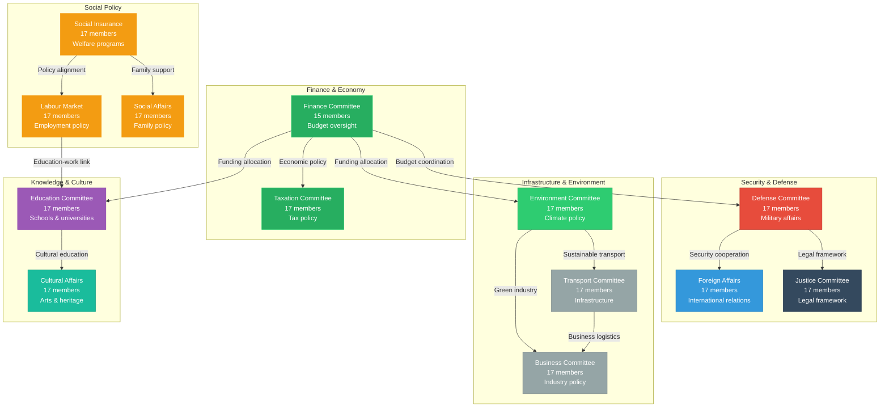

## Collaboration Intensity Matrix

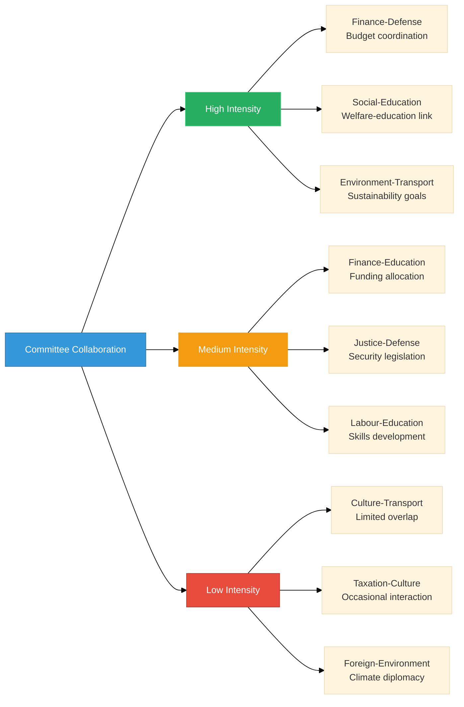

## Committee Member Distribution by Party

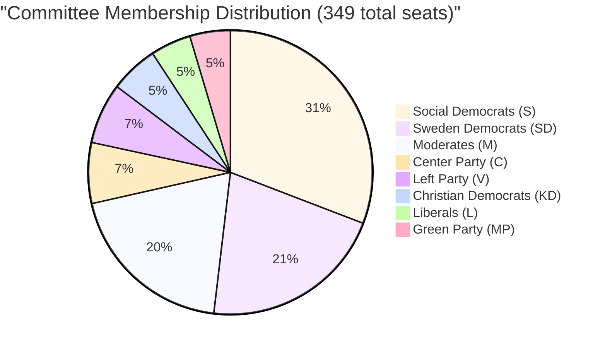

## Cross-Party Collaboration Patterns

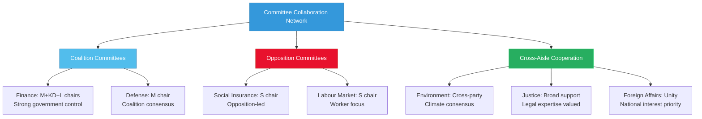

## Committee Productivity Rankings

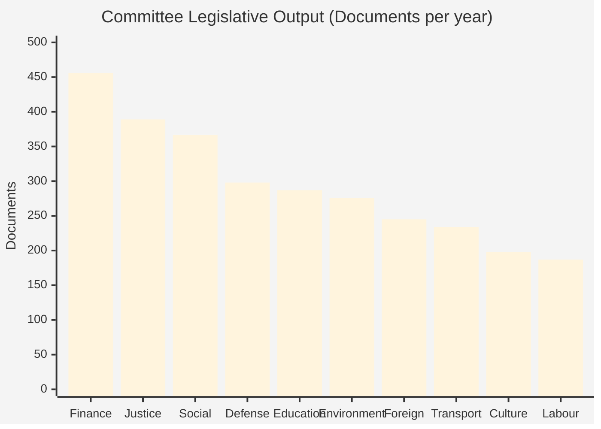

## Committee Leadership Timeline

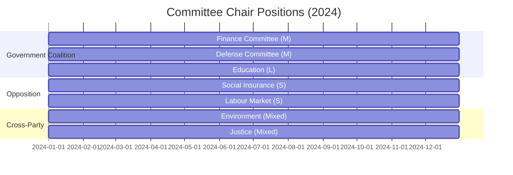

## Committee Meeting Frequency

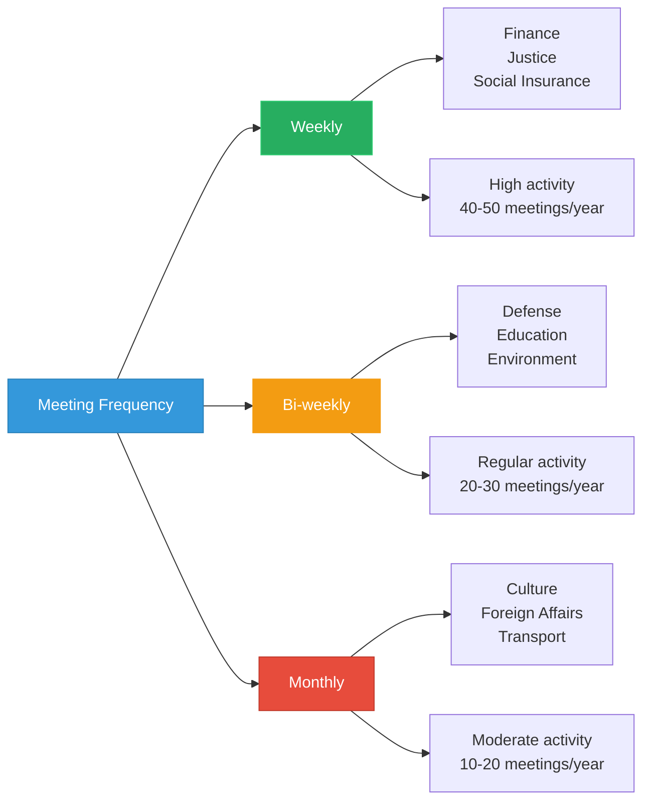

## Network Centrality Analysis

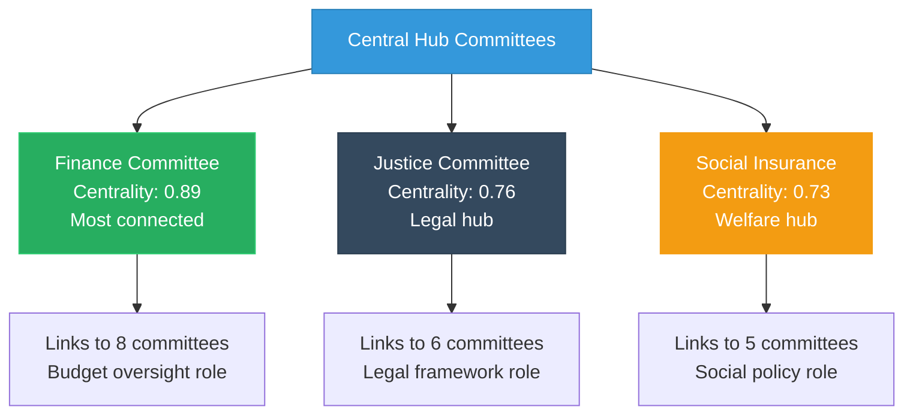

## Committee Expertise Areas

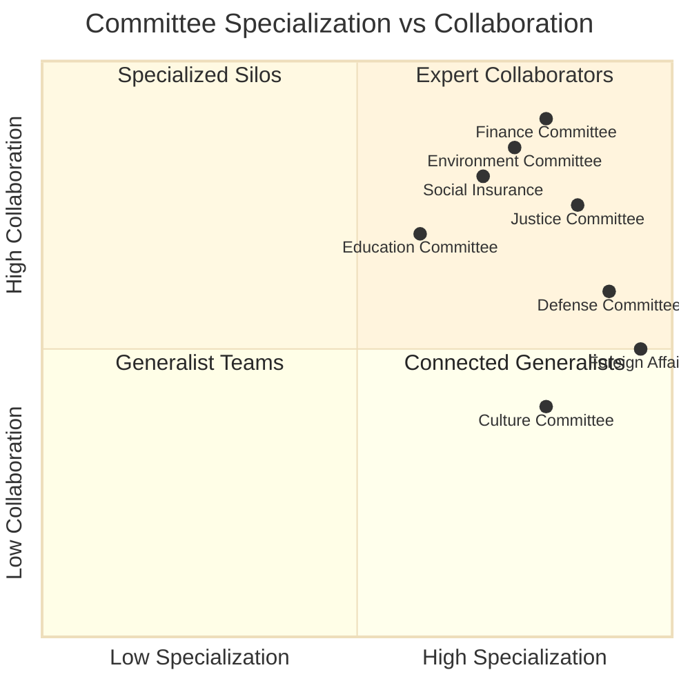

## Cross-Committee Working Groups

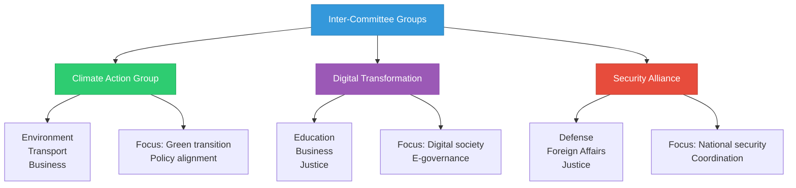

## Committee Influence Flow

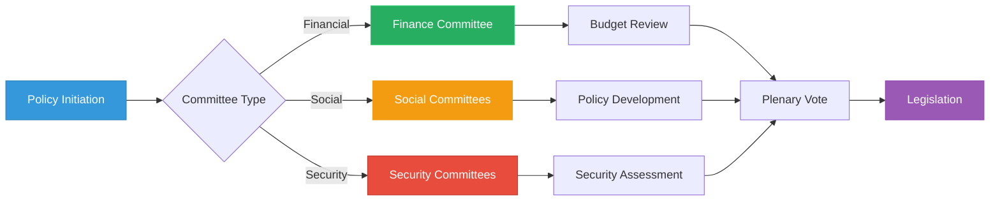

## Features

- **Network Structure**: Complete committee relationship mapping with 15 committees
- **Collaboration Matrix**: Intensity levels showing cross-committee work patterns
- **Party Distribution**: Seat allocation across all committees reflecting parliamentary composition
- **Productivity Metrics**: Legislative output and meeting frequency analysis
- **Centrality Analysis**: Identification of hub committees with highest connectivity
- **Specialization Matrix**: Committee expertise vs. collaboration patterns
- **Working Groups**: Inter-committee coordination bodies for cross-cutting issues

## Usage Scenarios

1. **Legislative Process Tracking**: Understanding how bills move through committee structure
2. **Coalition Analysis**: Identifying committee control and partisan influence
3. **Policy Coordination**: Mapping cross-committee collaboration on complex issues
4. **Productivity Assessment**: Evaluating committee efficiency and output
5. **Network Analysis**: Understanding information flow and influence patterns
6. **Resource Allocation**: Identifying high-activity committees requiring support

## Data Sources

- **Primary Views**:
  - `view_riksdagen_committee` - Committee structure and membership
  - `view_committee_productivity` - Productivity metrics and efficiency
  - `view_committee_productivity_matrix` - Cross-committee benchmarking
  - `view_riksdagen_committee_decisions` - Decision tracking
  - `view_riksdagen_committee_ballot_decision_summary` - Voting outcomes
- **Committee Collaboration Indicators**:
  - Cross-committee proposal references
  - Joint hearings and reports
  - Budget coordination patterns
  - Policy area overlaps
- **Key Metrics**:
  - Member counts and party distribution
  - Decisions per quarter
  - Processing times (days from proposal to decision)
  - Productivity level classifications (HIGH, MODERATE, LOW)
- **JSON Spec**: `committee-relationships.json`, `committee-members.json`
- **Update Frequency**: Daily (membership), Weekly (collaboration metrics)
- **Cache Duration**: 6 hours
- **Coverage**: All 15 Riksdag committees with documented codes (FiU, FöU, UU, JuU, etc.)
- **Coverage**: All 15 standing committees + special committees

## Swedish Committee System Context

The Riksdag has 15 standing committees (utskott) that prepare decisions on matters before the chamber. Each committee specializes in a particular area and consists of 15-17 members. Committee membership reflects the party distribution in parliament. Committees are the primary venue for detailed legislative work, conducting hearings, reviewing bills, and proposing amendments before plenary votes.

---

**Last Review**: 2024-11-24  
**Visualization Version**: 1.0.0  
**Compliance**: WCAG 2.1 AA
