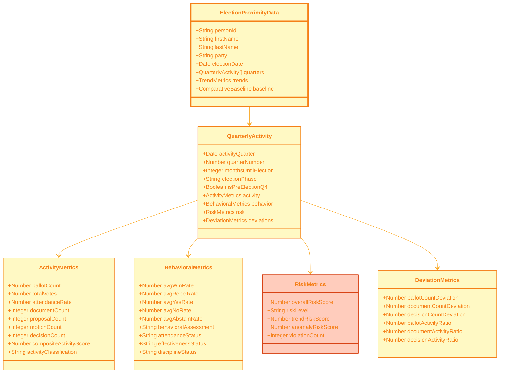

# 🗳️ Election Cycle Analysis Visualization Guide
## Proximity Trends, Behavioral Patterns & Pre-Election Activity (v1.59-v1.60)

**Version:** 1.0.0  
**Last Updated**: 2026-01-29  
**Schema Version**: intelligence-schema.md v1.1.0  
**Data Sources**: `view_riksdagen_election_proximity_trends`, `view_riksdagen_election_year_behavioral_patterns`, `view_riksdagen_pre_election_quarterly_activity`

---

## 🎯 Overview

The Election Cycle Analysis visualization suite provides comprehensive insights into how political behavior changes in relation to election proximity. This analysis is critical for understanding:

- **Pre-election posturing** - How politicians increase activity before elections
- **Behavioral shifts** - Changes in voting patterns, document production, risk-taking
- **Strategic timing** - Optimal periods for legislative initiatives
- **Electoral vulnerability** - Identifying at-risk incumbents based on activity patterns

### Key Features

- **Quarterly Activity Tracking** - Monitor behavior changes by quarter relative to election date
- **Multi-Metric Dashboards** - Track attendance, productivity, voting patterns, risk scores
- **Comparative Analysis** - Election year vs. mid-term behavioral differences
- **Predictive Indicators** - Early warning signs of electoral vulnerability
- **Phase Classification** - Automatic categorization of election proximity phases

---

## 📊 Data Sources Mapping

### View 1: Election Proximity Trends

**Database View**: `view_riksdagen_election_proximity_trends`

**Key Metrics** (58 columns):
- **Temporal Context**: Election date, activity quarter, months until election, election phase
- **Voting Behavior**: Ballot count, total votes, attendance rate, win/rebel/yes/no rates
- **Behavioral Assessment**: Attendance/effectiveness/discipline status, violation counts
- **Legislative Activity**: Document/proposal/motion counts, decision metrics
- **Role Progression**: New assignments, peak role weight, leadership/committee counts
- **Risk Metrics**: Overall risk score, trend/anomaly risk scores
- **Network Position**: Connections, influence/broker classification
- **Activity Ratios**: Ballot/document/decision/assignment activity ratios vs. baseline
- **Composite Scores**: Activity classification, composite activity score

**Election Phase Classification**:
```
CRITICAL_WINDOW: 0-3 months before election
INTENSE_CAMPAIGN: 3-6 months before election
PRE_CAMPAIGN: 6-12 months before election
MID_TERM: 12-24 months before election
EARLY_TERM: 24+ months before election
```

### View 2: Election Year Behavioral Patterns

**Database View**: `view_riksdagen_election_year_behavioral_patterns`

**Key Metrics** (Similar structure to proximity trends, filtered for election years)
- Focuses on patterns specific to election years
- Compares Q1-Q3 (pre-election) vs. Q4 (post-election)
- Identifies anomalous behavior during campaign periods

### View 3: Pre-Election Quarterly Activity

**Database View**: `view_riksdagen_pre_election_quarterly_activity`

**Key Metrics**:
- Quarter-by-quarter breakdown in final year before election
- Q4 specific metrics (critical pre-election period)
- Comparative baselines for each metric
- Activity deviation percentages

---

## 🎨 Visualization 1: Election Proximity Activity Heatmap

### Data Structure (Mermaid)



### JSON Schema

```json
{
  "metadata": {
    "version": "1.0.0",
    "generated": "2026-01-29T02:17:00Z",
    "schema": "election-proximity-trends",
    "dataSource": "view_riksdagen_election_proximity_trends",
    "electionCycles": ["2022", "2026"],
    "recordCount": 5234
  },
  "data": [
    {
      "personId": "0123456789",
      "firstName": "Anna",
      "lastName": "Andersson",
      "party": "S",
      "electionDate": "2026-09-13",
      "quarters": [
        {
          "activityQuarter": "2026-01-01T00:00:00Z",
          "quarterNumber": 1,
          "monthsUntilElection": 8,
          "electionPhase": "PRE_CAMPAIGN",
          "isPreElectionQ4": false,
          "activity": {
            "ballotCount": 87,
            "totalVotes": 85,
            "attendanceRate": 97.7,
            "documentCount": 23,
            "proposalCount": 8,
            "motionCount": 12,
            "decisionCount": 45,
            "compositeActivityScore": 92.3,
            "activityClassification": "HIGHLY_ACTIVE"
          },
          "behavior": {
            "avgWinRate": 78.5,
            "avgRebelRate": 2.1,
            "avgYesRate": 68.3,
            "avgNoRate": 29.6,
            "avgAbstainRate": 2.1,
            "behavioralAssessment": "EXCELLENT_BEHAVIOR",
            "attendanceStatus": "EXCELLENT_ATTENDANCE",
            "effectivenessStatus": "EFFECTIVE",
            "disciplineStatus": "PARTY_LINE"
          },
          "risk": {
            "overallRiskScore": 12.5,
            "riskLevel": "LOW",
            "trendRiskScore": 8.2,
            "anomalyRiskScore": 4.3,
            "violationCount": 0
          },
          "deviations": {
            "ballotCountDeviation": 12.5,
            "documentCountDeviation": 45.8,
            "decisionCountDeviation": 23.4,
            "ballotActivityRatio": 1.17,
            "documentActivityRatio": 1.46,
            "decisionActivityRatio": 1.23
          },
          "baseline": {
            "avgBallotCountBaseline": 74.3,
            "avgDocumentCountBaseline": 15.8,
            "avgDecisionCountBaseline": 36.5
          }
        },
        {
          "activityQuarter": "2026-04-01T00:00:00Z",
          "quarterNumber": 2,
          "monthsUntilElection": 5,
          "electionPhase": "INTENSE_CAMPAIGN",
          "isPreElectionQ4": false,
          "activity": {
            "ballotCount": 102,
            "totalVotes": 99,
            "attendanceRate": 97.1,
            "documentCount": 31,
            "proposalCount": 12,
            "motionCount": 15,
            "decisionCount": 52,
            "compositeActivityScore": 95.8,
            "activityClassification": "HIGHLY_ACTIVE"
          },
          "behavior": {
            "avgWinRate": 81.2,
            "avgRebelRate": 1.8,
            "avgYesRate": 71.5,
            "avgNoRate": 26.7,
            "avgAbstainRate": 1.8,
            "behavioralAssessment": "EXCELLENT_BEHAVIOR",
            "attendanceStatus": "EXCELLENT_ATTENDANCE",
            "effectivenessStatus": "HIGHLY_EFFECTIVE",
            "disciplineStatus": "PARTY_LINE"
          },
          "risk": {
            "overallRiskScore": 10.2,
            "riskLevel": "LOW",
            "trendRiskScore": 6.5,
            "anomalyRiskScore": 3.7,
            "violationCount": 0
          },
          "deviations": {
            "ballotCountDeviation": 37.3,
            "documentCountDeviation": 96.2,
            "decisionCountDeviation": 42.5,
            "ballotActivityRatio": 1.37,
            "documentActivityRatio": 1.96,
            "decisionActivityRatio": 1.42
          }
        }
      ],
      "trends": {
        "overallActivityTrend": "INCREASING",
        "documentProductivityTrend": "SHARP_INCREASE",
        "riskTrend": "DECREASING",
        "preElectionBoost": 45.6,
        "typicalPreElectionPattern": true
      },
      "comparativeRank": {
        "rankByActivityQuarter": 23,
        "activityPercentile": 93.4
      }
    }
  ]
}
```

### D3.js Implementation: Activity Heatmap

```javascript
import * as d3 from 'd3';

class ElectionProximityHeatmap {
  constructor(containerId, data) {
    this.container = d3.select(`#${containerId}`);
    this.data = data;
    this.width = 1200;
    this.height = 600;
    this.margin = { top: 60, right: 120, bottom: 80, left: 180 };
    
    // Metrics to display
    this.metrics = [
      { key: 'attendanceRate', label: 'Attendance Rate', format: d => d + '%' },
      { key: 'ballotCount', label: 'Ballot Participation', format: d => d },
      { key: 'documentCount', label: 'Documents Produced', format: d => d },
      { key: 'avgWinRate', label: 'Win Rate', format: d => d + '%' },
      { key: 'avgRebelRate', label: 'Rebel Rate', format: d => d + '%' },
      { key: 'compositeActivityScore', label: 'Activity Score', format: d => d },
      { key: 'overallRiskScore', label: 'Risk Score', format: d => d }
    ];
  }

  render() {
    const svg = this.container
      .append('svg')
      .attr('width', this.width)
      .attr('height', this.height);

    const g = svg.append('g')
      .attr('transform', `translate(${this.margin.left},${this.margin.top})`);

    const innerWidth = this.width - this.margin.left - this.margin.right;
    const innerHeight = this.height - this.margin.top - this.margin.bottom;

    // Prepare heatmap data
    const heatmapData = [];
    this.data.forEach(person => {
      person.quarters.forEach(quarter => {
        this.metrics.forEach(metric => {
          let value;
          if (metric.key.startsWith('avg')) {
            value = quarter.behavior[metric.key];
          } else if (metric.key === 'overallRiskScore') {
            value = quarter.risk[metric.key];
          } else if (metric.key === 'compositeActivityScore') {
            value = quarter.activity[metric.key];
          } else {
            value = quarter.activity[metric.key];
          }
          
          heatmapData.push({
            person: `${person.firstName} ${person.lastName}`,
            personId: person.personId,
            party: person.party,
            quarter: quarter.activityQuarter,
            monthsUntilElection: quarter.monthsUntilElection,
            electionPhase: quarter.electionPhase,
            metric: metric.label,
            value: value,
            format: metric.format
          });
        });
      });
    });

    // Group by person and metric for layout
    const groupedData = d3.group(heatmapData, d => d.metric, d => d.quarter);

    // Scales
    const xScale = d3.scaleBand()
      .domain([...new Set(heatmapData.map(d => d.quarter))].sort())
      .range([0, innerWidth])
      .padding(0.05);

    const yScale = d3.scaleBand()
      .domain(this.metrics.map(m => m.label))
      .range([0, innerHeight])
      .padding(0.05);

    // Color scale based on normalized values (0-100)
    const colorScale = d3.scaleSequential()
      .interpolator(d3.interpolateRdYlGn)
      .domain([0, 100]);

    // Draw cells
    const cells = g.selectAll('rect')
      .data(heatmapData)
      .join('rect')
      .attr('x', d => xScale(d.quarter))
      .attr('y', d => yScale(d.metric))
      .attr('width', xScale.bandwidth())
      .attr('height', yScale.bandwidth())
      .attr('fill', d => {
        // Normalize different metrics to 0-100 scale
        let normalizedValue = d.value;
        if (d.metric === 'Risk Score') {
          normalizedValue = 100 - d.value; // Invert risk (lower is better)
        }
        return colorScale(normalizedValue);
      })
      .attr('stroke', '#fff')
      .attr('stroke-width', 1)
      .on('mouseover', (event, d) => this.showTooltip(event, d))
      .on('mouseout', () => this.hideTooltip());

    // X-axis (quarters)
    const xAxis = g.append('g')
      .attr('transform', `translate(0,${innerHeight})`)
      .call(d3.axisBottom(xScale).tickFormat(d => {
        const date = new Date(d);
        return d3.timeFormat('%Y Q%q')(date);
      }))
      .selectAll('text')
      .attr('transform', 'rotate(-45)')
      .style('text-anchor', 'end');

    // Y-axis (metrics)
    g.append('g')
      .call(d3.axisLeft(yScale));

    // Add election phase indicators
    this.addElectionPhaseIndicators(g, xScale, heatmapData);

    // Add legend
    this.addLegend(svg);
  }

  addElectionPhaseIndicators(g, xScale, data) {
    // Group quarters by election phase
    const phaseGroups = d3.group(data, d => d.quarter);
    const phases = [];
    
    phaseGroups.forEach((values, quarter) => {
      const phase = values[0].electionPhase;
      const monthsUntil = values[0].monthsUntilElection;
      phases.push({ quarter, phase, monthsUntil });
    });

    // Color coding for phases
    const phaseColors = {
      'CRITICAL_WINDOW': '#D32F2F',
      'INTENSE_CAMPAIGN': '#F57C00',
      'PRE_CAMPAIGN': '#FBC02D',
      'MID_TERM': '#7CB342',
      'EARLY_TERM': '#0288D1'
    };

    g.selectAll('rect.phase-indicator')
      .data(phases)
      .join('rect')
      .attr('class', 'phase-indicator')
      .attr('x', d => xScale(d.quarter))
      .attr('y', -30)
      .attr('width', xScale.bandwidth())
      .attr('height', 20)
      .attr('fill', d => phaseColors[d.phase])
      .attr('opacity', 0.7);

    g.selectAll('text.phase-label')
      .data(phases)
      .join('text')
      .attr('class', 'phase-label')
      .attr('x', d => xScale(d.quarter) + xScale.bandwidth() / 2)
      .attr('y', -15)
      .attr('text-anchor', 'middle')
      .style('font-size', '9px')
      .style('fill', 'white')
      .text(d => `-${d.monthsUntil}m`);
  }

  addLegend(svg) {
    const legend = svg.append('g')
      .attr('transform', `translate(${this.width - 100}, ${this.margin.top})`);

    // Color scale legend
    const legendHeight = 200;
    const legendWidth = 20;

    const legendScale = d3.scaleLinear()
      .domain([0, 100])
      .range([legendHeight, 0]);

    const legendAxis = d3.axisRight(legendScale)
      .ticks(5)
      .tickFormat(d => d);

    // Create gradient
    const defs = svg.append('defs');
    const gradient = defs.append('linearGradient')
      .attr('id', 'legend-gradient')
      .attr('x1', '0%')
      .attr('y1', '100%')
      .attr('x2', '0%')
      .attr('y2', '0%');

    gradient.selectAll('stop')
      .data(d3.range(0, 101, 10))
      .join('stop')
      .attr('offset', d => d + '%')
      .attr('stop-color', d => d3.interpolateRdYlGn(d / 100));

    legend.append('rect')
      .attr('width', legendWidth)
      .attr('height', legendHeight)
      .style('fill', 'url(#legend-gradient)');

    legend.append('g')
      .attr('transform', `translate(${legendWidth}, 0)`)
      .call(legendAxis);

    legend.append('text')
      .attr('x', legendWidth / 2)
      .attr('y', -10)
      .attr('text-anchor', 'middle')
      .style('font-size', '12px')
      .text('Performance');
  }

  showTooltip(event, d) {
    const tooltip = d3.select('body')
      .append('div')
      .attr('class', 'election-tooltip')
      .style('position', 'absolute')
      .style('background', 'white')
      .style('border', '1px solid #333')
      .style('padding', '10px')
      .style('border-radius', '5px')
      .style('pointer-events', 'none')
      .style('z-index', '1000');

    tooltip.html(`
      <strong>${d.person} (${d.party})</strong><br/>
      Quarter: ${new Date(d.quarter).toLocaleDateString()}<br/>
      Election Phase: ${d.electionPhase}<br/>
      Months Until Election: ${d.monthsUntilElection}<br/>
      <br/>
      <strong>${d.metric}</strong><br/>
      Value: ${d.format(d.value)}
    `)
      .style('left', (event.pageX + 10) + 'px')
      .style('top', (event.pageY - 10) + 'px');
  }

  hideTooltip() {
    d3.selectAll('.election-tooltip').remove();
  }
}

// Usage
async function renderElectionProximityAnalysis() {
  const response = await fetch('/api/intelligence/election-proximity-trends.json');
  const data = await response.json();
  
  const viz = new ElectionProximityHeatmap('election-heatmap-container', data.data);
  viz.render();
}
```

---

## 🎨 Visualization 2: Pre-Election Activity Surge Chart

### D3.js Implementation

```javascript
class PreElectionActivityChart {
  constructor(containerId, data) {
    this.container = d3.select(`#${containerId}`);
    this.data = data;
    this.width = 1000;
    this.height = 500;
    this.margin = { top: 40, right: 100, bottom: 60, left: 80 };
  }

  render() {
    const svg = this.container
      .append('svg')
      .attr('width', this.width)
      .attr('height', this.height);

    const g = svg.append('g')
      .attr('transform', `translate(${this.margin.left},${this.margin.top})`);

    const innerWidth = this.width - this.margin.left - this.margin.right;
    const innerHeight = this.height - this.margin.top - this.margin.bottom;

    // Calculate activity surge (deviation from baseline)
    const surgeData = this.data.map(d => ({
      ...d,
      activitySurge: d.deviations.documentActivityRatio * 100,
      votingSurge: d.deviations.ballotActivityRatio * 100,
      decisionSurge: d.deviations.decisionActivityRatio * 100
    }));

    // Group by election phase
    const phaseGroups = d3.group(surgeData, d => d.electionPhase);

    // Calculate averages per phase
    const phaseAverages = [];
    phaseGroups.forEach((values, phase) => {
      phaseAverages.push({
        phase: phase,
        avgActivitySurge: d3.mean(values, d => d.activitySurge),
        avgVotingSurge: d3.mean(values, d => d.votingSurge),
        avgDecisionSurge: d3.mean(values, d => d.decisionSurge),
        monthsUntilElection: d3.mean(values, d => d.monthsUntilElection)
      });
    });

    phaseAverages.sort((a, b) => b.monthsUntilElection - a.monthsUntilElection);

    // Scales
    const xScale = d3.scaleBand()
      .domain(phaseAverages.map(d => d.phase))
      .range([0, innerWidth])
      .padding(0.2);

    const yScale = d3.scaleLinear()
      .domain([80, d3.max(phaseAverages, d => 
        Math.max(d.avgActivitySurge, d.avgVotingSurge, d.avgDecisionSurge)
      ) * 1.1])
      .range([innerHeight, 0]);

    // Axes
    g.append('g')
      .attr('transform', `translate(0,${innerHeight})`)
      .call(d3.axisBottom(xScale))
      .selectAll('text')
      .attr('transform', 'rotate(-20)')
      .style('text-anchor', 'end');

    g.append('g')
      .call(d3.axisLeft(yScale).tickFormat(d => d + '%'))
      .append('text')
      .attr('transform', 'rotate(-90)')
      .attr('y', -60)
      .attr('x', -innerHeight / 2)
      .attr('fill', 'black')
      .attr('text-anchor', 'middle')
      .text('Activity Level (% of Baseline)');

    // Baseline reference line at 100%
    g.append('line')
      .attr('x1', 0)
      .attr('x2', innerWidth)
      .attr('y1', yScale(100))
      .attr('y2', yScale(100))
      .attr('stroke', '#999')
      .attr('stroke-dasharray', '5,5')
      .attr('stroke-width', 2);

    g.append('text')
      .attr('x', innerWidth - 10)
      .attr('y', yScale(100) - 5)
      .attr('text-anchor', 'end')
      .style('font-size', '12px')
      .style('fill', '#666')
      .text('Baseline');

    // Draw bars
    const metrics = [
      { key: 'avgActivitySurge', label: 'Document Activity', color: '#1976D2' },
      { key: 'avgVotingSurge', label: 'Voting Activity', color: '#388E3C' },
      { key: 'avgDecisionSurge', label: 'Decision Activity', color: '#F57C00' }
    ];

    const barWidth = xScale.bandwidth() / metrics.length;

    metrics.forEach((metric, i) => {
      g.selectAll(`rect.${metric.key}`)
        .data(phaseAverages)
        .join('rect')
        .attr('class', metric.key)
        .attr('x', d => xScale(d.phase) + i * barWidth)
        .attr('y', d => yScale(d[metric.key]))
        .attr('width', barWidth)
        .attr('height', d => innerHeight - yScale(d[metric.key]))
        .attr('fill', metric.color)
        .attr('opacity', 0.8)
        .on('mouseover', (event, d) => this.showBarTooltip(event, d, metric))
        .on('mouseout', () => this.hideTooltip());
    });

    // Add legend
    const legend = svg.append('g')
      .attr('transform', `translate(${this.width - this.margin.right + 10}, ${this.margin.top})`);

    metrics.forEach((metric, i) => {
      legend.append('rect')
        .attr('x', 0)
        .attr('y', i * 25)
        .attr('width', 15)
        .attr('height', 15)
        .attr('fill', metric.color);

      legend.append('text')
        .attr('x', 20)
        .attr('y', i * 25 + 12)
        .style('font-size', '12px')
        .text(metric.label);
    });
  }

  showBarTooltip(event, d, metric) {
    const tooltip = d3.select('body')
      .append('div')
      .attr('class', 'election-tooltip')
      .style('position', 'absolute')
      .style('background', 'white')
      .style('border', '1px solid #333')
      .style('padding', '10px')
      .style('border-radius', '5px')
      .style('pointer-events', 'none');

    tooltip.html(`
      <strong>${d.phase}</strong><br/>
      ${metric.label}: ${d[metric.key].toFixed(1)}%<br/>
      Months Until Election: ~${d.monthsUntilElection.toFixed(0)}
    `)
      .style('left', (event.pageX + 10) + 'px')
      .style('top', (event.pageY - 10) + 'px');
  }

  hideTooltip() {
    d3.selectAll('.election-tooltip').remove();
  }
}
```

---

## 📊 Usage Examples

### Complete Election Cycle Dashboard

```javascript
async function renderElectionCycleAnalysis(personId) {
  // Fetch election cycle data
  const [proximityData, patternData, quarterlyData] = await Promise.all([
    fetch(`/api/intelligence/election-proximity-trends.json?personId=${personId}`).then(r => r.json()),
    fetch(`/api/intelligence/election-year-behavioral-patterns.json?personId=${personId}`).then(r => r.json()),
    fetch(`/api/intelligence/pre-election-quarterly-activity.json?personId=${personId}`).then(r => r.json())
  ]);

  // Render heatmap
  const heatmapViz = new ElectionProximityHeatmap('heatmap-container', proximityData.data);
  heatmapViz.render();

  // Render activity surge chart
  const surgeViz = new PreElectionActivityChart('surge-container', proximityData.data[0].quarters);
  surgeViz.render();

  // Render summary
  renderElectionSummary(proximityData.data[0], 'summary-container');
}

function renderElectionSummary(data, containerId) {
  const container = document.getElementById(containerId);
  const trends = data.trends;
  const latestQuarter = data.quarters[data.quarters.length - 1];

  container.innerHTML = `
    <div class="election-summary-grid">
      <div class="metric-card">
        <h3>Next Election</h3>
        <p>Date: ${new Date(data.electionDate).toLocaleDateString()}</p>
        <p>Current Phase: ${latestQuarter.electionPhase}</p>
        <p>Months Away: ${latestQuarter.monthsUntilElection}</p>
      </div>
      <div class="metric-card">
        <h3>Activity Trends</h3>
        <p>Overall: ${trends.overallActivityTrend}</p>
        <p>Documents: ${trends.documentProductivityTrend}</p>
        <p>Pre-Election Boost: ${trends.preElectionBoost.toFixed(1)}%</p>
      </div>
      <div class="metric-card ${latestQuarter.risk.riskLevel.toLowerCase()}">
        <h3>Current Status</h3>
        <p>Activity: ${latestQuarter.activity.activityClassification}</p>
        <p>Risk: ${latestQuarter.risk.riskLevel}</p>
        <p>Behavior: ${latestQuarter.behavior.behavioralAssessment}</p>
      </div>
    </div>
  `;
}
```

---

## 🎨 Color Schemes

### Election Phase Colors
```javascript
const phaseColors = {
  'CRITICAL_WINDOW': '#D32F2F',    // Red - Intense
  'INTENSE_CAMPAIGN': '#F57C00',   // Deep Orange
  'PRE_CAMPAIGN': '#FBC02D',       // Yellow
  'MID_TERM': '#7CB342',           // Light Green
  'EARLY_TERM': '#0288D1'          // Blue - Calm
};
```

### Activity Level Colors
```javascript
const activityColors = {
  'HIGHLY_ACTIVE': '#4CAF50',      // Green
  'MODERATELY_ACTIVE': '#8BC34A',  // Light Green
  'NORMAL_ACTIVITY': '#FFC107',    // Amber
  'LOW_ACTIVITY': '#FF9800',       // Orange
  'MINIMAL_ACTIVITY': '#F44336'    // Red
};
```

---

## ♿ Accessibility

- **High Contrast Mode**: Alternative color schemes for accessibility
- **Keyboard Navigation**: Full support for interactive elements
- **Screen Reader Support**: ARIA labels and descriptions
- **Alternative Visualizations**: Tabular data view available

---

## 📱 Responsive Design

```css
.election-cycle-container {
  display: grid;
  grid-template-columns: repeat(auto-fit, minmax(500px, 1fr));
  gap: 20px;
  padding: 20px;
}

@media (max-width: 1024px) {
  .election-cycle-container {
    grid-template-columns: 1fr;
  }
}
```

---

## 📚 Related Documentation

- [Intelligence Dashboard](./intelligence-dashboard.md)
- [Intelligence JSON Schema](../schemas/intelligence-schema.md)
- [Party Performance Visualization](./party-performance.md)
- [DATABASE_VIEW_INTELLIGENCE_CATALOG.md](../../DATABASE_VIEW_INTELLIGENCE_CATALOG.md)

---

**Version**: 1.0.0  
**Last Updated**: 2026-01-29  
**Maintained By**: Citizen Intelligence Agency Development Team
