# Government Cabinet Visualization

**Last Updated**: 2024-11-24

## Overview

Comprehensive visualization of Swedish government cabinet structure, ministerial composition, coalition dynamics, and cabinet performance metrics.

## Cabinet Organizational Structure

```mermaid
graph TD
    PM[Prime Minister<br/>Ulf Kristersson M<br/>Head of Government]
    
    subgraph "Core Ministries"
        FINANCE[Finance Minister<br/>Elisabeth Svantesson M<br/>Economic policy]
        FOREIGN[Foreign Minister<br/>Tobias Billström M<br/>International relations]
        DEFENSE[Defense Minister<br/>Pål Jonson M<br/>Military affairs]
        JUSTICE[Justice Minister<br/>Gunnar Strömmer M<br/>Legal affairs]
    end
    
    subgraph "Social Ministries"
        HEALTH[Health Minister<br/>Acko Ankarberg M<br/>Healthcare policy]
        EDUCATION[Education Minister<br/>Lotta Edholm L<br/>Schools policy]
        SOCIAL[Social Affairs<br/>Jakob Forssmed KD<br/>Social services]
        INTEGRATION[Integration Minister<br/>Maria Malmer Stenergard M<br/>Migration policy]
    end
    
    subgraph "Infrastructure & Economy"
        ENERGY[Energy Minister<br/>Ebba Busch KD<br/>Deputy PM]
        CLIMATE[Climate Minister<br/>Romina Pourmokhtari L<br/>Environment policy]
        TRANSPORT[Infrastructure<br/>Andreas Carlson KD<br/>Transport policy]
        BUSINESS[Business Minister<br/>Johan Forssell M<br/>Industry policy]
    end
    
    subgraph "Culture & Development"
        CULTURE[Culture Minister<br/>Parisa Liljestrand M<br/>Cultural affairs]
        RURAL[Rural Affairs<br/>Peter Kullgren KD<br/>Agriculture]
        HOUSING[Housing Minister<br/>Johan Forssell M<br/>Construction]
    end
    
    PM --> FINANCE
    PM --> FOREIGN
    PM --> DEFENSE
    PM --> JUSTICE
    PM --> HEALTH
    PM --> EDUCATION
    PM --> SOCIAL
    PM --> INTEGRATION
    PM --> ENERGY
    PM --> CLIMATE
    PM --> TRANSPORT
    PM --> BUSINESS
    PM --> CULTURE
    PM --> RURAL
    PM --> HOUSING
    
    style PM fill:#003366,stroke:#003366,color:#fff
    style FINANCE fill:#27ae60,stroke:#27ae60,color:#fff
    style FOREIGN fill:#3498db,stroke:#3498db,color:#fff
    style DEFENSE fill:#e74c3c,stroke:#e74c3c,color:#fff
    style ENERGY fill:#f39c12,stroke:#f39c12,color:#fff
```

## Cabinet Party Distribution

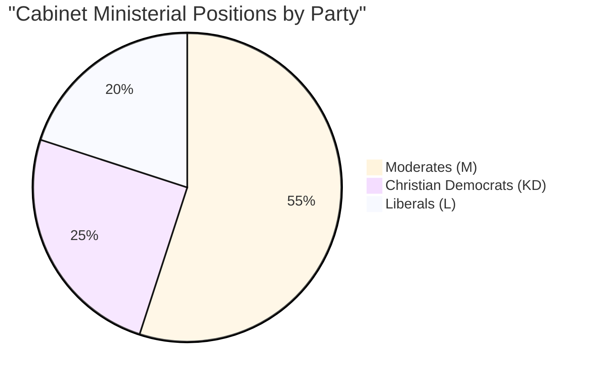

## Coalition Structure

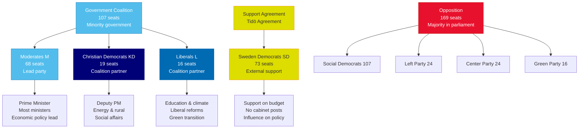

## Coalition Stability Index

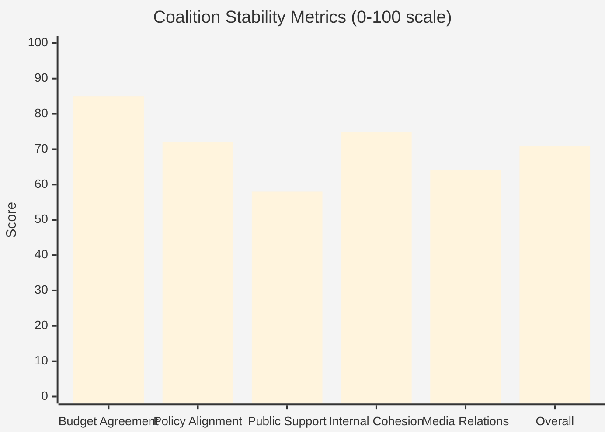

## Ministerial Performance Scorecard

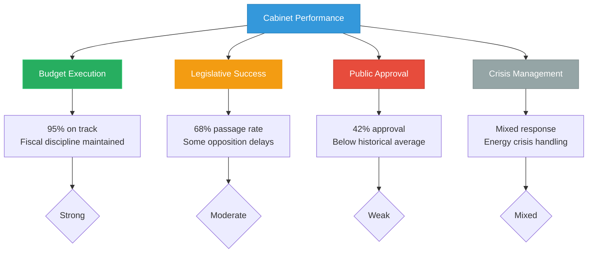

## Policy Priority Matrix

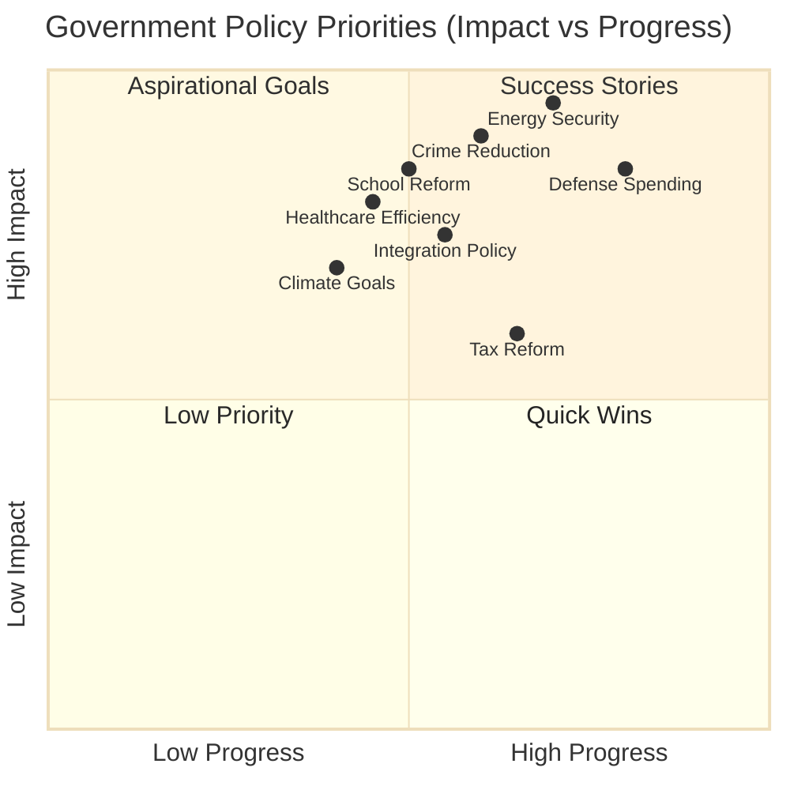

## Cabinet Timeline

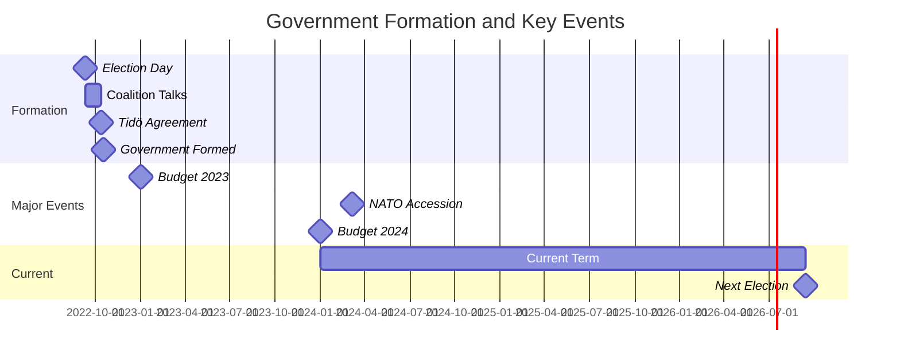

## Ministerial Workload Distribution

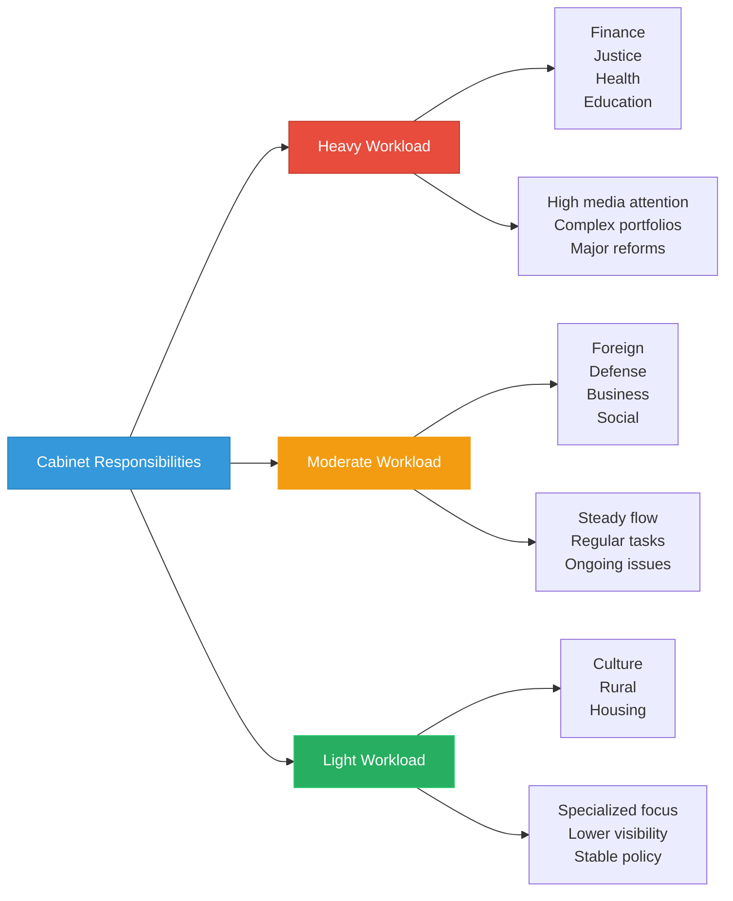

## Coalition Agreement Implementation

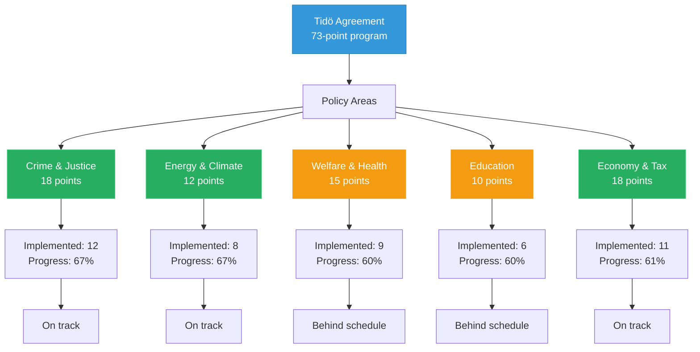

## Inter-Ministerial Coordination

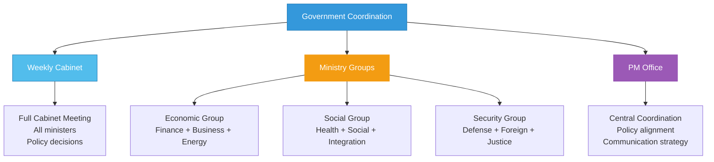

## Cabinet Approval Trends

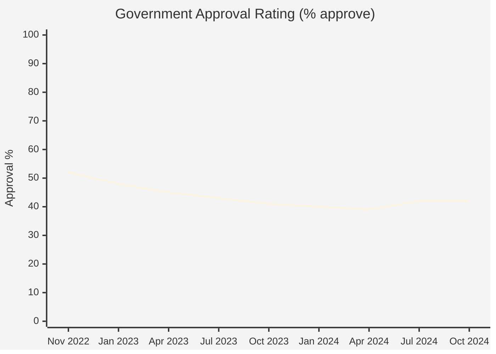

## Cabinet-Parliament Relations

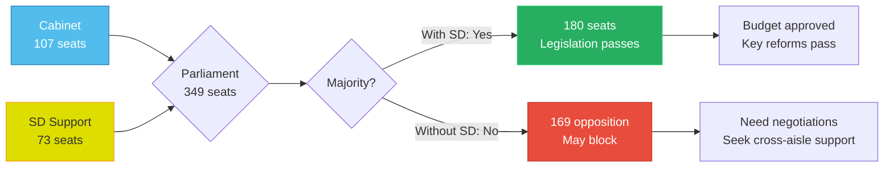

## Risk Assessment

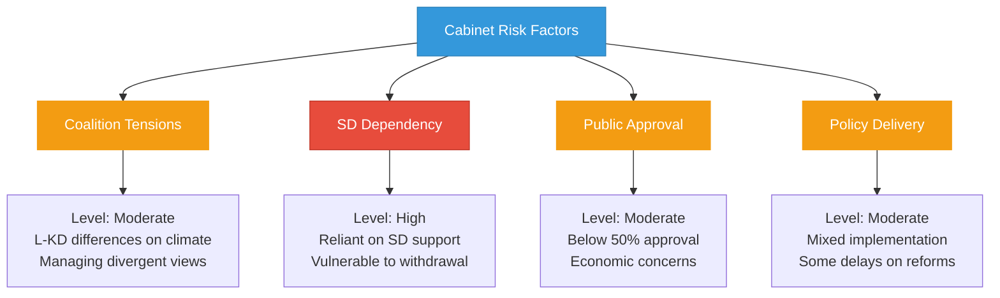

## Features

- **Organizational Chart**: Complete cabinet structure with all ministerial positions
- **Coalition Composition**: Party distribution and power-sharing arrangements
- **Stability Metrics**: Multi-dimensional assessment of coalition health
- **Performance Tracking**: Key performance indicators for cabinet effectiveness
- **Policy Progress**: Implementation status of coalition agreement commitments
- **Approval Trends**: Public opinion tracking over government term
- **Risk Analysis**: Identification of vulnerabilities and challenges

## Usage Scenarios

1. **Government Monitoring**: Track cabinet composition and ministerial changes
2. **Coalition Analysis**: Understand power dynamics and stability factors
3. **Policy Tracking**: Monitor implementation of government program
4. **Performance Assessment**: Evaluate effectiveness across policy areas
5. **Risk Forecasting**: Identify potential coalition stress points
6. **Media Reporting**: Quick reference for government structure and status

## Data Sources

- **Source**: `view_riksdagen_goverment`, `view_riksdagen_minister`
- **JSON Spec**: `government-composition.json`, `minister-profiles.json`
- **Update Frequency**: As government changes (major updates), Weekly (metrics)
- **Cache Duration**: 24 hours
- **Coverage**: Current government (formed October 2022)

## Swedish Government Context

Sweden operates under a parliamentary system where the Prime Minister leads a cabinet appointed with parliament's approval. The current minority government (Moderates, Christian Democrats, Liberals) holds 107 of 349 seats and relies on external support from the Sweden Democrats (73 seats) through the Tidö Agreement. This unique arrangement allows the coalition to command a working majority while maintaining SD outside the formal government structure.

---

**Last Review**: 2024-11-24  
**Visualization Version**: 1.0.0  
**Compliance**: WCAG 2.1 AA
