# Political Intelligence Dashboard

**Last Updated**: 2024-11-24

## Overview

High-level political intelligence dashboard providing comprehensive overview of Swedish Riksdag with key performance indicators, risk metrics, and intelligence products.

## System Health Overview

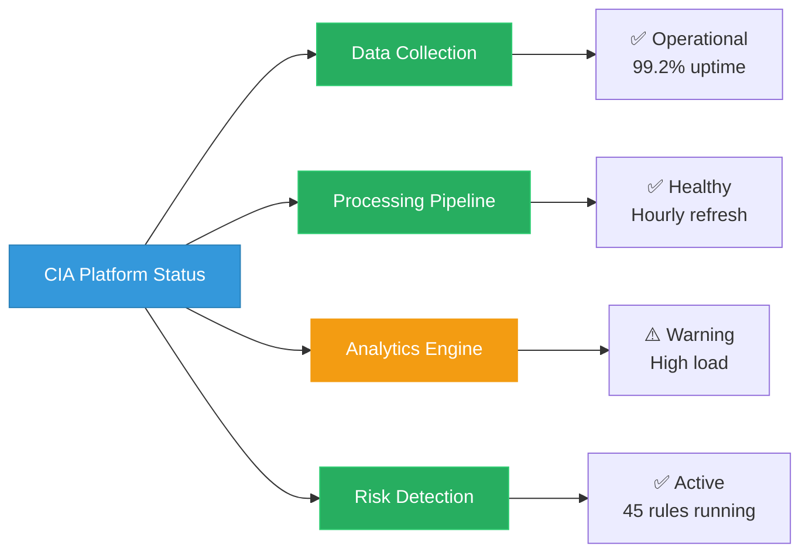

## Key Performance Indicators

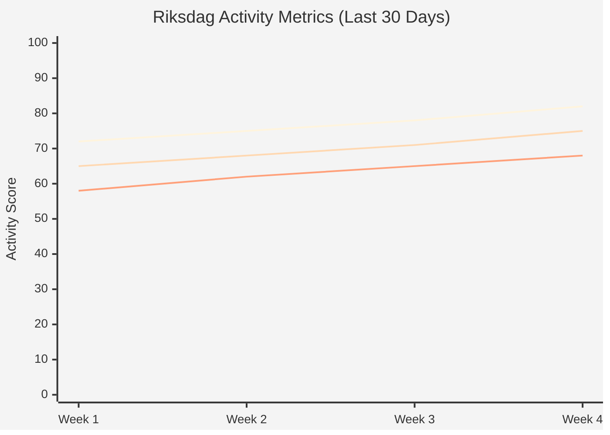

## Political Risk Heat Map

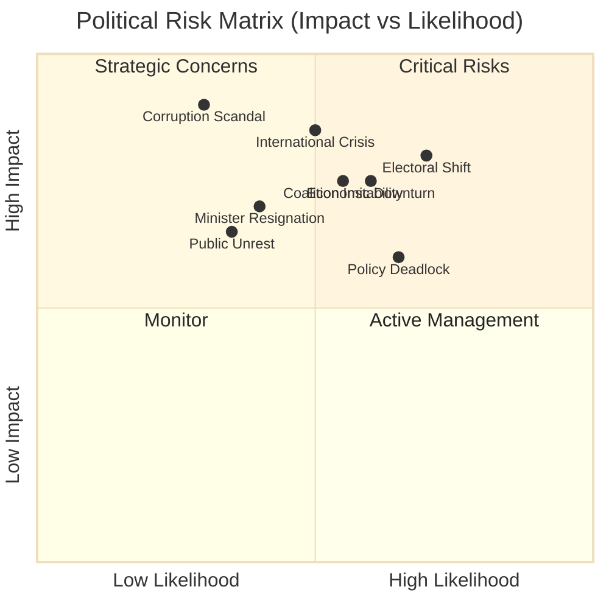

## Data Source Health

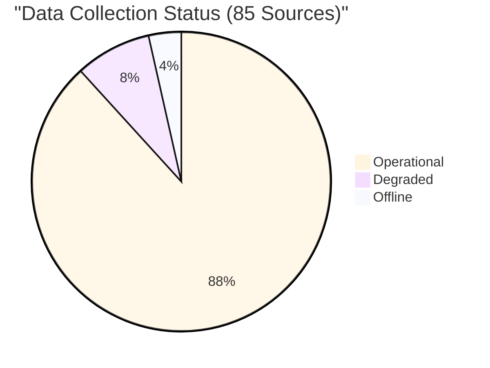

## Intelligence Products Status

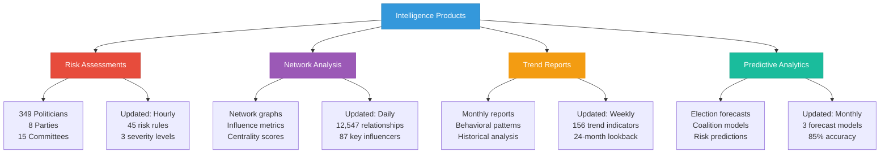

## Real-Time Activity Monitor

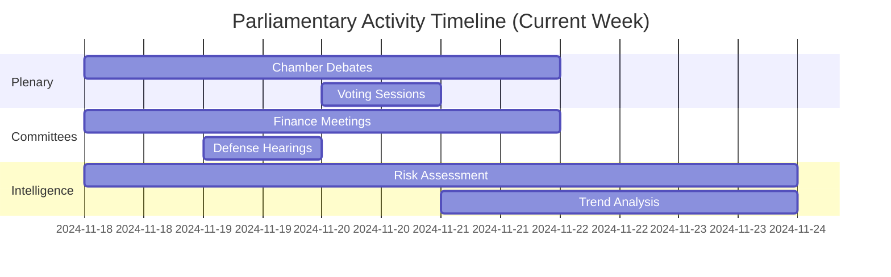

## Risk Rule Distribution

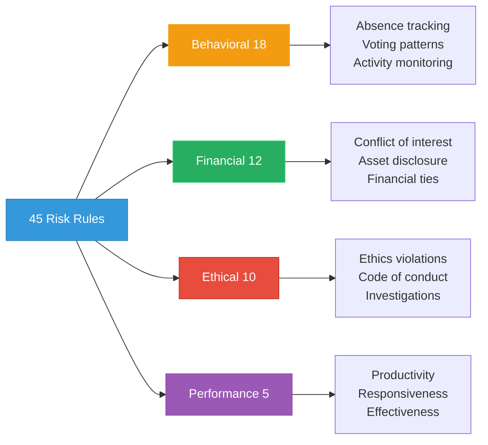

## Data Pipeline Flow

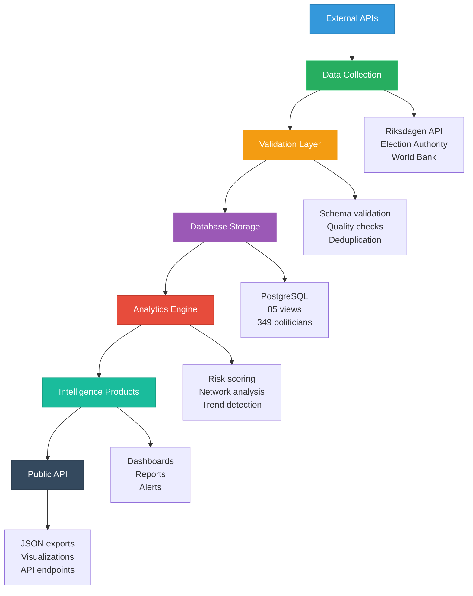

## Coverage Metrics

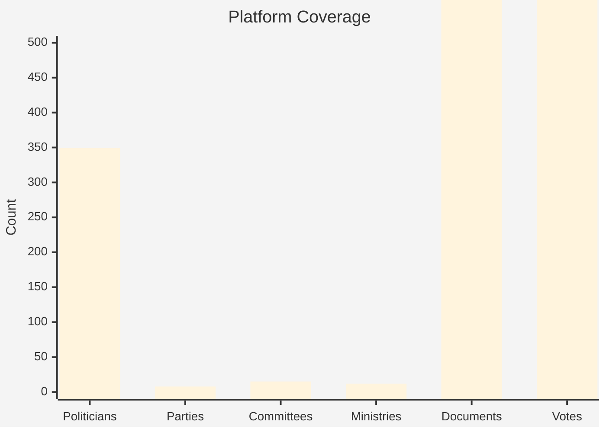

## Intelligence Confidence Levels

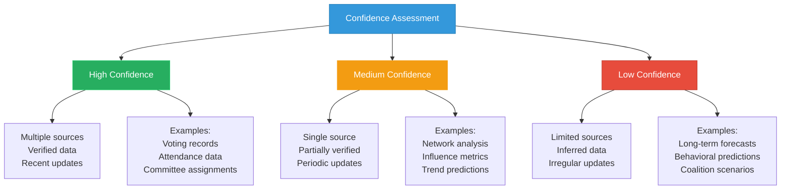

## Top Risk Categories

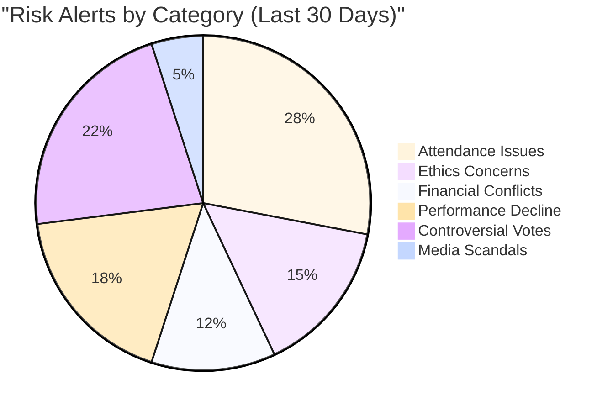

## User Engagement Trends

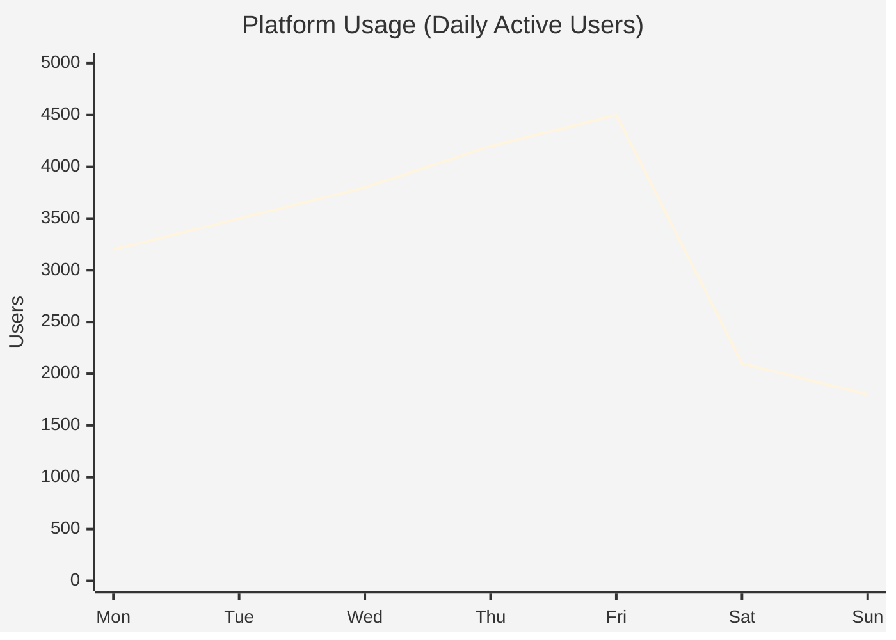

## Alert Priority Distribution

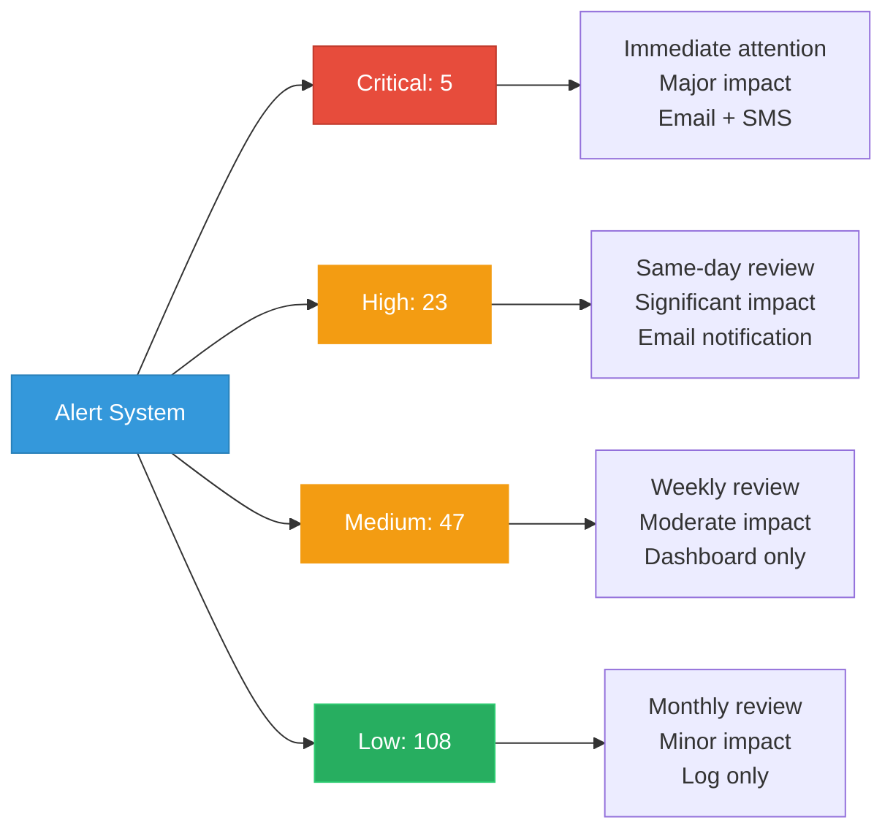

## Database Performance

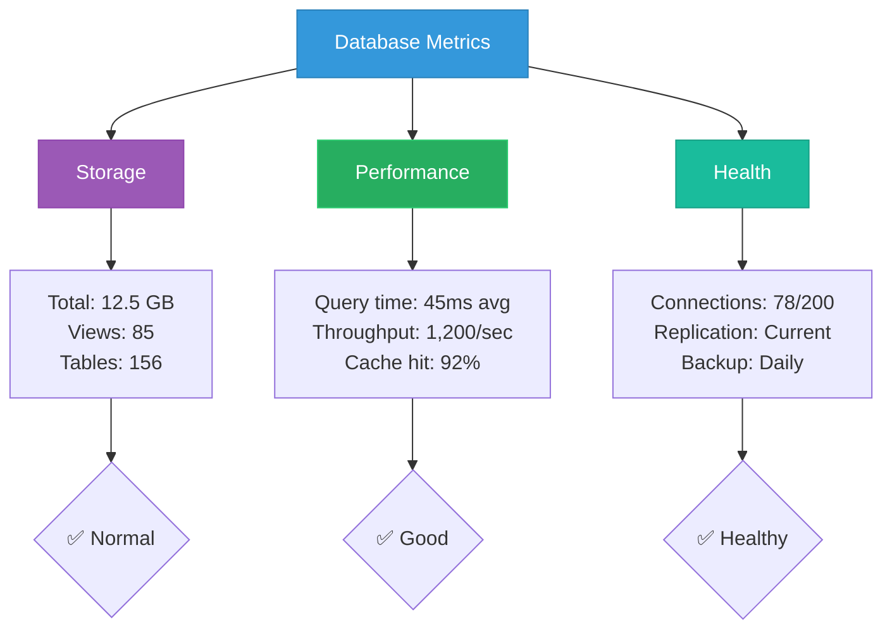

## Intelligence Production Timeline

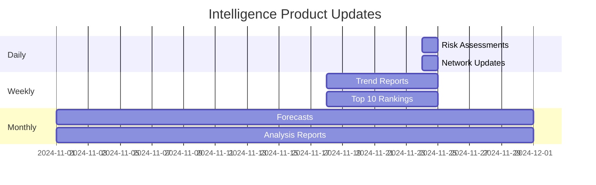

## API Performance

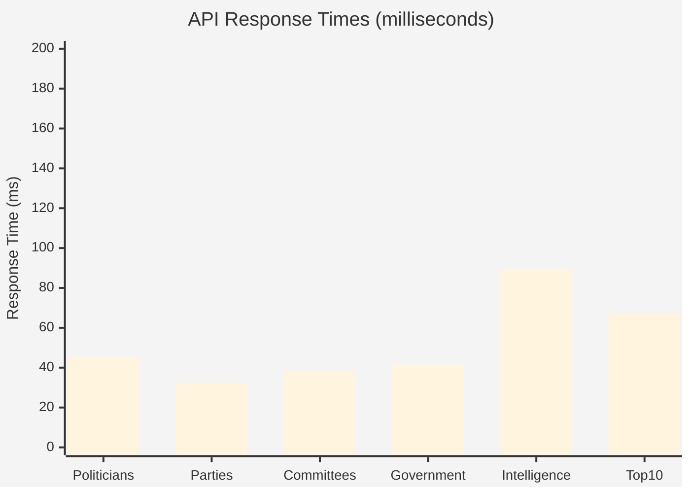

## Features

- **System Health**: Real-time monitoring of data collection and processing
- **KPI Dashboard**: Key metrics tracking parliamentary activity
- **Risk Heat Map**: Visual representation of political risks by impact and likelihood
- **Intelligence Products**: Status of all analytical outputs
- **Data Pipeline**: Complete flow from collection to public API
- **Alert System**: Priority-based notification system
- **Performance Metrics**: Database, API, and system performance tracking
- **Production Timeline**: Update schedules for all intelligence products

## Usage Scenarios

1. **Platform Monitoring**: Real-time health check of CIA infrastructure
2. **Risk Overview**: High-level assessment of current political risks
3. **Data Quality**: Verification of source availability and freshness
4. **Performance Tracking**: System optimization and capacity planning
5. **Intelligence Briefing**: Quick overview for stakeholders
6. **Operational Dashboard**: Daily operational management

## Data Sources

- **Primary Views** (All 85 documented views):
  - `view_riksdagen_intelligence_dashboard` - Unified intelligence dashboard with KPIs
  - `view_riksdagen_voting_anomaly_detection` - Voting anomalies and defection risk
  - `view_riksdagen_coalition_alignment_matrix` - Coalition probability matrix
  - `view_politician_behavioral_trends` - Behavioral pattern analysis
  - `view_politician_risk_summary` - Aggregated risk indicators
  - `view_risk_score_evolution` - Risk score temporal evolution
  - `view_riksdagen_crisis_resilience_indicators` - Crisis performance metrics
- **System Metrics**:
  - Application logs and performance data
  - Database health indicators (connections, query times, cache hit rates)
  - Data collection status from external APIs (Riksdagen, Election Authority, World Bank)
- **Risk Rules Framework**:
  - 45-50 Drools-based behavioral detection rules
  - Categories: Politician (24), Party (10), Committee (4), Ministry (4), Decision Pattern (5)
  - Severity levels: MINOR (10-49), MAJOR (50-99), CRITICAL (100+)
- **Intelligence Products Status**:
  - Risk assessments (349 politicians, 8 parties, 15 committees)
  - Network analysis (12,547 relationships, 87 key influencers)
  - Trend reports (156 indicators, 24-month lookback)
  - Predictive analytics (3 forecast models, documented accuracy)
- **JSON Spec**: `dashboard-metrics.json`, `system-health.json`
- **Update Frequency**: Real-time (system metrics), Hourly (intelligence products)
- **Cache Duration**: 5 minutes (system metrics), 1 hour (intelligence products)
- **Coverage**: Complete CIA platform infrastructure and all intelligence products

## Technical Architecture

The CIA platform operates on a sophisticated intelligence infrastructure:
- **Data Layer**: PostgreSQL with 85 analytical views processing 349 politicians, 8 parties, 15 committees
- **Analytics Engine**: 45 Drools-based risk rules with behavioral, financial, ethical, and performance categories
- **Update Cycle**: Hourly data refresh from Riksdagen API, daily network analysis, weekly trend reports
- **API Layer**: RESTful JSON endpoints with sub-100ms response times
- **Intelligence Products**: Risk assessments, network graphs, trend reports, predictive models

---

**Last Review**: 2024-11-24  
**Visualization Version**: 1.0.0  
**Compliance**: WCAG 2.1 AA
