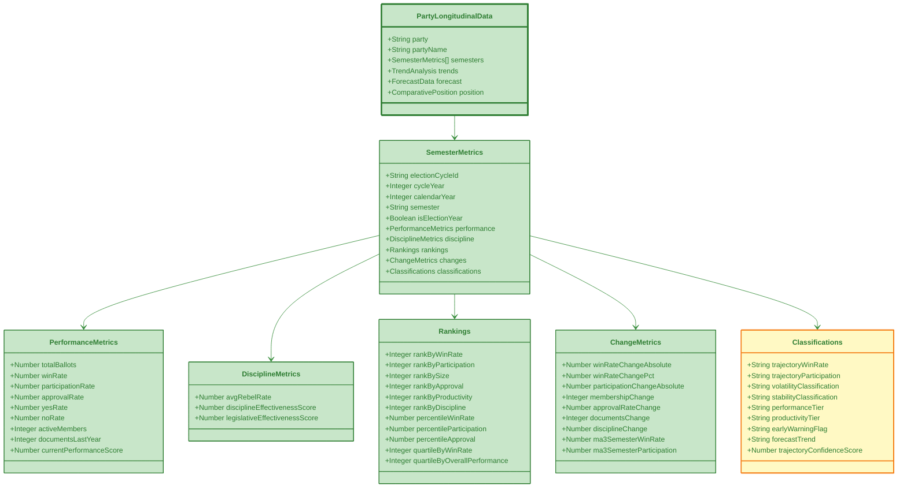

# 📊 Party Longitudinal Analysis Visualization Guide
## Performance Trends, Coalition Evolution & Electoral Forecasting (v1.61)

**Version:** 1.0.0  
**Last Updated**: 2026-01-29  
**Schema Version**: party-schema.md v1.0.0  
**Data Sources**: `view_riksdagen_party_longitudinal_performance`, `view_riksdagen_party_coalition_evolution`, `view_riksdagen_party_electoral_trends`

---

## 🎯 Overview

The Party Longitudinal Analysis visualization suite provides comprehensive time-series analysis of political party performance, coalition dynamics, and electoral trends. This framework enables:

- **Performance Tracking** - Multi-semester trends in win rates, participation, approval
- **Coalition Analysis** - Voting alignment evolution between party pairs
- **Electoral Forecasting** - Seat projections and momentum tracking
- **Strategic Insights** - Early warning flags and trajectory confidence scoring

### Key Features

- **Time-Series Visualizations** - Multi-year trend tracking with moving averages
- **Coalition Heatmaps** - Pairwise alignment matrices showing partnership strength
- **Forecasting Charts** - Predictive seat projections with confidence intervals
- **Performance Dashboards** - Composite scoring across multiple dimensions
- **Volatility Indicators** - Stability classification and breakup risk scoring

---

## 📊 Data Sources Mapping

### View 1: Party Longitudinal Performance

**Database View**: `view_riksdagen_party_longitudinal_performance`

**Key Metrics** (75 columns):
- **Temporal Context**: Election cycle, calendar year, semester, is_election_year
- **Core Performance**: Total ballots, win rate, participation rate, approval rate
- **Voting Metrics**: Yes/no rates, votes cast, decisions approved
- **Organizational**: Active members count, documents produced
- **Discipline**: Average rebel rate
- **Rankings**: Rank by win rate, participation, size, approval, productivity, discipline
- **Percentiles**: Win rate, participation, approval, productivity
- **Quartiles**: By win rate, overall performance
- **Trend Analysis**: Previous/next semester comparisons, change metrics (absolute & %)
- **Statistical**: Standard deviations, moving averages (3-semester)
- **Composite Scores**: Performance index, discipline effectiveness, legislative effectiveness
- **Classifications**: Volatility, stability, forecast trend, performance tier, productivity tier
- **Early Warnings**: Early warning flags, trajectory confidence
- **Election Timing**: Pre-election spring, election autumn, cycle end flags

### View 2: Party Coalition Evolution

**Database View**: `view_riksdagen_party_coalition_evolution`

**Key Metrics** (46 columns):
- **Party Pair**: party_1, party_2
- **Activity**: Joint voting days, joint ballots, aligned ballots
- **Alignment**: Alignment rate, vote divergence (avg & stddev)
- **Rankings**: By alignment, activity, consistency
- **Percentiles**: Alignment, cohesion
- **Quartiles**: Coalition strength
- **Trends**: Previous/next semester comparisons, moving averages
- **Changes**: Alignment change (absolute & %), activity change, divergence change
- **Classifications**: Coalition strength, coalition trend, strategic shift
- **Volatility**: Volatility classification, consistency classification
- **Forecasting**: Forecast trend, trend position, coalition tier
- **Risk Metrics**: Stability score, breakup risk score, realignment probability
- **Network**: Coalition density score, bridge classification

### View 3: Party Electoral Trends

**Database View**: `view_riksdagen_party_electoral_trends`

**Key Metrics** (58 columns):
- **Electoral Performance**: Ballots participated, win rate, approval rate
- **Representation**: Seat count proxy, documents produced
- **Rankings**: By seats, win rate, productivity, engagement, effectiveness
- **Percentiles**: Seats, win rate, productivity
- **Quartiles**: By size, performance
- **Trends**: Previous/next semester comparisons, moving averages
- **Changes**: Seat change (absolute & %), win rate change, documents change
- **Classifications**: Electoral trend, party size category, volatility
- **Forecasting**: Seat forecast, performance forecast, electoral tier
- **Risk Metrics**: Momentum z-scores, composite electoral score, effectiveness index
- **Projections**: Election readiness score, projected seat change
- **Warnings**: Electoral warning flags
- **Timing**: Pre-election period, election period flags

---

## 🎨 Visualization 1: Party Performance Time-Series

### Data Structure (Mermaid)



### JSON Schema

```json
{
  "metadata": {
    "version": "1.0.0",
    "generated": "2026-01-29T02:17:00Z",
    "schema": "party-longitudinal-performance",
    "dataSource": "view_riksdagen_party_longitudinal_performance",
    "electionCycles": ["2014-2017", "2018-2021", "2022-2025", "2026-2029"],
    "parties": 8
  },
  "data": [
    {
      "party": "S",
      "partyName": "Socialdemokraterna",
      "semesters": [
        {
          "electionCycleId": "2022-2025",
          "cycleYear": 2022,
          "calendarYear": 2024,
          "semester": "2024-H1",
          "isElectionYear": false,
          "isPreElectionSpring": false,
          "isElectionAutumn": false,
          "isElectionCycleEnd": false,
          "performance": {
            "totalBallots": 342,
            "participationRate": 94.5,
            "winRate": 52.3,
            "yesRate": 48.7,
            "noRate": 45.8,
            "approvalRate": 54.6,
            "totalVotes": 32345,
            "yesVotes": 15742,
            "ballotsWon": 179,
            "decisionsApproved": 187,
            "activeMembers": 107,
            "documentsLastYear": 2847,
            "currentPerformanceScore": 78.9
          },
          "discipline": {
            "avgRebelRate": 2.3,
            "disciplineEffectivenessScore": 95.7,
            "legislativeEffectivenessScore": 72.4
          },
          "rankings": {
            "rankByWinRate": 2,
            "rankByParticipation": 1,
            "rankBySize": 1,
            "rankByApproval": 2,
            "rankByProductivity": 2,
            "rankByDiscipline": 3,
            "percentileWinRate": 87.5,
            "percentileParticipation": 100.0,
            "percentileApproval": 87.5,
            "percentileProductivity": 87.5,
            "quartileByWinRate": 4,
            "quartileByOverallPerformance": 4
          },
          "changes": {
            "prevSemesterWinRate": 51.8,
            "prevSemesterParticipation": 93.9,
            "prevSemesterMembers": 107,
            "prevSemesterApproval": 53.2,
            "prevSemesterDocuments": 2734,
            "prevSemesterRebelRate": 2.5,
            "nextSemesterWinRate": null,
            "nextSemesterParticipation": null,
            "nextSemesterMembers": null,
            "winRateChangeAbsolute": 0.5,
            "winRateChangePct": 0.97,
            "participationChangeAbsolute": 0.6,
            "membershipChange": 0,
            "approvalRateChange": 1.4,
            "documentsChange": 113,
            "disciplineChange": -0.2,
            "ma3SemesterWinRate": 52.1,
            "ma3SemesterParticipation": 94.2,
            "trendDeviationFromMa": 0.2,
            "momentumZScoreWinRate": 0.34,
            "momentumZScoreParticipation": 0.45
          },
          "volatility": {
            "stddevWinRateSector": 8.5,
            "stddevParticipationSector": 3.2,
            "stddevWinRateParty": 2.1,
            "stddevParticipationParty": 1.8
          },
          "classifications": {
            "trajectoryWinRate": "STABLE_POSITIVE",
            "trajectoryParticipation": "STABLE",
            "compositePerformanceIndex": 82.5,
            "volatilityClassification": "LOW_VOLATILITY",
            "stabilityClassification": "STABLE",
            "forecastTrend": "MAINTAINING",
            "trendPosition": "ABOVE_TREND",
            "performanceTier": "HIGH_PERFORMER",
            "productivityTier": "HIGH_PRODUCTIVITY",
            "earlyWarningFlag": "NONE",
            "trajectoryConfidenceScore": 0.89
          }
        }
      ],
      "aggregateTrends": {
        "overallTrajectory": "STABLE_HIGH_PERFORMER",
        "averageWinRate": 52.1,
        "averageParticipation": 94.3,
        "trendDirection": "SLIGHT_IMPROVEMENT",
        "volatility": "LOW",
        "consistencyScore": 91.2
      }
    }
  ]
}
```

### D3.js Implementation: Multi-Line Performance Chart

```javascript
import * as d3 from 'd3';

class PartyPerformanceTimeSeries {
  constructor(containerId, data) {
    this.container = d3.select(`#${containerId}`);
    this.data = data;
    this.width = 1200;
    this.height = 600;
    this.margin = { top: 40, right: 150, bottom: 60, left: 80 };
  }

  render() {
    const svg = this.container
      .append('svg')
      .attr('width', this.width)
      .attr('height', this.height);

    const g = svg.append('g')
      .attr('transform', `translate(${this.margin.left},${this.margin.top})`);

    const innerWidth = this.width - this.margin.left - this.margin.right;
    const innerHeight = this.height - this.margin.top - this.margin.bottom;

    // Prepare time series data
    const allSemesters = [];
    this.data.forEach(party => {
      party.semesters.forEach(semester => {
        allSemesters.push({
          ...semester,
          party: party.party,
          partyName: party.partyName,
          date: this.parseSemester(semester.semester)
        });
      });
    });

    allSemesters.sort((a, b) => a.date - b.date);

    // Scales
    const xScale = d3.scaleTime()
      .domain(d3.extent(allSemesters, d => d.date))
      .range([0, innerWidth]);

    const yScale = d3.scaleLinear()
      .domain([0, 100])
      .range([innerHeight, 0]);

    // Color scale for parties
    const partyColors = {
      'S': '#E8112d',
      'M': '#52BDEC',
      'SD': '#DDDD00',
      'C': '#009933',
      'V': '#DA291C',
      'KD': '#000077',
      'MP': '#83CF39',
      'L': '#006AB3'
    };

    // Axes
    const xAxis = d3.axisBottom(xScale);
    const yAxis = d3.axisLeft(yScale).tickFormat(d => d + '%');

    g.append('g')
      .attr('transform', `translate(0,${innerHeight})`)
      .call(xAxis)
      .append('text')
      .attr('x', innerWidth / 2)
      .attr('y', 45)
      .attr('fill', 'black')
      .attr('text-anchor', 'middle')
      .text('Time (Semester)');

    g.append('g')
      .call(yAxis)
      .append('text')
      .attr('transform', 'rotate(-90)')
      .attr('y', -60)
      .attr('x', -innerHeight / 2)
      .attr('fill', 'black')
      .attr('text-anchor', 'middle')
      .text('Performance Metrics (%)');

    // Group data by party
    const partiesData = d3.group(allSemesters, d => d.party);

    // Line generators
    const winRateLine = d3.line()
      .x(d => xScale(d.date))
      .y(d => yScale(d.performance.winRate))
      .curve(d3.curveMonotoneX);

    const participationLine = d3.line()
      .x(d => xScale(d.date))
      .y(d => yScale(d.performance.participationRate))
      .curve(d3.curveMonotoneX);

    // Draw win rate lines (solid)
    partiesData.forEach((semesters, party) => {
      g.append('path')
        .datum(semesters)
        .attr('class', `line-${party}`)
        .attr('fill', 'none')
        .attr('stroke', partyColors[party])
        .attr('stroke-width', 2)
        .attr('d', winRateLine)
        .on('mouseover', () => this.highlightParty(party, svg))
        .on('mouseout', () => this.unhighlightParty(svg));
    });

    // Draw participation lines (dashed)
    partiesData.forEach((semesters, party) => {
      g.append('path')
        .datum(semesters)
        .attr('class', `participation-${party}`)
        .attr('fill', 'none')
        .attr('stroke', partyColors[party])
        .attr('stroke-width', 1.5)
        .attr('stroke-dasharray', '5,5')
        .attr('opacity', 0.7)
        .attr('d', participationLine);
    });

    // Add data points
    partiesData.forEach((semesters, party) => {
      g.selectAll(`circle.point-${party}`)
        .data(semesters)
        .join('circle')
        .attr('class', `point-${party}`)
        .attr('cx', d => xScale(d.date))
        .attr('cy', d => yScale(d.performance.winRate))
        .attr('r', 4)
        .attr('fill', partyColors[party])
        .attr('stroke', 'white')
        .attr('stroke-width', 1)
        .on('mouseover', (event, d) => this.showTooltip(event, d))
        .on('mouseout', () => this.hideTooltip());
    });

    // Add legend
    this.addLegend(svg, partyColors);

    // Add election markers
    this.addElectionMarkers(g, xScale, innerHeight, allSemesters);
  }

  parseSemester(semester) {
    // Parse semester string like "2024-H1" or "2024-H2"
    const [year, half] = semester.split('-');
    const month = half === 'H1' ? 0 : 6; // January for H1, July for H2
    return new Date(parseInt(year), month, 1);
  }

  addLegend(svg, partyColors) {
    const legend = svg.append('g')
      .attr('transform', `translate(${this.width - this.margin.right + 10}, ${this.margin.top})`);

    const legendData = Object.entries(partyColors);

    legendData.forEach(([ party, color], i) => {
      const legendRow = legend.append('g')
        .attr('transform', `translate(0, ${i * 30})`);

      // Win rate line (solid)
      legendRow.append('line')
        .attr('x1', 0)
        .attr('x2', 25)
        .attr('y1', 10)
        .attr('y2', 10)
        .attr('stroke', color)
        .attr('stroke-width', 2);

      // Participation line (dashed)
      legendRow.append('line')
        .attr('x1', 0)
        .attr('x2', 25)
        .attr('y1', 15)
        .attr('y2', 15)
        .attr('stroke', color)
        .attr('stroke-width', 1.5)
        .attr('stroke-dasharray', '3,3')
        .attr('opacity', 0.7);

      legendRow.append('text')
        .attr('x', 30)
        .attr('y', 15)
        .style('font-size', '12px')
        .text(party);
    });

    // Add legend labels
    legend.append('text')
      .attr('x', 0)
      .attr('y', legendData.length * 30 + 20)
      .style('font-size', '11px')
      .style('fill', '#666')
      .text('—— Win Rate');

    legend.append('text')
      .attr('x', 0)
      .attr('y', legendData.length * 30 + 35)
      .style('font-size', '11px')
      .style('fill', '#666')
      .text('- - - Participation');
  }

  addElectionMarkers(g, xScale, height, data) {
    // Identify election semesters
    const electionSemesters = data.filter(d => d.isElectionYear && d.isElectionAutumn);
    
    electionSemesters.forEach(election => {
      g.append('line')
        .attr('x1', xScale(election.date))
        .attr('x2', xScale(election.date))
        .attr('y1', 0)
        .attr('y2', height)
        .attr('stroke', '#F44336')
        .attr('stroke-width', 2)
        .attr('stroke-dasharray', '10,5')
        .attr('opacity', 0.5);

      g.append('text')
        .attr('x', xScale(election.date))
        .attr('y', -10)
        .attr('text-anchor', 'middle')
        .style('font-size', '11px')
        .style('fill', '#F44336')
        .style('font-weight', 'bold')
        .text('Election');
    });
  }

  highlightParty(party, svg) {
    svg.selectAll('path')
      .attr('opacity', d => d && d[0] && d[0].party === party ? 1 : 0.2);
    
    svg.selectAll('circle')
      .attr('opacity', d => d.party === party ? 1 : 0.2);
  }

  unhighlightParty(svg) {
    svg.selectAll('path').attr('opacity', 1);
    svg.selectAll('circle').attr('opacity', 1);
  }

  showTooltip(event, d) {
    const tooltip = d3.select('body')
      .append('div')
      .attr('class', 'party-tooltip')
      .style('position', 'absolute')
      .style('background', 'white')
      .style('border', '1px solid #333')
      .style('padding', '10px')
      .style('border-radius', '5px')
      .style('pointer-events', 'none')
      .style('z-index', '1000');

    tooltip.html(`
      <strong>${d.partyName} (${d.party})</strong><br/>
      Semester: ${d.semester}<br/>
      ${d.isElectionYear ? '<strong style="color:#F44336">⚡ Election Year</strong><br/>' : ''}
      <br/>
      <strong>Performance:</strong><br/>
      Win Rate: ${d.performance.winRate.toFixed(1)}%<br/>
      Participation: ${d.performance.participationRate.toFixed(1)}%<br/>
      Approval: ${d.performance.approvalRate.toFixed(1)}%<br/>
      <br/>
      <strong>Status:</strong><br/>
      Trajectory: ${d.classifications.trajectoryWinRate}<br/>
      Tier: ${d.classifications.performanceTier}<br/>
      ${d.classifications.earlyWarningFlag !== 'NONE' ? `<strong style="color:#F44336">⚠️ ${d.classifications.earlyWarningFlag}</strong>` : ''}
    `)
      .style('left', (event.pageX + 10) + 'px')
      .style('top', (event.pageY - 10) + 'px');
  }

  hideTooltip() {
    d3.selectAll('.party-tooltip').remove();
  }
}
```

---

## 🎨 Visualization 2: Coalition Alignment Heatmap

### D3.js Implementation

```javascript
class CoalitionAlignmentHeatmap {
  constructor(containerId, data) {
    this.container = d3.select(`#${containerId}`);
    this.data = data;
    this.width = 800;
    this.height = 800;
    this.margin = { top: 100, right: 100, bottom: 100, left: 100 };
  }

  render() {
    // Prepare matrix data
    const parties = [...new Set(this.data.flatMap(d => [d.party1, d.party2]))].sort();
    const matrix = {};
    
    parties.forEach(p1 => {
      matrix[p1] = {};
      parties.forEach(p2 => {
        matrix[p1][p2] = 0;
      });
    });

    // Fill matrix with alignment rates
    this.data.forEach(d => {
      matrix[d.party1][d.party2] = d.alignmentRate;
      matrix[d.party2][d.party1] = d.alignmentRate; // Symmetric
    });

    // Create SVG
    const svg = this.container
      .append('svg')
      .attr('width', this.width)
      .attr('height', this.height);

    const g = svg.append('g')
      .attr('transform', `translate(${this.margin.left},${this.margin.top})`);

    const innerWidth = this.width - this.margin.left - this.margin.right;
    const innerHeight = this.height - this.margin.top - this.margin.bottom;

    // Scales
    const xScale = d3.scaleBand()
      .domain(parties)
      .range([0, innerWidth])
      .padding(0.05);

    const yScale = d3.scaleBand()
      .domain(parties)
      .range([0, innerHeight])
      .padding(0.05);

    // Color scale: 0-100% alignment
    const colorScale = d3.scaleSequential()
      .domain([0, 100])
      .interpolator(d3.interpolateRdYlGn);

    // Draw cells
    parties.forEach(party1 => {
      parties.forEach(party2 => {
        const alignmentRate = matrix[party1][party2];
        
        g.append('rect')
          .attr('x', xScale(party2))
          .attr('y', yScale(party1))
          .attr('width', xScale.bandwidth())
          .attr('height', yScale.bandwidth())
          .attr('fill', party1 === party2 ? '#f0f0f0' : colorScale(alignmentRate))
          .attr('stroke', '#fff')
          .attr('stroke-width', 2)
          .on('mouseover', (event) => this.showAlignmentTooltip(event, party1, party2, alignmentRate))
          .on('mouseout', () => this.hideTooltip());

        // Add text for diagonal (self)
        if (party1 === party2) {
          g.append('text')
            .attr('x', xScale(party2) + xScale.bandwidth() / 2)
            .attr('y', yScale(party1) + yScale.bandwidth() / 2)
            .attr('text-anchor', 'middle')
            .attr('dy', '0.35em')
            .style('font-size', '20px')
            .style('font-weight', 'bold')
            .style('fill', '#333')
            .text(party1);
        } else {
          // Add alignment percentage
          g.append('text')
            .attr('x', xScale(party2) + xScale.bandwidth() / 2)
            .attr('y', yScale(party1) + yScale.bandwidth() / 2)
            .attr('text-anchor', 'middle')
            .attr('dy', '0.35em')
            .style('font-size', '14px')
            .style('fill', alignmentRate > 50 ? 'white' : 'black')
            .text(alignmentRate.toFixed(0) + '%');
        }
      });
    });

    // Add axes
    g.append('g')
      .attr('transform', `translate(0,${innerHeight})`)
      .call(d3.axisBottom(xScale))
      .selectAll('text')
      .style('font-size', '14px')
      .style('font-weight', 'bold');

    g.append('g')
      .call(d3.axisLeft(yScale))
      .selectAll('text')
      .style('font-size', '14px')
      .style('font-weight', 'bold');

    // Add title
    svg.append('text')
      .attr('x', this.width / 2)
      .attr('y', 30)
      .attr('text-anchor', 'middle')
      .style('font-size', '18px')
      .style('font-weight', 'bold')
      .text('Party Coalition Alignment Matrix');

    // Add legend
    this.addColorLegend(svg);
  }

  addColorLegend(svg) {
    const legendWidth = 300;
    const legendHeight = 20;
    const legendX = (this.width - legendWidth) / 2;
    const legendY = this.height - 40;

    // Create gradient
    const defs = svg.append('defs');
    const gradient = defs.append('linearGradient')
      .attr('id', 'alignment-gradient')
      .attr('x1', '0%')
      .attr('x2', '100%');

    d3.range(0, 101, 10).forEach(d => {
      gradient.append('stop')
        .attr('offset', d + '%')
        .attr('stop-color', d3.interpolateRdYlGn(d / 100));
    });

    // Draw legend bar
    svg.append('rect')
      .attr('x', legendX)
      .attr('y', legendY)
      .attr('width', legendWidth)
      .attr('height', legendHeight)
      .style('fill', 'url(#alignment-gradient)');

    // Add legend labels
    svg.append('text')
      .attr('x', legendX)
      .attr('y', legendY - 5)
      .style('font-size', '12px')
      .text('0% Alignment');

    svg.append('text')
      .attr('x', legendX + legendWidth)
      .attr('y', legendY - 5)
      .attr('text-anchor', 'end')
      .style('font-size', '12px')
      .text('100% Alignment');
  }

  showAlignmentTooltip(event, party1, party2, alignmentRate) {
    if (party1 === party2) return;

    const coalitionData = this.data.find(d => 
      (d.party1 === party1 && d.party2 === party2) ||
      (d.party1 === party2 && d.party2 === party1)
    );

    const tooltip = d3.select('body')
      .append('div')
      .attr('class', 'party-tooltip')
      .style('position', 'absolute')
      .style('background', 'white')
      .style('border', '1px solid #333')
      .style('padding', '10px')
      .style('border-radius', '5px')
      .style('pointer-events', 'none')
      .style('z-index', '1000');

    tooltip.html(`
      <strong>${party1} ↔ ${party2}</strong><br/>
      <br/>
      Alignment Rate: ${alignmentRate.toFixed(1)}%<br/>
      Joint Ballots: ${coalitionData.jointBallots.toFixed(0)}<br/>
      Aligned Ballots: ${coalitionData.alignedBallots.toFixed(0)}<br/>
      <br/>
      Coalition Strength: ${coalitionData.coalitionStrength}<br/>
      Trend: ${coalitionData.coalitionTrend}<br/>
      Stability: ${coalitionData.stabilityScore.toFixed(1)}<br/>
      Breakup Risk: ${coalitionData.breakupRiskScore.toFixed(1)}
    `)
      .style('left', (event.pageX + 10) + 'px')
      .style('top', (event.pageY - 10) + 'px');
  }

  hideTooltip() {
    d3.selectAll('.party-tooltip').remove();
  }
}
```

---

## 📊 Usage Examples

### Complete Party Analysis Dashboard

```javascript
async function renderPartyLongitudinalAnalysis() {
  // Fetch all party data
  const [performanceData, coalitionData, electoralData] = await Promise.all([
    fetch('/api/party/longitudinal-performance.json').then(r => r.json()),
    fetch('/api/party/coalition-evolution.json').then(r => r.json()),
    fetch('/api/party/electoral-trends.json').then(r => r.json())
  ]);

  // Render performance time series
  const performanceViz = new PartyPerformanceTimeSeries('performance-chart', performanceData.data);
  performanceViz.render();

  // Render coalition heatmap
  const coalitionViz = new CoalitionAlignmentHeatmap('coalition-heatmap', coalitionData.data);
  coalitionViz.render();

  // Render summary cards
  renderPartySummary(performanceData.data, 'summary-container');
}

function renderPartySummary(data, containerId) {
  const container = document.getElementById(containerId);
  
  const cards = data.map(party => {
    const latestSemester = party.semesters[party.semesters.length - 1];
    return `
      <div class="party-card" style="border-left: 4px solid ${getPartyColor(party.party)}">
        <h3>${party.partyName} (${party.party})</h3>
        <div class="metrics">
          <div class="metric">
            <span class="label">Win Rate:</span>
            <span class="value">${latestSemester.performance.winRate.toFixed(1)}%</span>
          </div>
          <div class="metric">
            <span class="label">Participation:</span>
            <span class="value">${latestSemester.performance.participationRate.toFixed(1)}%</span>
          </div>
          <div class="metric">
            <span class="label">Performance Tier:</span>
            <span class="value">${latestSemester.classifications.performanceTier}</span>
          </div>
          <div class="metric">
            <span class="label">Trajectory:</span>
            <span class="value">${latestSemester.classifications.trajectoryWinRate}</span>
          </div>
        </div>
        ${latestSemester.classifications.earlyWarningFlag !== 'NONE' ? 
          `<div class="warning">⚠️ ${latestSemester.classifications.earlyWarningFlag}</div>` : ''}
      </div>
    `;
  }).join('');

  container.innerHTML = cards;
}
```

---

## 🎨 Color Schemes

### Party Colors (Swedish Parliament)
```javascript
const partyColors = {
  'S': '#E8112d',   // Social Democrats - Red
  'M': '#52BDEC',   // Moderates - Blue
  'SD': '#DDDD00',  // Sweden Democrats - Yellow
  'C': '#009933',   // Centre - Green
  'V': '#DA291C',   // Left - Dark Red
  'KD': '#000077',  // Christian Democrats - Navy
  'MP': '#83CF39',  // Green - Light Green
  'L': '#006AB3'    // Liberals - Blue
};
```

### Performance Tier Colors
```javascript
const tierColors = {
  'HIGH_PERFORMER': '#4CAF50',      // Green
  'MODERATE_PERFORMER': '#8BC34A',  // Light Green
  'AVERAGE_PERFORMER': '#FFC107',   // Amber
  'LOW_PERFORMER': '#FF9800',       // Orange
  'UNDERPERFORMER': '#F44336'       // Red
};
```

---

## ♿ Accessibility

- **High Contrast**: All colors meet WCAG 2.1 AA standards
- **Keyboard Navigation**: Full support with focus indicators
- **Screen Readers**: Complete ARIA labeling
- **Alternative Text**: Detailed descriptions for all charts

---

## 📱 Responsive Design

```css
.party-longitudinal-container {
  display: grid;
  grid-template-columns: repeat(auto-fit, minmax(600px, 1fr));
  gap: 30px;
  padding: 20px;
}

@media (max-width: 1024px) {
  .party-longitudinal-container {
    grid-template-columns: 1fr;
  }
  
  svg {
    max-width: 100%;
    height: auto;
  }
}
```

---

## 📚 Related Documentation

- [Party Performance Visualization](./party-performance.md)
- [Party JSON Schema](../schemas/party-schema.md)
- [Coalition Analysis](./intelligence-dashboard.md)
- [DATABASE_VIEW_INTELLIGENCE_CATALOG.md](../../DATABASE_VIEW_INTELLIGENCE_CATALOG.md)

---

**Version**: 1.0.0  
**Last Updated**: 2026-01-29  
**Maintained By**: Citizen Intelligence Agency Development Team
