# Party Performance Visualization

**Last Updated**: 2024-11-24

## Overview

Visualization guide for party performance data including electoral trends, coalition dynamics, voting cohesion, and momentum analysis.

## Data Structure

## Electoral Trend Flow

## Party Dashboard Components

## Electoral Trend Timeline

## Coalition Network

## Performance Comparison

## Voting Cohesion Analysis

## Momentum Tracker

## Poll Data Structure

## Seat Projection Model

```mermaid
graph LR
    A[Current Polls] -->|weight: 60%| D[Projection Model]
    B[Historical Trends] -->|weight: 25%| D
    C[Regional Factors] -->|weight: 15%| D
    
    D --> E[Projected Seats: 112]
    D --> F[Confidence: ±4 seats]
    D --> G[Probability: 85%]
    
    style A fill:#52BDEC
    style B fill:#029E73
    style C fill:#DE8F05
    style D fill:#e1f5ff
    style E fill:#029E73
    style F fill:#fff3cd
    style G fill:#029E73
```

## Coalition Stability Matrix

## Party Comparison Dashboard

## User Interaction States

## Regional Support Map

## Performance Over Time

## Features

- **Electoral Trends**: Poll tracking, seat projections, historical comparison
- **Coalition Dynamics**: Partner relationships, alignment scores, stability metrics
- **Performance Metrics**: Voting cohesion, activity levels, influence scores
- **Momentum Analysis**: Velocity, acceleration, trajectory predictions
- **Regional Support**: Geographic breakdown, constituency strength
- **Comparative Analysis**: Multi-party comparison across metrics

## Usage Scenarios

1. **Election Analysis**: Track polling trends and seat projections
2. **Coalition Monitoring**: Assess government stability and partner relationships
3. **Party Strategy**: Compare performance across multiple metrics
4. **Media Reporting**: Quick access to latest polls and trends
5. **Voter Information**: Understand party positions and performance

## Swedish Parliamentary Context

---

**JSON Source**: `/v1.0.0/parties/{party-code}.json`
**Update Frequency**: Daily (polls), Weekly (trends)
**Cache Duration**: 1 hour
**Bundle Size**: ~3KB (single party), ~15KB (all parties comparison)
