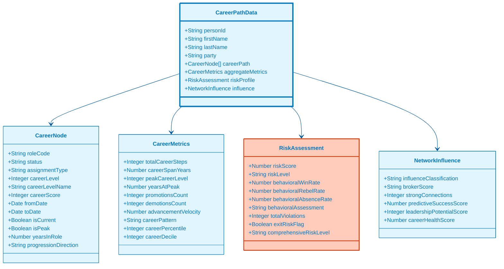

# 📈 Politician Career Analysis Visualization Guide
## Career Path, Role Evolution & Trajectory Analytics (v1.58)

**Version:** 1.0.0  
**Last Updated**: 2026-01-29  
**Schema Version**: politician-schema.md v1.0.0  
**Data Sources**: `view_riksdagen_politician_career_path_10level`, `view_riksdagen_politician_role_evolution`, `view_riksdagen_politician_career_trajectory`

---

## 🎯 Overview

The Politician Career Analysis visualization provides comprehensive insights into political career progression through three complementary views:

1. **Career Path Analysis** - 10-level career progression tracking with comprehensive behavioral and risk metrics
2. **Role Evolution** - Temporal progression of political roles and responsibilities
3. **Career Trajectory** - Election-cycle based performance trends and career stage analysis

### Key Features

- **Career Progression Visualization** - Sankey diagrams showing role transitions
- **Performance Timeline** - Multi-metric performance tracking across career stages
- **Risk Assessment** - Comprehensive risk scoring with behavioral, network, and predictive factors
- **Comparative Rankings** - Career percentile and decile rankings
- **Pattern Recognition** - Career pattern classification (steady climber, fast track, plateau, etc.)

---

## 📊 Data Sources Mapping

### View 1: Career Path (10-Level Classification)

**Database View**: `view_riksdagen_politician_career_path_10level`

**Key Metrics** (68 columns):
- **Career Hierarchy**: 10 career levels (1-10), career scores, progression direction
- **Temporal Metrics**: Career span years, years in role, years at peak
- **Progression Analysis**: Promotions/demotions count, advancement velocity
- **Behavioral Metrics**: Win rate, rebel rate, absence rate, attendance status
- **Risk Assessment**: Risk score, risk level, violation counts by category
- **Network Influence**: Influence classification, broker score, strong connections
- **Predictive Analytics**: Success score, leadership potential, retention risk

**Career Level Classification**:
```
Level 10: Prime Minister (1000+ weight)
Level 9:  Deputy PM, Ministers (850-999 weight)
Level 8:  Speaker (800-849 weight)
Level 7:  Deputy Speaker, Party Leaders (700-799 weight)
Level 6:  Committee Chairs (600-699 weight)
Level 5:  Vice Chairs, Party Secretary (500-599 weight)
Level 4:  MPs (400-499 weight)
Level 3:  Committee Members (300-399 weight)
Level 2:  Deputies (100-299 weight)
Level 1:  Entry Level (<100 weight)
```

### View 2: Role Evolution

**Database View**: `view_riksdagen_politician_role_evolution`

**Key Metrics** (25 columns):
- Role sequence and tier classification
- Total days and instances in each role
- Peak role weight tracking
- Career first and last year
- Progression pattern analysis
- Advancement velocity calculation

### View 3: Career Trajectory

**Database View**: `view_riksdagen_politician_career_trajectory`

**Key Metrics** (19 columns):
- Election cycle tracking
- Performance metrics per cycle (attendance, win rate)
- Leadership role counts
- Document authorship tracking
- Career stage classification
- Performance trend analysis

---

## 🎨 Visualization 1: Career Path Sankey Diagram

### Data Structure (Mermaid)



### JSON Schema

```json
{
  "metadata": {
    "version": "1.0.0",
    "generated": "2026-01-29T02:17:00Z",
    "schema": "politician-career-path",
    "dataSource": "view_riksdagen_politician_career_path_10level",
    "recordCount": 349
  },
  "data": [
    {
      "personId": "0123456789",
      "firstName": "Anna",
      "lastName": "Andersson",
      "party": "S",
      "careerPath": [
        {
          "roleCode": "Riksdagsledamot",
          "status": "Active",
          "assignmentType": "Riksdagsledamot",
          "orgCode": "RIKSDAG",
          "fromDate": "2014-09-29",
          "toDate": "2018-10-01",
          "isCurrent": false,
          "careerLevel": 4,
          "careerLevelName": "Member of Parliament",
          "careerScore": 400,
          "careerStep": 1,
          "yearsInRole": 4.0,
          "progressionDirection": "STABLE",
          "isPeak": false
        },
        {
          "roleCode": "Ordförande",
          "status": "Active",
          "assignmentType": "Committee Chair",
          "orgCode": "FiU",
          "fromDate": "2018-10-01",
          "toDate": null,
          "isCurrent": true,
          "careerLevel": 6,
          "careerLevelName": "Committee Chair",
          "careerScore": 600,
          "careerStep": 2,
          "yearsInRole": 7.3,
          "progressionDirection": "UPWARD",
          "levelChange": 2,
          "scoreChange": 200,
          "isPeak": true
        }
      ],
      "aggregateMetrics": {
        "totalCareerSteps": 2,
        "careerSpanYears": 11.3,
        "careerStartDate": "2014-09-29",
        "careerEndDate": "2026-01-29",
        "careerStartYear": 2014,
        "careerEndYear": 2026,
        "peakCareerLevel": 6,
        "peakCareerScore": 600,
        "yearsAtPeak": 7.3,
        "promotionsCount": 1,
        "demotionsCount": 0,
        "avgCareerScore": 500.0,
        "careerScoreVolatility": 100.0,
        "avgYearsPerPromotion": 4.0,
        "advancementVelocity": 17.7,
        "careerPattern": "STEADY_CLIMBER",
        "overallCareerRank": 45,
        "careerPercentile": 87.1,
        "careerDecile": 9,
        "careerStage": "PEAK",
        "isTypicalCareerPath": true,
        "isAtypicalCareerPath": false
      },
      "riskProfile": {
        "riskScore": 15.3,
        "riskLevel": "LOW",
        "totalViolations": 1,
        "absenteeismViolations": 1,
        "effectivenessViolations": 0,
        "disciplineViolations": 0,
        "behavioralWinRate": 78.5,
        "behavioralRebelRate": 2.3,
        "behavioralAbsenceRate": 12.1,
        "behavioralAssessment": "EXCELLENT_BEHAVIOR",
        "attendanceStatus": "GOOD_ATTENDANCE",
        "effectivenessStatus": "EFFECTIVE",
        "disciplineStatus": "PARTY_LINE",
        "comprehensiveRiskLevel": "LOW_RISK",
        "downwardSpiralFlag": false,
        "exitRiskScore": 5,
        "highRetentionRiskFlag": false
      },
      "networkInfluence": {
        "influenceClassification": "HIGH_INFLUENCE",
        "brokerScore": "MODERATE_BROKER",
        "strongConnections": 23,
        "predictiveSuccessScore": 82.5,
        "leadershipPotentialScore": 85,
        "careerHealthScore": 88.7
      }
    }
  ]
}
```

### D3.js Implementation: Career Path Sankey

```javascript
import * as d3 from 'd3';
import { sankey, sankeyLinkHorizontal } from 'd3-sankey';

class CareerPathSankey {
  constructor(containerId, data) {
    this.container = d3.select(`#${containerId}`);
    this.data = data;
    this.width = 1200;
    this.height = 800;
    this.margin = { top: 20, right: 120, bottom: 20, left: 120 };
  }

  render() {
    // Transform career path data into Sankey format
    const nodes = [];
    const links = [];
    const nodeMap = new Map();

    this.data.careerPath.forEach((step, index) => {
      const nodeId = `${step.roleCode}_${index}`;
      const node = {
        id: nodeId,
        name: step.roleCode,
        level: step.careerLevel,
        score: step.careerScore,
        years: step.yearsInRole,
        isCurrent: step.isCurrent,
        isPeak: step.isPeak
      };
      
      nodes.push(node);
      nodeMap.set(nodeId, nodes.length - 1);

      // Create link from previous step
      if (index > 0) {
        const prevNodeId = `${this.data.careerPath[index - 1].roleCode}_${index - 1}`;
        links.push({
          source: nodeMap.get(prevNodeId),
          target: nodeMap.get(nodeId),
          value: step.yearsInRole
        });
      }
    });

    // Create SVG
    const svg = this.container
      .append('svg')
      .attr('width', this.width)
      .attr('height', this.height);

    const g = svg.append('g')
      .attr('transform', `translate(${this.margin.left},${this.margin.top})`);

    // Configure Sankey generator
    const sankeyGenerator = sankey()
      .nodeWidth(15)
      .nodePadding(10)
      .extent([
        [0, 0],
        [this.width - this.margin.left - this.margin.right, 
         this.height - this.margin.top - this.margin.bottom]
      ]);

    const graph = sankeyGenerator({
      nodes: nodes.map(d => Object.assign({}, d)),
      links: links.map(d => Object.assign({}, d))
    });

    // Color scale based on career level
    const colorScale = d3.scaleSequential()
      .domain([1, 10])
      .interpolator(d3.interpolateViridis);

    // Draw links
    g.append('g')
      .selectAll('path')
      .data(graph.links)
      .join('path')
      .attr('d', sankeyLinkHorizontal())
      .attr('stroke', d => colorScale(d.source.level))
      .attr('stroke-width', d => Math.max(1, d.width))
      .attr('fill', 'none')
      .attr('opacity', 0.5)
      .on('mouseover', (event, d) => this.showLinkTooltip(event, d))
      .on('mouseout', () => this.hideTooltip());

    // Draw nodes
    const node = g.append('g')
      .selectAll('rect')
      .data(graph.nodes)
      .join('rect')
      .attr('x', d => d.x0)
      .attr('y', d => d.y0)
      .attr('height', d => d.y1 - d.y0)
      .attr('width', d => d.x1 - d.x0)
      .attr('fill', d => {
        if (d.isPeak) return '#FFD700'; // Gold for peak
        if (d.isCurrent) return '#4CAF50'; // Green for current
        return colorScale(d.level);
      })
      .attr('stroke', '#000')
      .attr('stroke-width', d => d.isPeak ? 3 : 1)
      .on('mouseover', (event, d) => this.showNodeTooltip(event, d))
      .on('mouseout', () => this.hideTooltip());

    // Add node labels
    g.append('g')
      .selectAll('text')
      .data(graph.nodes)
      .join('text')
      .attr('x', d => d.x0 < this.width / 2 ? d.x1 + 6 : d.x0 - 6)
      .attr('y', d => (d.y1 + d.y0) / 2)
      .attr('dy', '0.35em')
      .attr('text-anchor', d => d.x0 < this.width / 2 ? 'start' : 'end')
      .text(d => `${d.name} (L${d.level})`)
      .style('font-size', '12px')
      .style('fill', '#333');

    // Add career metrics panel
    this.renderMetricsPanel(svg);
  }

  renderMetricsPanel(svg) {
    const metrics = this.data.aggregateMetrics;
    const risk = this.data.riskProfile;
    
    const panel = svg.append('g')
      .attr('transform', `translate(${this.width - 300}, 20)`);

    panel.append('rect')
      .attr('width', 280)
      .attr('height', 300)
      .attr('fill', '#f5f5f5')
      .attr('stroke', '#333')
      .attr('rx', 5);

    const metrics_data = [
      { label: 'Career Span', value: `${metrics.careerSpanYears} years` },
      { label: 'Peak Level', value: `Level ${metrics.peakCareerLevel}` },
      { label: 'Years at Peak', value: `${metrics.yearsAtPeak} years` },
      { label: 'Promotions', value: metrics.promotionsCount },
      { label: 'Career Pattern', value: metrics.careerPattern },
      { label: 'Percentile', value: `${metrics.careerPercentile}th` },
      { label: 'Risk Score', value: risk.riskScore },
      { label: 'Risk Level', value: risk.riskLevel }
    ];

    panel.selectAll('text.metric')
      .data(metrics_data)
      .join('text')
      .attr('class', 'metric')
      .attr('x', 10)
      .attr('y', (d, i) => 30 + i * 30)
      .style('font-size', '12px')
      .text(d => `${d.label}: ${d.value}`);
  }

  showNodeTooltip(event, d) {
    const tooltip = d3.select('body')
      .append('div')
      .attr('class', 'career-tooltip')
      .style('position', 'absolute')
      .style('background', 'white')
      .style('border', '1px solid #333')
      .style('padding', '10px')
      .style('border-radius', '5px')
      .style('pointer-events', 'none');

    tooltip.html(`
      <strong>${d.name}</strong><br/>
      Career Level: ${d.level}<br/>
      Score: ${d.score}<br/>
      Years: ${d.years}<br/>
      ${d.isPeak ? '<strong>🌟 Peak Position</strong><br/>' : ''}
      ${d.isCurrent ? '<strong>✓ Current Role</strong>' : ''}
    `)
      .style('left', (event.pageX + 10) + 'px')
      .style('top', (event.pageY - 10) + 'px');
  }

  showLinkTooltip(event, d) {
    const tooltip = d3.select('body')
      .append('div')
      .attr('class', 'career-tooltip')
      .style('position', 'absolute')
      .style('background', 'white')
      .style('border', '1px solid #333')
      .style('padding', '10px')
      .style('border-radius', '5px')
      .style('pointer-events', 'none');

    tooltip.html(`
      <strong>Career Transition</strong><br/>
      From: ${d.source.name} (L${d.source.level})<br/>
      To: ${d.target.name} (L${d.target.level})<br/>
      Duration: ${d.value} years
    `)
      .style('left', (event.pageX + 10) + 'px')
      .style('top', (event.pageY - 10) + 'px');
  }

  hideTooltip() {
    d3.selectAll('.career-tooltip').remove();
  }
}

// Usage
async function renderCareerPath(personId) {
  const response = await fetch(`/api/politician/${personId}/career-path.json`);
  const data = await response.json();
  
  const viz = new CareerPathSankey('career-sankey-container', data.data[0]);
  viz.render();
}
```

---

## 🎨 Visualization 2: Career Trajectory Timeline

### D3.js Implementation

```javascript
class CareerTrajectoryTimeline {
  constructor(containerId, data) {
    this.container = d3.select(`#${containerId}`);
    this.data = data;
    this.width = 1000;
    this.height = 500;
    this.margin = { top: 40, right: 40, bottom: 60, left: 60 };
  }

  render() {
    const svg = this.container
      .append('svg')
      .attr('width', this.width)
      .attr('height', this.height);

    const g = svg.append('g')
      .attr('transform', `translate(${this.margin.left},${this.margin.top})`);

    const innerWidth = this.width - this.margin.left - this.margin.right;
    const innerHeight = this.height - this.margin.top - this.margin.bottom;

    // Scales
    const xScale = d3.scaleLinear()
      .domain(d3.extent(this.data, d => d.electionYear))
      .range([0, innerWidth]);

    const yScaleAttendance = d3.scaleLinear()
      .domain([0, 100])
      .range([innerHeight, 0]);

    const yScaleWinRate = d3.scaleLinear()
      .domain([0, 100])
      .range([innerHeight, 0]);

    // Axes
    const xAxis = d3.axisBottom(xScale).tickFormat(d3.format('d'));
    const yAxisLeft = d3.axisLeft(yScaleAttendance).tickFormat(d => d + '%');
    const yAxisRight = d3.axisRight(yScaleWinRate).tickFormat(d => d + '%');

    g.append('g')
      .attr('transform', `translate(0,${innerHeight})`)
      .call(xAxis)
      .append('text')
      .attr('x', innerWidth / 2)
      .attr('y', 40)
      .attr('fill', 'black')
      .text('Election Year');

    g.append('g')
      .call(yAxisLeft)
      .append('text')
      .attr('transform', 'rotate(-90)')
      .attr('y', -40)
      .attr('x', -innerHeight / 2)
      .attr('fill', '#1976D2')
      .text('Attendance Rate (%)');

    g.append('g')
      .attr('transform', `translate(${innerWidth},0)`)
      .call(yAxisRight)
      .append('text')
      .attr('transform', 'rotate(-90)')
      .attr('y', 40)
      .attr('x', -innerHeight / 2)
      .attr('fill', '#388E3C')
      .text('Win Rate (%)');

    // Line generators
    const attendanceLine = d3.line()
      .x(d => xScale(d.electionYear))
      .y(d => yScaleAttendance(d.attendanceRate))
      .curve(d3.curveMonotoneX);

    const winRateLine = d3.line()
      .x(d => xScale(d.electionYear))
      .y(d => yScaleWinRate(d.winRate))
      .curve(d3.curveMonotoneX);

    // Draw lines
    g.append('path')
      .datum(this.data)
      .attr('fill', 'none')
      .attr('stroke', '#1976D2')
      .attr('stroke-width', 2)
      .attr('d', attendanceLine);

    g.append('path')
      .datum(this.data)
      .attr('fill', 'none')
      .attr('stroke', '#388E3C')
      .attr('stroke-width', 2)
      .attr('d', winRateLine);

    // Add data points
    g.selectAll('circle.attendance')
      .data(this.data)
      .join('circle')
      .attr('class', 'attendance')
      .attr('cx', d => xScale(d.electionYear))
      .attr('cy', d => yScaleAttendance(d.attendanceRate))
      .attr('r', 5)
      .attr('fill', '#1976D2')
      .on('mouseover', (event, d) => this.showPointTooltip(event, d, 'Attendance'))
      .on('mouseout', () => this.hideTooltip());

    g.selectAll('circle.winrate')
      .data(this.data)
      .join('circle')
      .attr('class', 'winrate')
      .attr('cx', d => xScale(d.electionYear))
      .attr('cy', d => yScaleWinRate(d.winRate))
      .attr('r', 5)
      .attr('fill', '#388E3C')
      .on('mouseover', (event, d) => this.showPointTooltip(event, d, 'Win Rate'))
      .on('mouseout', () => this.hideTooltip());

    // Add career stage annotations
    this.addCareerStageAnnotations(g, xScale, innerHeight);
  }

  addCareerStageAnnotations(g, xScale, height) {
    const stages = this.data.map(d => ({
      year: d.electionYear,
      stage: d.careerStage,
      cycle: d.careerCycleNumber
    }));

    g.selectAll('text.stage')
      .data(stages)
      .join('text')
      .attr('class', 'stage')
      .attr('x', d => xScale(d.year))
      .attr('y', height + 20)
      .attr('text-anchor', 'middle')
      .style('font-size', '10px')
      .style('fill', '#666')
      .text(d => d.stage);
  }

  showPointTooltip(event, d, metric) {
    const tooltip = d3.select('body')
      .append('div')
      .attr('class', 'career-tooltip')
      .style('position', 'absolute')
      .style('background', 'white')
      .style('border', '1px solid #333')
      .style('padding', '10px')
      .style('border-radius', '5px')
      .style('pointer-events', 'none');

    tooltip.html(`
      <strong>Election Year: ${d.electionYear}</strong><br/>
      Career Cycle: ${d.careerCycleNumber} / ${d.totalCycles}<br/>
      ${metric}: ${metric === 'Attendance' ? d.attendanceRate : d.winRate}%<br/>
      Career Stage: ${d.careerStage}<br/>
      Leadership Roles: ${d.leadershipRoles}<br/>
      Documents: ${d.documentsAuthored}
    `)
      .style('left', (event.pageX + 10) + 'px')
      .style('top', (event.pageY - 10) + 'px');
  }

  hideTooltip() {
    d3.selectAll('.career-tooltip').remove();
  }
}
```

---

## 📊 Usage Examples

### Complete Career Analysis Dashboard

```javascript
async function renderCompleteCareerAnalysis(personId) {
  // Fetch all career data
  const [pathData, evolutionData, trajectoryData] = await Promise.all([
    fetch(`/api/politician/${personId}/career-path.json`).then(r => r.json()),
    fetch(`/api/politician/${personId}/role-evolution.json`).then(r => r.json()),
    fetch(`/api/politician/${personId}/career-trajectory.json`).then(r => r.json())
  ]);

  // Render career path Sankey
  const sankeyViz = new CareerPathSankey('career-sankey', pathData.data[0]);
  sankeyViz.render();

  // Render career trajectory timeline
  const timelineViz = new CareerTrajectoryTimeline('career-timeline', trajectoryData.data);
  timelineViz.render();

  // Render summary statistics
  renderCareerSummary(pathData.data[0], 'career-summary');
}

function renderCareerSummary(data, containerId) {
  const container = document.getElementById(containerId);
  const metrics = data.aggregateMetrics;
  const risk = data.riskProfile;
  const influence = data.networkInfluence;

  container.innerHTML = `
    <div class="career-summary-grid">
      <div class="metric-card">
        <h3>Career Overview</h3>
        <p>Span: ${metrics.careerSpanYears} years</p>
        <p>Pattern: ${metrics.careerPattern}</p>
        <p>Percentile: ${metrics.careerPercentile}th</p>
      </div>
      <div class="metric-card ${risk.riskLevel.toLowerCase()}">
        <h3>Risk Assessment</h3>
        <p>Score: ${risk.riskScore}</p>
        <p>Level: ${risk.riskLevel}</p>
        <p>Violations: ${risk.totalViolations}</p>
      </div>
      <div class="metric-card">
        <h3>Influence & Network</h3>
        <p>${influence.influenceClassification}</p>
        <p>Leadership Potential: ${influence.leadershipPotentialScore}</p>
        <p>Connections: ${influence.strongConnections}</p>
      </div>
    </div>
  `;
}
```

---

## 🎨 Color Schemes

### Career Level Gradient
```javascript
const careerLevelColors = d3.scaleSequential()
  .domain([1, 10])
  .interpolator(d3.interpolateViridis);

// Alternative: Manual color mapping
const levelColorMap = {
  10: '#FFD700', // Gold - Prime Minister
  9:  '#FF8C00', // Dark Orange - Ministers
  8:  '#FF6347', // Tomato - Speaker
  7:  '#9370DB', // Medium Purple - Party Leaders
  6:  '#4169E1', // Royal Blue - Committee Chairs
  5:  '#20B2AA', // Light Sea Green - Vice Chairs
  4:  '#32CD32', // Lime Green - MPs
  3:  '#FFD700', // Yellow - Committee Members
  2:  '#D3D3D3', // Light Gray - Deputies
  1:  '#A9A9A9'  // Dark Gray - Entry Level
};
```

### Risk Level Colors
```javascript
const riskColors = {
  'LOW': '#4CAF50',       // Green
  'MODERATE': '#FF9800',  // Orange
  'HIGH': '#F44336',      // Red
  'CRITICAL': '#B71C1C'   // Dark Red
};
```

---

## ♿ Accessibility

- **Keyboard Navigation**: Full keyboard support for interactive elements
- **Screen Reader**: ARIA labels on all chart elements
- **Color Contrast**: Meets WCAG 2.1 AA standards
- **Alternative Text**: Detailed descriptions for all visualizations

---

## 📱 Responsive Design

```css
.career-analysis-container {
  display: grid;
  grid-template-columns: repeat(auto-fit, minmax(400px, 1fr));
  gap: 20px;
  padding: 20px;
}

@media (max-width: 768px) {
  .career-analysis-container {
    grid-template-columns: 1fr;
  }
  
  svg {
    max-width: 100%;
    height: auto;
  }
}
```

---

## 📚 Related Documentation

- [Politician Profile Visualization](./politician-profile.md)
- [Politician JSON Schema](../schemas/politician-schema.md)
- [Intelligence Dashboard](./intelligence-dashboard.md)
- [DATABASE_VIEW_INTELLIGENCE_CATALOG.md](../../DATABASE_VIEW_INTELLIGENCE_CATALOG.md)

---

**Version**: 1.0.0  
**Last Updated**: 2026-01-29  
**Maintained By**: Citizen Intelligence Agency Development Team
