# Politician Profile Visualization

**Last Updated**: 2024-11-24

## Overview

Complete visualization guide for politician profile data including network graphs, activity timelines, performance dashboards, and intelligence metrics.

## Data Structure

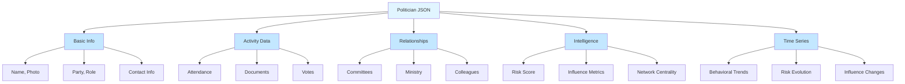

## Data Flow

```mermaid
graph LR
    A[CDN Endpoint] -->|fetch| B[Browser Cache]
    B -->|parse| C[JSON Parser]
    C -->|validate| D[Data Layer]
    D -->|transform| E[View Model]
    E -->|render| F[Visualization]
    F -->|display| G[User Interface]
    
    style A fill:#d4edda
    style B fill:#d4edda
    style C fill:#d4edda
    style D fill:#d4edda
    style E fill:#d4edda
    style F fill:#d4edda
    style G fill:#d4edda
```

## Component Architecture

```mermaid
graph TB
    A[PoliticianProfile] --> B[ProfileHeader]
    A --> C[ActivitySection]
    A --> D[NetworkSection]
    A --> E[IntelligenceSection]
    A --> F[TimeSeriesSection]
    
    B --> B1[PhotoCard]
    B --> B2[BasicInfo]
    B --> B3[PartyBadge]
    B --> B4[StatusIndicators]
    
    C --> C1[AttendanceChart]
    C --> C2[DocumentList]
    C --> C3[VotingRecord]
    
    D --> D1[NetworkGraph]
    D --> D2[RelationshipMap]
    D --> D3[CollaborationMatrix]
    
    E --> E1[RiskGauge]
    E --> E2[InfluenceScore]
    E --> E3[CentralityMetrics]
    
    F --> F1[TrendChart]
    F --> F2[EvolutionTimeline]
    F --> F3[PredictionView]
    
    style A fill:#fff3cd
    style B fill:#ffe69c
    style C fill:#ffe69c
    style D fill:#ffe69c
    style E fill:#ffe69c
    style F fill:#ffe69c
```

## User Interaction Flow

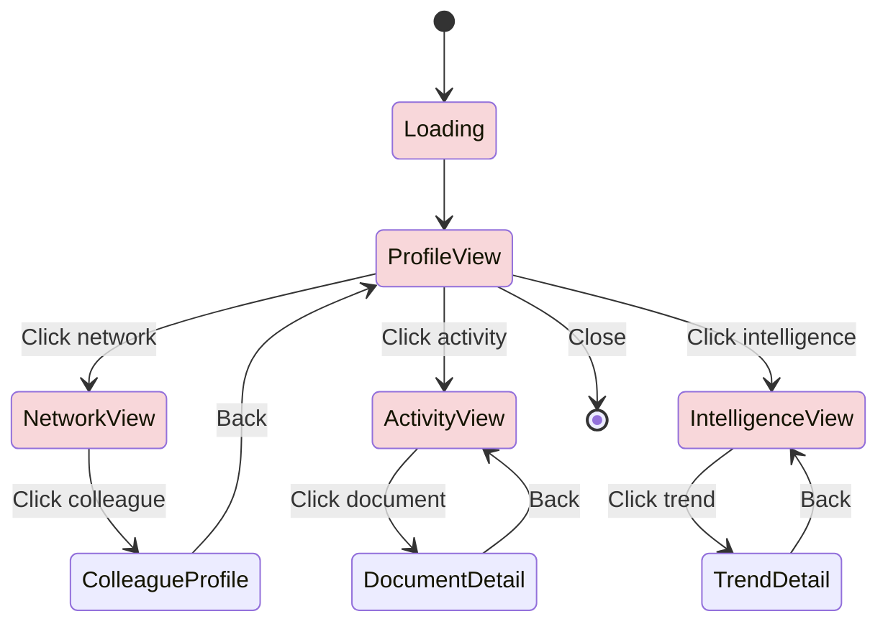

## Visualization Types

### 1. Profile Header Card

### 2. Network Graph Structure

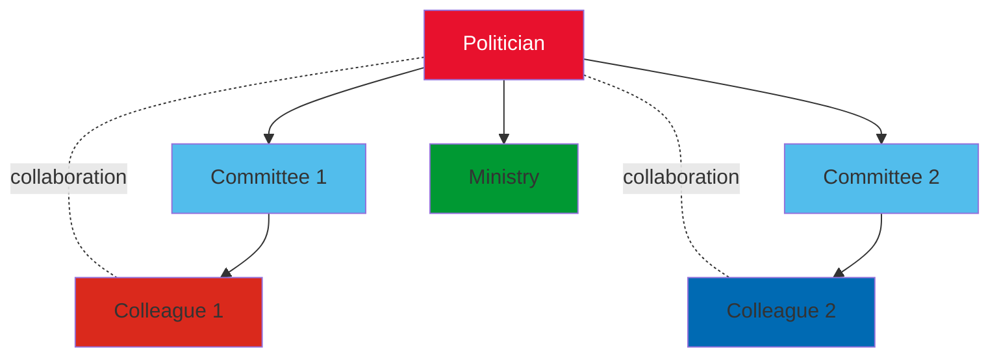

### 3. Activity Timeline

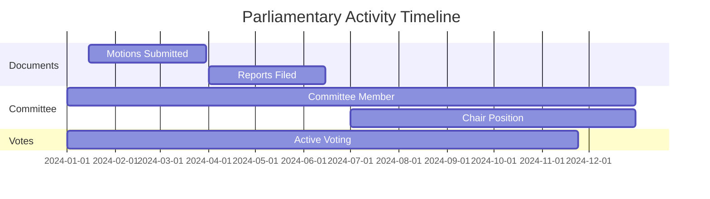

### 4. Performance Dashboard

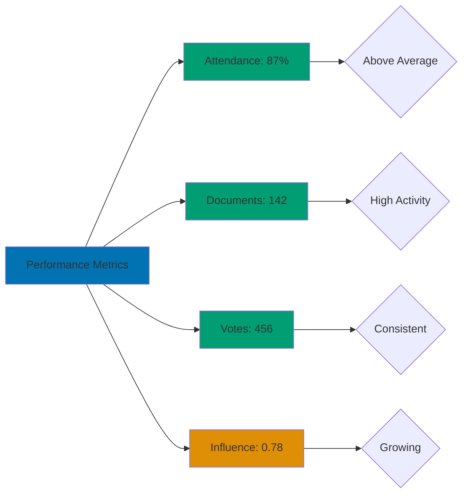

### 5. Intelligence Metrics

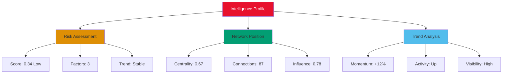

## Swedish Party Colors

## Responsive Layout

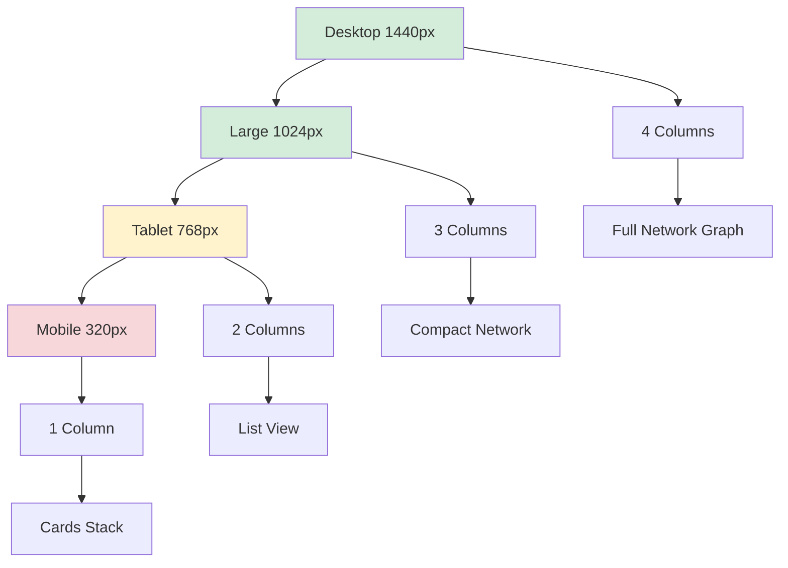

## Accessibility Flow

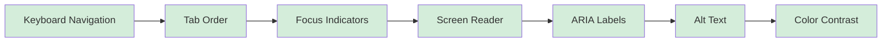

## Data Loading States

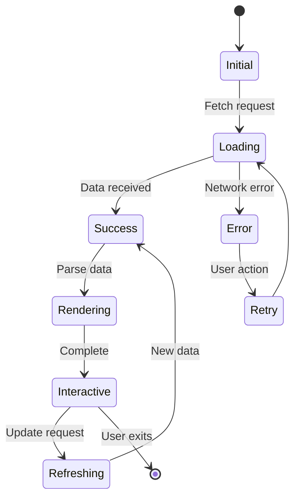

## Features

- **Profile Card**: Photo, name, party affiliation, role, contact information
- **Network Graph**: Relationships with committees, colleagues, ministries
- **Activity Timeline**: Documents, votes, committee participation over time
- **Performance Metrics**: Attendance, productivity, engagement scores
- **Intelligence Dashboard**: Risk assessment, influence metrics, network centrality
- **Trend Analysis**: Behavioral patterns, risk evolution, momentum indicators

## Usage Scenarios

1. **Journalist Research**: Quick profile overview with key intelligence metrics
2. **Voter Information**: Comprehensive activity record and voting history
3. **Network Analysis**: Understanding political relationships and influence
4. **Accountability Tracking**: Attendance, document production, engagement
5. **Predictive Analytics**: Risk assessment, trend forecasting

## Integration Points

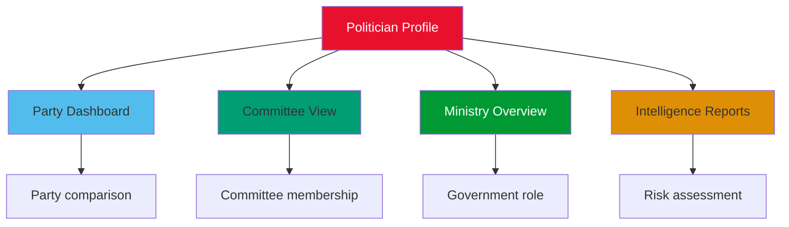

## Performance Considerations

- Lazy load network graph for 50+ connections
- Virtualize document lists for 100+ items
- Cache profile data for 1 hour
- Progressive image loading for photos
- Debounce search/filter interactions (300ms)

---

**JSON Source**: `/v1.0.0/politicians/profiles/{id}.json`
**Update Frequency**: Daily (02:00 UTC)
**Cache Duration**: 1 hour
**Bundle Size**: ~5KB (profile card only), ~50KB (full profile with network)
