# Top 10 Coalition Brokers

**Last Updated**: 2024-11-24

## Overview

Politicians with highest cross-party influence and coalition-building capacity, identifying key deal-makers and consensus-builders in Swedish Riksdag.

## Coalition Broker Rankings

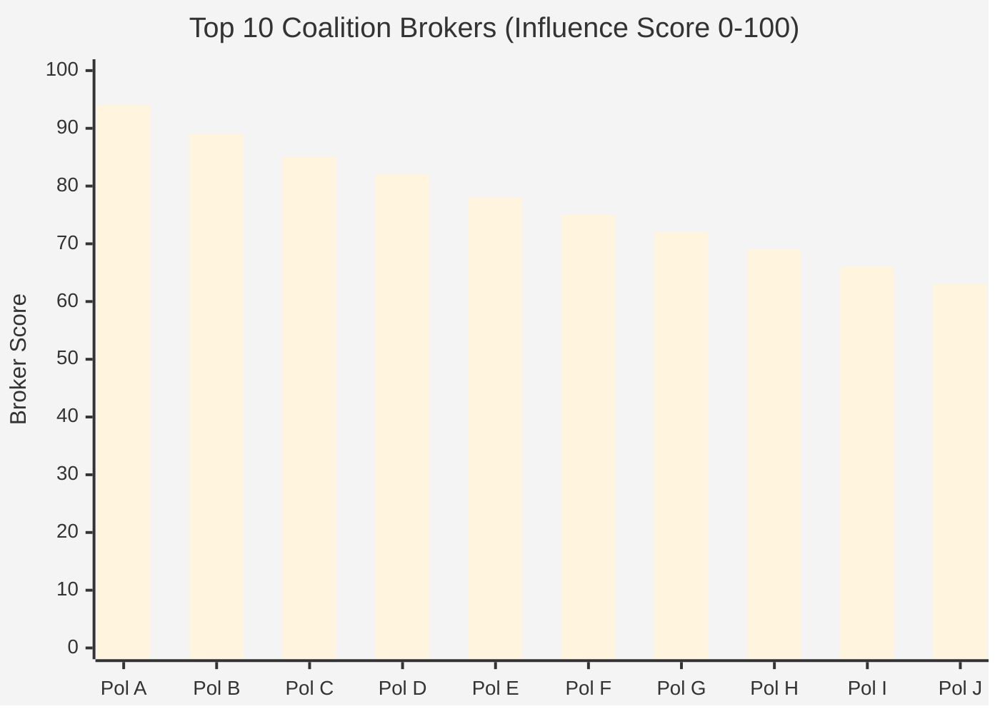

## Cross-Party Collaboration Network

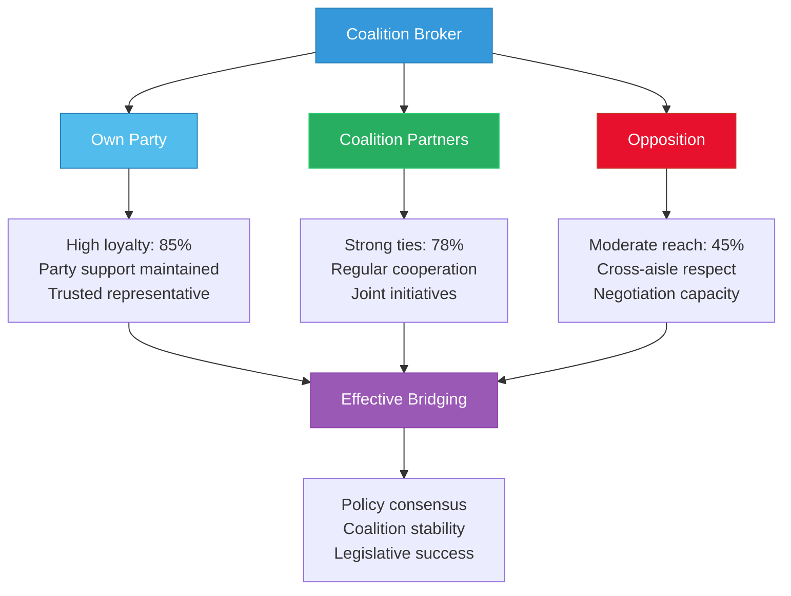

## Broker Types

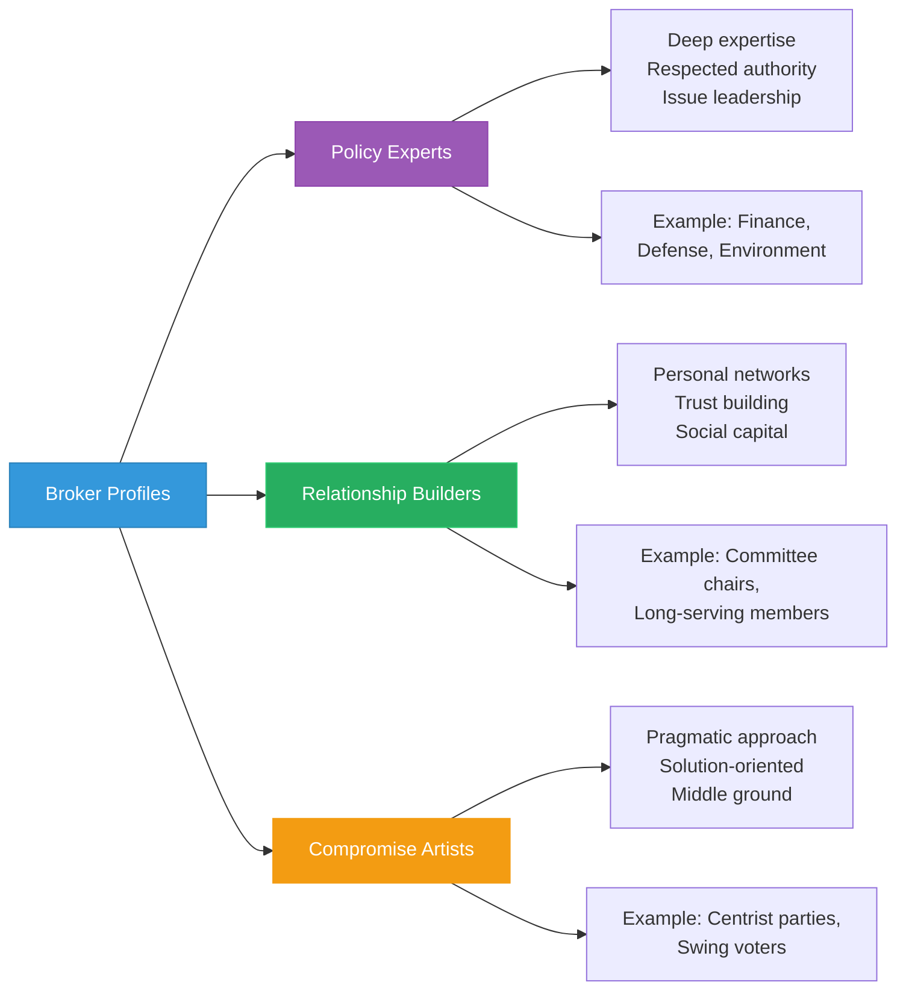

## Co-Sponsorship Network

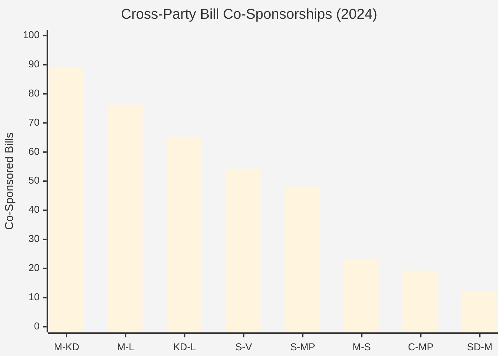

## Bridge Score Calculation

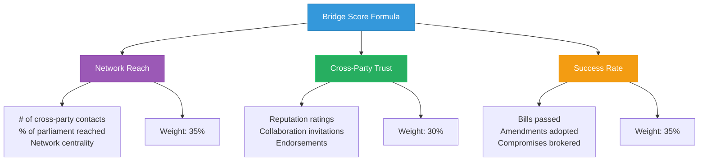

## Party Distribution

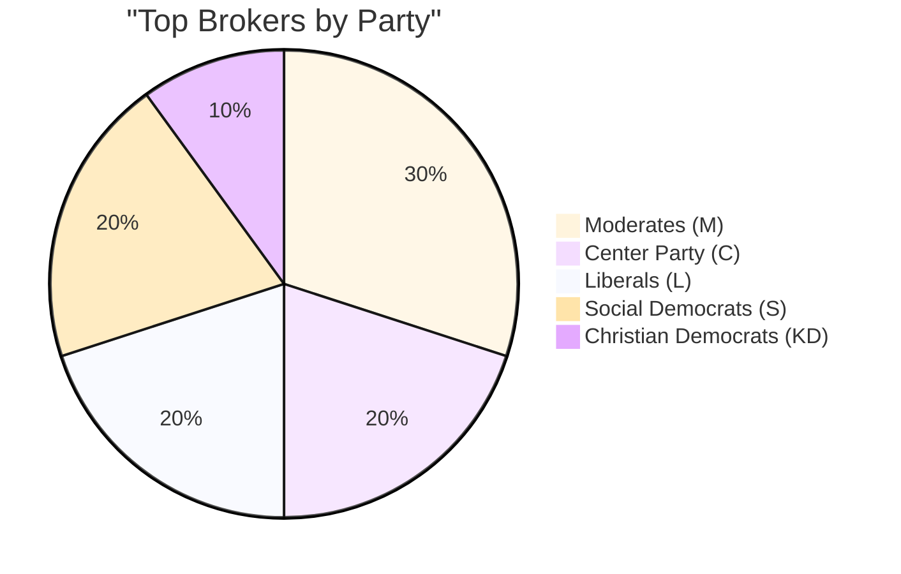

## Issue Areas

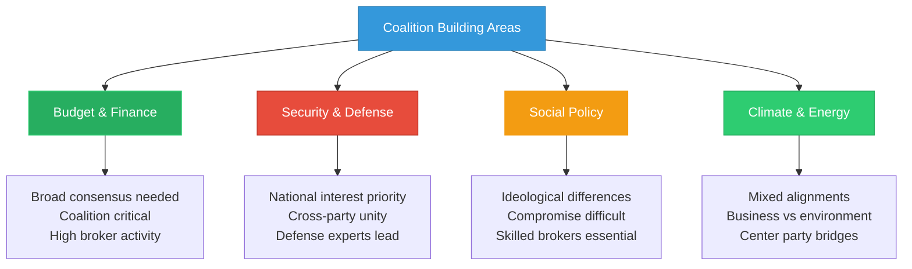

## Negotiation Success Timeline

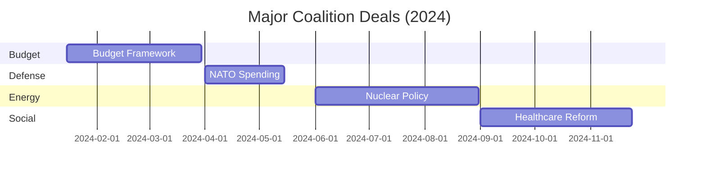

## Influence Mechanisms

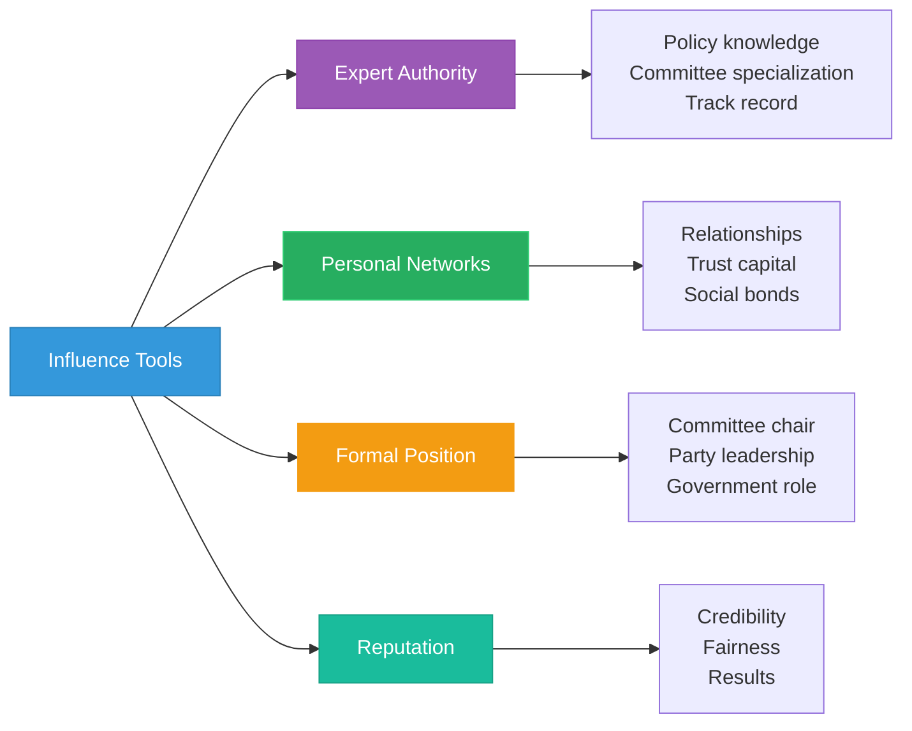

## Coalition Stability Contribution

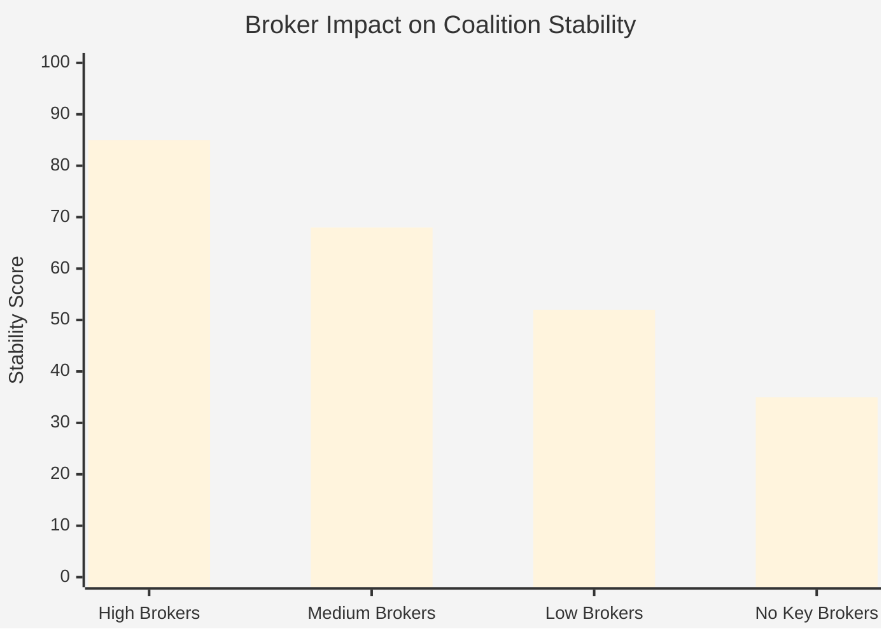

## Centrality Metrics

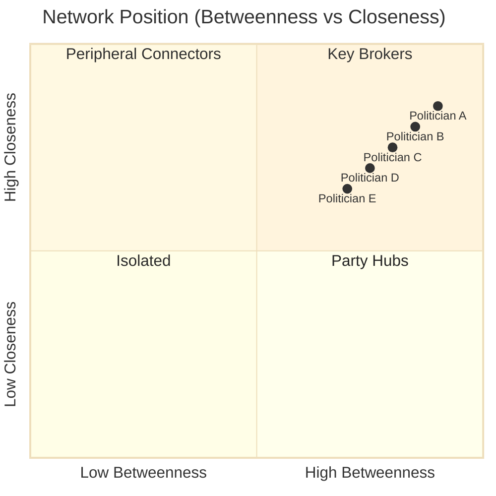

## Historical Impact

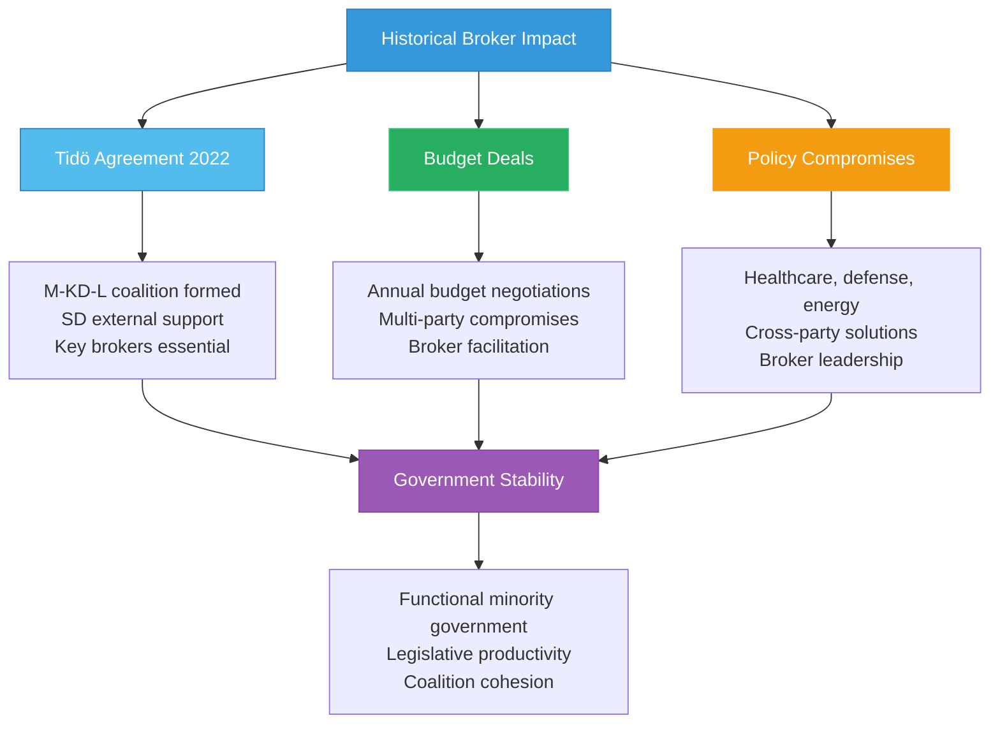

## Features

- **Broker Rankings**: Top 10 politicians by coalition-building capacity
- **Network Analysis**: Visualization of cross-party relationships
- **Broker Typology**: Classification by influence style
- **Co-Sponsorship Tracking**: Quantified cross-party collaboration
- **Success Metrics**: Deal completion and effectiveness rates
- **Issue Area Analysis**: Where brokers have most impact
- **Influence Mechanisms**: How brokers build and deploy power
- **Stability Impact**: Contribution to government cohesion

## Usage Scenarios

1. **Coalition Analysis**: Understanding government formation dynamics
2. **Legislative Strategy**: Identifying key influencers for policy passage
3. **Party Planning**: Recruiting effective negotiators
4. **Media Analysis**: Profiling consensus-builders vs ideologues
5. **Academic Research**: Network analysis of parliamentary behavior
6. **Civic Education**: Demonstrating compromise in democracy

## Data Sources

- **Primary Views**:
  - `view_riksdagen_coalition_alignment_matrix` - Party coalition patterns
  - `view_riksdagen_politician` - Individual politician profiles
  - `view_riksdagen_vote_data_ballot_politician_summary_annual` - Cross-party voting
- **Network Metrics**:
  - Betweenness centrality - Bridge position between party clusters
  - Closeness centrality - Access to broader network
  - Degree centrality - Number of cross-party connections
- **Collaboration Indicators**:
  - Bill co-sponsorship across party lines
  - Cross-party voting alignment
  - Committee cooperation patterns
  - Coalition negotiation participation
- **Bridge Score Components**:
  - Network Reach (35%): Cross-party contact breadth
  - Trust (30%): Reputation and collaboration invitations
  - Success (35%): Deal completion and compromise effectiveness
- **Update Frequency**: Monthly (network metrics), Weekly (activity data)
- **Historical Data**: 2018-2024 for long-term pattern analysis
- **Validation**: Peer nominations, committee records, coalition formation history

## Swedish Political Context

Sweden's minority government system requires constant coalition-building. The current government (M-KD-L with 107 seats) relies on SD support (73 seats) for a working majority. This necessitates skilled brokers who can maintain coalition unity while securing external support. Cross-party collaboration is also essential on specific issues like defense, where broad parliamentary consensus is tradition.

---

**Last Review**: 2024-11-24  
**Visualization Version**: 1.0.0  
**Compliance**: WCAG 2.1 AA
