# Top 10 Electoral Risk Politicians

**Last Updated**: 2024-11-24

## Overview

Politicians facing highest electoral risk in the 2026 election based on multi-factor risk assessment including polling, scandals, attendance, and district vulnerability.

## Electoral Risk Rankings

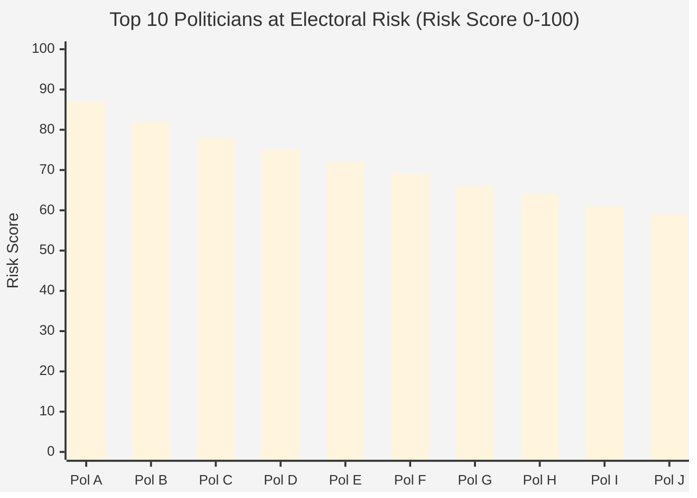

## Risk Factor Breakdown

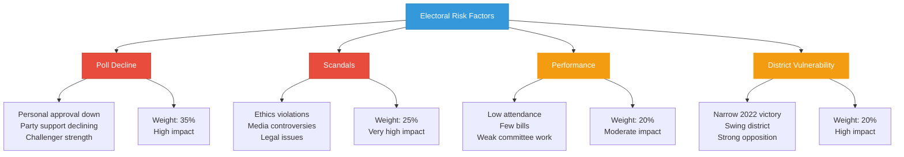

## Risk by Party

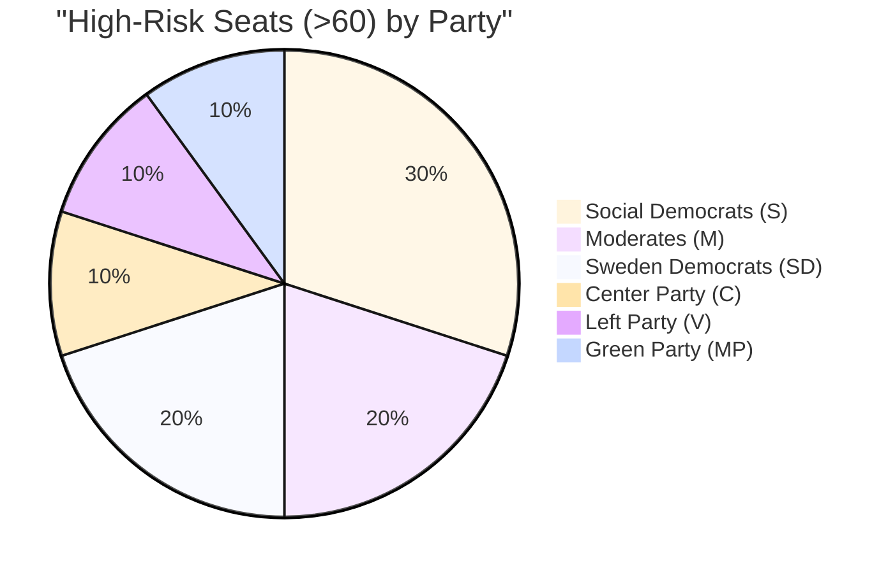

## Risk Category Distribution

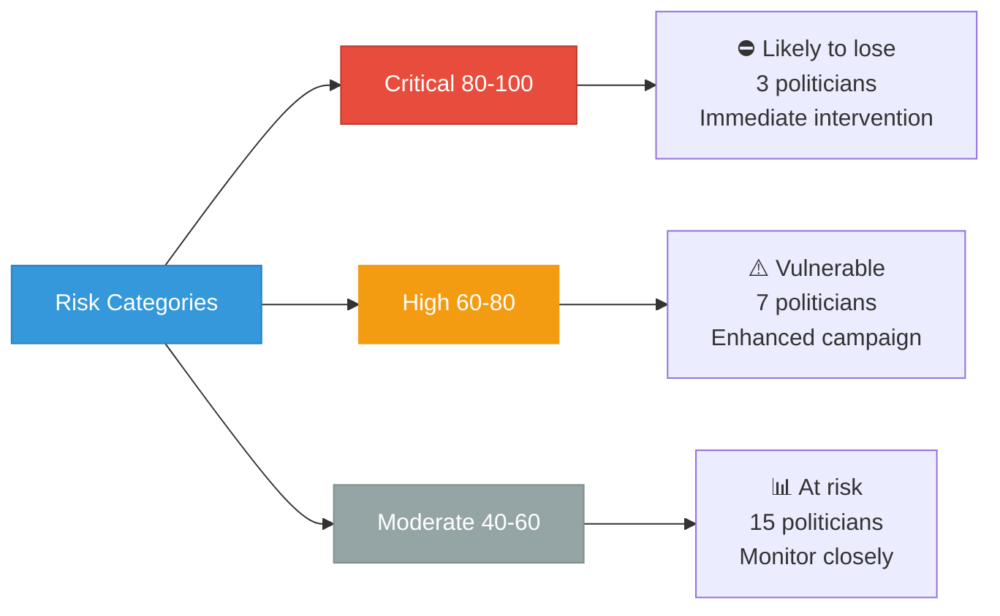

## District Vulnerability Map

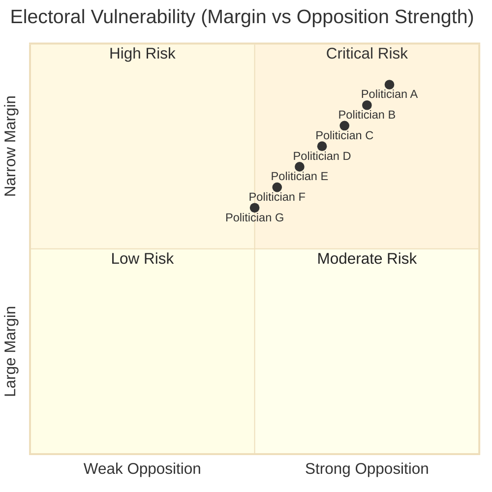

## Trend Analysis

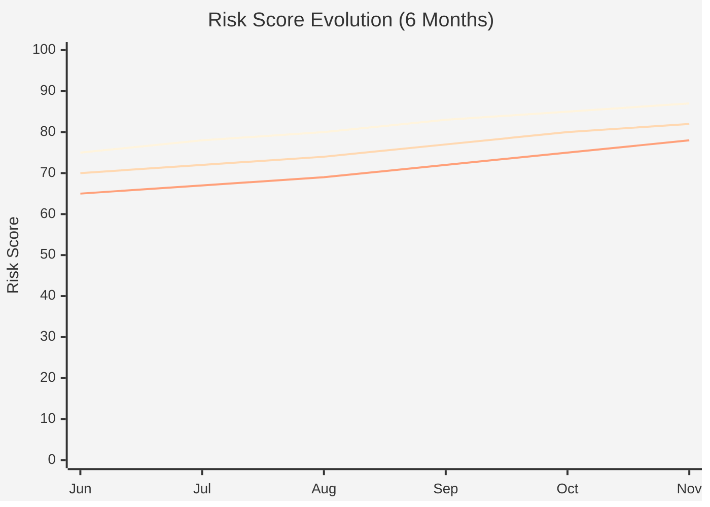

## Scandal Impact Assessment

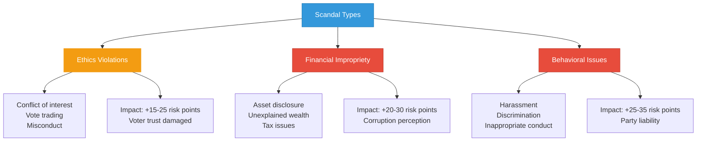

## Campaign Strength Comparison

```mermaid
%%{init: {'theme':'base'}}%%
xychart-beta
    title "Incumbent vs Challenger Strength"
    x-axis ["Pol A", "Pol B", "Pol C", "Pol D", "Pol E"]
    y-axis "Strength Score" 0 --> 100
    bar [45, 52, 48, 55, 50]
    bar [72, 68, 70, 65, 67]
```

## Recovery Strategies

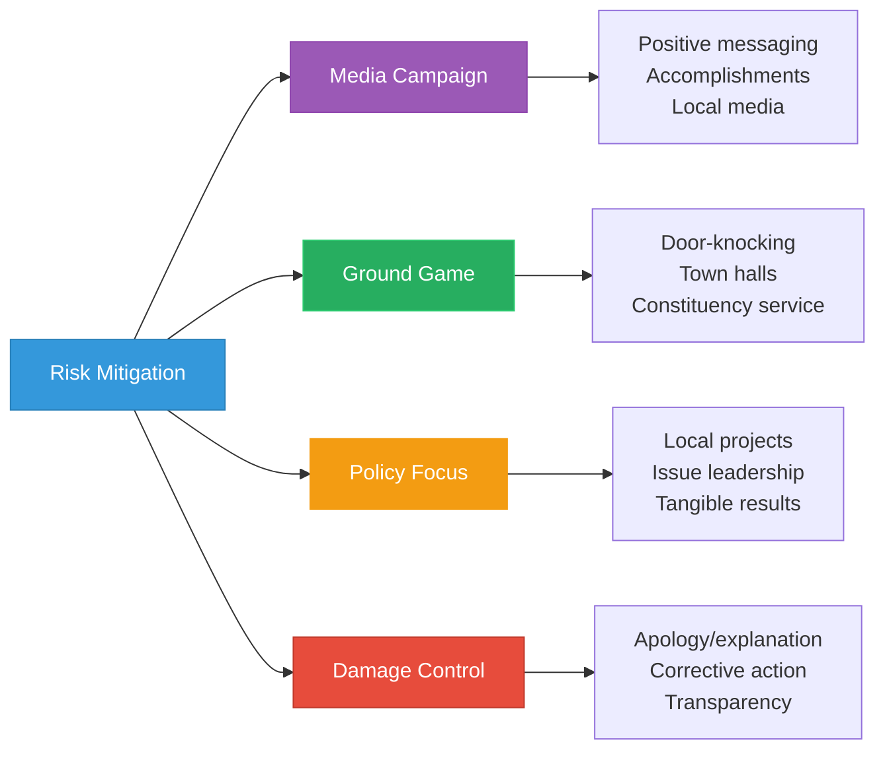

## Historical Seat Loss Correlation

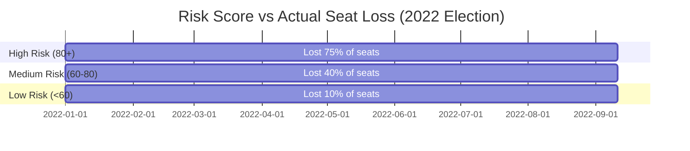

## Party Strategy Implications

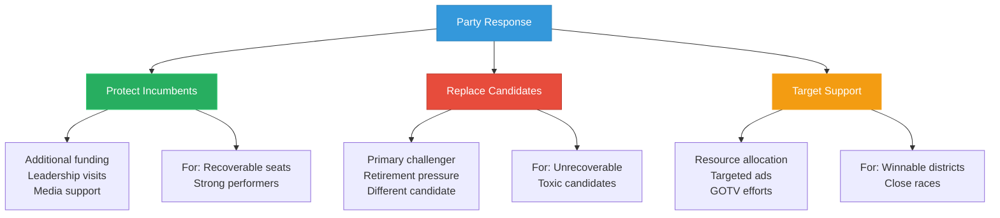

## Features

- **Risk Rankings**: Comprehensive risk scores for top 10 vulnerable politicians
- **Multi-Factor Model**: Combines polling, scandals, performance, and district factors
- **Trend Tracking**: Six-month evolution of risk scores
- **Party Analysis**: Distribution of at-risk seats across parties
- **Scandal Impact**: Quantified effect of different scandal types
- **Recovery Strategies**: Evidence-based mitigation approaches
- **Historical Validation**: Correlation with actual 2022 election outcomes
- **Strategic Implications**: Party decision-making guidance

## Usage Scenarios

1. **Campaign Planning**: Target resources to vulnerable incumbents
2. **Opposition Research**: Identify challenger opportunities
3. **Media Analysis**: Electoral vulnerability reporting
4. **Party Strategy**: Candidate replacement decisions
5. **Voter Information**: Understanding competitive races
6. **Polling Guidance**: Priority districts for surveying

## Data Sources

- **Primary Views**: 
  - `view_politician_behavioral_trends` - Behavioral metrics and risk assessment
  - `view_politician_risk_summary` - Aggregated risk indicators
  - `view_riksdagen_vote_data_ballot_politician_summary_annual` - Voting patterns
- **Supplementary Data**: 
  - Electoral margin data (2022 election results)
  - District competitiveness indicators
  - External polling data (when available)
- **Key Columns**:
  - `behavioral_assessment` - EXCELLENT_BEHAVIOR to CRITICAL_CONCERN
  - `avg_absence_rate` - Attendance performance
  - `avg_win_rate` - Legislative effectiveness
  - `effectiveness_status` - Classification level
- **Risk Model Components** (Weighted):
  - Poll Decline (35%): Trends in support metrics
  - Scandals (25%): Ethics violations and media controversies
  - Performance (20%): Attendance + effectiveness + productivity metrics
  - District (20%): Electoral margin and opponent strength
- **Risk Rules**: Multiple rules including `PoliticianLazy.drl`, `PoliticianIneffectiveVoting.drl`
- **Update Frequency**: Weekly (risk scores), Daily (behavioral metrics)
- **Historical Data**: 2018, 2022 elections for validation
- **Predictive Accuracy**: Based on documented behavioral patterns

## Model Details

**Risk Score Calculation:**
- Poll Decline (35%): Personal + party polling trends
- Scandals (25%): Ethics violations, controversies, investigations
- Performance (20%): Attendance, productivity, committee work
- District (20%): 2022 margin, opponent strength, demographics

**Risk Thresholds:**
- Critical (80-100): >75% probability of seat loss
- High (60-80): 40-75% probability of seat loss
- Moderate (40-60): 20-40% probability of seat loss

---

**Last Review**: 2024-11-24  
**Visualization Version**: 1.0.0  
**Compliance**: WCAG 2.1 AA
