# Top 10 Ethics Concerns

**Last Updated**: 2024-11-24

## Overview

Politicians with highest ethics concern scores based on investigations, violations, conflicts of interest, and behavioral issues requiring accountability oversight.

## Ethics Concern Rankings

## Violation Type Distribution

## Investigation Status

```mermaid
graph TB
    STATUS[Investigation Status] --> ACTIVE[Active Investigations]
    STATUS --> CLOSED[Closed Cases]
    STATUS --> PENDING[Pending Review]
    
    ACTIVE --> A1[5 politicians<br/>Ongoing inquiries<br/>Awaiting findings]
    ACTIVE --> A2[⚠️ High priority<br/>Media attention<br/>Potential sanctions]
    
    CLOSED --> C1[3 politicians<br/>Violations confirmed<br/>Sanctions applied]
    C1 --> C2[❌ Proven misconduct<br/>Reputational damage<br/>Electoral impact]
    
    PENDING --> P1[2 politicians<br/>Initial complaints<br/>Under review]
    P1 --> P2[�� Monitoring<br/>Evidence gathering<br/>Outcome uncertain]
    
    style STATUS fill:#3498db,stroke:#2980b9,color:#fff
    style ACTIVE fill:#f39c12,stroke:#f39c12,color:#fff
    style CLOSED fill:#e74c3c,stroke:#c0392b,color:#fff
    style PENDING fill:#95a5a6,stroke:#7f8c8d,color:#fff
```

## Severity Classification

```mermaid
graph LR
    A[Severity Levels] --> B[Critical 80-100]
    A --> C[High 60-80]
    A --> D[Moderate 40-60]
    A --> E[Minor <40]
    
    B --> B1[⛔ Resignation warranted<br/>Criminal referral<br/>Party expulsion risk]
    
    C --> C1[⚠️ Formal sanctions<br/>Committee removal<br/>Public censure]
    
    D --> D1[📊 Warning issued<br/>Corrective action<br/>Monitoring required]
    
    E --> E1[✅ Minor infraction<br/>Counseling<br/>No formal action]
    
    style A fill:#3498db,stroke:#2980b9,color:#fff
    style B fill:#e74c3c,stroke:#c0392b,color:#fff
    style C fill:#f39c12,stroke:#f39c12,color:#fff
    style D fill:#95a5a6,stroke:#7f8c8d,color:#fff
    style E fill:#27ae60,stroke:#2ecc71,color:#fff
```

## Conflict of Interest Network

## Timeline of Incidents

## Party Response Matrix

## Impact on Public Trust

## Sanctions Applied

## Recidivism Analysis

## Electoral Consequences

## Whistleblower Sources

## Features

- **Severity Rankings**: Top 10 politicians by ethics concern score
- **Violation Types**: Comprehensive categorization of misconduct
- **Investigation Tracking**: Status of active, closed, and pending cases
- **Conflict Analysis**: Network mapping of interests and relationships
- **Sanctions Record**: Documentation of disciplinary actions
- **Recidivism Monitoring**: Tracking of repeat offenders
- **Electoral Impact**: Assessment of political consequences
- **Public Trust**: Impact on voter confidence metrics

## Usage Scenarios

1. **Accountability Journalism**: Ethics violation reporting and investigation
2. **Voter Information**: Informed voting decisions on candidate integrity
3. **Party Oversight**: Internal discipline and candidate screening
4. **Electoral Strategy**: Opposition research and campaign messaging
5. **Public Trust Monitoring**: Democratic health assessment
6. **Reform Advocacy**: Evidence for ethics rule strengthening

## Data Sources

- **Source**: `view_riksdagen_politician`, ethics committee records, media reports
- **Violation Database**: 45 documented cases (2022-2024)
- **Update Frequency**: Weekly (active cases), As-needed (new violations)
- **Verification**: Multiple source corroboration required
- **Privacy**: Public information only, no unsubstantiated allegations

## Ethics Framework

**Swedish Parliamentary Code of Conduct:**
- Conflict of interest disclosure
- Financial transparency requirements
- Professional behavior standards
- Public resource usage rules
- Lobbying interaction limits

**Enforcement Mechanisms:**
- Parliamentary ethics committee
- Party disciplinary procedures
- Media and public scrutiny
- Electoral accountability
- Legal prosecution (severe cases)

---

**Last Review**: 2024-11-24  
**Visualization Version**: 1.0.0  
**Compliance**: WCAG 2.1 AA
