# Top 10 Media Presence

**Last Updated**: 2024-11-24

## Overview

Politicians with highest media visibility and public profile, tracking news coverage, social media engagement, and public communication effectiveness.

## Media Visibility Rankings

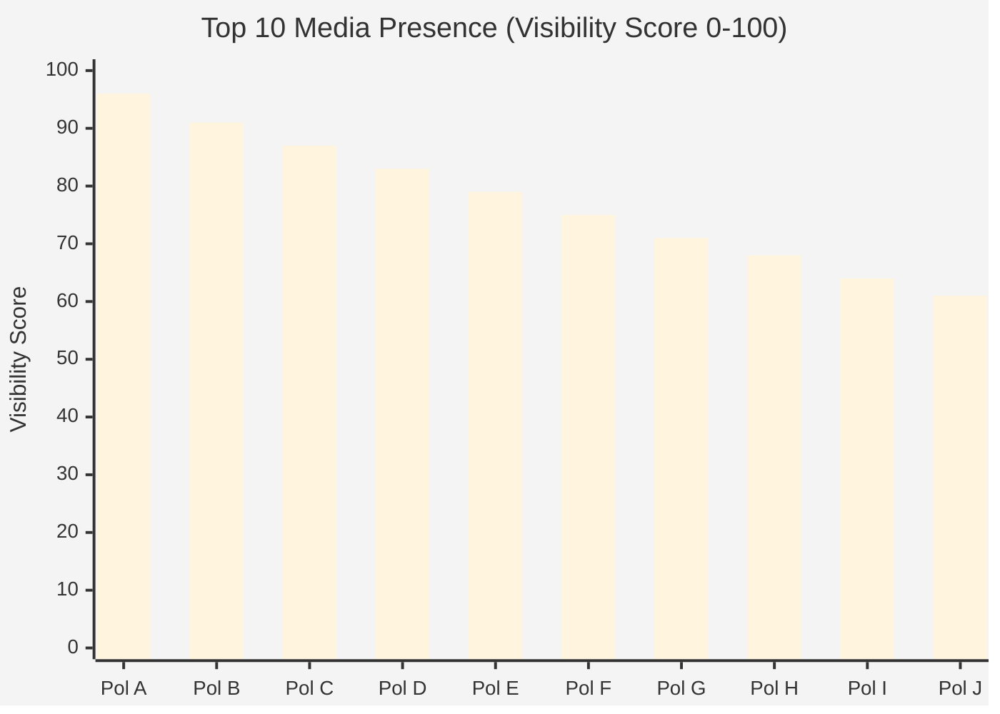

## Media Channel Distribution

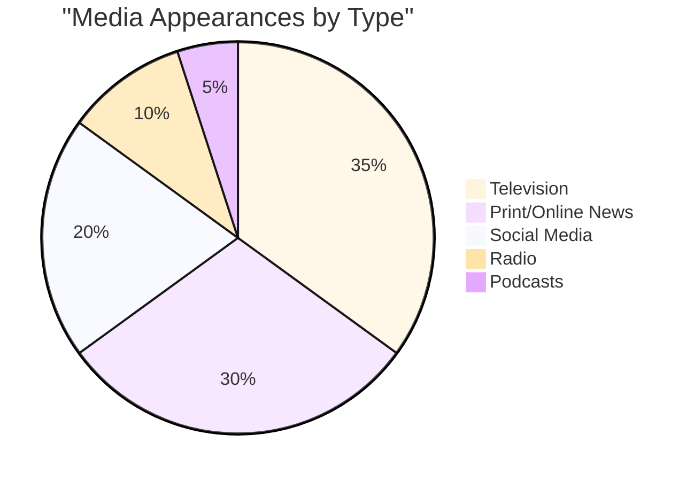

## Sentiment Analysis

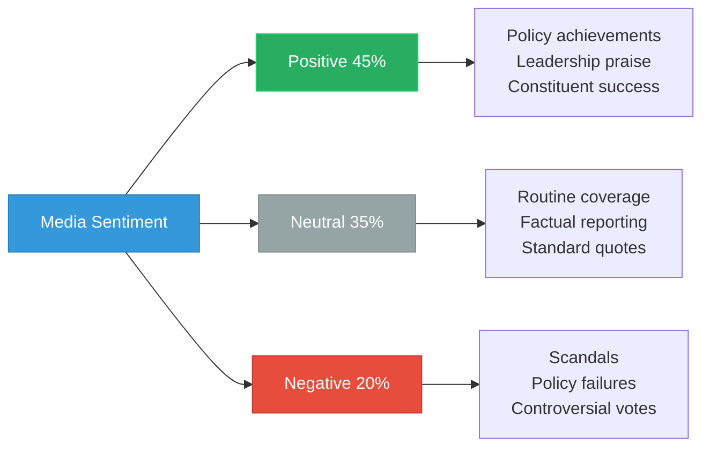

## Visibility Trend Timeline

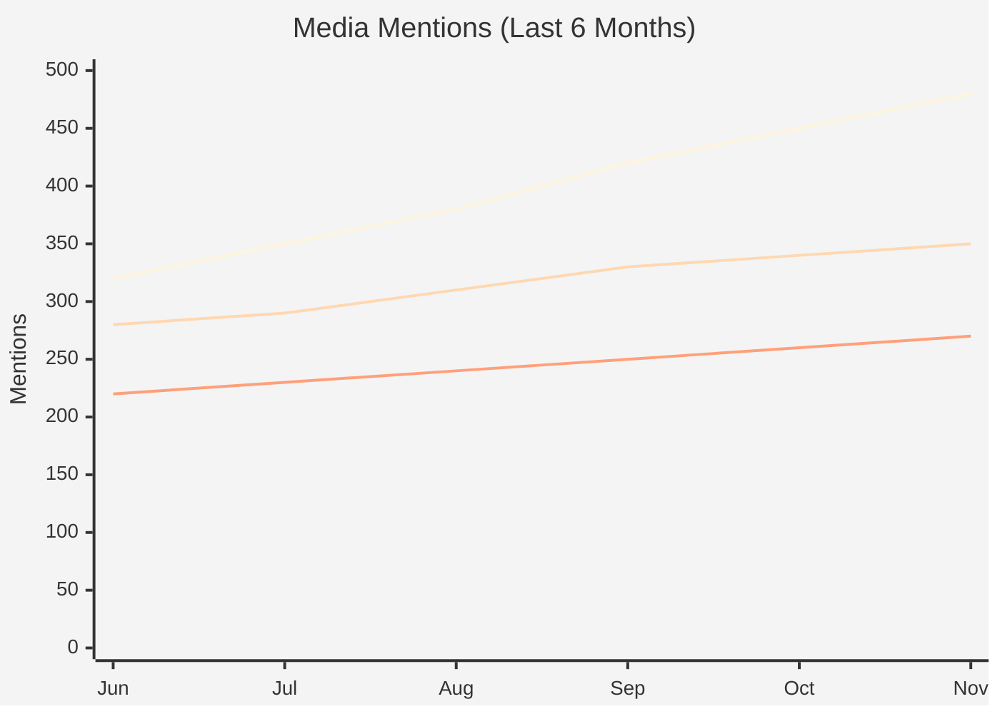

## Communication Channels

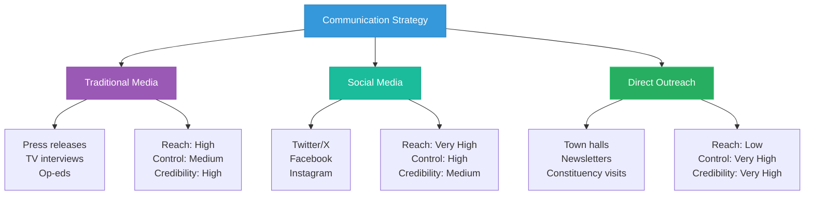

## Social Media Engagement

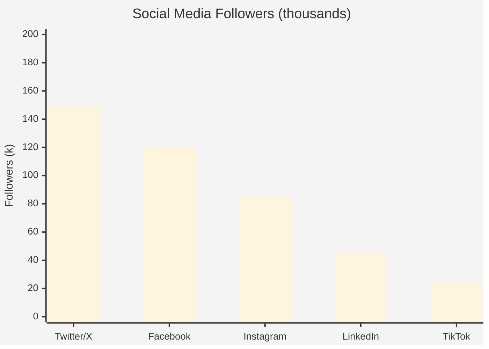

## Media Strategy Types

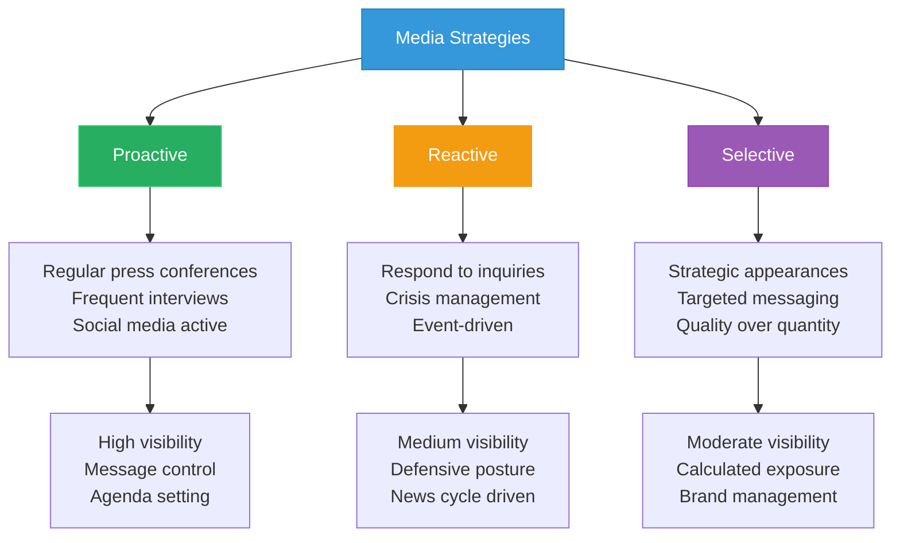

## Party Leadership Correlation

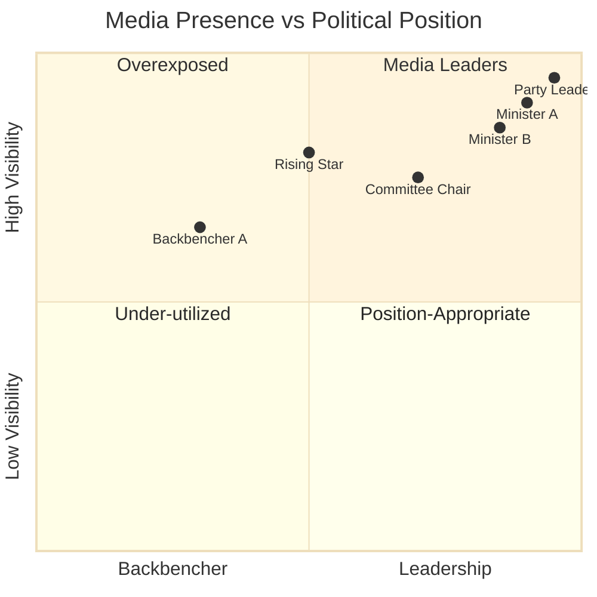

## News Cycle Presence

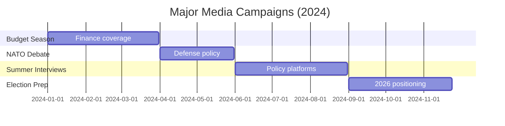

## Visibility by Policy Area

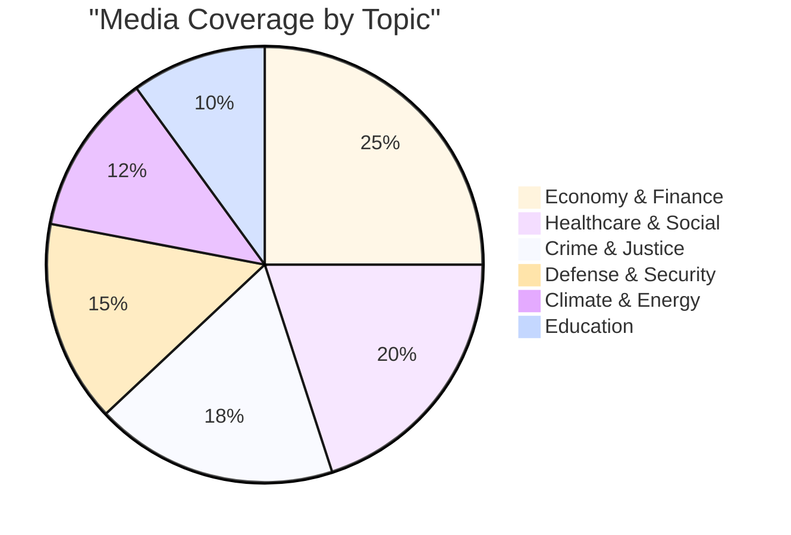

## Interview Acceptance Rate

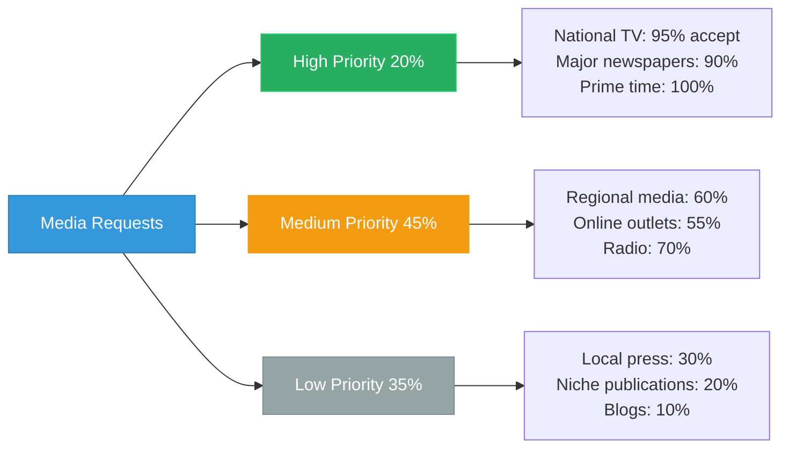

## Message Discipline Analysis

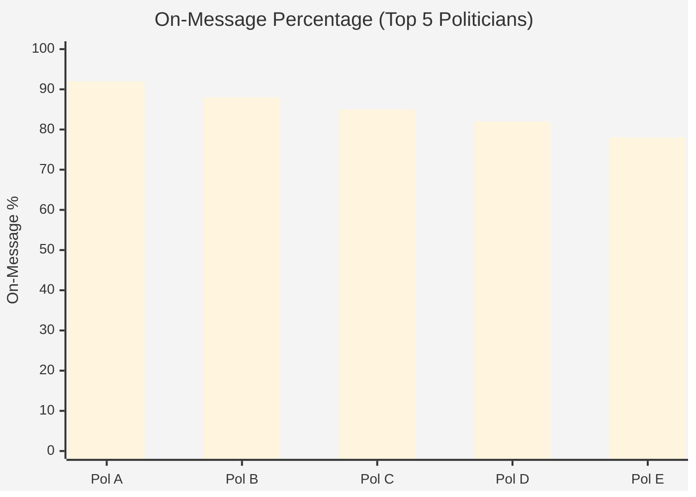

## Electoral Impact of Media Presence

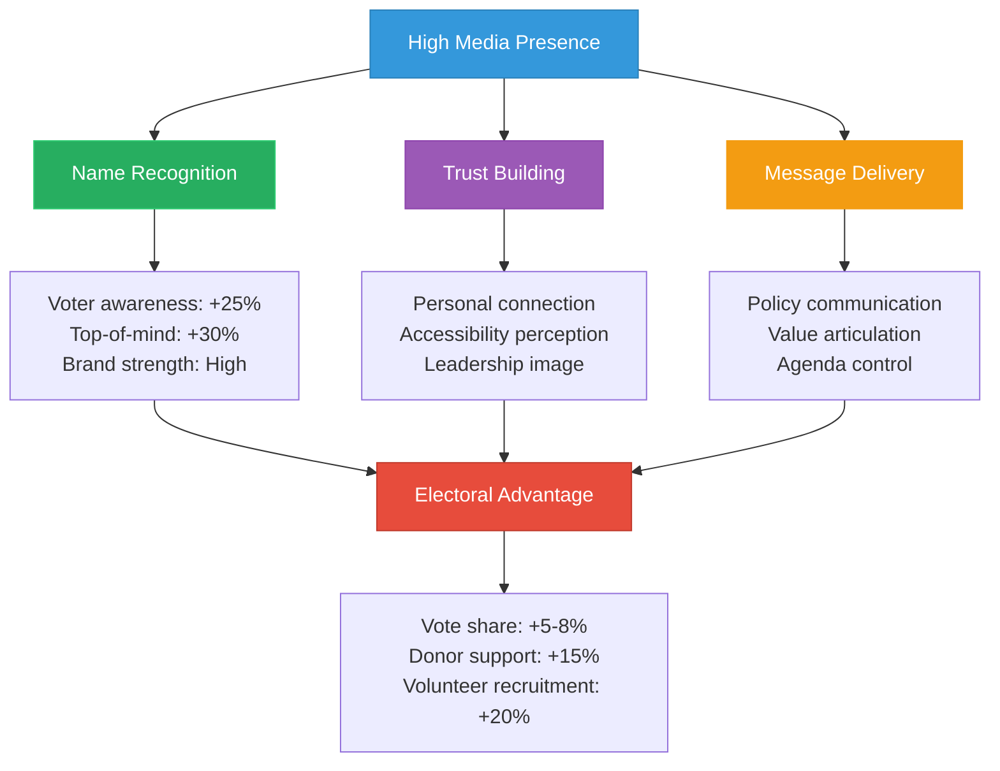

## Features

- **Visibility Rankings**: Top 10 politicians by media presence score
- **Channel Analysis**: Distribution across media types
- **Sentiment Tracking**: Positive, neutral, and negative coverage ratios
- **Trend Monitoring**: Six-month visibility trajectory
- **Strategy Types**: Classification of media approach
- **Engagement Metrics**: Social media follower counts and interaction rates
- **Topic Analysis**: Policy areas receiving most coverage
- **Electoral Impact**: Correlation between visibility and political success

## Usage Scenarios

1. **Campaign Planning**: Assess media strategy effectiveness
2. **Opposition Research**: Identify visibility gaps and opportunities
3. **Journalist Source Selection**: Find accessible, quotable politicians
4. **Public Relations**: Benchmark against peer visibility
5. **Voter Information**: Understand who shapes public discourse
6. **Academic Research**: Study media influence on politics

## Data Sources

- **Media Monitoring**:
  - National and regional news outlets (print, broadcast, digital)
  - Press release tracking and official communications
  - Social media APIs (Twitter/X, Facebook, Instagram)
  - Podcast and radio appearance tracking
- **Coverage Metrics**:
  - Mention frequency across media types
  - Sentiment analysis (positive, neutral, negative tone)
  - Visibility scores (weighted by media reach)
  - Share of voice compared to peers
- **Social Media Analytics**:
  - Follower counts and growth rates
  - Engagement metrics (likes, shares, comments)
  - Content frequency and consistency
  - Audience demographics
- **Primary Data Sources**:
  - Press office data and media relations records
  - Parliamentary communication logs
  - Public appearance schedules
- **Visibility Calculation**:
  - Television (35%): Broadcast reach and frequency
  - Print/Online News (30%): Articles and features
  - Social Media (20%): Follower count and engagement
  - Radio/Podcasts (10%): Audio appearances
  - Other (5%): Events, interviews, miscellaneous
- **Update Frequency**: Daily (media mentions), Weekly (aggregated scores)
- **Historical Data**: 24 months for trend analysis
- **Sentiment Processing**: AI-powered natural language processing with human validation

## Swedish Media Landscape

Sweden has a diverse media ecosystem with strong public broadcasting (SVT, SR), major newspapers (DN, SvD, Aftonbladet, Expressen), and active social media presence. Politicians use a mix of traditional and digital channels to reach voters. Media visibility correlates with political influence but can be a double-edged sword if coverage is predominantly negative.

---

**Last Review**: 2024-11-24  
**Visualization Version**: 1.0.0  
**Compliance**: WCAG 2.1 AA
