# Top 10 Most Absent Politicians

**Last Updated**: 2024-11-24

## Overview

Ranking of Swedish politicians with highest absence rates in parliamentary sessions, providing accountability metrics and electoral risk assessment.

## Absence Rankings

## Risk Assessment by Absence Level

```mermaid
graph TD
    A[Absence Analysis] --> B[Critical >40%]
    A --> C[High 30-40%]
    A --> D[Elevated 20-30%]
    
    B --> B1[⛔ Immediate Action<br/>Re-election risk: Very High<br/>Constituents neglected]
    B --> B2[Examples: 2 politicians<br/>Party discipline required]
    
    C --> C1[⚠️ Warning Level<br/>Re-election risk: High<br/>Media scrutiny likely]
    C --> C2[Examples: 3 politicians<br/>Improvement needed]
    
    D --> D1[📊 Monitor<br/>Re-election risk: Moderate<br/>Acceptable with justification]
    D --> D2[Examples: 5 politicians<br/>Watch for trends]
    
    style A fill:#3498db,stroke:#2980b9,color:#fff
    style B fill:#e74c3c,stroke:#c0392b,color:#fff
    style C fill:#f39c12,stroke:#f39c12,color:#fff
    style D fill:#f39c12,stroke:#f39c12,color:#fff
```

## Absence by Party

## Absence Trend Timeline

## Impact Assessment

## Absence Reasons Analysis

## Comparative Context

## Electoral Consequences

## Attendance Benchmarks

## Year-over-Year Comparison

## Features

- **Absence Rankings**: Top 10 politicians by percentage of missed sessions
- **Risk Assessment**: Three-tier risk classification system
- **Party Breakdown**: Distribution of high absence across political parties
- **Trend Analysis**: Six-month rolling average showing trajectory
- **Impact Analysis**: Consequences for constituents, legislation, and committees
- **Reason Analysis**: Classification of absence justifications
- **Electoral Risk**: Predicted impact on re-election prospects
- **Benchmarking**: Comparison to average attendance rates

## Usage Scenarios

1. **Voter Information**: Constituent access to representative attendance
2. **Media Reporting**: Accountability journalism on parliamentary performance
3. **Party Discipline**: Internal monitoring of member participation
4. **Electoral Analysis**: Predicting vulnerable incumbents
5. **Public Accountability**: Transparency in representative duty fulfillment
6. **Committee Planning**: Understanding attendance patterns for scheduling

## Data Sources

- **Primary View**: `view_politician_behavioral_trends` - Behavioral pattern analysis with temporal granularity
- **Supplementary Views**: 
  - `view_riksdagen_vote_data_ballot_politician_summary_annual` - Annual voting and absence data
  - `view_riksdagen_politician` - Core politician profile information
- **Key Columns**: 
  - `avg_absence_rate` (NUMERIC 5,2) - Percentage absent from votes
  - `attendance_status` (VARCHAR 50) - Classification level
  - `absence_trend` (NUMERIC 5,2) - Change from previous period
  - `behavioral_assessment` (VARCHAR 50) - Overall risk assessment
- **Classification Thresholds** (from view_politician_behavioral_trends):
  - EXCELLENT_ATTENDANCE: <5% absence
  - GOOD_ATTENDANCE: 5-10% absence
  - MODERATE_ABSENTEEISM: 10-20% absence
  - HIGH_ABSENTEEISM: 20-30% absence
  - CRITICAL_ABSENTEEISM: >30% absence
- **Risk Rules**: References `PoliticianLazy.drl` (Salience 10-150 based on absence level)
- **Update Frequency**: Materialized view refresh (daily for vote summaries)
- **Historical Data**: 24 months rolling window with monthly granularity

## Context

Parliamentary attendance is a fundamental duty of elected representatives. While some absences are unavoidable (illness, official duties), chronic absenteeism undermines democratic representation and constituent service. The Swedish Riksdag does not have formal attendance requirements, but public accountability through transparency serves as the primary enforcement mechanism. Media coverage and voter awareness of attendance records can significantly impact electoral outcomes.

---

**Last Review**: 2024-11-24  
**Visualization Version**: 1.0.0  
**Compliance**: WCAG 2.1 AA
